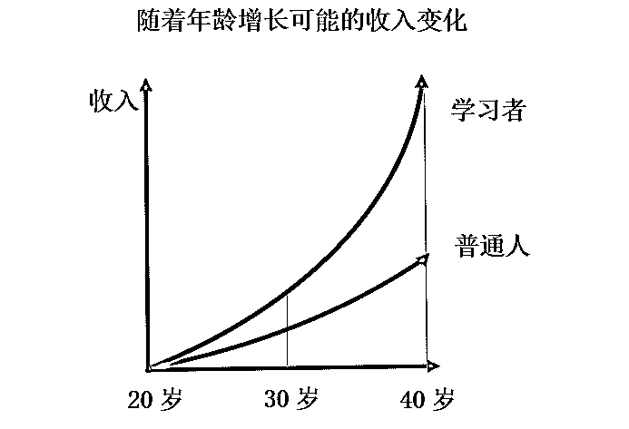
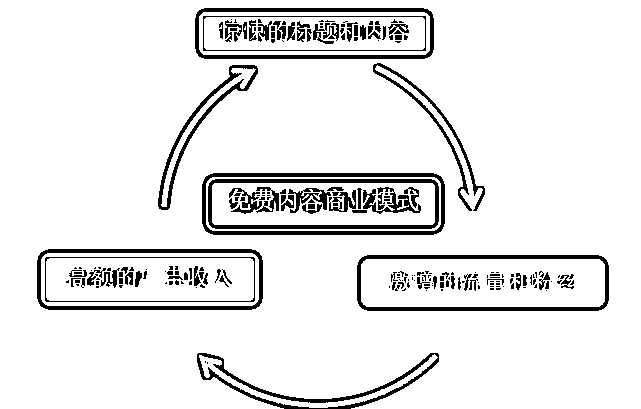
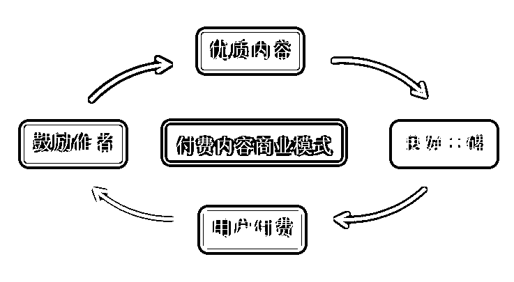
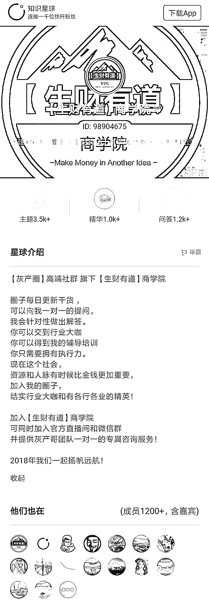

# 互联网思维：别傻了,免费的才是最贵的！永远去为价值付费！

> 原文：[`mp.weixin.qq.com/s?__biz=MzIyMDYwMTk0Mw==&mid=2247492660&idx=1&sn=6c6d4ab5294e9e3dae26bd27e1c07dbf&chksm=97cb2f0ca0bca61adee35717f567a29804d09c2e39acb910d8920100985a266607dfe02bd05d&scene=27#wechat_redirect`](http://mp.weixin.qq.com/s?__biz=MzIyMDYwMTk0Mw==&mid=2247492660&idx=1&sn=6c6d4ab5294e9e3dae26bd27e1c07dbf&chksm=97cb2f0ca0bca61adee35717f567a29804d09c2e39acb910d8920100985a266607dfe02bd05d&scene=27#wechat_redirect)

有人计算过，阅读 1 小时免费内容，相当于损失 100 块。

你或许觉得奇怪，**阅读免费内容最多是没有收获，怎么还会损失金钱呢？**

▼

其实道理很简单，时间就是金钱。

假设一个普通年轻白领，平均每小时收入 34 元（按照月薪六千计算），如果浪费 1 小时，从时间成本的角度来讲，**他这 1 小时就相当于白扔了 34 元。**

这还仅仅是用当下的时薪来计算，并没有算入未来的薪资涨幅。

如果这  1  小时能被用在工作能力的提升上，那**在将来可以获得的回报，一定会远远高于当下的薪水。**

可想而知，眼前所浪费的这 1 小时，也就不仅仅是损失几十块的问题了。

**放到人生的长河里去看，20 岁的毫厘之差，在 20 年后就是云泥之别。**  

 大多数人都能看到刚开始的小差别，但只有少数人能认清，这差距在后续会以指数级增长。而**等到所有人都发现差距时，差距早已无可逆转。**

▼

**你可能会问，阅读免费内容，就一定没有收获吗？**

并不绝对。

这些内容在**拉高你对新奇事物敏感度的同时，也降低了你阅读大段长文的耐心，剥削了你延迟满足的能力。**

不自觉地深陷其中，蓦然回首，才发现其实一无所获。

▼

**这是由免费内容的商业模式所决定的。**

除了少数有情怀的科普作品，大多数免费内容的变现都是通过广告来实现。

为了赚取广告费，创作者就要获取更多的流量，而最快吸引流量的办法，就是提供夺人眼球的内容。

以占有注意力为目的，这些内容往往会把严肃问题娱乐化、复杂逻辑简单化。

亮出的观点总是粗暴直接：“明白这 5 个道理你就能月入十万”，“掌握这 7 个要点你也能给自己看病”。

**标题充满噱头，内容一文不值。**

**原本免费的资源，仔细一算，最终也成了付费的资源。**

**▼**

付费内容的商业模式则不同，它是一个闭环：

**内容的优胜劣汰完全绑定在用户的满意度上**，哗众取宠的付费产品很快就会被市场机制所淘汰。

在知识付费的风口还没有到来的几年前，某二次元视频网站上的用户就积极参加众筹，承包动画新番。

因为他们懂得付费可以节约自己看广告的时间，也能让平台方有能力获取更优质的内容。

**用线下吃一顿快餐都不够的费用，换取优质的内容，最终受益的还是用户自己。**

**而这份共赢互利，就是创作者能够持续产出内容、用户能够长久获得价值的基础。**

▼

有着美国“股神”之称的巴菲特曾说，**世界上最好的投资就是投资自己。**

因为巴菲特明白：靠存款投资维持的收入终究是短期的，随时会失去，可能一次金融风暴、一次房价暴跌，就能让你倾家荡产。

但是靠能力经验维持的收入则不一样，任何客观条件都无法把它抢走，所以也就是世界上最好的投资。

▼

奥地利作家茨威格说过一句话，所有命运赠送的礼物，都在暗中标注了价格。

你所阅读的免费内容，大多数是以损耗专注力、丧失思考力、降低耐心度为代价的。 

 最后怅然发现，**标题很厉害的文章都看过，却依然过不好这一生。**

**▼**

如果你从此刻开始，懂得用付费节省时间成本，高效获取有价值信息。

**把同龄人远远抛下，一骑绝尘，不会再是空想。**

**▼**

在这个世上，有人拼搏奋斗最终突破自我，有人固步自封最终碌碌无为，有人争分夺秒用付费换时间，有人无视青春浪费生命。

**光阴朝夕不等人。你，愿意做哪种人？**

**在这里我们推荐我们灰产圈团队创建的社群【灰产圈】高端社群**

可能很多人没接触过社群，也有很多人加入过很多社群，但或多或少都有大量的低质量的社群充斥网络和创业圈或网赚圈。

很多粉丝向我们反映他们加入的社群都水分都很大！没有达到预想的结果！没学到什么干货！被“割韭菜”！

**假如你有上述问题，欢迎加入我们【灰产圈】高端社群:**

**上图为【灰产圈】高端社群 知识星球平台【生财有道】商学院截图**

**【生财有道】商学院 **

****创立 460 天****

****现社群成员 1200＋（不包含到期会员）****

****精选主题 3500＋（主题包含：项目，课程，问答，教程，软件，技术等）****

****精华内容：1000＋（精华包含：实操项目，引流技术，营销软件，引流脚本，独家黑科技技术和软件）****

****问答内容：1200＋（问答包含：会员咨询，资源对接，项目推介，项目咨询等）****

**社群平台：**

**微信群（3 个微信群） **

**千聊认证直播间（【生财有道】商学院）**

**知识星球（【生财有道】商学院 ）**

**官方微信号（咨询，指导，解答，对接，培训）**

**官网（即将上线）**

【生财有道】商学院 小程序<mp-miniprogram class="miniprogram_element" data-miniprogram-appid="wx4f706964b979122a" data-miniprogram-path="pages/topics/topics?group_id=881854415822" data-miniprogram-nickname="知识星球" data-miniprogram-avatar="http://mmbiz.qpic.cn/mmbiz_png/kialtkOXGKS7D9hZrmO2jzDqryXXTAlhxSpnrKnHGV65KXzicibOppaPic4dCRxftvabB8Iqswo3OuQEDSxE7NicXBg/0?wx_fmt=png" data-miniprogram-title="【灰产圈】高端社群" data-miniprogram-imageurl="http://mmbiz.qpic.cn/mmbiz_jpg/WWG78hysZ0brJkWoyG2VDIacqgQjkDfp6mLiaoPBJ2SgWZHtRuTw7ia8kpoxntsn7PiaFOQO2U23FW6Iry0gS1GnA/0?wx_fmt=jpeg"></mp-miniprogram>入会须知

**点击小程序在线付款或添加官方微信号：huichangege**

**微信转账入会，有效期一年。**

社群简介完整版

社群干货精华完整版

