# 个人隐私交易黑市大起底：是谁在盗贩公民信息？

> 原文：[`mp.weixin.qq.com/s?__biz=MzIyMDYwMTk0Mw==&mid=2247492647&idx=1&sn=07b195ad56c8bb4c466c1ff6f3ee64d9&chksm=97cb2f1fa0bca609fe8344d8f16ed9d7fa417bbcfc3eed420d8d8ed3261c84ca5b227a665ab4&scene=27#wechat_redirect`](http://mp.weixin.qq.com/s?__biz=MzIyMDYwMTk0Mw==&mid=2247492647&idx=1&sn=07b195ad56c8bb4c466c1ff6f3ee64d9&chksm=97cb2f1fa0bca609fe8344d8f16ed9d7fa417bbcfc3eed420d8d8ed3261c84ca5b227a665ab4&scene=27#wechat_redirect)

**点击上方蓝色字体“灰产圈”关注并置顶本公众号**

导语

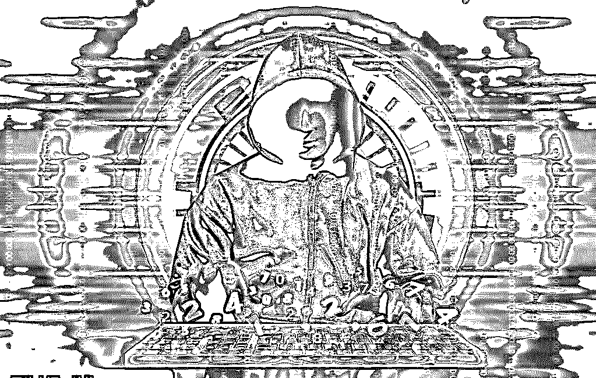

对于个人隐私，人们从未像当下这般焦虑。

上海人 KK 与朋友电话或当面聊天提到的一些话题，常巧合地出现在 APP 向其推送的广告中。高翔猜测“这些 APP 可能在监听”。

类似的是，有用户质疑今日头条是否窃听聊天，微信则被吉利董事长李书福质问“偷看聊天记录”，支付宝因年度账单“默认勾选”而引发公关事件……

用户的焦虑源于不信任。一个陌生的精准营销来电，就足以摧毁数据保管者辛苦搭建的公信力。

家住北京的 KK 计划购房之际，接到一个来自陕西西安的陌生电话，对方向他推荐一处北京楼盘，巧的是，和他计划购房的位置和价位相差不远。类似电话，KK 每天会接到 10 个左右。挨个拉黑时，KK 明白，他的“姓名+电话+计划北京购房”的个人信息，已经外泄。

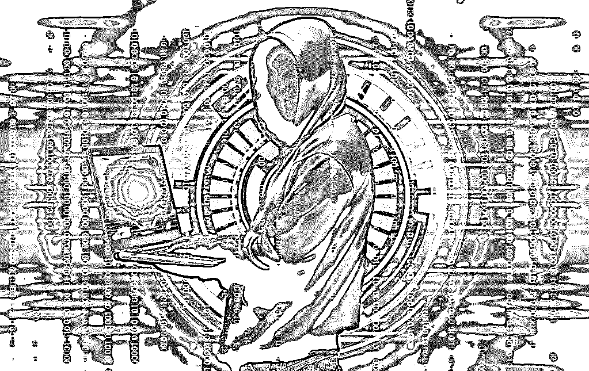

沿着西安的陌生来电追踪，会进入一个错综复杂的交易网络，“KK 信息包”和其他成千上万条信息在其中备份流转，被反复交易使用。

内鬼、黑客、清洗者、加工者、条商、买家等寄生于此，催生出巨大规模的灰黑产市场。

源头泄露者

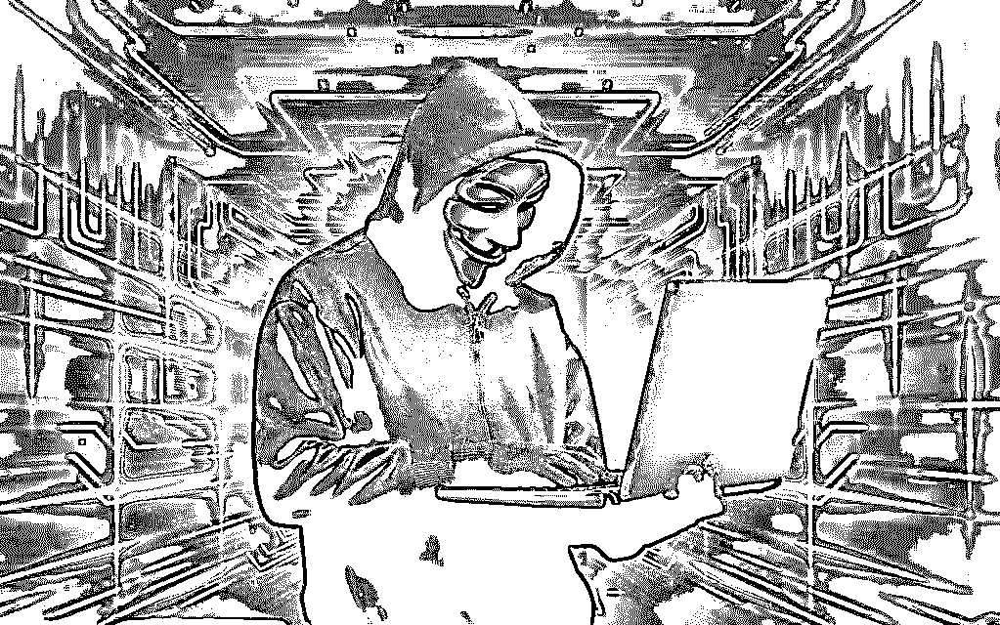

TT 每天多的时候能收到七八十份查询个人身份信息的请求，他将这些人的征信报告通过邮箱发送给对方，赚到 30 多万元

KK 并不确定他的信息如何泄露，怀疑是在房屋中介公司留下求购信息后，被中介“内鬼”卖出。理由是，在与中介接触后，他开始陆续接到售房电话。

公民的身份、通讯、网络行为等每天都产生海量数据，被各类机构和企业收集、存储，产生可能的泄露源头。其中，“内鬼”监守自盗是个人信息流入黑产的主要渠道。

2017 年，公安机关打击利用工作之便窃取、泄露公民个人信息的违法犯罪行为，各部门、各行业内部都有涉案人员，共 831 名。个人信息中最常见的是手机号码及衍生出的相关信息，批量掌握在电信运营商手中。

CC 是江西省一家移动营业厅的经理，2018 年初，一家催债公司的朋友请他帮忙，查询指定人名下的手机号码，每条酬谢 0.8 元－3 元。对 CC 来说，这是“动动鼠标”的肥差，近两月内，CC 帮这家催债公司查询 4 万余条个人信息，获利 8 万元。

金融机构中的客户经理，也有机会接触大量客户信息。TT 是广东佛山一家村镇银行的客户经理，负责信贷业务。

2017 年 11 月下旬，他接到陌生人来电，对方对其信息了如指掌。来电称是一家小额贷款公司，给客户放贷，需要查询征信报告，但苦于没有牌照，只要 TT 能根据其需求帮忙查询目标对象的征信报告，可每份支付 30 元－70 元报酬。

银行的征信报告，包括个人电话、住址、婚姻状况等基本信息，信用卡还款记录、贷款记录等信用信息，对公民的财务状况描述精准。

作为负责信贷业务的部门主管，查询央行征信报告在 TT 权限内。

尽管违法、违反银行规定，但禁不住对方诱惑，在通过视频简单确认对方公司的工作场所，并口头要求“除自己开展业务不得转卖”之后，TT 答应与之交易。

近半年时间，TT 每天多的时候能收到七八十份查询请求，他将这些人的征信报告通过邮箱发送给对方，赚到 30 多万元。

可以接触到大量个人信息的职业，并非高门槛，岗位职级也不需太高。泄露源可能来自各层级。

物流行业颇为典型。今年 4 月，顺丰快递公司 11 名员工因倒卖用户快递面单信息获刑，涉及安保部主管、市场部专员、仓管、快递员等岗位。从该案可见，普通快递员即可收集包含姓名、电话、住址在内的个人信息，并转手获利。

拥有大流量、掌握大量个人信息的互联网平台也可能成为泄露源头。公开案例显示，智联招聘、苹果等公司均曾出现过买卖公民简历、账号等信息的“内鬼”。

除了“内鬼”非法获取，个人信息也会被黑客盯上。

2017 年，浙江省一家法院的工作人员 PP 到某部委下属一家妇幼保健医院孕检，医院为孕妇建档，留存了电话号码、家庭住址、孕检结果等隐私信息。这些信息原本被封存在医院的数据库中，不对外公开且流通受限。

但没多久，PP 及其他孕妇的孕检信息，以及驾校、购物等约 2000 余万条个人信息，出现在黑客童辉的电脑主机里。

32 岁的山东人童辉，黑入该医院的数据库中，窃取出包含 PP 隐私信息在内的大量孕检信息。在信息黑市上，信息越精准，价格越高。包含大量精准个人隐私的医疗信息，属于业内尖货。

童辉于 2016 年 10 月因涉嫌侵犯公民个人信息罪被浙江省松阳警方抓获，一年后二审判决获刑三年。审理此案时，浙江省松阳县法院法官叶永青，在信息泄露数据库中，才看到其同事 PP 也是受害者。

2017 年，在上述打击涉公民个人信息违法犯罪行为的行动中，共有 389 名涉案黑客被抓获。

除内鬼和黑客之外，源头泄露者还有公司化运作的团伙。近期，利用为一家省级疾病预防控制中心建设网站之机，杭州一家科技有限公司大量窃取、贩卖儿童医疗信息，获利 200 余万元。这种利用合作关系窃取个人信息且组织化运作的，可谓升级版的内鬼。

个人信息落入内鬼和黑客手中后，将进入大大小小的中枢——“条商”手中。

“中枢”条商

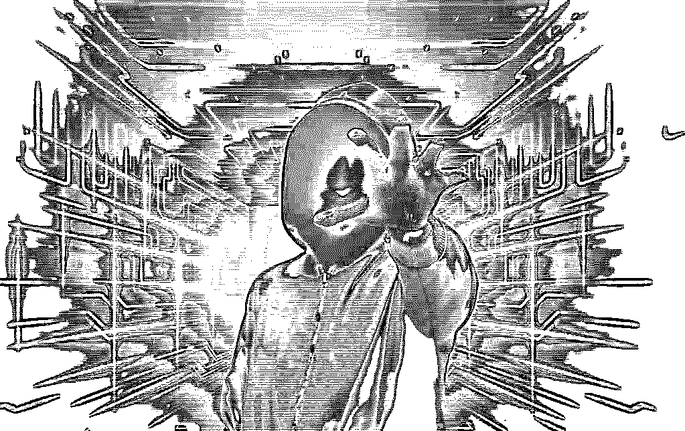

源头联系的条商，一般只有一两人，但条商下线还有大量分销商，多至六七层

当你手中握有大量个人信息时，主动找上门来的常是条商。条商，即数据中间商，上通数据源头，下达需求者，是个人信息黑灰产交易网中的网结。

条商入行往往从接触数据开始，他们中的许多人原本是金融、营销等行业的正当从业者，由于职业特性，需要大量个人信息。寻找信息的过程中发现，只要有廉价和精准的数据上游来源，买卖数据这门生意，更易赚钱。

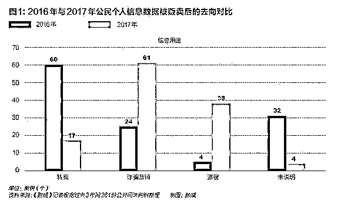

上海人 GG 成为条商之前，是个人信息的需求者，他经营讨债催收业务，这需要精准的个人信息。他在日常工作中先后加入数十个催收同行社交群，被同行拉入一个出售“资源”的群体后，能找到欠钱不还的“失踪”老赖。

意识到其中商机，GG 就做起倒卖个人信息的生意，从物流地址查询起步，业务逐渐扩展到手机定位、征信报告、三网名下手机号等各类业务，“想要的都有”。

每天上午，GG 在各大社交平台、社交群和朋友圈里发广告，如“代查车档信息、征信报告、手机定位”等，便有顾客找上门来。下午，他将买家们想查询的信息汇总成一张表格，按所需信息分类，发给自己的上线或者信息源头，获得信息后再转发给买家，进行结算。这样下来，GG 每天“工作”一两个小时，月入数万元。

条商于博主营车档信息，他手机上有数十个已完成的手机定位交易，从对话推断，部分为寻找“老赖”的催收人员，部分为怀疑配偶不忠的一方。

以于博为中心，山东肥城警方发现 9 条个人信息贩卖链条，77 名犯罪嫌疑人组成交易网络。19 人为信息源头，其他皆为中间商。这一网络中，于博上通下达的地位关键，当其被警方控制后，上下游都受到影响。

肥城警方发现：社保信息、快递信息、手机定位、学籍信息、机主信息等需求量较大，同理，可掌握这些信息的行业就是黑市所需。

一笔简单的交易背后，有可能包含多个源头、多层中间商，他们的协作错综复杂。今年 2 月 21 日晚，条商“锦瑟”（网名）接到一个定位信息的订单，“锦瑟”的报价是“移动 1600 元，联通 1400 元，5 分钟内出结果”。

收到 200 元定金后，“锦瑟”向对方发去一张标有经纬度的地图截图——显示这个手机尾号为 6613 的人，目前正在深圳市福田区一所中学。买家如约转来剩余 1200 元尾款。

“锦瑟”进一步主动询问，是否需要该机主的快递、开房和出行记录，“打包 1000 元”。对方同意，第二笔交易完成。

这起案件前后，包括多达 19 个公民隐私泄露源头，涉及征信报告，电信运营商的三网名下手机号码，手机实时定位，快递地址，出行记录等。

条商掌握的信息量惊人。仅在一起案例中，涉案信息就达 8000 余万条。

源头联系的条商，一般只有一两人，但条商下线还有大量分销商，多至六七层。若数据源头标价 10 元，层层加价后，最终使用者常需支付两三千元才能买到。

庞杂的交易网中，条商自己也很难知道手中的信息来源几手。但转手越多，价格也就越高。GG 向其上线支付数千元，得以认识上线的上线。这样，他买信息的成本下降到 20 元/条，远低于其他卖家 60 元/条左右的价格。

GG 说，他以为自己已是处于金字塔靠近顶端的上线，被警方控制后才知道，一些同类信息仅值几元。获知真相后的 GG 颇为失落。

由于可以被重复使用，个人信息还被有心的条商储存，建起完整的“社工库”（社会工程学数据库，也是形容个人信息数据库的黑话），从零售信息的条商升级为可批发可搜索的“条商 2.0”。

2014 年，程序员 JJ 在网上接到一个搭建网站的兼职，对方将 10 余亿条公民个人信息数据通过百度网盘分享给他，请他搭建一个名为“咔咔社工库”的网站。

网站搭好后对方赖账，于是 JJ 开始自行运营这一网站，用户以 30 元－150 元不等的价格成为会员后，登录网站就可以查询账号密码、开房纪录、QQ 群关系、邮箱等公民信息。

2018 年 4 月，江苏省涟水县法院认定，邢伟分享、搜集购买 30 余亿条公民个人信息。

一位业内白帽子黑客展示过一张截图，上面有他的姓名、电话、身份证号、QQ 和开房记录，皆从一个地下社工库中得来。

这位黑客说，他从不在外留下任何隐私信息，不使用共享单车、刷卡、快递等需要提供个人信息的服务，手机经过严格审核也没有安装任何需要过多权限的国产 APP。

然而，在一家连锁酒店办过的会员卡数据库被盗后，他的信息还是被出卖并被储存进社工库中。

旺盛的需求方

私家侦探及地下催债公司是在幕后推高公民信息售价的主要根源之一

个人信息在黑市流转的终点，是信息使用者。在这里，信息价格和精准度均不断提升。

过去，对个人信息泄露的担忧停留在接到骚扰电话的直观体验当中，但事实上，更值得担忧的情形是，对公民各维度的精准追踪。

精准营销是个人信息最常见的用处。金融、房地产、医疗保健等行业，对所有潜在消费者进行的精准营销，需要大量的用户数据支撑。以地产销售为例，一张标有电话号码、姓名的潜在买房者清单，是他们的营销利器。

一名长期侦办相关案件的民警告诉我们，金融和房地产领域是需求信息最旺盛的行业。

对一起以精准营销为最终信息用途的隐私数据贩卖链条溯源可以发现，电信运营商中的内鬼将机主浏览过的网址等上网数据卖出，经由大数据公司对数据进行清理和挖掘，打上“购房、金融、医院”等个人偏好标签，完成精准描述。

一名北京地产中介为完成销售业绩，从朋友推荐的条商手中花费 200 元买到一份含有近千个附近楼盘所有业主姓名和电话号码的信息清单，他打印出后，每天挨个致电，询问是否卖房。

网络技术大大减少了获取这些信息的成本，15 年前，地产中介如果想获得业主信息，需要花费不止 200 元以获取物业高管信任，套取业主信息。那时，印满业主信息的“硬货”，还不是如今的 word 文档，而是厚厚的黄页手册。

比起被骚扰带来的不适感，个人信息在诈骗分子手中有更高的变现价值。诈骗者的经验是，学生、中老年人、病患三大标签下的个人最易受骗。

我们梳理了 2016 年至 2018 年 5 月涉信息黑产的 261 份公开司法判决。侵犯公民个人信息案件数据统计结果显示，近两年案例中用于营销诈骗的情况加剧，从 2016 年的 20％达到今年的 52％。

侵犯公民个人信息罪与其他罪同犯的比例也大幅增加，2016 年仅为 23％，今年已达到 62％，其中最常一同出现的就是诈骗罪和盗窃罪。

此外，一些信息使用者通过收集手机定位、使用过的快递单等线索，完成对个人的定位追踪。其可能造成的伤害，包括直接侵犯人身权利。

腾讯 2017 年基于对黑产观察的研究显示，私家侦探及地下催债公司是在幕后推高公民信息售价的主要根源之一。

一名兼职条商的上门催债人员告诉我们，在多种源头信息的追溯下，只要有充足利润空间，“老赖们”在他们面前基本无处遁形。

大量案例表明，侵犯公民个人信息犯罪的最大危害不是隐私泄露，而是为下游犯罪提供了实现可能。

公安部一名负责相关案件的警官告诉我们，今年爆发的电信网络诈骗、信用卡诈骗、网络传销等财产型犯罪，以及绑架、敲诈勒索、故意伤害等暴力型犯罪背后，都能发现公民隐私通过互联网泄露的身影。

条商“锦瑟”的手机微信显示，在买到手机尾号 6613 的中年男子的开房记录等信息后，买家还问能否提供线下“堵人”和跟踪服务，被“锦瑟”拒绝。这正是可怕之处，尾号 6613 的男子对这一切并不知情，潜在危险随时可能出现。

黑市沉淀

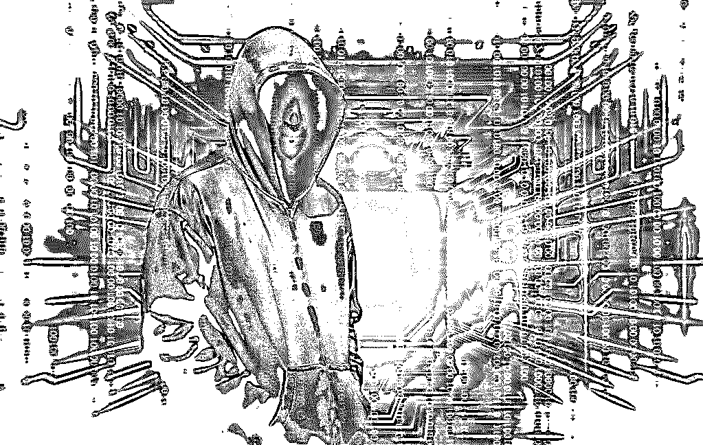

尽管源头被缩减，但已经泄露的海量个人信息仍在黑市，只不过暂时沉淀下来。一些合法的大数据公司悄然成为个人信息的“沉淀仓库”

海量的个人信息地下市场规模多大，目前没有准确数字统计。

吸引人们铤而走险进入黑市贩卖个人信息的主要动因，是获利简单、且利润高。

数据黑市上的交易价格呈现极端化——极贵或极便宜。不脱敏的数据极贵，可能一条 10 元，如果数据是由催债公司定制，每条或高达 1000 元。而那些已经在网上被交易无数次的数据库则非常便宜。

一个名为“园林艺术交流”的微信群，其实是个人信息交易群。其群聊显示，三网名下手机号查询在黑产链末端买出的报价达 600 元，在源头处仅 3 元。

2017 年腾讯守护者安全计划发布的信息显示，13 项公民信息种类中，报价最低 1 元一条，最高达到 3000 元——高学历人口信息价格每条 20 元－60 元不等，银行流水单信息则价值 1000 元-3000 元/条。

根据我们统计的 261 份判决样本，公民通讯住址信息是最常见的非法黑市交易类型，在所有信息种类中占比近三成。

由于执法态势要求全链条打击，地下交易成本正极大提高。

近年来大数据行业的“野蛮生长”状态促进了个人信息黑市和乱象的形成，数据采集、流通、交易、应用等环节基本处于无章可循状态。

尽管源头被缩减，但已经泄露的海量个人信息仍在黑市，只不过暂时沉淀下来。如一位资深业内人士所言，一些合法的大数据公司悄然成为个人信息的“沉淀仓库”，尤其是极少数从事互联网技术、金融服务、期货股票交易等业务的公司，在发展中积累大量公民个人信息，由于经营不善、管理不当的原因，不少企业靠出售这些数据支撑生存。

由于正规数据公司的灰色行为，数据市场的“黑白边界”在逐渐模糊。目前可见的红线是，数据来源是否合法，以及交易数据是否脱敏。

脱敏，指将涉及敏感个人信息的数据进行去个人化、去隐私化处理。

但问题在于，大数据公司交易成千上万条信息，其中掺杂来源非法、未脱敏的数据，其实很难发现。

一些原本在做 P2P 的互联网金融公司，如今转型做金融科技，对外输出数据、输出模型。这些他们从用户处收集来的数据，是否经过脱敏，被卖给了谁，往往失控。

立法执法者与黑产角力

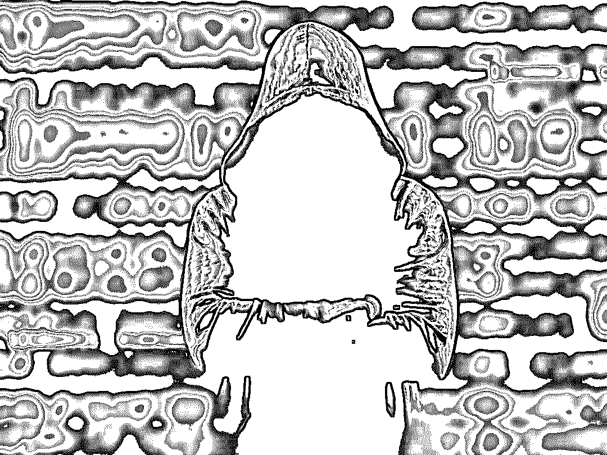

面对蓬勃发展的黑产和缺乏技术、安全意识的数据持有者，在中国，刑事打击仍走在第一线，单打独斗

在与执法者角力的过程中，黑灰产已经完成技术上的升级，隐蔽性更高的同时，精准度也提升不少。

根据我们梳理的裁判样本，被执法部门打击的不法者，多以线上数据库的复制或架设网站提供 api 接口为主，过去常见的物理转移（硬盘交易等）已少见。

目前较为普遍的交易方式是卖家积攒大量的数据库存在本地，根据买家的精准订单提供相应数据，称之为“订单式”销售。

黑产中的新技术也开始出现。2017 年 11 月以来，被称为“短信嗅探”的团伙通过一种特殊采集设备，利用电信运营商 2G 网络数据不加密特性，寻找附近基站范围内的 2G 手机号码后，登录各类网站采集验证码，再将手机号码和验证短信提供给自己的上线“洗料”，通过社工库等，“洗出”手机机主的真实身份信息，如姓名、身份证号、网络注册信息等，再进一步获取银行卡号、互联网金融网站账号等，进行盗窃财产、账号洗钱等。

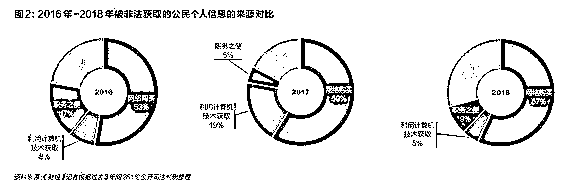

对于公安机关来说，除了要对抗不断升级的新技术外，还要克服诸多办案困难。比如，许多个人信息犯罪是跨区域实施，产业链中信息源头在境内，条商和信息使用者却在境外，极大增加取证难度。

依赖执法部门的打击只能进行事后惩戒，但事实上，个人信息一旦泄露，从信息黑市中完全删除几乎不可能。以此来看，事前预防才是关键。

面对蓬勃发展的黑产和缺乏技术、安全意识的数据持有者，在中国，刑事打击仍走在第一线，单打独斗。其局限性之一是，依据罪刑法定的要求，执法机关对于不构成“情节严重”的犯罪行为往往打击困难，而企业出于合法经营目的进行的非法交易，难以被发现和取证。

由于中国目前尚未建立起完善的行政、民事立法体系保护公民个人信息，隐私保护相关条文散落在各法规中，未形成体系。

一位执法者坦言，没有行政处罚的前置性程序，从民事责任直接到刑事责任，跨度较大，有待形成执法合力。

意识缺失、立法缺位，黑产已悄然发展起极高产值和规模，个人隐私数据被标价售卖、精准定制甚至追踪，而在绝大多数情况下，直到接到骚扰、诈骗电话，人们才意识到自己隐私信息的失控。

隐私焦虑

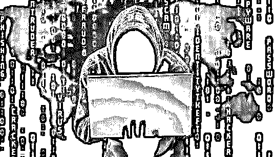

公众焦虑已形成一个“塔西陀陷阱”，这既来自隐私失控的现实，也来自信息收集的信息不对称

隐私信息泄露后，普遍造成公众对信息保管者的不信任，对个人信息保护现状的焦虑。

近日，vivo 一款新手机上线，其前置摄像头隐藏在机身中。许多用户发现，浏览一些网页和 APP 时，手机摄像头会不时弹出，“偷偷看你一眼，再默默缩回去”。有用户怀疑摄像头在偷偷窃取信息。

由于 APP 涉及 QQ 浏览器和百度输入法，两软件团队分别公开作出回应——调用摄像头和录音功能等动作确实存在，但不会开启摄像头进行拍摄，并公布其中的技术原理。

复杂的技术原理很难让普通公众理解，也很难化解质疑。

一名产品经理坦言，许多产品设计可能导致用户的隐私焦虑上升，从而给企业带来负面舆论。

焦虑带来的直接反应是，交出信息时，用户不信任来自政府和企业的保管者。

公众焦虑已形成一个“塔西陀陷阱”，这既来自隐私失控的现实，也来自信息收集的信息不对称。

《南方都市报》发布的《2017 个人信息保护年度报告》对十多个行业共 1550 个网站和 APP 的隐私政策测评显示，平台隐私政策透明度高的极少，80％透明度低。报告对 50 款安卓市场应用的抽样调查显示，50 个 APP 覆盖 28 个隐私相关权限，只有两个 APP 列出的权限是合理的核心权限。

个人隐私保护已成为舆论和监管的共识。“隐私保护已成为一件政治正确的事情”，一家互联网公司副总裁直言，但在具体的做法上如何进行，没有共识。

随着公民隐私焦虑和不信任感的不断上升，持有海量数据的公司和整个大数据产业，都笼罩在黑产阴影之下，这也影响产业信心和发展潜力。“这个市场彻底凉了。”一位征信业内人士告诉我们，特别是个人数据，真正合法的特别少，但需求端格外旺盛。

一家互联网医疗公司总监的体验是，互联网医疗公司与医院 HIS 系统对接后，所有数据，包括病人隐私数据、化验数据、住院记录、社保等，他们都能看到。

医院时常发来的各类敏感信息，有时让公司看到都觉得害怕。“假如我没保管好数据怎么办？假如外泄，责任在我们。”

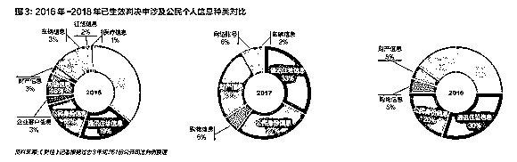

一些互联网医疗公司，因为担忧涉及患者数据的业务开展可能带来的风险，因而尽管潜力和发展空间大，但止步不敢向前。

商业开发两难

在公众的隐私保护期待和商业逻辑之间找到平衡点只会越来越难

“科技公司正面临矛盾，它们在使用数据提供更好的消费者体验和侵犯消费者隐私之间进退两难。”6 月 1 日，被称为“互联网女皇”的美国分析师玛丽·米克尔（Mary Meeker）在美国发布的 2018 年互联网趋势报告中指出。

2018 年 3 月 28 日，遭遇剑桥分析公司的数据泄露事件之后，Facebook 关停大量共享给广告商和第三方的数据来源。这一举措得到消费者的信赖，却也引发合作商的反弹。

一家 Facebook 的数据合作商高管对我们表示，尽管他所在的公司在数据使用和合规的透明度上已作出许多努力，也从未进行过剑桥分析中的数据滥用事件，仍被 Facebook 泄露事件波及，对该公司并不公平。

个体对于产品体验需求的不同，对隐私的看法差异，对个人信息保护的诉求不同，都在实践中形成巨大的操作难点，极易走向极端。

在收集阶段，刑法和网络安全法给出两条底线，即授权和匿名化处理。今年 5 月 1 日生效的国家推荐性标准《个人信息安全规范》，则对信息的收集、存储和使用流程给出建议。

达到合规，企业在收集、分析和利用等每一个环节均需努力——在收集用户个人信息时应当尽可能仅收集与业务有关的信息，在存储和挖掘过程中进行匿名化处理并确保其安全，而在最后使用时确保不伤害个人利益。

授权是个人信息被收集的重要合法前提。《个人信息安全规范》要求，应当充分展示信息的收集范围、个人信息保存时间最小化、搜集敏感信息时应当获得用户明示授权等，旨在给个人更多的控制权和选择权。

从技术角度而言，能够保证个人隐私在不被侵犯和泄露的基础上进行商业化利用的两种技术手段，一个是基于规则引擎的匿名化数据脱敏技术，另一个则是差分隐私技术。

就差分隐私技术而言，刘驰介绍，其核心是通过向聚合查询结果添加随机化“噪声”来实现，以保护个人的隐私，而不会显著改变查询结果。也就是说，差分隐私算法保证攻击者能获取的个人数据几乎和他们从没有这个人记录的数据集中能获取的相差无几。

这一技术的应用可以使得互联网公司对数据的存储、挖掘和应用在锁定的封闭环境中运行，得出的结果也加入了噪音，防范外部攻击和内部盗窃风险。而这一技术虽然正在被学界、政府以及互联网公司深入研究，但尚未完全落地。

基本上，个人信息的合规使用目前在中国较大程度依赖于公司的自我约束，法律红线往往无能为力。

而且，在公众的隐私保护期待和商业逻辑之间找到平衡点只会越来越难。如何平衡道德、法律与商业化，依旧是个无解的难题。

“我做一个 A 网站和 B 网站，一个说我用户隐私权保护得特别好，对待每一个用户都如新；另一个会采集用户信息提供个性化服务，在竞争中谁会活下来？保护用户隐私的这个企业一定死掉。死人是不会说话的。”一家中国明星互联网公司副总裁说。

可以预见的是，随着数据保护的立法潮成为共识，所有数据持有者和收集者的技术成本和法律成本都将极大提升。

**作者：《财经》杂志**

**授权转载**

**【灰产圈】高端社群小程序开通，2018 最值得加入的社群！**

<mp-miniprogram class="miniprogram_element" data-miniprogram-appid="wx4f706964b979122a" data-miniprogram-path="pages/topics/topics?group_id=881854415822" data-miniprogram-nickname="知识星球" data-miniprogram-avatar="http://mmbiz.qpic.cn/mmbiz_png/kialtkOXGKS7D9hZrmO2jzDqryXXTAlhxSpnrKnHGV65KXzicibOppaPic4dCRxftvabB8Iqswo3OuQEDSxE7NicXBg/0?wx_fmt=png" data-miniprogram-title="【灰产圈】高端社群" data-miniprogram-imageurl="http://mmbiz.qpic.cn/mmbiz_jpg/WWG78hysZ0brJkWoyG2VDIacqgQjkDfp6mLiaoPBJ2SgWZHtRuTw7ia8kpoxntsn7PiaFOQO2U23FW6Iry0gS1GnA/0?wx_fmt=jpeg"></mp-miniprogram>

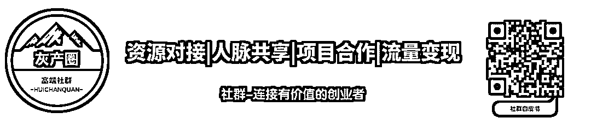

**点击加入【灰产圈】高端社群**