# 真相调查| 门罗币背后“暗网”世界：匿名，黑暗，暴利！

> 原文：[`mp.weixin.qq.com/s?__biz=MzIyMDYwMTk0Mw==&mid=2247492562&idx=1&sn=6a29d8061a964e7ed31acc38e8a37db8&chksm=97cb28eaa0bca1fc7f162f825cb4229ee7802c115a841e9c06d6c8c9d7525ddff50d2d7430e4&scene=27#wechat_redirect`](http://mp.weixin.qq.com/s?__biz=MzIyMDYwMTk0Mw==&mid=2247492562&idx=1&sn=6a29d8061a964e7ed31acc38e8a37db8&chksm=97cb28eaa0bca1fc7f162f825cb4229ee7802c115a841e9c06d6c8c9d7525ddff50d2d7430e4&scene=27#wechat_redirect)

**点击上方蓝色字体“灰产圈”关注并置顶本公众号**

**导语**

**引言：暗网支持的三大币种，比特币(bitcoin)、门罗币(monero)、达世币(dash)**

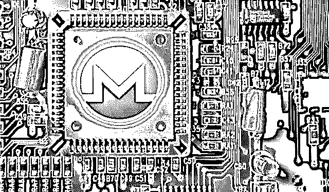

暗网是一类经过加密的网站，普通用户无法访问，只有通过匿名代理工具才能访问。

暗网，作为互联网的另一个维度的存在，于普通人，遥不可及，但又触手可及。

之所以暗网被称为“暗网”或者“深网”是因为那里有我们在现实生活中看不到的世界。为了保持神秘性和安全性，暗网的成员都是匿名的存在。因此在暗网中，保密性很重要。

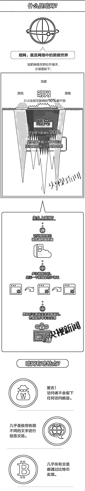

**没有暗网，我们可能走不到今天**

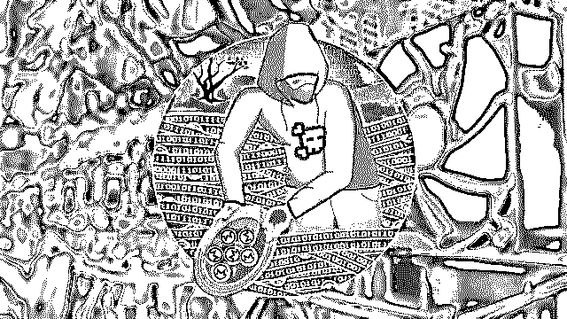

可以毫不夸张地说，如果不是深度网络市场，特别是丝绸之路，比特币可能永远不会起飞。至少，它的接纳会受到阻碍。

在世界经济论坛发布的《2018 年全球风险报告》中，网络安全已经成为除自然灾害以外，最大的风险所在。据统计，2017 年黑产从业人员超 150 万，年产值更是达到了千亿级别…… 

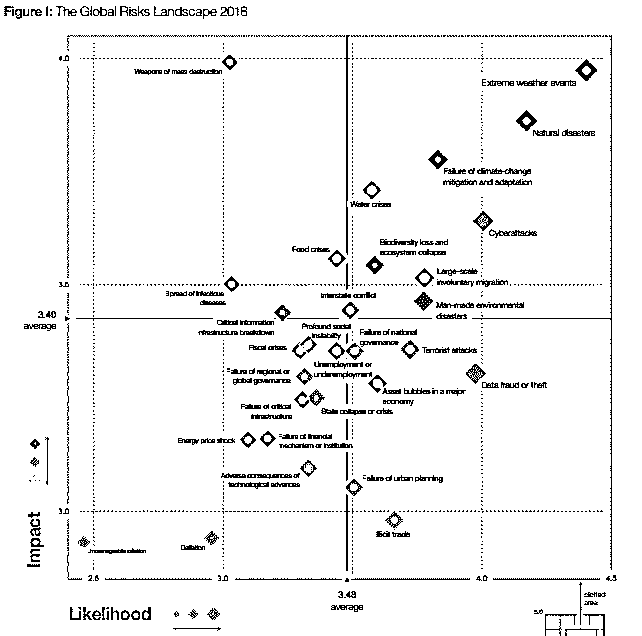

**2018 年全球风险报告**

**黑产江湖三剑客**

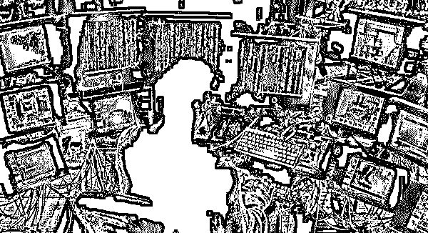

黑产江湖三剑客（Dream、Wall Street 与 PointMarketplace）成为全球范围内最大的黑网交易市场。

**Dream 市场**

> 作为深网最古老的市场，Dream 从 2013 年就屹立不倒，而这对于黑网来说，可以说是历史悠久了。
> 
> 诈骗和萧条通常会在一年内终结一家暗网市场，而 Dream 仍然存在，这证明其稳健强大。
> 
> 它接受比特币核心钱包，比特币现金和门罗币，拥有 50,000 个数字商品和 63,000 个药品目录。
> 
> 在“其他业务”类别中又包括：复古 Air Jordan 运动鞋、500 欧元纸币、信用卡号码和变态色情订阅。
> 
> 还有一个“服务”部分，在这个部分你可以购买假身份证或针对 Youtube 上您特别讨厌的视频订购差评服务。
> 
> 只需 0.8 BTC，你可以完全消失，然后以全新的身份出现。

**WallStreet 市场**

> 充满恶意和双重交易的 Wall Street 是一个罪恶与阴谋汇集地。
> 
> 该网站声称拥有将近 3000 个供应商和 400,000 个客户，并接受 BTC 和 XMR。
> 
> 相对于 Dream 而言，WallStreet 的产品较少，但拥有更多的类别包括“安全与托管”，就在“欺诈”一栏边上。
> 
> 并非所有可以在深网上购买的东西都是非法的，比如，曾有媒体表示，在上面看到过有人卖代餐食品。

**PointMarketplacePoint 市场**

> 前身为 Tochka，是自 2015 年以来一直运行的俄罗斯 DNM。
> 
> 它具有许多创新特性，包括秘密交收情报点，使供应商可以将产品留在某个位置，买家随后收集。
> 
> 该网站的正常运行时间比 Wall Street 和 Dream 的要少（三者分别为 90%和 97%和 98%），并且在过去几天内一直处于离线状态。
> 
> 不过，Point 的客户服务得到高度评价，并且该网站会储存你期望在深网上找到的所有常用物品。

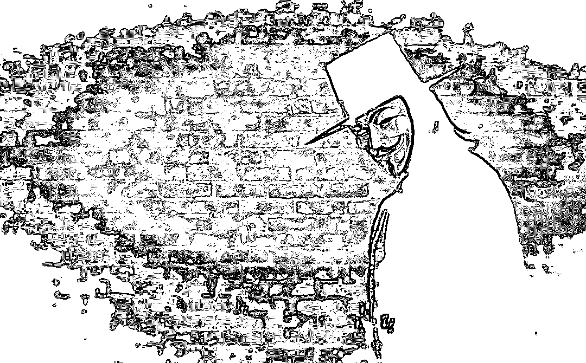

任何考虑尝试 Point，Wall Street，Dream 以及 P2P 开放市场或任何其他黑网市场的人士都应采取预防措施并保持匿名。

买家还应该注意，某些商品在他们的国家购买可能是非法的。

也存在其他风险，包括执法机构秘密接管网站并将其用作收集用户信息的蜜罐这种可能性，正如 Hansa 所发生的那样。

对于不想在深网上进行交易的加密货币用户来说，访问 DNM 就像是一种朝圣行为：它让我们记着比特币的源头，并承认是罪恶带领我们走到今天。

今天参与加密货币空间的每个人都应该感谢 Ross Ulbricht、丝绸之路和它产生的黑网市场。

**黑客恶意挖掘门罗币**

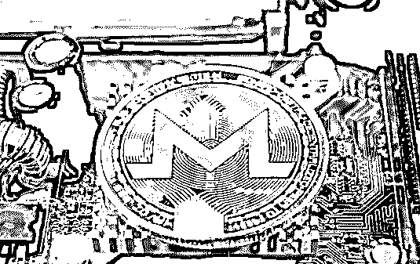

根据一位来自北加利福尼亚州的网络研究人员的研究结果，目前，恶意矿工挖掘到的门罗币已经占到了市场总流通量的 5%，价值超过 1.75 亿美元，而且这种黑客挖矿行为的增长趋势也愈发明显。

> 网络安全公司 Palo Alto Networks 总部位于美国加利福尼亚州帕罗门托，该公司研究人员乔什.格伦茨维格(Josh Grunzweig)最近发表了一篇题为《加密货币矿工崛起》(The Rise of the Cryptocurrency Miners)的博客文章。

他认为，恶意挖矿行为正在不断增长——通过这个问题进行调查，乔什.格伦茨维格更加深入地了解到大量细节，并得出两个重要发现：

　　1、恶意挖矿行为确实在增长，而且与去年加密货币价格暴涨有直接关系；

　　2、市值排名第十四位的门罗币，因其恶意采矿活动已经损失超过 1.75 亿美元，占到目前市场总流通量的 5%。

　　Palo Alto Networks 是一家网络安全上市公司，主要提供专业防火墙解决方案，去年公司收入接近 20 亿美元。目前，该公司业务覆盖了全球 150 多个国家，拥有 5 万多客户，全球员工数量超过 5000 人。

　乔什.格伦茨维格的分析样本一共提取了 2341 个门罗币钱包，他表示：

　　乔什.格伦茨维格说道：

　　乔什.格伦茨维格提到，在他撰写博客时，恶意矿工挖掘到的门罗币已经占到了市场总流通量的 5%，而且这一数字还没有将基于网页挖矿的门罗币矿工、以及一些匿名矿工考虑进去。因此，我们可以假设，通过恶意行为开采的门罗币在流通中的实际比例数字其实比 5%更高。

　　乔什.格伦茨维格最后表示，由于最近几个月加密货币价格暴跌，门罗币恶意挖矿行为已经有所放缓。截至目前，恶意矿工挖掘到的门罗币价值约为 1.75 亿美元。不过，日本警方已经宣布将打击门罗币恶意挖矿行为，并且正在调查 Coinhive 通过恶意采矿脚本开采门罗币的案件。

**为什么黑客如此钟爱门罗币?**

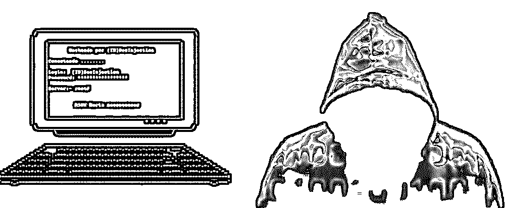

回首 2017 年席卷全球的" WannaCry 敲诈勒索病毒”事件，黑客们用勒索病毒锁死大量 windows 系统使用客户，“中毒者们”被要求支付赎金，值得注意的是，赎金既不是世界三大货币，也不是咱毛爷爷，而是比特币。

众所周知，比特币是世界性的虚拟货币，结算方便，监管也相对松懈，名副其实的成为黑客们洗钱的小帮手。

不知道大家有没有发现，每一起黑客劫持网络，劫持计算机、服务器用于挖矿赚钱的新闻中，所挖的加密货币几乎都是“Monero（门罗币）”。那么，门罗币究竟有什么魅力让黑客们如此钟爱？

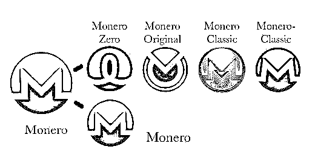

而 2014 年 4 月创建的门罗币，代号为 XMR，是一种比特币的竞争币，采用并不相同的技术体系。

门罗币采用 CryptoNight 算法，可以使用 CPU 或 GPU 挖矿，但用 CPU 挖矿的效率更高一些。门罗币的总发行量为 1844 万个，总量比比特币还要少。

门罗币之所以备受黑客们的欢迎，最重要的原因是它采用 Ring Signature 加密技术，是完全的匿名加密货币，地址、交易金额、交易时间、发送方和接收方等信息完全隐匿，无法查询与追踪。

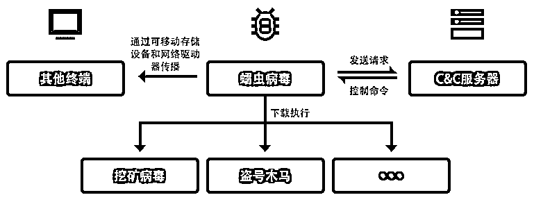

**病毒恶意代码运行与传播流程图**

这就好理解了，因为黑客劫持网络植入挖矿程序是违法行为，需要的就是来无影去无踪，就算被发现电脑被植入挖矿木马，也无法通过挖矿的地址、交易等信息查询到黑客的行踪。  

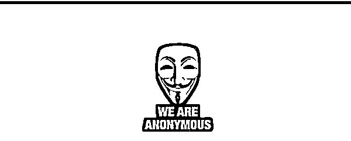

此外，门罗币诞生 4 年之久，虽然已经是主流加密货币品种，但却一直很低调，这也符合黑客的调性。

同时，门罗币的价值颇高，从 2014 年至今市值排名基本都在前 20，币价不断的攀升。

截稿时门罗币市值排名第 11，币价在 2000 元人民币以上，挖矿的回报比较高，根据最新数据，截稿时 1KHash/s 算力，挖掘门罗币 1 天的收益约为 1.2 美元。

综上，门罗币之所以备受黑客钟爱，主要源于它的完全匿名特性，黑客的行踪很难被追踪。同时，门罗币市值稳定，升值潜力比较好，可以保证黑客获得较为稳定的收益。

**比特币 VS 门罗币 ：谁更有优势？**

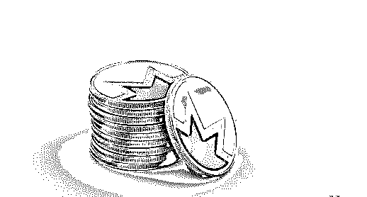

有挖矿想法的同志们，此处灰产圈奉上门罗币相比于比特币的四大优势

> **1.门罗币拥有更好的挖矿算法**

比特币算法在定制的挖矿芯片上（被称为 ASICs）的运行速度比在标准家庭电脑或者笔记本电脑上快得多。

这意味普通的电脑用户想要参与比特币挖矿几乎是不可能，这会导致矿工相对集中在电力成本低的那些国家。

相比之下，门罗币的挖矿算法是专门设计的，ASICs 与普通公众的电脑设备相比不会拥有太大优势。

这意味着，世界各地的人都可以在家里或者工作的电脑上运行挖矿软件。

> **2.门罗币的“自适应区块大小限制”**

当交易广播到门罗币或者比特币的网络时，它们将被打包到“区块”中。

门罗币每两分钟出一个块，而比特币平均每十分钟出一个块。

区块大小拥有上限，因此如果空间不足，你的交易可能被延迟。如果你非常想立刻将你的交易打包到区块中，那么你必须提高支付给网络的交易手续费。

比特币的区块经常是已满的状态，导致交易延迟，手续费上涨。

> 3.**门罗币正在研发整合一种令人瞩目的“隐形互联网项目”**
> 
> **“12P 层技术”到门罗币中**

这次研发将为门罗币交易提供更大的隐私保护。

12P 将保护使用者免受网络监控，不仅在付款交易后无法追踪，而且窥探网络的人甚至无法追踪是谁在使用门罗币。

> **4.门罗币背后的研发团队的质量和他们的理想是非常引人瞩目的**

门罗币项目拥有 180 多个贡献者。

请参阅门罗币设计的目标路线图：https://getmonero.org/design-goals/

**结尾**

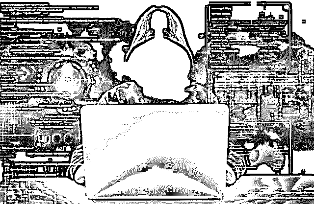

伴随门罗币的金融市场化，门罗币价格也在 2016 年后也开始频频走高。总的来说，暗网成就了门罗，而门罗也间接成就了暗网，即便两者分离后，门罗依然在为暗网的“繁荣”站台。

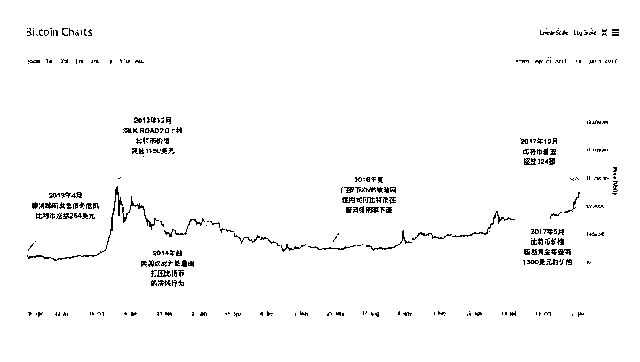

只是，门罗作为黑暗世界自我进化的一个见证人，我们无法用道德去评判它的本质，但在它的成长过程中，每个参与的人都是这场黑暗盛宴或多或少的帮凶。

当然，即便没有门罗，即便我们不曾参与，在这个本就扭曲的规则下，暗网一样会按照一个“利益最大化”的方式去成长、去发展，只是我们选择看或不看。而金融市场化后的比特币，也并未停止作恶，因为。美国《独立宣言》的作者托马斯. 杰斐逊曾说：

> **“如果美国人民最终让私有银行控制了国家的货币发行，那么这些银行先是通过通货膨胀，然后是通货紧缩，来剥夺人民的财产。直到有一天早晨，当他们的孩子一觉醒来时，他们已经失去了自己的家园和父辈曾经开拓过的土地。”**

而在门罗币被过度操控的当下，它只是从暗网走向了现实的金融世界，只是换了一种方式来掠夺财富。面对这场波动起伏的财富盛会，又有谁愿意只当看客呢？

* * *

延伸阅读[深度揭秘币圈超级黑幕：掮客荐币，贷款买币，套路重重，人财两空！](http://mp.weixin.qq.com/s?__biz=MzIyMDYwMTk0Mw==&mid=2247492390&idx=1&sn=81d1122932ea7e87306e2a9f3074b567&chksm=97cb281ea0bca1085010faf7cc3ba6307403051628adef845cae325e97029ffc46259fd4fbc4&scene=21#wechat_redirect)
[区块链狂欢，虚拟币骗局的背后如何不当韭菜？](http://mp.weixin.qq.com/s?__biz=MzIyMDYwMTk0Mw==&mid=2247491136&idx=2&sn=6440c209de25721fac8b3709b505b35a&chksm=97c8d578a0bf5c6eb03eb4e547f7c5240e69af9616c804d234b00669f0622ea0288b307b99c4&scene=21#wechat_redirect)
[深度|币安网与黑客的史诗大战：差点被盗几亿元，场外做空比特币又获利几十亿！](http://mp.weixin.qq.com/s?__biz=MzIyMDYwMTk0Mw==&mid=2247490809&idx=1&sn=ef29c8706a01a98c314bbf528465a328&chksm=97c8d7c1a0bf5ed799e12c8d1f2b18e8e2183cc0d2dc05ff9fc8c36ee8e83602a8f38cd42468&scene=21#wechat_redirect)
["比特币首富"李笑来：一个诈骗者的财富自由之路！](http://mp.weixin.qq.com/s?__biz=MzIyMDYwMTk0Mw==&mid=2247492297&idx=1&sn=e8603af326177886663aed244d7f0a61&chksm=97cb29f1a0bca0e73f5118543cf31d14b8a41b6a43ce0e0683604318420d4401b7a0d72f445d&scene=21#wechat_redirect)
[一篇文章读懂区块链：币圈一天,江湖十年!（深度好文）](http://mp.weixin.qq.com/s?__biz=MzIyMDYwMTk0Mw==&mid=2247490389&idx=1&sn=723efdb12fc9c6cfc2d3e84d51f8f385&chksm=97c8d06da0bf597bfdff32d62578c6c43164c53b32b16413ce89a8d57e2bfc8e22e56614083e&scene=21#wechat_redirect)

* * *

****【灰产圈】高端社群小程序开通，2018 最值得加入的社群！**** 

**<mp-miniprogram class="miniprogram_element" data-miniprogram-appid="wx4f706964b979122a" data-miniprogram-path="pages/topics/topics?group_id=881854415822" data-miniprogram-nickname="知识星球" data-miniprogram-avatar="http://mmbiz.qpic.cn/mmbiz_png/kialtkOXGKS7D9hZrmO2jzDqryXXTAlhxSpnrKnHGV65KXzicibOppaPic4dCRxftvabB8Iqswo3OuQEDSxE7NicXBg/0?wx_fmt=png" data-miniprogram-title="【灰产圈】高端社群" data-miniprogram-imageurl="http://mmbiz.qpic.cn/mmbiz_jpg/WWG78hysZ0brJkWoyG2VDIacqgQjkDfp6mLiaoPBJ2SgWZHtRuTw7ia8kpoxntsn7PiaFOQO2U23FW6Iry0gS1GnA/0?wx_fmt=jpeg"></mp-miniprogram>**

****

****点击加入【灰产圈】高端社群****