# 微信仓促更新，黑产加速圈钱，“微信号”黑市规模接近 40 亿

> 原文：[`mp.weixin.qq.com/s?__biz=MzIyMDYwMTk0Mw==&mid=2247492457&idx=1&sn=a37dfa91c816ce16607a9df01afaf06c&chksm=97cb2851a0bca1470160b63d0c387a7b89c03e3124ffd29d2419c01120bd45ca66f7b905a08f&scene=27#wechat_redirect`](http://mp.weixin.qq.com/s?__biz=MzIyMDYwMTk0Mw==&mid=2247492457&idx=1&sn=a37dfa91c816ce16607a9df01afaf06c&chksm=97cb2851a0bca1470160b63d0c387a7b89c03e3124ffd29d2419c01120bd45ca66f7b905a08f&scene=27#wechat_redirect)

**点击上方蓝色字体“灰产圈”关注并置顶本公众号**

作者：极验

授权转载

在这次微信的更新中，长按公众号文章会出现“未完成的功能”字样，此次改版在还“未完成”状态仓促上马，说明张小龙背负着越来越重的商业变现压力。讽刺的是，就在张小龙眼皮底下，有那么一群人，寄生在微信平台上，创造了一个规模近 40 个亿的黑色产业链……

## 一号难求，“微信号”成为黑产必备营销工具

据 2018 年运营商公布的数据显示，在中国使用最广泛的手机通讯应用——微信，全球用户账号数量已经突破 10 亿。如此庞大的流量，吸引了不少企业的目光，纷纷加大微信平台的资产投入，由此黑产诞生并迅速扩大……

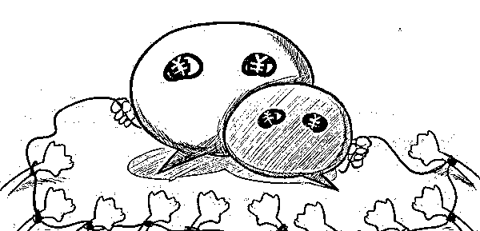

而在黑产项目中，微信账号是其中必不可少的营销工具

1）做淘宝客需要微信号做财务号 

2）做微商需要微信号来展示产品 

3）色情行业需要微信号加人聊天

4）做菠菜（博彩）的需要微信号开群拉人

……

微信账号的用途无所不能，只有你想不到，没有黑产做不到……

这覆盖范围之广也引来了官方的关注，近年来微信官方对于微信号过度营销整顿力度不断加大。 

— 2014 年 6 月 9 日，微信公众号官方启动打击朋友圈恶意“集赞”行为的集中清理 

— 2016 年 9 月 13 日，微信官方发出三次整顿公告，对于多级分销模式的“微商”进行打击 

— 2017 年 7 月 24 日，微信官方做出多次“整顿谣言的生态优化”行动，对于相关非正常使用账号进行封号处理

……

一方面是黑产对于利润的驱使，另一方面是官方对于非正常账号的打击，导致黑产市场上出现了很多“养号”、“交易号”的情况…

## 微信号黑市，40 亿的黑色产业链

由于某宝从 2015 年开始就逐渐加强对虚拟产品的交易监管，其中就包括微信账号的交易，所以目前微信号的交易主要在 QQ 群、微信群、微信公众账号、贴吧等平台。

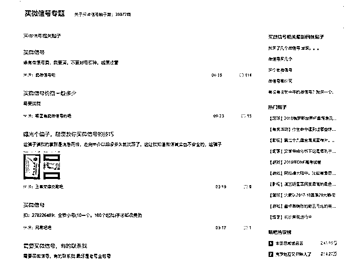

百度某贴吧甚至开专题，进行账号交易

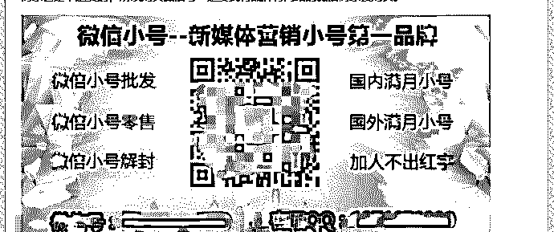

种类繁多，业务线涵盖广

其中，starry 加上了一位“卖号”师傅，聊天后对方也是直接关键词回复报价

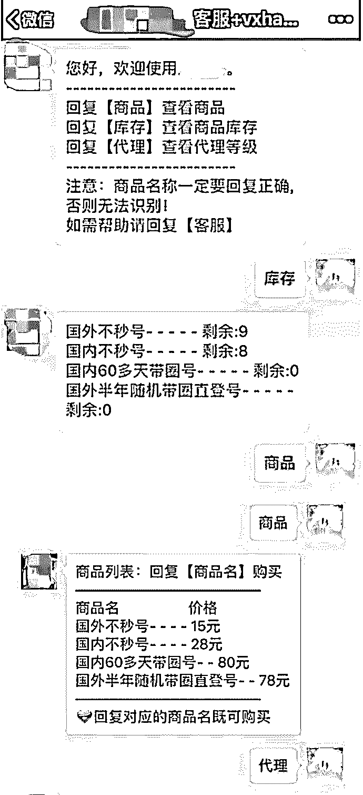

根据服务项目不同，价格也是各不相同

而进一步了解，就发现此类微信号在公众号推广之外，朋友圈也是做得像个微商…

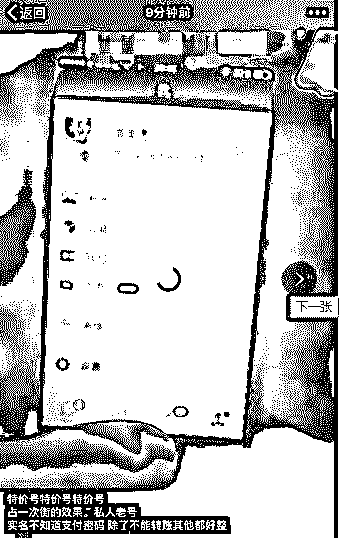

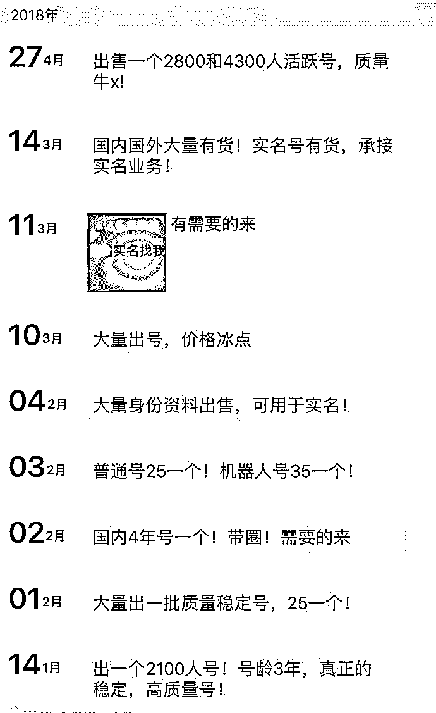微商号、国外号、男号女号应有尽有

而除了普通的账号外，还出现了一种“站街号”，站街号主要指能正常使用“附近的人”和“摇一摇”功能的账号。从而通过以上两种功能来进行营销和推广。

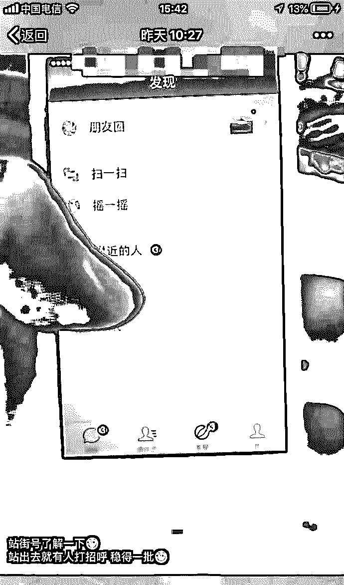

够根据“市场需求”，量身定制，提号就能“用”

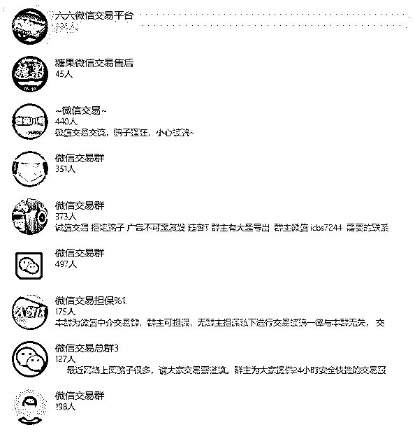随手一搜，QQ 群竞争不要太大

群里也非常热闹，一整天群的图标就没停过，各种交易信息满天飞……

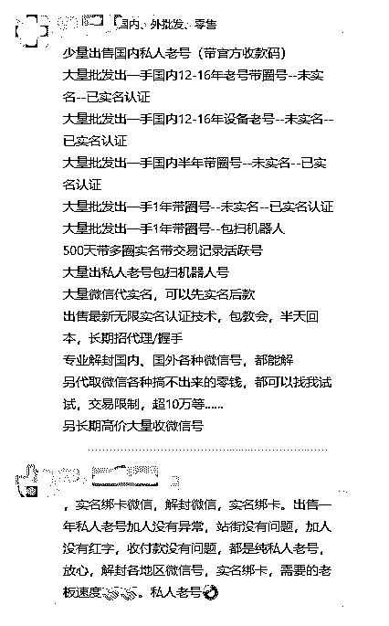

红火的“微信号”生意

交易的账号也按时间、地区进行了分级，总体来看:

1、账号国外比国内贵、港澳台比大陆贵、有圈（即有朋友圈）比无圈贵、账号申请时间越早越贵；

2、一个月以内的均价在 25-40 元，1-3 年的均价在 100-350 元，3 年以内的价格在 500 以内；

3、承诺“24 小时包售后，一年包解封”

这样的贩卖信息不仅在 QQ 群和贴吧内层出不穷，在许多个人网站上有更多关于微信账号的“生态营销圈”……

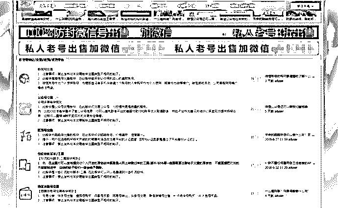个别站长也做起了“微信号”生意

在某宝上，“微信耗”（为避免关键词屏蔽，黑产特意将号输成耗）仍然存在，虽然套了个马甲，但是搜索“微信耗”、“微信建设”等相关词条，会出现相关产品

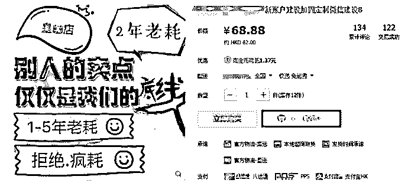

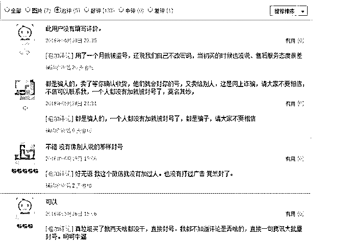

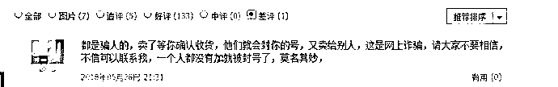

上面这款产品乍一看好评如潮，但是追评区和差评区就露出了端倪

大部分追评反馈购买的微信号很快就被封了，至于背后是卖家诈骗还是官方封号力度更大我们也就不得而知了

除了以上渠道，黑产还在知乎进行宣传，简直无孔不入…

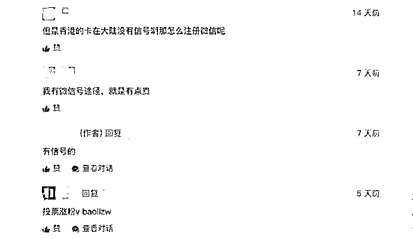

知乎上揽活

## “养号”也是门技术活

有账号的交易就必定有账号的注册和维护，也就是所谓的“养号“。当我们以“微信养号”为关键词进行搜索，发现网络上有很多“养号教程”…

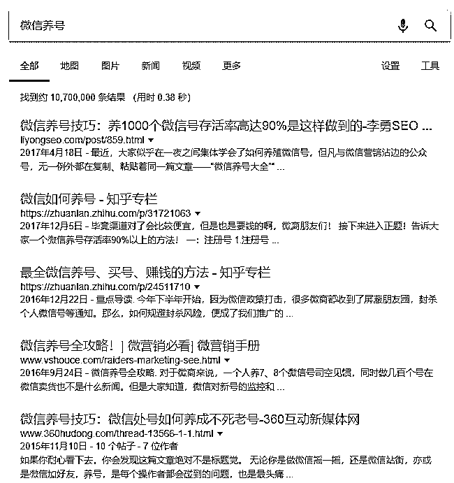

“养号”教程

在“养号“环节，首先就是注册。目前注册环节需要手机号验证绑定，黑产一般直接在市场上购买黑卡，由卡源卡商通过在运营商那里通过各种手段（如外包公司、与代理商勾结等）办理大量的手机卡从而流向黑产市场。目前市场上黑卡注册一个微信号价格在 2.5 元左右。

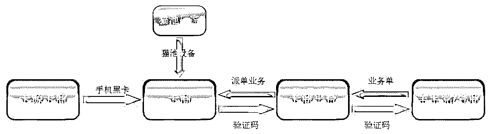

“黑卡”链条

注册完成后，就正式开始了“养号“

第一步，登号

关键点：使用官方客户端+向好友发送验证信息辅助验证（一般黑产会选择向号商辅助验证）

第二步，拉群

关键点：将所有新号互加好友后进入交流群+关注公众号来提高账号活跃度

第三步，完善基础资料

关键点：主要完善头像、昵称、个性签名、微信号、地区、性别等信息

第四步，运营朋友圈

关键点：自建素材+分享公众号相关文章+各账号之间互相点赞留言

第五步，加粉、互动

关键点：通过“摇一摇“、”附近的人“以及群内成员添加等方式添加好友+保证一定时常的互动

第六步，保证活跃、发红包

关键点：绑定一张银行卡（一张银行卡最多绑定 5 个微信号）+适量收、发、抢红包

第七步，修改密码

关键点：不要批量修改同样的密码

第八步，更换手机卡

关键点：微信规定换设备登陆的微信号 6 天后才可以更换手机号

经过了以上步骤，之后 30 天以内日常维护（发圈、聊天、发红包）就完成了对一个新号的“养护“。

就这样黑产将一个个号养成然后送入其他黑产项目中，也许通过看以上步骤我们会觉得十分繁琐，收益比不大，但如果是这样的呢？

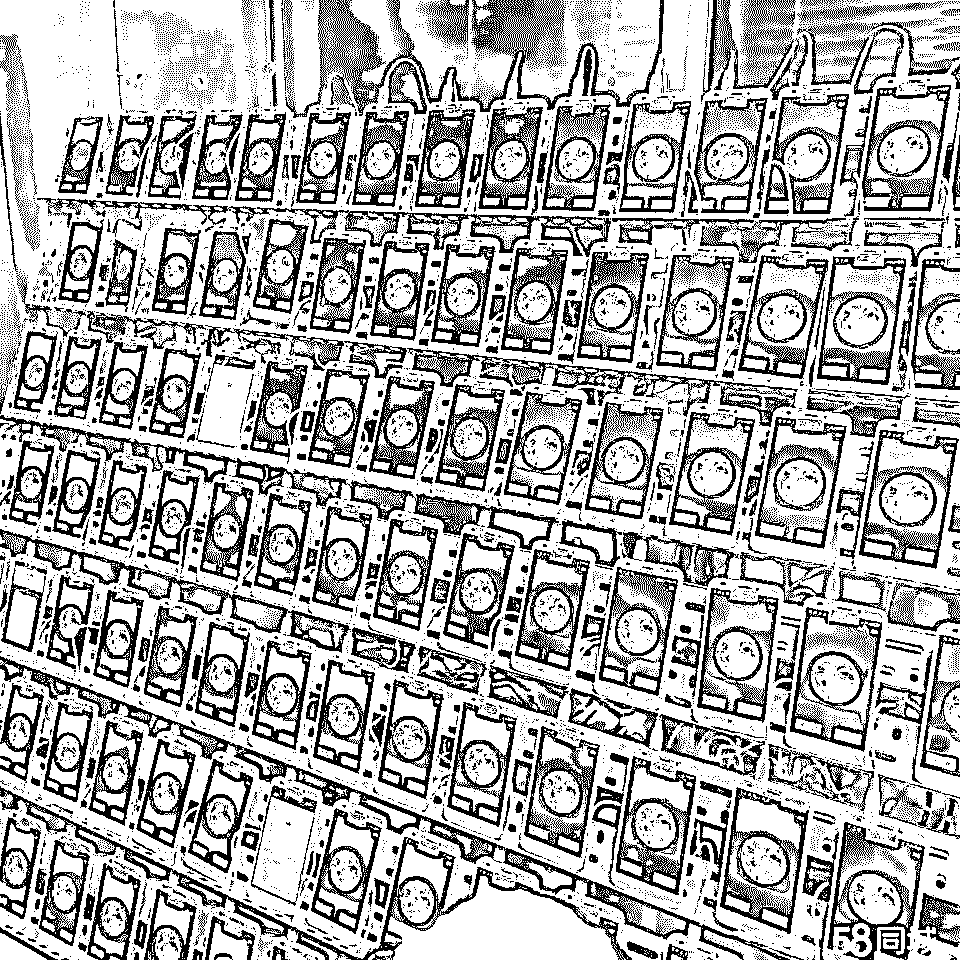

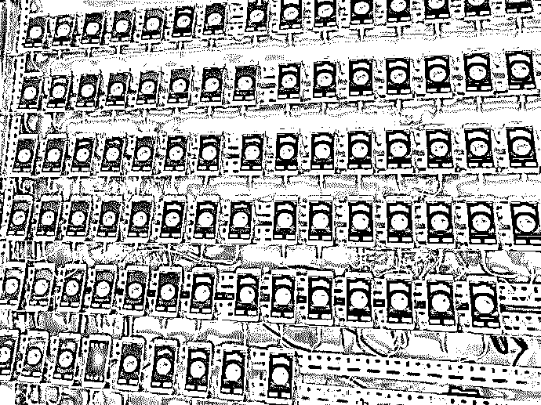

群控成了黑产标配

而且对于这些卡商、羊毛党来说，其产业链十分暴利。就微信来说，一个号商注册一个微信号的成本位 2.5 元左右（主要用于给卡商平台），他们将微信号养一段时间后出售，满月号（注册满一个月）、三月号、一年号分别可以卖到 15 元、40 元、65 元、90 元左右。

如此以来就在微信一个平台卡商一张卡赚取利润将在 12.5 到 87.5 元，除去人力成本平均赚取 30-50 元。

而一张手机黑卡最终在羊毛党/号商手中能产生至少 100 元的收入，按每年 4 千万张黑卡计算，这个产业每年有 40 亿以上的产值。有进必有出，这也意味着企业每年因手机黑卡产业攻击造成的直接损失在 40 亿元以上！

这样的利益必然驱动着更多黑产项目与此相连，如何在次环境中保护自身财产与隐私安全，如何从源头防止卡商注册已成为当前互联网信息安全的头号难题：

一方面，国家通过制定相关法律法规规范市场，同时针对虚拟运营商的违规行为加强管控力度；

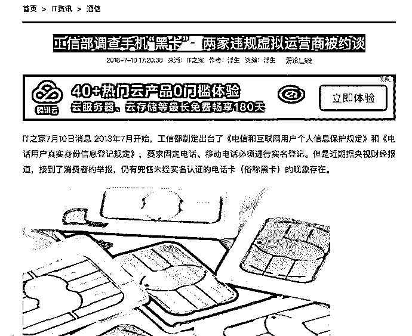

作为黑卡主要源头，国家加大虚拟运营商的管控力度

另外一方面，众多安全服务商也加入到黑卡防控研究。其中，基于深度行为数据与海量数据库，构建安全模型，在不同业务场景为平台（网站/APP）提供实时拦截、实时标记的功能，或成为新的方向

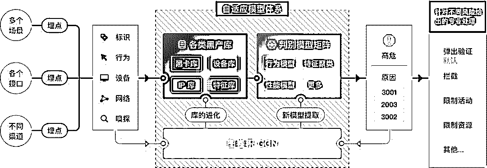

GEETEST GCN

## 参考来源：

> 1.《黑产大数据：手机黑卡调查》——威胁猎人
> 
> 2.《微信养号技巧：养 1000 个微信号存活率高达 90%是这样做到的》——李勇 SEO 博客

* * *

延伸阅读[深度|日流水超 500 万游戏代练的盈利模式：游离于陪练和外挂之外的灰色产业全揭秘！](http://mp.weixin.qq.com/s?__biz=MzIyMDYwMTk0Mw==&mid=2247490278&idx=1&sn=99dc17a3afe8cdf7d29ece8fe0ee672d&chksm=97c8d1dea0bf58c88103472e9e96ead17ca987808d38ef045ee12af3c541f4d57bbec0102ca9&scene=21#wechat_redirect)
[7.15-微信大规模封号，全网独家解读](http://mp.weixin.qq.com/s?__biz=MzIyMDYwMTk0Mw==&mid=2247486656&idx=3&sn=9c485fedb18ef8778a0c9984531c3888&chksm=97c8c7f8a0bf4eeed10390056bf0c58ec3b821524f250db7e1a935d3c1482d318309b850ae5e&scene=21#wechat_redirect)
[深度|揭秘微信“跳一跳”外挂辅助江湖：有人上瘾了，有人赚了 10 万，江湖险恶 ， 人心叵测！（附：福利）](http://mp.weixin.qq.com/s?__biz=MzIyMDYwMTk0Mw==&mid=2247489614&idx=1&sn=4b98a5ba4d3c3a76028c3755bb129efa&chksm=97c8d376a0bf5a60705bcc95b477156fefc55be50b0e6e1dc76dfbb2c76f15f6acec196ef648&scene=21#wechat_redirect)
[2018 年网络黑色产业链大起底（深度调查）](http://mp.weixin.qq.com/s?__biz=MzIyMDYwMTk0Mw==&mid=2247490584&idx=1&sn=7759b3a17ae078e290d3767dcc8b38bb&chksm=97c8d720a0bf5e36ca1e4110bb3d6a0ff1fa58eee414146e2da411cb2d18ab247e8940ee8590&scene=21#wechat_redirect)
[原创|深扒腾讯帝国中隐藏的灰色产业链](http://mp.weixin.qq.com/s?__biz=MzIyMDYwMTk0Mw==&mid=2247485116&idx=3&sn=405543282af423e64dcfa37684356fab&chksm=97c8cd84a0bf44928a7f7de2f6e3ad6293b3b00a75204c859720213646eacd61616373ec4674&scene=21#wechat_redirect)

* * *

****【灰产圈】高端社群小程序开通，2018 最值得加入的社群！**** 

**<mp-miniprogram class="miniprogram_element" data-miniprogram-appid="wx4f706964b979122a" data-miniprogram-path="pages/topics/topics?group_id=881854415822" data-miniprogram-nickname="知识星球" data-miniprogram-avatar="http://mmbiz.qpic.cn/mmbiz_png/kialtkOXGKS7D9hZrmO2jzDqryXXTAlhxSpnrKnHGV65KXzicibOppaPic4dCRxftvabB8Iqswo3OuQEDSxE7NicXBg/0?wx_fmt=png" data-miniprogram-title="【灰产圈】高端社群" data-miniprogram-imageurl="http://mmbiz.qpic.cn/mmbiz_jpg/WWG78hysZ0brJkWoyG2VDIacqgQjkDfp6mLiaoPBJ2SgWZHtRuTw7ia8kpoxntsn7PiaFOQO2U23FW6Iry0gS1GnA/0?wx_fmt=jpeg"></mp-miniprogram>**

****

****点击加入【灰产圈】高端社群****

 **# 

> 原文：[`mp.weixin.qq.com/s?__biz=MzIyMDYwMTk0Mw==&mid=2247492434&idx=1&sn=d21a9c82175a4184404bf5bb46d745b6&chksm=97cb286aa0bca17ceaa5cb432fa36c1cd395100f692fdfb2aaaa53b98a669750398f660ef88c&scene=27#wechat_redirect`](http://mp.weixin.qq.com/s?__biz=MzIyMDYwMTk0Mw==&mid=2247492434&idx=1&sn=d21a9c82175a4184404bf5bb46d745b6&chksm=97cb286aa0bca17ceaa5cb432fa36c1cd395100f692fdfb2aaaa53b98a669750398f660ef88c&scene=27#wechat_redirect)

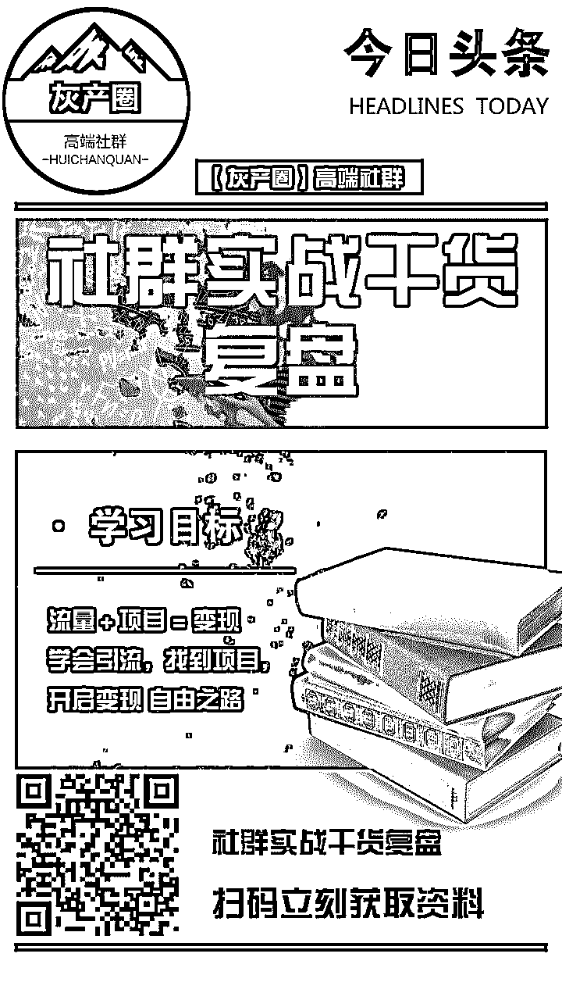**