# 起底 Steam 背后黑色产业链 : 黑市、洗钱和诈骗，年产值十亿美金！

> 原文：[`mp.weixin.qq.com/s?__biz=MzIyMDYwMTk0Mw==&mid=2247492432&idx=1&sn=8287cae2c3fe28530c4f274bff47523d&chksm=97cb2868a0bca17e129b1a7a177dab6e697b4530cffc47928ce2fdd00d6b8b6c5ec743112b44&scene=27#wechat_redirect`](http://mp.weixin.qq.com/s?__biz=MzIyMDYwMTk0Mw==&mid=2247492432&idx=1&sn=8287cae2c3fe28530c4f274bff47523d&chksm=97cb2868a0bca17e129b1a7a177dab6e697b4530cffc47928ce2fdd00d6b8b6c5ec743112b44&scene=27#wechat_redirect)

**点击上方蓝色字体“灰产圈”关注并置顶本公众号**

**作者：触乐网**

**授权转载**

导语

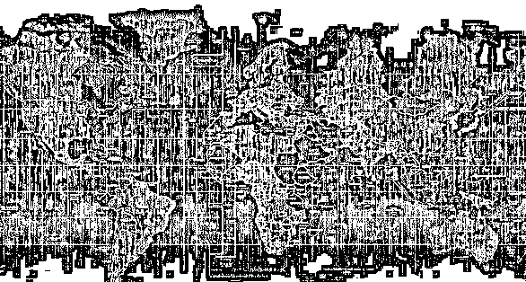

最近半年以来，Steam 账号被盗已经成了高发事件，基本上每天都能在贴吧中看到几个因账号被盗而求助的玩家，我身边的不少同事、朋友也都中了招。

有些人费尽力气找回了账号，可号上已经挂着红色的 VAC 或开发者封禁字样。

账号中出现 VAC 或开发者封禁后，不管这些违规行为是不是在账号被盗情况下发生的，封禁都无法申诉，也无法解除，会永久性地显示在玩家的个人资料页面中，不仅一些联网游戏玩不了，好友也没人加，基本上等于废了。

有的人因此放弃了旧号建新号，但经常是新号没过几天又被盗走，重蹈覆辙。

这就是本文的主题，为什么盗号者如此猖獗，Steam 盗号又怎么防范呢？要说明这些问题，首先要从 Steam 盗号这一现象的背后产业链谈起。

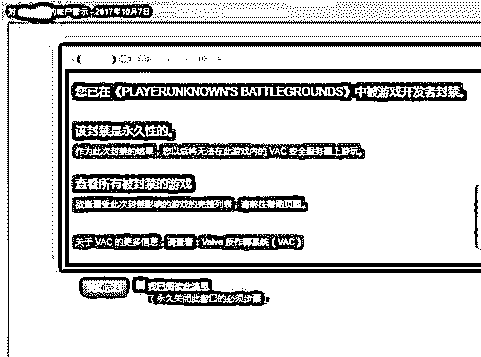

**VAC 是 Valve 反作弊系统（Valve Anti-Cheat）的简称，**

**这意味着账号被侦测到了作弊企图，因而被 Valve 封禁**

 为什么要盗取 Steam 账号？

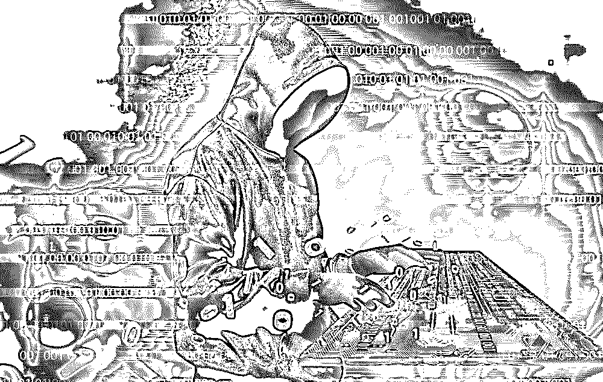

Steam 账号的安全性一直被诟病，在 2015 年以前账号是没有任何保护措施的，只靠用户名和密码就能登录

当时因为黑客瞄准了《CSGO》和《Dota 2》的饰品库存，被盗号的案例数不胜数，直到 Steam 出台了“邮箱验证交易”以及“市场交易暂停 7 天”等措施后，盗号现象才有所收敛。

随后，Steam 又推出了“手机令牌验证市场交易”和“保护登录”等措施，即便如此，在 2015 年末 Steam 官方发布的声明中，还是提到了平均每个月有 7.7 万个账户被盗。

不幸中的万幸是，这种盗号一般都只让账号的原拥有者蒙受经济损失，一般情况下，盗号者也不会为了在游戏中享受作弊快感而去盗号，因为如果账户被 VAC 封禁，会导致这个账户中的虚拟财产无法交易，这对盗号者有百害而无一利。

这个时期，盗号者和被盗对象主要都是外国人或外服玩家，因为相比后来的《绝地求生：大逃杀》，《CSGO》和《Dota 2》在中国区的热度只能说一般，中招者相对来说就不算多了。

早期盗号无非是求财，如今来看反倒没有什么太大伤害了

事情在《绝地求生》走红之后出现了变化。

**与此同时，盗号、黑号的数量开始疯狂增长，在短短半年之内，这个黑色产业形成了组织严密的产业链。**

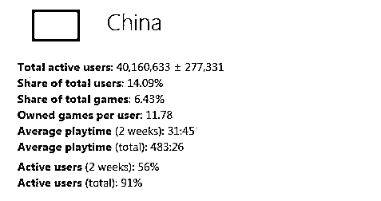

**今年年初，中国区活跃玩家的数量以微弱优势超过美国区（数据来源：SteamSpy）**

从 2017 年年中开始，盗号的风向开始转变，从倒卖账号里的财产变为和外挂绑定进行贩卖。

也就是说，盗号者的目标是盗取游戏库中添加了《绝地求生》游戏的账号，尤其是没有手机令牌的弱密码账号，修改邮箱、手机等密保手段之后，捆绑上外挂，转手当做黑号，以低廉的价格卖掉，赚取利润。

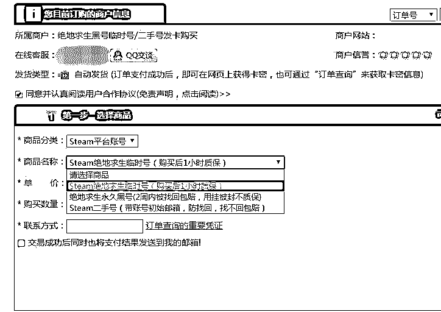

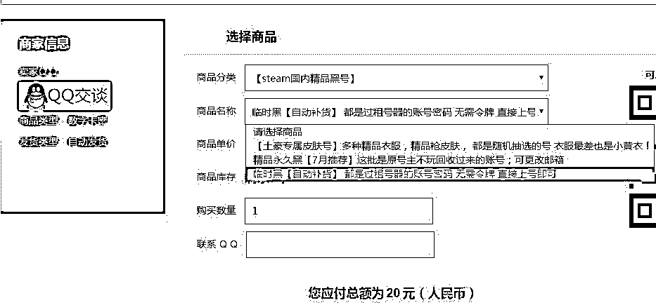

这样，购买黑号的玩家既避免了开挂时自己的账号被封，又能以低廉的价格玩到价值 98 元的《绝地求生》，盗号者更是没有任何风险，怎么看都是双赢的交易。

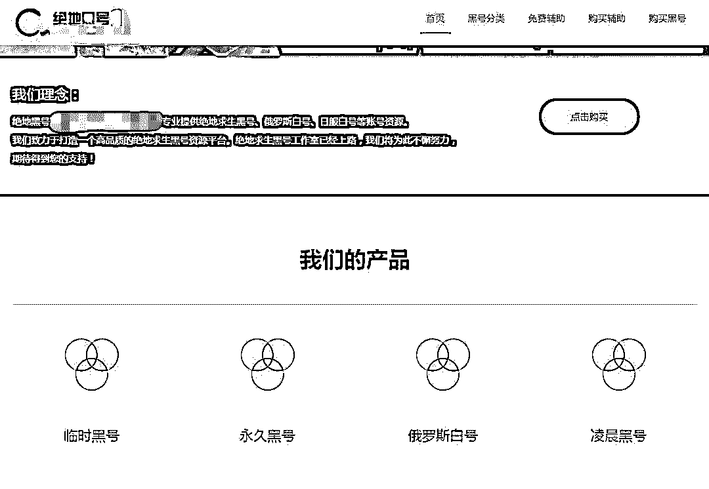

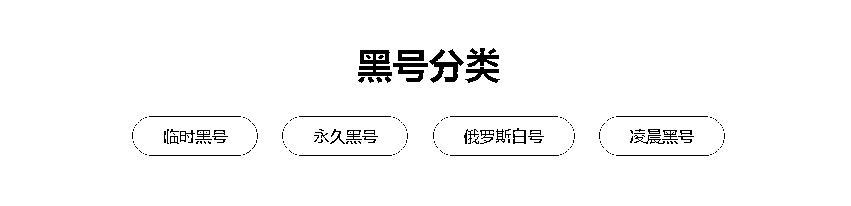**上图为绝地求生黑号专业销售网站截图**

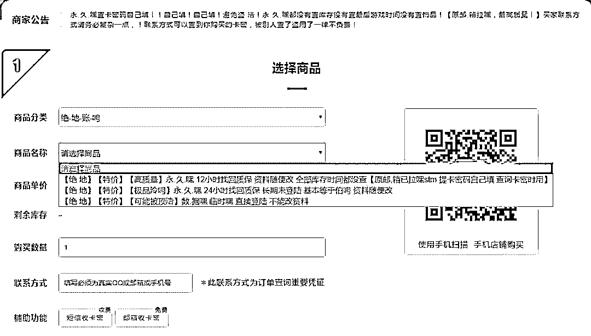

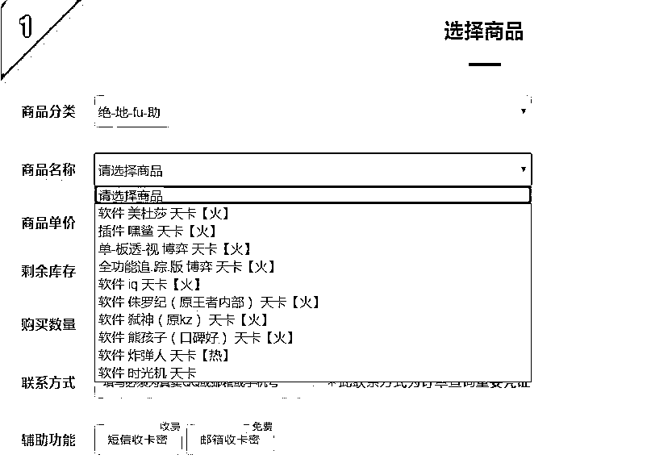

**上图为该网站绝地黑号和绝地求生外挂销售平台截图**

那么，如果不买《绝地求生》是不是就不会被盗了？其实不然，就算不买《绝地求生》，一些盗号者也会直接用黑卡在盗取的账号上购买《绝地求生》，供他人开挂使用。

所谓黑卡，玩手游的朋友们应该很熟悉，就是被盗刷的信用卡，因为从盗刷到信用卡公司或卡主发现并拒付这笔支出，一般会有 1 到 3 天的时间差，因此在这段时间内，通过盗刷购买的《绝地求生》还是可以正常游玩的，当然在这短短几天内，被盗账号往往就会因为开挂而被封。

此外，开挂又被封号的人需要新账号继续开挂，许多人花不起 98 块但还想玩“吃鸡”，加之还有蓝洞误封等原因，导致国内黑号的市场需求源源不断，自然就造成了 Steam 盗号现象频繁发生。

显然，在这一波盗号潮当中，也以国内盗号者盗取中国区账号的情况更为猖獗。

必须指出的是，Steam 的运营目前并不受到国内法律的保护。

如果对象是在国服的网络游戏，比如《魔兽世界》或《地下城与勇士》，都是不太可能有如此巨大的盗号市场的，因为一旦发现，很快就会被有关部门处理。

相反，Steam 的盗号者没有任何顾忌，也不会受到惩罚，所以这也同样促成了盗号行为的极度泛滥。

 盗号者是如何盗取 Steam 账号的？

前面已经提到了，Steam 账号的安全性十分薄弱，2015 年以前，最常见的盗号方式是使用**钓鱼链接**。

当然，这种骗术一般都针对《CSGO》和《Dota 2》，也多数都是外国盗号者所为。

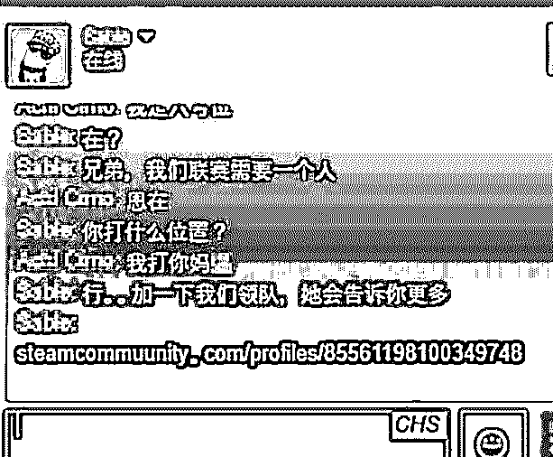

**“加一下我们领队，她会告诉你更多”，后面紧跟的就是钓鱼链接，发这类链接的账号也是被盗的**

其原理也是一样的，盗号者群发钓鱼邮件到 QQ 邮箱，诱骗用户输入 Steam 的账号和密码，甚至顺便还能把 QQ 号一并盗走。

以上这两种钓鱼都是比较基础的骗术，稍微有些网络经验的人都不会中招。

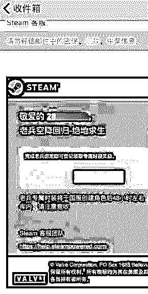

**钓鱼邮件的范例，Steam 的客服绝对不会使用“国服”这样的字眼**

接下来是稍微复杂一些的手段，但也同样容易防范，这就是**“挂马”**。

不法分子会通过外挂、加速器等软件传播盗号木马，挂马盗取的除了 Steam 账号之外，还有玩家电脑里的其他许多账号，危害很大。

如今网吧中 Steam 客户端被魔改的程度超乎常人想象，诸如“吃鸡”助手、“吃鸡”加速器、5 元空号、1 元租号之类的置入广告层出不穷。

由于国内“吃鸡”玩家对新号的需求量极大，网吧 Steam 上展示的小广告自然而然地成了一些玩家的选择，这可能会是你迈向被盗号和买黑号的第一步。

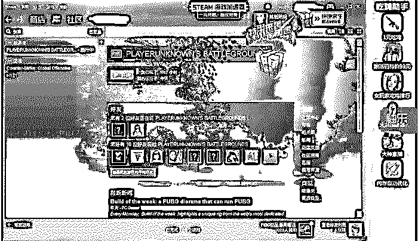

**看上去十分具有乡土气息的网吧 Steam，已经快看不出来 Steam 原有的 UI**

要注意的是，Steam 账号的最高权限属于初始邮箱，也就是说，光有账号和密码的人只是得到了使用权而已。

此外，如果你有自己的 Steam 账号，在没有杀毒软件保护的网吧里也会经常遇到诸如“键盘记录器”等恶意软件的侵害，一些魔改的 Steam 客户端也注入了许多恶意进程，Steam 账号的安全仍然会受到很大威胁。

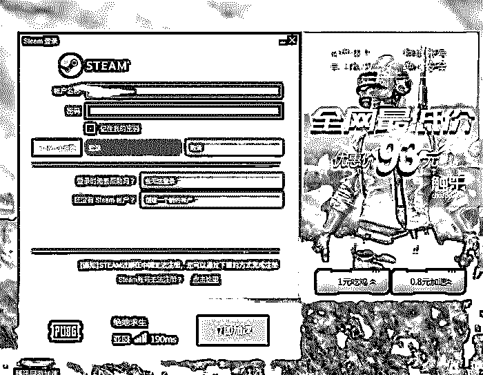

一些网吧的 Steam 登录窗口被广告搞得面目全非，仿佛在说“赶紧输密码，我等着盗你号呢”

最后要说最有效的盗号手段——**盗取邮箱**。由于 Steam 账号的最高权限属于初始邮箱，无论之后如何更改邮箱和手机号，初始邮箱拥有者凭借初次购买的截图永远可以发起申诉，找回账号。

这也意味着，如果邮箱被盗，盗号者可以绕过账号、密码，直接获得账号的所有权限，此时手机令牌也毫无作用。

玩家发现自己无法登录 Steam 时已经为时已晚，等到这 12 个小时过去，找回的账号多半早就因为开挂被封了。

至于盗号者是如何盗取邮箱的，最常见的方法是直接撞库。

此外，其余的国内邮箱也有不同程度的数据泄露，如果你恰好使用这些邮箱进行注册，且事后没有改过密码，那么很容易通过简单的比对就被盗号。

另外，目前针对单密码保护的邮箱，尤其是弱密码邮箱，暴力破解并非难事。

其次就是通过各种渠道挂木马，引导用户中病毒来盗窃账号，这种方法就不再赘述了。

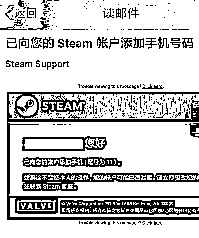

**邮箱被破解后，密保信息被盗号者修改**

再加上很多用户对于 Steam 账号的权限和处理不甚明了，也没有查阅邮箱的习惯（甚至连邮箱推送都没有），无法在第一时间发现账号被盗，这些都给了盗号者可乘之机。

 玩家如何防止被盗号？

明白了原理，接下来谈谈如何保护个人的 Steam 账号。

但很多人因为怕麻烦，或不知道如何绑定 Steam 手机 App，也就没有绑定令牌，甚至不知道手机上还有 Steam 客户端，就很容易导致账号被盗。

目前使用 Steam 手机令牌的简便方法是使用网易 UU 加速器手机版，可以免费加速手机 Steam 客户端从而连上手机令牌。

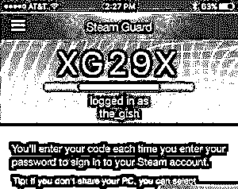

**Steam 手机 App 中的安全令牌**

对于邮箱密码的保护，目前最好的办法就是绑定相关的手机 App 安全中心。

更保险的方法是用境外邮箱，如 Gmail 等，注册 Steam 账号，可以有效避免邮箱被破解，但是如果已经使用了国内邮箱进行注册，也没必要强行换成境外邮箱地址。

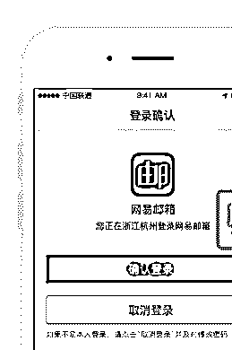

**国内几大邮箱都有类似的"账号管家"等安全 App**

由于很多人没有查阅邮件的习惯，为手机安装邮箱客户端并及时更新推送是十分有必要的，这样可以第一时间获知是否有异常邮件或异常登录出现，可以有效地将损失降到最低。

 结尾

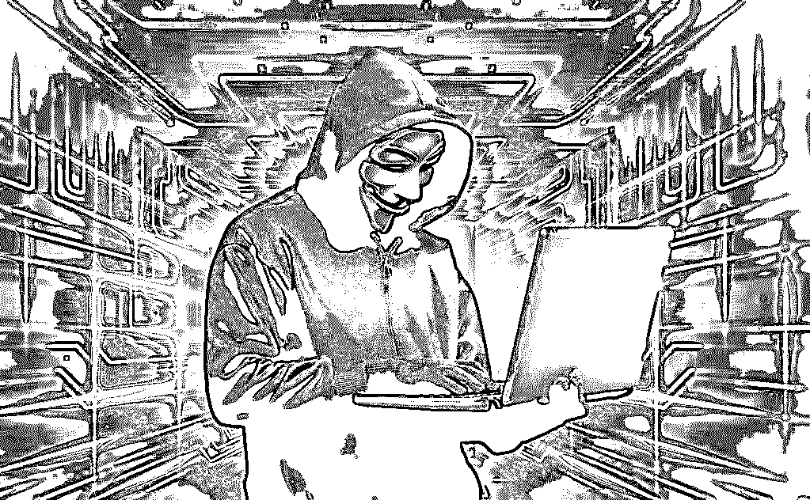

综上所述，我们可以绘制出一幅 Steam 盗号过程的流程图（黑色部分为盗号者行为，红色部分为玩家行为）：

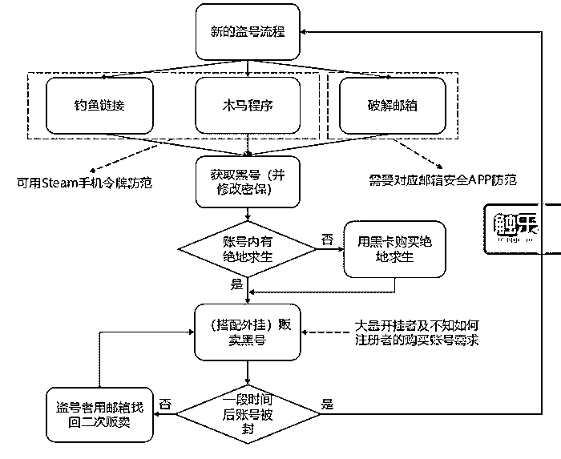

**整个流程是这样的……**

不难看出，这条产业链不同于一般有头有尾的流程图，而是一种循环：只要黑号的市场需求持续存在，玩家又没有足够的账号保护意识，这个产业链就会永远地循环下去。由于 Steam 不受我国法律保护，盗号者也很难被追究法律责任，所以这条巨大的黑色产业链仍然会长时间地存活下去。

目前，Steam 社区在国内无法访问，如果你没有其他方法注册 Steam 账号，推荐使用 Steamcommunity_302 软件来进行设置，一键即可登入 Steam 社区进行注册。请牢记：Steam 账号不需要付费，注册完全免费，购买游戏也不需要代充值，更不要把账号、密码交给他人。

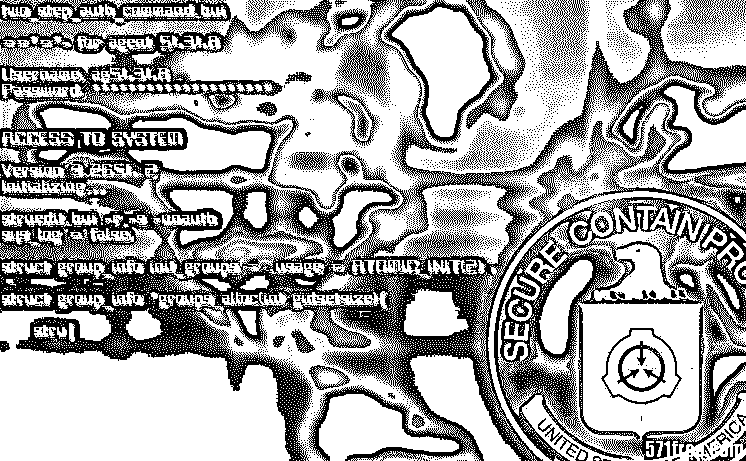

最后提醒各位，VAC 和开发者封禁都是无法消除的，会永久以红色字体显示在个人的 Steam 页面上，所以请各位爱惜自己的 Steam 账号，也珍惜自己购买的每个游戏，不仅要注意保护自己的邮箱和 Steam 账号安全，也不要开挂和进行账号买卖。

最后的最后，衷心希望大家能远离盗号，享受游戏。

最后的最后的最后，

送上 360 发布的**《Steam 新型盗号木马及产业链分析报告》**

关注本公众号，并在后台留言：**steam**

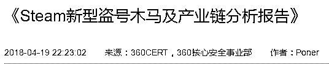

 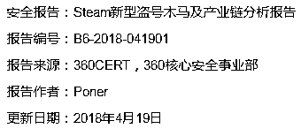

* * *

延伸阅读[游戏盗号黑色产业链：黑客掌握千万条账号信息](http://mp.weixin.qq.com/s?__biz=MzIyMDYwMTk0Mw==&mid=2247483696&idx=4&sn=2284cd278de3f88ecb9d75b5cdb1aea0&chksm=97c8ca08a0bf431e2a63c5dc85e88cac7b1855713e1e2942dce5d9d1404983c6909fc60cd24b&scene=21#wechat_redirect)
[深度|日流水超 500 万游戏代练的盈利模式：游离于陪练和外挂之外的灰色产业全揭秘！](http://mp.weixin.qq.com/s?__biz=MzIyMDYwMTk0Mw==&mid=2247490278&idx=1&sn=99dc17a3afe8cdf7d29ece8fe0ee672d&chksm=97c8d1dea0bf58c88103472e9e96ead17ca987808d38ef045ee12af3c541f4d57bbec0102ca9&scene=21#wechat_redirect)
[深度|游戏世界里的“外挂江湖”：道高一尺，魔高一丈！论黑客和白帽之间的博弈之战！](http://mp.weixin.qq.com/s?__biz=MzIyMDYwMTk0Mw==&mid=2247490080&idx=1&sn=1b34ff33182cef572cd50758e15de1d9&chksm=97c8d118a0bf580e3cbe9061d802a3949740de23df666d4df8c3b8226f4736791ca9679f110a&scene=21#wechat_redirect)
[深度|揭秘“吃鸡”外挂工作室轻松月入百万的黑幕：卧底内部，层层解密，利欲熏心，套路重重！](http://mp.weixin.qq.com/s?__biz=MzIyMDYwMTk0Mw==&mid=2247489294&idx=1&sn=d5bccb01075b0068c8c34559f6b4cb41&chksm=97c8dc36a0bf5520c3ccd99199f34cd36af0de798249cc215a031f352aa83dd2409cc880e411&scene=21#wechat_redirect)
[深度|“绝地求生”外挂江湖：黑暗中崛起的灰色产业，年产值上亿美金！](http://mp.weixin.qq.com/s?__biz=MzIyMDYwMTk0Mw==&mid=2247489918&idx=1&sn=0a28eda8279e7c194d5e2f6bcda6556c&chksm=97c8d246a0bf5b507141f146431442410f38c62e34b5b8aa7c895d3b2bd6ced0e08ab84933ca&scene=21#wechat_redirect)

* * *

****【灰产圈】高端社群小程序开通，2018 最值得加入的社群！**** 

**<mp-miniprogram class="miniprogram_element" data-miniprogram-appid="wx4f706964b979122a" data-miniprogram-path="pages/topics/topics?group_id=881854415822" data-miniprogram-nickname="知识星球" data-miniprogram-avatar="http://mmbiz.qpic.cn/mmbiz_png/kialtkOXGKS7D9hZrmO2jzDqryXXTAlhxSpnrKnHGV65KXzicibOppaPic4dCRxftvabB8Iqswo3OuQEDSxE7NicXBg/0?wx_fmt=png" data-miniprogram-title="【灰产圈】高端社群" data-miniprogram-imageurl="http://mmbiz.qpic.cn/mmbiz_jpg/WWG78hysZ0brJkWoyG2VDIacqgQjkDfp6mLiaoPBJ2SgWZHtRuTw7ia8kpoxntsn7PiaFOQO2U23FW6Iry0gS1GnA/0?wx_fmt=jpeg"></mp-miniprogram>**

**** 

****点击加入【灰产圈】高端社群****