# 深度揭秘币圈超级黑幕：掮客荐币，贷款买币，套路重重，人财两空！

> 原文：[`mp.weixin.qq.com/s?__biz=MzIyMDYwMTk0Mw==&mid=2247492390&idx=1&sn=81d1122932ea7e87306e2a9f3074b567&chksm=97cb281ea0bca1085010faf7cc3ba6307403051628adef845cae325e97029ffc46259fd4fbc4&scene=27#wechat_redirect`](http://mp.weixin.qq.com/s?__biz=MzIyMDYwMTk0Mw==&mid=2247492390&idx=1&sn=81d1122932ea7e87306e2a9f3074b567&chksm=97cb281ea0bca1085010faf7cc3ba6307403051628adef845cae325e97029ffc46259fd4fbc4&scene=27#wechat_redirect)

**点击上方蓝色字体“灰产圈”关注并置顶本公众号**

**导语：**

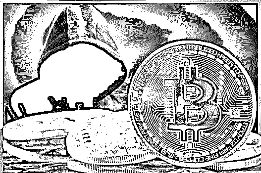

　   这帮掮客，本质上和开沙县小吃、黄焖鸡米饭的是一样一样的。 

　　什么赚钱就干什么，一直干到大家都死翘翘为止，再换下一个。”

　　币圈赚钱的方法，除了大家熟知的炒币、挖矿、搬砖……还有一群人上下通吃、闷声发大财。

　　币价大涨，众人一片欢呼，这群人兴奋异常，不停抽成；币价大跌，众人一片哀嚎，而这群人手舞足蹈，大割韭菜。

　　他们是混迹在韭菜中间，时而装神指点 K 线，时而炫富晒收益。他们是币圈真正的割韭菜专业户、币圈的职业玩家、无形的吸血蚂蝗，提供“一条龙服务”。

　　随着他们曝光增多，这条几乎稳赚不赔、旱涝保收的灰色产业链逐步被外界了解。

      以下为真实事件真实人物采访编辑，人物为化名，故事真实可靠。

** 跳出阶级的机会来了**

       

　　KK 是主动找‘我们’聊的。

　　年过 40 的 KK，在北方小县城做了十几年酒水生意。在北京的旁边——香河买了房定居，算是个小中产阶级。

　　去年 12 月，币圈最火之时，到处都是一夜暴富的故事。“财富自由”口口相传，让不少人都觉得自己可以以小博大，跳出现有的阶级。

　　酒桌上听了故事，赚钱的快感刺激着他的肾上腺素，KK 开始炒币。

　　他觉得自己的机会来了。

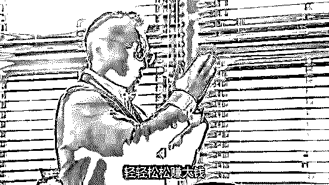

　KK 其实不懂币，也不研究区块链。通常是只要有人跟他推荐，买哪个币赚了，KK 就会跟上。

　　进入币圈的交流群后，时常有不认识的币友互加微信。有的是无头苍蝇打探消息的小白、有的是不停游说你的代投、也有像 CC 这样的神棍。

　　CC 和其他人不一样，他会说看币要看基本面、技术面，时常通过展示高抛低吸的神操作，或者精准预测币价的涨跌，令朋友圈的币友信服万分，KK 只是其中一个。

　　CC 还热心给 KK 点播过几次，KK 那两回都赚了。开开心心主动给 CC 发了两个大红包，一次 200、一次 1000，请他喝茶。

　　4 月初，KK 和 CC 一起，参加了 EOS 在北京的一个线下交流会。

　　KK 那天根本无心听会，他兴奋地四处打听：“你们都买 EOS 了吗？”

　　CC 倒是一直盯着手机，突然小声一句“卧槽”。KK 随口问怎么了，CC 很得意地给他看手机，就在刚刚，EOS 暴涨一波，他的账户又多了一百多万。

　　KK 说自己动了小心思，请 CC 吃了个饭，想要“套点话”出来。

　　这场 KK 自以为套话的饭局间，他得知 CC 算是个“圈内人”，自己公司有内幕渠道，能拿到项目方的一手消息，所以总能踏对点。

　　同时他们也卖消息，根据客户资金等级分类，享受不同的服务。按 KK 目前的资金量，可以享受黄金级别服务。

> “团队的老师给到你具体的买卖指导，赚钱了，团队会抽取一定的佣金作为服务费，账户资金还是你自己保管。亏了的话，等你下次赚了从佣金里扣除补给你。”

　　想到账户资金在 KK 自己手中，且只有他赚钱后，CC 才能有提成。

　　KK 决定小资金尝试。

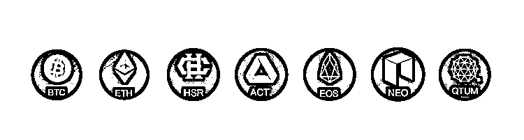

　　不久，KK 收到了团队老师给他发来的买入计划：WICC，4.2 元上下 3 个点，买进做多。

　　第一次没敢买太多，在 WICC 波动到 4.2 元的时候，KK 买了 5 万块，三天后当 WICC 涨到了 5.4 元时，KK 收到了团队老师的平仓计划，卖掉后这次差不多赚了 1.4 万。

　　随后 KK 主动将盈利的部分，按照约定的提成比例将钱转给了 CC。

　　没过多久，KK 再次收到了买入提示：ONT，30 元上下 3 个点，买进做多。

　　这一次 KK 没有太多的犹豫，按照计划买了 10 万块，两天就涨了 34 元，再一次赚了 1.3 万。

　　合作两次，都小赚一笔。KK 觉得 CC 果然是有路子。

**　赌徒从来不知道止损**

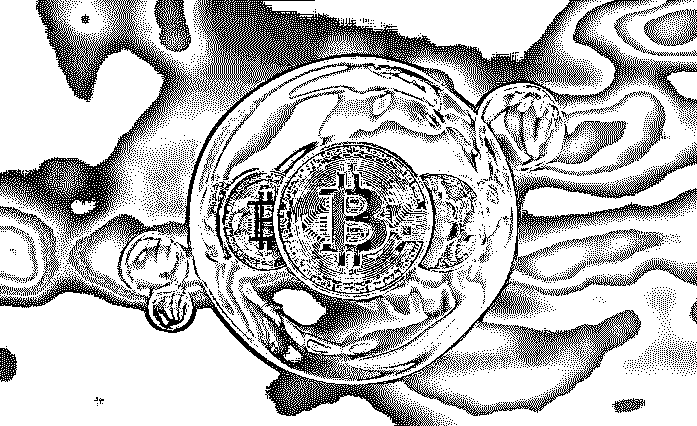

　　这两次赚了几万块让 KK 有点飘飘然。第三次收到 BTM 的买入计划后，他 50 万满仓梭哈了一把。

　　然而这一次幸运没有降临，结果买在了山顶上，大亏被套。

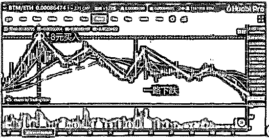

CC 知道后，对 KK 进行了一番教育，说投资是有风险的，切不可随意满仓。

　　KK 也觉得第三次操作过于轻率，着急地询问如何解套？

　　此时的 KK，主动向糖衣炮弹张开了怀抱。

　　赌徒的贪婪，让他们从来不知道什么是止损，不知道做人做事贵在有度。

　　CC 建议 KK 提升服务等级，200 万钻石级别，可以享受团队首席老师的一对一投资服务。

　　CC“因为关系好所以偷偷”跟 KK 说，老师可能会带你买 EOS。

> “在区块链这个行业，到目前为止超级投资机会一共只有三个——BTC，ETH 和 EOS！”

　KK 此时手中已经没有多余闲钱，CC 不经意地提醒他：你不是还有套房值 200 多万吗？

　　CC 建议将房子进行抵押。可能觉得“抵押贷款”说起来难听，CC 的叫法是“资产再利用”，简直妥妥的高大上。

> “币圈大佬都是 ALL IN 的，一套房进去，十套房出来；团队首席老师牛逼着呢，最近又带人一个月赚了两倍；我有认识的熟人，抵押放贷很快，不走银行那么麻烦．．．”

    犹豫的时候，EOS 不断冲高，仿佛验证了他的说法。

　　KK 想，“如果顺利的话，一个月后可以把房子赎回来，算上利息，风险不是很大。”

　　辗转反侧睡不着，第二天早上六点不到，他就给 CC 打电话，带着房产证明，拜托李勇找关系。

　　最后，签订了短期月利为 10%的抵押，4 天，拿到了 160 万（折旧 80%）的“本钱”。

　　一位刘老师指导 KK 开始布局 EOS，前几次都很顺利，利润不断。

　　随着 EOS 的一路上涨，KK 也是一直在加仓，陆陆续续分批入场。

　　到高位时，仓位已经到了 120 多万，一波大跌，小赚大亏，再次套牢。

　　刘老师不断充值信仰，声称回调就是买入时机，等 6 月主网上线，便是数倍拉升！KK 最终选择相信，继续补仓，最后随着 EOS 一路下跌，亏损近百万。

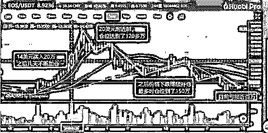

     主网上线后，EOS 却并未刘老师所说那样爆涨，反而持续走低，KK 亏损进一步加大。而刘老师反复安抚是价值投资，CC 的态度也开始变得敷衍，只说听老师的建议，继续持有。

　　而最终随着 EOS 的再一次暴跌，KK 在 EOS 上的浮亏达到 130 万。

　　这两天，贷款公司开始频繁打起催款电话，KK 算了算，即使他将之前的房子抵给贷款公司，还会背上数十万负债。而这一切，又如何向家人交代？

　　说完这些，KK 摸了摸喉咙，他说感觉嗓子眼里像被塞了一个臭鸡蛋，堵得慌。

**久赌必输**

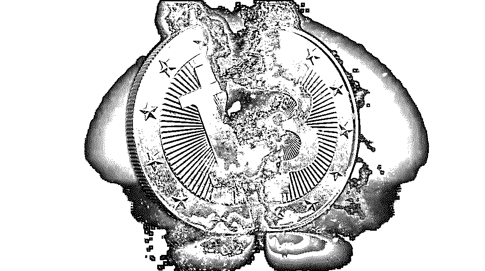

　　其实赌博这种东西，即使在完全公平的情况下，只要庄家有稍微大一点赢的可能性，那么在多次交易中，输家永远是你。

　　就像赌王何鸿燊说的：“不怕你精，不怕你呆，不怕你赢，就怕你不来。”

　　经‘她在币圈漂’调查发现，像 KK 这样的情况不在少数。

　　我们采访到一位不愿意透露姓名的“中介”，据他透露，像 CC 这样的公司是专门以指导散户投资操作，收取分成的盈利模式；同时也会联合庄家一起割韭菜，一条两面通吃、一条龙服务的灰色产业链。

　　CC 就是在做不对称链接，扮演着一个信息中介者的角色。

> **一、分红抽成**

　我们通过其联系到一个中介公司，谈话间对方介绍了自己的盈利模式：

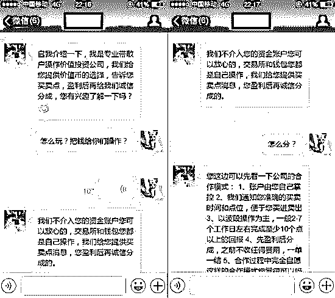

　一般而言，“中介”会先让投资者先赚一点，尝到甜头后就开始忽悠他加大投资，由老师带着买入、卖出。

　　一般能赚到第一笔钱的人，会梦想继续赚钱，从而会投入更多的钱，但是人往往只想到了好的一面，却忘了金融的本质往往就是掠夺。

　　别看第一次赚到了，但是 100 万资金，满仓交易的情况下，一般爆仓两到三次，你的剩余资金可能就够买个棒棒糖了。

　　赌性大的人甚至倾家荡产、靠借贷来投资。

　　中介不会放过这个机会，他们也有专业的机构和贷款公司合作，你的利息暗地里也要放把血。

　　而投资者不知道的是，他投的钱，没有一丝盈利的可能，全都进入了骗子的口袋。

> **二、庄家出货，散户接盘**

       跟很多“币圈大神”一样，这些“中介”其实干的都是一件事，就是找大量散户接盘。

　　可能你会嗤之以鼻，散户能接得住？我告诉你：能！

　　拿一个 30 亿市值的币举例：机构和创始团队持仓就占了一半以上，那剩下 50%，再除去私募锁仓、挖矿、套牢的散户、和一些长期持有者以外，实际流通的筹码并没有多少，一两千万资金确实是可以控盘的。

　　当一个“大 V”在数十或者数百的投资群里推荐一个币，形成的购买力是不容小觑的。

　　庄家在散户的掩饰下出货，而作为散户的你，却在他们的诱惑下接盘。

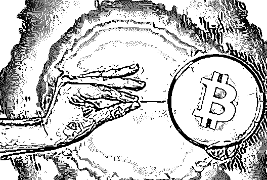

**空手套白狼的游戏**

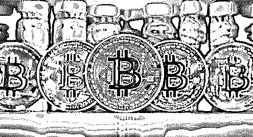

     这其实是个很常见的套路。

　　举个例子：诈骗分子给 500 个人发邮件称 A 会赢，再给另外 500 人发邮件称 B 会输。被押中的这 500 人就是下一轮被拆分概率的对象。

　　一轮轮下去，总会有少部分人获得全部押中的消息，然后放下警惕心，被诈骗分子成功下套。

　　就像这届世界杯，很多人赌球，想赢把大的就收手，但没几个人收的住，绝大部分人结局都是输。几位罕见的幸存者，成为了所有人口中的某个朋友。

　　但由于只提供消息，操作权在投资者自己，这群掮客就这样堂而皇之地生成了自己一套完整的灰色产业链，打着擦边球一次次空手套白狼，游走在法律的边缘。

　　其实这帮掮客，本质上和开沙县小吃、黄焖鸡米饭的都是一样一样的。

　　什么赚钱就干什么，一直干到大家都死翘翘为止，再换下一个。

　　一艘接一艘，崭新的游戏战舰杀进资本海洋，炮口闪闪发光。

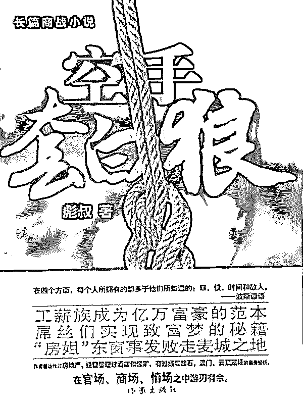

 　而受骗的这些人，往往都有一定的投资意识，有一定的金钱欲望。所以当数字货币时代看似来了的时候，都不想错过。

　　“不听他的，EOS120 元的时候卖了就好了！”这是 KK 最后对我说的话。尽管他玩了一圈，欠了一屁股债，还在期盼着有一天“价值回归”。

**结尾：**

　　最后，巴菲特老爷子有这么一段话，让我至今记忆犹新：

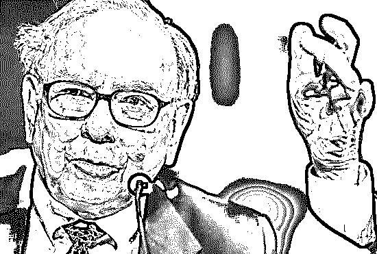

> “如果你给我一把枪，弹膛里有一千个甚至一百万个位置，里面只有一发子弹，要花多少钱才能让我对着自己脑袋来一枪？
> 
> 　　告诉你，给多少钱我都不干。但因为脑子不清楚，总有人去干这种蠢事。”

    　KK 死于愚蠢、死于贪婪、死于脑子不清楚。

　　可后面还有很多个 KK 在排着队，等着上天台。

　　（应受访者要求，文中人名皆为化名）

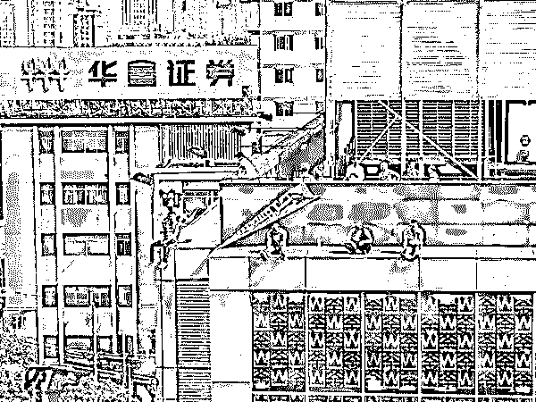

* * *

延伸阅读[一篇文章读懂区块链：币圈一天,江湖十年!（深度好文）](http://mp.weixin.qq.com/s?__biz=MzIyMDYwMTk0Mw==&mid=2247490389&idx=1&sn=723efdb12fc9c6cfc2d3e84d51f8f385&chksm=97c8d06da0bf597bfdff32d62578c6c43164c53b32b16413ce89a8d57e2bfc8e22e56614083e&scene=21#wechat_redirect)
["比特币首富"李笑来：一个诈骗者的财富自由之路！](http://mp.weixin.qq.com/s?__biz=MzIyMDYwMTk0Mw==&mid=2247492297&idx=1&sn=e8603af326177886663aed244d7f0a61&chksm=97cb29f1a0bca0e73f5118543cf31d14b8a41b6a43ce0e0683604318420d4401b7a0d72f445d&scene=21#wechat_redirect)
[揭秘|区块链黑幕： 我们不生产“白皮书”，我们只是“白皮书“的搬运工！](http://mp.weixin.qq.com/s?__biz=MzIyMDYwMTk0Mw==&mid=2247492086&idx=1&sn=5210a17129a85862242ae34a3cace760&chksm=97cb2acea0bca3d8076b330a1a9f0f397e8b8913f2e743c24b0bdc9ea0e0998872fa3db25447&scene=21#wechat_redirect)
[区块链狂欢，虚拟币骗局的背后如何不当韭菜？](http://mp.weixin.qq.com/s?__biz=MzIyMDYwMTk0Mw==&mid=2247491136&idx=2&sn=6440c209de25721fac8b3709b505b35a&chksm=97c8d578a0bf5c6eb03eb4e547f7c5240e69af9616c804d234b00669f0622ea0288b307b99c4&scene=21#wechat_redirect)
[区块链乱象：709 个以太币能买下“日本”！](http://mp.weixin.qq.com/s?__biz=MzIyMDYwMTk0Mw==&mid=2247491060&idx=1&sn=4bf5820b09749ccf468eef9383b02357&chksm=97c8d6cca0bf5fdad1a318363818805776c59693d72f96568ab27c9c8393088cf192409c23e8&scene=21#wechat_redirect)

* * *

****【灰产圈】高端社群小程序开通，2018 最值得加入的社群！**** 

**<mp-miniprogram class="miniprogram_element" data-miniprogram-appid="wx4f706964b979122a" data-miniprogram-path="pages/topics/topics?group_id=881854415822" data-miniprogram-nickname="知识星球" data-miniprogram-avatar="http://mmbiz.qpic.cn/mmbiz_png/kialtkOXGKS7D9hZrmO2jzDqryXXTAlhxSpnrKnHGV65KXzicibOppaPic4dCRxftvabB8Iqswo3OuQEDSxE7NicXBg/0?wx_fmt=png" data-miniprogram-title="【灰产圈】高端社群" data-miniprogram-imageurl="http://mmbiz.qpic.cn/mmbiz_jpg/WWG78hysZ0brJkWoyG2VDIacqgQjkDfp6mLiaoPBJ2SgWZHtRuTw7ia8kpoxntsn7PiaFOQO2U23FW6Iry0gS1GnA/0?wx_fmt=jpeg"></mp-miniprogram>**

****

****点击加入【灰产圈】高端社群****