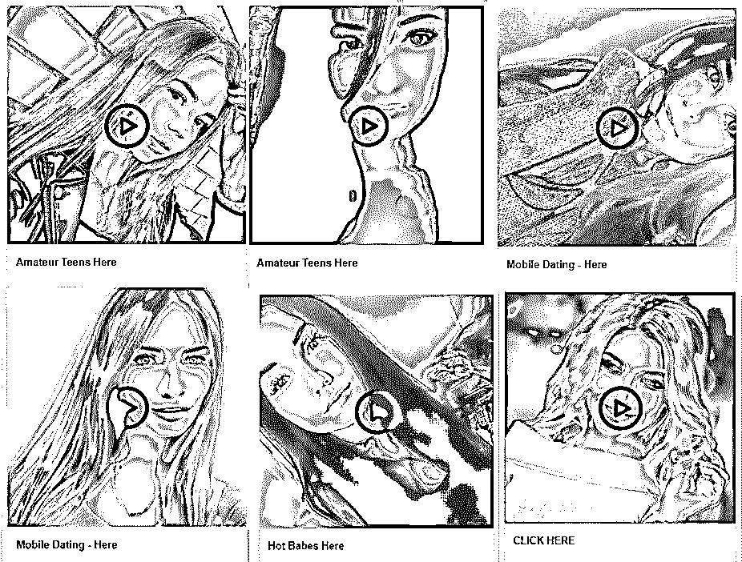
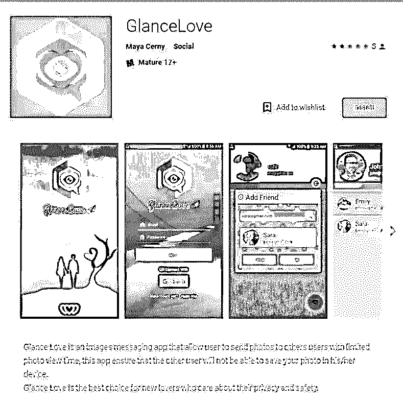
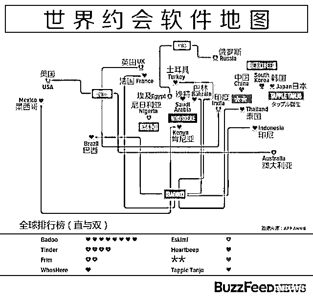
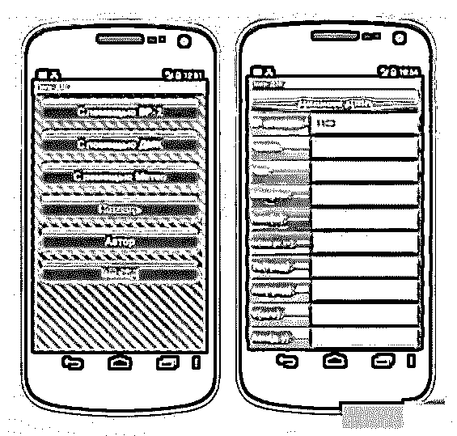

# 巴以冲突再升级，这次导火索竟然是一款交（yue）友（pao）APP

> 原文：[`mp.weixin.qq.com/s?__biz=MzIyMDYwMTk0Mw==&mid=2247492373&idx=1&sn=90222472d74fe31e9900a78acd6c5ce4&chksm=97cb282da0bca13b65dd8b1b4ef980336aec67ac6f5a60df659ea79a679272688a9337896dfd&scene=27#wechat_redirect`](http://mp.weixin.qq.com/s?__biz=MzIyMDYwMTk0Mw==&mid=2247492373&idx=1&sn=90222472d74fe31e9900a78acd6c5ce4&chksm=97cb282da0bca13b65dd8b1b4ef980336aec67ac6f5a60df659ea79a679272688a9337896dfd&scene=27#wechat_redirect)

**点击上方蓝色字体“灰产圈”关注并置顶本公众号**

**作者：极验 Magiccc**

**7 月 6 日，以色列网络安全公司 ClearSky Security 发布报告称，哈马斯试图通过世界杯和约会类 APP 诱骗以色列国防军安装受恶意软件感染的间谍软件......**

以色列国防军（Israel Defense Forces，IDF）

面临“色诱”挑战

1

**长达半个世纪的巴以冲突**

**基督教、犹太教、伊斯兰教**

**神仙的后裔打架**

**在 Magiccc 印象里，“巴以冲突”是从小听到大的词，但直到写这篇文章，才明白这背后盘根复杂的关系。今年是以色列建国 70 周年，在当地时间 5 月 14 日下午 4 时，美国人将驻以色列新使馆迁至耶路撒冷，并举行开馆典礼。**

**就在当天，中东局势再度陷入动荡。在巴勒斯坦与以色列交界的加沙边境，以色列军队用枪支坦克射杀抗议的巴勒斯坦平民。**

**美国人再挑事端**

**而就在 70 年前，以色列宣布建国，次日爆发第一次中东战争，近百万巴勒斯坦人沦为难民。法塔赫代表亚西尔·阿拉法特死后，哈马斯（巴勒斯坦伊斯兰抵抗运动）更加有恃无恐，对以色列平民及军事目标发动的攻击从未停歇......**

**2**

****正面刚不赢，哈马斯派出 11 名黑客****

**面对中东地区唯一拥有核武器和具备能发射卫星实力的以色列，哈马斯经常被以色列人按在地上摩擦。而作为“圣战”代表，主张消灭以色列，解放巴全部被占领土的哈马斯，很长一段时间，只能靠自杀式袭击进行反击。**

**但是时间一久，哈马斯发现，如果打击不到以军的战略要地，并不能起到很好的效果，反而落得个恐怖组织的口实。于是，近年来，有关哈马斯黑客“色诱”以色列国防军的新闻逐渐变多......**

**以色列国防军（Israel Defense Forces，IDF）的官员称，哈马斯为了引诱以军士兵，从他们那里套取敏感安全情报，专门编制了几套假的手机软件。今年以来，有大量陌生人通过社交网店与数百名以军士兵联系，叫他们下载安装各种软件，包括虚假约会软件 GlanceLove、WinkChat 和世界杯软件 Golden Cup。 **

****

**ClearSky 报告展示山寨软件**

**Magiccc 发现，哈马斯这次山寨的交友应用非常小众，在世界约会软件圈都排不上号。**

****

**所以，GlanceLove 在谷歌应用市场搜索不到，也不确定是否已下架，但是从中东一些第三方的应用平台仍可下载。**

**苦于手上没有安卓手机，也就只能看看**

**根据以军一名前 IDF 士兵介绍，他在 Facebook 上收到一条看起来很无助的消息，来自一个名叫 Lina Kramer 的女郎。然后，愉快的跟这名叫“丽娜”的女子在脸书上用希伯来语交谈（希伯来语是犹太人的民族语言，是世界上最古老的语言之一）。**

****

**这类手段如此熟悉，像极了我国卖茶叶的那群黑产**

**（茶叶梗 [每天对我嘘寒问暖的美女，居然......](https://mp.weixin.qq.com/s?__biz=MzI2MDE5MTQxNg==&mid=2649687745&idx=1&sn=3afaf297bb5c4c55f2e64bede526e8a6&chksm=f276c316c5014a00e70f47cf8a1c1a27de03da228acc9bed45568b4f59185d07eb09f0f62459&scene=21#wechat_redirect)）**

**聊嗨了以后，双方直接加了 Whatsapp，然后丽娜就让他下载 GlanceLove（交友软件）。**

**IDF 提供的新闻图片**

**以军士兵只想简单的交个朋友，没想到对方竟然想睡他，一怒之下这名士兵立刻向上级报告了这个事情。以色列国防军发言人表示，因为对方希伯来语非常烂，所以他们很快就发现了哈马斯的阴谋，并发现至少有“数百名”士兵的手机受到感染......**

**ClearSky Security 公司的安全专家指出，他们一直都在追踪这次攻击背后的哈马斯组织“Arid Viper” 。这个由 11 人组成的参加分发恶意软件的小组，主要任务就是通过恶意应用获取以色列军方机密信息。如此骚操作，其实也不算是新闻......**

**3**

****黑客涉政，改变世界格局****

**2014 年 4 月，乌克兰西南敖德萨地区，在美俄煽动下，50 多名俄族示威者死亡。很快，在 5 月初，事件演变为武装冲突，最终乌克兰冲突爆发。**

**乌克兰东部和南部的俄语地区和乌克兰政府军一直处于交战状态。这场被称为“顿巴斯战争”的长久拉锯莫名其妙开始，也没有完全停息的态势。但是，就在 2014 年 8 月之后，乌克兰政府军便开始一溃千里，其原本耀武扬威的炮兵部队更是损失惨重，以至于不得不在次年被迫开始停火议程。**

**而据媒体报道，这背后，很可能和一款特别的手机应用程序有关。乌克兰炮兵因使用民用安卓软件，被俄罗斯黑客轻易定位......**

****

**图片来自：安全客“皮鲁安全之家”**

**有一位叫 Sherstyuk 的大神，这名炮兵军官在乌克兰陆军炮兵部队中服役时开发出了一款运行于安卓系统上的应用，而这款应用的功能，便是为这些老式的苏制榴弹炮提供一个简易的“火控计算机”。**

**依靠手机上安装的定位和传感器，再输入所需的炮兵诸元，Sherstyuk 开发的“定位-D30”安卓应用能够轻易地给出原本需要漫长计算过程的火炮操作数据。之前炮兵得拿个纸在那算一会，才能瞄准，就算有经验的炮兵也得算几分钟，这个程序主要写好算法,让人输入最后生成计算结果。**

**说白了，乌方一开始就开了外挂，吊打俄军。使得俄罗斯在战争初期，就陷入被动。**

**但是，这个事很快被俄罗斯黑客组织“梦幻熊”发现了，他们攻击了 Sherstyuk 的电子邮箱，篡改了“定位-D30”的公开发布版本，植入了后门程序，使其反制精确打击的能力为零！！！**

**据悉，在网络安全公司于事后对后门版“定位-D30”的编译报告中，就明确指出了“定位-D30”暗藏的后门程序带有向某个网络地址发送该设备位置数据的功能。而这正意味着，当乌克兰炮兵开始使用“定位-D30”进行瞄准准备的同时，俄罗斯方面早已清楚这些炮兵和大炮的位置，甚至只要“定位-D30”隐藏在后台，这些士兵们的踪迹也对俄罗斯方面一览无余......**

**而在 2015 年 11 月，ISIS 制造了巴黎恐怖袭击事件，全球最大的黑客组织 Anonymous 向 ISIS 及其支持者宣战。**

**这是继声援维基解密之后，Anonymous 对外的又一次大规模行动。**

 **[`v.qq.com/iframe/preview.html?vid=v1343nx8r50&width=500&height=375&auto=0`](https://v.qq.com/iframe/preview.html?vid=v1343nx8r50&width=500&height=375&auto=0)** 

**Anonymous 向 ISIS 宣战视频**

**现代战争中，士兵、武器不再是核心关键，”信息安全战“将成为左右战场乃至于世界格局的重要关键。所以，各国纷纷加大投入发展国家信息技术！**

****

* * *

****【灰产圈】高端社群小程序开通，2018 最值得加入的社群！**** 

**<mp-miniprogram class="miniprogram_element" data-miniprogram-appid="wx4f706964b979122a" data-miniprogram-path="pages/topics/topics?group_id=881854415822" data-miniprogram-nickname="知识星球" data-miniprogram-avatar="http://mmbiz.qpic.cn/mmbiz_png/kialtkOXGKS7D9hZrmO2jzDqryXXTAlhxSpnrKnHGV65KXzicibOppaPic4dCRxftvabB8Iqswo3OuQEDSxE7NicXBg/0?wx_fmt=png" data-miniprogram-title="【灰产圈】高端社群" data-miniprogram-imageurl="http://mmbiz.qpic.cn/mmbiz_jpg/WWG78hysZ0brJkWoyG2VDIacqgQjkDfp6mLiaoPBJ2SgWZHtRuTw7ia8kpoxntsn7PiaFOQO2U23FW6Iry0gS1GnA/0?wx_fmt=jpeg"></mp-miniprogram>**

****

****点击加入【灰产圈】高端社群****