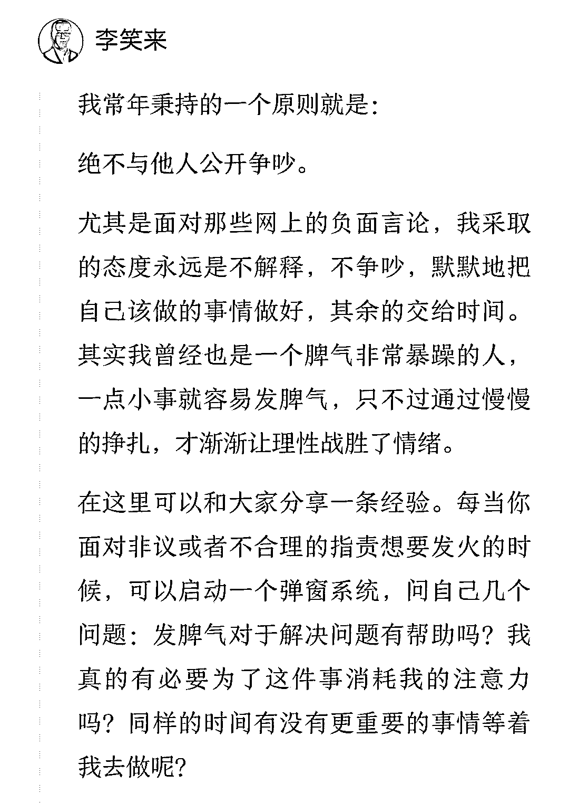
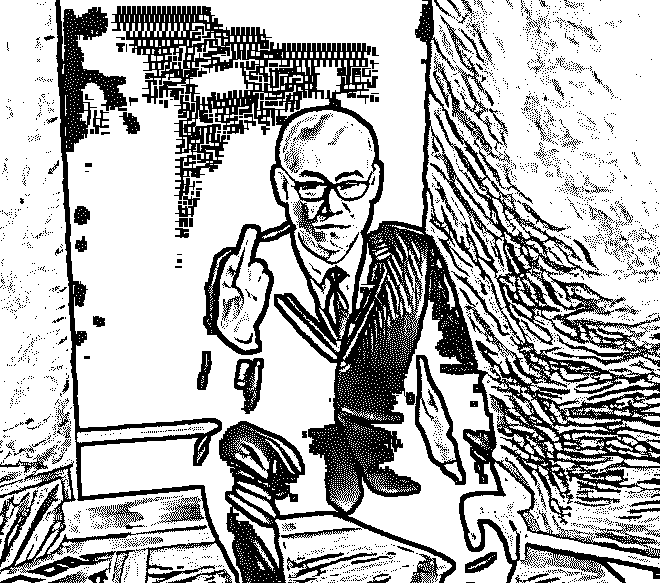

# "比特币首富"李笑来：一个诈骗者的财富自由之路！

> 原文：[`mp.weixin.qq.com/s?__biz=MzIyMDYwMTk0Mw==&mid=2247492297&idx=1&sn=e8603af326177886663aed244d7f0a61&chksm=97cb29f1a0bca0e73f5118543cf31d14b8a41b6a43ce0e0683604318420d4401b7a0d72f445d&scene=27#wechat_redirect`](http://mp.weixin.qq.com/s?__biz=MzIyMDYwMTk0Mw==&mid=2247492297&idx=1&sn=e8603af326177886663aed244d7f0a61&chksm=97cb29f1a0bca0e73f5118543cf31d14b8a41b6a43ce0e0683604318420d4401b7a0d72f445d&scene=27#wechat_redirect)

****点击上方蓝色字体“灰产圈”关注并置顶本公众号****

****

****本文在灰产圈 315 特辑中发布过，相信有的粉丝看过这篇文章，当时这篇文章的阅读量发布当晚突破 1w＋，并得到很多媒体的广泛转载和关注，为什么把本篇文章重新翻出来，因为前天晚上爆出李笑来内部录音：满嘴脏话，说韭菜就是傻逼，很多玩币的人幡然醒悟，调侃道：在李笑来眼里，“我”连傻逼都不如！  现在重新回味这篇文章，真的是耐人寻味，针针见血！ 文章末尾有彩蛋！****

****

****导语****

****

****

**在当今之中国，李笑来可算是个大名人。**

**中国比特币首富；**

**得到 APP“财富自由之路”专栏作家；** 

**天使投资人；**

**艾德睿智国际教育咨询创始人；**

**虚拟货币交易平台云币网创始人；**

**等 ……**

****

****

****一.  还原一个最真实的李笑来****

****

****

**在我看来，李笑来与“雕爷牛腩”的那个雕爷，是我在中国这一大批商业名人里，最恶心的两位——堪比陈安之. 翟鸿燊。** 

**正是因为，他们纯粹通过忽悠概念而收取大众智商税。**

**当然，恶心归恶心，只要是有人愿意被收割，人家就能收到智商税，关我屁事！**

**直到央行 7 个部门联合发布《关于防范代币发行融资风险的公告》（下文简称“《公告》”），我才能把李笑来与金融诈骗对上号。**

**《公告》明确说明：代币发行融资（ICO），“本质上是一种未经批准非法公开融资行为，涉嫌非法发售代币票券.非法发行证券和非法集资、金融诈骗、传销等违法犯罪活动。”**

**与李笑来对上号的，是他自称创立的数字货币 EOS（区块链操作系统）项目还有 Press.One 项目。**

**2017 年 6 月底，李笑来第一个 ICO 项目 EOS 白皮书问世，尽管面临种种的质疑，但 EOS 短短五天内融到了 1.85 亿美元。2017 年 7 月 2 日，EOS 整体市值达到了近 50 亿美元——有的人称之为“价值 50 亿美元的空气”。**

**这 1.85 亿美元绝大部分来自国人的集资，正如《公告》所说，涉嫌非法发售代币票劵、涉嫌非法集资、金融诈骗……**

**EOS 币在 7 月 3 日达到最高点 36.58 元后，开始一路下跌，截止到 8 月 29 日，EOS 币成交价已经跌到了 8.74 元，相比最高点下跌了 76%——不难想象，李笑来成功套现多少亿资金！**

****

**作为一个存心诈骗的人，李笑来贪心绝不仅仅是这一点。  **

**在 EOS 融资仅几天后，7 月 10 日，李笑来宣布了另一个更具争议的 ICO 项目——Press.One 项目融资。**

**相比 EOS，PressOne 更让人难以理解，这一次根本没有白皮书，仅在官网有几百字介绍——项目方给出的理由是：**

**“不提供那个，即使提供了也没多少人看得懂，甚至没几个人看的东西。”**

**可见，PressOne 项目金融诈骗，李笑来连一纸白皮书都懒得写了！**

**根据 PressOne 官网放出发售的通知，据说李首富将发售 220 亿 PressOne 币，其中 100 亿枚通过众筹完成，价值 2 亿美金—他自己仍控股 120 亿枚。**

**在诈骗前，著名天使投资人薛蛮子，在微博上晒出跟李笑来合影，笑的很开心，并附上：“我终于找到争取财富自由之路啦！” **

**李笑来点赞此条微博。**

****

****

****二. 通往财富自由之路还是通往贫穷自由之路？****

****

**嗯，李笑来在得到 App 里的课程，名字就叫“通往财富自由之路”，无数人被收智商税！**

****

**也许是觉得公众太傻逼了，太好骗钱了，李笑来.薛蛮子开始戏弄大众。**

**他们共同站台一个宣称以草泥马为本位而的马勒戈币，只有一个概念。**

**更让人没想到，真有人愿意为这个 ICO 项目出钱，有李笑来和薛蛮子站台，以草泥马为本位而马勒戈币，成功实现融资 1500 万元人民币！**

****

**我在一开始提到，特别恶心李笑来和雕爷，为什么？  **

**因为，这两个人都是在出名之后，极度蔑视公众智商和判断力—— **

**由此，在社会上不断花样秀着自己的骗钱能力！**

**在极度蔑视公众智商和判断力同时，诈骗者们却都很会保护自己！**

**这不，央行的《公告》刚一出来，李笑来立即开始撇清自己与 ICO 关系：**

**9 月 5 日凌晨，ICO 项目 EOS 发布公告，撇清了李笑来与 EOS 项目的关系：李笑来与 EOS 项目无关，并非项目联合创始人、董事或是高级人员；**

**除此之外，EOS 项目团队同时宣布，因中国对 ICO 监管政策发生变化，EOS 项目今后将不再接受中国公民购买，购买协议做无效处理。**

**当初谁特么知道 EOS 是个什么鬼玩意儿？**

**不就是你李笑来公开声称你自己创立了数字货币 EOS（区块链操作系统）项目，你还顶着比特币首富光环，要不然 EOS 代币怎么可能 5 天利用比特币融资 1.85 亿美元？**

**诈骗犯都是一个样：骗到钱之后，说自己和骗局没任何关系！**

**更何况，这已经不是李笑来第一次跟别人配合演双簧了——**

**当初，一个叫杨曜睿的比特币矿机出售商接受腾讯新闻采访时候，说自己生产的 ASICME 矿机被比特币首富李笑来投资。**

**随后，李笑来和杨曜睿一起参加“品玩比特币”圆桌沙龙，两人互动亲密——这场默认，为杨曜睿的矿机引来了成千上万订单，狠狠捞了一笔。**

**然而，四个月之后，杨曜睿矿机不能按时交付遭遇比特币行业挖矿人群痛骂时，李笑来出来澄清，说自己并没有投资杨曜睿的矿机。**

**而杨曜睿也在淘宝店撤下所有有关李笑来宣传语——最后干脆一跑了之，被骗矿机购买人都只能是自认倒霉！**

**被李笑来收割的韭菜，面对一再出尔反尔的李首富，你们是怎么想的？**

**在查遍网络上有关李笑来资料之后，灰产圈开始怀疑，即便是“李笑来”这三个字的名字，都很有可能是假的！**

****

****三.  从李笑来的成长历程看李笑来 ****

****

****

**据网络资料：**

**1997 年，李笑来任职沈阳博盛科技有限公司总经理——这是李笑来这个名字，第一次出现在网络中；**

**2001 年-2008 年，李笑来入职新东方教育集团，任职国外部高级教师，著有《TOEFL 核心词汇 21 天突破》等英语辅导类书籍，据说是销量不错； **

**2008 年，李笑来创立艾德睿智国际教育咨询有限公司，不知道干了些什么；**

**2013 年，李笑来创立比特基金，专注于互联网相关领域天使投资。**

**截止到 2014 年之前，没有几个人知道李笑来。  **

**为博出位和出名，李笑来称，他是互联网名人罗永浩的发小，且两人还同为新东方前同事；**

**为博出位和出名，长春大学毕业的李笑来，2013 年称把自己的著作《把时间当作朋友》一书稿费捐赠给北京大学，设立“把时间当作朋友”的奖学金；**

**为博出位和出名，在当年芦山地震中，他宣布要用比特币募捐善款，说将募集到的比特币兑换为人民币，捐给受灾地区……**

**就这样，通过贴名人、贴名校、贴热点事的方式，李笑来有了点名气。**

**李笑来真正出名，是在 2015 年之后的事了。**

**在比特币经过连续大涨后，一个叫李笑来的前新东方老师跳出来宣布，他是中国比特币首富——因为，他在比特币 1 美元的时候买了大量的比特币……**

**这特么谁啊，这么有先见之明？**

**原来是罗永浩发小，还是他的同事——**

**罗永浩这么的牛逼，怪不得李笑来也这么的牛逼！**

**回过头来再查，人家李笑来在 2013 年已经创立比特基金，专门从事互联网领域天使投资，打开网址一看，人家还是全英文……**

****

**牛啊！得了，要关注比特币，一定要关注李笑来！  **

**实际上，鬼才知道李笑来比特基金和比特币有啥关系，也从来没有什么能证明，李笑来是在全中国是拥有比特币最多的人。**

**所以可自称“比特币首富”——从他捞钱那贪婪不顾吃相的样子，很难相信这人有“首富”耐心，能持有比特币好多年。**

**在有了不小的名气之后，李笑来开始到处走穴。**

**15 年，互联网领域最火的，是罗振宇的“罗辑思维”视频还有微信公众号。**

**不知怎的，李笑来和罗振宇勾搭上了关系，到 2016 年罗振宇的“得到 APP”上线时，李笑来成为第一批入驻“得到 app 专栏”作家，专栏的名称就叫“通往财富自由之路”。**

****

**嗯，李笑来本人通过这一系列的名气炒作，确实是正迈向财富自由之路。  **

**不仅在得到上写专栏，李笑来还去知乎上做讲座，到处的拿书送人，俨然一个已经“实现财富自由”首富，给年轻人无私传授财富自由之路经验，**

**致力于让一部分知识分子先富起来……**

**别人有没有先富我不知道，但李笑来自己的的确确确是先富起来了。**

**拿着“比特币首富”名头，他在知乎 Live 上做讲座，赚了一笔钱，回来后，李笑来自己马上就仿造着知乎 live 做了一个问答 APP，自己去赚钱；**

**拿着“比特币首富”名头，打着“财富自由之路”幌子，他在“得到 APP”上专栏订阅，又变现几百万乃至是几千万；**

**拿着“比特币首富”名头，李笑来建立了收费群，有人说他自己吹嘘，从收费群里得到直接收入就高达 2000 万……！**

**可惜的是，几千万元的财富级别，在努力实现“财富自由”李笑来看来，都特么太少了！ **

****

****四. 李笑来是如何通过 ICO 获取亿万财富的？****

****

****

**终于等到你，还好没忘记——ICO！**

**伴随 2016 年下半年以来全球 ICO 狂热，自称是比特币首富的李笑来，自然成为各个虚拟币发行中名人站台香饽饽——**

**仅 2017 年，李笑来本人参与 ICO 项目，比较知名就有公信宝，量子链，菩提，EOS，ico.info，big.one，press.one，Oraclechain 等等 ……**

**据国家互联网金融委员会的报告，截止到 17 年 7 月，整个 ICO 项目融资折合成人民币大约有 26 亿元——据李笑来参与情况，这 26 亿元中至少有 1/3 都被李笑来及其相关人员获取。**

****

**不妨拿李笑来自己发行那个 EOS 币，来看看他如何实现“财富自由之路”。  **

**EOS 币 ICO 众筹的是以太币（ETH），但项目规定，美国籍人士无法参与——因为，美国金融监管最为严厉，且美国有能力全球追债，骗了美国人，吃不了兜着走，李笑来很精明先撇开了美国人。**

**EOS 币团队号称进行长达 365 天 ICO，目的其实很简单，以吸引最多的韭菜为目的，其实就是利用众筹来 ETH 无成本地循环操纵 EOS 价格——不但割韭菜，且还用韭菜的钱和币反复割韭菜。**

> ****李笑来具体怎么做的呢？****

**EOS 首轮 ICO 发布了 2 个亿 EOS，筹集了大约 600 多万 ETH（以太币），此后每天发布 200 万个 EOS——**

**这样一来，EOS 团队坐庄不要太容易的哦，他们自己可拿首批募集这 600 万的以太币想拉升 EOS 就拉升，想砸盘就砸盘，任何一天新进入 EOS 体系以太币都被绑架，新进来参与 EOS 众筹以太币越多，EOS 团队操盘就越容易，且是负成本，无限收益……**

**事实上，在 EOS 暴跌之前一段的时间，每天也就筹到几千个以太币而已，但最后一小时，总是会出现 2 万个以上巨量以太币的进入，把 EOS 价格拉起来，让 EOS 保持在某一个价格之上，用来忽悠新韭菜进入……**

**附：知乎网友对 EOS 的真实评价**

****

****

**这就是李笑来的“财富自由之路”——**

**这还是李笑来在 ICO 初期已经卷走 10 多亿人民币之后的“财富自由之路”！**

**……**

**要知道的是，同样是新东方老师出身的罗永浩，人家也是卖知识、卖情怀、卖得到专栏，但人家至少还是辛辛苦苦在写，还是实实在在的做手机，至今融资加起来不足 2 亿美元——而 PressOne，一个不知所云项目，白皮书懒得写，相当于一个屁，竟要募集 2 亿美元……**

**真不知道这个市场是有多疯狂！**

**以灰产哥的脑子在想，你特么不一开始就是“比特币首富”么？**

**从比尔盖茨到巴菲特，从李嘉诚到马云，哪怕是最近走得很是不顺的国民公公王健林，哪个是像你这样獐头鼠目首富，哪个有你这样今天狠捞一把然后立即就决定明天要再狠狠捞一把的所谓首富？**

**不讲信用、不择手段的实施集资诈骗，还真好意思称首富！**

**现在，在诈骗了中国民众 1.85 亿美元后，EOS 团队宣称，这个项目和李笑来没有什么关系，且不再允许中国人参与众筹……**

**李笑来，你们可真特么够绝啊！**

**从我的角度讲，那些被李笑来骗的韭菜们，并不值得同情，迷信什么骗子告诉你“通往财富自由之路”——当初又是谁把这种收割机当神来供着？**

**再想当年吃下雕爷 200 元一碗牛腩面的人，是何其的相似？**

****

**无论是李笑来还是雕爷，归根结底灌输给你的只有一个理念，就是让你自己觉得你自己很聪明、很不一样、很有特点，别人都是错，只有你自己选择都是对——** 

**如果错了，那是你学习不够深入，你需要再付费更加深入学习……**

**参与李笑来 ICO 项目中，陪着李笑来一起割到韭菜的人，是心里乐开了花，更多亏钱的人都醒悟过来，开始骂李笑来，但一开始你心里想的又是什么呢？**

**在这哥世界上，太多人智商欠费却贪婪四溢，急需充值。**

****

****五. 从今天起我就不再是李笑来的脑残粉****

****

**为什么我要说从今天起我不再是李笑来的脑残粉了呢？** 

**曾经有一段短视频：**

 **[`v.qq.com/iframe/preview.html?vid=g13345y7izz&width=500&height=375&auto=0`](https://v.qq.com/iframe/preview.html?vid=g13345y7izz&width=500&height=375&auto=0)** 

**这个视频是 2017 年的 7 月的一次活动，重点听 1 分 08 秒开始，你能清晰地听到笑来说：“大家知道吗去年罗振宇给我发了 1500 万的稿费，交完税后就没剩下多少，就 1000 多万这样能理解吗？从去年开始一直在买，持续买到这……”**

**恰好是看到这个视频后，我开始对他脱粉了。**

**问题并不在于他到处吹牛显摆自己的投资有多牛逼，而在于他曾在《通往财富自由之路》里告诉我们他会将专栏赚到的所有税后收入，捐到一个鼓励大学生学习计算机知识的奖学金里去……**

****

****《我们重新认识了“坚持”》****

**那么如果一个公众人物连自己说的话都能忘得一干二净并且“说一套做一套”，还到处显摆自己重新做的决定有多么“正确”，那确实没有什么比这更可怕的了。**

**其实我是不愿意相信自己喜欢的偶像是这样的人，但自从那个视频后我开始反思最近发生的一些事，发现可能比我想象得还要严重……**

**笑来老师说过他是达利奥《原则》的脑残粉，对他的书中所有的原则都是认同的，是的，所有原则，那么对于原则的践行我相信他比大多数人是有更为深刻的理解的。**

**他确实也有一些自己的原则比如：绝不与他人公开争吵，不投资那些喜欢公开撕逼的人。**

**** 

****《别让“半途而废”成为你唯一坚持下来的事情》****

**** 

****（李笑来朋友圈）****

**而大家也是知道的，在今年 1 月，笑来创建了国内最贵的年费社群——年费 600eth（360 万 RMB 左右）的区块链私募俱乐部。**

**而这个私募俱乐部的门槛没有其他任何要求，只要你能给 600eth 就给进，所以那阵子能在朋友圈看到好多“众筹加入笑来私募圈，30 人每人 20eth”。也就是说，只要你有钱，或者你有影响力能筹钱，你都能进入他的私募圈。**

**那么问题就来了，一方面笑来在号召大家不要向公众募资，一方面他自己却招募大量的“大散户”来传播私募。而这些大散户下面往往又有一堆小散户等着接项目，恰好，我也是其中一些“小散户”的一员。这么一来，层层下来最终项目还是会被分发到各个散户手中。。**

**细思极恐啊！……**

**我突然想起了笑来老师在《区块链世界简明生存指南》里提到的一条原则：巨大的变化可能会毁掉你。**

**我不知道这个直觉对不对，但我感觉李笑来老师正在走向一个我不愿意看到的方向。**

**在《穷查理宝典》中，芒格大师告诉我们很多种人类误判心理，解释了聪明人为什么会犯错。**

**我曾是李笑来的脑残粉，我尤其要注意在人类误判心理学中的”喜欢/热爱”倾向，它能促使人们：**

> **（1） 忽略其热爱对象的缺点， 对其百依百顺；**
> 
> **（2） 偏爱那些能够让自己联想起热爱对象的人、 物品和行动**
> 
> **（3）为了爱而扭曲其他事实。以及避免受简单联想影响的倾向。**

**诚然，笑来的文字作品是非常成功的，不管是对我还是对身边的人都影响巨大，还有大多数人也都像我一样一直把《通往财富自由之路》奉为宝典，尝试用笑来的思想给自己“洗脑”，希望能把自己的大脑洗得越干净越好。**

**但我也是一个有原则的人，对于那些“说一套做一套”的人，我通常选择敬而远之。**

**所以从今天起，我不再是李笑来的脑残粉了。**

****

****六. 总结： ****

****

****

**根据可靠的网络资料 ，关于李笑来，有以下几个值得注意的事实：**

**1）他说自己是拥有比特币最多的人，是比特币首富，从未有人见过；**

**2）他现在虽发了大财，但并非靠比特币的升值，事实上，自始自终，他在币圈里唯一资源是“比特币首富”这个标签，他在用这个标签实施诈骗活动；**

**3）用“比特币首富”这个标签，李笑来卖收费课程，吹嘘他的通往财富自由之路，挣个几百万、一两千万并非难事——可惜，这远远不能满足他的贪婪，草泥马的马勒戈币他都要参与，可见是硕鼠之贪；**

**4）如果说 ICO 开始并非骗人，但中国 ICO 演变成纯粹的集资诈骗和庞氏骗局，首要责任人非李笑来莫属，几乎整个虚拟币圈子的韭菜收割，他都要参与一把，他一个人拿到了 ICO 币圈 1/3 以上的收入仍不满足，正是在他的强力抽血之下，ICO 迅速演变成大规模的集资诈骗行为；**

**5）如果李笑来不能把他集资过的所有人的资金（或比特币、以太币）全部清退，那么他已经触犯法律，是一个确定的非法集资诈骗嫌疑犯！**

> ****附：微博网友评论****

****

****

****结尾：****

****

****

**每个人都在追求通往财富自由之路，**

**可不是每个人都走在通往财富自由的路上！**

**希望各位看完这篇文章 ，不要盲目崇拜所谓的“大佬”**

**因为 你可能 随时成为 他收割的“韭菜”**

**最后：**

**、烈建议金融监管部门调查李首富是否涉及 ICO 集资诈骗。**

****（本文所有资料均根据网络公开信息整理)****

****{下面语音为 21 分钟精简版本，关注本公众号，并回复：李笑来，获取李笑来内部录音 52 分钟完整版}****

****

****点击加入【灰产圈】高端社群****