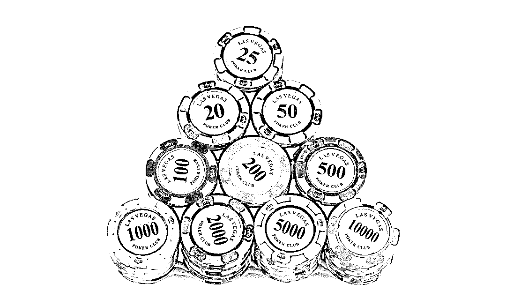

# 深度长文|告诉你一个真实的菲律宾！庄家泛滥，骗局重重，暗黑无界！

> 原文：[`mp.weixin.qq.com/s?__biz=MzIyMDYwMTk0Mw==&mid=2247492193&idx=1&sn=dbac99024c73a37e133bb18fab3f090b&chksm=97cb2959a0bca04f3b1755e702e1b453de836b28afb59a456100f0e4028cf031eedd1485d6f1&scene=27#wechat_redirect`](http://mp.weixin.qq.com/s?__biz=MzIyMDYwMTk0Mw==&mid=2247492193&idx=1&sn=dbac99024c73a37e133bb18fab3f090b&chksm=97cb2959a0bca04f3b1755e702e1b453de836b28afb59a456100f0e4028cf031eedd1485d6f1&scene=27#wechat_redirect)

**点击上方蓝色字体“灰产圈”关注并置顶本公众号**


**导语**


2017 年下旬 开始在各大社交网站上 看到大量 菲律宾招聘信息，工资都是 6000 人民币（120 万缅币）左右起步。然而高工资的招聘要求条件仅仅会听说读写中文即可，作为缅甸华人或者国内的上班族，看到如此招聘条件，难免心动。


**上图为招聘信息**


**上图为招聘信息**

但，事实真的如招聘信息所说的只会听说读写中文就能拿到 6K 底薪，月入上万，迎娶白富美？ **请看灰产圈调查：**


**“菲律宾”大起底**


众所周知，美国拉斯维加斯的博彩业可谓是世界知名，澳门也号称亚洲第一赌城，殊不知，菲律宾博彩产业大有赶超澳门的趋势，或将来成为亚洲第三大博彩中心。

以上内容作为铺垫，为什么从 2017 年下半年开始菲律宾招聘信息 大量充斥于网络？仅仅会听说读写中文难道真的能轻松月入上万？ 说到这 或许大家都猜到了， 这些招聘 都是关于博彩行业的相关职位招聘，只有这个行业能支撑起如此高成本的人力成本。  当然也有很多招聘骗局，打着出国劳务的幌子收取个各种费用，然后 就没有然后了。  

> **百度搜索：菲律宾招聘骗局 会发现很多被骗的帖子 ：**


大部分帖子都是描述的被网上的所谓出国劳务公司骗取保证金体检费签证费等等的案例，照这么说难道 菲律宾高薪招聘 都是骗局么？

非也，很多菲律宾博彩公司也有招聘需求，他们大部分通过中介或者自己公司直聘，当然 ，招聘过来也是从事一些博彩相关行业的违法行为。

但是，博彩行业在菲律宾却是合法的，在国内一直以来是违法的，所以很多国内公司都搬到国外去了，亚洲首选之地就是菲律宾，那边政府暗地支持这个行业，才得以发展到现在的规模。

那么这个行业在菲律宾是怎样的存在？其中又有那些灰色产业和内幕？

带着这个问题，灰产圈联系到了一位在在菲律宾了解博彩相关行业的“神秘人士”，我们暂且称它为 KK ，我们对他进行了深度的采访。

**以下内容为 KK 口述**，我们将以 第一人称的写法，尽可能真实全面的了解不为人知的菲律宾博彩全产业链！ 


**“博彩行业”全揭秘**


**（注：以下内容为 KK 口述，以第一人称撰写）**

　进入这一行有些时间了，每天都有人从国内带着希望而来，也有人带着灰心丧气无功而返，敢于揭露行业内幕、也客观解析这个产业的现状未来。

　　首先给大家科普一下，菠菜行业意味博彩行业，并非名义上大力选手吃的菠菜。

　这个行业竞争很激烈，男人在 du 这方面有着比女人更专业的了解，所以从事这个工作的男生居多，但是要把男的招过来最好的方式就是异性相吸使用美人计，所以呢，各位 hr 大大的头像都是清一色的少女时代，连 qq 微信也是如此，面试的时候会跟你说公司里美女很多哦，来了之后才发现僧多粥少，当然如果寂寞你可以去修车、前提是你不怕感染艾滋的话…

> **我先简单的介绍一下这个行业**



每天坐飞机到菲律宾的中国人百分之 80 都是从事这个行业，俗称：菠菜行业、BC 业、（bo 二声 cai 三声）到底是干嘛的，自己百度去吧。

这个行业已经有十多年的历史，原来在国内，后来国内严打，基本都搬到了东南亚。菲律宾居多、其次是柬埔寨、然后是泰国、马来西亚、缅甸也有，具我所知，国内依旧存在不少做这一行的。

由于此行业的特殊性，上手难度不大。只要有钱有点关系的都可以做，不傻基本都会捞到金。导致近几年东南亚遍地开花。造就了许许多多的公司、小平台，黑平台。

据不完全统计，菲律宾从事 BC 业直到现在至少有 20 万人，而且这个趋势还没停止会不断的上升。公司越来越多，需要的员工也就越来越多。所以各种公司也是鱼龙混杂、参差不齐。

如果东南亚的 BC 业非得排个名的话，那菲律宾绝对算是龙头老大了。菲律宾有一家专门的监管菠菜公司的机构(PAGCOR)

　　2017 年 10 月之前 PAGCOR 部门颁发的 BC 证只有 35 家，直至现在也只有 46 家而已

　　第 46 家公司是 BMM Testlabs 编号 OGL-17-0046 也是做技术咨询公司的。
　　以上 46 家合法牌照公司大部分是 BC 技术公司。
　　想要跻身到 46 家里面不仅公司要有很大的实力，还要不菲的费用。

上次的克拉克事件和这家监管机构有很大的关系，要不然克拉克的老大林英乐也不会倒。

　**克拉克事件新闻：**


上面说道目前为止真正意义上的合法公司只有 46 家，但菲律宾多如牛毛的公司是否合法呢？

答案是合法的。大部分都是挂靠牌照、子公司。经历了克拉克事件后，现在已经很少有黑公司了，但是还是有的。

个别小岛上大家千万别去…　菲律宾 BC 公司基本集中在马卡蒂市趴赛市。但是其他地另外，BC 在菲律宾合法，但是在国内非法，所以，为了保护员工的安全，BC 公司一般都会经常换名字，即便你的工作签证上 写公司的名字，国内也是不会知道你们公司的性质的。

只要公司够负责就根本不会出问题的。方也有不少，阿拉邦、苏比克，远一点的南部卡加延、宿务（由于一些改革，最近很多公司搬到宿务）

说到公司名字的问题，我在和大家说一下。公司所用的名字很少是自己公司的名字。一般公司也没名字。

他们招人用的 XX 公司一般都是：

> 【大楼名字】（例如 solaier、马卡蒂 8 栋大楼）
> 　　【台子名字】（例如 XX 彩票、X 沙、XX 威尼斯人、大 X 家、太阳 X）这边公司台子的名字很多都重名。 
> 
> 　　【集团名字】（例如双龙集团、东方集团、凤凰集团、九州 XX....）但是！集团名字并不能代表你所应聘的那家公司好坏。因为 XX 集团就像一个 XX 商城，一个商城里面有 N 个店铺，N 个老板有卖假货的有卖真货的。

> **如何确定公司靠谱与怎样选择公司。**


没有很明确的办法，因为你应聘的任何一家公司根本不会透露出有用的信息。

首先，要搞清公司地点（上面我也说了，菲律宾算是龙头老大，如果要做这一行尽量选择菲律宾，我没有黑其他地方的人。因为菲律宾总体来说比较安全稳定）其次就是基本待遇（找公司先看基本待遇，别看那些福利提成奖金，这样只会让你乱花迷人眼。由于这边公司越来越多，竞争也越来越大，所以员工的待遇也在竞争）

> **本地是否安全。**


由于菲律宾本地人大部分信仰天主教，对人还是挺和善的。
来了马尼拉之后你可以发现，遍地华人。而且华人在这边地位相对挺高的。马尼拉很多行业的老板都是华人（房地产、饭店、服务行业、旅游业、甚至出租车行）

菲律宾福布斯排行榜前十有七位都是华人。

个人总结一下就是 “安全、机会多” 个人在这边这么长时间是没有被抢被偷过，但是本地人确实喜欢坑中国人，坑起来那叫一个狠，普遍认为我们人傻钱多

14 位华人富豪，施至成还是第一。SM 就是施至成的。他的经历挺传奇的。

在说一下公司安全问题。


**sm 公司百度百科**

我想说的是，首先每年的年底（圣诞节前后 1 个月）都是这边的严打期，菲律宾 X 府的腐败会远超你对腐败的认知。当然了，没有牌照没有认可的一些黑公司肯定就扛不住了，但有资质跟牌照的正规企业就仍然受当地 X 府所保护

2017 年菲律宾的公司相比往年情况已经大有好转，检察力度在东南亚也算是最弱的了。

但是每年年底的一次大查还是有的最近的 Burgandy（勃艮第）事件（自己百度）已经算影响最大的了。

BC 业需要的职位和工种一般都是： 

> **推广（带提成的职位，很赚钱，但有一定的压力） **
> 
> **客服（混日子的工作，仔细一点就行） **
> 
> **人事（待遇稍高但也有压力，个别公司人事行政不分家） **
> 
> **行政（要求英语，处理需要英语的工作，身体力行）**
> 
> ** 技术（开发 web、SEO、美工、运维等等，相比国内待遇较高，比较吃香） **
> 
> **财务（做表格，做账，公司金钱往来，公司财务标准差距较大） **
> 
> **还有一些风控、市场、策划等等 RT：每一行都不好做，所以说根本没什么扣字|员**

继续说一说公司安全问题。

> 1：公司只要不是黑台子，入职最快给员工办工签（如果公司不尽早给员工办工签，那风险是很大的）
> 
> 2：自己不作死（这边一定要注意自己的隐私，私人手机私人微信不要连公司的网，千万不要。个人的信息不要随便说。管好自己的嘴，别瞎说）
> 
> 3：不要去那些限制员工人身自由的公司。发现公司领导对员工有暴力和语言侮辱也不要留着。

简单来说必须注意的事情也就这几点。下面给你们看看有些小伙伴遇到的

先说一下 Burgandy（勃艮第）事件。勃艮第是一栋办公大楼，属于马卡蒂 8 栋特殊办公大楼的一栋。

勃艮第位于马尼拉的马卡蒂市。为什么说博甘地事件影响深呢，请看下文。

以下内容大部分是我问我的一些朋友，还有我的一些猜想，哪里说错了，也别骂。

> **Burgandy（勃艮第）事件：**

2017 年 11 月 7 日当晚 8 点多，国内的 7 名人民公仆与菲律宾的人民公仆突袭 Burgundy 博甘地大厦 29 楼某菠菜公司（一栋大楼 N 家公司），抓捕 80 余名做网络菠菜的中国人送至移民局。（这个事情还上过本地电视台）

> **起因：**


为什么会突然突袭这家公司呢。

原因是主要抓的是那家公司老板之一，而且不是因为网络菠菜。

这个老板在国内做网络融资理财产品跑路，跑到公司，其余人只是顺带。

我只能简单说一下，为什么抓员工呢？

因为当时突击到楼上的时候，本地公仆检查他们的个人信息和移民局对比不上。

就是说他们没有合法的工作签证。员工无正式工签引起的一场闹剧。

这个事情不能具体说，发不出来。只能简单的说一下。

结尾：80 多人送至移民局做调查，最后 23 人被送至国内，2 人释放，关押 21 人。这些人均来自一家公司。

此事第二日波及到，马卡蒂 8 栋大楼之一的 techzon 大楼（无人被抓）应该算是一个警告。

当日，大大小小的公司基本给没有正规签证的员工放了带薪休假。要不就送去 solaier 办公或者在宿舍办公。

经过勃艮第事件，大家都认知到了签证的问题。

> **签证：**


菲 BC 行业通用签证有两种，9G 和 CEZA（菠菜专用签证），临时签就不说了大家都懂。

不过 CEZA 的签证由于回国有可能被查水表基本已经全部停用

所以本次只介绍 9G 签证。9G 工签是正规合法的工作签证但是价格很贵，现在的价格是两年 84000P。

签证照片不能上传，大家自己百度一下护照：

一般 BC 公司都会压护照，我很少听到不压护照的公司。

原因就是，异乡打工，公司没办法和当地部门有效的监管员工。如果不压护照某些员工做了些下三滥的事情就能直接跑路。比如转走公司资金、带走公司客户资源等等。

压护照只是公司用来限制员工的一种手段。就算护照被压，还是有不少人冒着风险做了些下三滥的事情。例如：偷偷转移公司资金到自己的账户，然后跑路。

这一点大家千万别学，因为这行没有监管员工挪走公司资金没有机构能监管，然后员工被公司抓到，对员工做一些匪夷所思的事情也没有机构能够监管。

地域问题（一些公司为什么不要 HN 人、SD 人、FJ 人）

上面说道由护照牵扯出的一些员工做错事跑路的事情。

> 【HN 人】那些跑路的员工 HN 人占大多数，所以说名字已经臭了，HN 人做客服基本是不可能了，没有一个公司会要。
> 
> 【SD 人】从事这一行的人很多都是 SD 人，大部分都是 SD，WH 人，因为 SD 人太多了，第一：公司怕结党营私。第二：有部分 SD 地区已经发出通告，让国外做事情的人赶紧回来否则怎样怎样，公司怕牵扯到自身，索性不要。
> 
> 【FJ 人】这一行的老板大都是 FJ 人，但为什么不要 FJ 人呢？因为很多公司老板连带高管都是 FJ 人，一个 FJ 人跑到公司应聘，公司害怕这个 FJ 人是哪家公司派来的偷客户资料，或者偷偷学艺的。

在这我给 HN 人抱一下不平，HN 省作为国内粮食大省作为国内人口最多的省份

国家已经给你定义了 HN 省就是个农业大省，没必要发展工商业，生活用品用粮食换就是了。由于国内不重视 HN 省的教育。HN 省外出打工的人太多，所造成的这样。

目前的社会现状你穷谁都可以站在各种道德制高点点上吐你一脸。

那么继续讲讲这边的几栋大楼还有马卡蒂的八栋大楼。种菜一般都聚集在这几栋大楼 pasay 区的：

solaier 大楼（东方）还有 icon（双龙）还有 COD 边的珍珠大厦（基本是东方搬进去的）还有什么 FCBC 还有什么乱七八糟的 不想提起 COD。

什么梦想之城，明明是梦想终结之城。 

makati 区的八栋大楼：RCBC 大楼、博甘地大楼、techzon 大楼、PBCOM 大楼、 Marvin Plaza 大楼、HSBC 大楼、Zueiling Tower 大楼、Robinsons 大楼。

> **“菲律宾”创业篇　**


华人也多很多，如果是想着以后创业的话，我还是推荐来菲律宾这边，因为大家都知道人多自然就有买卖可以做，像是马尼拉这边的中餐馆，旅行社，中国超市等等，都是建立在这边生活着数百万中国人的基础上的。

有人问在菲做菠菜行业安不安全，这个怎么说呢，首先要说在菲律宾菠菜行业是合法的，但是中国人做这个网赌是违法的，违反中国法律（刑法里有一条中国公民只要是拉中国公民去赌博就算是违法的）不过有一个问题就是，菠菜公司都设立在境外，中国 JF 在别的国家是没有执法权的。

但是这些菠菜公司在菲律宾给他们创造了大量的税收利益，他们不会让中国 JC 随便动自己的摇钱树的，有时候中国会用一些利益来让菲律宾政府配合他们联合执法，这个时候就会出现一批黑公司被抓的情况。

这些公司没有牌照，也不办理工作签证，并没有给菲律宾提供多少利益，这个时候就会被当做炮灰。

那么小白应该如何选择公司呢，首先第一肯定要选择合法可靠的公司了，我发现好多求职者向 HR 咨询的时候都要求要看一下公司牌照。

求职者基本是不会英文的，给你一个英文牌照你也看不懂，再者说就算照片上的牌照是真的，你怎么能知道这个牌照就是这个公司的呢。

这边百分之 99 的公司都没有名字，（只有自己有牌照才可以自己注册名字，上千家公司只有几十个牌照比例自己想，大部分都是挂靠到大集团名下，但是这并不影响公司的安全，法律上完全合法）有一些公司自己会起个名字来区分，但是这个名字肯定不是注册牌照的，并没有什么意义，或者是用自己平台网站的名字代替公司名字，总归来说这些都不是公司真正的名字。

这边一个集团下面有几百个分公司在下面，这些分公司只是租用了集团的牌照，具体这个公司的待遇，管理制度都是公司老板自己制定的，集团不会插手过问的。

所以如果你在集团下面的某一家分公司觉得待遇差，那么只能说这一个公司坑，而你不能说集团是个坑就是这个原因，哪个集团下面都有待遇好的公司也都有待遇差的公司。

我推荐大家尽量选择在城市里面办公楼里面的公司，在马尼拉这边的写字楼开公司没有点实力是不敢的，如果你是老板你有牌照的话你也不会在舍近求远去度假村租别墅开公司，毕竟租别墅和写字楼租金价格相差很多。（我不是说在度假村的肯定就是黑公司，只是相比较而言）而且哪怕就是黑公司也不是不可以去，看老板给你多少钱了，如果钱给的多也是可以考虑的，因为在这边就算是被移民局查到没有工作签打黑工只要老板肯花钱办事也可以捞出来的，绝对不是说被抓了就一定要被遣返。

在这里给新人们普及一个概念，移民局检查公司不封于抓人，相关部门排查公司这个是很正常的，然后被抓了不等于一定被遣返，被遣返了不是就等于回国坐牢。

　选择公司除了合法性，第二个就是看待遇了。我见过很多求职者一上来就问你们家公司待遇怎么样啊，好不好啊坑不坑啊之类。

我想要说的是没有任何一个公司的待遇可以单纯的说好或者坏。所有的待遇都要跟招聘要求相结合起来综合来看。我打个比方，招聘客服，试用期 8000 转正 1 万，8 小时 4 天假，包吃住。

> **“菲律宾”求职篇**


你单纯的看这个公司的待遇肯定会有新人会说这个待遇多好啊，但是我要是跟你说公司的招聘要求是大学毕业，英文沟通没问题，在菲客服工作经验 1 年以上呢。单单是英文沟通没问题这一点的人，他去应聘一个翻译月薪也在 1.5 万左右的，这个时候你回过头来看你还觉得这个待遇有你之前想象的那么好吗。

这就是我见过很多公司的岗位待遇很好，但是招人很难招到，因为有要求的，满足要求的人很少。

或者有一些公司待遇你一看明明就很差，为什么还能招到人去，不是去的人都傻，是因为个人条件的原因去别的公司不符合要求没的选择（比如说一个 35 岁的男生，做不了推广只能做客服，那么他选择的公司并不多不得已去那些待遇并不是很好的公司做客服）所以选择公司的一切前提是你能去，首先得确定你的个人基本情况满足这个公司的招聘要求，你再看待遇好坏。

待遇好的岗位、公司多了去了，你不能去等于 0 是不是。我见过很多求职者的求职顺序弄反了，一上来不发简历就开始问公司待遇，机票签证保关工作签证，宿舍环境等等等等，问了一两个小时，然后投简历说我要面试，人事一看说不好意思，客服只要 90 后，您的年龄不符合招聘要求（或者是其他条件不符合，比如说公司会限制同一个地方的人比例过多，不是地域歧视，而是同一家公司不能要太多一个地方的人 否则不方便管理的，你可以想像一下一个平台一百个人，山东的占 80 个，那还有法管理吗会形成小团体的）

然后有的求职者就会大骂 HR 说你为什么不早说，浪费他的时间神马神马的。

HR 也是冤枉，我咋知道你多大？我哪知道你是哪里人？我看你球球 VX 头像我就知道你多大你是哪里人吗我又不会算命，让你提前给我简历看一下你说不着急你先了解了解合适了再发简历的。

其实有很多 HR 自己也都是新人，也都刚开始做招聘没多久，你们可以多留意一下那些待遇好的公司招聘，群内发的招聘简章最后面都会写，求职请发简历到某某某邮箱，初审通过后会联系你，私聊不回。

很多求职者分不清平台和公司的区别，总是把一个平台就当成一个公司了。这一行的板一般会开很多平台的，就是很多 BC 网站的意思（你可以理解为公司的一个业务部门，或者理解为一个分公司）。

很多求职者不理解，为什么同一个老板开的公司，为什么待遇会不一样，其实这些平台本质上都是一个公司。因为他是一个老板开的。

但是对外一般不会这么说而已，上班的员工也不知道他们这个平台和旁边那个平台的老板是一个，有时候老板会和人事说，咱们平台招人招的差不多了，平台现在暂时不需要招人了，你先给旁边公司招一下人吧，这个人事就很觉得，我凭什么给旁边公司招人啊，原因是因为老板是一个老板（或者相互穿插股份）

我曾经工作的一个公司，我慢慢接触到老板在菲律宾就有二十多个平台，在泰国和柬埔寨那边也有。这些还是我接触到的，肯定还有我接触不到的部分。

求职流程一般是先办理好护照，尽量是先办好护照了再面试，有些岗位要是着急用人的话就是有护照的优先了，因为有些时候给求职者预留了岗位但是等的半个月以后办好了护照人又不来了。

然后做一个简历，为什么要做简历我前面写过，既能节省大家的时间，又能保证你可以找到好的待遇，有好多人求职让他做个简历他嫌弃麻烦，说有的公司不用看简历啊，所以他最后去的是那种没有任何要求，你只要有人去他们就要的公司，你说这样的公司待遇能好吗，最后的结果就是这个人去公司干十天半个月后发现别人公司的待遇比自己的好，心理不平衡然后大骂公司坑，然后黯然回国，这样的例子很多。

确定好待遇觉得公司待遇可以接受那么就可以约定时间面试了，电脑视频面试，面试会测试一下打字速度，打字 OK 的话语言沟通一下看看求职者的思维能力反应能力工作态度等等。可以提醒大家的一点就是，面试的时候最重要的就是看求职的态度，好多人觉得这个工作就是打打字啊，谁不能干啊，面试吊儿郎当没有个求职者应该有的态度最后被淘汰掉。

面试通过后就要办理签证了，第一次来的时候是办理旅游签证，分为 2 种方式，一种是求职者个人自己办理了去公司以后报销，第二种是公司直接给办理，办理时间为加急 2-3 个工作日，普通 5 个工作日。

签证办理 OK 的以后就要订机票出发了，机票和签证都一样也是分为这两种的，一般公司都是直接给员工办签证订机票的，除非是待遇比较好的公司会要求员工自己办理入职以后报销。原因是公司直接给办理经常有人因为个人原因不来了，人后人也消失不见了，给公司造成损失，在这里鄙视一下这些人，如果真是有事不能来，你可以和公司联系一下，把签证和退票费用结算一下，没多少钱的，千八百块而已，你的诚信真的只值这点钱吗？

到马尼拉下飞机以后这边公司会保关和接机，这些都是不用担心的。关于手机网络的问题，只要你的手机不是那种定制机就可以直接用这边的手机卡，提醒大家一下如果你国内的手机卡绑定了很多业务需要接收短信的话，出国前请开通一下国际漫游。这边的公司发放工资一般都是给现金比索的，偶尔有些是给美金的，发了工资以后可以找当地的钱庄换一下钱，比索换人民币，他们可以把钱直接打到你的支付宝，VX 或者银行卡里非常方便。

到公司入职了以后，有些公司会给员工办理 SWP 也就是临时工作许可证，有的会选择续签旅游签，转正了以后会统一办理工作签证，有好多在这边上班的人公司跟他们说已经办理了工作签证但是工作半年回国的时候还是旅游签，那是因为这边工作签证办理很慢的，正常的话大约要 2-3 个月，有时候也可能会拖到 3-4 个月，也就是说，转正三个月以后回国是有可能工作签证没有办理下来的。（我只是说有可能没办下来，不排除有些公司是真的没办工签）

补充一下很多公司都说来了以后办理 SWP，其实我说了解到的是大多数公司都不会真的去办理 SWP 的。然后在这边公司上班的安全性来说，只要公司大的方面没问题，签证是无所谓的。公司要是真的被查被抓，肯定不是单单因为员工签证的问题，那个时候说员工没有工作签证要抓都只是借口和搞你的理由了……

关于压护照的事情这个事在这一行是很普遍的情况，大家不必要过于担心的，你正常上班正常辞职不会不让你走的，不可能限制你的人身自由的。平时下班了以后也是可以随便出去处理自己的事，只要不耽误工作，公司不会过问的，菲律宾这边很少有公司会限制下班以后出门的。


**“菲律宾”人事篇**


提醒大家一点，出国有成本，出国需谨慎。既然选择出国打工我相信大家的生活水平都不是很好，所以出国之前自己要做好准备，别出来了三五天就回去了，虽然说来的时候机票签证保关费用都是公司给你出的，但是你来几天就辞职，这个钱是需要还给公司的，这就是为什么有的求职者说来这边还赔钱的原因，这个钱不是说你赔给公司了，而是你自己承担自己的路费了。

和大家说点这边公司的规矩吧，最重要的一点就是不能赌博，公司都是严禁自己公司员工赌博的，因为有的人赌博输了很多钱以后就开始铤而走险想要搞公司的钱。这种人我见过很多，有成功的，也有失败的。成功了偷了公司钱的回国以后基本上这个钱最后也还是赌博输掉，能够存下来买房买车的很少。失败的那就更不用说了，命都丢掉的也不是没有。（这就是为什么公司会压护照的原因，怕员工转走公司的钱跑掉）

人事基本上都是有任务的，有的是一个月 5 个任务，有的是 10 个，好多人找人事工作都说同样是一万块的工资肯定去 5 个任务那，任务少好完成啊。我跟你说，不见得。这个得看公司你招聘的那些岗位的待遇，待遇好了，很可能 10 个人的任务完成起来比 5 个要轻松的。然后就是人事的工作时间也不重要，好多求职者做人事要求 8 小时 9 小时的，你做人事不是客服，你下班了以后你一样还是需要坐在电脑前面，盯着手机。

总不能有人咨询工作，你跟人家说 7 点了你下班了吧，你还是需要给求职者回复的，在你没睡之前下班和不下班区别不大，休假时同理。我是亲身做过其他岗位以后才去做招聘的，所以各个岗位我都懂一些，想要做一个厉害的人事，你至少得能做到看一眼这个公司待遇和要求你就知道能不能招到人，我也欢迎做人事的朋友加我球球或者大家交个朋友沟通一下工作心得，共同进步。

作为人事需要询问求职者以下几个问题，以便节省时间，不光节省自己的时间也节省求职者的时间。

> 1 年龄 籍贯 （年龄限制和地域限制这个不必过多解释）
> 
> 2 打字速度，打字一分钟十几二十个的那种就没必要安排面试了，先练习打字，不然去哪里面试也通过不了
> 
> 3 有没有工作经验，如果有工作经验的话问一下之前在哪里工作过，不用问公司名字，名字没用，要问在哪里的大楼办公，因为这边有很多大楼只能去一次，大楼行政 ID 卡只能办一次，在大楼的其中一个公司辞职了，别的公司也去不了，因为大楼不给办理 ID 就不能再进去了。
> 
> 4 有工作经验的需要问一下有没有工作签证，有工作签证的话很多公司都不能去，办理新的工作签之前的需要降签，降签花钱不说还特花时间（1-2 个月）
> 
> 5 有没有护照，或者是准备什么时候出国。那种准备过完年再出来的人就没有必要介绍的那么详细，因为那个时候还招不招人都不一样，特别是客服类岗位，招满了就不招了。

好多求职者问我推广好不好做啊，客服好还是推广好啊之类。我只能说推广这个岗位，你自己不去做永远没有人能知道你能做到什么程度，客服的优点在于稳定，推广的优点在于有无限的可能。我觉得你可以去尝试一下，做不下去无非也就是几个月后再换一份客服的工作而已，并没有多大损失，可是一旦成功了你做推广能拿到的工资都比客服要高很多的，那这点微不足道的代价去换一个未来的可能性我是觉得值得干，建议仅供参考，还是需要求职者结合自身情况选择…

好多求职者出国前都是心怀忐忑，其实大可不必要这样。我记得我当初出国的时候也是生活所迫，可以说身无分文，那时候我就一条心，想着就是死也要死在这了，我也时常感慨人有时候没有选择也是一种幸运。没有了选择就多了一份勇往直前的勇气去背水一战，出来只不过是一份工作，干的不舒心顶多干一个月以后发了薪水买张机票回国而已，这世间任何事不自己去亲身经历过，别人说的再多也不过是小马过河而已。


**关于“博彩牌照”** 


自己申请的牌照和挂靠牌照在法律上是没有任何区别的，所以大家不要一听到挂靠的牌照就觉得是黑公司，黑公司指的是那种没有牌照也没挂靠到别人牌照下面的公司…

有很多求职者担心去公司干一两个月公司主动给他开除了，我给大家分析一下
菠菜这个哪怕你就是做个客服，你一开始去你也不能立马就能干活给公司产生效益的，你刚开始去公司要给你发工资试用期 5000-6000 吃饭+住宿 2000-3000，还要找人带你，你干了一个月辞职了，因为你没有给公司带人任何利益，所以这些钱公司是白白拿出来的，而公司让你自己承担的的只是你来的时候机票，签证，保关费用，并没有让你多承担什么额外的费用。

所以如果员工干一两个月不干了，损失最大的肯定是公司，所以公司是不可能无缘无故开除人的

所以当你真的去了解了公司的运营成本的时候，就不会相信贴吧上某些人说的，有些公司为了节省工资，而让求职者干 3 个月，马上要转正了再开除，工资成本在公司所有成本上面所占的比例真的很小

更极端的是有人说把人骗过来割肾挖角膜，试问真要这样有必要垫付大笔钱出国弄你吗？问题是这边的医疗服务跟不上啊！还有人说被骗来诈骗，简短说：菲律宾两大帮派：福建帮和台湾帮，福建帮主菠菜、台湾帮主诈骗。

有好多求职者让 HR 给他们发一下公司的工作照片还有宿舍的照片

我想说这个真的没有必要，首先工作环境如果是在办公楼办公的话，都是各种办公室都是一样的，还没有那种很破的写字楼就是让你接受不了的，我经常说能出国干这个的人在国内的工作条件百分之 90 的人是不如这边的。

然后宿舍环境，马尼拉这边的公司宿舍，都是公司就近租一些公寓楼，肯定会离公司很近，走路 5-10 分钟。如果稍微有点远的话公司会派车上下班接送，安全问题不用担心。然后这边租房子说实话不便宜，两室一厅 80 平米以上的房子房租一个月要一万人民币以上了，而且我前面说过租房子最少也要压 2 付 2，公司不可能说是先花个四五十万租个十来套宿舍放在那里然后再等着招人进来入住，一般都是安排好下个礼拜有一批人到公司入职，这个周才会租宿舍的，所以你在面试的时候 HR 也不能确定你住哪个宿舍，但可以发一些曾经其他员工住进去的宿舍的照片，不过这个也只能是大体差不多，不可能完全一样的，有时候会碰到那种情况，你给他发了一个三室一厅的，他来了以后住个两室一厅的然后就大骂 HR 坑人了...图片和实际不符....所以现在我是真的发照片很慎重，就是发也要和他们说一下上面的那些话。


**“友情提示”**


总之广大的求职者，你应聘的时候，你相信人家的话就相信，你要是存着怀疑的态度你就没必要聊下去了，就像很多加我的人，让我发发照片，做个手势录个小视频证明我在菲律宾，完全没必要的兄弟，你信我我不用说太多，你不信我我就是跟你说上一天一夜你也觉得我在忽悠你，在给你洗脑。

> **因为国内太多的人有过被骗经历** 
> 
> **被亲朋好友骗进传销** 
> 
> **因为扶起跌倒老人而被敲诈**
> 
> **所以每个人都活得很累，活得很小心翼翼。
> 当太多的人被骗后，人与人之间的信任就慢慢的减低了。**

所以，没必要让人家发公司照片，发牌照照片，说实话，HR 真的骗你的话，就是给你发了照片你能辨别真假吗，给你发个牌照照片你能看懂英文吗，就算你能辨别这个牌照是真的，你又怎么能知道照片上的牌照就是这家公司的呢？

怎么说呢，这一行业本来就是放不上台面的；太多人靠套路招人，可是我偏偏不是一个会套路的人，怎么办？

> 我还是会坚持自己的原则，不忽悠、不哄骗
> 　　哪怕招不到人被调走或者被解雇，我也不希望结跟你结一段恶缘
> 　　既然我来了这里，我可以告诉你，你所担心的安全问题、待遇问题，完全不用考虑；老老实实干活儿，生活就不会亏待你
> 　　虽然说我不是个太注重物质条件的人，但不得不说，我们这边条件还是很不错的

然后还有一点我想和大家说的是，我写这个帖子目的是为了交友教给一些求职者一些经验 

在菲律宾除了老板，部分高管是他们自己人，其实剩下的人都是招聘过去的，包含人事也是，有的人事都还是新人了，不存在什么限制人身自由的，大家都是一样的，你以为你是绑架，黑帮呀，那么一大栋楼，员工那么多，你动脑筋思考下，要真的限制人身自由能限制的住吗，要限制人身自由起码也是成倍数的人，才能够限制的，自己动动脑，你以为是搞传销，给你洗脑呀，就这么给你说，搞菠菜那么赚钱，要是我有钱了，我肯定也想投资去搞一个菠菜公司，再说了，一个公司赚钱的基础是什么，那就是员工呀，没有员工给你打工，你把员工人身自由限制了，谁给你打工，公司要的就是好好工作，努力赚钱的员工，最烦那些过去了一天，感觉不好，就想走人的员工了，他们以为公司是自己开的，过去旅游的么，然后处说，什么扣钱，限制自由了，你给签证机票钱了，那就护照还给你，记住了，就算你要离职要被扣钱，也不会被限制人身自由的，一般就是不给你护照。

反正我遇到过很多公司是没有碰到那种说限制自由，乱扣钱的公司，如果大家碰到了，那只能说明运气差吧

无论是谁，如果是第一次来菲律宾工作，都会担心害怕，害怕被中介骗，害怕交了钱打水漂，害怕公司货不对板……  

但找工作的途径现在无非就是互联网，中介，朋友介绍。这里面估计朋友介绍的可信成份更高点，虽然有可能碰到传销，但概率问题自己还是可以拿捏的。至于互联网和中介就得好好分析了。网上你看到的几乎都是文字，图片，视频（这个少）。文字是人敲打上去的，有真有假。图片肯定是真实的，但至于是别人的工作环境还是怎么的，只能靠自己去判断。中介嘛～～～分有好有坏，好的中介实力强，几乎都是一手资源。营销厉害的中介往往都是做二手中介，倒卖下岗位资源，员工资源，从中赚个差价，简单省事。还**中介纯粹就是没收钱前你是爷，等收了钱之后，你就成孙子了。这样的情况我见的太多了，不一一赘述了。

赚钱的途径不止找工作一种，但打工赚钱是最简单直接的方式。走向这个社会就得注定面对各种险恶和欺诈。包括我也一样，第一次走向社会的时候也被骗过。这都很正常，大家只要时刻提醒自己脚踏实地做事，自己多比较分析，考虑清楚后再慎重下决定，就可以尽可能的避开这些陷阱。

> 1、互联网上的招聘信息有不少都是中介发的，真正公司的 HR 每天忙的都是查看各大网站信息、筛选简历，面试，发 Offer，安排员工入职，住宿这类问题。
> 
> 2、留的联系方式如果是大陆电话，那么 90%可以肯定是大陆中介。接着就得利用 googlehacking 去分析这中介有无负面信息，是不是个新号马甲之类的。 
> 
> 3、针对招聘信息中留的图片这类，大家可以用百度的图片分析或者 Google 的图片分析去看看有无重复的（很多都是网上随便 copy 过来的）。 
> 
> 4、如果招聘者留了 QQ，那么可以看看这 QQ 的等级，Q 龄。如果太低了的，可以证明这人做这行时间不长（但不能说是骗子，毕竟很多公司 HR 都会申请个号作为工作号）。但有一点就是我所结识的中介代理，做的时间久的，好友就多了，几乎都开了 QQ 会员，并且都有了一定 VIP 等级，一般这类的可信度都偏高。
> 
> 5、把网上发布的招聘信息都丢到搜索引擎里去搜索下，一般懒惰的人都是直接复制转发的，除了改下联系方式，其他都不修改。这样搜索很容易找出最原始的招聘出处。 
> 
> 6、尽可能低的相信 51job，前程无忧等这类网站的招聘信息，因为就我的了解，菲律宾没有公司会直接在这类网站上发布招聘信息（当然，参考下还是可以的）
> 
> 7、如果通过中介谈的 7788 的情况下，一定要确认付款方式，能入职后付款是最好的（哪怕多付点都可以）。
> 
> 8、一般中介公司在北京、上海、广州、厦门、深圳的可靠性要高点。因为这些城市都有直飞马尼拉的航班，去菲律宾和公司对接起来也方便。


**结尾篇**


到此为止，我们对 KK 的访谈整理完毕，发布此文，可以说客观真实地反映了“菲律宾”特色的博彩文化和情况，希望能帮助大家对菲律宾有个全新的认知和了解，灰产圈写此文章，旨在揭秘一个真实的“菲律宾”。并不是让大家真的去那边掘金，毕竟，

种种未知的风险是不可预测的，灰产圈在此友情提示： 出国劳务 套路重重 不要总是想着外国的月亮会比较圆，外国的钱会比较好赚，其实，是金子在哪里都会发光的！

```
**毕竟，点背不能怪社会,命苦不能怨政府，未来的路是靠自己闯出来的！**
```

延伸阅读[围观世界杯：揭秘不为人知的世界杯黑幕！](http://mp.weixin.qq.com/s?__biz=MzIyMDYwMTk0Mw==&mid=2247492031&idx=1&sn=1a8c2ee93b5fce7ceeaa9a268a05661c&chksm=97cb2a87a0bca391363665f74b40bb1f54eb0c0e349e481e0ed7cc37234d2baf861536f94704&scene=21#wechat_redirect)
[写在 2018 世界杯前夜：庄家的狂欢，赌徒的末日！](http://mp.weixin.qq.com/s?__biz=MzIyMDYwMTk0Mw==&mid=2247492007&idx=1&sn=312e2e85168e92a0eb371a9df1721350&chksm=97cb2a9fa0bca389689d73631f94d3cf948004cf006ac29b93ea6f07b22758ed654f201b6bd7&scene=21#wechat_redirect)
[深度| 揭秘赌场高深莫测的黑科技：数据采集 ，人工智能，人脸识别，风水秘术，套路无穷！黑暗无边！](http://mp.weixin.qq.com/s?__biz=MzIyMDYwMTk0Mw==&mid=2247489533&idx=1&sn=89059bccd4390aace68327724cba106e&chksm=97c8dcc5a0bf55d375c953c999ac315380cfc45995959b44e1bb336810107c274b89cbf1b5f2&scene=21#wechat_redirect)
[深度|揭开层层迷雾,带你走进网络博彩的暗黑世界:500 万赌徒，年输上千亿！](http://mp.weixin.qq.com/s?__biz=MzIyMDYwMTk0Mw==&mid=2247489469&idx=1&sn=068689f941b55b11473a6595f2da08f1&chksm=97c8dc85a0bf5593f4f24fb20775b6448d2bd8a21cc0bc78b95a2fbf64a0e64eebe00449ed68&scene=21#wechat_redirect)
[围观灰色产业：6000 万中国“赌神”的金矿 ！](http://mp.weixin.qq.com/s?__biz=MzIyMDYwMTk0Mw==&mid=2247488934&idx=1&sn=f8af571216e0619e3b9cbcf008d258b8&chksm=97c8de9ea0bf5788ba953dfdbd615b4b554b665e23daa059d3aa60c260aa4e46f1c9f7d2fc3e&scene=21#wechat_redirect)

* * *

* * *

****【灰产圈】高端社群小程序开通，2018 最值得加入的社群！**** 

**<mp-miniprogram class="miniprogram_element" data-miniprogram-appid="wx4f706964b979122a" data-miniprogram-path="pages/topics/topics?group_id=881854415822" data-miniprogram-nickname="知识星球" data-miniprogram-avatar="http://mmbiz.qpic.cn/mmbiz_png/kialtkOXGKS7D9hZrmO2jzDqryXXTAlhxSpnrKnHGV65KXzicibOppaPic4dCRxftvabB8Iqswo3OuQEDSxE7NicXBg/0?wx_fmt=png" data-miniprogram-title="【灰产圈】高端社群" data-miniprogram-imageurl="http://mmbiz.qpic.cn/mmbiz_jpg/WWG78hysZ0brJkWoyG2VDIacqgQjkDfp6mLiaoPBJ2SgWZHtRuTw7ia8kpoxntsn7PiaFOQO2U23FW6Iry0gS1GnA/0?wx_fmt=jpeg"></mp-miniprogram>**

****

****点击加入【灰产圈】高端社群****

 **# 

> 原文：[`mp.weixin.qq.com/s?__biz=MzIyMDYwMTk0Mw==&mid=2247492166&idx=1&sn=c5c788d9fd070a464ffa10e422d00742&chksm=97cb297ea0bca068f1386a44a25931dbe5d9741053729a812518151e0f4a04dddd6f74d0a472&scene=27#wechat_redirect`](http://mp.weixin.qq.com/s?__biz=MzIyMDYwMTk0Mw==&mid=2247492166&idx=1&sn=c5c788d9fd070a464ffa10e422d00742&chksm=97cb297ea0bca068f1386a44a25931dbe5d9741053729a812518151e0f4a04dddd6f74d0a472&scene=27#wechat_redirect)

**