# 我雇了三万“骗子” 开了个厂子，6 年挣了几百万！

> 原文：[`mp.weixin.qq.com/s?__biz=MzIyMDYwMTk0Mw==&mid=2247492128&idx=1&sn=7c16c3ee9d58bd0dad3a2086679e91d6&chksm=97cb2918a0bca00eb2664901fb8c634a82a4e78dfe18bdd1f70b13d74028b349caa9035e8592&scene=27#wechat_redirect`](http://mp.weixin.qq.com/s?__biz=MzIyMDYwMTk0Mw==&mid=2247492128&idx=1&sn=7c16c3ee9d58bd0dad3a2086679e91d6&chksm=97cb2918a0bca00eb2664901fb8c634a82a4e78dfe18bdd1f70b13d74028b349caa9035e8592&scene=27#wechat_redirect)

**点击上方蓝色字体“灰产圈”关注并置顶本公众号**

**来源： 瞭望智库（zhczyj）**

**综合自钱江晚报、澎湃新闻、新京报、微信公众号“懂懂笔记”等**

**导语**

在虚无缥缈的网络世界里，凭什么取信于人？

许多人说：当然是看好评喽！无论买商品还是服务，先看下商家的好评率。

可是，好评多的商家，就真的靠谱吗？

有的人看好评做选择，结果掉入了陷阱。

还有的人专门以刷好评为业，要多少刷多少，刷到好评如潮，从购物圈到社交圈，再转战娱乐圈，甚至凭此开起了厂子，挣了几百万。

原标题：我雇了 30000 个骗子，开了个厂子，6 年挣了几百万！

**1、几百条好评的酒店竟然不是酒店!**

前段时间我们注意到这么一条新闻： 5 月 20 日晚，胡先生从南京来到杭州出差， 打算找个近一点、便宜点的旅店过夜。

 于是，胡先生打开某团 APP，一搜，有家宜家酒店公寓性价比颇高 有 1000 多条评论，其中 73% 的好评， 单人间房价只要 138 元一晚， 装修看起来也还行， 而且就在附近。

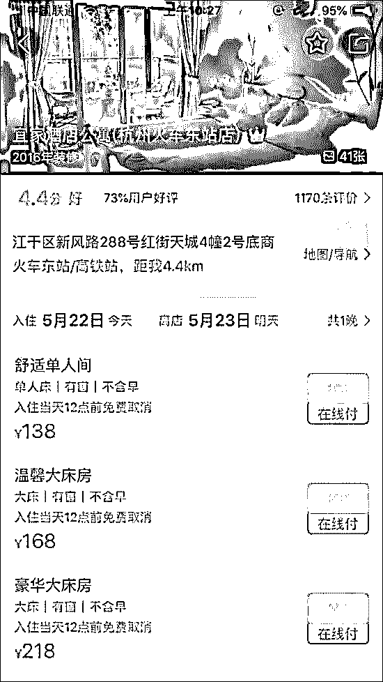

于是，胡先生预定了一个单人间， 但这酒店的位置有点含糊不清 红街天城 4 幢 2 号底商。 

于是，他打电话联系酒店， 对方：酒店离你很近啊， 就在东站附近的红街公寓底商。 胡先生说：你给我指指路，我走过来。

对方：你在东站那里等一下，我们派人来接。 没多久，一个男人来接胡先生了， 带着他走进了一个小区， 又走进了一个单元楼， 越走越感觉像闯入了民宅。 

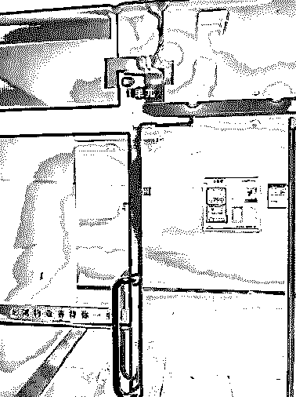

上了电梯，果然走进了一户人家。 

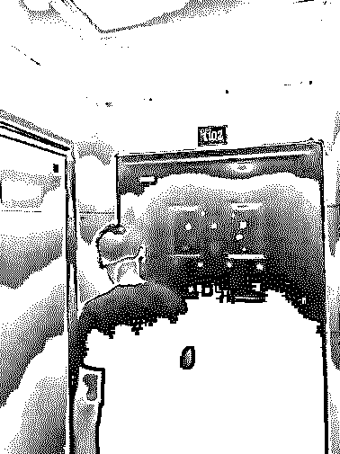

于是，胡先生见到了一张桌子和三张椅子摆成的前台 

房间则是普通的卧室， 连个独立卫生间都没有， 开玩笑呢！胡先生怒了：你告诉我这是酒店？这是前台？ 于是他和带他来的男子吵起来了。 

而这名男子就是所谓宜家酒店公寓的老板张某，没错，这家酒店公寓连员工带老板， 就只有张某一个人！

两人越吵越凶，最后胡先生怒而报警。 后来，警方了解到， 所谓的酒店其实就是普通住宅， 没有前台，更没有独立卫生间。 甚至，张某都没有获得公安许可， 就擅自开张营业了， 还把广告放到了某团上。

不过，更可怕的是， 这是张某一个月前才租下的房子， 某团上却显示 2016 年就开业， 而在上文提到的 1000 多个好评中， 有很多都提到了一位无中生有的老板娘， 显然大都是伪造的好评。 

**2、刷单已悄悄蔓延到电商各个领域**

好评如潮的酒店竟然不是真酒店， 这种事并不新鲜。 之前就有网友爆料， 自己在某猪旅行 APP 上预定了一个 全五分、1263 条评论且 0 差评的酒店， 名叫漫;雅轻奢驿栈。

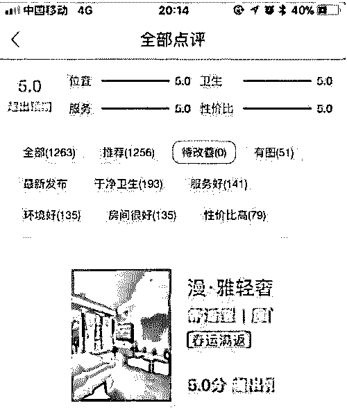

然而这个数据接近完美，名字也文雅悦耳的酒店， 入住时让却人大跌眼镜。

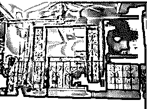

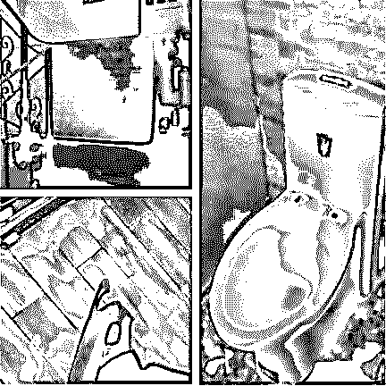

评论里干净整洁很温馨， 现实中破旧阴暗不正规。 微博评论也炸锅了： 你确定这是同一家店？

买家秀也忒不真实了。 店家，你只要敢承认，我保证不打你。 

此前央视也有过相关报道， 丽江古城风花雪月连锁客栈 和亲的客栈;丽江水墨印象店 ，两家客栈评分都高达 5 分。

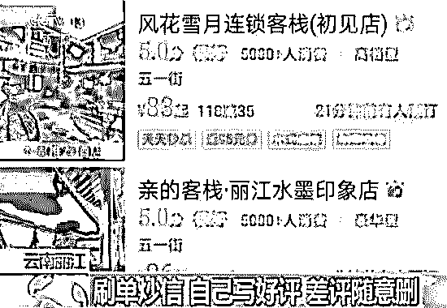

然而实际却是， 楼道里随意悬挂着挂满衣服的晾衣架， 屋檐上和阳台上也挂满衣服， 跟高档豪华扯不上一点关系。

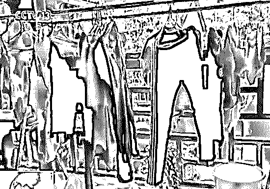

不用说，电商平台上这些看上去很美的好评， 显然是刷单侠夜以继日刷出来的。

这对于卖家和消费者来说， 已经不是什么秘密了， 可能你身边的某个亲戚朋友就做过这种兼职。

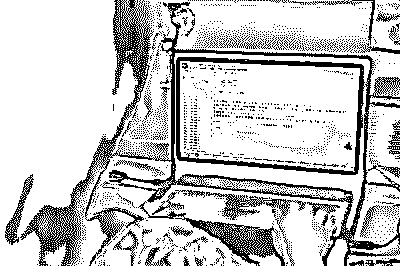

我们每次看到这样的新闻， 都有点恐慌， 因为刷单侠的生存和扩散能力简直太强了。 

想想看，之前我们提到刷单， 一般想到的就是某宝上刻意雕琢的清一色好评，某宝后来把稽查系统做得越来越强大， 本以为可以把刷单侠逼到夹缝， 没想到， 刷单侠早已蔓延到衣食住行等各个领域， 完全无法消灭。

可以说，只要是能在电商平台进行的交易， 背后总会跟着一大波刷单军团、水军。

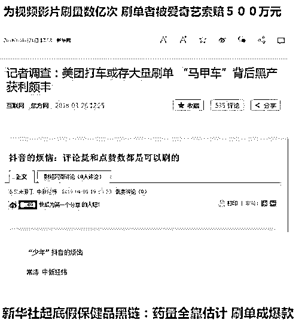

**3、信誉需求，催生刷单灰色产业链**

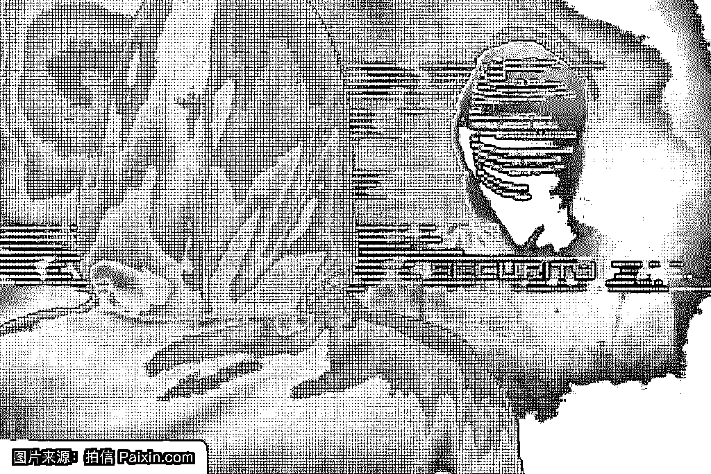

刷单军团隐匿在各大电商平台， 制造出一个个爆款、零差评产品， 捧红了一批批高等级卖家和网红。

我们了解到一位曾从业六年多的刷单侠的故事，这位刷单侠，就叫他 KK 吧。

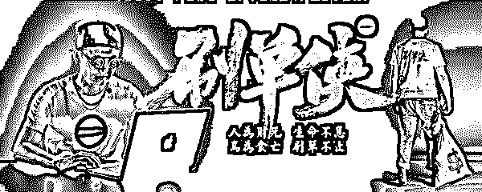

KK 已经金盆洗手不干了， 愿意畅所欲言谈谈他的从业史， 从他的故事中， 我们可以了解到， 刷单是怎么一步步包围互联网领域的。

2010 年，中专毕业的 KK 投身电商洪流。

他先是进了一家电商代运营机构， 并在工作过程中了解到许多小微电商卖家的信誉需求， 平台信誉可以说是个死循环， 没有信誉度的卖家卖不出货，卖不出货就提升不了信誉。 既然有市场需求， 就会有人来满足市场需求。

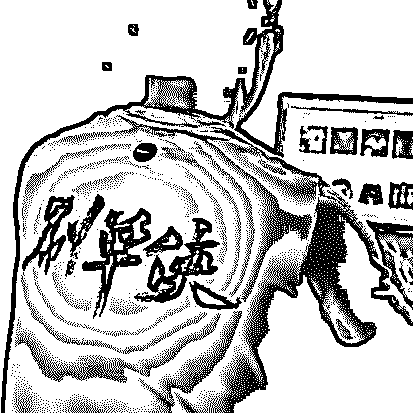

头脑灵活的 KK 看到了信誉带来的商机。

于是，他离开了代运营机构， 和几个志同道合的同学组建了一间工作室， 干起了刷单的生意。通过线上宣传， 开张还不到一个月， 他们就接到了十几个卖家订单。 

后来忙不过来了就开始招兼职。

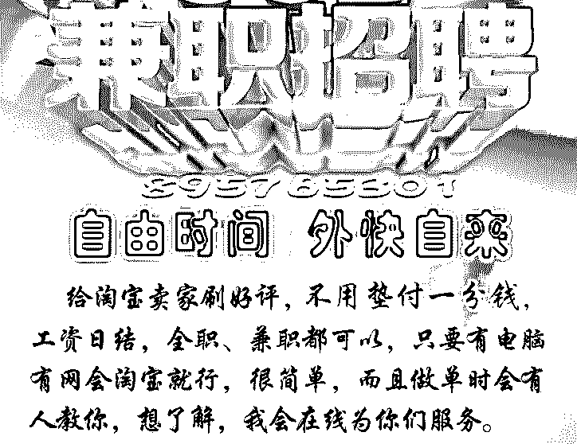

KK 说，当时每刷一单好评， 他就支付给兼职人员 0.51.5 元的佣金报酬，然后再以 510 元每单的价格向卖家收取刷单费。

在近十倍利润的驱动下， 没用多长时间， 他就建立了一支有 2000 余名兼职成员的刷单团队。   

然而，KK 参与的， 是道高一尺魔高一丈的游戏。 

电商平台监测越来越严厉， KK 不得不面向全国范围招收更多的刷单人员， 如果刷单的地址来自全国各地， 就会显得更自然和真实， 电商平台的检测系统就不容易盯上卖家。

为了让订单看起来更真实， 包括 KK 在内的不少刷单机构在操作的过程中， 都坚持将下单、付款、收货、好评的时间做出间隔， 争取能够与真实买家的购买习惯一致。

这样做虽然效果好， 但刷单成本和价格也水涨船高。 部分带图刷五星好评的服务 ，甚至曾高达 20 元每单！ 

这让有迫切需求的客户怨声载道。 但对于缺乏信誉量的新卖家而言，刷单依旧是刚需， 费用还是得支出。

不过，从三年前开始， 许多没有物流信息的订单都会被平台判定是刷单行为， 并对卖家做出相应处罚， 所以为了有物流信息， 我们不得不开始建议卖家发物流空包。

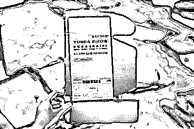

虽然与部分中小规模的快递企业合作， 降低了空包的物流价格， 但连连上涨的刷单费用，有时甚至高出产品本身的价值， 这让很多卖家开始吃不消。

一样都是烧钱，于是部分销售低价产品的电商卖家开始通过免单， 赚取买家的好评与信誉。突然间生意就差了很多。 

在失去了这部分主力客户之后， KK 开始慌了。

**4、靠着刷好评，我开了个厂子，还挣了几百万**

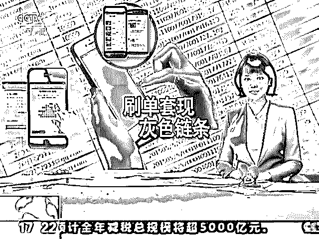

为了弥补这一部分损失， KK 开始将目光瞄向有品牌知名度的大企业， 每年几个电商节日，它们都需要一份可以对外宣传的成绩单，所以需要刷销量，在费用上通常不会太斤斤计较。

凭借丰富的刷单经验， 业务能力得到了部分大品牌的认可， KK 的团队成了许多大企业的御用刷单机构。KK 也在各大电商强行造节的过程中 赚了个盆满钵满。

仅 2016 年， 他就在帮部分品牌刷销量的过程中获利近两百万。

零售电商的发展，给了许多个人创业的机会， 同时也给灰产带来大量红利。 

从刷单团队到卖家再到快递空包的快递公司， 都是这条灰产链条的受益者。

虽说刷单是欺诈行为， 但因举证难等因素， 几乎没有刷单者因此受到处罚， 所以大家都在蓬勃兴旺中不断扩张着业务。

2017 年，经过疯狂的扩张之后， KK 的线上兼职队伍已经成长到 8000 余人， 并分布在不同城市， 俨然是一家上了规模的刷单工厂， 但他却开始头疼另一个问题了。都知道刷单暴利，也没啥门槛， 就是人海战术。 所以这一年有许多新团队诞生，开始抢生意。

KK 觉得，刷单没有技术壁垒， 只要有人手就可以入行， 所以行业里渐渐有了竞争。 因为有了大量可选择的刷单团队， KK 在大客户那有了失宠之势， 有的客户开始要求团队垫付刷单资金， 才愿意合作。

几百万的垫资对于 KK 来说并不算多， 但出于对风险的把握， 他还是决定放弃与部分大客户之间的刷单业务， 重新为团队寻找新的方向。

一次，KK 在一家新开业的餐馆吃饭， 店老板为他送上了一份小吃， 希望他能够在点评软件上为餐厅好评。 

头脑灵活的 KK 发现了商机， 攀谈中店老板告诉他， 因为许多食客有选择困难症， 所以喜欢通过点评平台的选择好评率高的餐厅用餐， 因此评价对于餐厅来说很重要。

因为这个需求，我和团队开了几天研究会， 发现已经有机构在做这类刷好评业务了， 但我们还是决定全面转型。

由于不用发空包，不用仿真人操作， 只需要注册和评论，所以刷服务电商平台的好评相对简单很多。更重要的是， 他拥有遍布全国各地的兼职人员， 可以轻轻松松地适应各种地域限制的刷单需求，虽然有竞争，但我们有资源优势。

一贯讲求效率优先的 KK， 马上让团队开始整理互联网与移动互联网端的所有服务电商平台，从美食点评到娱乐消费， 从酒店预订到在线旅游， 应有尽有。

搜集整理好后， KK 让团队一一分析平台刷单的可能性和难度， 再罗列出了一系列可行的解决方案， 供商家选择。

操作简单，所以也便宜。 

以餐厅来说， 刷 500 个带图好评只要 1000-1500 元， 商家提供大量图片， 兼职人员自行组织文字即可， 相比通过小吃吸引消费者点评， 成本更低，而且效果快。

再加上点评账号来自全国各地， 更能体现餐厅有诸多慕名而来的顾客。

不过，给餐厅刷单并不是 KK 的主要收入， 其收入的大头来自刷酒店。 

在线旅游平台在这两年广受热捧，许多用户习惯了出行前在线预订酒店， 甚至订购相应的旅行方案套餐， 所以信誉度对于酒店和旅行社来说十分重要。

所有的旅行评价和酒店评价都是可以刷的， 只要与商家联合起来操作。他透露，为了吸引更多的用户流量， 也为了提高佣金分成， 许多在线旅游平台对于刷好评也是睁只眼闭只眼。 有时候一天连续刷几十单好评， 平台也不会过问一句。

相对于餐饮和娱乐消费来说， 酒店、旅行套餐都是高价值， 所以其开出的刷单费用也相对可观。KK 当时发现， 如果能为酒店或旅行社带来大量的出行订单，他们甚至还会给予一定的奖励提成， 至于刷单后续所产生的部分用户差评， 我们也会通过部分平台内部关系去删除，只要客户出钱。

**5、从社交到娱乐，刷单还能捧红明星**

到 2016 年初，我们全国兼职人员就已经突破三万人了， 发展还是很快的。 曾经只有几个人的小团队， 逐渐在电商大潮中成为一支庞大的刷单部队， 但 KK 对当时的现状并不满意， 人数很庞大，手头掌握了大量的平台账号， 其实可以做更多的事情。

之后，他决定跳出电商领域， 尝试在逐渐兴起的社交领域里寻找发力点。 虽然对这个圈子略显陌生， 但新业务总要开拓、尝试。

在朋友的搭桥牵线下， 他通过海量兼职人脉资源， 帮部分商家在微博和微信上刷转发量， 做推广，并且收到了不错的反馈。

因为刷的质量还行，也有实际的推广转化， 所以在社交媒体上打出了一点名气。 

KK 说，通过微博微信慕名来找他的客户并不少。 但最令他惊讶的， 是一家小有名气的演艺经纪公司找来了。同样是刷量的需求， 但不同的是，他们想刷的是明星的影响力。

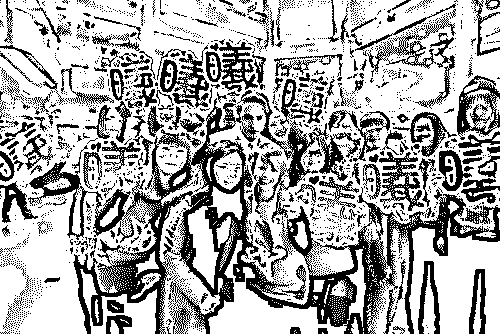

对于经纪公司来说， 旗下明星影响力和知名度大小， 直接决定了其本身商演或代言的费用高低。 为了让明星，尤其是新晋明星在短时间内大量聚集人气， 他们就需要借助策划机构策划爆点话题， 并利用 KK 这样的刷单机构为明星刷大量存在感。

因为从来不关注演艺圈， 都不知道这么多网红、明星也要刷量， 无论是今天和谁闹绯闻，明天和谁组 CP， 都是经纪公司和策划机构的把戏。

他透露，当一个具有爆发性特点的话题出现了之后， 经纪公司就要求他们发动大量的兼职人脉， 在微博和微信上炒作明星话题， 因为我的人很多， 所以基本上一个小时内就可以把一个话题顶上微博热搜榜。

KK 透露， 如果看微博时，发现一些不知名新星的生日话题被顶上微博热搜， 或许就是源自他们的推动。 甚至一些粉丝之间的矛盾，也是他们按要求挑起的，为的就是给明星创造话题和关注度。

对于关注热度快速上升的明星而言， 他们越热，影响力就会越大， 就能越快获得广告主的青睐， 赚得也就越多。当然，某个明星在机场打个电话、拎一款新包、 被粉丝偶尔撞见围观拍照， 都可能上热搜。

但仔细想一想， 哪来那么多粉丝天天在机场偶遇明星， 哪来那么多粉丝关心爱豆今天换了一款新的短裙？明星和经济公司赚的越多，KK 赚的也就越多。 这种炒作方式，我们做一单基本上就有十几万入账。 这些炒作手段屡见不鲜， 在社交媒体上， 所谓真假都是普通用户难以察觉的， 他们只会被火爆的话题牵着鼻子走。

当一颗新星缓缓上升时， 许多粉丝在水军的带动下纷涌而至， 争先购买其代言的产品。 这其中，广告主受益， 经纪公司受益， 明星本身受益， 提供大量水军的 KK 们也跟着受益。那么谁来买单呢？恐怕是众多的粉丝和消费群体了， 这或许是整个影响力链条里的唯一受害者。

 或许，他们也不是，看到自己的爱豆被更多人喜爱， 花钱购买自己爱豆代言的产品，粉丝们的心理满足或许也是一种受益

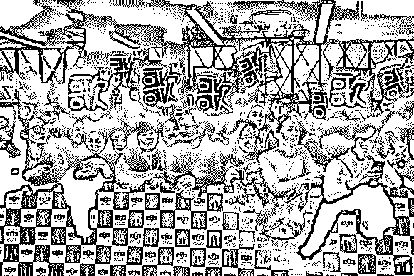

**6、刷单，可以休矣！**

刷单， 一是获利不缴税，二是没有合法的身份地位， 可谓彻头彻尾的灰色产业， 很多人也就没有了顾忌。KK 们从刷产品到刷服务， 再到刷社交、刷娱乐， 不断转型，赚的也越来越多， 参与的人自然也越来越多。

央视最近的一项调查数据显示， 目前我国有 100 多万人从事与刷单炒信相关的职业， KK 们可谓大有人在， 把互联网上的信誉撕扯地七零八落。

遥想电商刚兴起的时候， 几大电商平台建立了，开放、透明、可追溯的交易环境。

京东初起时， 中关村的骗子还满坑满谷， 没过几年， 中关村的电子卖场就冷清到可怜。

人们之所以选择电商， 是因为电商的品质看得见， 消费者自己给出的评价值得信任， 这本来是一件值得骄傲的事。

只不过人们后来发现， 事情没有看起来那么美好 作为参考的购物评价竟能随意伪造。

这也把商业信誉置于随时崩塌的境地， 试想将来有一天， 消费者在网上看到销量高、好评多的商品 第一时间不是购买而是怀疑， 人们网购只敢相信朋友推荐的店铺， 有关平台的官方推荐机制形同虚设， 会造成何种后果可以想象。

近年来，国家虽然对刷单的监管日趋严格， 严重者甚至可入刑， 但网络刷单却依然活跃。

对于这种现象，专家认为， 主要原因有两个方面， 首先是刷单行为没有明确的被害人。

 淘宝店铺通过刷单获得皇冠、几星几钻， 消费者会认为这跟我有什么关系？ 既然没有被害人， 就不会有人报案。 除非电商平台主动举报， 比如杭州的刷单入刑案例， 就是阿里巴巴集团运用大数据主动发现并报案的。

其次，如今还没有确定的技术可以证明交易量和评价是刷出来的， 取证成为第二个盲点。

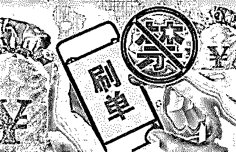

但方法也是有的， 除了在法律和技术上加强监管之外， 如果加强执行力度， 比如在税收问题上对电商卖家进行强制规范， 网络刷单可能很快就能得到治理。 

因为店铺的交易量就是他的营业额， 现在很多淘宝店铺都没有按照法律规定申报纳税， 如果税务机关规定， 每一笔交易记录都必须按照交易的金额缴税， 那么刷每一笔单的成本就会增加，刷单团队和商家终有无法承担开支和后果的那一天。

**（本文综合自钱江晚报、澎湃新闻、新京报、微信公众号懂懂笔记等，图片均来源于网络）**

* * *

**点击加入【灰产圈】高端社群**