# 写在 2018 世界杯前夜：庄家的狂欢，赌徒的末日！

> 原文：[`mp.weixin.qq.com/s?__biz=MzIyMDYwMTk0Mw==&mid=2247492007&idx=1&sn=312e2e85168e92a0eb371a9df1721350&chksm=97cb2a9fa0bca389689d73631f94d3cf948004cf006ac29b93ea6f07b22758ed654f201b6bd7&scene=27#wechat_redirect`](http://mp.weixin.qq.com/s?__biz=MzIyMDYwMTk0Mw==&mid=2247492007&idx=1&sn=312e2e85168e92a0eb371a9df1721350&chksm=97cb2a9fa0bca389689d73631f94d3cf948004cf006ac29b93ea6f07b22758ed654f201b6bd7&scene=27#wechat_redirect)

**点击上方蓝色字体“灰产圈”关注并置顶本公众号**

**导语**

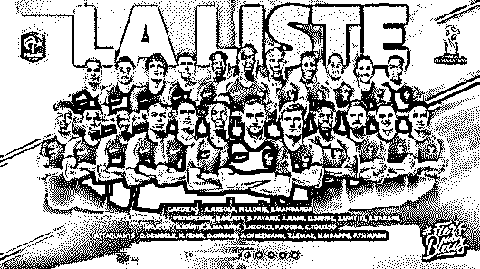

4 年一届的世界杯即将拉开序幕，全球博彩业也迎来狂欢盛宴。赌球的危害性很大，但到了世界杯时间，很多不懂足球平时不玩竞猜的人也多会买上几注自娱自乐，博彩公司和专业彩民们更是进入亢奋状态。 

在赌博行业，占比最高的就是博彩，其中体育博彩又占了大头。据英国博彩公司预计，2017 年全球博彩业规模超过 5300 亿美元，如果加上各类地下博彩市场，规模逾万亿美元。

足球博彩作为体育博彩的重要内容，其交易规模极为可观。英国博彩独立仲裁委员会（IBAS）的统计显示，2002 年韩日世界杯半决赛之前，全球博彩公司的投注额就已经逼近 200 亿美元，2014 年巴西世界杯博彩总额则突破 2200 亿美元，足足增长了 10 倍有余！这些还只是合法博彩公司的部分，地下赌球市场的投注规模则不知要大多少倍。

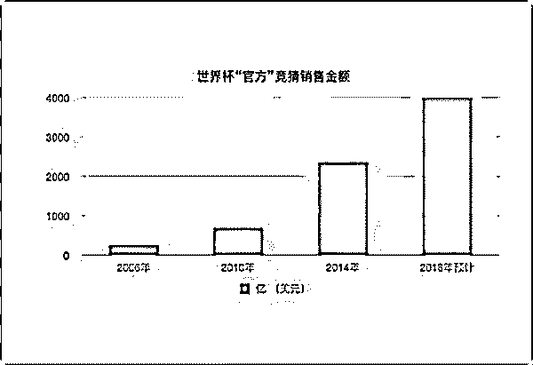

中国足彩市场同样火爆。

巴西世界杯首个比赛日，国内竞猜单日销量就突破了 1.5 亿元，整个世界杯期间足球彩票各类游戏销售总额高达 156 亿元，这还不包括数量众多的地下赌球网和黑庄。

有调查显示，内地每年由于赌球而流到境外的赌资超过 6000 亿元，接近全国彩票一年发行总额的 1.5 倍（2017 年全国共销售彩票 4267 亿元）。英国经济学人数据显示，全世界每 100 个赌民或是彩民中，就有 37 个来自中国。

**写在“世界杯”前夜**

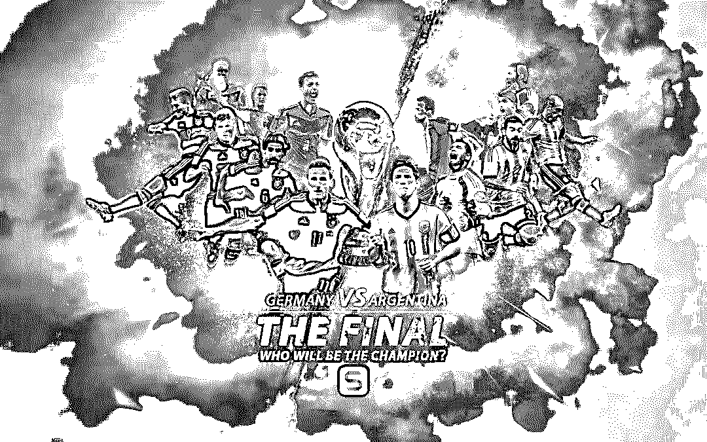

但自博彩诞生以来，作弊和欺诈行为就屡禁不止，庄家和玩家之间的信息不对称，没有公平性可言。尤其是在线博彩存在的赔率不可靠、造假、洗钱等问题让人十分头疼，很多地下赌场以高额赔率来吸引大家参与，利用赌徒心理来牟利，实际上参与者往往赢了赌局却得不到奖金。

2010 年以来，仅在北美地区，就有数十家博彩网站被勒令关闭。2015 年中国政府也出于多种考虑叫停了互联网博彩，很多人因此选择地下或者海外赌场，并频频遭遇暗箱操作、平台诈骗、平台跑路。

随着移动互联平台的普及，相信大家和我一样，第一次感受到原来自己身边这么多人在赌球，深夜时朋友圈里面各种刷屏，而大家关注的焦点也从球赛本身转移到了赌输赌赢赌哪队盘口怎样水多少……

  其实很多参与赌球的人平时并不好赌，只是时逢世界杯买几把感受一下气氛，看起球来也更加刺激，可恰恰就是这几把便会将人陷入赌博这个万年泥潭之中，赢了后感觉挺容易、不满足，导致继续赌，输了之后感觉不服气想回本，结果还是导致继续赌。

那句说到烂的老话，十赌九输！连澳门赌王何鸿燊都曾经亲口劝说自己亲戚朋友尽量少赌，因为我知道你会输，你们不输我怎么会成为亿万富豪。小赌怡情，大赌养家糊口，可这个大赌并不是指让你一场比赛押个一百万，而是指大庄家、代理庄家，能够稳赚不赔日金斗金的永远都只有庄家。下面就把赌球黑幕扒给大家看！ 

**欧洲大型博彩公司把持国际足球赛事**

直接入主题，博彩公司是否有能力影响世界杯、欧洲杯、美洲杯、亚洲杯等国际足球赛事？答案是肯定的！

从来没有任何一项体育项目像足球这样被博彩公司控制得如此彻底的，反过来说，足球之所以成为世界上最热门最受欢迎的体育项目，博彩公司功不可没。

博彩公司和国际足联 FIFA 是全球整个足球产业的老板，FIFA 只有一个，博彩公司有很多个，但博彩公司中的欧洲三个巨头却拥有 80%以上的影响力，它们分别是英国的威廉希尔（WilliamHill）和立博·希尔顿（Ladbrokes）、以及德国的 SportWetten。

欧洲三大博彩公司是欧洲各大足球俱乐部的幕后最大赞助商，他们和国际足联一样在不留余力推广足球运动，为各大俱乐部球星炒高身价，球星们频繁动辄几千万欧元的天价转会费和年薪，不是只靠卖门票、出售电视转播权赚钱的俱乐部能够负担得起的。 

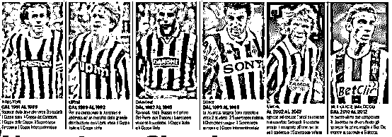 

上图是英超的阿森纳足球俱乐部 2010 年的收入来源报表，其中门票 9393 万，电视转播 8458 万，商品 4397 万，可见单靠俱乐部自身的盈利能力是不足以养活球星们的。

而那些表面上正统的赞助商譬如耐克、阿迪达斯、彪马也不具备如此庞大的财力，以运动品牌中全球市值第一的耐克来说，2012 年耐克全年广告营销投入是 27 亿美元，其中绝大部分用于全球范围的电视广告，剩下的几亿美元，对于耐克所赞助的国际米兰、尤文图斯、曼联、巴萨、阿森纳等俱乐部，以及 2014 世界杯期间赞助的巴西队、英格兰队、法国队、荷兰队等等，那些赞助费只是杯水车薪而已。

有些球队的胸前广告甚至可以卖到几千万甚至上亿元，这样的天价广告费其实有是由博彩公司旗下对应的广告投资公司炒上去的，例如赞助商为了获得球队胸前广告，对找到博彩公司旗下的广告公司商谈，最后以 1000 万竞得，但广告公司却自己再加 5000 万共计 6000 万给球队，并且对外宣传球场胸前广告值 6000 万。

博彩公司之所以长期天价养着各大俱乐部，背后当然是有着更巨大的利益回报，欧洲的俱乐部联赛就不用说了，连媒体都已经多次曝光各种踢假球的丑闻，而到了四年一度的世界杯时，博彩公司操控比赛更是可以带来数以百亿欧元的巨额暴利。

全世界的博彩巨头分别位于欧洲的英国、德国，亚洲的澳门、美国的拉斯维加斯，但是美国人的国球是橄榄球，足球对于美国人来说只是排到第五的运动，所以拉斯维加斯的博彩公司们对足球赛事影响不大，而澳门的博彩公司仅仅在亚盘具有影响力，2000 年后立博·希尔顿开始杀进亚洲，和澳门博彩公司平起平坐，同时也让欧亚盘更加保持统一。 

 而那些表面上正统的赞助商譬如耐克、阿迪达斯、彪马也不具备如此庞大的财力，以运动品牌中全球市值第一的耐克来说，2012 年耐克全年广告营销投入是 27 亿美元，其中绝大部分用于全球范围的电视广告，剩下的几亿美元，对于耐克所赞助的国际米兰、尤文图斯、曼联、巴萨、阿森纳等俱乐部，以及 2014 世界杯期间赞助的巴西队、英格兰队、法国队、荷兰队等等，那些赞助费只是杯水车薪而已。

有些球队的胸前广告甚至可以卖到几千万甚至上亿元，这样的天价广告费其实有是由博彩公司旗下对应的广告投资公司炒上去的，例如赞助商为了获得球队胸前广告，对找到博彩公司旗下的广告公司商谈，最后以 1000 万竞得，但广告公司却自己再加 5000 万共计 6000 万给球队，并且对外宣传球场胸前广告值 6000 万。

博彩公司之所以长期天价养着各大俱乐部，背后当然是有着更巨大的利益回报，欧洲的俱乐部联赛就不用说了，连媒体都已经多次曝光各种踢假球的丑闻，而到了四年一度的世界杯时，博彩公司操控比赛更是可以带来数以百亿欧元的巨额暴利。

全世界的博彩巨头分别位于欧洲的英国、德国，亚洲的澳门、美国的拉斯维加斯，但是美国人的国球是橄榄球，足球对于美国人来说只是排到第五的运动，所以拉斯维加斯的博彩公司们对足球赛事影响不大，而澳门的博彩公司仅仅在亚盘具有影响力，2000 年后立博·希尔顿开始杀进亚洲，和澳门博彩公司平起平坐，同时也让欧亚盘更加保持统一。 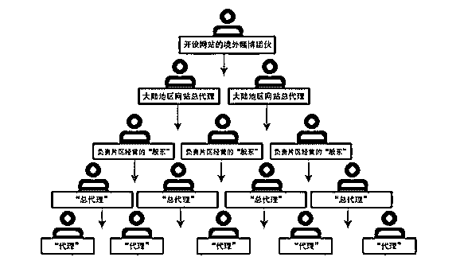

**博彩公司操控比赛的手法**

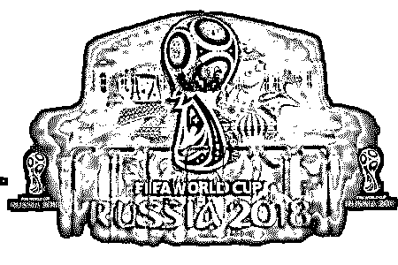

虽说同是博彩赌球，但是欧洲和中国同行们的做法是完全不同的。

在中国，博彩公司是借助黑社会势力对教练、裁判进行威逼利诱，对中国足协高官进行贿赂，中超中教练、裁判被黑社会威胁的新闻数不胜数，甚至连直接枪杀的都有，而上届中国足协主席刘亚龙受贿操控球赛的案子，正式让中国足球的黑幕赤裸裸展现在大家眼前。
博彩公司也会贿赂裁判，不过这一般都是在一些特殊的比赛，比如比赛一方有不听博彩公司话的球队，而对阵的另一只球队也没有压倒性实力能够肯定赢过对方，这样的比赛博彩公司 才会从裁判下手，2002 年韩日世界杯就是出现了非常多的黑哨。

除了贿赂裁判以及那些长期受恩惠的球队外，博彩公司内部也有一批非常厉害的智囊团，他们就是年薪上千万的精算师。

精算师们通过分析计算各种各样大大小小的资料数据，其中什么历史交战记录、球员资料这样是最最基本的，就连球员是否携带女友同住，教练最近是否有烦心事，比赛当天会下雨球员所在国家地区是否是干旱地区等等都在精算师的计算范围之内，最终为博彩公司计算出一个最有利的盘口和赔率。

欧洲各大足球俱乐部长期受到博彩公司合法的恩泽，双方之间早已有了心领神会的默契，除了俱乐部联赛大家乖乖配合博彩公司开出的盘口踢球之外，即使是到了世界杯，博彩公司依然还是有着非常大的影响力。

基本上参加世界杯次数越多的球队就越配合博彩公司，例如巴西、阿根廷、德国、意大利、英格兰、法国、西班牙、乌拉圭、荷兰、葡萄牙、墨西哥、捷克、智利等世界杯常客，其中巴西和阿根廷最为听话。 

**世界杯“案例”解析**

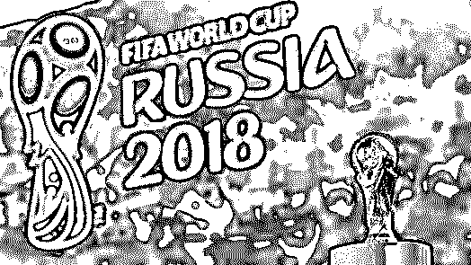

1998 年世界杯决赛上，巴西为了配合博彩公司，竟然打出了 0:3 法国队的荒谬比分，当时法国每进一个球，博彩公司还要开滚盘，赌巴西会不会踢进一个球，于是全世界的钱都跟着滚盘追，无数的钱砸进了博彩公司的口袋。

2010 年南非世界杯 G 组的小组赛，巴西 VS 朝鲜，博彩公司开出的盘口是巴西让两球，当时全世界只知道朝鲜是个极其封闭的独裁国家，完全不知道原来朝鲜还有足球这回事，于是全世界的赌资一边倒的压在巴西身上，上半场巴西轻松先进两球，然后开始放水，一直拖到下半场朝鲜终于进了一球，最终比分巴西 2:1 朝鲜，巴西漂亮的做到赢球输盘，拿到小组赛的 3 分，还让博彩公司大赚一笔。

第一场比赛结束，但是这套博彩公司打出的组合拳才刚刚开始，接下来葡萄牙 VS 朝鲜，博彩公司开出的盘口也是让两球，全世界球迷似乎第一次见识到朝鲜足球的实力，竟然能和巴西踢成 1:2，葡萄牙凭什么和巴西一个级别，于是大量的赌资涌向朝鲜，但比赛让所有人大跌眼镜，当比分变成葡萄牙 3:0 朝鲜时，滚盘再次启动，博彩公司开盘赌朝鲜接下来能不能进一个球。

配合之前博彩公司放出的各种舆论消息，诸如朝鲜队球员如果不能在比赛中进一个球，回国之后就会被派去挖矿，甚至抓进监狱，为此朝鲜队就算守门员弃门参与进攻都要踢进一个球，于是在滚盘过程中追加进来的赌资甚至超过了比赛之前，可这只是博彩公司与巴西队、葡萄牙队配合好的剧本，最终比赛 7:0 收场。

2014 巴西世界杯，卫冕冠军西班牙的两次比赛也是博彩公司所设计好的，获得上届世界杯和欧洲杯冠军的西班牙队被博彩公司打造成仅次于巴西的夺冠大热门，赌资一面倒向西班牙，而西班牙却连输两场提前出局，让博彩公司赚得盆满钵盈。

另外 D 组所谓的死亡之组，在博彩公司的剧本下，三大传统强队联手又上演了一出让全球球迷输钱输到要跳楼的好戏，乌拉圭和意大利先后输给哥斯达黎加，将哥斯达黎加塑造成最大的黑马。

其实大家看比赛时或许就会发现，意大利整场比赛踢完，大部分队员的衣服还是干干净净的，奔跑数据和冲刺次数也是远远低于哥斯达黎加。而当哥斯达黎加成为黑马之后，球迷们心中就会觉得输给意大利的英格兰无意是 D 组中最弱的，最后当英格兰 VS 哥斯达黎加的时候，全世界的赌资将一面倒向哥斯达黎加……

当然相对俱乐部联赛时的只手遮天，世界杯还是不能说完全操控比赛，毕竟还有一些其他不确定因素。

**不确定因素一**：东道主，一般来说，几十年才有机会举办一次世界杯的东道主，是不会配合博彩公司玩这场游戏的，这种时候国家荣誉还是摆在第一位，所以巴西世界杯，每当有巴西队比赛时，大家可以不用有关于爆冷的担忧。

**不确定因素二**：首次参加世界杯的国家，首次参加世界杯的足球弱国们基本也不会参与进这个游戏，一是他们也没有聚到参与进来，二是首次参赛为了国家荣誉还是会拼了命去踢。例如这一届世界杯中波黑，在小组赛中对战阿根廷时还踢进了一个球，而强大的阿根廷也十分配合盘口踢了一个小胜，做到了赢球输盘的最佳结果，导致无数押注阿根廷的球迷输钱。

**不确定因素三**：美国队、朝鲜队等，这两个非首次参加世界杯的国家，也是不会配合博彩公司的，只要上场必定拼了命去踢，一场球赛结束，每个球员的球衣基本不会有一处干净的，当然，为了不让局外人捣乱，它们也总是被其他强队全力以赴踢局。

这里随便可以给大家提个醒，但凡世界杯中出现以上所述这些球队的比赛，基本都不会出现假球，最多是东道主巴西踢个赢球输盘的小胜，只有在这样的比赛中，那些交战历史、球员资料、平均实力的数据才真正具有有意义。 

**国内赌球分析**

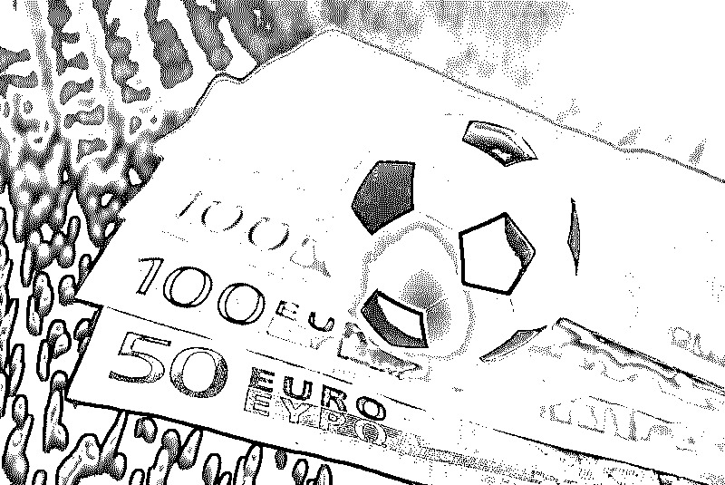

国内赌球网站千千万万，有非常多都是黑平台，打钱进去押注总是很顺利，但是每到提现的时候就非常困难，甚至有些网站还会挂有木马程序，直接危害大家的资金安全。
除去这些黑平台之外，信誉好的赌球网站基本都可以做到及时兑现赌资，它们的特点都是把服务器架设到国外，盘口和赔率和博彩巨头公司们保持一致，然后在国内招收总代理庄家。

总代理庄家拿到网站权限之后，就会按照省市来寻找招收片区股东，股东们再开始找代理庄家，层层叠叠最后就是大家最常看到的，专门负责在朋友圈里面接单的分销人员，结构形式和传销大同小异，金字塔型，每层都有作为佣金的水钱。
庄家们数水钱数到手软，你却在一惊一乍中把钱输掉，然后还在朋友圈里面打骂自己押的球队有多么不多不争气，看完这篇文章之后，以后你还会有这样的举动吗？

赌球虽易，赔钱不易，且赌且珍惜呀，不过小编可也知道对于赌徒来说，仅仅靠一篇文就企图让人浪子回头很难的，那么小编就再给大家几个建议吧，尽量让大家不要掉进博彩公司设下陷阱。

**1.将每场球当成假球来看，不要用传统目光去看待两队的实力。
2.参加世界杯次数越多的队伍，越会配合博彩公司开出的盘口来踢球。
3.东道主和只参加过一两届世界杯的队伍以及美国队一般不会配合博彩公司。
4.赌资一边倒的比赛中，配合博彩的队伍 VS 配合博彩的队伍，那么被重金押赢的队伍肯定会输，配合博彩的队伍 VS 不配合博彩的队伍，变数就比较大，要看两队具体实力，实力差距很大一般都会踢成赢球输盘。
5.赌资在两队如果只是四六开或者三七开，都不算一边倒。**

**私彩之殇**

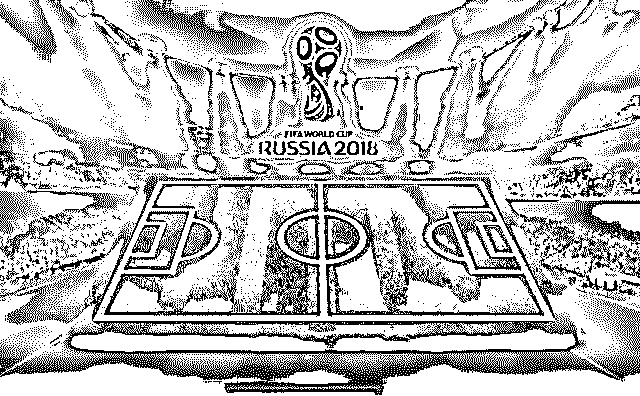

我相信看到这篇文章的朋友或多或少，或这或那都介入过体育博彩。肯定狂喜过、失落过、自信过。最终的结果，可能很难启齿。为什么造成这种情况呢？假球？运气？判断一时出错？庄家水位迷惑？真的是这样的吗？其实都是在失意的时候给自己输钱找的一个借口安抚，来表明自己其实并不是判断错误，而是一时大意。下一场一定好好研究一定不会再犯错了。

　　其实都知道，体育博彩输是输在概率上的。庄家返还率只有 89%-93%，也就是说有 7%-11%的投注金额被庄家吸盘了。就像是跟庄家剪刀石头布，庄赢你输 100，庄输你赢 90，被抽了 10 的水。用大数概率来算，1000 一次，玩 10 次你就要输 500，100 次就输 5000，1000 次就输 50000。

　　有朋友可能觉得并不多嘛。这只是数学上的庄家优势。体育博彩和百家乐一样，玩家输的最惨的是输在人性上。确切的讲是输在赢缩输冲上。人人都有连赢连输的机会。赢了 4 场，想想少压点。连输 4 场，拼了。我想很多人都有体会吧。庄家就这两把利剑就可以让玩家倾家荡产。

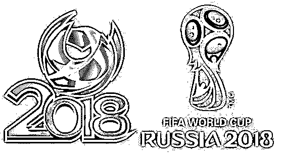

   　再来看看庄家？庄家严格意义上来说其实算一个整体，特别是以英系联盟和马菲系联盟最为活跃。当某一公司某一比赛受注不平均，就会上交联盟寻求配对。如果还有剩余，也会在 Betfair（必发），Intrade 或者 Bet2Give 这种预测市场（也叫预测交易所）交易出去。所以，庄家永远是赢家。

　　额外提一句，现在很多人迷恋 Betfair（必发）指数，这比较可笑。Betfair 只是全球注册的 300 多家博彩公司中的其中一个。有很多专业博彩投资基金在里面进行对冲套利，以及博彩公司一部分资金在里面进行对冲。这并不代表他们对比赛真实看法，所以怎么可能反映出他们对比赛结果的判断呢？

     世界杯期间玩彩票最不愿意见到的，却也每届都有发生的就是输球跳楼。悲剧往往指向比官方彩票返奖率更高却也有更多致命玩法的地下赌球，即私彩业。

     有体彩国家专营，就必然有地下私彩。在国内互联网抢占市场之前，正是私彩教育了国内彩民，互联网也可以购买彩票。上届世界杯官方统计的数据称，被查处的私彩高达 50 亿元，接近正规途径购买彩票的 2.5 倍。而国内私彩市场到底有多大，没人说得清楚。“有可能是合法渠道 10 倍的体量。”

     私彩的服务器往往架在国外，有些本身就是国际大博彩公司的网站，在国内分几级代理商销售彩票，总代理之下会在每个城市再设代理商，代理商通过抽水抽成盈利。

     信誉良好的私彩网站基本可以做到及时兑现赌资，盘口、赔率和博彩巨头公司保持一致，用户通过熟人介绍给代理商，双方通常通过电话下注。

     私彩赌球之所以能够吸引用户，除了紧密的内部关系，其足彩的设计也更为多样，返奖率更高。国内足彩的基本模式只有三种，即赌胜平负、让球胜平负和赌比分，下注也只能在赛前完成。

      和国内 65％的返利相比，国外足彩返利可高达 80％-85％。这意味着庄家将承担更多风险，通常需要多年积累确定赔率以控制风险。而投注方式是滚动盘加注，即在比赛过程中也可以不断投注。“国外一般赛前和赛中投注的比例是 1∶3，赛中投注成为赌球对冲风险最好的方法。”

     但是，正是这样看起来更合理的彩种将很多人拖下深渊。除了输球，在中国赌球的风险还在于遇到无信誉的地下私彩，即拿了钱不出票，中小奖可以马上兑付，中大奖则卷钱跑路。因为赌博本身违法，遇到这样情况将没有任何申诉渠道。更大的风险在于，每次世界杯，政府都会严打地下私彩，一旦被公安端掉，整个盘口可能上亿元被收走。

**结尾**

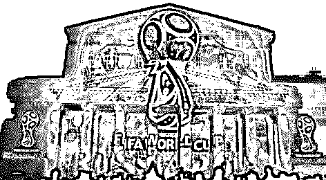

赌球链条的源头，实际上都是境外的博彩公司。他们利用强大的数据储备、复杂的金融模型，甚至还有定量分析方法，开出各种赔率，供赌客们选择。

不过，博彩公司设定的赔率，都是有利于自身的。同时，只要对胜负的投注额比例在一定的范围内，博彩公司就能盈利。

一位资深人士说，博彩公司想要盈利，需要的并非预测比赛结果，而是预测对不同结果的投注额比例。相对来说，这是一个更容易完成的任务。球赛胜负可能因为裁判的一个偶然判罚而改变，但有着众多投注者的盘口，投注额比例突然跳动几乎是不可能的。

所以，投注额比例相比球赛胜负更稳定，更容易预测。这与概率论中的大数定律有关：某个随机事件重复的次数越多，便能越精确地推测它的概率。

例如，一场世界杯小组赛荷兰让半球对澳大利亚，荷兰 1 赔 0.78，澳大利亚 1 赔 1.12。如果荷兰胜一球，那么投注荷兰的球迷不仅可以拿回本金，还能获得本金的 0.78 倍作为奖励，而投注澳大利亚的球迷输掉本金。

如果澳大利亚胜或者平，情况则恰好相反，且赔率从 0.78 变为 1.12。若双方的投注额分别是 x 和 y 的话，如果荷兰胜，博彩公司需要付出 1.78x 作为奖金，否则需要付出 2.12y。

通过简单的不等式计算，只要 x/y 在 1.12 与 1.282 之间，无论在什么情况下，博彩公司则不会亏损，这个区间称为博彩公司的盈利区间。只要投注额比例落在这个盈利区间内，博彩公司就能盈利。该资深人士称，虽然不是每场球赛的赔率都这么简单，但基本原理相同。

博彩公司想要盈利，赔率需靠近投注额比例，而投注额比例的预测其实就是所有投注者对球赛结果预计的某种平均。对主队信心越大的人，投注主队的机会也越大，投注也越多。若发生投注额比例偏离盈利区间，博彩公司会根据新的投注比例来修正赔率。由于投注额比例不会大幅度急遽变动，所以起码在一定的时间内，投注额比例不会落在新的盈利区间以外。

“十赌九输，庄家不会让赌客把钱赚走，任何庄家都会通过盘口和水位调整整体的投注额，令自身处于不败之地，赌客想要成为最后的胜利者实在太难，我是输怕了。”一位资深赌客懊悔不已。

* * *

**【灰产圈】高端社群小程序开通，2018 最值得加入的社群！**

<mp-miniprogram class="miniprogram_element" data-miniprogram-appid="wx4f706964b979122a" data-miniprogram-path="pages/topics/topics?group_id=881854415822" data-miniprogram-nickname="知识星球" data-miniprogram-avatar="http://mmbiz.qpic.cn/mmbiz_png/kialtkOXGKS7D9hZrmO2jzDqryXXTAlhxSpnrKnHGV65KXzicibOppaPic4dCRxftvabB8Iqswo3OuQEDSxE7NicXBg/0?wx_fmt=png" data-miniprogram-title="【灰产圈】高端社群" data-miniprogram-imageurl="http://mmbiz.qpic.cn/mmbiz_jpg/WWG78hysZ0brJkWoyG2VDIacqgQjkDfp6mLiaoPBJ2SgWZHtRuTw7ia8kpoxntsn7PiaFOQO2U23FW6Iry0gS1GnA/0?wx_fmt=jpeg"></mp-miniprogram>

**点击加入【灰产圈】高端社群**