# 致敬崔永元：揭开“阴阳合同”洗钱黑幕！

> 原文：[`mp.weixin.qq.com/s?__biz=MzIyMDYwMTk0Mw==&mid=2247491935&idx=1&sn=53ad63947e9aab0b4e1fa91a9bfa6a13&chksm=97cb2a67a0bca371a8f2acfa5f5a1ad14808fb516e4d5a2139efd3614c431550c2170251ae7c&scene=27#wechat_redirect`](http://mp.weixin.qq.com/s?__biz=MzIyMDYwMTk0Mw==&mid=2247491935&idx=1&sn=53ad63947e9aab0b4e1fa91a9bfa6a13&chksm=97cb2a67a0bca371a8f2acfa5f5a1ad14808fb516e4d5a2139efd3614c431550c2170251ae7c&scene=27#wechat_redirect)

**点击上方蓝色字体“灰产圈”关注并置顶本公众号**

**导语**

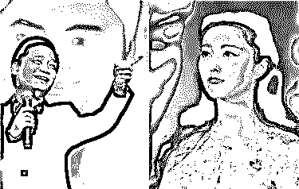

## 如果这几天你有上微博，肯定不会错过“崔永元开撕范冰冰”这出大戏。对于刚刚获得“国家精神造就者”荣誉（这是个什么奖？？？）的范冰冰，崔永元晒出阴阳合同，直言不讳：“你不用表演，你是真烂”。一大一小的合同，共计 6000 万，却只表演了仅仅 4 天。

**揭秘天价片酬内幕**

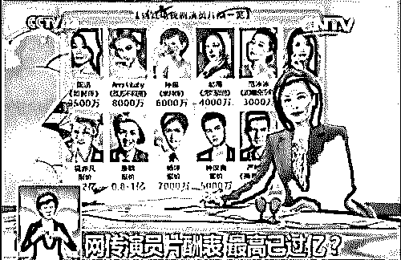

## 这是真的值这么高的片酬吗？还是背后另有内幕？

据业内人士分析，对于领着天价片酬的明星来说，这种操作效果惊人。就拿被崔永元曝光的两份合同来说，小合同 1000 万是税后收入，已经将税负转嫁给甲方公司，而隐藏的 5000 万大合同则大有猫腻。

消息称，范冰冰在崔永元曝光阴阳合同后，已经赴美。

这一切都是因为巧合？

这引起公众无限遐想。

黄奕的前老公也开始参战，揭冰冰内幕了。

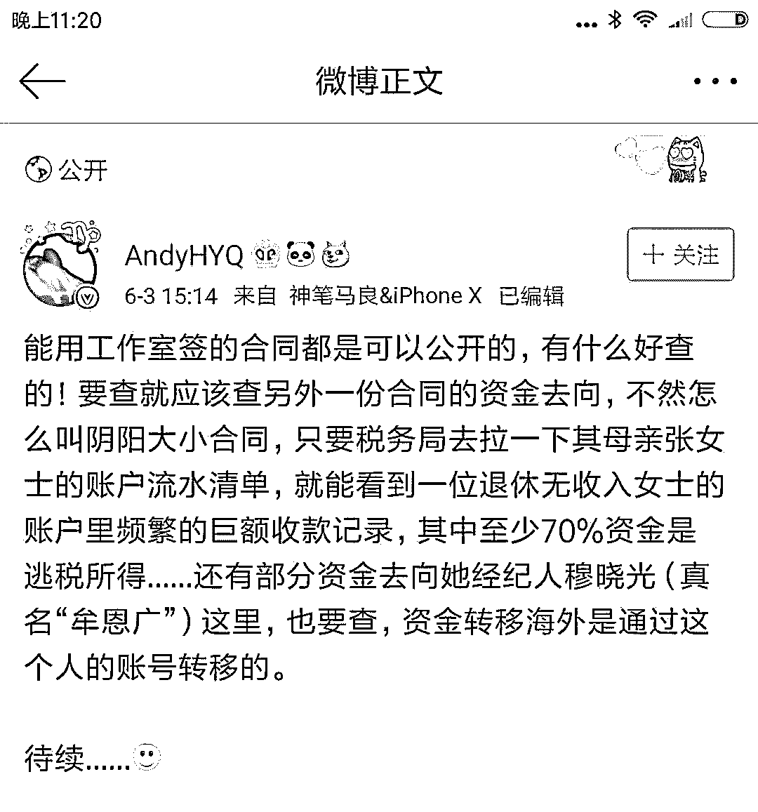

据业内人士分析，对于领着天价片酬的明星来说，这种操作效果惊人。

就拿被崔永元曝光的两份合同来说，小合同 1000 万是税后收入，已经将税负转嫁给甲方公司，而隐藏的 5000 万大合同则大有猫腻。

> **按税法规定，影视、演出、表演所得属于劳务报酬，理应按 3 级累进税率表纳税。按税法粗算，当事人可能涉嫌逃避个人所得税 2000 多万，在应纳税额中占比极可能超过法律红线 30%。**

其实在中国演艺界，大明星签阴阳合同，也就是崔永元说的大小合同，非常普遍。

小合同是可以示人的，因为几百万的演出酬劳，是说的过去的。

但是大合同，才是这个演员实际要拿的费用的大头儿。

和崔永元说的一样，小合同是演员本人签署的，意思是演出酬劳演员自己拿，打进演员自己的账号。

大合同是和所谓的代理人签，钱秘密打入代理人账户。至于代理人是谁，这个不好说，一般是三叔二大爷，或者是演员远方亲戚什么的。太陌生的人不敢用，也怕出事儿。再或者就是经纪人的三叔二大爷，经纪人给找的某个甘肃天水潘石屹的老乡儿，老乡自己吃饭都是问题，他那知道自己曾经有过一笔 5000 万的收入啊。

这么说吧，某些大戏，只一个演员，就能拿到此剧所有费用的一半。

您这么理解啊，比如某剧，全部拍摄费用为 3000 万，请了一个不大不小的腕儿，她自己的费用就是 1500 万，余下的 1500 万是剧组好几百号人几个月费用的总和。剩余的这 1500 万包括剧组十几个重要部门比如服装 道具 置景 化妆 外联 摄影 美术 场记 剧务 音乐 灯光 烟火和数十人甚至数百人的演员队伍以及数百人的工作人员等等。

但是，大腕儿一般和剧组签署的就是阴阳合同，也就是大合同小合同。3000 万制作的影视剧，给一个人 1500 万显然是不现实的，而且剧组很多人也不服气，而且税金也没法处理。

所以一般签的这个大腕儿的小合同也就是阳合同也就二三百万元。那把剧组其他演员以及工作人员都羡慕的都不要不要的。

你看人家，1 个月 300 万元，这钱赚的，简直……騲蹋玛德！

其实你是只知其一不知其二，知其然不知所以然，人家是 1 个月 1500 万。

大演员，一般只接触总导演导演副导演和制片人制片主任以及出品人投资人等等，其他人接触不到。甚至连统筹送通告，都得找演员助理，演员助理就是跟班儿，说白了就是贴身丫鬟。

**崔永元爆料是否构成诽谤？**

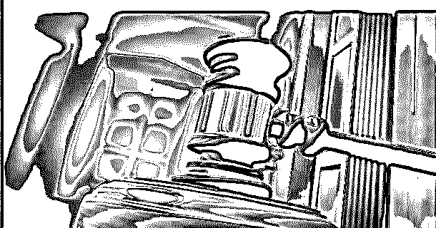

范冰冰工作室指责崔永元公开发布涉密合约已经破坏商业规则，并侵犯了范冰冰的合法权益。

我个人觉得，我和你签的涉密合同，需要遵守此合同之涉密的，只是你和我。而第三人是不需要遵守你我之间的涉密合同的。您不觉得别人遵守咱俩的合约干嘛？甚至包括公司员工，他只要知道，就可以说，他没替你保守涉密合同的责任，你也没有要求别人替你保守涉密合同的资格。

而且，我个人认为范冰冰工作室的声明有点“文不对题”，其声明写的，有点没说到点子上。范冰冰工作室要追责，应该追究崔永元，而不应该威胁发布此消息的媒体。

此事，已经成为公共事件，因此我在这儿说这事儿，你觉得，你能或者你有权要求我不谈这件事吗？你有权要求我撤下我谈论此事的文章吗？我个人认为，你没此权力。

范冰冰工作室的声明，写的一般：

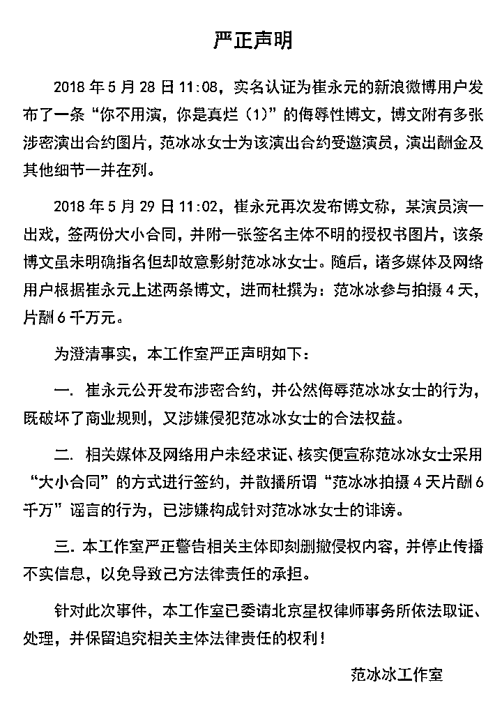

初次违法只需补缴税款和滞纳金

签“阴阳合同”规避缴纳税款的行为在法律上是否构成逃税罪？

崔永元在微博里发布两份“大小阴阳合同”内容，“小合同”金额 1000 万，“大合同”金额 5000 万，公众关注的实质是明星涉嫌通过少申报收入来逃税的问题。在市场活动中，演出费价格完全由市场定价，但是将 5000 万的演出费通过合同掩盖，只申报 1000 万，就是典型的逃税行为。

**火星实验室对话崔永元**

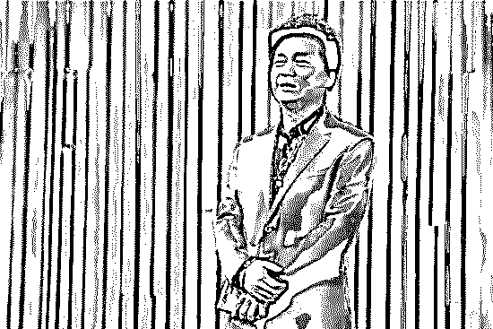

> 对话崔永元：一部电影只是他们的一个手段，还有很多别的招

火星试验室：如果刘震云、冯小刚一直不回应，你会有什么针对行动吗？

崔永元：他们不说话是非常正常的，他说什么呀？他没什么好说的，你知道吗？他道歉，我也不接受，他不道歉，他照样活得挺好，还一个冒充知识分子，一个冒充著名导演，照样可以招摇撞骗，对不对？而现在的这个社会形态就适合这样的人活，脸皮越厚，活得越好，对吧。

我才不在乎他们怎么样呢，我只在乎我自己，我这次骂得他们狗血喷头，我觉得很高兴，这就可以了。但是误伤了那么多人，我还是很抱歉的其实。 

火星试验室：现在无锡税务局联系你了吗？

崔永元：他们可能马上就会联系我。因为消息都已经过来了。 

火星试验室：你会把自己掌握的所有实际情况告诉他们吗？ 

崔永元：我觉得他们弄不了。这个事儿太大了。

火星试验室：你之前说过“随便拿出来一个当事人都得进去，涉及的都是大腕。”这些大腕都包括些什么人？ 

崔永元：什么都有，我也没有细数。这是天大的案子，我真的希望能把这个案子搞清楚，告诉大家。一部电影只是他们的一个手段，还有很多别的招。

**（截止到发文 6 月 5 日为止，崔永元已经召开记者发布会，并与税务局交涉中，****前几天崔永元曝光的“4 天 6000 万片酬合同”还没有结果之前，今天又有媒体称，崔永元说，还有一份“阴阳合同”，是关于一对演员夫妇的，两个人涉及的金额达到了 7.5 个亿.......****）**

**利用拍影视剧“洗钱”的内幕惊人 **

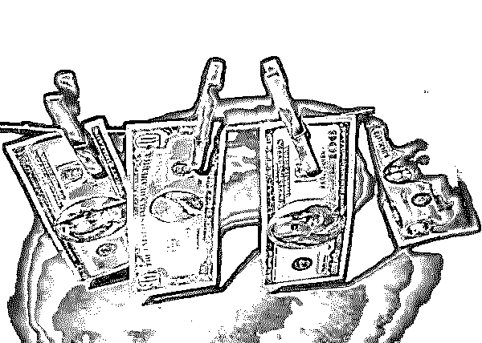

**一，中国内地用影视剧“洗钱”由来已久**

或许，作为一种“与国际接轨”，改开以来的中国内地，用影视剧“洗钱”也是暗流涌动。

**1、影视圈名人纷纷炮轰“洗钱”。**

对于影视圈内的“洗钱”，作为业内的著名导演和著名演员，可能最有发言权了。很多影视圈内的名人炮轰“洗钱”，说明中国大陆影视圈的“洗钱”已到了很严重的程度。

2006 年 4 月，北京《法制晚报》披露，广电总局官员陆红实在某论坛语出惊人：“近两年，我国每年都有百多部滥片不能上院线，原因之一恐怕是有不少人拍片是为了洗钱。”

2007 年 12 月 28 日，导演尤小刚发声，国内电视剧产量过大、浪费严重，要提防“洗钱的投资”。尤小刚进一步阐述：电视剧投资“来源是三种方式，一种是良性投资，一种是赞助的投资，恐怕还有一部分是洗钱的投资吧？

2013 年 5 月 7 日，曾执导过《潘多拉的宝剑》等影片的导演李克龙指出：“有相当数量的电影投资者不是为了拍出高质量的电影，而是为了洗钱，对方直接说，你随便花一两百万拍部电影，然后帮我走 1000 万元的账”。怎样能拍 200 万影视走 1000 万的账目？有的剧组拍“古装剧，就可以设计一场炸掉一座城楼的戏，搭建这种城楼花费 50 万，你可以走 100 万的材料费，反正城楼已经炸掉了，死无对证。”

2014 年 1 月 1 日电视剧《一代枭雄》在浙江、东方、天津、江苏四大卫视开播，该剧在京召开新闻发布会，同时担任演员和监制的孙红雷在发布会上炮轰：我们每天接到剧本，有 70%都是不能拍的，拍了肯定赔钱。有些投资方就是通过拍影视剧来泡女演员、洗钱。

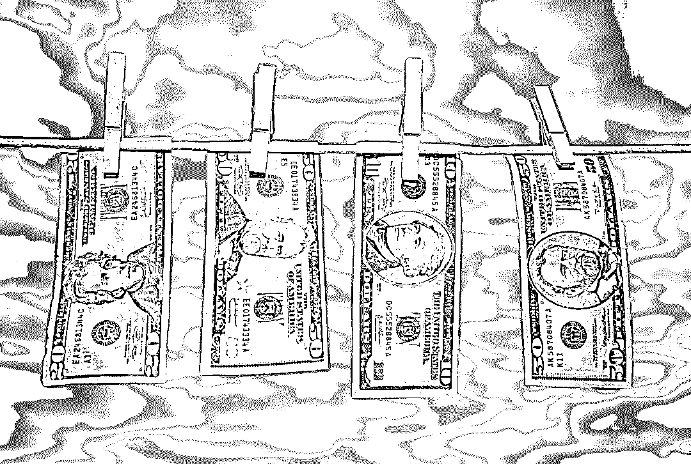

**2、中国大陆为何制片投资人不怕血本无归？**

2011 年 12 月 21 日，北京大学教授、电影评论人戴锦华在“搜狐文化客厅”指出：国内每年拍摄 600 部影片（故事片），大部分未上映。另据官方统计，2012 年国产影片高达 893 部（含动画片、科教片等），其中故事片 745 部。但这 745 部影片，只有 231 部进入影院，只占总量的 31%。这还是 2005 年以来公映比例最高的一年，2005 年的故事片公映率为 16.5%。

很多影片的拍摄目的就不是为上映，雇佣一些烂编剧烂导演，爱咋拍咋拍，花钱少就行，拍完直接锁进仓库，就是洗钱。据说有投资人和内蒙古制片厂合作拍片，拿出 300 万元人民币，要拍 30 部片子，平均每部片子才花 10 万元，可以想见这些片子质量之低劣。北京 UME 国际影城总经理陆遥说：“有些片子拍完后就不知道干什么去了，别说公映了，你想查一下它的去处都无从查起。”但投资人为何不怕血本无归，便知个中奥秘实在不在“拍片”之中也。也难怪大陆咋有那么多“神剧”，很多都是“冼钱剧”。

**3、用影视圈“洗钱”不断曝光。**

2007 年第一禁毒大案，蛰伏三年的毒枭李贤欢竟以投资人身份潜伏影视圈，并于 2006 年年底在横店影视城开拍电视剧“洗钱”。还利用拍电视剧作掩护，在横店制造冰毒。拍戏洗钱并非始于毒枭李贤欢。早在 2005 年 1 月，南京 《周末报》报道“建国第一金融要犯”石雪出资 5000 万元参与拍摄电视剧《大汉天子》，此举就是为非法所得洗钱。近年来圈内一些影视剧源源不断，其怪异的资金来源与“洗钱”不无关系。

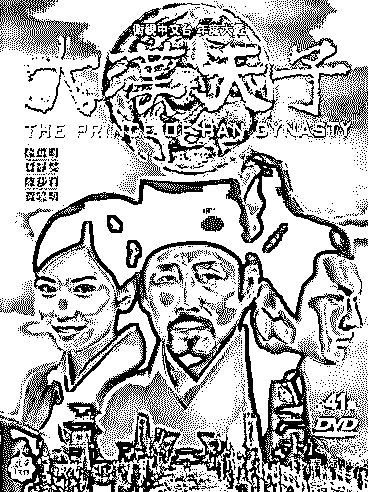

**二、在中国大陆影视圈“洗钱”得天独厚**

这个得天独厚概括起来有 5 点：

一是“洗钱”额度大。

现中国大陆拍故事片仅次于美国和印度，国内故事片的制片动辄几亿，制片成本越来越高，影视剧投资大，虚报投资额度更大，很适合洗钱。

二是“洗钱”成本低。

中国大陆的影视投资属文化产业，税率低：5%；税法还规定：企业可把收入 15%用于广告和宣传，在税前扣除。将这条规定滥用，洗钱的成本更低。通常“洗钱”成本是 35%，在大陆即使拍影视剧投钱打水漂了，经虚报成本、票房等运作，才付出 20%的洗钱成本，在各种“洗钱”成本中最低。

三是“洗钱”没审计。

影视剧的账目支出繁多，且时效性强，拍完戏就立马作鸟兽散，被查的概率极小。甭说资本投资没人管，就是国资投入也没审计。陈凯歌拍《无极》剧本那么烂，投资 3 亿多元，据说大都是国资，国资委监管、审计过吗？国有资产允不允许陈凯歌夫妇“夫妻老婆店”的运营模式？外籍演员来中国“打工”办过合法用工手续吗？

四是“洗钱”易开机。

对于影视剧的拍摄，国家广电总局有专门监管机构，各制片厂拍影视剧必须取得合法许可证，然而，监管部门基本不作为。一些“洗钱片子”“开机”时，广电部门知道不知道？剧本审没审？内蒙古电影厂 300 万元允许拍 30 部片子的荒唐，谁开的绿灯？在谁手里弄到的拍摄许可证？

五是“洗钱”风险低。

相比美国、韩国、日本等国相继出台了反影视圈“洗钱”的相关法律。中国大陆至今也没有反影视圈“洗钱”的相关法律，电影成社会特殊产业，缺失正常监管，可堂而皇之的逃避法律制裁。其它有关部门对影视圈洗钱的监管滞后，洗钱空间宽阔，安全高效。

在中国大陆能神鬼不知无风险的洗钱,炒作好了还能获高额票房回报，顺便睡几个明星玩玩，资本何乐不为？

**三、在大陆利用影视“洗钱”的主要套路**

“洗钱”要洗的“黑钱”，包括黑社会的走私、贩卖军火、诈骗、盗窃、抢劫、偷税漏税和贪污腐败所得等。而在中国大陆利用影视圈“洗钱”的主要套路：

1、虚高投入成本“洗钱”。

现在大投入的片子越来越多，已成一个特点。一部耗资巨大的影视作品拍摄完毕，一些名贵的道具、奢侈品、古董、字画等被投资方“无偿”拿走，但已“摊到”到作品成本；至于到国外取景、宣传，意味着巨额花费。而国外没发票，只有投资方说多少算多少，全部进了成本等等。

2、用阴阳合同“洗钱”。

现在内地只需成立若干空壳影视制作公司，投资一个影视剧，再以制作费、明星的天价片酬等名义，把买办、贪官、黑社会的大笔黑钱洗白。而明星高票房占用大量制作经费，其他拍摄投入少，就是一个很突出的现象。如，请一个演员预算 1 亿，做两份合同，一份 1 亿上税给演员，很可能另一份 1000 万才是演员实际所得。大家现在都盯着演员的税收，演员也有苦难言。

3、虚报票房收入“洗钱”。

电影行业的洗钱流程：某一亿黑钱投资一部电影，真实成本一千万；电影院、电视台等等实际收入一千万；黑钱主人与电影女一号勾搭在一起，通过女一号与电影院造假票房收入达一亿。黑钱主人洗白一个亿，顺便玩个女人；女一号获得知名度和金钱，真正的双赢。

这几年，票房屡破新高，媒体揭露的各种幽灵场、冥币票价、偷票房事件不断。一个华语功夫片，上映首日票房破亿， 5 天拿下 6 亿。不合常理的票房一被揪出造假，即被挖出牵涉到电影证券化、众筹、收益认购、股价，甚至洗钱等金融资本链的不正当交易。赃官则通过勾结将境内黑钱塞进管理疏松的票房，通过纳税将脏钱洗白。

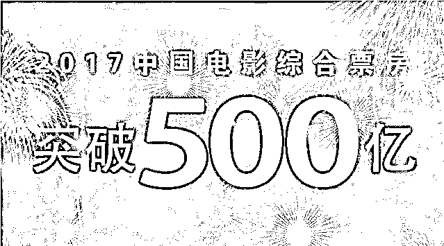

4、集团性勾结“洗钱”。

利用影视圈“洗钱”，需要各方比较紧密配合，所以，资本、导演、明星会长期保持合作，这样才会降低出问题的概率，牵扯利益太多，也没有人去砸大家的奶酪。这就形成集团化产业化的影视圈的洗钱链条。而且，在香港中马票，都立即有人加 30%把奖券收走“洗钱”。在中国大陆这种意识形态下，土豪贪官对利用影视圈“洗钱”，这种“产业化”需求会更旺。

**结尾**

并非贫穷限制了我们的想象力，而是这个世界太疯狂！

而此前针对范冰冰获得某企业颁发的“国家精神造就者”的荣誉，崔永元在微博中用语犀利，直击要害：一个真敢发，一个真敢领。

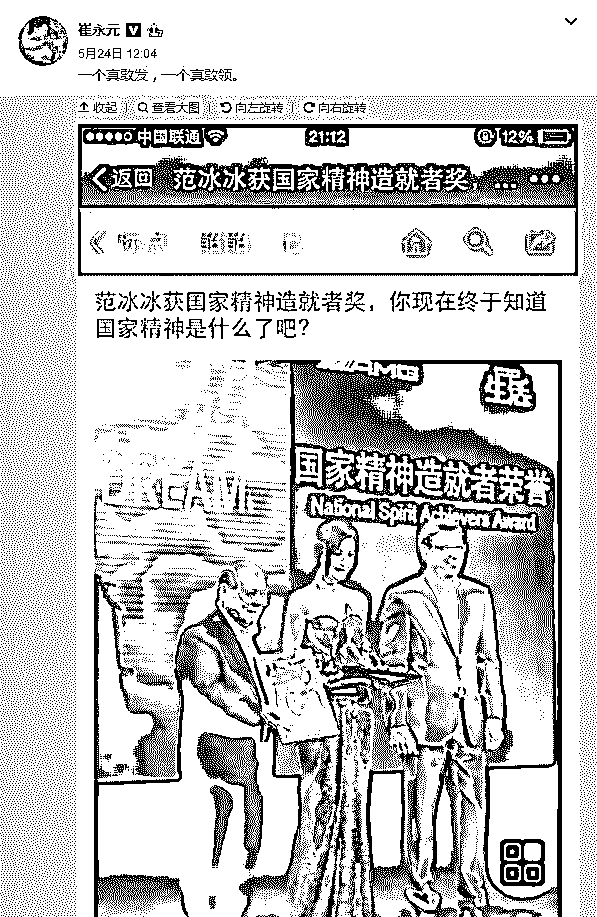

**崔永元微博截图**

骂人是需要资格的，只有自身清白的人，他才敢这样怒目金刚。

安徒生说，清白的良心是一个温柔的枕头。

但现在，多少人弃之如敝履！

而崔永元所揭露的也仅仅是娱乐圈的“冰山”之一角，更多纷繁与腌臜的潜规则，游走于市场与交易，道德与法律的边缘。

无论是偷梁换柱，还是瞒天过海，很多深谙此道的人玩起来易如反掌。

近日，国家税务总局已责成当地税务机关，针对有关影视从业人员签订“阴阳合同”中的涉税问题，依法开展调查核实，如发现违法行为，将严格处理。

6 月 3 日下午，崔永元发微博称，收到了实名认证的死亡威胁。

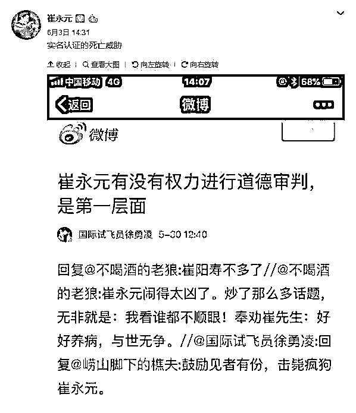

**崔永元微博截图**

一个人讲真话的代价有多大？由此可见一斑。

明代的郎瑛有云：“世间果报之事，此善善恶恶天道好还者也。”

有不少人提醒他这样有损公众形象，可他说，我要是在乎这点形象，早就不这样了。

他认为，假如别人欣赏你，只是因为你亲和力很强，而并非他有责任感，那只能说他们欣赏错了。

而现在，他甚至不惜以“野蛮”的方式来表达自己的社会责任感，有时却引来一片非议，甚至是骂声。

很多人堂而皇之地耍着流氓，干着坏事，面对他的“拍案而起”，却讥之：不厚道！

敢冒天下之大不韪，明知不可为而为之，哪怕自己成为腹背受敌的“靶子”。

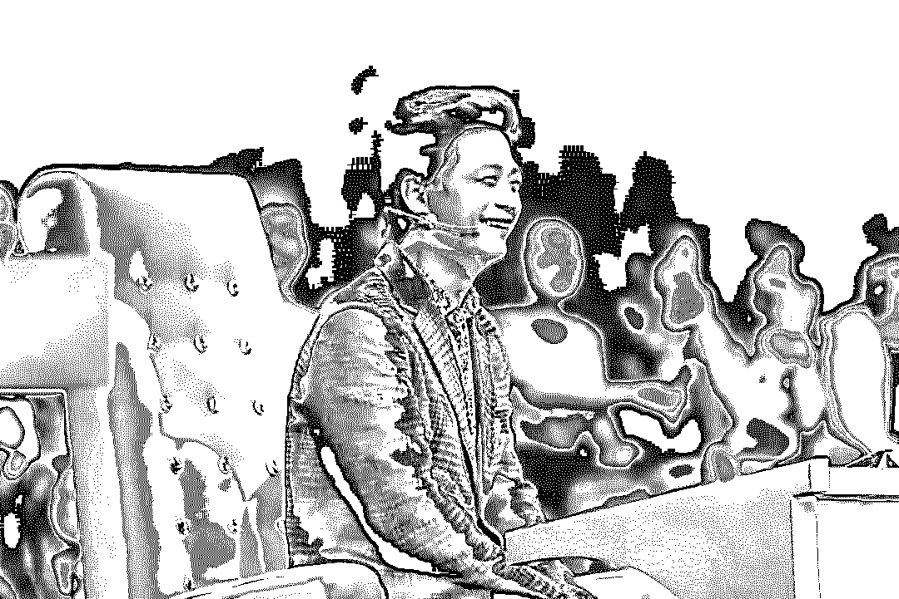

他从不自诩是个有道德洁癖的人，他要求的，不过就是一个社会应有它的道德底线。 

但很多底裤都脱掉的人，遑论底线？

因此他的渴望，有时就是一个“奢望”。

长路漫漫，其修远兮，“吾道不孤”，才有千钧之力。

而今天我们发声，是为崔永元的敢怒敢言发声，也是为我们置身其中的公共舆论环境发声，是为一个公平、有序、平等的文明社会而发声。

“嘤其鸣矣，求其友声”。原因无他，在命运共同体下，我们都应该是遥相呼应的“同路人”。

灰产圈将持续关注报道此次事件，敬请关注

* * *

**延伸阅读：**

[**深度调查 | 微博明星高仿号背后的灰产江湖：数据造假，诱导诈骗，套路重重，暗黑无边！**](http://mp.weixin.qq.com/s?__biz=MzIyMDYwMTk0Mw==&mid=2247489407&idx=1&sn=a0d172b4cffbdb11b1b19c8945f91d8e&chksm=97c8dc47a0bf55517054432bfd2bd994f24f780cadf074b8e00e96390403cc638bd4c0704c2f&scene=21#wechat_redirect)

**[刷流量买热搜，揭秘演艺圈“流量担当”天价片酬背后的灰色流量产业链（深度长文）](http://mp.weixin.qq.com/s?__biz=MzIyMDYwMTk0Mw==&mid=2247490371&idx=1&sn=5cbba76c2759433f725610506551feec&chksm=97c8d07ba0bf596d4e944906a7ba1134d1d75a2cf5e5c2c01c7bdf717b2bddb900d4086aaeaa&scene=21#wechat_redirect)**

* * *

**【灰产圈】高端社群小程序开通，2018 最值得加入的社群！**

<mp-miniprogram class="miniprogram_element" data-miniprogram-appid="wx4f706964b979122a" data-miniprogram-path="pages/topics/topics?group_id=881854415822" data-miniprogram-nickname="知识星球" data-miniprogram-avatar="http://mmbiz.qpic.cn/mmbiz_png/kialtkOXGKS7D9hZrmO2jzDqryXXTAlhxSpnrKnHGV65KXzicibOppaPic4dCRxftvabB8Iqswo3OuQEDSxE7NicXBg/0?wx_fmt=png" data-miniprogram-title="【灰产圈】高端社群" data-miniprogram-imageurl="http://mmbiz.qpic.cn/mmbiz_jpg/WWG78hysZ0brJkWoyG2VDIacqgQjkDfp6mLiaoPBJ2SgWZHtRuTw7ia8kpoxntsn7PiaFOQO2U23FW6Iry0gS1GnA/0?wx_fmt=jpeg"></mp-miniprogram>

**点击加入【灰产圈】高端社群**