# 一夜之间被撸 20 亿？光大惊现提额大漏洞，获利者是中介，一小时狂赚 40 万！

> 原文：[`mp.weixin.qq.com/s?__biz=MzIyMDYwMTk0Mw==&mid=2247491925&idx=1&sn=79630b15631ae28502dd7d1d59c13358&chksm=97cb2a6da0bca37b116d5fbab1ef82ee7071f8257f6a9e962427ca6be01f9711deb5a2da322b&scene=27#wechat_redirect`](http://mp.weixin.qq.com/s?__biz=MzIyMDYwMTk0Mw==&mid=2247491925&idx=1&sn=79630b15631ae28502dd7d1d59c13358&chksm=97cb2a6da0bca37b116d5fbab1ef82ee7071f8257f6a9e962427ca6be01f9711deb5a2da322b&scene=27#wechat_redirect)

**点击上方蓝色字体“灰产圈”关注并置顶本公众号**

**导语：**

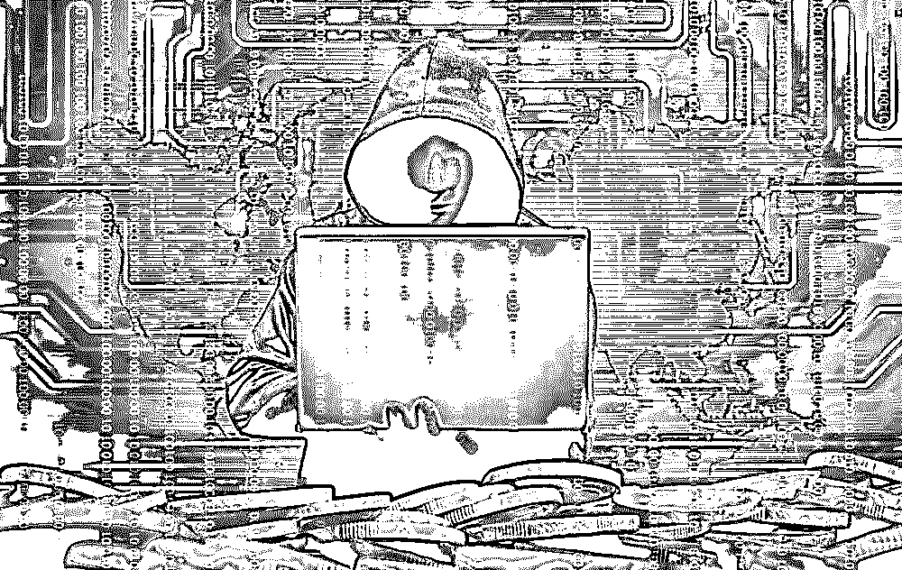

> **凌晨三点不睡的人不只有区块链里的“韭菜”，还有利用漏洞疯狂提额的“黑户”。**

**放水**

5 月 25 号早上 8 点我准时起来，拿起手机，收到一个做金融好友的一条微信

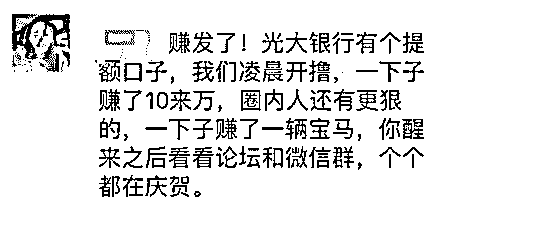

我的这位朋友从 15 年开始创业，做的项目听起来很好，叫金融中介：给缺钱的人找钱，自己从中赚取高额的抽成。

那个时候网贷行业正处于高速发展时期，他搭上了这趟顺风车，一路是高速发展，每天稳定收入都在 1000 以上，昨晚的情况比较特殊，估计是光大银行的一个 bug，然后成了这帮人赚钱的嫁衣！

后来，我特地在网上和论坛找了一些资料，确实如此，那晚，是疯狂的一夜，是所有金融中介日进斗金的一夜！

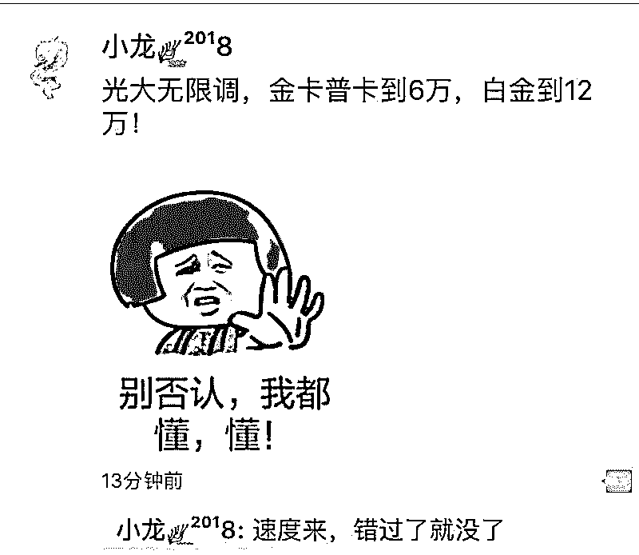

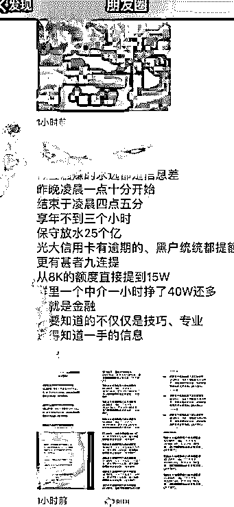

经过调查取证得出结论：

5 月 25 日 1:10，光大银行“放水”了。

> **所谓放水，是一句黑话，意思是银行在面临业绩压力的时候，会放松审核规则，以完成业绩。具体到行为上，可表现为信用卡审核放宽，额度提升等。但这一次的放水，即使是“黑户”也在范围之内，成为了“黑户”和帮助套现的“中介”的狂欢。**

这次放水一直持续到了 5 月 25 日 4:05。

目前此漏洞已无法被利用。

据媒体报道，此次事件从一个名为“我爱卡”的论坛开始扩散。

灰产圈走访了这个论坛，发现论坛上的网友纷纷晒出了自己提额成功的图片。

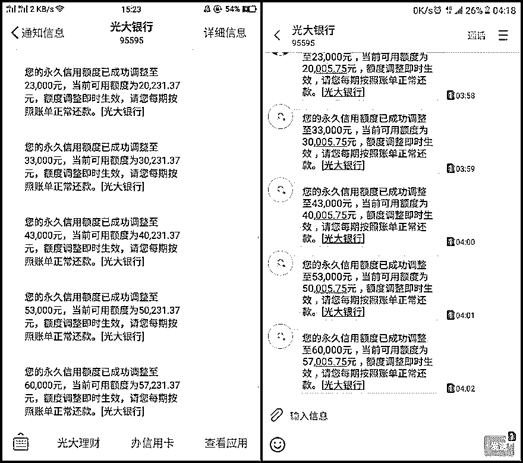

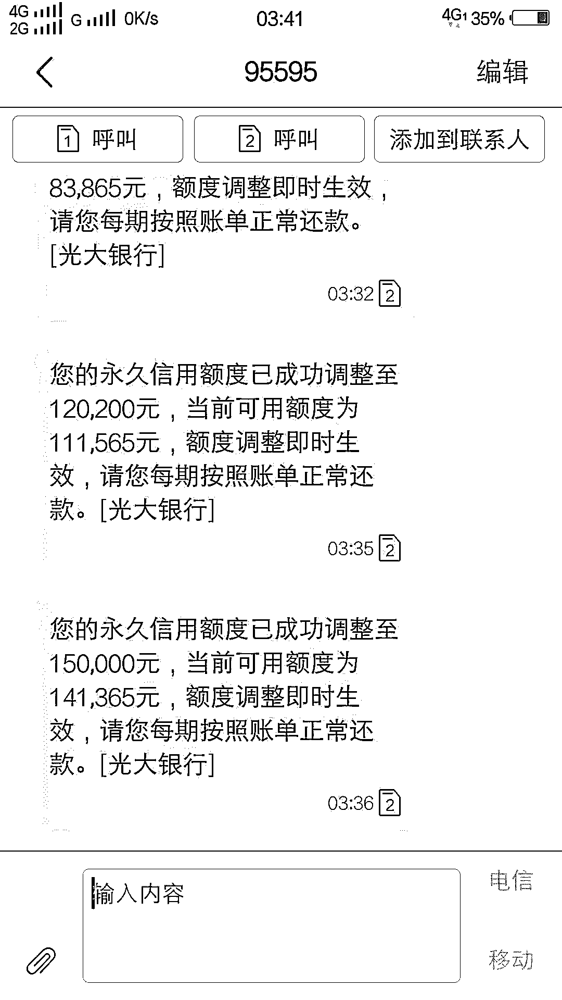

我爱卡论坛的一名版主发帖对这次事件进行了总结，整理如下：

> **1、用户致电银行客服电话申请调整临时额度，通过确认短信偶然发现，刚刚申请的临时额度变成了该卡的固定额度，并且可以通过反复打电话进行重复上调。**
> 
> **2、根据具体的银行卡种类不同，提升的额度也不一样：有些卡只能到 6 万，也有一些卡是可以提升到 15 万的。在这次事件中，有很多多年“黑名单”用户将额度从 1000 直接提到了 60000。**
> 
> **3、这次事件的 Bug 是普通用户偶然发现，并在“我爱卡”论坛发布并进行传播。**
> 
> **4、根据光大银行的既有业务流程，提额相关操作需要致电银行客服热线，但在 25 日当天再次拨打时，语音菜单里已经没有提额相关的选项。小编今天再次拨通银行客服热线并尝试相关步骤，菜单已经恢复，证明银行方面已经修复了该漏洞。**

**风控失效了？**

专注于黑灰产情报分析的紫豹科技的专家向灰产圈爆料称，这个事件在 5 月 25 日凌晨就已经被他们发现，并试图与光大银行进行联系。

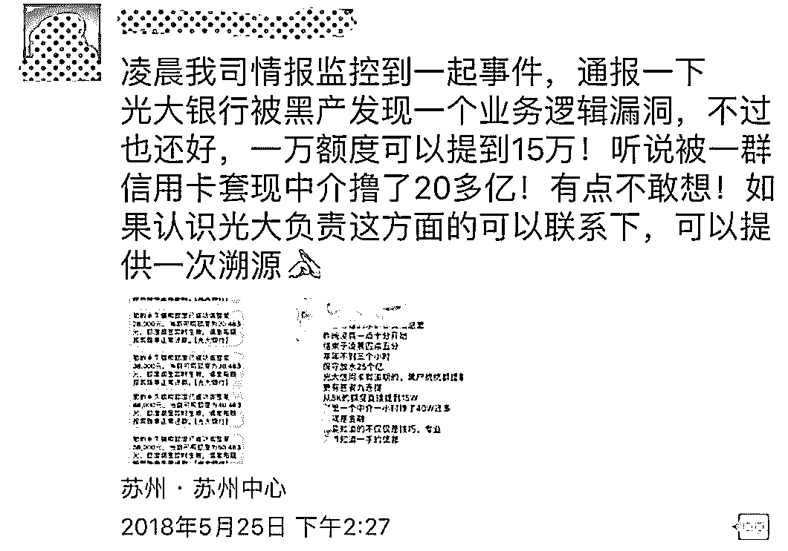

我们从专家那里了解到：

本次事件是因授信额度管理相关业务的逻辑漏洞造成的，因为在本次事件中，已逾期与黑名单用户均可以“绕过”风控系统进行提额，并造成了全量用户可以进行在正常风控系统内无法进行的连续提额操作。

在此事件之前，风控系统会控制用户提额的权限、次数与每次提额的额度，从而将授信额度与银行需要承担的风险均控制在可控范围之内。

而在此次事件中，提额用户范围之广、额度之高都是多年内罕见的。

那么这次损失究竟有多大，真的有 20 亿吗？有消息人士透露，这次损失并没有达到 20 多亿，大约被“撸”了 2000 万。

银行都有自己的风控系统，但这次风控系统“失灵了”，这是为什么？专家告诉小编，风控系统必须要产生事件才能触发规则，滞后性比较强。

因此，我们需要收集威胁情报，它并不是一个事件，而是要从蛛丝马迹中获取攻击者的行为，提早发现未知的恶意活动，达到及时预警或止损目的。

出来借，早晚要还的

有网友表示，自己的额度又变了回去。还有网友怀疑，这是光大银行的“阴谋”，上文已否认了这一观点。

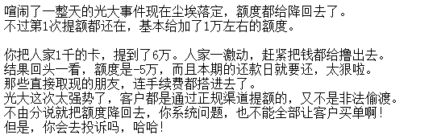

在论坛内，很多人都发表言论称自己“上岸了，再也不借了”，也有人在劝“钱尽量先在手里稳两天”，这是因为光大银行超额状态下（也就是额度为负）通常是不能账单分期的，这对一些羊毛党成员来说影响巨大。

很多直接借现金、进行套现的羊毛党一夜发现自己被打回原形，只有账单和多出来的手续费。

光大信用卡中心称，凌晨那个是正常的额度频率调整，最高额度在规则允许之内。凌晨共提升额度累计 3800 万，不存在网传 25 亿的情况。规则已恢复，风险可控。

**后续调查**

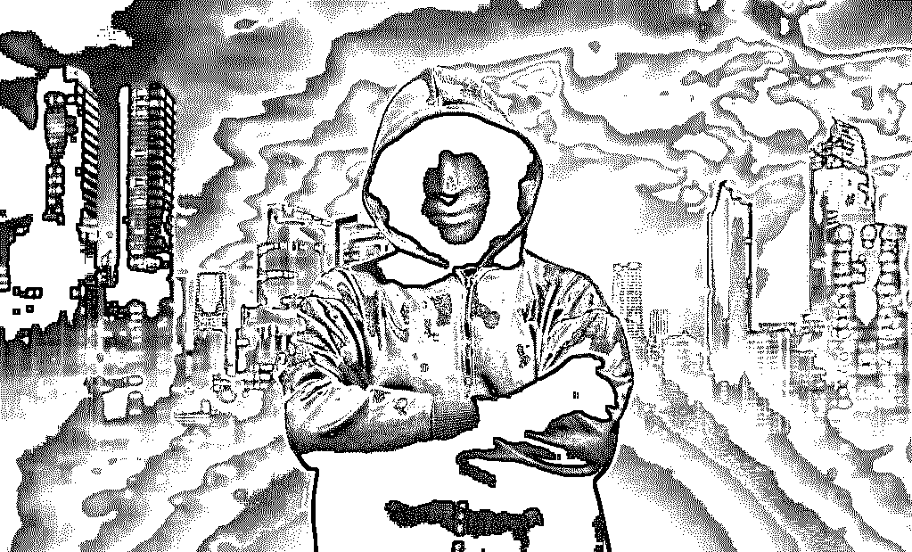

关于此次事件原因，网友观点不一。

有网友推测是银行的漏洞营销，也有网友认为是风控失灵，更有网友怀疑时间发生在深夜是因为有内鬼作祟。

提额成功却没有及时变现的卡友也不要高兴得太早，事发第二天就有很多网友反应大部分通过漏洞提额的卡友的额度被降回至原额度或略高于原有额度。

极小部分卡友卡片被封。

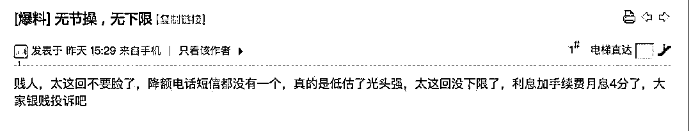

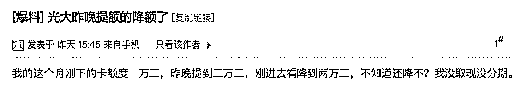

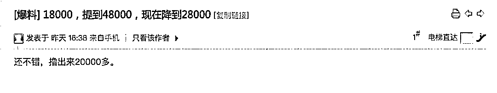

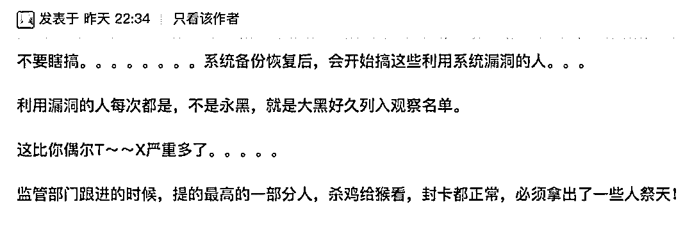

**结尾**

当再有这样的机会摆在我们面前的时候，身边有个 POS 机是多么重要。

原本想薅银行的羊毛，

后来发现还是被银行反撸了。

银行：你大爷永远是你大爷！

信用卡的背后每个人的信用，当你用自己的信用借款不还时，征信和催收早已在背后等着你，你会不还吗？

出来借，早晚要还的。

* * *

**【灰产圈】高端社群小程序开通，2018 最值得加入的社群！**

<mp-miniprogram class="miniprogram_element" data-miniprogram-appid="wx4f706964b979122a" data-miniprogram-path="pages/topics/topics?group_id=881854415822" data-miniprogram-nickname="知识星球" data-miniprogram-avatar="http://mmbiz.qpic.cn/mmbiz_png/kialtkOXGKS7D9hZrmO2jzDqryXXTAlhxSpnrKnHGV65KXzicibOppaPic4dCRxftvabB8Iqswo3OuQEDSxE7NicXBg/0?wx_fmt=png" data-miniprogram-title="【灰产圈】高端社群" data-miniprogram-imageurl="http://mmbiz.qpic.cn/mmbiz_jpg/WWG78hysZ0brJkWoyG2VDIacqgQjkDfp6mLiaoPBJ2SgWZHtRuTw7ia8kpoxntsn7PiaFOQO2U23FW6Iry0gS1GnA/0?wx_fmt=jpeg"></mp-miniprogram>

**点击加入【灰产圈】高端社群**