# 深度揭秘绝地求生吃鸡外挂背后的灰色产业链：隐居深山，三万代理，日入几十万！

> 原文：[`mp.weixin.qq.com/s?__biz=MzIyMDYwMTk0Mw==&mid=2247491449&idx=1&sn=1a999702cb442d38667a0b89f5653ba6&chksm=97c8d441a0bf5d573ed83df4491aabbb8ade48f46c5d11de7860e41ec7a6c44b83a535e55d03&scene=27#wechat_redirect`](http://mp.weixin.qq.com/s?__biz=MzIyMDYwMTk0Mw==&mid=2247491449&idx=1&sn=1a999702cb442d38667a0b89f5653ba6&chksm=97c8d441a0bf5d573ed83df4491aabbb8ade48f46c5d11de7860e41ec7a6c44b83a535e55d03&scene=27#wechat_redirect)

**点击上方蓝色字体“灰产圈”选择关注并置顶本公众号**

<span_wxbeditor></span_wxbeditor>

**导语**

“大吉大利，晚上吃鸡”

多少网游爱好者通宵达旦

只为了能在屏幕上看到这句话

这款火爆全球的游戏就是

——《绝地求生》

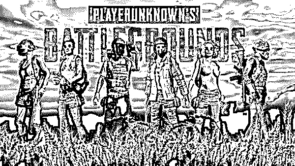

《绝地求生》是由腾讯游戏独家代理运营的一款战术竞技类网络游戏，游戏内容大概就是 100 个人扔到一个小岛上，获胜唯一的方式就是活到最后。

该游戏去年一上线就迅速在直播平台爆红并风靡全球，因其最终胜利者屏幕上会显示"大吉大利，晚上吃鸡"的字样，而被众多玩家戏称为“吃鸡”游戏。

但随着玩家的日益增多，更多的外挂开发者也盯上了这块肥肉，以至于这款游戏中现在外挂横飞，游戏体验有所下降，比如以下这种情况并不鲜见。

刚进去就有人在语音频道大喊："机场卖挂！"

这款游戏火爆的背后，也催生出了一条网络黑色产业链。该产业链集外挂作者、卡盟平台、销售代理、木马捆绑、盗号洗号、冒用他人支付渠道、空间服务商等多个环节。

**特大吃鸡外挂案告破**

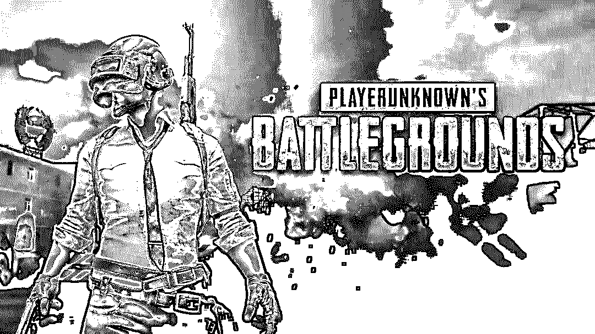

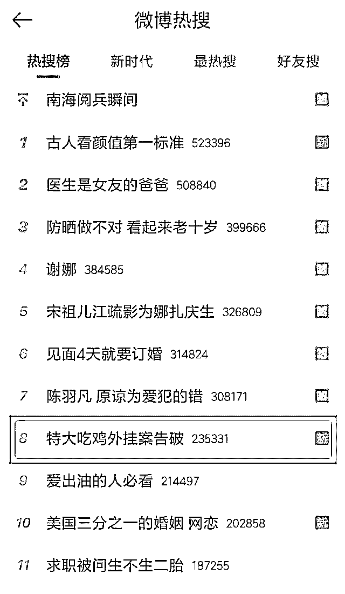

由公安部挂牌督办，一起特大“吃鸡”外挂案件被破获。警方一举捣毁 6 个国内的游戏点卡以及充值产品的在线交易平台，抓获犯罪嫌疑人 15 名，涉案金额高达 3000 多万元，真是大快人心！

**附：央视财经视频报道**

<span_wxbeditor></span_wxbeditor>

[`v.qq.com/iframe/preview.html?vid=b0642hinwkm&width=500&height=375&auto=0`](https://v.qq.com/iframe/preview.html?vid=b0642hinwkm&width=500&height=375&auto=0)

这已经不是警方第一次破获外挂案了，早在半月前，一黄姓男子就因售卖绝地求生外挂被警方抓捕。

黄某是绝地求生外挂的销售负责人，专门负责打理外挂的销售，手下有超过 3 万多外挂代理人。被抓后，他的账户还继续收到源源不断的汇款，每天账户资金流水高达几十万元。

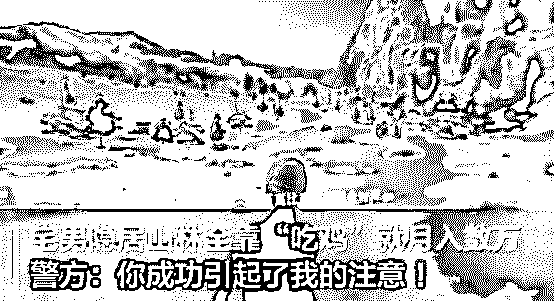

据黄某交代，为了不引人注意，他躲进深山深居简出，家里最值钱的就是他卖挂的电脑。

初次听到这条新闻的时候灰产哥觉得似乎有点扯。

<spanmargin-right: normal="" center="">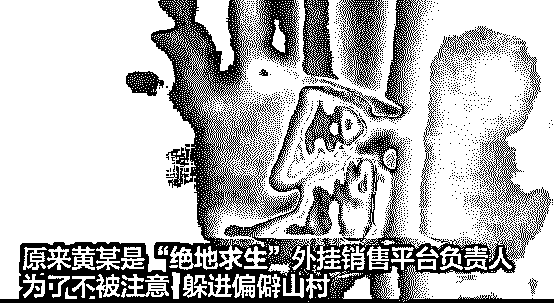</spanmargin-right:>

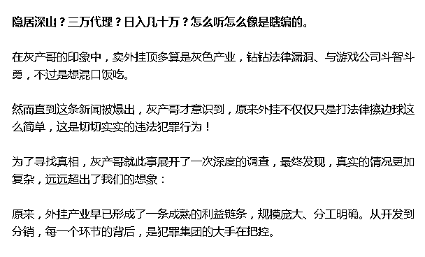

<span_wxbeditor></span_wxbeditor>

**外挂，究竟是何种疯狂的存在？**

<span0.66 data-src="https://mmbiz.qpic.cn/mmbiz_jpg/WWG78hysZ0YibMayibodaWibu7LMEW7ia64qxSlep3GlbENPSvfcF8kA5MoEadN7tYIibzpYPb78uU8LdUlvZWyUQmQ/640?wx_fmt=jpeg" data-type="jpeg" class="" data-w="600" src="../Images/d17153df604974ff1af7e48f13288123.jpg"></span0.66>

前段时间，斗鱼绝地求生主播 XDD 在直播过程中使用外挂，导致游戏账号被封。天才游戏少年沦为外挂使用先锋，XDD 人设崩塌，凉凉之声不绝于耳。

<spanmargin-right: normal="" center="">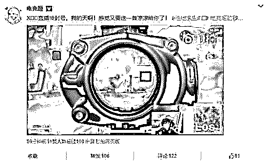
*XDD：不用你送，凉凉我自己会唱*</spanmargin-right:>

而 XDD 也并非是第一个因为使用外挂而被封号的游戏主播，在他之前，原“斗鱼一哥”卢本伟也曾被人实锤爆料使用外挂，前者目前已凉透。

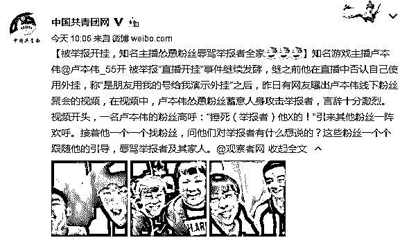
*卢本伟开挂实锤*

<spanline-height: inherit="">网友 KK 是“吃鸡”游戏的忠实玩家，不管是 PC 端的《绝地求生》，还是腾讯、网易推出的手游，他都玩得不亦乐乎。</spanline-height:> 

然而，从 2017 年下半年开始，KK 发现这些游戏的外挂异常猖獗。“从加速到透视、自动瞄准爆头，外挂玩家可以说无所不能。虽然有封号的风险，但是有不少人趋之若鹜。”

**《绝地求生》外挂集锦：**

<spanmargin-right: normal="" center="">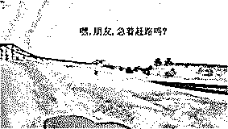
《绝地求生》中的加速挂，跑的比吉普还快</spanmargin-right:>

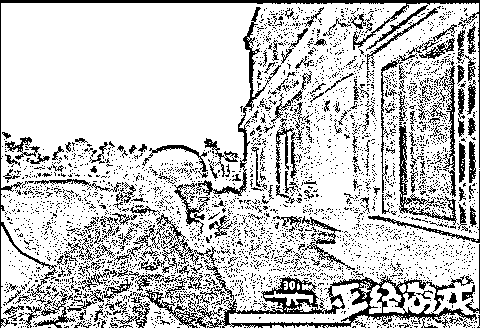
自瞄/锁头

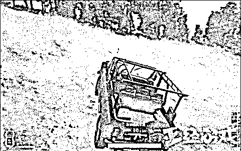
子弹跟随

根据《绝地求生》反作弊系统 BattlEye 的官方数据报告显示：**今年 1 月份封禁使用外挂账号 104 万，涉案金额高达数千万美元，而 2017 年全年封禁账号总数则达到 150 万。**

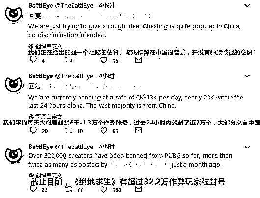
*BattlEye 曾发表的官方推文*

根据《绝地求生》反作弊系统 BattlEye 的官方数据报告显示：

> **今年 1 月份封禁使用外挂账号 104 万，涉案金额高达数千万美元，而 2017 年全年封禁账号总数则达到 150 万。**

BattlEye 曾发表的官方推文

如此规模巨大的游戏外挂，绝不是那种个别开发者开发的作弊小程序，而是一条由成熟、庞大团队运作，规模达到数千亿美金的庞大黑色产业链！

**外挂为何如此让人深恶痛绝？**

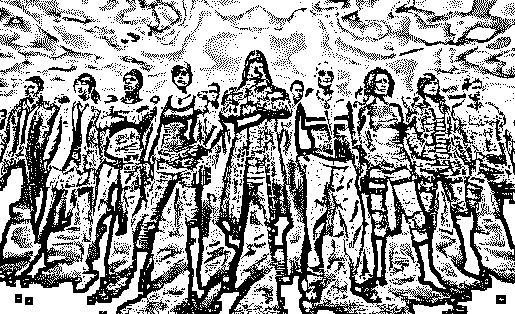

对于广大游戏玩家来说，在游戏中最厌恶的行为，非外挂莫属。

所以才有了那句名言——

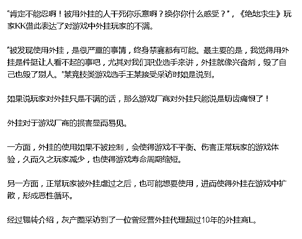

“外挂不像游戏开发，还要考虑怎么让游戏寿命更长久，外挂都是哪个游戏热门就冲进去，价格战。”面对采访，L 如是说。

对于卖了数千万套的《绝地求生》以及背后估值近 14 亿美元的 Bluehole 来说，外挂非但是偷走了其亿元级的收入这么简单，更重要的是对游戏平衡性造成了巨大的破坏，促使游戏生命周期急速降低。

<span0.1913477537437604 data-src="https://mmbiz.qpic.cn/mmbiz_png/WWG78hysZ0YibMayibodaWibu7LMEW7ia64qUrMSA1FBUUu2Q5LmFUxbrOFvBOgIMwH5MbnoM851S0uMubKokbkoYg/640?wx_fmt=png" data-type="png" class="" data-w="601" src="../Images/839dd0d056560f9b09e8e4567131545c.jpg"></span0.1913477537437604>

一般来讲，面对玩家作弊，多数游戏厂商往往会简单粗暴的封号，但是这种方式往往会误封账号，引起玩家的不满。

所以，为了避免这种情况，各种反作弊系统成为游戏厂商用来保护游戏最为直接有效的手段。

国内反外挂首屈一指的当属腾讯的 TP 反外挂系统

<span0.24378109452736318 data-src="https://mmbiz.qpic.cn/mmbiz_png/WWG78hysZ0YibMayibodaWibu7LMEW7ia64qiak7oTVxaQcclVzliacmuP0kBicFN7I1s0wribhUCh1aTb2hqiaDCGvOfzg/640?wx_fmt=png" data-type="png" class="" data-w="603" src="../Images/ab7a93eb803703ec738bb9bf41cfb95b.jpg"></span0.24378109452736318>

<span_wxbeditor></span_wxbeditor>

**外挂为何屡禁不止？**

为何游戏外挂屡禁不止？灰产圈调查发现：制作成本低，获得利益之大，是外挂日渐猖獗的主要原因。

“太他妈暴利了！要不是看在你是我铁哥们介绍来的，我是不想跟人聊这个的。”L 对灰产圈说，语气里带着纠结。

外挂产业规模庞大、收益极高，其中所存在的风险自然也极大。

有这样一句名言——

<span0.15309446254071662 data-src="https://mmbiz.qpic.cn/mmbiz_png/WWG78hysZ0YibMayibodaWibu7LMEW7ia64q7nNiaHiaPt0BIeL3aIVevuse0cS6ytsRJb2cHy9qY71eaco2IJRPrSkA/640?wx_fmt=png" data-type="png" class="" data-w="614" src="../Images/3f8dcfaf10475c39a94802fc1ea6eeb3.jpg"></span0.15309446254071662>

而游戏外挂的暴利，不亚于贩卖毒品。

正所谓人为财死，鸟为食亡。

巨大的利益，正是游戏外挂之所以如此疯狂，如此屡禁不止的原因！

上文新闻中的黄某为免惹人耳目选择隐居深山已经令众位看官万分惊讶，大呼：还有这种操作！

<span0.23076923076923078 data-src="https://mmbiz.qpic.cn/mmbiz_png/WWG78hysZ0YibMayibodaWibu7LMEW7ia64qgam2VIFkicGNSJ7qwjRXRTkibfxfiaNHf7mKP3wsMOK9FbsZrQdib7vicmw/640?wx_fmt=png" data-type="png" class="" data-w="611" src="../Images/13ea32a1faa3a44578683392b43a79e2.jpg"></span0.23076923076923078>

<span_wxbeditor></span_wxbeditor>

**层出不穷，屡禁不止，外挂产业如何运作？**

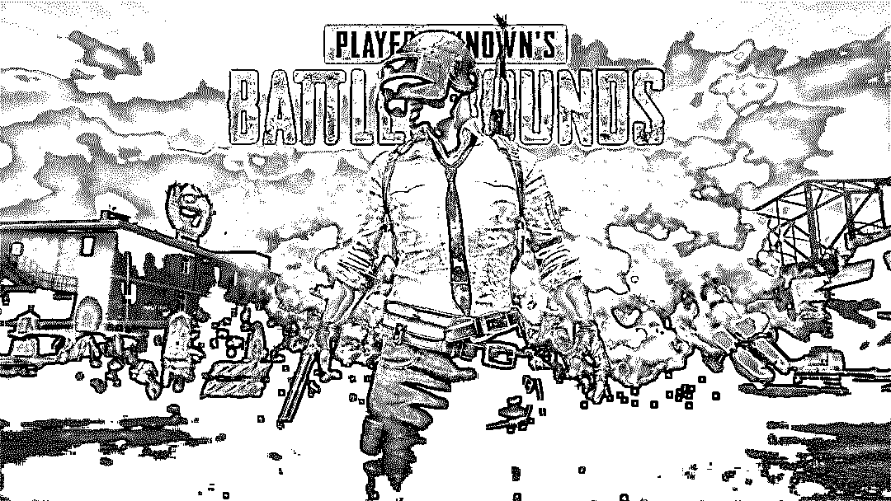  

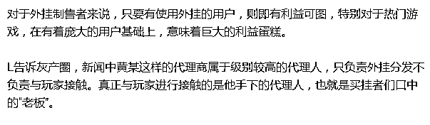

一般来说，“老板”们会用卖挂的 QQ 群号为 ID，在游戏里通过使用外挂使自己的账号达到较高的排名，以此来实现在玩家中的曝光。

此外，也有通过直播平台直播“使用外挂玩游戏”来拉新的，这种方式“更具视觉冲击力！”

然后，玩家通过添加这些 QQ 群成为外围客户，外围客户要消费超过 100 元以上才能进入 VIP 群。

<span0.18181818181818182 data-src="https://mmbiz.qpic.cn/mmbiz_png/WWG78hysZ0YibMayibodaWibu7LMEW7ia64qdpoEPOchcrHSWm4ic5L5kmWsxU7Br4PelQBAzt8Fn1C2GHdT9Ko4gSg/640?wx_fmt=png" data-type="png" class="" data-w="616" src="../Images/d01670af0076edc03eadbcb3df440a7c.jpg"></span0.18181818181818182>

但 L 说，这些只能算是给“贫民”的产品，不但账号容易被封，服务器还经常出问题。“机器狗是卖给穷逼的，天卡差不多 120-170 元一个月，成本价才几十。”

“这些都是玩剩下的，他们这帮游走在外部的代理应该也就能喝喝汤了。

如果你有钱，我们可以帮你去找人定制，8000 块一个月，保证不被封号。

糯米（知名游戏主播）出事儿很大可能就是钱没给够。”

<spantext-align: center="">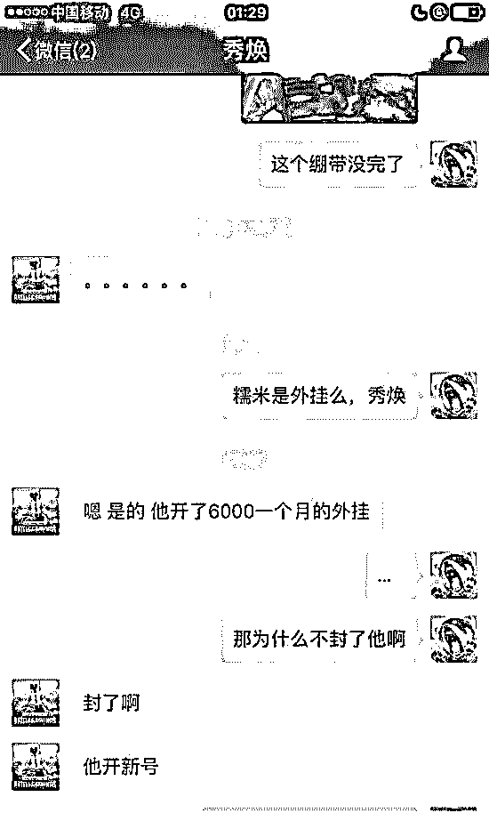</spantext-align:>

**斗鱼主播魔音糯米定制版外挂，6000 一月**

“外挂的价格不能自己定，一般有一个市场价，如果有代理定价过低，被举报到总代那边，那这个产品你就别做了。”

他表示，在早前的《H1Z1》时期，就是因为有部分代理商打价格战，使得整个外挂行业的利润很低，“并不好做”。

但事实上，不同游戏的外挂有不同的销售体系。

**神秘外挂背后的，究竟什么人？**

<spantext-align: center=""><span0.616 data-src="https://mmbiz.qpic.cn/mmbiz_jpg/WWG78hysZ0YibMayibodaWibu7LMEW7ia64qrLvb0S9M5I5suI7PV6HfQyKib5YPepqX2dmgJ2qiaklRcumZBSP73ic2w/640?wx_fmt=jpeg" data-type="jpeg" class="" data-w="500" src="../Images/60ba3ed4b9c2bd66fd6aebbe5d8f4629.jpg"></span0.616></spantext-align:>

以《绝地求生》和《DNF》为例：

DNF 外挂产业链中包含角色：

<spancolor: rgb="">流量商，外挂制作人+木马制作人，箱子商，盗号工作室，商人；</spancolor:>

绝地求生产业链中包含角色：

<spancolor: rgb="">渠道商，外挂制作人。</spancolor:>

DNF 的产业链规模庞大、角色众多，这是由于 DNF 类游戏涉及到了虚拟账号财产盗取，所以其外挂产业链较为复杂：

DNF 外挂各种角色的分工

<spancolor: rgb="">流量商</spancolor:> 

**外**<spancolor: rgb="">挂制作人+木马制作人：负责外挂与木马的制作（还需要做杀毒软件免杀等），他们是外挂与木马的源头，以盗取使用外挂的账号信息为目的（为什么盗取信息，接下来会讲）</spancolor:>

<spancolor: rgb="">箱子商</spancolor:> 

**盗号工作室**商人：进入到游戏中，将工作室提供的虚拟财产（游戏中的药品、道具、装备等）出售给玩家

在早期外挂免费的时代，外挂只能通过与广告主合作获得微薄的流量收益。

这些广告主以页游这类需要快速更替服务器吸收新玩家的产品居多，甚至很多外挂是玩家自己写的简单代码，放在论坛上免费使用。

一般都是外挂制作人写好外挂，然后交付给箱子商；箱子商再联合木马制作人完成外挂与木马的绑定；最后由箱子商出面向流量商购买流量入口。

有了入口，玩家才能下载使用外挂，才有机会被植入木马。

<span0.4355628058727569 data-src="https://mmbiz.qpic.cn/mmbiz_png/WWG78hysZ0YibMayibodaWibu7LMEW7ia64qNmbKJW7jj7oibiaFCUtsicTS7h0RDwJrSqibKKpuhKPhJRUvG6HYHcXjvw/640?wx_fmt=png" data-type="png" class="" data-w="613" src="../Images/77bb66c9d7c5238b4687ac06cf29feff.jpg"></span0.4355628058727569>

**相比 DNF，《绝地求生》的外挂产业链较为简单**

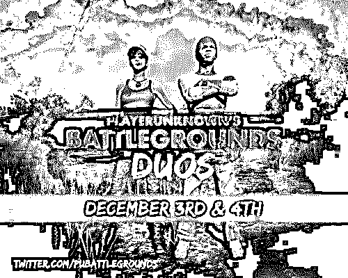

绝地求生外挂各种角色的分工

<spancolor: rgb="">**渠道商** <spancolor: rgb=""></spancolor:></spancolor:> 

**外挂制作人**  

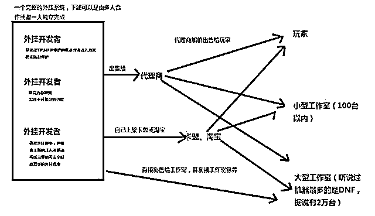

**外挂流通概览图**

上图是一个外挂从产生到流通到用户手中的全过程，《绝地求生》的外挂采用的就是这种流通模式。

**外挂开发者，优秀程序员还是菜鸟码农？**

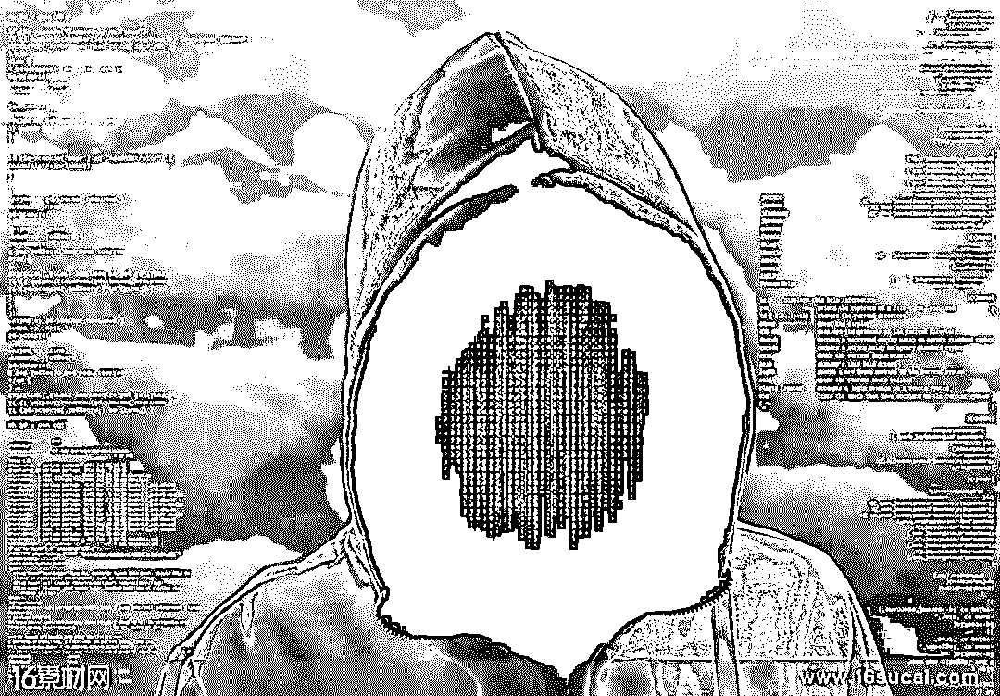

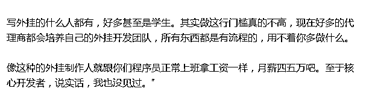

在这个产业中有很多作者，制作一款外挂作者其实拿不到很多钱，大部分钱被渠道商收割。

之前沸沸扬扬的糯米事件，使用的就是顺丰主播版，售价 6000 每月，渠道商提卡 2000 每月，流到作者手中的不过 800 左右。

但这仅仅只是一款外挂单人单月的收入，据说主播定制版每月销量约为 200 多份。

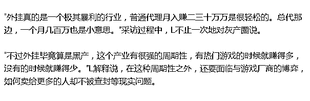

<span_wxbeditor></span_wxbeditor>

尾声

**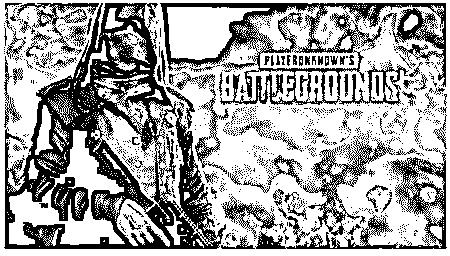**

在具有中国特色的游戏发展史上，外挂与游戏的博弈从未停止过

为了规避打击，外挂商每次都是挑周末上线新版本，而且专挑下班的时间上线。

<span0.24058919803600654 data-src="https://mmbiz.qpic.cn/mmbiz_png/WWG78hysZ0YibMayibodaWibu7LMEW7ia64qo1c7aTvsuy3aWPy2mhlzX1lc8v84iba3HcrV4b7iaeS5gxoDaicLzDHMg/640?wx_fmt=png" data-type="png" class="" data-w="611" src="../Images/92b850000723c86d0d830e1b18e23d7e.jpg"></span0.24058919803600654>

**延伸阅读：**

**[深度|日流水超 500 万游戏代练的盈利模式：游离于陪练和外挂之外的灰色产业全揭秘！](http://mp.weixin.qq.com/s?__biz=MzIyMDYwMTk0Mw==&mid=2247490278&idx=1&sn=99dc17a3afe8cdf7d29ece8fe0ee672d&chksm=97c8d1dea0bf58c88103472e9e96ead17ca987808d38ef045ee12af3c541f4d57bbec0102ca9&scene=21#wechat_redirect)** 

**[深度|游戏世界里的“外挂江湖”：道高一尺，魔高一丈！论黑客和白帽之间的博弈之战！](http://mp.weixin.qq.com/s?__biz=MzIyMDYwMTk0Mw==&mid=2247490080&idx=1&sn=1b34ff33182cef572cd50758e15de1d9&chksm=97c8d118a0bf580e3cbe9061d802a3949740de23df666d4df8c3b8226f4736791ca9679f110a&scene=21#wechat_redirect)** 

[**深度|“绝地求生”外挂江湖：黑暗中崛起的灰色产业，年产值上亿美金！**](http://mp.weixin.qq.com/s?__biz=MzIyMDYwMTk0Mw==&mid=2247489918&idx=1&sn=0a28eda8279e7c194d5e2f6bcda6556c&chksm=97c8d246a0bf5b507141f146431442410f38c62e34b5b8aa7c895d3b2bd6ced0e08ab84933ca&scene=21#wechat_redirect)

* * *

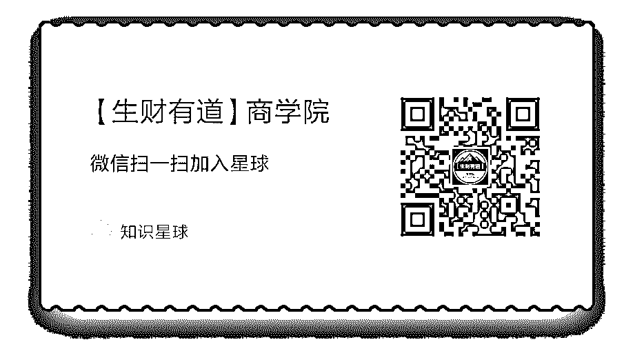

* * *

**点击加入【灰产圈】高端社群**