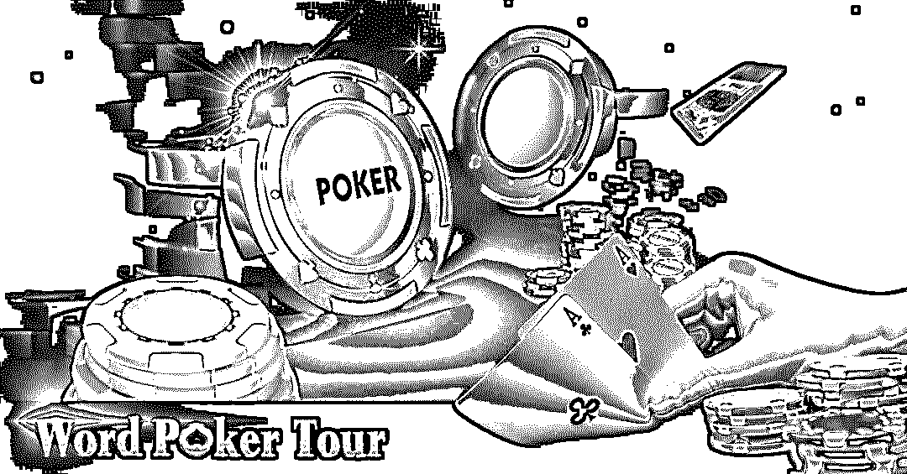
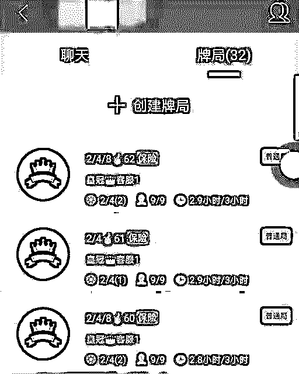
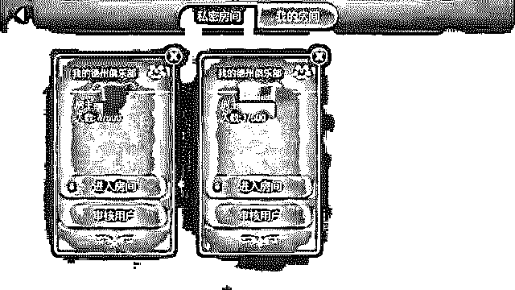
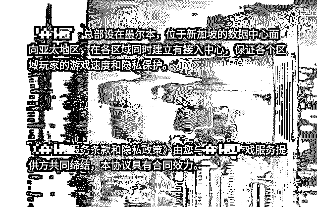
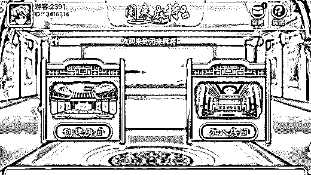
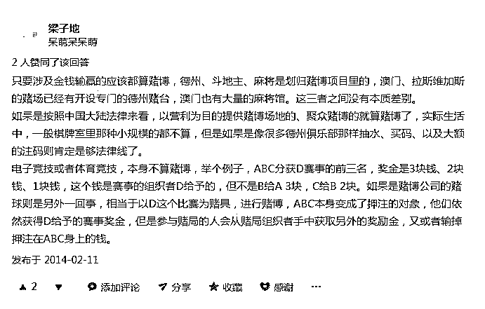
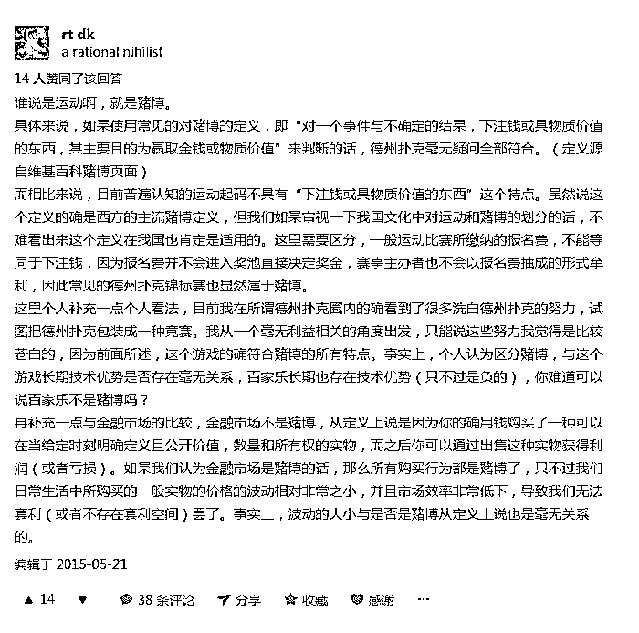
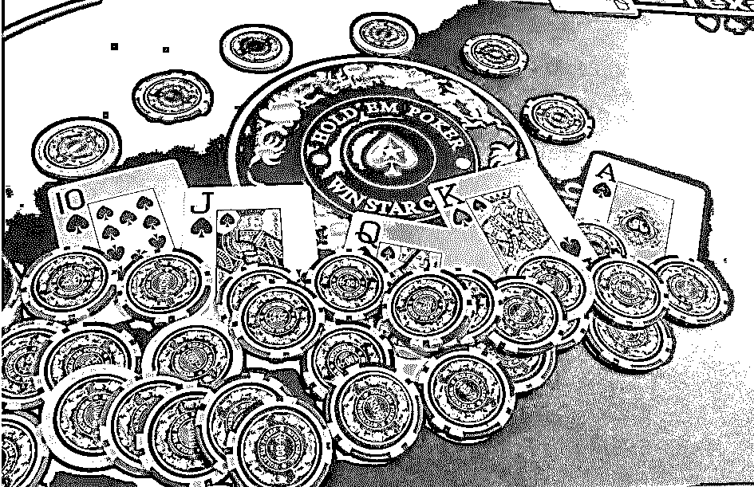
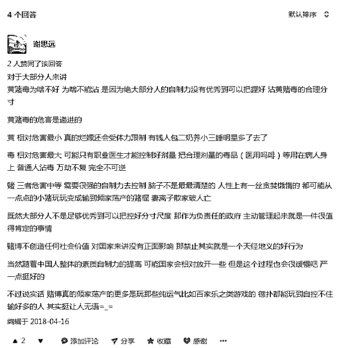

# 6000 万中国“赌神”在线：揭开德州扑克的灰色地带

> 原文：[`mp.weixin.qq.com/s?__biz=MzIyMDYwMTk0Mw==&mid=2247491165&idx=1&sn=4f20edc2301ebfc85b85cef5e9062964&chksm=97c8d565a0bf5c732ff0b9693d770566294e4047e6fd8ca8ecbe2d433257d2d5b1a63c3205f0&scene=27#wechat_redirect`](http://mp.weixin.qq.com/s?__biz=MzIyMDYwMTk0Mw==&mid=2247491165&idx=1&sn=4f20edc2301ebfc85b85cef5e9062964&chksm=97c8d565a0bf5c732ff0b9693d770566294e4047e6fd8ca8ecbe2d433257d2d5b1a63c3205f0&scene=27#wechat_redirect)

**点击上方蓝色字体“灰产圈”选择关注并置顶本公众号**

> **导语：**

中国的网络游戏市场规模全球最大，网络游戏玩家超过 5 亿人。提起德州扑克，人们并不陌生。在各种线上棋牌类游戏中，德州扑克普及范围广，参与者阶层跨度大。从普通用户到互联网创投圈的大佬都为之着迷，可见德州扑克的魅力之大。不过，这个“精英圈潮流”游戏即将遭遇阻碍。

相关消息称，文化部与旅游部市场司对即将出台的“棋牌类网络游戏管理”政策做出重要提示，要求相关平台停止德州类游戏的下载，并于 6 月 1 日前全面终止对德州类游戏的运行，文化部也不再受理德州类游戏的备案及变更。

这一政策的背后，折射出的是德州扑克行业的漏洞。尽管德州扑克受到许多人的青睐，行业发展也十分有前景。但由此带来的灰色产业链、涉赌等一系列问题是不能被忽视的。

**1**

**一、德州扑克受大佬青睐，成为“精英游戏”**

德州扑克诞生于 20 世纪初的德克萨斯洛布斯镇，据说一开始是当地人为消磨时光发明的。1925 年，德州扑克传入德克萨斯州的达拉斯市，后又传至“赌城”拉斯维加斯，从此被发扬光大。德扑何时传入中国已不可考，但与多数棋牌类游戏扎根中下阶层，参与者数量自下而上递减不同的是，德扑从开始就进入了中国的精英圈层，并自上而下逐渐传开。

在互联网圈与投资圈，德扑受到了广泛的追捧。

李开复酷爱德州扑克，曾在网上回答“德州扑克有哪些技巧、经验或者原则”的问题，并且颇有见地。通常情况下，只要李开复上了牌桌，都能保持前三名的好成绩。“商业教父”柳传志也是德扑爱好者，圈内也流传着他和马云关于德扑的趣闻。

据传饿了么创始人张旭豪甚至用德扑招聘员工。通过玩牌，能够了解应聘者的思维、策略与牌品。据说张旭豪的牌风是彪悍冒险类型，不会轻易弃牌，抓住机会就要狠狠赚一笔。而 360 董事长周鸿祎在港股上市的博雅互动被称为是“中国版德州扑克”，该公司以德州扑克为主业，周鸿祎在博雅互动上市后套现 2000 万元退出。

通过以上事例可以看到，德扑和创投与商业往往是紧密相联的。其实这与德扑本身的特性是分不开的，这项规则简单又容易上手的游戏，实际上考验的是玩家博弈、计算、心态等全方位的综合能力。

例如，在游戏过程中，玩家要尽可能减少出手次数，以降低失误比率。玩家可以没有最精湛的牌技，但需要找到更差的对手。不能只看自己的牌，也要用心揣摩对手的牌。不能总是虚张声势，但也不能总是毫无保留。对虚实的运用要合理，这甚至有些符合中国道家的思想。

所以说，德州扑克的很多玩法技巧，与商业、投资、生意策略等都是极为相似的，这也是它受到越来越多互联网界和创投界人士欢迎的重要原因。

**2**

**二. 德州扑克乘互联网之风跃居游戏榜首**

近年来，德扑仅限精英层的局面被打破，最大的转变来自于互联网。过去几年间，中国的德扑玩家数量迅速增长，已经超过 6000 万人。对于日益增多的玩家而言，线下德扑风险大，约局赴局的过程需要付出一定的时间和金钱成本，这对于生活节奏极快的现代人而言并不容易办到，所以线上德扑逐渐成为新潮流。

随着腾讯、联众、博雅等公司加入了线上德扑行业，各种德扑应用与平台兴起，让更多的人可以随时开局。这些公司推出德扑平台之后，从其他的游戏与社交平台中导入了大量用户，推动了线上德扑的普及。

德扑的普及推动了这一行业的发展，也带来了可观的利润。2014 年 2 月，腾讯《天天德州》游戏在微信游戏中心上线，其原有的 QQ 与微信入口为其带去巨大流量，仅仅 2 天，该游戏就从 iOS 畅销榜百名之外的位置跃升至前十。

2017 年上半年，德扑游戏为联众贡献了 8464 万的营业额，占比超出 40%。博雅的德扑平台去年上半年总营收达到了 2.77 亿元，占其总营收额的 65%。根据联众的统计数据显示，中国近年的德州扑克用户规模每年增幅超过 50%。在全球范围内，中国和南美的德州扑克用户数增长速度最快。

照此看来，德扑前景十分可期。但德扑在中国风生水起的同时，其自身带有的一些中立甚至是容易造成风险的特性却被利用，致使德扑偏向“涉赌”的灰色地带，甚至形成了灰色利益链。

**2**

**二、德扑被央视曝光涉赌，灰色产业链浮出水面**

2016 年，《天天德州》被曝存在涉赌行为，17 名游戏玩家输掉高达 2 亿左右的金额。去年，原人人网负责人许朝军因聚众利用德州扑克赌博，涉案金额高达 300 余万被批逮捕。

2018 年 4 月 15 日 ，央视记者经过两个多月的持续追踪调查发现，在多个网络游戏平台里，一些看上去只是为了娱乐的游戏，却暗藏着一个个看不见赌徒的赌局，赌博参与者利用网络游戏的外衣，在游戏中豪赌。

**附：央视在新浪科技发文**

**附：央视记者调查德州扑克赌博黑幕视频**

[`v.qq.com/iframe/preview.html?vid=e06300i49sz&width=500&height=375&auto=0`](https://v.qq.com/iframe/preview.html?vid=e06300i49sz&width=500&height=375&auto=0)

其实，德扑本身就有押注、筹码等概念，流程也和赌博有许多类似的地方。在线上德扑平台中，玩家需要花钱买币才能玩。无论是玩法本身还是大奖赛模式，都包含了一定的涉赌成分，这也是部分玩家热衷于德扑的重要原因。

在不少线上德扑游戏的说明中，都包含“赌博与竞赛”、“偶尔/轻微的色情内容或裸露”、“频繁/强烈的烟酒或毒品使用”等提示字样。在这类平台中，赌博参与者往往“挂羊头卖狗肉”，以游戏之名行豪赌之实。

根据央视记者调查发现，部分德扑游戏中玩家可以公然赌博，且数额巨大。一些德扑 APP 中藏着一些俱乐部。如果玩家想参与赌博，先要成为俱乐部的“会员”，利用微信或支付宝将钱转给俱乐部的“管理员”，之后就可以在俱乐部开设的房间中与其他会员进行赌博了。

在这种平台中，俱乐部会给玩家换筹码。在游戏的每个阶段，玩家都需投入筹码下注。结束之后，再找俱乐部将筹码换成钱，而俱乐部则会向玩家收取“服务费”。

这种流程实质上与线下赌博并无区别，只是借着游戏的“外衣”才可以打“擦边球”。除了赌博之外，德扑手游中也不乏实际上是传销与诈骗的“理财游戏”。这种理财游戏较为复杂，但收益也高，玩家可以在游戏中获取收益和奖励，还能够将游戏中的虚拟货币变现。

可以看到，线上德扑平台中所蕴含的灰色利益具有一定的流程，甚至已经形成了一条产业链，这也是导致其遭遇下架命运的主要原因。

**3**

**3\. 金币模式：暧昧的“平台-币商”关系**

上图是灰产圈通过应用市场搜到的德州扑克 APP ，这些 APP 跟央视记者调查的德州扑克大同小异，下载 APP 后 进入游戏界面 里面的金币是可以用钱充值的，但是赢了的金币不能兑换任何实物产品或者是钱，这是为什么呢？

为了避免涉赌，德州扑克类的 APP 对游戏币不提供任何官方回购、兑换，并对用户的支付设置了最高限额。

因为我国法律为棋牌类游戏设定的三条红线是：

> **1、禁止游戏代币反向兑换成人民币；**
> 
> **2、禁止运营者抽水；**
> 
> **3、禁止下注额度和次数无封顶。**
> 
> **另外，还有一条规定：交易金额 500 元以上涉嫌网络赌博。**

但从玩家实际操作的层面来讲，线上德扑牌局比真实牌桌快得多，一些等级的场次和玩法（如天天德州的 2000 万必下场），一局输赢就多达数十亿游戏币，一把回到解放前是常事，加上官方还会根据不同场次，抽走玩家一定数量的游戏币，官方充值限额远远低于玩家下注的需求。

**这时，币商出现了。**

币商并非新鲜事物，他们长期藏匿在各类游戏玩家周围，按照一定汇率，提供游戏币的双向兑换服务，从中赚取差价。在《XX 德州》中，币商将游戏币通过游戏故意输给玩家进行交易。可以说，币商的存在使得虚拟币产生了价值，也就使得线上扑克游戏变成了移动赌场。

只要有需求，市场就永远存在。游戏行内人都知道，币商的存在实际上提高了游戏的活跃度，因此平台与币商并非一直站在对立面，有时币商是一款游戏能够生存下去必备的角色。于是，一些体量较小的游戏运营者，与币商关系暧昧，更有甚者，同时扮演游戏运营者和币商两个角色。

最有名的案例就是“熊猫烧香”制作者李俊，在“熊猫烧香”案被抓出狱后，李俊做了一个棋牌游戏平台，他主动发展币商向玩家提供虚拟币兑换成人民币的服务，自己也从中渔利，结果成功回到监狱。

可见，传统棋牌类游戏在如上描述的“金币”模式下，围绕游戏币产生的资金流动使其处于“开设赌场罪”的高危地带，游戏平台、玩家和币商三方参与者都可谓是“富贵险中求”。

并且，在之后他们将会意识到，冒这种险赚到的钱，真的不算“特别多”。

**4**

**4.德扑开启房卡约局模式：让人人都当上赌神**

就在德州扑克 APP 大力打击币商的同时，就着玩家们的赌神梦，一种可称作是“颠覆式创新”的棋牌类手游新模式在德扑垂直平台上诞生，它颠覆的点在于——完全不使用容易惹出乱子的虚拟游戏币赚钱，它的盈利方式不仅简单，还能使游戏平台完美避开所有法律风险。

这就是房卡约局模式，采用这种模式的游戏平台从金币模式的 to C 转型为 to B，将主要产品——“房卡”卖给代理商和局头，玩家须从代理和局头手中购买房卡，通过第三方支付渠道付款后，才能进入在局头建立的微信群中进行组局或者熟人约局，接着开始游戏。游戏结束后，玩家在微信群中按此前彼此约定好的规则结算，组局局头还将从赢家手中抽水。

**线上德扑 app 界面**

这样一来，平台从之前的“网上棋牌室”变成了“快捷酒店”——只负责将房子租出去。你或许要问了，这是否涉嫌触犯“开设赌场”罪？

答案是，并不哦。

我国法律规定，利用互联网、移动通讯终端等传输赌博视频、数据，组织赌博活动，以下五种情形构成开设赌场：

> **（一）建立赌博网站并接受投注的；**
> 
> **（二）建立赌博网站并提供给他人组织赌博的；**
> 
> **（三）为赌博网站担任代理并接受投注的；**
> 
> **（四）参与赌博网站利润分成的。**
> 
> **（五）明知是赌博网站，而为赌博网站提供资金支付结算、互联网接入、服务器托管、网络存储空间、通讯传输通道、投放广告、发展会员、软件开发、技术支持等服务或者帮助，收取服务费达到一定数额的。**

房卡模式下，平台方只是提供了用于娱乐的房间，收房费，未从游戏中抽点，房间具体的游戏行为、玩家如何约定、是否有资金结算，平台都“无从知晓”。

更保险的是，这些平台一般会将总部放在国外。

如此一来，刑事风险被完全转移到了平台和玩家之间的代理和局头身上。代理商们形成微商式的层级，从职业代理到看门大爷，都可能是局头，售卖手中几块钱一张的房卡是他们触达更多用户和“发展下线”的道具，他们可以组成俱乐部，定期组局，房卡有时由所有的玩家分摊（分摊后每局房卡消费也就是几毛钱），有时则由赢家负担。他们收入的大头是每次对局盈利中的抽水。

一个局头往往能够覆盖上百人，人再拉熟人，上百局游戏同时开局，每局抽水的场面比线下赌场热闹的不知道哪里去。

巨大的利益、熟人间的信任基础，都使得代理商们愿意铤而走险。

于玩家而言，房卡约局类 App 的出现，不仅能实现快速游戏，也能大大降低熟人约局的成本。相较于自由匹配，约局更接近德州本身所具备的社交属性。

一位在此类 App 上长期游戏玩家向灰产圈介绍说，他通过熟人介绍，加入了一个俱乐部，俱乐部会定期约定时间组织游戏，另一位在同一平台上的玩家表示，他们俱乐部活跃度很高，“每晚都有很多局，还有自己组织的比赛。”

在这个平台上，玩家和俱乐部从平台上购买金币和钻石，金币用以获得上桌资格和查基础数据（查高阶数据得购买 VIP），俱乐部组织者也需要每月购买钻石保证或扩充俱乐部规模。

至于玩家之间的筹码兑换和俱乐部抽水情况，这位玩家表示：“这都是俱乐部的隐私，不方便透露。”他表示，自己只和几个相熟的人玩，输赢和线下差不多，但是有几位朋友，“往里面扔的比较多，小几十万应该有了。”

**5**

**5.闲来模式席卷：微商推广实现病毒圈地、暴利营收**

重新分配了利益蛋糕的房卡约局类 App 由德扑圈而起，成为了线上现金局的主流模式。

随后这种被迅速复制到规则复杂的地方性麻将和扑克游戏中，竟一举成为了地方棋牌的“天命”——平台只要从外包公司花 30-50 万购买一套简单的棋牌代码就能开门做生意，房间内多种玩法供选择，具体由玩家自己约定，而不用像从前一样每种玩法开发一款产品。

于是几乎没有技术门槛的条件下，各平台开始比拼地方推广资源，他们争抢人口聚集的三四线城市、县镇的地推和局头，以微商的分级销售代理体系实现病毒式圈地。此后，它以不可想象的速度，覆盖了几乎整个棋牌类手游市场，让三四线城镇有闲的人们从棋牌室下桌，转而做起了线上雀神的梦。

在众多的地方棋牌手游运营者中，将这个套路玩到极致的，是闲徕互娱旗下“闲来麻将”、“闲来跑得快”、“熊猫四川麻将”等 30 余款“闲来”系列游戏，以至于后来有人直接将这个模式称作“闲来模式”。

**闲来系列游戏界面，只有创建房间和加入房间两个入口**

2016 年底，这家本来闷声赚大钱的公司因为 A 股上市游戏公司昆仑万维的一纸收购公告引起了公众的注意。

很快，大家发现，这家被昆仑万维估值 20 亿的公司虽成立不到一年，几个月的财务数据却很有故事的样子——根据闲徕披露的财报，闲徕互娱在 2016 年的 7 月到 11 月间赚了 3 亿元，平均日收入超 300 多万元！

而已知在微信公众号售卖的房卡是闲徕唯一的收入来源，已知 8 局游戏才消耗一张房卡，一张房卡仅售 3 块，各位可以算算每天的开局数了。

海量局数养肥了从每次对局中抽点（“茶水费”）的局头，房卡产品甚至成为了微商们放上台面研究的课题。更别忘了放贷者，他们是整个链条上的黄雀。

闲徕瞄准了湖南、四川、贵州、广西等棋牌玩法丰富的地区，并依靠地推成功打开了这些地区的农村市场，从而获得了高 DAU、高付费率。

这些数据，是瞄准一线城市玩家、以金币模式或流量盈利的大平台从前无法想象的。于是，几乎就在闲徕暴利模式见光的同时，大小游戏平台都开始开发推广约局功能，就连腾讯的欢乐麻将也开启长达数月的免费优惠，天天德州上线“好友房：功能，并将“好友房”放在了 App icon 的左上角做强调。

**现在的《天天德州》游戏界面**

正是这套透露着智慧、天衣无缝的运作系统，使得闲来游戏公司在接受调查的时候，可以淡定地答复道：

闲徕互娱的主要产品和线下运营合法合规，没有虚拟货币与流通货币的交易设置，不具有赌博属性，每月销售房卡数和消耗房卡数基本持平，不存在传销属性；

也使得闲来系列在遭 App Store 下架后，可以淡定地马上恢复上架；

还使得“赌神未满”的玩家在评论区里充满血泪的呼吁，淹没在推广代理的广告中。

线上牌桌的美女荷官笑靥如花，对面坐着的“赌神”们壮志未酬。

**6**

**6.德州扑克算赌博吗？**

**如果德州是赌博，那么斗地主，麻将算么？电子竞技体育竞技呢？他们的差距在哪里？假如他们都是赢钱的。**

**引用知乎网友的回答：**

**@梁子地**

****

@ rt dk

**7**

**7.如何评价「央视调查德州扑克 App:近万人参赌 俱乐部月入数百万」？**

**引用知乎网友的回答：**

**@谢思远**

另外曝光内幕一条：

知乎网友@林琳 对于德州扑克 讲出了如下的黑幕 ，请看下图

> **结尾：**

其实，德州扑克本身是一种十分优质的能够锻炼智慧与策略的游戏，甚至可以说是一种文化的载体。但其本身具备的博弈性，使德扑产业在发展中命运多舛。不仅是德扑，任何一种棋牌游戏都可能被利用沦为赌博的工具。

**还是那句话：**

**小赌怡情，**

**大赌伤身 ，**

**十赌九输，**

**不赌为赢！**

* * *

**延伸阅读：**

**[围观灰色产业：6000 万中国“赌神”的金矿 ！](http://mp.weixin.qq.com/s?__biz=MzIyMDYwMTk0Mw==&mid=2247488934&idx=1&sn=f8af571216e0619e3b9cbcf008d258b8&chksm=97c8de9ea0bf5788ba953dfdbd615b4b554b665e23daa059d3aa60c260aa4e46f1c9f7d2fc3e&scene=21#wechat_redirect)** 

**[深度|揭开层层迷雾,带你走进网络博彩的暗黑世界:500 万赌徒，年输上千亿！](http://mp.weixin.qq.com/s?__biz=MzIyMDYwMTk0Mw==&mid=2247489469&idx=1&sn=068689f941b55b11473a6595f2da08f1&chksm=97c8dc85a0bf5593f4f24fb20775b6448d2bd8a21cc0bc78b95a2fbf64a0e64eebe00449ed68&scene=21#wechat_redirect)** 

[**深度| 揭秘赌场高深莫测的黑科技：数据采集 ，人工智能，人脸识别，风水秘术，套路无穷！黑暗无边！**](http://mp.weixin.qq.com/s?__biz=MzIyMDYwMTk0Mw==&mid=2247489533&idx=1&sn=89059bccd4390aace68327724cba106e&chksm=97c8dcc5a0bf55d375c953c999ac315380cfc45995959b44e1bb336810107c274b89cbf1b5f2&scene=21#wechat_redirect)

* * *

**【灰产圈】高端社群小程序开通，2018 最值得加入的社群！** 

<mp-miniprogram class="miniprogram_element" data-miniprogram-appid="wx4f706964b979122a" data-miniprogram-path="pages/topics/topics?group_id=881854415822" data-miniprogram-nickname="知识星球" data-miniprogram-avatar="http://mmbiz.qpic.cn/mmbiz_png/kialtkOXGKS7D9hZrmO2jzDqryXXTAlhxSpnrKnHGV65KXzicibOppaPic4dCRxftvabB8Iqswo3OuQEDSxE7NicXBg/0?wx_fmt=png" data-miniprogram-title="【灰产圈】高端社群" data-miniprogram-imageurl="http://mmbiz.qpic.cn/mmbiz_jpg/WWG78hysZ0brJkWoyG2VDIacqgQjkDfp6mLiaoPBJ2SgWZHtRuTw7ia8kpoxntsn7PiaFOQO2U23FW6Iry0gS1GnA/0?wx_fmt=jpeg"></mp-miniprogram>

**点击加入【灰产圈】高端社群**