# 区块链乱象：709 个以太币能买下“日本”！

> 原文：[`mp.weixin.qq.com/s?__biz=MzIyMDYwMTk0Mw==&mid=2247491060&idx=1&sn=4bf5820b09749ccf468eef9383b02357&chksm=97c8d6cca0bf5fdad1a318363818805776c59693d72f96568ab27c9c8393088cf192409c23e8&scene=27#wechat_redirect`](http://mp.weixin.qq.com/s?__biz=MzIyMDYwMTk0Mw==&mid=2247491060&idx=1&sn=4bf5820b09749ccf468eef9383b02357&chksm=97c8d6cca0bf5fdad1a318363818805776c59693d72f96568ab27c9c8393088cf192409c23e8&scene=27#wechat_redirect)

**点击上方蓝色字体“灰产圈”选择关注并置顶本公众号**

导语

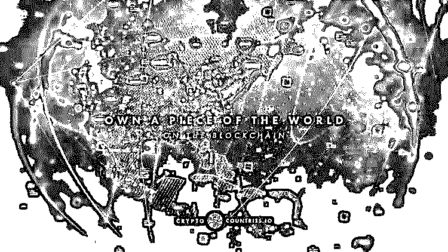

近日，一款名为 Crypto Countries（加密国家）的游戏迅速走红。在“拥有世界”（Own The World）、“世界统治”（World Domination）、“开始征服世界”（Start conquering the world）等一系列极具鼓动性的标语包装下，Crypto Countries 向参与玩家鼓吹可以实现做一名国家统治者的快感，并藉此吸引投机者。

看了开头的回答可能很多人会以为我要聊的是 ICO 收割韭菜的黑产，其实我写的是隐藏的更深的，几乎在中文媒体中没有曝光过的旁氏骗局黑产。

灰产哥关注了一段时间以太坊，一度认为以太坊代表的“区块链 2.0”技术，是可以颠覆性运用到社会的各个方面的，真正可以改造世界的伟大产品。可是在经历了一段时间的详细调研后，灰产哥惊讶的发现，现在以太坊真正颠覆掉了的是庞氏骗局。

基于以太坊网络搭建的各种所谓“游戏”，是一个又一个匿名化无法监管的类庞氏骗局平台！

1

**一、什么是以太坊**

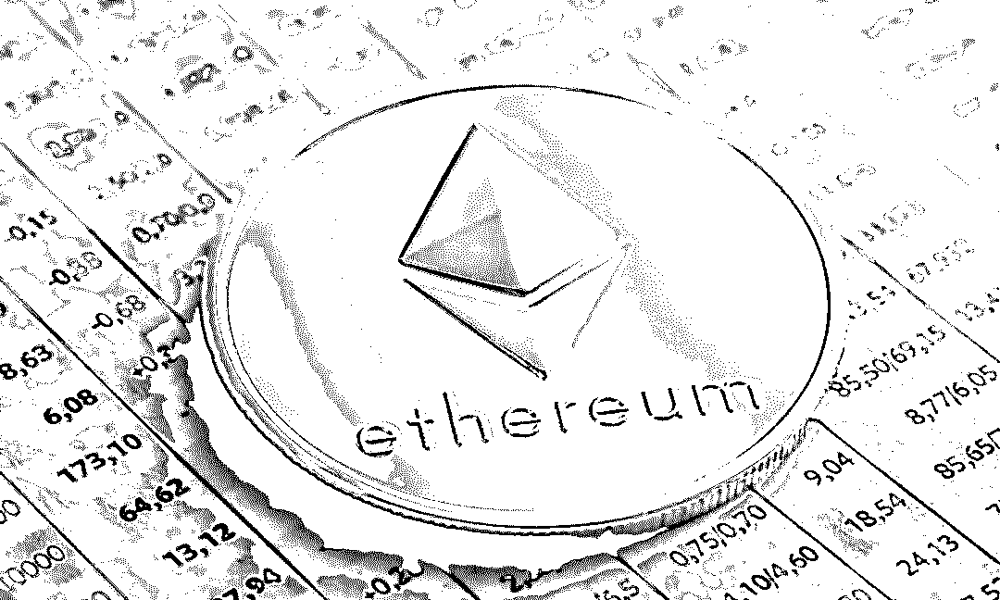

比特币大家都清楚，一种基于区块链技术的加密数字货币。具有去中心化、匿名交易等特点。

而以太坊最被大众所熟知的是它的代币“**以太坊币（ETH）**”，目前以太坊币单价和市值都是全球所有加密货币中，仅次于比特币的存在。

但其实以太坊实际最大的贡献在于，其设计思路在中本聪原本的“区块链”技术上更进一步，将区块链从仅仅只能作为加密货币流通的存在，制作成了拥有图灵完备功能的“区块链计算机”。

而这个“区块链计算机”，就是**以太坊**，而以太币只是以太坊其中的一部分。

目前全球的链圈公认的是，基于以太坊，可以开发出各种各样的区块链应用，可以认为，这是一个可以改造世界的新型的超级计算机，拥有匿名性，去中心话等常规开发平台没有的特点。

2

**二、从一篇游戏报道说起**

在 2 月 12 日，灰产哥看到了这么一篇报道：

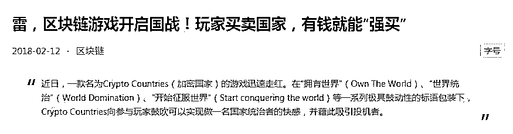

大意是，在以太坊社区内上线了一款“**游戏**”，在这款“游戏”内可以使用以太币买卖“国家”，做一把当国家统治者的瘾，可以说，是妥妥的地图开疆了。

**那么这款“游戏”怎么玩呢？**

很简单，开发者把一个“国家”，类似于澳大利亚，放到游戏内的地图来卖，有玩家买走了之后，因为写入以太坊的智能合约的关系，所有的国家都是可以被其他玩家强买走的。

首先所有未锁定的虚拟国家，包括玩家所持有的默认都是可交易状态。

玩家只需付出上个买主最多双倍的价钱，即可从其他玩家手中购得心仪的国家

这个交易过程虚拟国家持有者意愿不起作用，Crypto Countries 给这种“强买”的交易模式取了个刺激肾上腺素的名字：**征服**。

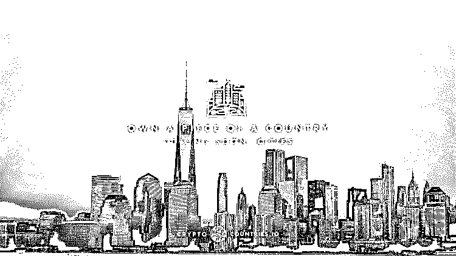

当一名玩家从另一名玩家手中，把一个国家“**征服**”了过来，Crypto Countries 世界地图中该国家版图的颜色便会变色。

具体颜色是拥有者数字钱包地址的后六位所组成的 HEX 颜色代码，诸如 FFC0CB（粉色）、FFD700（金色）等等。

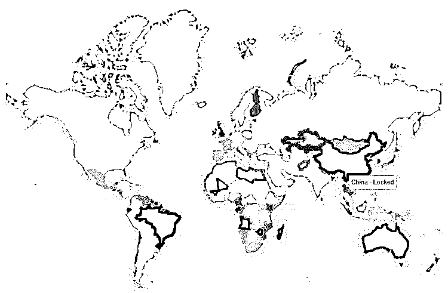

由于每次玩家必须花费上一个玩家双倍或更少的价钱购得国家，加上虚拟国家数量受到真实世界限制。

因此 Crypto Countries 的玩家，相比各式**加密猫加密狗**更容易获得稳定的收益，只要有下一个接盘者，购买虚拟国家的玩家必定能获得投资回报。

简而言之，这是一个更加赤裸的**击鼓传花**游戏。

Crypto Countries 官方将这种买下后自动加价的系统，称之为“**迄今最为友好的增值模式**”。

每次交易虚拟国家的价格上涨幅度已经被写死（Hard code），共有 5 个级别：

> **最低的价格范围在 0.001 以太币到 0.02 以太币之间（约合人民币 4.9 元至 98 元）。**
> 
> **每次交易该虚拟国家的“征服”价格为增长 100%。**
> 
> **超过 5 枚以太币之后（约合人民币 2.4 万元）。**
> 
> **每次交易虚拟国家的“征服”价格只增长 15%。**

不过，无论最后的接盘者是谁，最后的赢家队伍里一定有 Crypto Countries 官方.

每一笔交易 Crypto Countries 都将收取 2%到 5%不等的抽成，如果目前最贵的澳大利亚又一次成交，Crypto Countries 将不费吹灰之力坐收千元.

而其所付出的代价，仅仅是拿了张世界地图轮番换颜色。

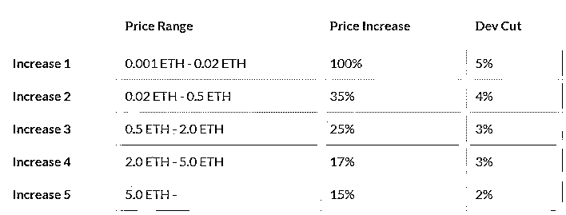

**Crypto Countries 价格增长规则&服务费明细**

由上图可以看到，在这个游戏中，所有人其实在做一个**击鼓传花**的游戏，每一个参与者都可以获得自己本金的 15%至翻倍的回报，而庄家则通过收取服务费和卖出初始状态的国家获取利润。

在这个游戏中，由于智能合约的关系，每个玩家手中的“国家”只能涨价（而且是固定死的增长率）卖出，不能降价销售，而且只要有人出价就会自动脱手无需确定。

这造成了，只要你是最后一个买到这个“国家”的玩家，没有下一个人来买的话，你就是整个游戏的接盘侠！你的手中，只有一团空气，一团没有任何价值的空气！

如此高风险的**类旁氏骗局**，大家参与起来热情有多高呢？

**在 2 月 12 日的这篇文章中，有这样一段描写：**

截至 2 月 11 日下午四点，Crypto Countries 最贵虚拟国家是澳大利亚，售价已经超过 10 个以太币，当天 1 个以太币约等于 4900 元人民币

也就说说 Crypto Countries 当中的澳大利亚价格已经上涨到接近 5 万元。

而在农历中国狗年春节当天，游戏上线了之前不能买卖的“中国”，将整个游戏推向了疯狂的最高潮，在当天世界各地的玩家疯狂炒作后，目前这个游戏中，排名前几的国家价值为：

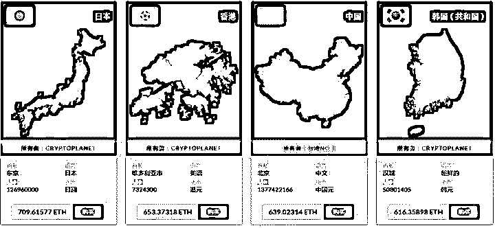

**游戏中排名前四的国家**

可以看到，按照一个以太币价值 5000 元人民币来粗算，排名第一的**日本**价值**350W**人民币

而当天上线的中国，在几个小时之内，就从几元，被炒作到了 320W 元人民币。

而在报道中提到的，接近 5W 元（10ETH）的澳大利亚，现在值这么多：

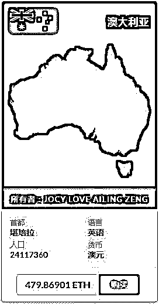

“**稳赚不赔**”的模式，“我肯定不是最后一个接盘侠”的侥幸心理.

无数赌徒在农历春节新年当天涌入了这个游戏，最疯狂的时候，产生了了 4 个小时流水一亿元的奇景。

3

**三. 创始人有信心超越大多数区块链游戏**

****Crypto Countries 的开发者在自家游戏中的代号为“**King**”，“King”自爆是以太坊早期投资人。Crypto Countries 的灵感来源并非来自首款区块链游戏加密猫 Crypto Kitties，而是可以买卖虚拟名人的区块链游戏 Crypto Celebs。****

****开发 Crypto Countries 的核心团队共有 5 人，办公地点包括欧洲和亚洲，创始人本人则常居伦敦。****

****在研发 Crypto Countries 的同时，团队还曾一同开发其他项目，不过在买卖虚拟国家的游戏大火以后，“King”将其他所有项目都撤销了。****

****“King”曾在一次采访中向记者介绍，Crypto Countries 当中虚拟国家的价格不会设置上限，完全靠玩家和市场需求决定。****

****但他同样也承认：“当玩家是一个国家的最后一名持有者，除非下一名玩家从他手中购买，否则他无法获得任何收益。”****

****同时“King”对自家游戏也相当有信心，认为 Crypto Countries 会超过大多数区块链游戏。****

****给予其信心的，除了投资回报以外，是由于相对猫狗一类的宠物圈养，每个人都拥有自己的国籍，其感情诉求会比希望养一只虚拟的猫狗更为强烈。****

****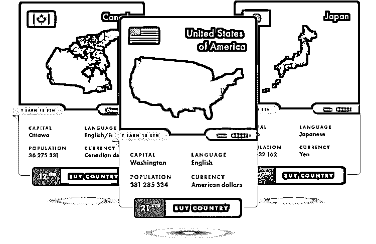****

****民族自尊心强的玩家，对于虚拟祖国落入他人手中自然难忍，比较典型的例子是在澳大利亚之前，价格最高的虚拟国家是韩国，而韩国民众对于区块链和数字货币的热情，在亚洲是可以排进前三的。****

****一些对区块链技术极为热衷，并且拥有大量数字货币保有量的国家，可预见换手率会迅速增长，直接效果便是国家价格水涨船高。****

****由于买卖带有明显的强迫性，用户完全无法防止所持有的国家被买走，会加大来回交易的可能性，甚至恶意多个钱包地址来回购买，堆高价格诱使后来人接盘套现。****

****不过，Crypto Countries 由于题材过度敏感，并且地图向来是国际争议较多的话题，灰产哥在 Crypto Countries 官网上就发现了严重的标注错误，这种容易引起争端的项目，要走的路恐怕还有很长。****

****虽说人们对国家的情感强于猫不假，但其将引发的矛盾冲突，损耗的代价将会远远超出其所带来的收益。****

****4****

******四. 玩转 CryptoCountries 教程******

******1.玩 CryptoCountries 需要准备什么？******

****要开始你在 CryptoCountries 的征服，你需要：****

> ****    1\. 带有 Chrome 或 Firefox 的电脑****
> 
> ****    2\. MetaMask 钱包****
> 
> ****    3\. 充值 ETH 到你的 MetaMask 钱包用于购买国家****

****首先，利用电脑上的 Chrome 或 Firefox 浏览器下载 MetaMask 钱包插件，****

****创建一个个人的 ETH 钱包并向钱包中充值 ETH。****

****如果没有使用过 MetaMask 钱包，请参考：http://8btc.com/thread-76137-1-5.html****

****完成充值后就可以登陆游戏官网开始买下你喜欢的国家了，未来开放了城市的购买，还可以购买自己喜欢的城市。****

******2.怎么玩 CryptoCountries？******

****游戏官网：https://cryptocountries.io/****

****用装有 MetaMask 插件的浏览器登陆网站，如果右上角为绿色的标志，说明钱包和网站已经连接。****

****点击 MARKETPLACE 就可以开始交易了。****

****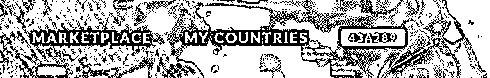****

****如果登陆网站后右上角标志为红色，你将不能利用 Metamask 中的 eth 进行交易。****

****网站也会提示你的浏览器没有关联钱包。****

****此时如果你已经完成了钱包的充值，请先将钱包 logout，然后再次输入密码登陆钱包，并重新刷新网站，这样应该就可以连接上了。****

****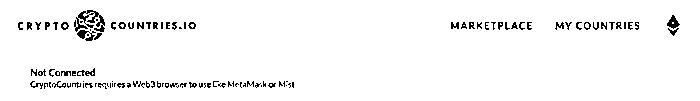****

****连接钱包后，就可以看到当前开放交易的国家以及国家的报价。****

****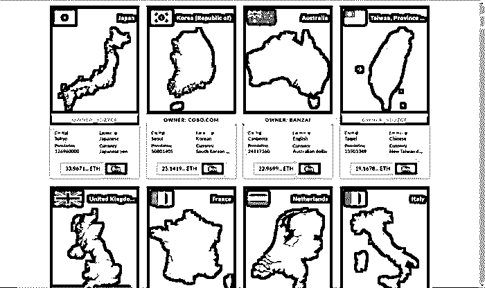****

****关于购买的操作，我想我就不用再赘述了。****

****由于网站利用了以太坊的智能合约，网站本身只是一个 UI 界面，网站不会保存和使用交易的 ETH。****

****所有的交易都是利用 ETH 智能合约，从一个地址充值到另一个地址，都是在钱包中发生的。****

****因此，交易的注意事项和交易明细直接到钱包中查看就好。****

****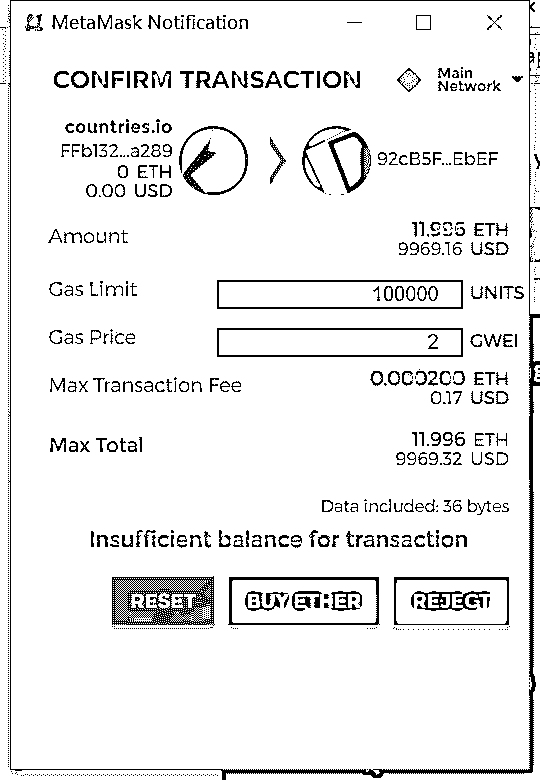****

****CryptoCountries 首页中说“**用区块链统治世界**”，我想他表达的意思就是：****

****只要你的 metamask 钱包中有足够多的钱，**买下世界也不是梦想**！****

****4****

******四. ****而狂欢过后，是恐慌和焦虑。******

****灰产哥在目睹了疯狂后，潜伏进了这款“游戏”的中国玩家讨论 QQ 群中，在后续几天，陆续看到了如下对话：****

****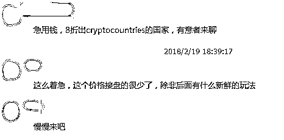********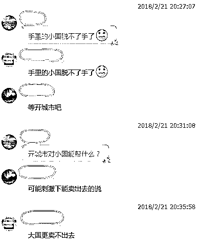****

****在狂欢过后，手中买到的“国家”数天无人接盘，玩家中的恐慌已经开始蔓延。****

****本文发布的时间为 2018 年 04 月 12 日，读者可随时上这款游戏官网查看，几个天价大国的价格是否有进一步提升。****

****5****

****五. 基于以太坊平台的庞氏骗局游戏，已经遍地开花**** 

****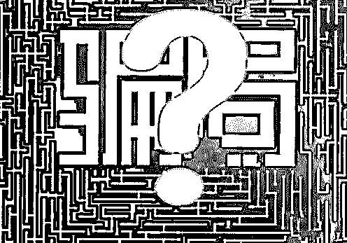****

****这类游戏由于****

****逻辑简单（设置一套击鼓传花的规则），****

****模式复制方便（设置一个要买卖的东西，做个网站，就成了），****

****监管困难（基于智能合约，完全匿名）等特点，****

****在 Crypto Countries 火爆之后，短短几天竟然爆发式的出现了无数个类似的游戏，而且参与者众多。****

****在农历春节初一 Crypto Countries 火爆交易，基本上到了农历初三初四，以太坊社区就出现了海量的类似“游戏”。****

****所有这些“游戏”都有这共同的特点：****

> 1.  ******玩家买卖某个特定的可能是毫无意义的东西******
>     
>     
> 2.  ******“稳赚不赔”“强买强卖”的模式******
>     
>     
> 3.  ******游戏开发者通过交易抽成赚取费用******

****例如以下这款游戏，是新上线的 Crypto Countries 的变种产品：****

******官网：http://www.youcollect.co******

****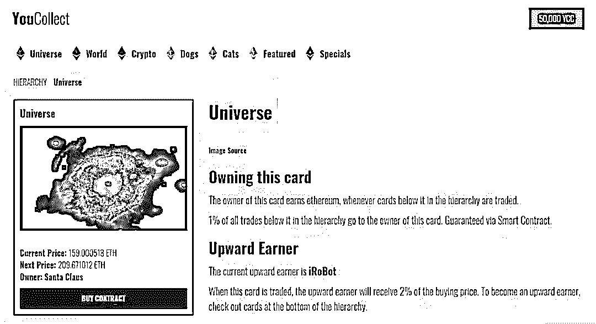****

****在这款高仿游戏中，甚至还基于原版 Crypto Countries 做了很多更深一步的开发：****

****比如引入了“世界”“大洲”“国家”“城市”“伟人”几个层级的概念。****

****买入低层级东西的时候，不仅仅会向游戏开发者缴纳一部分服务费。****

****同时也会向高一层级的用户缴纳一定数额的服务费。****

****举个例子：****

****当你在这款“游戏”中拥有“亚洲”的时候，****

****其他玩家之间，买卖“日本”或者“中国”的时候，也会自动向你缴纳税款。****

****这款游戏中的“世界”，也被炒作到了惊人的 350W 人民币（701ETH）****

****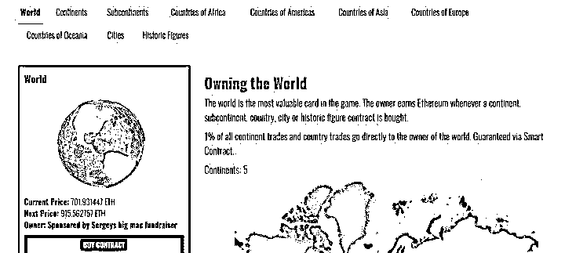

**游戏中的世界****** 

****通过观察 Crypto Countries 和其他变种产品，可以看到，****

****这些炒作虚拟物品获得利润的游戏，很多参与者是中国人，****

****很多游戏开发者也迅速的推出了中文版页面和适应国人的玩法。****

****例如原本是英文游戏的 Crypto Countries 在春节迅速上线了中文页面，****

****同时在狗年春节凌晨上线“中国”，最终引爆了整个“游戏”的交易量。****

****山寨的 World ，也在历史伟人中推出了共产主义人物，售价颇高。****

****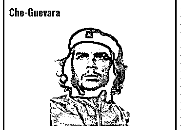****

******在 WORLD 的历史人物中的共产主义人物******

****除了买卖国家以外，这些旁氏骗局的游戏发明者们，可以说是讲一切能摆上网的事务，都要拿来加密买卖一下：****

****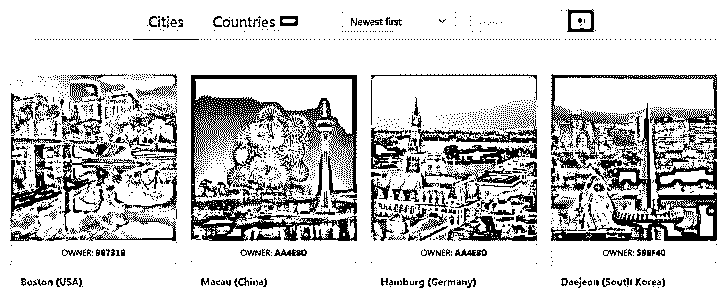

**另一款主攻买卖城市的“游戏”****** ****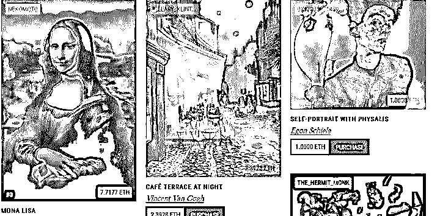

**买卖名画****** ****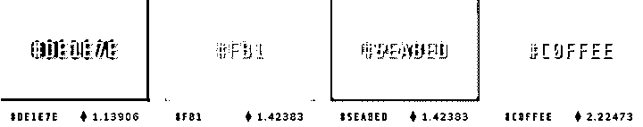

**花费一万多人民币（2.2ETH），淡蓝色就归你啦****** ****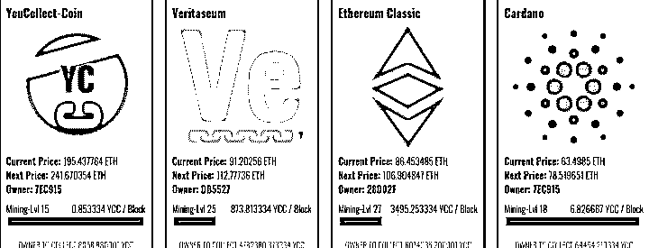****

******在游戏里把整个以太坊买下下来，只需要 43W 人民币（86ETH）！******

****更有甚者，在网上下载了小浣熊水浒卡的图案，就将其放到加密网络上进行买卖，号称“加密水浒”。****

****不知统一集团如果想维权，该起诉谁。****

****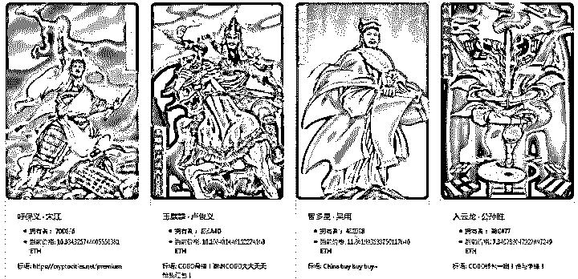

**8W（16ETH）扔进来，宋江抱回家！****** 

****以上截图的游戏，在整个以太坊网络中只是凤毛麟角，****

****而且类似的产品每天会有大量新品上线，****

****收割这一个又一个贪婪的人的金钱，****

****甚至灰产哥在闲逛时看到了能够买卖特朗普的“加密政客”。****

****结尾****

****最终以《资本论》中的经典名言作为结尾：****

******有 10%的利润,它就保证到处被使用；******

******有 20%的利润,它就活跃起来；******

******有 50%的利润,它就铤而走险；******

******为了 100%的利润,它就敢践踏一切人间法律；******

******有 300%的利润,它就敢犯任何罪行,甚至绞首的危险******

******延伸阅读：******

* * *

****[首发|网易“养猫”，百度“养狗”，小米“养兔”：小米区块链宠物“加密兔”来了！（免费领取）](http://mp.weixin.qq.com/s?__biz=MzIyMDYwMTk0Mw==&mid=2247490612&idx=1&sn=ebba6a74c671582591013b1ad6e53704&chksm=97c8d70ca0bf5e1aeb8628a90ba124f7ae3bcd2d0ea16883a8dd2678becf8f67eae1e7a99011&scene=21#wechat_redirect)**** 

****[2018 全民区块链时代到来：盘点“脑洞大开”的奇葩区块链项目（深度好文）](http://mp.weixin.qq.com/s?__biz=MzIyMDYwMTk0Mw==&mid=2247490448&idx=1&sn=66481a9fed6703c725211edc9525856c&chksm=97c8d0a8a0bf59beb4687a8e71eb8b7d844dc425a55e20a4b4f87d12b8ec98d7dd5f34ee640d&scene=21#wechat_redirect)**** 

****[一篇文章读懂区块链：币圈一天,江湖十年!（深度好文）](http://mp.weixin.qq.com/s?__biz=MzIyMDYwMTk0Mw==&mid=2247490389&idx=1&sn=723efdb12fc9c6cfc2d3e84d51f8f385&chksm=97c8d06da0bf597bfdff32d62578c6c43164c53b32b16413ce89a8d57e2bfc8e22e56614083e&scene=21#wechat_redirect)**** 

****[周鸿祎：写区块链最好的一篇文章](http://mp.weixin.qq.com/s?__biz=MzIyMDYwMTk0Mw==&mid=2247490356&idx=2&sn=d20ba5115fb6adf4bfd07b9bea14e7cd&chksm=97c8d00ca0bf591a07ce9b3068cef52e30b00ff9a5ecd170ac19240f0c56f2b8f7854f4ddbad&scene=21#wechat_redirect)**** 

****[网易养"猫"，百度养"狗"：深度揭秘百度区块链宠物"莱茨狗"](http://mp.weixin.qq.com/s?__biz=MzIyMDYwMTk0Mw==&mid=2247490159&idx=1&sn=65a33e94f2d53d1d2fa1242656cdfc28&chksm=97c8d157a0bf5841961e7c188483ce81a2418c7169e504d18abbf4256bbeb93056c0d368d0ee&scene=21#wechat_redirect)**** 

* * *

******【灰产圈】高端社群小程序开通，2018 最值得加入的社群！****** 

****<mp-miniprogram class="miniprogram_element" data-miniprogram-appid="wx4f706964b979122a" data-miniprogram-path="pages/topics/topics?group_id=881854415822" data-miniprogram-nickname="知识星球" data-miniprogram-avatar="http://mmbiz.qpic.cn/mmbiz_png/kialtkOXGKS7D9hZrmO2jzDqryXXTAlhxSpnrKnHGV65KXzicibOppaPic4dCRxftvabB8Iqswo3OuQEDSxE7NicXBg/0?wx_fmt=png" data-miniprogram-title="【灰产圈】高端社群" data-miniprogram-imageurl="http://mmbiz.qpic.cn/mmbiz_jpg/WWG78hysZ0brJkWoyG2VDIacqgQjkDfp6mLiaoPBJ2SgWZHtRuTw7ia8kpoxntsn7PiaFOQO2U23FW6Iry0gS1GnA/0?wx_fmt=jpeg"></mp-miniprogram>****

********

******点击加入【灰产圈】高端社群******