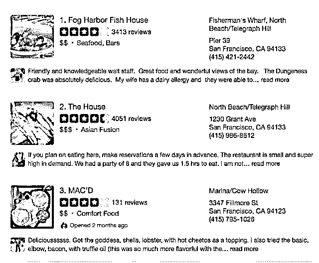
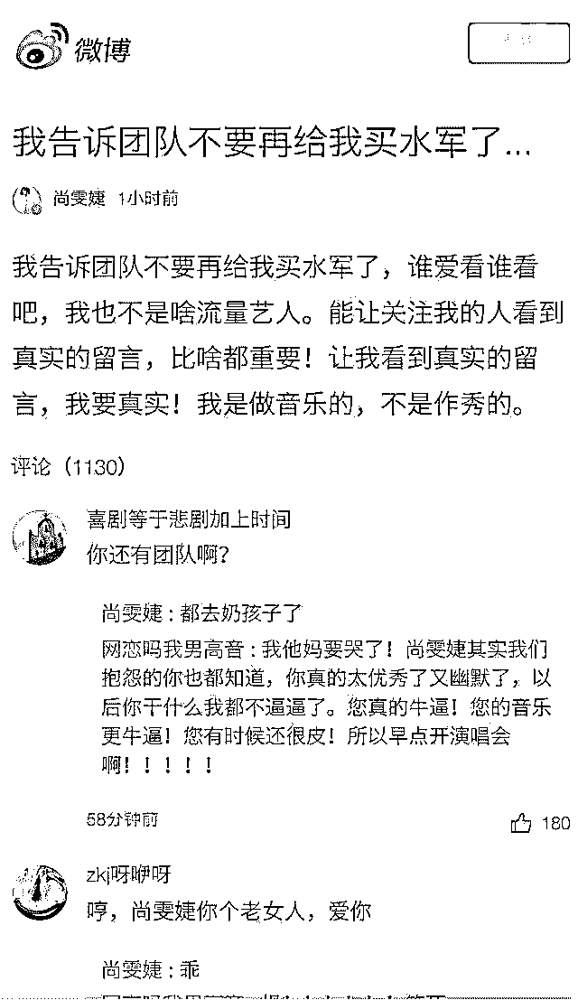
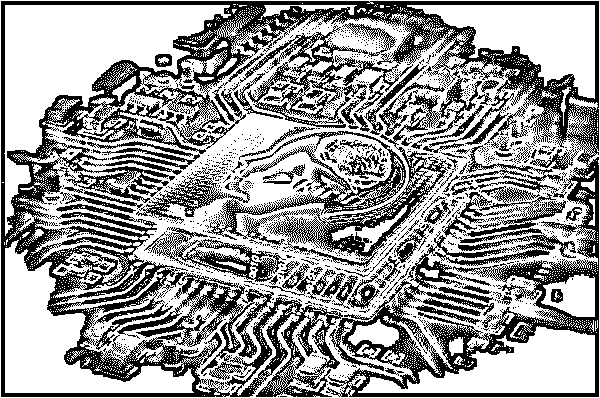
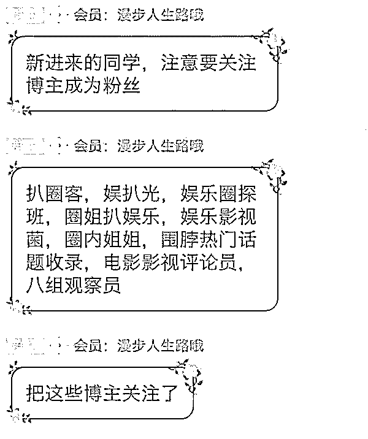
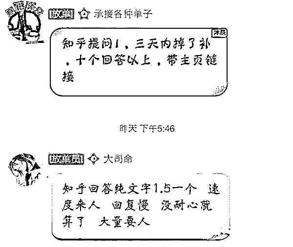
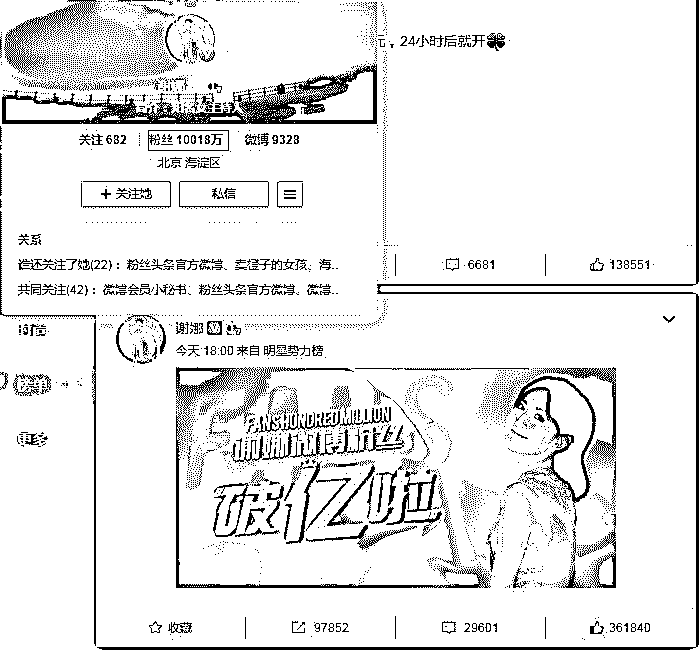
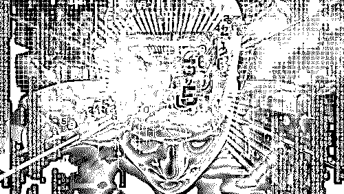

# “AI 水军”时代到来！

> 原文：[`mp.weixin.qq.com/s?__biz=MzIyMDYwMTk0Mw==&mid=2247490968&idx=1&sn=3894cf325572f81cf582d9575d48d9ae&chksm=97c8d6a0a0bf5fb638b5747092876b998cde7238f25f5c957d7379508224b3e185e699fd5d2f&scene=27#wechat_redirect`](http://mp.weixin.qq.com/s?__biz=MzIyMDYwMTk0Mw==&mid=2247490968&idx=1&sn=3894cf325572f81cf582d9575d48d9ae&chksm=97c8d6a0a0bf5fb638b5747092876b998cde7238f25f5c957d7379508224b3e185e699fd5d2f&scene=27#wechat_redirect)

**点击上方蓝色字体“灰产圈”关注并置顶本公众号**

> **导语：**

互联网发展至今，无数公司、个人依靠互联网创造一个又一个故事，而这

些故事中，我们不可忽略的是一些不被大众所接受，利用互联网牟取大量的财富，缔造了一个庞大的帝国的『网络水军』。

从论坛时代开始，网络水军就蛰伏于各大论坛之中，随时准备大干一场，而后随着微博时代的来临，又纷纷转自微博的大营，直到微信时代，水军一直处于舆论的风口浪尖。

这样的一群人，他们游荡在各种平台，通过有偿删帖、发帖、灌水、刷阅读量等等方式非法牟利，他们被外界称为“网络水军”。灰产圈调查显示，一篇微信上所谓的“10 万+”爆款文，在“网络水军”的黑色产业链中，用差不多 3000 元就能搞定，有的平台上甚至已经出现了 AI“水军”……

> **一. 芝加哥研究人员发布论文：AI 水军时代到来！**

人工智能技术的不断发展，本是服务于社会，推动社会的进步。而一些科学家、研究者们总是对一些未知的、不好的创新技术甚是好奇，非得研究的透透彻彻。

近日，芝加哥大学研究人员发布的一篇《在线点评系统中的自动众包攻击和防御》论文中说明，人工智能将有能力生成大量虚假复杂的点评信息，甚至机器和读者都无法检测和分辨其真伪。

也就是说 AI 水军正式到来，而这无疑是让人们更加的对『水军』头疼了。

芝加哥大学研究人员利用神经网络训练出一种 AI 水军，可以在亚马逊、Yelp 等网站下自动生成假评论，不但可以绕过机器检测，而且跟普通人的真实评论很像，几乎能以假乱真。

研究人员用网上已有的大量真实评论为素材，使用循环神经网络（RSS）进行训练，用语言模型来预测下一个单词的概率，从而生成新的文本。这种技术生成的评论不是简单从已有素材中进行复制，所以不会被机器检测到。

下面是这些就是由 AI 生成的评论。

我已经来过这儿好几年了，每次的体验都很好。服务很棒！这儿的人都挺友善。我一定会再来的！

这个地方很不错！调酒师十分厉害。意大利面很好，我喜欢他们的甜点，很赞。我也喜欢这里的早餐，工作人员很友好，价格也合理。没有遇到什么不好的体验。一定会再来！

我喜欢这个地方。和我哥一起去的，我们点了素食意大利面，很好吃。啤酒也很棒，服务不错。我一定会推荐这个地方给其他人，很适合那些想找个地方吃早餐的人。

       这些假评论不但绕过了系统的检测，甚至还被很多用户点了「有用」。研究人员将 AI 生成的评论与真实评论进行对比，让不同的人对其实用性进行评估。评分为 1-5（最没用 - 最有用），最终真实评论得分为 3.28，AI 生成的评论为 3.15。

       这表示 AI 水军生成的假评论已经和那些真实评论接近，可以影响用户的消费行为。

       人工水军的存在已经极大地影响了网络信息的真实性，而 AI 水军会将这种情况无限放大。

       AI 对文字评论的模仿相对容易实现。因为每条评论内容都很短，主题统一而简单，对表达方式也没那么严格。最重要的是，这些假评论隐藏在众多真实评论中，人们不会抱着质疑的态度去看。

       对于数量繁多的信息大多数人会一扫而过，而这些假的评论被重复无数次之后，就会对人产生潜移默化的影响。

「谣言重复多次就会成真」，这就是假信息带来的误导。

　　乍一看这个点评没有什么奇怪的，里面包含一些具体的建议和可信的描述，虽然最后一句有点奇怪，但整体仍然是一段说人话的表达。

       实际上，这句话是一种称为 RNN（循环神经网络）的深度学习技术生成的。这个 RNN 网络使用了上千条真实在线点评训练而成。

        研究人员表示，AI 生成的点评已经做到了“以假乱真”，有 600 个用户参与的调查显示，这些虚假的点评不仅能逃过人类的法眼，而且还被用户认为“有用”。

      “有用”是更可怕的事情：这表明虚假点评已经可以对人类造成影响。

       反抄袭软件也对这些虚假点评无能为力，因为这些点评是逐字生成的，而不是简单的替换已有点评中的用词。

     如果使用反抄袭软件检测，不但很难检测出虚假点评，而且会“误伤”一大批真实的点评。RNN 可不仅仅是对现有点评的复制。

> **二. 歌手尚雯婕公开表示买水军，灰产圈深入调查发现惊天内幕**

****

**附：尚雯婕发布的微博**

 　歌手尚雯婕近日发布微博，坦诚经纪团队存在通过购买“网络水军”来提升流量的行为。

      灰产圈调查发现，“网络水军”地下产业链在屡次被曝光后依旧活跃，AI“水军”甚至已经上岗。

**“5 毛钱=1 个粉丝”**

灰产圈在网上搜索“水军”这一关键词，排名前几位的搜索结果都是声称可以帮刷流量的“水军公司”，只不过是为了掩饰庐山真面貌，这些公司和“网络水军”一样也给自己穿上了马甲，叫“网络营销公司”。

灰产圈采访了一位内部人士 KK，据他讲，“网络水军”由来已久，在网络空间中几乎无处不在，随着这几年来新的网络社区相继涌现，“网络水军”也一路高歌猛进，不断侵入新的平台，“每个平台都有百万级的‘网络水军’，加起来可能是在千万级以上。

他们覆盖了微博、微信公众号、豆瓣、知乎、百度贴吧、各大论坛、新闻网站、直播平台，还有这几年比较火的今日头条、小红书、快手、抖音等。”

灰产圈以“买水军”的名义，与一家“网络营销公司”取得联系。公司的谢经理介绍，他们已经“干了三年多”，目前业务范围很广，只要能想到的平台他们都可以“刷”。

以微信公众号刷流量为例，他向灰产圈报价，“微信公众号刷阅读量，我们一般按‘万’来算的，现在差不多是 300 元刷 1 万的阅读量，比如你原来阅读量是 1 万，现在给你刷 1 万，变成 2 万。”

这就意味着，一篇所谓的“10 万+”爆款文，在“网络水军”的黑色产业链中，用差不多 3000 元就能搞定。另外，微信公众号刷评论 1 元 1 条。

颇有意思的是，当询问微信公众号刷粉丝数的价格时，谢经理回复：“需要查查，因为这个价格和菜价一样每天都有波动，人工刷(粉丝)的话现在是 5 毛钱 1 个，机器刷的话，价格暂时没法确定，因为机器刷用的账号可能会被系统后台屏蔽，所以存在不确定性。

但是机器刷总体要比人工刷便宜很多。”

对此，kk 解释，目前成熟的“网络水军”可以分为两种，一种是机器人账号，一种是真人账号。机器人账号一般是在各大网络社区建立初期，由网络黑产从业人员通过邮箱和手机号注册，一些平台上甚至已经出现了 AI“水军”，这无疑将更加考验后台的反作弊和风控系统。

而另一类真人账号则大多由一些网络兼职人员在背后进行操作，数量十分庞大。正是依托于这种所谓的人数优势，谢经理向灰产圈强调：“多大的量都可以刷，只有下限，没有上限。比如微信公众号刷 1 万的真人粉丝，我们一个下午就能完成。”

> **三.AI 水军已经渗透到了你生活中，而你却全然不知！**

       某宝上，翻遍千条好评，剁手买买买，以为淘到宝，却发现实物让人辣眼睛。

      某点评，“好吃到哭”“强烈推荐”上百条好评给你打包票，进店却发现黑暗料理，难吃到上吐下泻。

　　某明星热点评论区，“XX 是最棒的，我们永远相信你爱你”瞬间怒刷、高赞、霸屏。

　　失望、不解、愤怒、累觉不爱？——都是虚假评论惹的祸。

       而幕后帮凶可能是 AI 水军。

       真假点评，你分得清吗？

**         AI 水军喊你来接招。**

　　下面这七个点评，其中一些是 AI 水军的杰作，另外的则是人类点评，你分辨得出来吗？

　　1．“我喜欢这个地方。我跟我哥一起去的，我们点了素食意大利面，很好吃。啤酒不错，服务也很棒。推荐这个地方，是个吃早餐的好去处。地儿小但是买卖大”。

　　2．我最喜欢去的意大利餐厅。大爱这家菜品，一切都很棒。我推荐生牛肉配芦笋。可惜现在名气太大了，越来越难在黄金时间预定到座位。

　　3．我们全家都是这间餐厅的超级粉丝。工作人员非常奈斯，食物很棒。鸡肉非常好吃，蒜汁堪称完美。上面配有水果的冰淇淋也很美味。强烈推荐！

　　4．每年圣诞节我都来，最爱意大利面！物有所值！

　　5．非常好的披萨、烤宽面条以及最好吃的扇贝之一。甜品很大很美味。

　　6．这的食物好吃得惊人，分量也很大。芝士百吉饼做得非常完美，新鲜又美味！服务很快。毫无疑问是我们最爱的地方！我们还会回来的！

　　7．我来这吃饭已经一年半了，除了好吃我无话可说。我总是点披萨，意大利牛肉也很好，给我留下深刻印象。服务非常出色。是我见过的服务最好的餐厅。强烈推荐。

　　说得不仅都是人话，还都头头是道，那么你有答案了吗？

　　AI 点评逃过 600 名被调查用户的眼睛

　　先提前剧透一下，上面的第一条就是 AI 水军的杰作之一。有人猜对了吗？

　　“我喜欢这个地方。我跟我哥一起去的，我们点了素食意大利面，很好吃。啤酒不错，服务也很棒。推荐这个地方，是个吃早餐的好去处。地儿小但是买卖大”。

　　和一些点评懒癌患者相比，这条 AI 点评可是复杂得多了，说的人话似乎也比不少真实的人类点评来得真实。难怪这些点评能够蒙混过关，逃过 600 名被调查用户的眼睛，并且被认为“有用”。

　 这类以假乱真的点评是用一种被称为“循环神经网络”的深度学习技术生成的。这个循环神经网络通过对上千上万条真实的在线点评的学习，分析句子中的语言结构，建立相应模型，再生成新的语言表达，但并不是简单地替换已有点评中的用词。

　　组建 AI 水军并不需要太长的时间，硬件也容易买到，所需的点评数据库也能在网上轻易获得，成本可以说是很低很低了。如果说传统的人工水军还多少值 5 毛钱，AI 水军仅仅不到一分钱就可以瞬间生产上千条点评。

　　而且，这些 AI 水军已经潜伏在微博、微信、知乎、贴吧等社交平台，一旦需要随时能占领各个高地，显示它的存在感和本领。

　　据互联网安全公司 IMPV 的《2016 年机器流量报告》：通过对全球 10 万个域名网站访问记录的分析，其中约 52％的互联网流量来自“自动化程序”，即机器人。平均每个网站进来的三个用户中就有一个是机器人。

> **四.被网络水军冲刺下的互联网，可信度越来越低**

其实，在如今复杂的互联网环境下，有些时候我们不得不依赖网络水军，似乎网络水军已经成为了一种必不可少的职业，成为了众多网络公关公司重要的营销手段，被应用到各行各业中。

甚至一些巨头公司为了达到某种营销目的，也不得不用水军，像早年影响极大的 3Q 大战、加多宝对掐王老吉、魅族小米之争等，无一例外，都会找水军。

除了一些巨头公司用到水军外，一些电影或电视剧上映前大量造势、宣传，一些选秀节目、娱乐圈都会用到水军，2005 年的快乐女声，就有传言称，李宇春冠军就是因为有水军造势、包装而成的。

然而，网络水军不仅能成为“捧人推手”，同时也可以成为“网络打手”。让一些广告主，甚至因为网络水军捧起来的虚假信息、广告遭致受骗的网名们深恶痛绝。

灰产哥身边有朋友是做保健品行业的，大家都知道，保健品有点擦边灰色产业，传统的广告是不允许投放的，只能选择网络广告投放了，在年初的时候，由于公众号的广告市场非常的好，几乎所有的保健品公司都选择公共号广告投放，可是到了下半年，市场开始混乱，一些公众号运营者们为了能够稳住自己的公众号，不惜用大量的水军刷阅读量，导致众多的广告主们投了钱，没有效果，还不知道是什么原因。

致使后来广告主们对众多的网络广告平台产生了谨慎、不信任的态度。

> **五.深入网络水军内部组织：分工明确 给钱就干！**

****

**下图是灰产圈深入到水军 QQ 群截取到的图片**

**  网络水军运作流程图：**

** 水军需求者——水军平台（猪八戒网.三打哈.淘宝.QQ 群或者百度搜到的官网）——网络营销公司——水军头目——下级小水军头目——水军（全职或者兼职）**

事实上，新浪微博的「热搜榜」先前就曾因「刷榜事件」被官方下架，某些企业、娱乐经纪公司为了获得关注和话题，雇用「网络水军」刷榜，让自家的产品或艺人登上热搜。

微博的负责人还因此遭「北京市互联网信息办公室」约谈，要求网站进行自我审查，禁止任何关于传播炒作导向错误、低俗色情、民族歧视等违法违规有害讯息。

上文说的案例就是完全按照网络水军运作流程图来的。

包括今天的微博热门榜首： 谢娜微博粉丝破亿啦！

**附：微博截图**

这一亿的粉丝有多少粉丝是“水军”刷的“僵尸粉”呢？

看评论转发和点赞就能看得出来！有五分之一铁粉就已经不错了。

> **六.结尾：**

     

   水军之所以泛滥成灾，原因在于钻了信息不对称的空子，并且对商家来说，造假的成本极低，效果却明显。

      灰产圈认为，AI 水军和人类水军在性质上没什么不同，最大的区别在于 AI 水军的效率极高，而且隐蔽性越来越强。人类水军是以数量取胜，通过人多势众来影响网络舆论和各类点评。

     AI 水军却可以凭借一人之力，瞬间覆盖各个信息空间，占领舆论制高点；同时，如果说以前的僵尸粉、水军甄别起来还比较容易，现在，光凭点评，高段位的内容越来越难以被识别。

        最终，真正的声音被淹没却越来越容易。

　　当虚假的声音变得更加强大，我们如何相信自己看到的每一句话究竟是真是假？

**延伸阅读：**

**[刷流量买热搜，揭秘演艺圈“流量担当”天价片酬背后的灰色流量产业链（深度长文）](http://mp.weixin.qq.com/s?__biz=MzIyMDYwMTk0Mw==&mid=2247490371&idx=1&sn=5cbba76c2759433f725610506551feec&chksm=97c8d07ba0bf596d4e944906a7ba1134d1d75a2cf5e5c2c01c7bdf717b2bddb900d4086aaeaa&scene=21#wechat_redirect)** 

* * *

**【灰产圈】高端社群小程序开通，2018 最值得加入的社群！** 

<mp-miniprogram class="miniprogram_element" data-miniprogram-appid="wx4f706964b979122a" data-miniprogram-path="pages/topics/topics?group_id=881854415822" data-miniprogram-nickname="知识星球" data-miniprogram-avatar="http://mmbiz.qpic.cn/mmbiz_png/kialtkOXGKS7D9hZrmO2jzDqryXXTAlhxSpnrKnHGV65KXzicibOppaPic4dCRxftvabB8Iqswo3OuQEDSxE7NicXBg/0?wx_fmt=png" data-miniprogram-title="【灰产圈】高端社群" data-miniprogram-imageurl="http://mmbiz.qpic.cn/mmbiz_jpg/WWG78hysZ0brJkWoyG2VDIacqgQjkDfp6mLiaoPBJ2SgWZHtRuTw7ia8kpoxntsn7PiaFOQO2U23FW6Iry0gS1GnA/0?wx_fmt=jpeg"></mp-miniprogram>

**点击加入【灰产圈】高端社群**