# 南抖音，北快手，假货界的两泰斗？

> 原文：[`mp.weixin.qq.com/s?__biz=MzIyMDYwMTk0Mw==&mid=2247490873&idx=1&sn=080d62a50b7f6e51fb21d3157d05db16&chksm=97c8d601a0bf5f170b5341a5e94728fcdc76e5d870214a961a12fd9a2e9b6f507eb5f22fa005&scene=27#wechat_redirect`](http://mp.weixin.qq.com/s?__biz=MzIyMDYwMTk0Mw==&mid=2247490873&idx=1&sn=080d62a50b7f6e51fb21d3157d05db16&chksm=97c8d601a0bf5f170b5341a5e94728fcdc76e5d870214a961a12fd9a2e9b6f507eb5f22fa005&scene=27#wechat_redirect)

> **导语：**

原本是大家分享、展现自己生活的平台，一部分人却在上面动起了歪脑筋。

“阿玛尼”、“迪奥”口红，35 元一支；

“原版”LV 双肩包，430 元；

二手 iPhone X，3500 元；

崭新保时捷 911,20 多万……

这些让你瞠目结舌的价格，并非出自“微商”或电商，而是来自目前大热的抖音、快手等短视频分享平台。原本是大家分享、展现自己生活的地方，一部分人却在上面动起了歪脑筋。

     如果说以前的朋友圈微商卖的都是假货，那么现在卖假货的平台就数“快手”和“抖音”了，无数小手工作坊商家变成主播，让这里俨然成为“三无”产品的聚集地。

> **一，“抖音”“快手”成为被媒体曝光“三无产品”泛滥平台。**

       现在的“抖音”“快手”上，无论什么零食，什么衣服，只要你能想象到的东西，上面全都有卖的，而大部分产品都没有经过相关部门的检验检疫。消费者如果选择购买这样的产品，会存在极大的安全隐患。

       在这些短视频平台上，主播都会在个人说明上面注明微信号码，甚至会在直播上面告诉大家如何制作食物和化妆品，再贴上一些虚假名牌的标志或是手工作坊的标志，买家通过添加主播微信号码进行交易转账与快递。这条灰色产业链逐渐形成。
　   在电商平台上，售假者如果上传　了　带　有　Chanel、Gucci 等名牌 logo 的图片企图售假，很容易被平台的图片处理系统识破。所以，最近一两年售假者纷纷转型做“微商”，做社交营销。

      因为这些流量入口之前属于娱乐、社交平台，没有对电子商务做出严格规范。越来越多的微商和没有资质的手工作坊开始转战娱乐平台与社交平台，如今以微商直播主带货成为新的商业模式，模糊了传统电商交易平台的边界，也溢出了传统管理者的管辖领域。

 因为是跨平台违法，更容易形成监管真空。

　  近期，对于媒体近期曝光的平台存在大量有关假货推广的短视频事宜，“快手”“抖音”两平台火速做出回应。“快手”官方微博表示，已经在第一时间对报道中提及的账号进行了调查和处理。对于涉嫌传播教授制假的视频，将发现一起处理一起，行为严重者将上报国家相关管理部门。“快手”指出，任何用户在平台上的推广与销售行为，只要触犯了《广告法》等国家相关法律，平台都将严厉处理，涉嫌账号将被限制部分功能直至封禁。同时，“抖音”官方微博也回应称，对于利用平台制假售假的不良账号，发现一起，处理封禁一起，绝不姑息。　

> **二，深入调查：化妆品，奢侈品包等女性产品居多。**

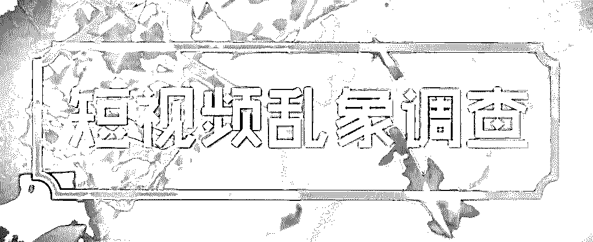

**附：#造假视频#**

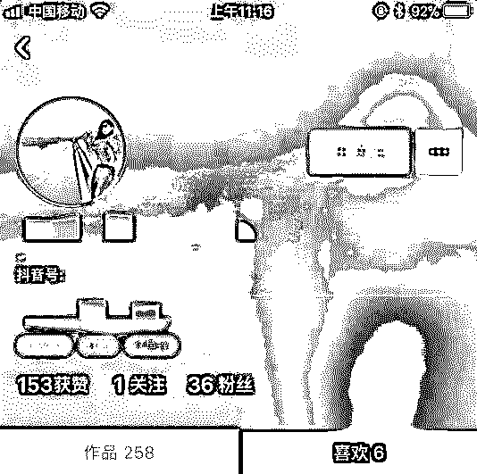

    抖音和快手短视频平台上，被微博曝光存在大量制假视频。灰产圈调查发现，抖音和快手上，有商家号称，大牌口红随便造，“阿玛尼”、“迪奥”、“纪梵希”35 元一支；

     还有人展示用假花和酒精造假日本名牌腮红的过程；甚至有卖家号称，只要顾客有要求，专柜名牌包，各种板式随便仿。

      以记录生活、分享生活为目的上线的短视频直播平台，为何会出现制假的视频呢？制假的背后，存在怎样灰色链条？请继续看

**附：口红、腮红、粉底液，造假视频**

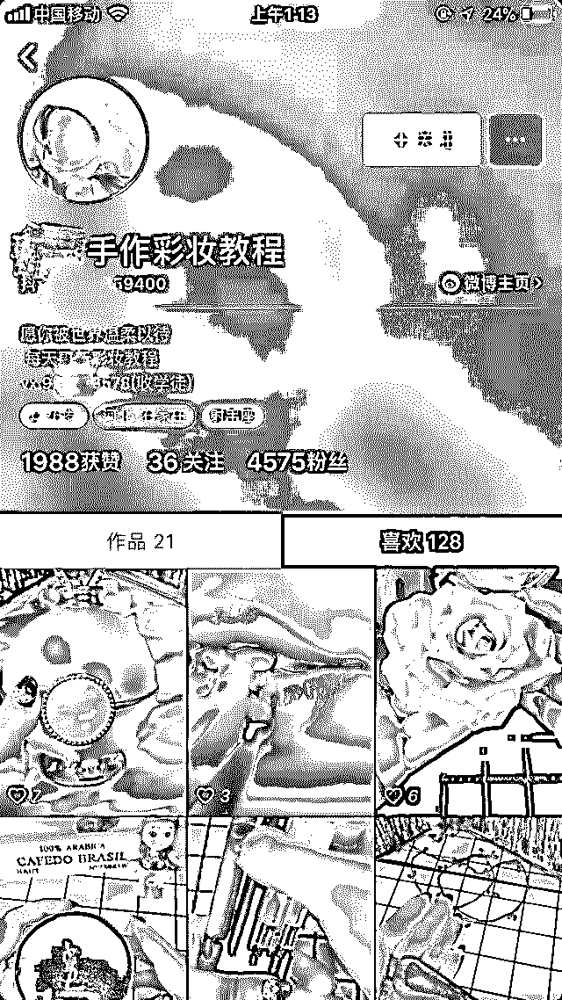

**自制彩妆视频**

      主播 1：刚刚做好的粉底棒，粉质非常的细腻，分三个颜色……

       主播 2：哈喽宝宝们，首先准备一朵假花，用酒精浸泡之后，放到一边备用，再把打碎的腮红加入酒精搅拌均匀，用刷子刷到假花上面，等待酒精挥发之后......

      主播 3：给顾客已经做好了迪奥包金的口红，特别闪......

      以上是快手以及抖音用户在这两个平台和他们的微信朋友圈里发布的视频内容。自制的粉底液、腮红、口红等山寨彩妆产品，全是时下流行的国际知名品牌。

      灰产圈在抖音和快手上打出“手作彩妆”、“自制口红”等关键词，发现的确有大量发布相关视频的用户，他们的粉丝从几万到几百不等，所发布的视频内容均与制作口红、粉底液、指甲油等彩妆有关。

       灰产圈在快手上找到了一位有 4 万多粉丝的用户，从口红、指甲油、各式化妆品在她的视频里都有展示，每个视频底下几乎都会有几千人点赞。

      据该用户介绍，自己做的大牌口红，均是高仿，统一制作出口红以后，用“阿玛尼”、“迪奥”、“纪梵希”等包装壳进行包装，并贴上标签。而这些自制“名牌”口红的售价仅为 35 元一只。

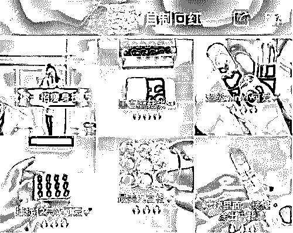

**某用户发布的自制口红短视频**

而在抖音“推荐”中，也有一位名为“XX 手作彩妆”的用户。她发布了这样一段自制腮红视频：将色粉倒入烧杯，与透明液体混合后涂抹在假花花瓣上，再放入一个外形独特的容器中，用粉刷涂抹在手背试色。该视频描述为“腮红界的颜值担当”，已获超 6 万人点赞。

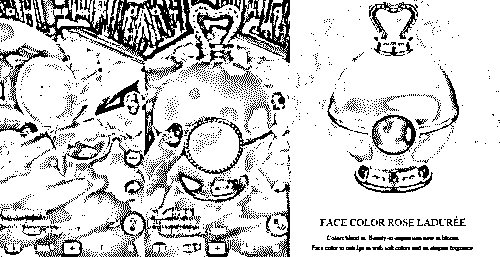

**某自制腮红短视频，右图为某注明化妆品牌的产品**

然而一些网友发现，视频中的容器与某化妆品牌的一款“网红”腮红极其相似。在该品牌官网上，这款腮红的售价约为人民币 600 元。而抖音上这名用户在遭受质疑之时，则回复称“正品多少钱你能去查查吗？我卖那个价格有人要吗？”

这些短视频作者通常会在个人资料上注明微信号，通过短视频平台吸引顾客后，再将卖场转移到微信上来。

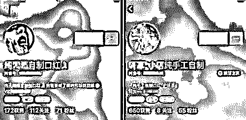

**抖音应用内截图**

除了口红等自制彩妆外，疑似高仿的国际品牌包、名牌手表等也大量出现在抖音和快手上。

灰产圈在快手上点开一位相关用户的视频主页，“香奈儿”、“古驰”、“LV”、“圣罗兰”等名牌包的视频占据了整个页面。

 再通过微信进入其朋友圈，该用户告诉灰产圈，她所出售的包、衣服等都是高仿，买家需要在微信朋友圈自己选择产品，再找她商定价格。

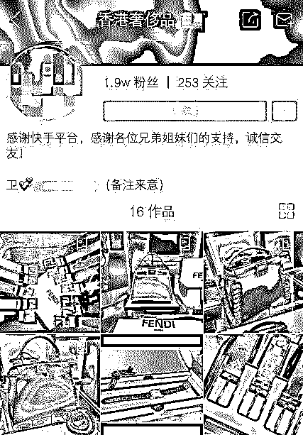

**某快手用户的个人页面，出售“大牌”腰带、手提包等**

在抖音平台，有的疑似制假视频甚至还获得首页推荐。

      灰产圈在抖音“推荐”中看到，一位名为“XX 手作彩妆”的用户发布了一段自制腮红视频，其将色粉倒入烧杯，与透明液体混合后涂抹在假花花瓣上，再放入一个外形独特的容器中，用粉刷涂抹在手背试色。

该视频描述为“腮红界的颜值担当”，已获超 6 万人点赞，评论 233 条。

#####      抖音、快手平台有大量展示山寨奢侈品的短视频，部分明码标价，通过微信贩售。

## 售假：山寨奢侈品明码标价，通过微信、QQ 售卖

      上述短视频作者绝非只想展示 DIY 技艺。通过在主页或评论中注明微信号码，这些作者将卖场转至微信，私下出售自制的三无产品。

        灰产圈以买家身份在微信上与一位自制口红的抖音用户取得联系。她告诉灰产圈，其出售的“大牌”口红均为亲手制作，分“普通款”和“私人订制款”，售价分别为 78 元和 120 元。“

      自己用的话，普通款就行，外面不带（品牌）标。私人订制款里面外面还有盒子都带标，盒子可以扫码。”她强调，“我拿私人订制款出去，没人看出来是假的。就味道模仿不来，其他都一样。”

      被问及安全性，她表示其自制口红原料是蜜蜡还有橄榄油、植物色粉，“家人自己都在用，是亲身用过之后才敢做这个的。保质期跟平常口红一样。”

除了自制“名牌”化妆品，在抖音、快手等平台，搜索“奢侈”、“名表”等关键词，还能找到大量展示山寨奢侈品的内容。

     在一个名为“XX 奢侈品总汇”的抖音用户页面看到，“原版”LV 双肩包 430 元，“原版”Dior 手袋 640 元，“顶级原单”Coach 钱包 180 元，所有视频描述中均留下微信号。

     另一名为“XX 瑞士名表行”的快手用户，已获 5 万粉丝关注，其共发布 105 个作品，展示了劳力士、浪琴、卡地亚等多个品牌标识手表，有的视频注明“瑞士精仿名表”、“各种名牌手表”等字样，并留下微信和 QQ 号。

      根据微信号，灰产圈与一位“奢侈品”卖家取得联系，询问某奢侈品牌某款手袋是否有售，对方很快发来实物图和多张细节照片。该款手袋在官网定价 1.65 万元，该卖家开价 1600 元，称是牛皮质地，“很真，标配礼盒整套都有”。

       其表示，看中后需告知地址并微信转账，他会安排后续流程，出仓、质检、包装好再寄出。他还表示，自己有 4 个微信号，“包包、服装、腰带、腕表，主流类全奢全系都有”。

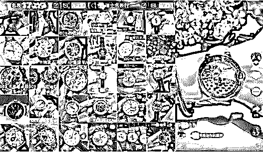

##### **抖音、快手平台有大量展示山寨名表的短视频，部分明码标价，通过微信、QQ 贩售。**

> **三.继续调查：高仿手机、走私车交易堂而皇之**

      在短视频平台上，除了高仿化妆品、名牌包等，还有高仿手机等电子设备，甚至是走私车都有明码标价。

       “我听说很多二手手机是偷来的，不会有问题吧。”“放心，我们就是做这一行的。”这是灰产圈与快手平台上某用户的对话。该用户账号内的短视频的内容多是进行各种型号的手机展示，包括苹果、三星、华为等。

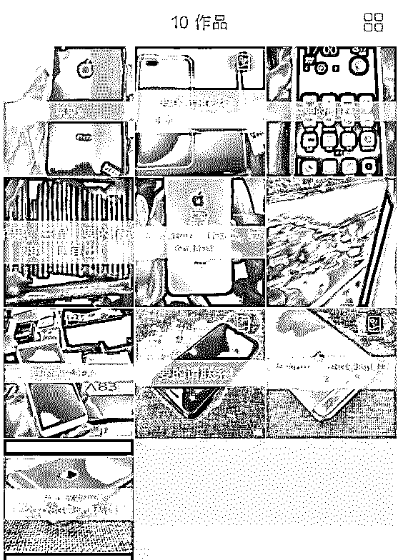

      灰产圈与其联系，对方称自己有容量为 256GB 的“二手”黑色 iPhone X，售价为 3500 元，但没有发票，可多花 150 元买个“保修单”，以便将来进行保修。

      据灰产圈调查，苹果此款手机在某大型电商平台的二手售价在 7900 元左右，而在苹果官网上，此款手机新机价格为 9688 元。

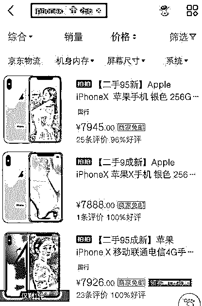

       走私车的交易则更为夸张。

       用“走私车”进行关键词检索后，可发现多名疑似账号。在其中一名用户的主页中，可发现 100 多个短视频，内容都在展示各款高档汽车，并通过用手遮挡、故意忽略等方式掩盖车牌号码。所售汽车价格奇低，其中一款外观崭新的保时捷 911 售价仅 20 多万。

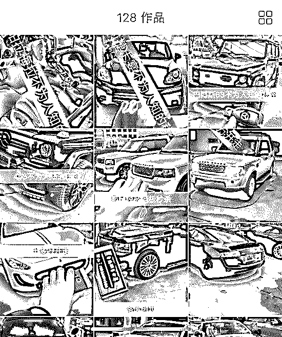

灰产圈发现，目前在快手搜索“走私车”已显示无结果，但搜索“卖车”仍可查找到大量账号。

> **四.从造假到售假：灰色产业链如何运作？**

      这些用户大多有一个特点，那就是会在自己的备注上写上自己的微信号，而用途，便是出售他们在抖音和快手上直播的自制彩妆。

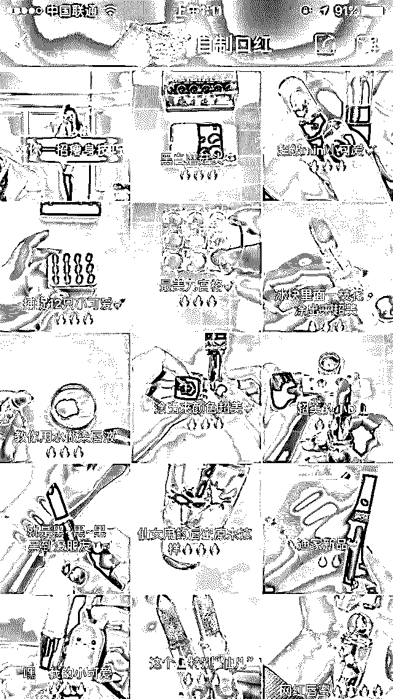

**自制彩妆视频**

        灰产圈在快手上找到了一位有 4 万 1 千多名粉丝的快手用户，从口红到指甲油，在她的视频里，一览无余的展现出来。

       每个视频底下几乎都会有几千人点赞。通过上面显示的微信号，记者以想购买口红的名义和这位快手用户取得了联系。据她介绍，自己做的大牌口红，均是高仿，统一制作出口红以后，用“阿玛尼”、“迪奥”、“纪梵希”等包装壳进行包装，并贴上标签，甚至连二维码都可以扫的出来：

         快手用户：没有牌子，咱们家都是手工制作的，你可以用大牌的口红管。

       灰产圈：都是高仿是吗？

       快手用户：啊对。普通的管子要加五块钱。色号也是自己选。

       灰产圈：在快手上卖不卖？

       快手用户：快手上面都是录视频，然后都是微信这边卖。

       灰产圈：批发价是多少钱？

       快手用户：是 35 一只。气垫的话是 128 带替换。批发的话十盒以上是 88。咱们贴的标啥的都有。

       灰产圈：可以扫出码来吗？

快手用户：可以扫。气垫上面和口红上面都可以扫出来。

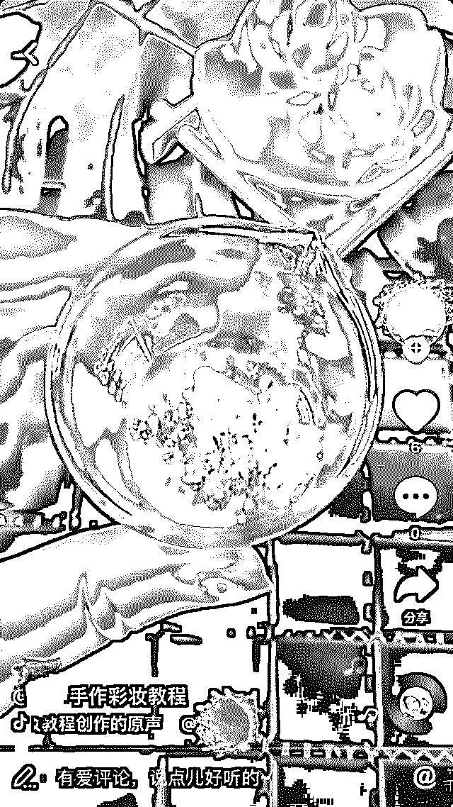

**自制彩妆视频**

> **五.后续调查：“抖音”“快手”平台对售假问题作出回应。**

事件曝光后，快手和抖音在官微上作出回应。

快手表示，注意到有媒体报道用户在快手平台上展示仿制视频，已经在第一时间对报道中提及的账号进行了调查和处理。 对于涉嫌传播教授制假的视频，将发现一起处理一起，行为严重者将上报国家相关管理部门。

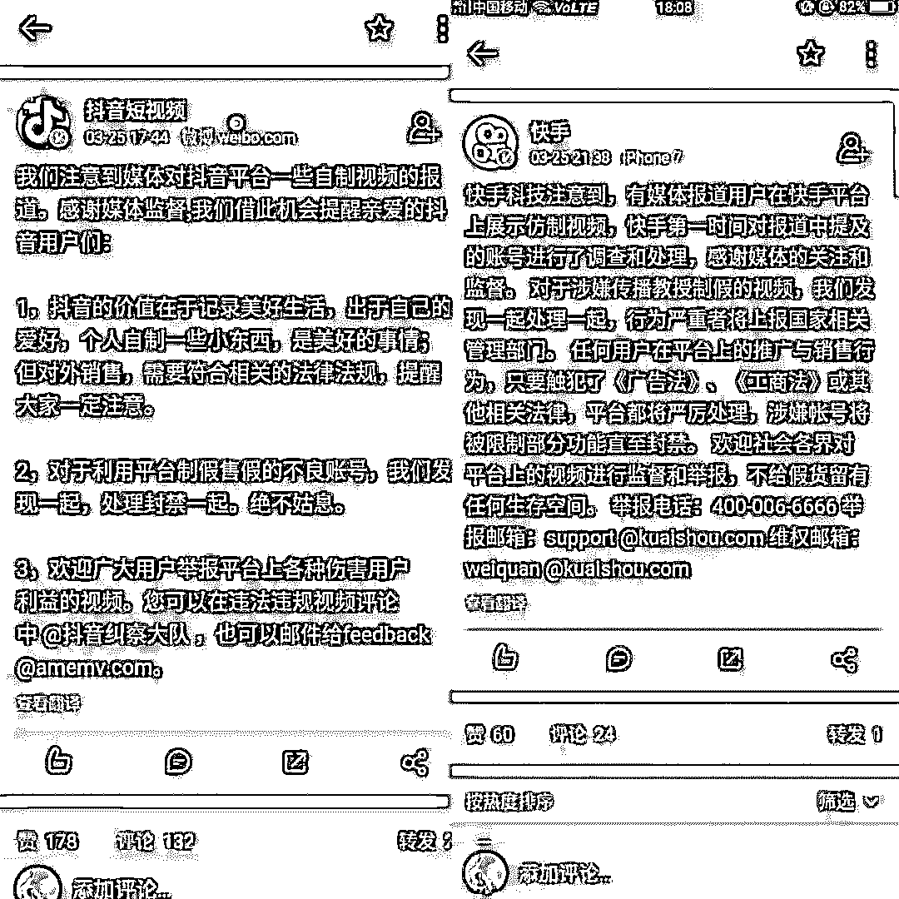

快手称，任何用户在平台上的推广与销售行为，只要触犯了《广告法》、《工商法》或其他相关法律，平台都将严厉处理，涉嫌帐号将被限制部分功能直至封禁。

抖音回应称，对外销售，需要符合相关的法律法规。对于利用平台制假售假的不良账号，将发现一起，处理封禁一起。绝不姑息。

一方是平台声称要对涉嫌制假售假的违法行为进行封号等处理，而另外一方的制假售假行为依然在进行。现如今出现问题且违法视频仍然大量存在，责任究竟在谁？

> **六，为何“抖音”“快手”沦为售假平台？**

这里附知乎网友对此做出的回答仅供参考

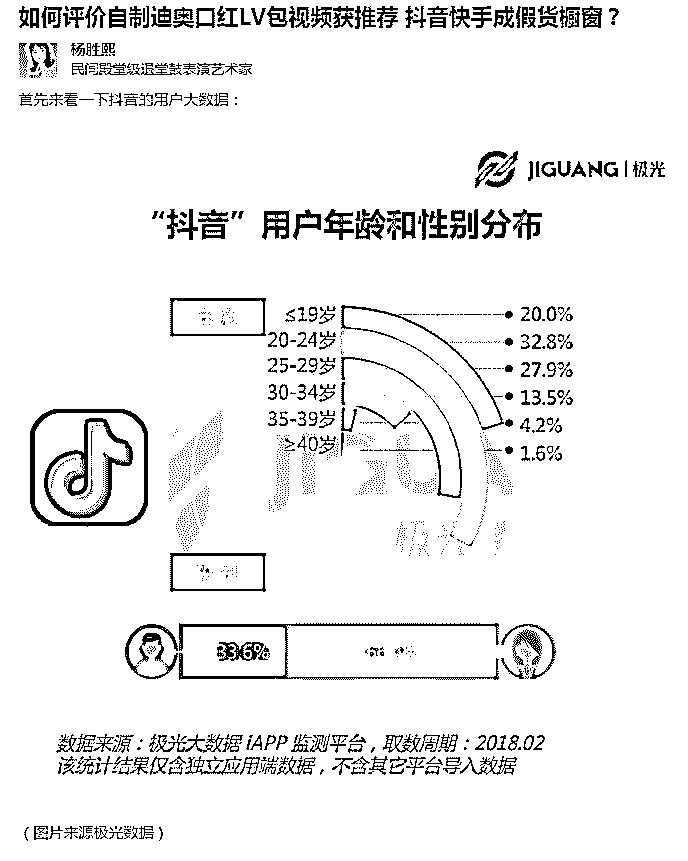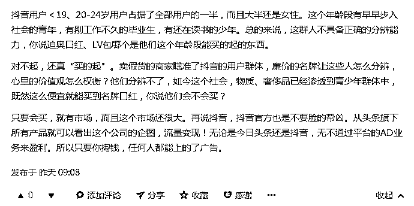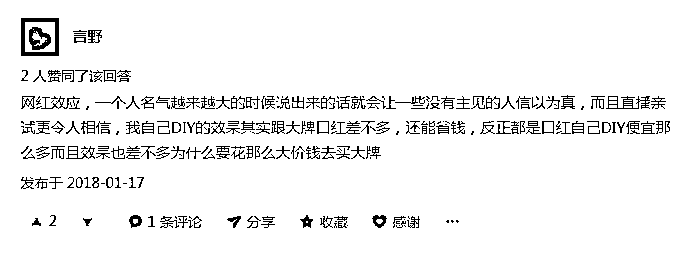

> **七.结尾：**

当你嘴里喊着：老铁！666! 没毛病！

跳着 C 哩 C 哩 和 社会摇 

手里拿着山寨“Amani”

手上戴着“劳力士复刻表”

腰上系着山寨“LV”

开着十几万的“奔驰水车”

的时候，才觉得自己是“社会人” 才觉得自己有“牌面”

殊不知，

别人把你当“笑柄”

把你当“另类”看待

醒醒吧，

人活着，不是光追求外表光鲜，

希望我们追求的只是内心的那份“纯真”。

* * *

**【灰产圈】高端社群小程序开通，2018 最值得加入的社群！** 

<mp-miniprogram class="miniprogram_element" data-miniprogram-appid="wx4f706964b979122a" data-miniprogram-path="pages/topics/topics?group_id=881854415822" data-miniprogram-nickname="知识星球" data-miniprogram-avatar="http://mmbiz.qpic.cn/mmbiz_png/kialtkOXGKS7D9hZrmO2jzDqryXXTAlhxSpnrKnHGV65KXzicibOppaPic4dCRxftvabB8Iqswo3OuQEDSxE7NicXBg/0?wx_fmt=png" data-miniprogram-title="【灰产圈】高端社群" data-miniprogram-imageurl="http://mmbiz.qpic.cn/mmbiz_jpg/WWG78hysZ0brJkWoyG2VDIacqgQjkDfp6mLiaoPBJ2SgWZHtRuTw7ia8kpoxntsn7PiaFOQO2U23FW6Iry0gS1GnA/0?wx_fmt=jpeg"></mp-miniprogram>

* * *

**点击加入【灰产圈】高端社群**