# 首发|网易“养猫”，百度“养狗”，小米“养兔”：小米区块链宠物“加密兔”来了！（免费领取）

> 原文：[`mp.weixin.qq.com/s?__biz=MzIyMDYwMTk0Mw==&mid=2247490612&idx=1&sn=ebba6a74c671582591013b1ad6e53704&chksm=97c8d70ca0bf5e1aeb8628a90ba124f7ae3bcd2d0ea16883a8dd2678becf8f67eae1e7a99011&scene=27#wechat_redirect`](http://mp.weixin.qq.com/s?__biz=MzIyMDYwMTk0Mw==&mid=2247490612&idx=1&sn=ebba6a74c671582591013b1ad6e53704&chksm=97c8d70ca0bf5e1aeb8628a90ba124f7ae3bcd2d0ea16883a8dd2678becf8f67eae1e7a99011&scene=27#wechat_redirect)

> **导语：**

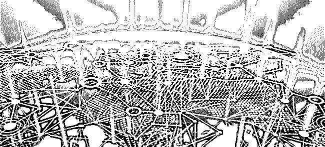

继百度金融区块链实验室发布区块链养宠物"莱茨狗"，网易发布的区块链产品"招财猫"，又一互联网公司被爆出发布区块链宠物。

3 月 11 消息，有人在内部微信群中分享了小米区块链产品“加密兔”的链接，分享链接标题为“你的好友邀你一同领养区块链萌宠[加密兔]”。疑似小米即将区块链游戏项目。

从爆出的信息获悉，加密兔是小米移动旗下的数字宠物服务，米粒为加密兔游戏中的数字米粒。

**一.  趋势： 区块链大热背后，互联网公司纷纷涉足区块链项目。**

区块链自去年年末火起来后，蹭着它的热，产品圈也随之变得热闹起来。目前，区块链已经强势"杀入"了游戏圈，基于它的"数字宠物"打响了"第一枪"。

无论是"加密猫"、"招财猫"还是"莱茨狗"，在区块链技术下，平台保证每一只宠物是世界上独一无二、不可复制、不可销毁的，也正是厂商所宣扬的唯一性、稀有性、收藏性。

与传统游戏注重消遣娱乐不同，它投机属性极强，吸引玩家大踏步入场。

Crypto Kitties(加密猫)是以太坊(Ethereum)推出的第一款基于区块链技术的数字游戏，吸引了大量对"云养猫"感兴趣或试图通过这些"数字宠物"赚钱的用户的注意。

去年年末，创世猫甚至一度被炒到数千万美元的高位，吸引了各方眼球，也显示出"数字宠物"巨大的市场潜力及盈利能力。

国内的互联网公司自然不会错过这一块大蛋糕，各类区块链产品的相继诞生。

值得注意的是，网易"招财猫"因支持数字货币支付，踩了国内政策红线而黯然收场，百度"莱茨狗"只上线了使用价格货币微积分交易的功能。为了规避重蹈前者覆辙可谓相当谨慎，小米在风口当下推出的“加密兔”能跳多久谁都不好说。

> **二.  雷布斯首度进军区块链之 小米区块链宠物“加密兔”**

   从曝光的 2 张微信群聊天截图来看，小米正式进军区块链游戏领域。

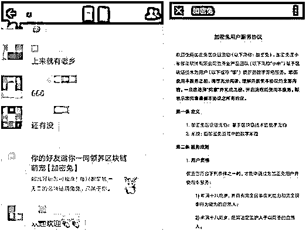

从曝光的信息来看，小米区块链宠物“加密兔”是基于区块链技术的数字宠物，小米加密兔游戏的“代币”叫米粒。

根据官网信息来看，加密兔是北京小米移动软件有限公司（以下简称“小米”）基于区块链技术为用户（以下或称“您”）提供的数字宠物服务。您可以通过任务获得胡萝卜或加密兔，或者使用胡萝卜兑换加密兔。

**1、加密兔：基于区块链技术的数字宠物**

**2、胡萝卜：指加密兔游戏中的积分**

**据悉，小米加密兔有 7 种身体外观属性，此外还有附加道具，每一只都是独一无二。**

**附：小米官方对“加密兔”的解释：**

<mip-img src="http://p1.pstatp.com/large/pgc-image/1520999791350fb48dc0233" class="mip-element mip-layout-container mip-img-loaded">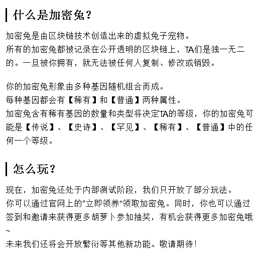</mip-img>

<mip-img src="http://p1.pstatp.com/large/pgc-image/1520999791350fb48dc0233" class="mip-element mip-layout-container mip-img-loaded">**三.  **小米区块链宠物“加密兔”如何玩转？****</mip-img>

搜索了相关的文章，发现是今天 11 点开始抢【加密兔】，点今去后，太火爆了，已经被抢光了。

而且系统比莱茨狗还差，如此火爆，那么多人都在抢，看下图：

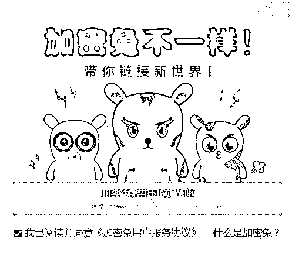

**现在网页给出的活动有 4 中，见下图：**

<mip-img src="http://p3.pstatp.com/large/pgc-image/15209998774732827736e45">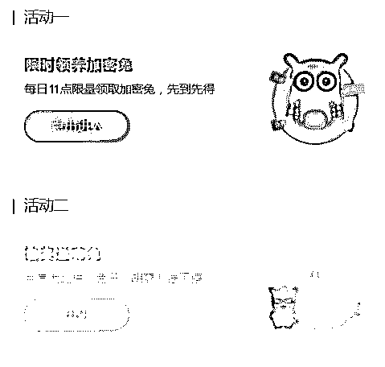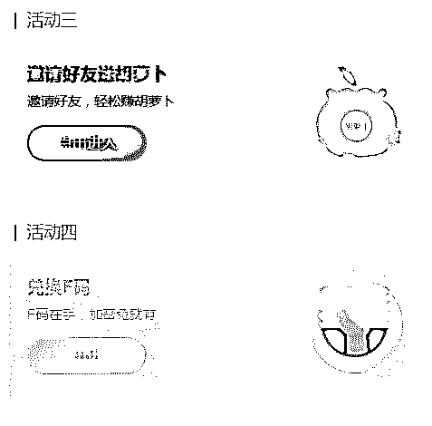</mip-img>

**至于 F 码，一码难求啊！！！**

**附：“加密兔”广场以及“加密兔”属性 **

**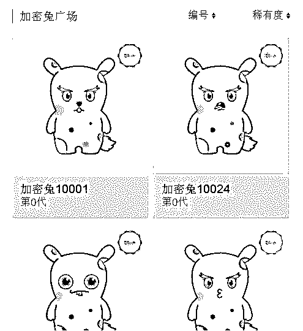**

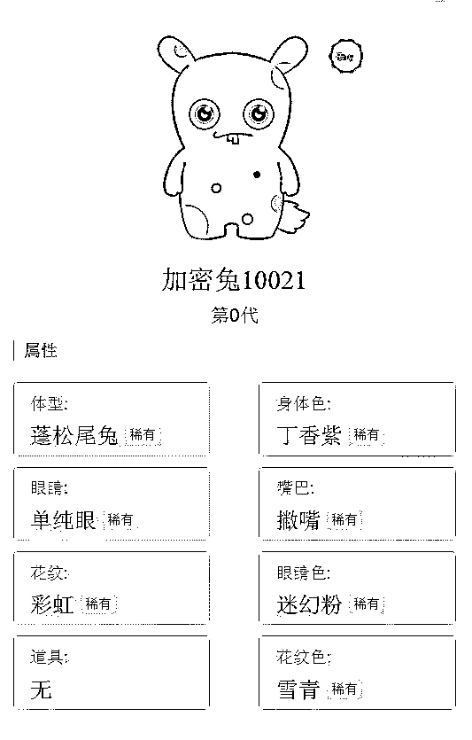

> **四.  “加密兔”上线前 ，小米招募 “区块链”开发工程师，年薪 72W！ **

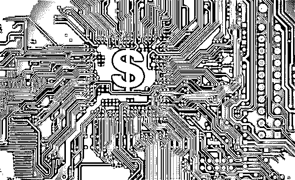

加密兔用户服务协议中强调，用户不得利用加密兔相关服务进行融资或从事加密兔、积分与法定货币、“虚拟货币”相互之间的兑换业务，不得买卖积分，不得为加密兔、积分提供定价、信息中介服务，不得从事法律法规、监管政策禁止的任何活动。

尽管“加密兔”没有正式上线，并且没有得到官方的证实，但其可信度是极高的，毕竟前不久小米公司在多个招聘平台发布了招募区块链相关人士的消息，包括区块链专家、资深区块链开发工程师等岗位。

从招聘信息上看，小米可谓下了血本：服务端开发工程师月薪就能达到 35k，而 3-5 年工作经验的资深开发工程师更是能够拿到 60k 的高薪！

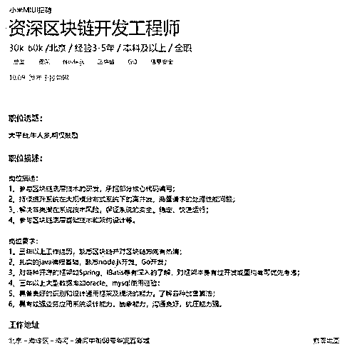

> **五.  “区块链"宠物是如何一夜之间火起来的？**

区块链宠物最初因为 Crypto Kitties(加密猫)大火，它是以太坊(Ethereum)推出的第一款基于区块链技术的数字游戏，每一只宠物是世界上独一无二、不可复制的。据了解，创世猫甚至一度被炒到数千万美元的高位。

相比“ICO 发币”需要直面各种法律条款而言，区块链游戏的拟物化做法较好的规避了现实中可能触犯的法律风险，增加了游戏性的玩法更能激发用户的“堵性”。

并且，具有游戏特点的区块链玩法也更有价值，因为它毕竟是一种数字货币之外的区块链应用探索。而与传统游戏注重消遣娱乐不同，区块链宠物的投机属性极强，吸引玩家大踏步入场。

当然，除开上面的原因之外，它还是一种很好的营销手段。百度“莱茨狗”、网易“星球”、小米“加密兔”看中的，或许正是它的营销价值。

就百度来说，由于微积分的获得是依靠使用百度内部应用来获得，这必将激活用户使用百度的各线产品的热情。

虽然这种热情不见得持久，但如果其中有 1 到 2 款产品能够借机崛起的话，其影响也是非常可观的。

**① 从加密猫（Crypto Kitties）到加密国家（Crypto Countries）**

CryptoKitties 是国外最早流行的一款虚拟区块链养猫游戏，它基于以太坊智能合约打造，玩家在游戏中可买卖并繁殖不同品种的电子宠物猫。CryptoKitties 火爆后，一只虚拟电子猫在市场上的最高标价曾达 340 万美元！百度莱茨狗就是一款类似 CryptoKitties 的游戏。

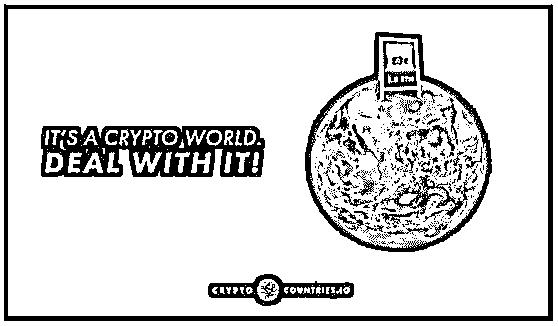

在 CryptoKitties 之后，国外又开始流行起加密国家（Crypto Countries）游戏。

Crypto Countries 也是利用以太坊（Ethereum）区块链智能合约开发的一款区块链游戏。该游戏允许用户使用 ETH(以太坊）在数字地图上购买虚拟国家。

当一名用户买下一个国家后，就成为了该虚拟国家的“国王”，但用户需要谨防其他用户“抢”自己的国王宝座。

如果有人想要购买同一个国家，他只需要比前任国王出价高出一倍即可，只要用户出价触发智能合约条款，他就会自动获得该国家(在智能合约条款下，该交易具有强制性，价高者终究可以获得虚拟国家“国王”称号）。

当交易完成后，新用户就成了该虚拟国家的新“国王”。这是一个稳赚不赔的游戏（如果始终有接盘者的话），对第一个购买国家的用户而言，国家买卖的差价就是自己的利润。

相比加密猫（CryptoKitties），Crypto xx 系列游戏更好玩、更刺激的地方在于：

1、游戏的竞争机制更刺激，并巧妙的引入“人性”。比如在 Crypto Countries 中，民族自尊心成为了用户购买“国家”的驱动力，在 Crypto-All Stars(加密全明星)中，粉丝热情成为用户购买“明星”的驱动力。

2、智能合约的强制性激活了游戏的“堵”性，稳赚不赔的预期设置让接盘者更积极进入。

3、游戏国家作色则增强了用户的自豪感，满足感。

灰产圈认为，加密猫（CryptoKitties）和加密国家（Crypto Countries）游戏实际是将数字货币拟物化，增加了游戏性，这其实是比“ICO 发币”更高明的商业做法。

相比“ICO 发币”需要直面各种法律条款而言，区块链游戏的拟物化做法较好的规避了现实中可能触犯的法律风险，增加了游戏性的玩法更能激发用户的“堵性”。

而具有游戏特点的区块链玩法也更有价值，因为它毕竟是一种数字货币之外的区块链应用探索。

关于加密游戏的更多观点，可以查看何玺的《以太坊 Crypto Countries 加密国家火爆，区块链游戏成智能合约应用探索突破口》一文。

灰产圈认为，这是区块链游戏为什么在国外如此火爆的原因之一。

为什么是之一？因为除开上面的原因之外，它还是一种很好的营销手段。

而百度“莱茨狗”，网易“星球”，小米“加密兔”看中的，或许正是它的营销价值。

**② 区块链挖矿已成为一种营销手段**

在百度区块链宠物“莱茨狗”内测时，灰产圈提到：

由于绑定了百度金融，这对百度钱包来说肯定是利好，但莱茨狗带来的好处不止于此，由于微积分的获得是依靠使用百度内部应用来获得，这必将激活用户使用百度的各线产品的热情。虽然这种热情不见得持久，但如果其中有 1 到 2 款产品能够借机崛起的话，也就不错了”。

这是对当前业务的推广价值而言。事实上，区块链游戏也是区块链应用最好的推广手段。

我们再来看看网易“星球”的玩法。网易“星球”自内测开始，就赚足了眼球。

上线之后，星球以获取原力值（能够提升挖矿能力，原力值越高，挖矿越多）为由，引导用户邀请好友帮助拓展客户。

此外，星球还以获取原力值为由，引导用户使用《网易云课堂》，从而达到推广云课堂的目的。

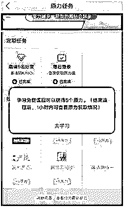

从网易星球到遨游浏览器，挖矿成为了一种很好的产品营销手段！

回到小米的区块链宠物“加密兔”，灰产圈认为它也将成为小米的一种营销手段。

以帮助小米卖更多的产品！在将来，不排除小米推出“挖矿手机”的可能，也不排除使用小米产品获得挖矿能力的可能。

**附：小米区块链宠物“加密兔”领取地址；**

**https://jiamitu.mi.com****（复制到浏览器打开）**

> **六.结尾：**

从网易丁磊的“区块链养猫”

到百度李彦宏的“区块链养狗”

到现如今小米雷军的“区块链养兔”

你希望下一家互联网公司会开发什么区块链宠物呢？

欢迎在下方留言互动！

* * *

**点击加入【灰产圈】高端社群**