# 2018 全民区块链时代到来：盘点“脑洞大开”的奇葩区块链项目（深度好文）

> 原文：[`mp.weixin.qq.com/s?__biz=MzIyMDYwMTk0Mw==&mid=2247490448&idx=1&sn=66481a9fed6703c725211edc9525856c&chksm=97c8d0a8a0bf59beb4687a8e71eb8b7d844dc425a55e20a4b4f87d12b8ec98d7dd5f34ee640d&scene=27#wechat_redirect`](http://mp.weixin.qq.com/s?__biz=MzIyMDYwMTk0Mw==&mid=2247490448&idx=1&sn=66481a9fed6703c725211edc9525856c&chksm=97c8d0a8a0bf59beb4687a8e71eb8b7d844dc425a55e20a4b4f87d12b8ec98d7dd5f34ee640d&scene=27#wechat_redirect)

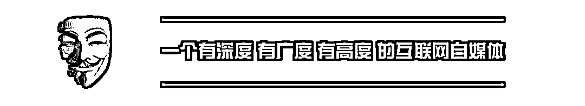

**导语**

央行联合中央网信办等多部门联合下发通知，全面叫停通过首次代币发行（ICO）进行融资的行为，国内 ICO 乱象就此暂告终结。

ICO 在全球范围内已发展数年时间，在被正式叫停之前，ICO 在中国早已呈现出野蛮生长的态势。在狂热的投资者面前，一些 ICO 项目只需要告诉“我，ICO，打钱”，就可以大把大把地圈钱，收割智商税了。

在这样的背景下，国内 ICO 市场中传销币、山寨币与各种奇葩项目层出不穷。

区块链的疯狂已经超乎了我的想象，每天有各种各样的区块链信息刷爆我的朋友圈。自 ICO 被国家严令禁止以来，「币圈」的炒作已经开始延伸到了「链圈」的炒作……

区块链技术的应用前景毋庸置疑，但是面对各种各样令人脑洞大开的（奇葩）区块链项目，灰产哥也是感到无语。

下面灰产圈就来盘点下“奇葩”区块链项目，老铁请搬好板凳嗑着瓜子坐稳观看。

**网易星球**

相比其他奇葩区块链来说，网易星球其实还算「正常级玩家」。据网易星球官网的介绍，网易星球主要是通过区块链加密技术管理个人的数字资产，包括信用数据、注意力，互联网踪迹等用户行为数据。

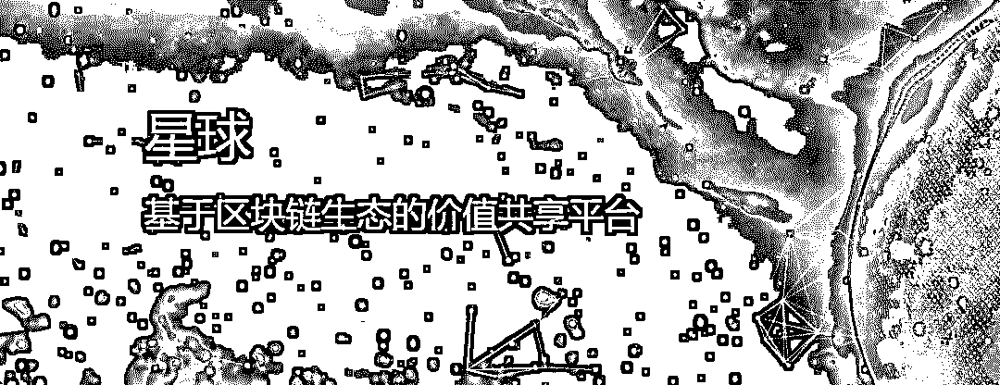

其本质上是通过游戏的方式来挖矿得到代币「黑钻」，据说「黑钻」价格最高一度被炒到 44 元一枚，如今价格已经暴跌 92.7%，堪称一地鸡毛，用户焦点集中在如何开放交易变现的问题上，政策不明朗和用户担忧是黑钻价格暴跌的罪魁祸首。

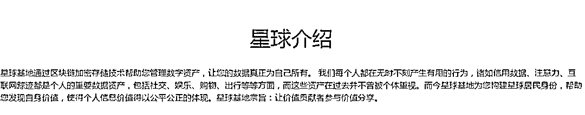

官方公告显示，星球是一个“基于区块链生态价值共享平台”。据该 APP 介绍，星球通过区块链加密存储技术帮助用户管理数字资产，在星球基地中进行黑钻交易和结算。

在《星球》里，有两个重要的元素，“黑钻”和“原力”。

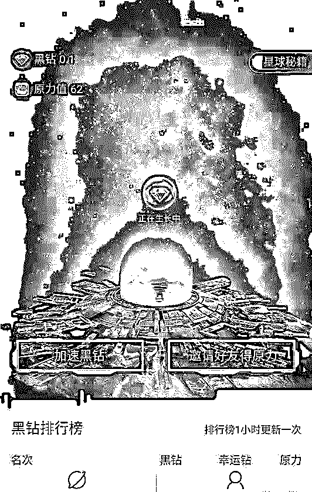

黑钻是啥，看看：

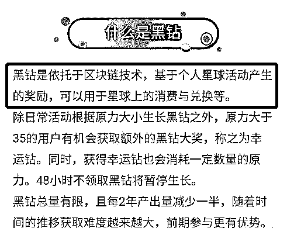

黑钻是用来奖励、消费与兑换的。

那星球是干嘛的呢？我们来看看官方的介绍：

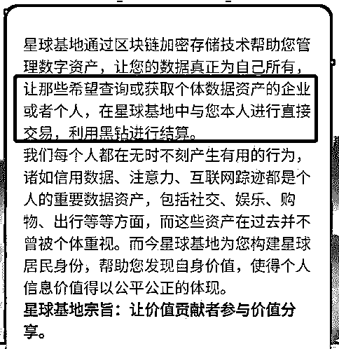

继续看：

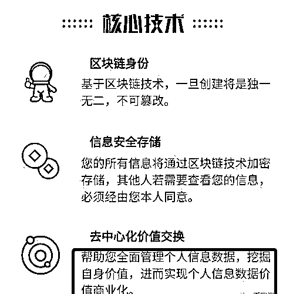

**原来就是基于区块链技术，记录个人各种信息的嘛。**

现在大概明白了，这个看起来像游戏的网易星球，实际上就是网易的搜集个人征信的应用，对标的就是阿里芝麻分，以及正在测试的微信信用分。

其实我们从这款产品的下载地址也可以看出，它是归入到网易金融业务的：

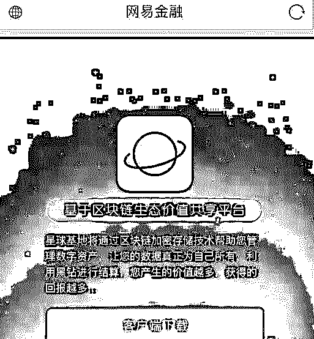

**至于具体的应用场景，网易正在搭建：**

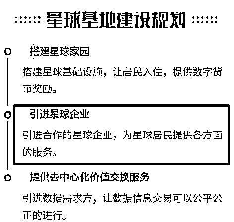

然而掌门人时常教育你们，区块链的江湖，哪有这么简单。

**如果认为网易绕了这么大一个圈，目的仅仅是为了征集个人信用信息的话，未免太过于低估了丁磊的野心。**

我们回到 APP 的本身，再审视一下**“黑钻”**、**“原力”**，以及以下这句话：

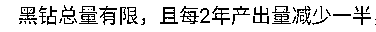

如果你不是只会埋头炒币的小韭菜，只要你有那么一丁点了解比特币，那么你会发现这些名词，跟比特币的属性有着高度的吻合：

> **比特币=黑钻，**比特币是四年减少一半产出；
> 
> **原力=比特币挖矿算力，**比特币也是到后期挖矿难度越来越高；

我们再回头看一下，什么是黑钻：

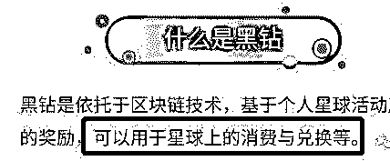

**到这里，我们完全可以理解网易这个产品的所有意义了：根据区块链的天然货币属性，网易星球其实就是网易在游戏的外衣下，发行的数字货币！**。

该产品上线不到 24 小时，已有数万人注册成为“星球居民”。不过其邀请链接因“诱导分享”被微信封锁（就像上次的公开课链接一样）。

网易的初衷是好的，但它没想到的是，数字资产「黑钻」在不知不觉中变成了期货衍生品，成为了投机者暴富的炒作工具。但不管怎么说，用户行为数据确实是有价值的，如何防止技术被滥用才是关键。

**网易星球官网  https://163.lu/GTe6P3  **

**百度莱次狗 & 360 区块猫**

区块链领养宠物在春节刷爆了朋友圈，很多大叔大妈都没搞明白这是个啥玩意儿。抛开奇葩不说，萌萌的阿猫阿狗确实掳获了不少女性朋友的芳心，其中最具代表性的就是百度莱次狗和 360 区块猫，用户可以通过游戏化的玩法来实现个性化虚拟领养宠物，用来打发时间其实也挺有意思的。

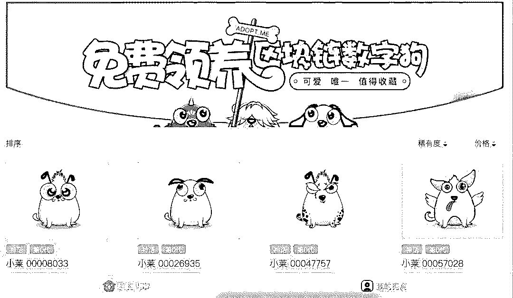

电子宠物之间的价格区分，主要通过稀有程度、第几代、各类身体属性等因素决定。宠物品种越珍贵，卖出去的价格就越高（目前仅支持用户之间的交易），但目前来看，不少区块链养宠项目已经悄悄「流产」，「以太猫」的造富神话在中国注定是「水土不服」。

**深度解读请看文章：**

[深度|丁磊养了七年"猪"，如今又准备养"猫"？揭秘“网易招财猫”：全新区块链宠物](http://mp.weixin.qq.com/s?__biz=MzIyMDYwMTk0Mw==&mid=2247489806&idx=1&sn=734bb55c84d2d7802065221a063b7ff7&chksm=97c8d236a0bf5b20912630f12cf06c28aa4ee744b99e829e497f46cec3e3b63d36c823bf8fe8&scene=21#wechat_redirect)

[网易养"猫"，百度养"狗"：深度揭秘百度区块链宠物"莱茨狗"](http://mp.weixin.qq.com/s?__biz=MzIyMDYwMTk0Mw==&mid=2247490159&idx=1&sn=65a33e94f2d53d1d2fa1242656cdfc28&chksm=97c8d157a0bf5841961e7c188483ce81a2418c7169e504d18abbf4256bbeb93056c0d368d0ee&scene=21#wechat_redirect)

**百度莱茨狗官网 http://t.cn/RRpDM7R**

**360 区块猫**官网**  http://t.cn/RR947ek  **

**MCC 行云链**

MCC 行云链表面看上去很高端的样子，实际上就是一个卖智能手表的。据其官网介绍，行云链是一种基于区块链技术的分布式数据存储协议，而 MCC 是一种区块链数字资产，戴上「腕上矿机」每天通过运动挖矿就可以产出。

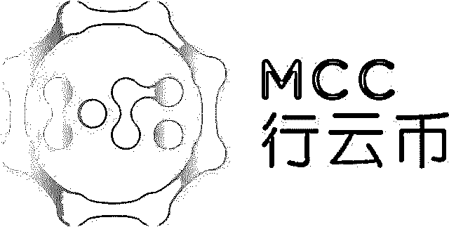

所以讲了半天就是购买他们的「腕上矿机」（就是智能手表），那么挖矿得到的 MCC 有啥用呢？可以兑换商品或者是用于打赏，还可以去交易平台进行币币交易变现，这不还是羊毛出在羊身上嘛，玩的就是「空手套白狼」？

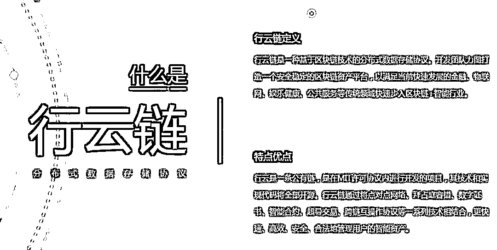

**什么是行云链？**

在讲 MCC 之前，先给大家介绍下行云链。

据行云运动官网介绍，行云链是一种基于区块链技术的分布式数据存储协议，由行云团队研发，力图打造一个安全稳定的区块链资产平台，以满足当前快速发展的金融、物联网、娱乐健康、公共服务等传统领域快速步入区块链+智能行业。

此外，官网还介绍，行云链是一条公有链，是在 MIT 许可协议内进行开发的项目，其技术和实现代码将全部开源。行云链通过将点对点网络、拜占庭容错、数字证书、智能合约、超导网络、跨链互操作协议等一系列技术相结合，更快速、高效、安全、合法地管理用户的智能资产。

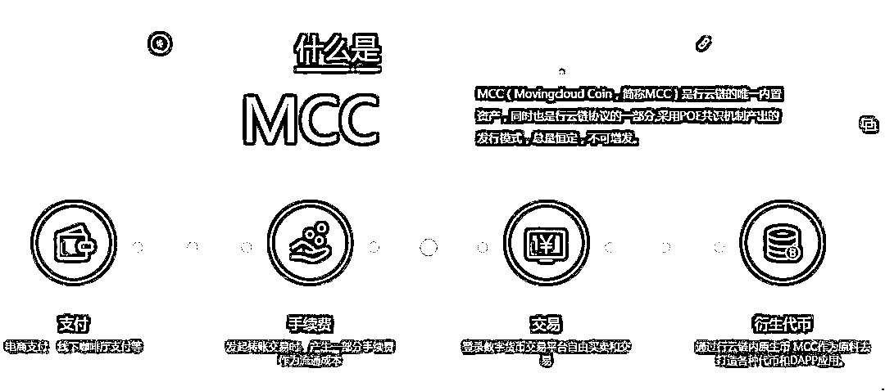

**什么是 MCC？**

首先大家已经知道，MCC 是一种区块链数字资产，通过运动挖矿产出。但这离不开行云链强大的生态属性。

MCC 是行云链的唯一内置资产，同时也是行云链协议的一部分，采用 POE（运动量证明）共识机制产出的发行模式，总量恒定，不可增发。

据官方介绍，MCC 的总量达到 10 亿（预挖），基于智能挖矿设备的运动挖掘，所有激活设备每天总共产生 16 万左右，每个用户的步数上限为 20000 步。也就是说，每个用户获得的 MCC 奖励多少，取决于每个用户的运动步数、所以激活设备产生的总步数，以及设备的性能算力大小。

由于 MCC 采用了区块链技术，所以它具备了区块链资产的所有特性，例如，安全性、透明性和唯一性，以及交易性和增值性等。目前，MCC 已经上线易币 OTC、DOBI、Allcoin、Coinegg、BCEX 等多个国际交易平台，可交易买卖。

MCC 基于区块链技术，通过智能合约，保证用户共享计算资源和内容的付出和收益对等，不可抵赖；通过去中心化的账本记录，保证所有交易真实透明。

**MCC 的用途？**

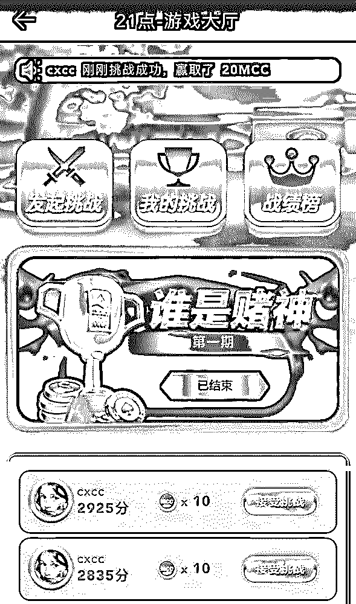

**通过挖矿产出的 MCC，具有哪些用途呢？**

交易：MCC 具有和比特币、以太坊、莱特币一样的交易和增值属性，MCC 可以去交易平台进行币币交易，兑换比特币、以太坊等加密数字货币，进而变现。

兑换商品：用户可根据自己的需求，在行云运动 APP 商城里兑换相应的商品。

红包打赏：行云引进打赏功能，可用 MCC 对 APP 里的优质内容进行打赏。

游戏：行云运动 APP 内置 21 点游戏，可发起挑战赢取 MCC。

随着智能电子设备和区块链技术的逐步发展，未来，MCC 还将拥有更多的应用场景。

**如何获取“腕上矿机”？**

如果想要获得 MCC，要么在交易平台买入，要么自己挖矿获取，但想要自己挖矿则必须先要有一个“腕上矿机”。

刚刚过去的这个圣诞节，行云公司已经限量卖了 5000 个行云 Plus2 挖矿手环，但考虑到许多用户遗憾未能抢到，希望再售卖一批。为此，行云公司启动了第二波也是最后一波行云 Plus2 售卖。

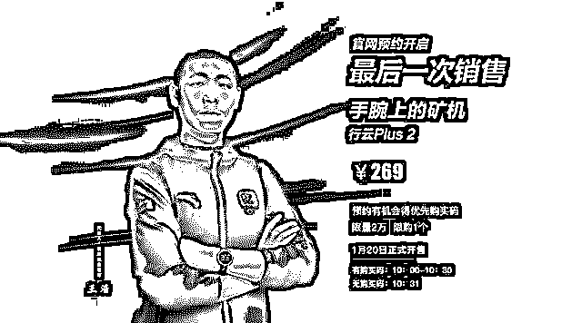

现在，用户可以在行云运动官网（www.mcsports.cn）进行行云 Plus2 的预约购买，2018 年 1 月 20 日 10:00 正式开售，售价维持 269 元不变，官方限量 20000 个（行云运动 APP 商城 15000 个，淘宝 5000 个），每人限购 1 个。

**MCC 行云链官网 http://www.mcsports.cn**

**长区块链**

如果说 MCC 行云链还不算太奇葩的话，和长区块链相比那简直是小巫见大巫了。事件的起因是美国纽约一家上市公司「长岛冰茶」宣布更改公司名称为「长区块链」，并申请了官网域名。

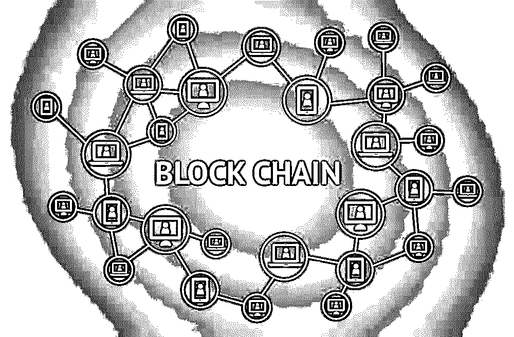

然后就没有然后了，搞了半天换了个「马甲」，请问和区块链的关系在哪儿？更离奇的是公司改名后股价直线飙升，暴涨将近 5 倍，原来提高上市公司的股价还有这种操作，简直不要太离谱！我……

****长区块链**详情：**

12 月 21 日晚间，美国纽约的一家饮料上市公司“长岛冰茶”（Long Island Iced Tea）宣布改名为“长区块链”，并申请了同名公司官网域名。今天在美国股市开盘前，这支长岛冰茶的盘前股价一度涨了 500%，市值一度突破 1 亿美元。而在昨天收盘时该公司股票市值才 2300 万美元，这家公司利用区块链概念炒作，确实涨的有点疯狂了。

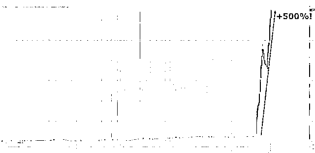

而长岛冰茶在今年 11 月 13 日曾公布第三季度财报，显示第三财季净利润为-391.28 万美元（注意是负数哦），同比增长 20%；营业收入为 155.49 万美元，同比上涨 19.5%。

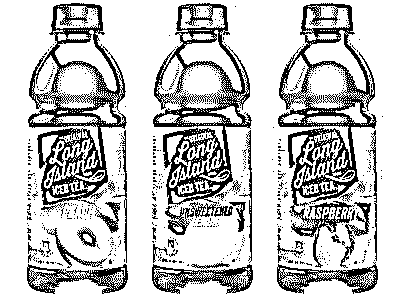

**长岛冰茶公司的饮料产品**

在净利润为负的情况下，这家公司宣布将初步研究区块链技术的潜在商业价值，但公司也表示将继续生产非酒精饮料产品。

一家饮料公司只是宣布改个与区块链相关的名字，股价就当天翻倍，股民们对区块链、比特币的热情实在是太高了。

这也说明了区块链为基础的一些产品或者数字货币，正处于高度泡沫的风险期。

**官网未找到**

**「颜值链」&「嫩模链」**

看到这两条神奇的链，我才知道什么叫「一山还有一山高」。

据颜值链官网介绍，颜值链号称是「全球首个基于区块链技术打造的专注于美容大健康产业的资产数字化服务平台」，主要通过人才，机构，求美者三个维度为起点，构建美容大健康产业数字化公有链。

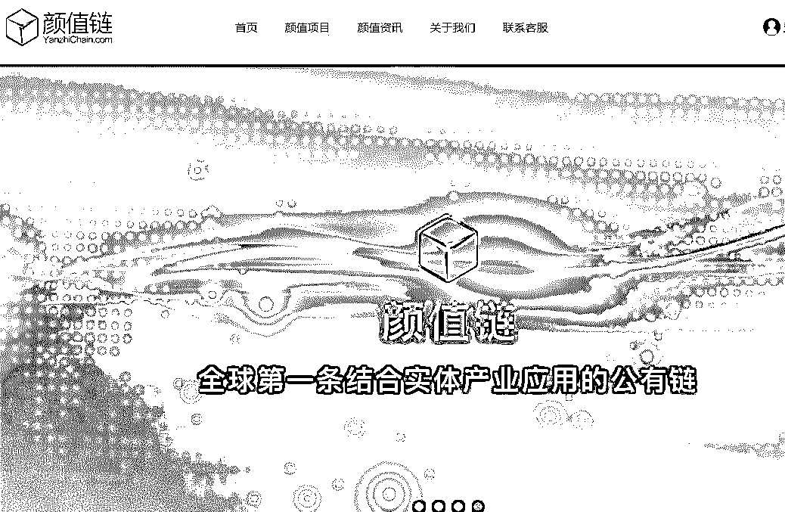

体现其数字资产价值的就是发行代币「颜值币」，然而「颜值币」具体有什么用途却没有详细说明，难道「颜值币」越多，颜值越高？不过颜值币创业团队的颜值似乎真的蛮高的，官网上的 P 图技术也甚是了得……

颜值链号称“全球第一条结合实体产业应用的公有链”。白皮书中称，颜值链是全球首个基于区块链技术打造的专注于美容大健康产业的资产数字化服务平台，该平台采用智能合约机制，并通过区块链技术的去中心化、溯源性以及信息不可篡改等功能，针对美容大健康产业构建的一个通用的资产数字化颜值产业公有链。

走的是邀请线下实体美容机构、美容人才“上链”认证的道路，整体技术含量不高，后续运营考验的实质上是颜值链的线下推广能力。

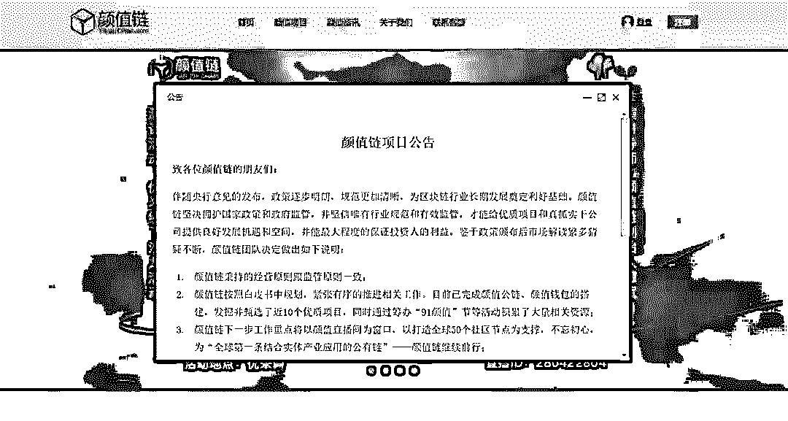

但从项目内容上看，颜值链似乎与众多创业项目并没有太大区别。然而，颜值链在白皮书中，根本没有指出其发行的颜值币（YZC），对于投资者来说究竟有何用途，仅列出了颜值链自身会将代币投入运营。投资者的利益根本不能保障。

目前，网站处于停摆状态。

与之匹敌的还有「嫩模链」，据说「嫩模链」项目的发起者是由一群嫩模发起，因此得名。所谓「链」即「嫩模产业链」，其目的是为了解决信息不对称的问题，所以需要在嫩模产业链上应用去中心化的区块链技术。

嫩模链：区块链领域里见惯了世面的投资人面对这些已经毫不惊奇了，但是对于像灰产哥这样的只能用两个字来形容——“服气”。

不过，从嫩模链里蹦出来的这个币种倒是成功吸引了不少资深宅(diao)男(si)的眼球，虽说现在实现“一币一别墅”的目标还很遥远，但是“一币一嫩模”的理想似乎已经近在咫尺了。

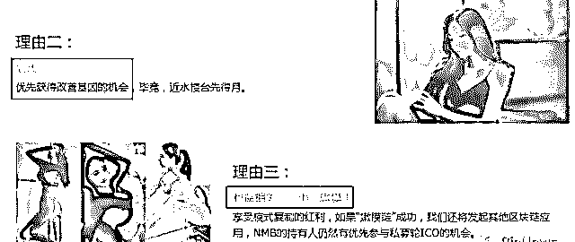

估计大家也都跟我一样，看到这里还是一脸懵逼，那接下来我就为大家介绍一下这个所谓的“嫩模链”没错，看上去就很有(qi)趣(pa)的感觉。

然而对“嫩模链”的“官方”解释就是为了解决信息不对称的问题，我们需要在嫩模产业链上应用去中心化的区块链技术。这个“链”即指“嫩模产业链”，又指“区块链”。去中心化的嫩模产业，将更公平的为全社会服务。

各种区块链应用层出不穷，嫩模链将完善全球区块链技术场景应用的生态链，共同促进发展区块链技术应用多元化的场景落地。

听了以上的解释，大家是不是觉得我在一本正经的胡说八道，感觉智商受到了侮辱？但是专业的解释就是这样，虽然我也对这个定义持怀疑态度，还有这样的解释，这样的链？小编表示简直无法跟上时代潮流。

别说，这个链看起来如此的胡说八道，有着诸多的不靠谱，却还吸引了几位名人的眼球。前方有高能，18 岁以下系好安全带。

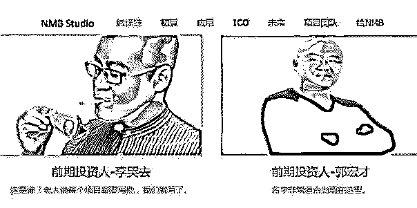

CO 发起人表示，NMB 的持有者可以“参与到嫩模产业当中来”，还能“优先获得改善基因的机会”。发起人甚至打出了“一币一嫩模”的奇葩口号。

真是一本正经的胡说八道，感觉智商受到了侮辱？

虽说现在实现“一币一别墅”的目标还很遥远，但是“一币一嫩模”的理想似乎已经近在咫尺了。

目前，公司的网站已关停。

**颜值链官网 http://www.yanzhichain.com/**

**脑白金「亲友链」**

脑白金的「亲友链」算是刷新了我的三观，这简直比「长区块链」还要烧脑。据脑白金官方介绍的大意是：此项目通过去中心化的微信社区等互联网工具，让用户通过「亲友链」把自己的行为尽可能多的扩散、同步给亲友们，这样有机会获得奖励」。

**请看下图详细报道：**

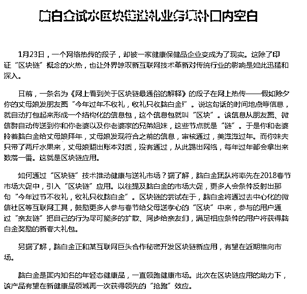

我不知道微信社区什么时候去中心化了？还有我不懂什么叫做把自己的行为扩散、同步给亲友，这样做和发个朋友圈有啥区别，或者说不如发个 GPS 定位？嗯，也许是春节回家探亲的时候，让七大姑八大姨都知道你回来了……

脑白金在区块链的尝试在于，通过去中心化的微信社区等互联网工具，鼓励更多人参与春节给父母送孝心的“区块”中来，参与的用户通过“亲友链”把自己的行为尽可能多的扩散、同步给亲友们，满足相应条件的用户将获得脑白金奖励的新春大礼包。

对此，脑白金此举乃“蹭区块链热点”。

**脑白金官网：http://www.goldpartner.com.cn/**

**“沙币”**

首先表明，这项目不是国人成立的，而是一个俄罗斯土豪圈了一堆沙子，就跑出来 I(撒)C(币)O 了。一个沙币绑定一平米的沙子，计划要募集一堆以太坊。

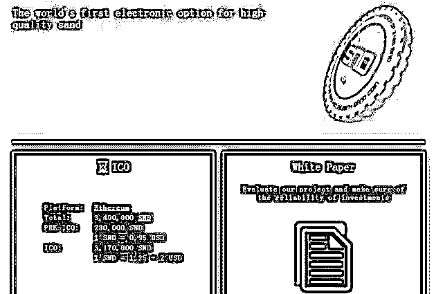

相比嫩模链网络上已经找不到任何项目资料而言，沙币 sand coin 这个项目依然存在着，登录其官网可以下载白皮书。只是我想问问俄罗斯大佬的沙子究竟卖完了没有？

**<span_wxbeditor></span_wxbeditor>**

****基督币****

**基督币的官网上的介绍是基督币是第一个基于预先开采的基督教 Cryptocurrency，它被用于财务上奖励阅读圣经的人，在生活变化 平台上发布/查看内容并与社区互动。奖励可用于补充个人收入，投资未来潜在收益，捐赠给教会，或用于支持全球使命和人道主义工作。**

**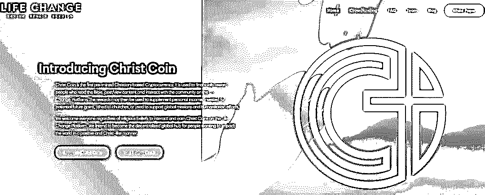**基督币官网****

**我们先不讨论统计人们读圣经有没有意义，即使有意义，这也完全可以用微信群每天打卡解决，还要啥自行车？为啥要开发区块链智能合约？ **

**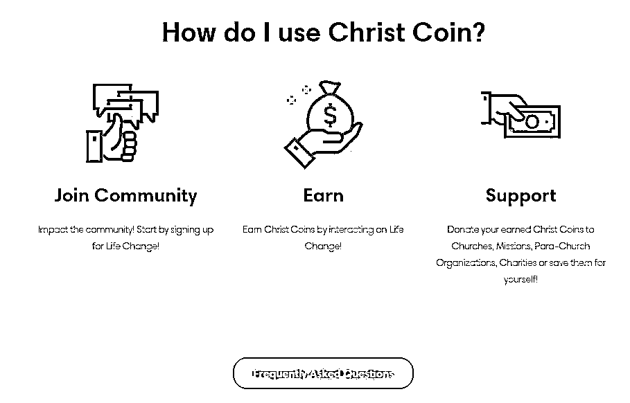**

**<pcolor: rgb="">**基督币发展线路图**</pcolor:>**

**基督币官网：https://christcoins.io/**

**垃圾链**

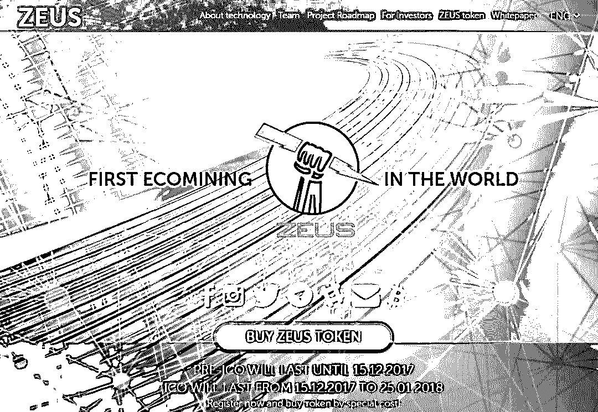

战斗种族俄罗斯人（没错，又是俄罗斯）准备众筹一个垃圾厂，通过处理垃圾来挖矿……售卖热能、生产肥料可再生材料。

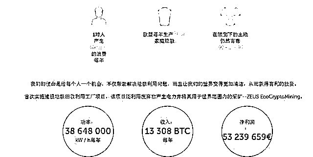

**垃圾链官网上简介**

**垃圾链官网 http://zeus-token.io/eng/**

**「MLGB 币」**

堪称史上最强行为艺术品的奇葩 ICO 项目，非 MLGB 币莫属。是的你没看错，它奇葩的中文名字就叫做「马勒戈币」。据其官网介绍：每一个马勒戈币都将绑定一个云端的人工智能「草泥马」，有自己的「性格和特性」。

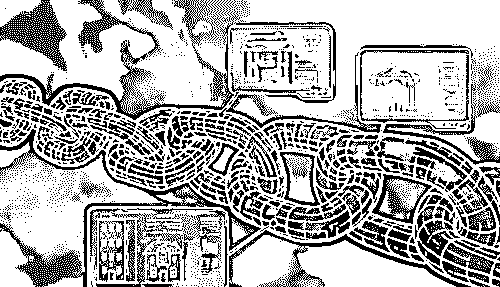

那么人工智能「草泥马」又是什么鬼？「草泥马」是一个基于 DNN 的具有自我学习能力的语义机器人，而且用户可以用 VR 设备与人工智能「草泥马」面对面交流，随着科学技术的进步和交易的活跃，最终可能每个 MLGB 都有自我意识并且觉醒，成为「有温度」的人工智能体。

我怎么觉得好像看了一部山寨版的「黑客帝国」？更离奇的是 MLGB 还发起了一轮「冰冻 ICO」，通过「冰冻 ICO」获得的 MLGB，直到全球变暖达到平均 30℃时才能解冻（请问人类还活着么？），其行为艺术真的是前无古人，后无来者！

**MLGB 真的是项目代币？**

是的，而且它有个奇葩的中文名为马勒戈币。

该项目宣传“马勒戈币，土豪的币，”背景是一望无尽的大草原上的羊驼。

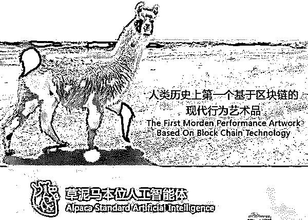

在一望无尽的马勒戈壁上，有一群放浪不羁的羊驼。

**草泥马本位人工智能体是个啥？**

“我们将开发一个全新的 AI 云系统，每产生一个马勒戈币都将绑定一个云端的人工智能草泥马，草泥马在马勒戈壁云中，每个人可以通过互联网访问到每一匹草泥马，每匹草泥马都是一个基于 DNN 的具有自我学习能力的语义机器人，有自己的性格和特性，它可以学习用户输入的语言，并改变自己的沟通方式，随着技术的发展和进步以及交易和交流的活跃，最终可能每个 MLGB 都能具有自我意识而在马勒戈壁云系统中觉醒，因此每一个 MLGB 都是唯一的值得收藏和有增值空间的人工智能体。”

人工智能+区块链，MLGB 不明觉厉。

“MLGB 是史上第一个支持 VR 客户端可视化的数字区块链， MLGB 客户端支持 VR 模式，用户在 VR 设备中可以在马勒戈壁骑着自己的草泥马漫游，并与草泥马人工智能体进行面对面交流。我们认为这种交流将极大增进用户对 MLGB 价值的认同和联系，让冰冷的数字货币变成可触摸、可交流、可沟通、可骑行、可拍打的实物。因为每一个 MLGB 将绑定一只草泥马，不多也不少，它就在那里，在马勒戈壁 AI 云中，就像 20 世纪美联储黄金存储系统的美元的金本位制度奠定了美元国际化货币的基础，马勒戈壁 AI 云是 MLGB 的价值之锚。”

在 VR 设备中在马勒戈壁骑着自己的草泥马漫游，果然是行为艺术……

还有全球气候变暖到 30 度以上才能解冻的冰冻 ICO,否则“每一个冻结的 MLGB 在马勒戈壁 AI 云中都将化身为一尊石像草泥马。”脑洞太大 mlgb。

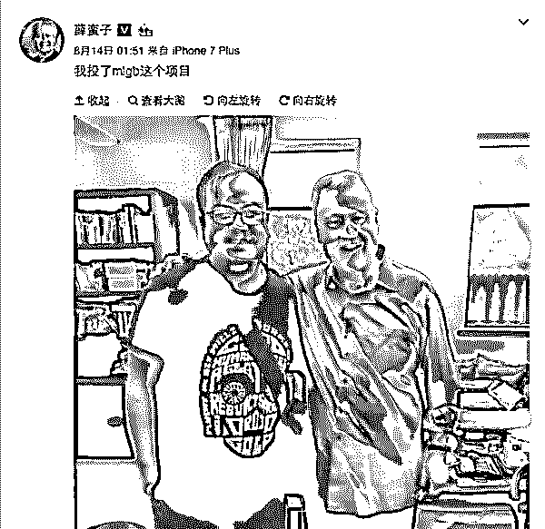

这样听起来天马行空天方夜谭天啦噜的 mlgb 项目，看起来是个笑话，但是天使投资人薛蛮子在去年 8 月 14 日发布微博称：“我投了 mlgb”这个项目。此前，薛蛮子表示短时间内已经投了 18 个 ICO 项目。

薛蛮子发微博称：“一个月以来近距离接触了 ICO 许多项目。一方面体会到区块链技术的革新与伟大。另一方面也因为接触到越来越多的打着区块链招牌的不靠谱项目而担忧。购买这些代币的人们对这些项目的团队技术与市场基本上不做任何尽调与功课，只是希望能一上市就赚个百分之三百五百。这个绝对是不可能持续的，应该降降温了。”

**布洛克城**

公信宝开发了一款名为布洛克城的区块链挖矿产品，用户只需下载相应 APP 即可参与所谓的区块链挖矿功能。

但这个挖矿功能实在是不敢恭维。虽然下载 APP 免费，挖矿也不用投资，但不进行各种验证你是无法用手机挖矿的，首先是你的手机号码，身份证信息需要提交。你的基本信息已经提供给了公信宝。

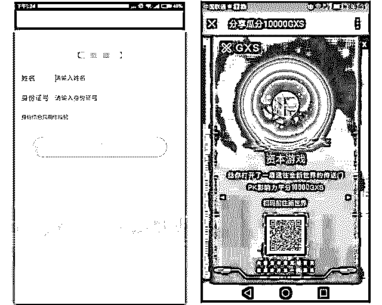

提供了你的基本信息后，可以手机挖矿了，但不进行后续的验证你也许一辈子都挖不了几个所谓的虚拟货币。但官方给了一个方法提高你挖矿算力的方法（感觉挺搞笑）。

就是完善你的个人信息，把所有他认为有用的信息全部提供给他，包括的验证有：人脸识别、支付宝淘宝账户密码、学信网的账户密码、手机服务密码、京东账户密码统统需要提供给他。也就是想挖到所谓的矿，你的个人资料几乎全部暴露给了公信宝官方。

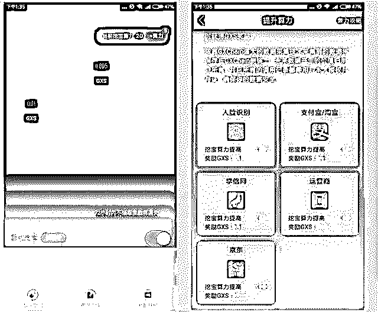

没有任何一个 APP 要求个人暴露自己的全部信息，但公信宝就这样做了，我不知大家怎样想，公信宝需要的个人资料基本就是我们生活中最重要的资料，你的所有密码，账户信息被完完全全的暴露。

虽然公信宝有这样那样的解释，但你感觉把自己最重要的账户密码提供给公信宝放心吗？公信宝收集到你的资料真的不会去做别的吗？

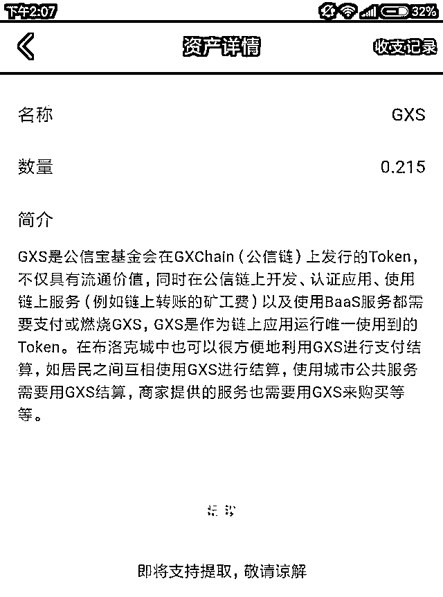

并且即使是你挖到了所谓的虚拟货币，现在也是无法提取的，用一个将来的许愿换取你拥有的个人信息

**布洛克城官网  http://t.cn/RROYdjZ **

**傲游共生币**

路由器能挖矿，手表能挖矿，现在就连浏览器也能挖矿了。

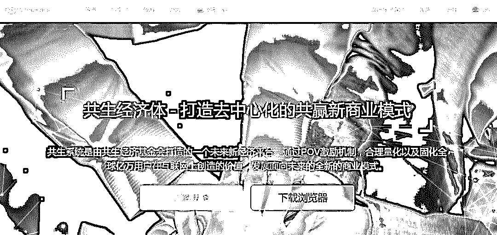

傲游浏览器上线了一款挖矿插件，宣称只要正常使用浏览器就能获得共生币 LVT（共生币是基于先进的区块链技术开发的去中心化的加密数字货币）。

官方表示，共生币是你上网时间、行为价值的体现。除了与其他加密货币一样，可以在全球范围内不受限制地交易和流通，还是使用共生经济体系内一切平台、服务和交易的凭证。

共生币发行总量的 30%将能通过挖矿获得，共计 84 亿个共生币，而挖矿共分为 2 个阶段（目前处于第一阶段）：

第一个阶段是预热期，在此期间，每天将有 1 千万共生币通过挖矿产生，共持续 50 天。所有使用了挖矿程序并满足一定条件的活动参与者（矿工）将分享每天产出的共生币。

第二阶段是正式期，在此期间，剩余的 79 亿个共生币将会在 10 年时间内通过挖矿的形式逐步发放完毕。每年通过挖矿获得的共生币数量都将比前一年降低 40%。

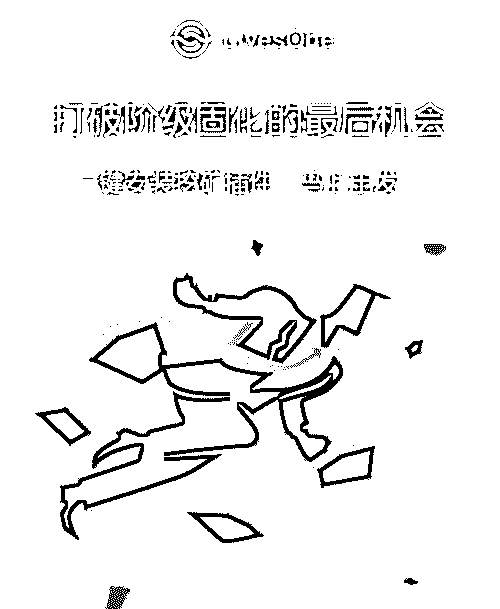

**官网宣传**

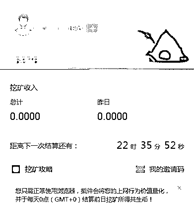

**挖矿界面**

**算力界面**

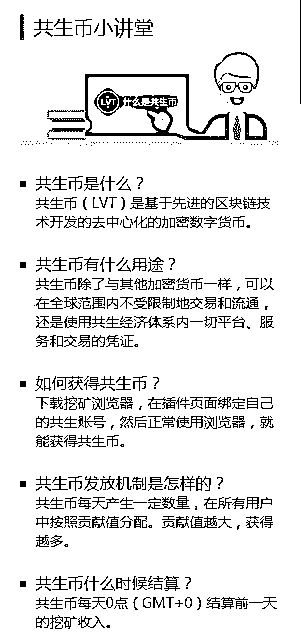

**共生币介绍**

**共生币发生时间表** 

**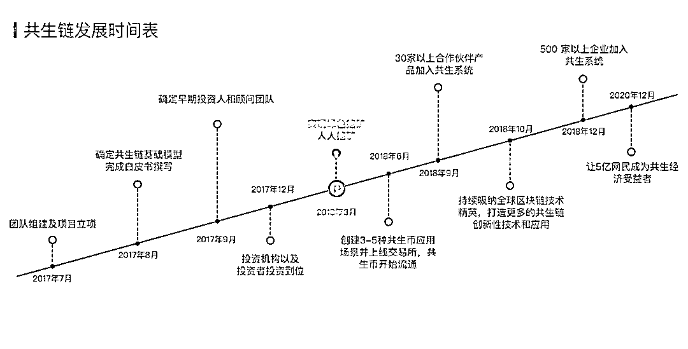**

**共生币运行机制** 

**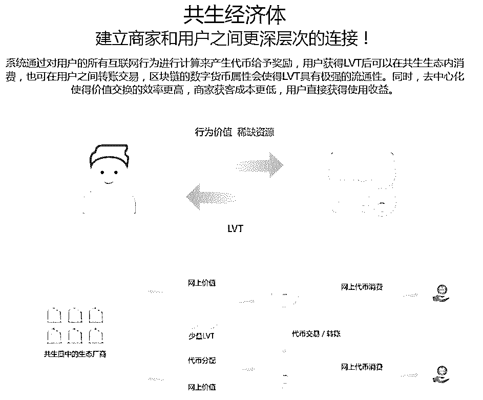**

**共生币官网   https://lives.one/**

**加密羊驼**

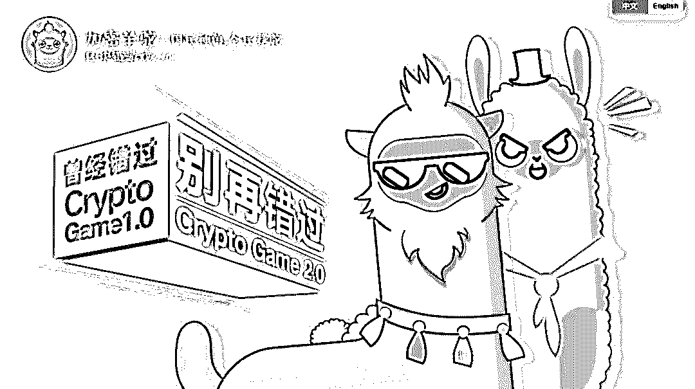

以太坊继**cryptokitties**以后，由国人团队研发的又一款以太坊游戏，分两部分讲下我的看法。

## **一、玩法规则**

新人看完官方的红皮书，大概是和我当时一样，一脸懵逼。经过一段时间的摸索，我来解读一下玩法，仅供参考。

记住以下两点就好**↓↓↓**

1.羊驼属性**：星座、亲密度**

## **二、CryptoAlpaca 是一款怎样的区块链游戏**

玩一段时间看来，cryptoalpaca**应该是一款博彩+养成的区块链游戏。**

虽说每天总羊毛池在 10ETH 左右，145 以上魅力值的羊驼竞拍价格也在 0.06~0.7 之间。但是玩家总量还是太小。

为什么没有像 CryptoKitties 一样爆火？

原因如下：

1、玩法规则相比 CryptoKitties 复杂了一些；

2、没有旁氏的基因，羊驼的魅力值不是固定的，任何一个新玩家进场，只要去生育市场与高魅力值的羊驼生育。他有概率生出一只更高魅力值的羊驼；

3、大户很难操盘，规则太过于透明，导致官方自己也无法做市。

总之，这款相对公平的游戏机制，能走多远，见仁见智了。

**加密羊驼官网 https://www.cryptoalpaca.pet/welcome/**