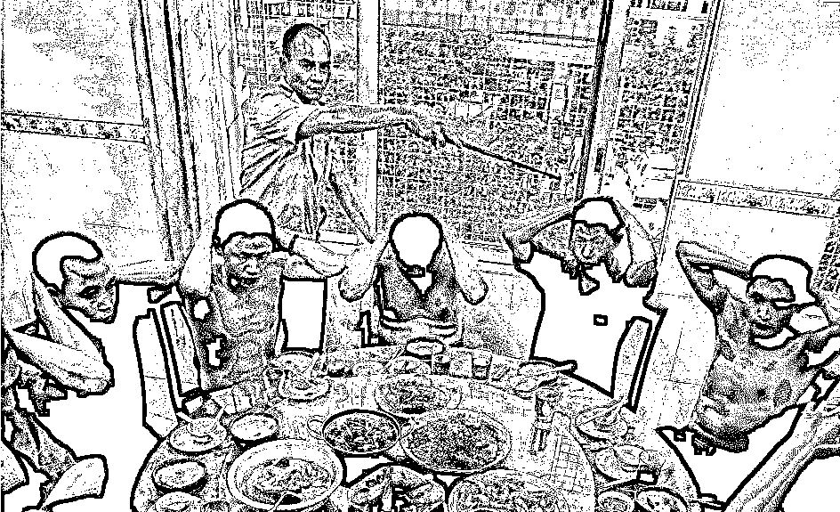
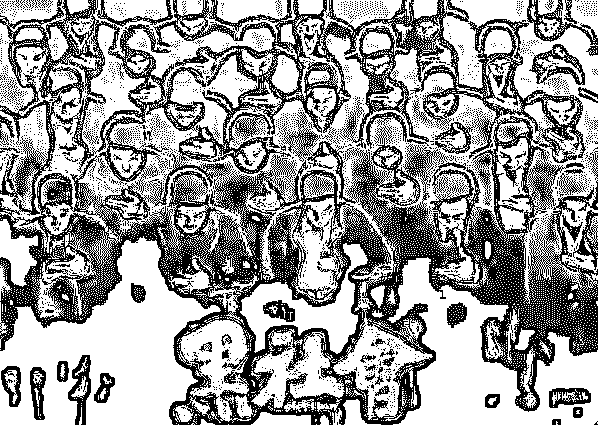
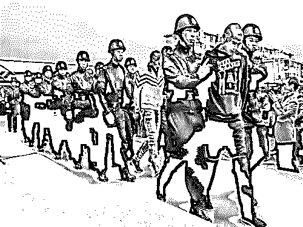
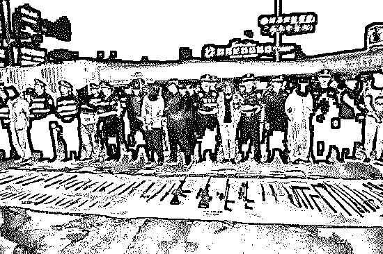
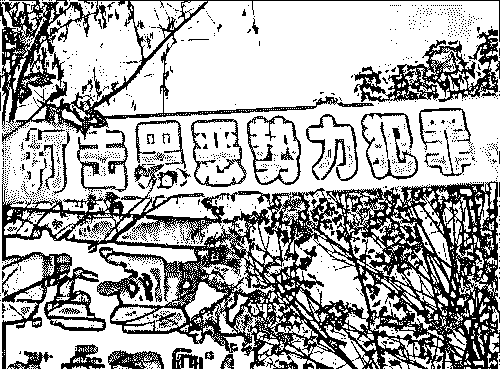
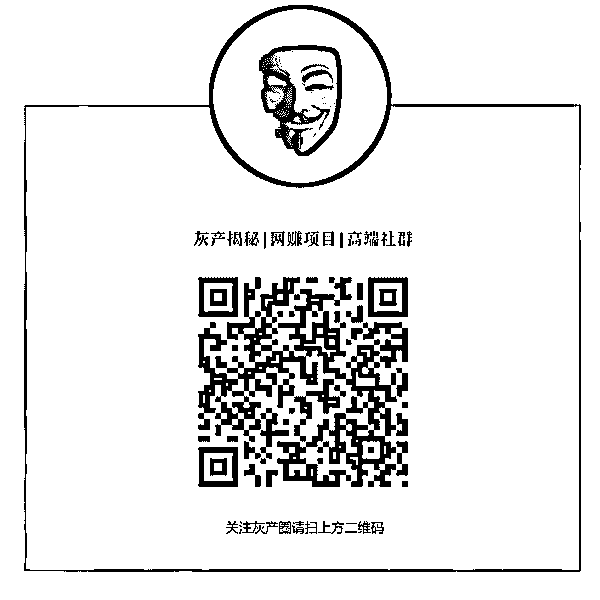

# 一位教授的调研：中国小县城里的黑社会灰色江湖

> 原文：[`mp.weixin.qq.com/s?__biz=MzIyMDYwMTk0Mw==&mid=2247490335&idx=1&sn=d21771f8469e2065d6beed7cf60a06c0&chksm=97c8d027a0bf5931201ff9219f92308a4de09cf43016aa745aa21b92db09541376de11088f98&scene=27#wechat_redirect`](http://mp.weixin.qq.com/s?__biz=MzIyMDYwMTk0Mw==&mid=2247490335&idx=1&sn=d21771f8469e2065d6beed7cf60a06c0&chksm=97c8d027a0bf5931201ff9219f92308a4de09cf43016aa745aa21b92db09541376de11088f98&scene=27#wechat_redirect)

不久前，河北省廊坊市城南医院院长张毅以惨烈坠楼的方式结束了自己的一生。在留下的绝笔信里，他控诉了将他双腿打断的暴徒，以及插手医院正常业务、挪用资金的合伙人杨某。

在廊坊官方的通报中，“迫于舆论压力”，指使暴徒行凶的赵某、以及合伙人杨某均已投案；官方并已启动对于警方是否有不作为、慢作为情况的调查。

死者已矣，查明悲剧背后的真实原因、将不法者绳之以法，是公正二字的题中之义。无论网上目前披露的信息是否真假，基层的黑恶势力，已经成为必须严厉打击、深挖的痼疾。

这篇题为《县域黑社会的生存之道》的文章（有删减），作者是华中科技大学中国乡村治理研究中心副教授吕德文。作者以体验调查的方式，深入中部某县公安局，在当地公安局领导和基层干警的支持下，研究了县域黑社会势力的一些特点，真实地描述出当地黑社会的生态。

推荐给大家一读，相信会有启发。

黑社会是有组织的犯罪集团，因为组织结构较为严密、犯罪手段带有暴力性、反侦察能力较强，使得其社会危害性也比较高。

认定一个犯罪团伙具有黑社会性质是一件非常困难的事，因为即便某一犯罪团伙的社会危害性够得上“严重”，其组织特征也不一定符合黑社会性质。因此，公安机关在打击黑社会犯罪团伙的时候，显得非常困难。在警务实践中，几乎没有一个黑社会团伙是在其内部组织状况被充分掌握的情况下受打击的，公安机关恰恰是从普通社会认知的角度对其侦察、打击，最后以黑社会性质犯罪组织加以清除。

为什么这样说？从理论上说，任何一个“组织”，无论是机关，还是企业，乃至犯罪团伙，要有效率，都会很自然地采用等级制、部门制等科层组织的管理手段。因此，一个“成功”的黑社会团伙必定是“企业化”运营的。

但是，一旦黑社会团伙达到规范的企业化运营水平，也就意味着它基本上摆脱了暴力等低水平、风险高的谋利手段。而一般的犯罪团伙最多只是松散的犯罪联合体，根本够不上“组织”要件，也不能认定为黑社会组织。因此，公安机关真正能够认定为黑社会组织的犯罪集团并不多。

> **1 熟人社会网络**

要准确认识黑社会的“生存之道”，需要有一种生态学的视角。

黑社会不是单个犯罪集团，而是由众多犯罪个体、松散的犯罪团伙、有经营头脑的组织者整合而成的体系；黑社会与正常社会之间有千丝万缕的联系，它必定嵌入在市场社会、人情社会、权力网络之间，并从中汲取营养。

因此，一个完整的黑社会体系，必定有一个联系色谱：黑、灰、白等成分都有。犯罪集团生存的秘诀在于，它努力保证其底色是灰色的，而不是黑色或白色。

一个县域社会有几十万人口，但真正有权有势或许只是几百个人。

我们在县城调研，感触非常深的是，这几百人实际上构成了一个熟人社会网络，相互之间即便不熟悉，也大致了解各自的底细。身处网络中的一个人，如果碰到什么事需要找到网络内的任何一个人，一定可以不费力地找到对方。事实上，我们的调研之所以较为顺利，恰恰是因为获得了这个圈子里的几个关键人物的支持，以至于可以不用过于费力地找到想要访谈的对象。

一般情况下，黑社会老大不会以犯罪分子头目的脸面示人，他们都注册有公司，或从事一些正当职业，许多老大都是跨行业经营。也因此，这些老板交游甚广，他们肯定可以进入这个县的经济经营的圈子，和正经生意人相熟；他们也会因为从事经济活动的缘故，和地方政府领导、公安部门相熟。事实上，仅仅从生意的角度上说，黑社会老大也必须嵌入到地方权力精英网络中。

> **2 产业灰色地带**

黑社会生存的基础当然是暴力，但是，纯粹以暴力为生的黑社会，则几乎是不存在的。因为，黑社会的终极目的仍然是获取利益，而暴力获利的成本实在是太高。黑社会要长期存在，必须有赖于产业支撑；只不过，其产业利润很大程度上来自于由暴力威胁所维持的垄断市场。

从我们的调研来看，在地方社会中，黑社会从事的产业具有一定特点。

黑社会基本上都是草根出身，不太可能出自大资本，也没有多少文化知识，这就注定了这些黑社会组织只能从事一些低端产业，比如经营宾馆、娱乐场所，从事建筑等行业。这些产业基本上都是劳动密集型产业，也需要和各方打交道，黑社会因此具有一定优势。

比如，宾馆、娱乐场所往往是黄赌毒等黑色产业的聚集地，一般生意人不愿意冒风险。排除干扰的最好办法是，和那些有势力的地方力量合股经营。

再如，这些年城市资本开始大举下乡，各个县城都在搞房地产、工业园区，实力雄厚的老板们做一些资本运作，进行产品营销即可，也不在乎低端产业的一点小利益；但这些高端行业要在地方社会顺利进行，又少不得低端产业的配套。典型如碰到征地拆迁问题，大企业当然不愿意碰这个矛盾，而将相关业务“转包”给那些具有黑社会势力的“拆迁公司”是最保险的做法。

我们调研的这个县还没有星级宾馆，但有名的一家宾馆就是一个有名气的混混开的。在征地拆迁过程中，必定有黑社会主动或被动地介入其中。

黑社会从事的产业大多具有一定的垄断性，这个垄断产业或者是由于地域闭塞造成的，或者是由于产业单一性造成的，抑或是由资源稀缺性所形成的。总之，只要稍微耍点暴力威胁之类的手段，黑社会便可以方便快捷地控制这个产业。

我们调研的这个县，存在黑社会控制的产业大致有三个：长途班线、米粉批发、土石方工程。

长途班线的营运需要交管所颁发客运许可，这就决定了每条线路可营运的客车数量是相对固定的，客运利润非常有保障。交通局当然只能把客运许可颁发给具有营运资格的客运公司，可绝大多数客运公司自己并不投资购买客车统一营运，而是让一些大大小小的老板“加盟”，客运公司获取管理费，而客车老板则自负盈亏。有资金实力营运客车的老板不少，但能够有效管理线路的老板却不多。

为了避免被滋扰，绝大多数老板都愿意和黑社会势力合股。他们之间分工明确，台面上的老板负责规范经营，黑社会势力维护垄断市场秩序。

2010 年，该县交通局引进了十多台出租车，但营运没多久，就被庞大的三轮车市场挤垮了，大部分出租车司机改走长途，尤其是从县城到市区之间的线路。很显然，这对长途客车市场是个巨大冲击，这几年，两个行业之间的冲突不断。

我们调研的第一天，就发生了出租车司机围堵县政府大楼的群体性事件，原因是一位出租车司机被一位客车乘务人员打了。很多人都心知肚明，这位“乘务人员”的行为是当地黑社会势力授意的。

米粉批发也为黑社会所控制，这多少让人奇怪。不过，仔细分析却也符合常理，因为米粉市场太适合黑社会势力介入“管理”了。

我们调研的这个县喜欢吃米粉，尤其是早餐市场，米粉的销量极大。可以想见，米粉虽然不起眼，但利润却可观、有保障。然而，全县大部分米粉都来自于县城几个较为大型的批发店，这就意味着，只要控制了这几家店的米粉销售，全县米粉的垄断利润就容易获得。

这就为黑社会势力创造了空间：当地黑社会势力派几个混混上门给这几家店的老板“做工作”，要求每斤统一提价 2 毛钱，这 2 毛钱的额外利润给黑社会。2 毛钱的差别，对老百姓而言几乎没什么影响，批发店的老板也没什么损失，黑社会却不知不觉中获取了可观利润。于是，当地一些见多识广的人都发现一个奇怪的现象，该县的物价和周边县没什么区别，唯独米粉价总是要高个几毛钱。

土石方工程的利润上升，则与近些年来县城房地产热有直接关系。县城房地产除了一两家外来大资本，很大一部分由本地资本投资。而无论是本地资本，还是外地资本，其大多数下游产业土石方工程都由具有黑社会背景的公司承担。

土石方有两个直接相关的垄断业务：河道砂石开采和拆迁。河道砂石开采是土石方工程的重要基础，之所以容易被垄断，与这一产业的资源稀缺性有关：它同样受到相关部门的严格控制，一般老板难以进入这一领域。至于拆迁业务，大家心知肚明，因为只有暴力才能“突破”钉子户抗争难题：在政府对于使用暴力越来越慎重的情况下，黑社会的非法暴力已经成为一些地产商的依靠。

> **3 这一行的两条“底线”**

黑社会要长期生存、“发展”下去，需要解决几个问题：一是来自黑社会内部的斗争，团伙之间、老大之间，如果竞争失序，就有可能两败俱伤；二是来自精英网络内的变化，一个老大过于嚣张，或其保护伞意外落马，都有可能招来灭顶之灾；三是来自产业经营的能力，如果经营不善，也可能导致黑社会团伙难以为继。

一般而言，一个地方社会中，总会有几个相互竞争的团伙势力，他们之间呈现出不同的关系。如果只有一个老大，则老大需要处理其内部不同势力之间的关系，也需要审慎处理代际交替危机。如有几个势力相当的老大，他们很可能划界而治，不同的地域、不同的产业由不同的人马控制。

在我们调研期间，这个县的娱乐行业极为萧条，县城中心广场的几家娱乐场所都因生意不好而关门歇业。客观原因是，这两年地方政府严格执行八项规定，对于这个内陆县城的娱乐业而言，这无异于釜底抽薪。直接原因是，当地公安部门严厉打击黄、赌、毒，使得这个行业的风险极高。但一个较为重要的原因是，当地黑社会势力在前两年元气大伤，势力最大的团伙老大被抓，他们所控制的娱乐行业当然也再难成气候。

一般情况下，公安局的主要领导（局长、政委）都必须是异地任职，这会对黑社会势力的生存网络造成冲击。如果新局长实力雄厚，且很想有一番作为，当地黑社会团伙要么屈就，稍微收敛一些；要么就想尽各种办法，尽量与其勾连上关系。

在我们的调研中，负责治安的干警和派出所所长就直言，他们刚上任的时候，都有团伙头目通过各种熟人关系前来套近乎、请吃饭。甚至有头目明确请求，每年自愿缴纳一定费用，但让其经营的色情场所少受检查。这当然遭到严辞拒绝。除了公安干警无法被收买之外，这个团伙承诺一年缴纳的费用，还不如被抓一次罚的款多。

在公安局内部人士看来，完全将黑社会根除困难重重，因为黑社会所赖以生存的网络很难拔出，要非常艰苦的努力和高超的博弈技巧。

一个管理得当的黑社会团伙，马仔们犯事一定不会供出其小头目，而小头目犯事也不会供出老大，大多数老大被抓进去了，也会尽力保护其保护伞。为什么？这得益于黑社会内部的组织保障机制。

有经验的团伙成员都知道，供出其同伙很难减轻其刑罚，严守秘密却会得到“组织”的奖励：不仅其家人会受到团伙的优待，出来后本人也会受到重用。而老大们之所以不会供出其背后的保护伞，主要是基于维护团伙的生存网络考虑。老大们如果出来还要混，就不可能做出损人利己之事，否则有谁还愿意提供保护？因此，江湖义气并不仅仅是黑社会意识形态，更是团伙生存的技术要求。

前两年，该县最大的黑社会势力被端掉，某种意义上并不是团伙组织失败所致，而是黑社会生存网络剧变所致。这个团伙被端掉的导火索是团伙的一个小角色犯了命案，公安局掌握的证据无法指向团伙老大，但从逻辑上看，这个命案肯定是团伙的“组织”意图。

命案发生之时，刚好新市委书记到任，很快将此案件作为典型，掀起了打黑除恶的运动。市局和县公安局联合破案，花了很大精力将这个团伙所有犯过的案子整理出来，先以开设赌场的治安处罚为名将“老大”抓起来，然后放出风说这个老大因命案被抓起来了。被抓凶犯信以为真，终于招供了。至此，该黑社会团伙被连锅端，但却没有涉及一个政府公职人员。

不过，这个团伙的覆灭虽然不是组织失败的结果，却是技术失败的典型，因为他们破了这一行的两条“底线”：一是不要犯命案，二是不要影响地方政府的中心工作。

只要发生了命案，地方政府很可能将之从普通的刑事案件上升为政治案件来处理；而只要没有命案，就很难有这个可能性。从技术角度上说，黑社会团伙如果不犯严重的刑事案，安全性就会大大增加。

从公安局破案的内部视角看，案件的不同类型决定了破案力度的不同。治安案件和较轻的刑事案件一般由派出所和治安大队管辖，他们办案的技术条件有限，不可能深入追踪普通案件的背景。而如果让刑侦大队来主办案件，则可以非常方便地使用各种刑侦技术（如调取犯罪嫌疑人的所有信息，采取必要的监控措施），很容易掌握案件背景，并挖掘出案中案。理论上，只要刑侦大队不计成本地投入，绝大多数案件是可以侦破的。

因此，老道的黑社会团伙，一般都会尽力避免采用非法手段。即便不得已采用暴力，也会有效规制暴力程度，尽量不发生刑事案件。他们都知道，一旦出了人命，事情就会搞大，后果难以预测。

黑社会团伙也要懂政治。现在一些普通的政治常识已经融入到公安局的办案规律中，这个大多数黑社会团伙都知道。比如，在“严打”时期，大多数黑社会团伙都懂得这个时期要收敛一些。一些善于经营的团伙势力，甚至还会主动提供给公安局合适的“战绩”。

但一些更深层次的政治，就要考验老大的智商了。在我们调研期间，县委、县政府的主要领导正下决心把该县的一个黑社会团伙打掉。因为他们在园区建设过程中，干预征地拆迁工作，一方面怂恿村民做钉子户，另一方面又和乡镇政府接触，要求承包园区土石方工程，试图“吃了政府吃村民”。

这种染指重点工程，影响县里中心工作推进的做法，等于是在公然露头，挑衅政府权威。结果必然是引发公安机关集中兵力侦查，找到更多有力的证据，加快打击的进程。

**作者：<span_wxbeditor></span_wxbeditor>**

****

****【灰产圈】高端社群 小程序 已开通，社群成员突破 1000＋**** 

**<mp-miniprogram class="miniprogram_element" data-miniprogram-appid="wx4f706964b979122a" data-miniprogram-path="pages/topics/topics?group_id=881854415822" data-miniprogram-nickname="知识星球" data-miniprogram-avatar="http://mmbiz.qpic.cn/mmbiz_png/kialtkOXGKS7D9hZrmO2jzDqryXXTAlhxSpnrKnHGV65KXzicibOppaPic4dCRxftvabB8Iqswo3OuQEDSxE7NicXBg/0?wx_fmt=png" data-miniprogram-title="【灰产圈】高端社群" data-miniprogram-imageurl="http://mmbiz.qpic.cn/mmbiz_jpg/WWG78hysZ0brJkWoyG2VDIacqgQjkDfp6mLiaoPBJ2SgWZHtRuTw7ia8kpoxntsn7PiaFOQO2U23FW6Iry0gS1GnA/0?wx_fmt=jpeg"></mp-miniprogram>**

****

**点击“阅读原文”加入高端社群**