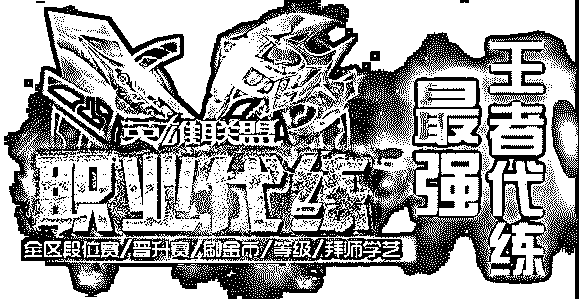
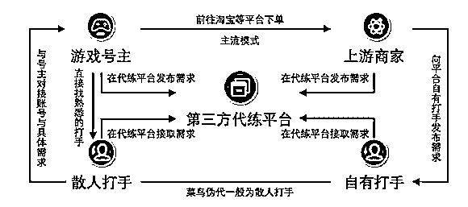
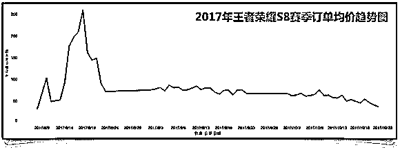
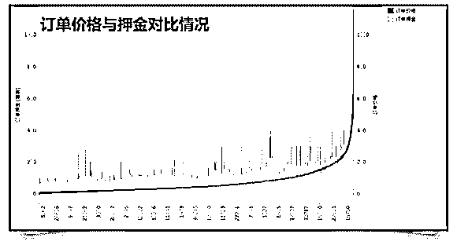
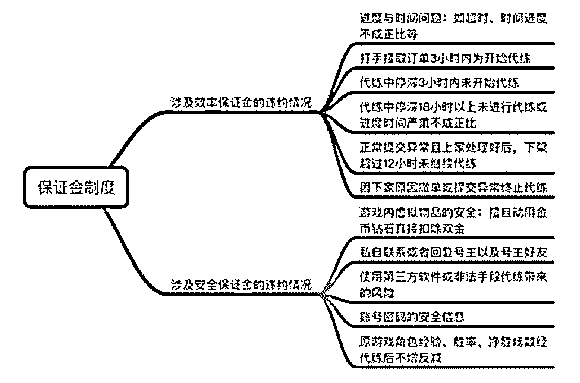
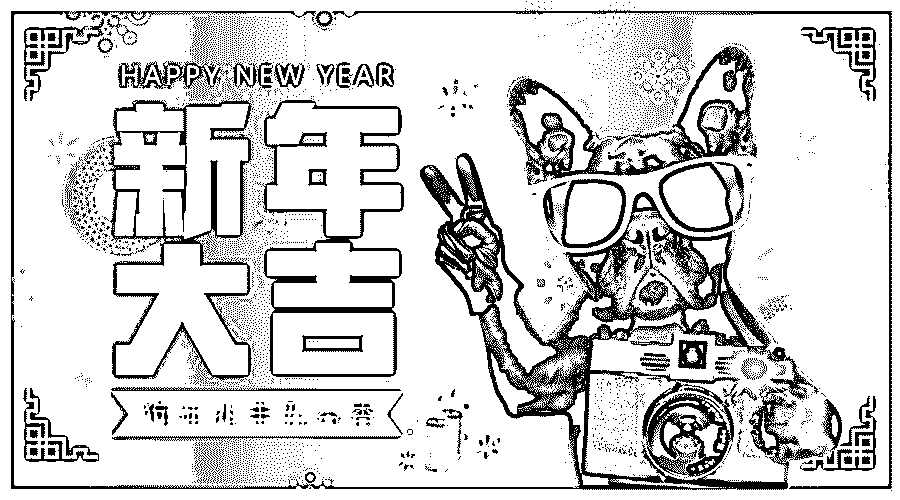

# 深度|日流水超 500 万游戏代练的盈利模式：游离于陪练和外挂之外的灰色产业全揭秘！

> 原文：[`mp.weixin.qq.com/s?__biz=MzIyMDYwMTk0Mw==&mid=2247490278&idx=1&sn=99dc17a3afe8cdf7d29ece8fe0ee672d&chksm=97c8d1dea0bf58c88103472e9e96ead17ca987808d38ef045ee12af3c541f4d57bbec0102ca9&scene=27#wechat_redirect`](http://mp.weixin.qq.com/s?__biz=MzIyMDYwMTk0Mw==&mid=2247490278&idx=1&sn=99dc17a3afe8cdf7d29ece8fe0ee672d&chksm=97c8d1dea0bf58c88103472e9e96ead17ca987808d38ef045ee12af3c541f4d57bbec0102ca9&scene=27#wechat_redirect)

**导语：**

去年，王者荣耀火了。这款现象级产品，不仅自身拥有着令人惊叹的用户规模和吸金能力，更像是产业发动机般促进了游戏代练产业的爆发。这条互联网灰色产业链，仅在淘宝平台，每天就有超过 500 万的营业额。然而，看似火爆的吸金行业，却存在着骗局：厂商封号代练猝死等种种乱象。究竟这条饱受争议的地下产业链，是依靠怎样的规则来运转，代练者又究竟能否如外界所想象的那样赚的盆满钵满呢?下面，我们将带领大家一起窥探代练冰山下的一角。

> **1 行业背景**

**游戏代练定义**

游戏代练，区别于陪练和外挂的灰色产业。即按照网游玩家们的要求，在指定的时间内帮助他们快速提升游戏角色级别或者获取高级装备武器，从而得到网游玩家们给付的相应的金钱。

区别于陪练：游戏陪练是陪客户玩网络游戏，提供随程语音、文字聊天服务，收取一定的陪玩费。相比陪练，代练效率更高。

区别于外挂：外挂是利用电脑技术改变游戏的部分程序制作而成的作弊程序。但被游戏封号等风险较高。相比外挂，代练安全性更高。

**行业供求情况调查**

问卷调查显示，约 9%的游戏用户使用过代练服务，也就是十个玩家中当中约有 1 人使用过代练。在态度方面，有近半数用户表示代练的存在具有一定合理性，3.7%的用户表示会支持代练服务的继续存在。

用户使用代练服务的原因：对于使用过代练服务的用户来说，段位升级太难是最重要的原因，而对于未使用过代练服务的用户来说，遇到太多坑队友则是他们可能会选择代练服务的主要原因。

**代练行业的形成**

代练的雏形是基于朋友情谊的帮忙，商业代练的雏形是用货币或物品交换的方式来进行代练，商业代练产业的雏形是由于越来越多的人产生需求，开始形成规模产业。

> **2\. 产业链角色分析**

**（1） 游戏号主**

代练的需求者，也就是账号的主人。这些号主就是订单的直接产生者，是代练产业链中永恒的甲方爸爸，也就是代练产业的金主爸爸。

**（2）上游上家**

商家，即发单商家，他们在淘宝有自己的店铺，通过店铺收集号主们的代练订单，然后再将这些代练需求交由打手完成。依据打手来源，又可分类为自有打手与接单打手。

**（3）代练平台**

第三方担保机构，为发单商家聚拢打手资源，提升商家的工作效率和接单、完单率;打手能通过平台获得一份保障。形式多样，既可以是 web 和 App，也可以是微信和 QQ 群

**（4）专业打手**

打手是代练需求的完成者，同时也是代练产业链中的最底层。包括自有打手和散人打手两种类型：

自有打手：店铺直接招募管理的，多数消费者认知范围中的模式;

散人打手：市面上主流的打手，基本都是独立的个体，和商家并无直接的隶属关系。

**（5）菜鸟伪代**

伪代的主要群体为大学生、高中生，也有一部分初中生，水平参差不齐。菜鸟伪代通常出于对实力的盲目自信(通过代练升级到高段位就认为自己可以代练了)，或想要在代练过程中提高水平，他们不大计较代练收入，而是想要证明自己的实力。

> **3.常见的代练渠道**

**（1）私人接单：在游戏内部频道或用户社群发布服务**

打手在游戏 APP 内部频道，如王者荣耀大厅发布服务讯息，需求者通过查看打手资料(英雄胜率、段位等)来进行选择，价格、安全性、上分可靠度均较低。

打手在代练内部交流 QQ 群，以及游戏用户社群中发布服务讯息，积累初始用户。这类服务相对价格更高，更可靠，用户粘性更强。

**（2）淘宝代练**

顶尖代练工作室：实体店+一家销量好评如云的淘宝店+靠谱的打手在店里打单+专业的客服，甚至有做饭的阿姨，这类代练工作室不需要刻意去拉单，凭借淘宝上的推广活动就有足够的客源及良好的运转，当然每一笔单都价格不菲，但质量也都是相对较好。

二级代练工作室：一个像样的淘宝店+能看得过去的销量和好评+一些线上打手，这类淘宝店的店主大多需要到代练平台拉单子，日单量不稳定，每笔订单都要抽取高额佣金。相比私人代练价格更高，但也更有保障，即使打手没打好，店主也会为了好评和信誉尽量给客户满意的答复，这种店铺质量也比较高，当然相比顶尖工作室价格和保障性稍微低一些。

**（3）主播接单**

通过主播，二线职业队员代练上分。选择这类人代练上分，相对来说可靠性比较高，但是价格也比较高。一般来说，小主播主要收入靠的是代练，同时借此提高人气。

**（4）代练渠道用户调查：淘宝、社群为主**

在代练渠道的选择上，用户更偏爱游戏社群(游戏内部频道、贴吧等)和淘宝商家。淘宝和社群服务更加精准垂直、用户入口更浅，更容易取得用户的信任，代练平台和游戏主播则相对入口较深。

> **4\. 差价盈利：海面上的礁石**

**代练定价模式**

**（1）等级越高难度越大**

段位越高，代练价格越高;跨段位升级由于难度系数更大，因此相对代练价格也更为高昂。

**（2）游戏区服与定价**

根据对游戏代练服务网的数据分析，我们发现定价与区服存在一定联系，总体上，苹果区服>安卓区服，微信区服>QQ 区服。

从机型消费能力来看，苹果区服玩家可接受消费水平更高，上分相对难度更高;从游戏平均年龄来看，微信区服>QQ 区服，游戏配合度更高，开黑更容易。

**（3）铭文英雄与定价**

代练服务的定价与游戏号主的铭文和英雄也密切相关，如果铭文和英雄无法满足代练要求的等级，代练难度更高，价格自然更贵。

两相对比，铭文更为重要，因为高铭文对某些要求更高技巧的强大英雄来说是必须的，否则会影响操作。

**（4）要求完成时间与定价**

订单要求完成时间越长，价格相对越不稳定，高价订单出现频率越高;

而订单要求完成时间越短，则价格相对更为稳定，低价订单出现频率更高。

这主要取决于游戏玩家对代练的要求难易程度、特殊程度。一般来说，越模式化、普通化的订单要求完成时间越短，越个性化、高难度的订单要求完成时间越长。进而影响到服务定价。

**（5）价格波动规律**

代练价格的波动与游戏赛季周期关系密切，赛季初高，赛季末低，且赛季中价格基本呈持续走低趋势。这是由于赛季末玩家升级后的段位，会在赛季初倒退，代练的意义因此也无法凸显。因而赛季末容易出现低价订单，而菜鸟伪代往往会接取这类订单。

**（6）打手收入的二八原则**

不同阶层的代练收入往往差距极大。渠道，名气以及技术水平决定着从业人员的定价和单量，进而影响其收入水平。其中，最大的影响因素就是名气。

职业代练：月入 2w+，基本只接高段位单子。还可以通过收徒、主播等方式赚钱，一个徒弟?1888/年。

兼职代练：主要通过平台接单，月收入勉强过 5k，打中高段位的偏多，收入相对可观，但用代练养活自己较难

> **5\. 利润分成**

差价盈利模式之下，商家和平台的利润稀薄。一般来说，分成的方式为，打手收入=订单价格-商家抽成-平台抽成。根据访谈调查，商家所占抽成比例为订单价格的 35%，平台为 5%-15%，打手为 50%。商家和平台的占比较低。

> **6\. 撤单率**

我们对游戏代练服务平台的订单状态进行分析，发现状态为&ldquo;已撤单&rdquo;的订单占比 23.92%，也就是说每 10 单就会有 2 单无法成交，撤单率相当之高，这是否意味着商家和平台亏损更多了呢?

> **7.押金盈利：深海下的冰山**

** 押金制度的根源**

所谓押金盈利，即商家和平台依靠向打手收取押金来赚取利润。押金之所以存在，是由于背后隐含的用户需求。

在问卷调查中，超过 50%的用户对代练的安全问题表示担忧，比如外挂封号、账号风险等等。

一方面，这源自于用户对代练行业的刻板印象，另一方面，也反应了当下代练行业的安全问题。我们在访谈中也发现，依旧有不少打手在保证金制度之下使用外挂。

保证金究竟保障了谁?或许它的确对打手形成了一定约束，然而最大的受益者却不是用户，而是商家。

** 代练平台的押金模式**

代练平台一般向打手收取两种保证金，分别为效率保证金和安全保证金，前者针对代练过程中的安全事故(涉及账号信息的问题)，后者则针对代练过程中的效率事故(涉及代练时间的问题)。下图是打手常见的工作流程和平台的押金模式。

**押金盈利模式**

代练平台如何依靠押金来赚钱，甚至是赚取暴利呢?我们来一步步分析。

首先，我们发现，在代练服务的低价区中，押金高于价格的情况非常普遍。

其次，我们抽取平台中的一张订单，计算商家在差价盈利(即赚取抽成)和押金盈利(即赚取押金)模式下的收入。订单价格为 21 元，押金为 50 元。当订单成交时，平台可收入 21*0.35=7.35 元，当订单未成交时，平台可收入全部的保证金 50 元。说明了两点，纯靠差价收入利润十分微薄;看似不起眼的押金之下隐藏着暴利。

最后，撤单率与商家的收益也存在关系。撤单率越高，商家获取的收益越大，未成交的订单当中隐含着高额的收入，商家完全有理由希望订单不要成交。

** 押金盈利模式总结**

经过上述分析，我们总结押金盈利模式如下。即使押金是高额盈利的一种手段，但对在实际市场中这种盈利模式占比多高产生了疑问，因此接下来我们将针对整体市场进行深入调研，对比差价盈利模式和押金盈利模式，研究整个市场机制下哪种盈利模式占主流及其背后的原因。

> **8\. 模式对比：押金盈利成为主流**

** 押金盈利成为主流现象**

我们截取了代练通商家;游拍网络王者店;11 月 27 日的待接订单，该商家总发单量为 24000，其中客服介入撤单 4000，友好协商 2000，撤单率为 25%。在上述数据的基础之上，我们对该商家两种盈利方式所获收入进行了计算和对比。可以发现，差价盈利仍是主要盈利来源，然而押金盈利所占比例同样十分可观。

我们进一步将订单分解为低价单和高价单，以 25%作为保守撤单率，分别计算全部撤单和全部结算时收入。低价订单押金盈利所得远大于差价盈利所得;而高价订单则两者相差无几。

同时如果考虑到订单的重复流转，商家接到订单后，会在代理平台上刻意缩短时间，一旦打手打单失败，商家可获取到保证金的收入，单子再次放到代理平台，一份订单就可以获得几项保证金收入和差价收入。

因此，从数据分析的角度，利用押金机制获取的盈利(包括撤单流转的差价收入)所占比例更加可观(尤其是低价订单)。

同时，行业从业人员的访谈，也验证了押金盈利成为主流现象的观点。

**押金盈利成为主流的原因**

**（1）押金盈利带来的利润高于差价带来的利润**

平台或商家按照订单原价，甚至贴钱给代练打手。打手在代打过程中无事故，则平台或商家不盈利。然而打手一旦出现事故，即崩单，就必须给付高额保证金。那么对于商家和平台来说，只需要以超低价大量接取代练订单，接着坐等打手崩单，就可以稳赚不赔。

更甚者，商家会通过撤单，高押金低佣金的方式来骗取小白代练的保证金，不过属于极少数。

**（2）崩单率高：提供获取押金收入的几率**

打手水平参差不齐：低端打手和菜鸟伪代数量庞大，与中高端打手相比，更容易崩单。且中高端打手一般有自己的用户渠道，低端打手和菜鸟伪代往往是平台和商家的主力。

游戏代练情况复杂：打手接单后需要面对不熟悉的英雄、复杂的账号和对局情况、以及因缴纳保证金带来的压力。代练车队晚上工作，容易发生代练撞车。

外挂打单降低保障：一些打手会使用外挂打单，封号概率加大，安全保障降低，同样容易崩单违约。

我们计算了一些代练通商家计算撤单率情况，发现基本维持在 20%左右。同时访谈调查中也从内部从业人员处了解到，代打的崩单率为 7:1。

**（3）保证金制度漏洞：规则制定者的胜利**

商家可自己制定要求和规则，违反要求则扣除保证金。我们整理了目前代练平台常见的保证金制度。除图中所示制度外，还有如完成订单后上截图，少一张图扣 5 块等苛刻罚款制度。

> **9\. 总结展望：未来何去何从**

**黑心商家的养成之路**

从拼情怀带领游戏高手一起发家致富，到用保证金漏洞坑黑中低端代练，黑心商家的养成离不开自身的无奈、行业的纵容、打手的让步。恶性循环之下，个别平台的缺德行为逐渐发展成为整个行业的潜规则。

** 小白代练的成长之路**

从满怀热血的游戏玩家，成为四处碰壁的菜鸟散代，再到建立人脉的高端打手，开设直播甚至摘取大神称号的职业打手，最终成为集万千荣耀于一身的电竞选手。游戏代练既是起点，也是决定成败的转折点，把握住成功机遇的只有寥寥少数。

对于代练从业者来说，来自外界和自身压力太多，无论是为了赚钱、抑或为了梦想，这条道路都算不上好走。代练生存环境的改善，既需要代练商家和平台对这些年轻人多一些宽容和机会，比如一定的训练，直播设备以及晋升职业战队的途径等;也需要代练从业者清楚认识自己的实力和目的，而不是盲目打转。

**延伸阅读：**

[深度|游戏世界里的“外挂江湖”：道高一尺，魔高一丈！论黑客和白帽之间的博弈之战！](http://mp.weixin.qq.com/s?__biz=MzIyMDYwMTk0Mw==&mid=2247490080&idx=1&sn=1b34ff33182cef572cd50758e15de1d9&chksm=97c8d118a0bf580e3cbe9061d802a3949740de23df666d4df8c3b8226f4736791ca9679f110a&scene=21#wechat_redirect)

[深度|“绝地求生”外挂江湖：黑暗中崛起的灰色产业，年产值上亿美金！](http://mp.weixin.qq.com/s?__biz=MzIyMDYwMTk0Mw==&mid=2247489918&idx=1&sn=0a28eda8279e7c194d5e2f6bcda6556c&chksm=97c8d246a0bf5b507141f146431442410f38c62e34b5b8aa7c895d3b2bd6ced0e08ab84933ca&scene=21#wechat_redirect)

* * *

**【灰产圈】高端社群 小程序 已开通，社群成员突破 1000＋，2018 年社群 重点开发区块链项目**

<mp-miniprogram class="miniprogram_element" data-miniprogram-appid="wx4f706964b979122a" data-miniprogram-path="pages/topics/topics?group_id=881854415822" data-miniprogram-nickname="知识星球" data-miniprogram-avatar="http://mmbiz.qpic.cn/mmbiz_png/kialtkOXGKS7D9hZrmO2jzDqryXXTAlhxSpnrKnHGV65KXzicibOppaPic4dCRxftvabB8Iqswo3OuQEDSxE7NicXBg/0?wx_fmt=png" data-miniprogram-title="【灰产圈】高端社群" data-miniprogram-imageurl="http://mmbiz.qpic.cn/mmbiz_jpg/WWG78hysZ0brJkWoyG2VDIacqgQjkDfp6mLiaoPBJ2SgWZHtRuTw7ia8kpoxntsn7PiaFOQO2U23FW6Iry0gS1GnA/0?wx_fmt=jpeg"></mp-miniprogram>

点击“阅读原文”加入高端社群。