# 深度解读|深挖互联网彩票灰色产业链！当彩票遇上互联网：无数人倾家荡产，颠沛流离！

> 原文：[`mp.weixin.qq.com/s?__biz=MzIyMDYwMTk0Mw==&mid=2247490233&idx=1&sn=766482b6e18d16f6565bb593a69ae5b5&chksm=97c8d181a0bf5897e78dee2fbd0f9b7973452b7aee184b79c126d2bc9706aa87dcce7df5402c&scene=27#wechat_redirect`](http://mp.weixin.qq.com/s?__biz=MzIyMDYwMTk0Mw==&mid=2247490233&idx=1&sn=766482b6e18d16f6565bb593a69ae5b5&chksm=97c8d181a0bf5897e78dee2fbd0f9b7973452b7aee184b79c126d2bc9706aa87dcce7df5402c&scene=27#wechat_redirect)

**导语：**

说起互联网彩票，它曾经历过井喷式增长的辉煌时期，据统计，在 2014 年互联网彩票销售规模达到 850 亿元！

可惜好景不长，由于处于灰色地带、管理盲区，终究还是没能逃过停售整改的悲惨命运。

然而，很值得创业者深思的是，互联网彩票行业是怎样进行用户获取转化的？

在这条灰色产业链的背后，互联网彩票又是如何玩转运营逻辑、获取巨额收益的呢？ 本篇文章将给你答案。

> **楔子：互联网销售彩票要解禁？**

回忆起四年前世界杯期间的买网络彩票的狂潮，各位灰产圈粉丝是不是还记忆犹新？在那段时间，中国很多“彩迷”陷入了疯狂的“赌球”热潮，无数人竟然因此而倾家荡产。

在狂潮之下，网络彩票的各种灰色产业地带浮出水面，从而导致了被禁封的悲惨结局。

然而在 2017 年 8 月份，在这块被国家封印的禁区，好像有了松绑的迹象，越来越多的平台找到了自己的突破口，开始偷偷摸摸的销售彩票。

在去年 8 月，财政部门表示，将会和有关部门进一步研究完善互联网销售彩票监管的政策，统筹规划线上和线下渠道的建设。还有业内人士认为在不久的将来国家很可能会对互联网彩票销售有条件的逐步解禁。

在 2018 年世界杯即将到来的时候，这个“解禁趋势”不禁让人浮想联翩。

互联网彩票一直以来作为灰色产业（顾名思义，就是见不得光的产业链）但是网络彩票的从业者们却能在各种法规的限制下大量的获客、赚取相当惊人的利润。

我们都知道，获客、转化是运营者（幕后操盘手）的工作，那么这些操盘手都有什么秘诀呢？那就让我们先从网络彩票的“黑化”开始说起。

> **为何互联网彩票沦为灰色行业？**

时间回到 2014 年，据统计，我国互联网彩票销售总额度达到了 850 亿元，比 2017 年的全年国内电影票房的总和（500 亿）竟然还要多一半。

除了淘宝、腾讯、新浪、网易互联网巨头之外，竞彩 258、同花顺、500 彩票网网站也都加入了互联网彩票行业，在这一行业鼎盛时期，竟然有 300 家公司从事此行业运营。

看到这里很多人可能会有疑惑，网络彩票我之前在支付宝里也买过啊，怎么会是是灰色产业？

正是因为互联网彩票在国内的发展迅猛，从而导致相关规章和制度跟不上，处在“摸着石头过河”的阶段，从而导致行业的乱象丛生，一时间成了人人都能“捞一把”的相当暴利的灰色行业。

彩票网站收入的主要来源是体彩、福彩中心从它的发行费用中返还 10% 的佣金。

**正常的关系流程应是下面这样：**

“彩民”在相关网站上进行投注，网站收到彩民的订单后代彩民向体彩（福彩）中心出票，开奖后体彩（福彩）中心向网站返还 10% 的佣金和彩民中奖金额，网站将中奖金额返回彩民账户。

但是！拥有 850 亿的市场，“别有用心的人” 怎么会满足小小的 10% 的佣金呢，从而出现了“坐黑庄”的“生意”。

就是网站收到彩民的投注后，并没将钱拿去体彩（福彩）中心去出票，而是私自占为己有，如有彩民中奖，就自己掏腰包兑奖给中奖的用户。

根据概率论计算，中奖人数是远少于非中奖人数的，而且中大奖的概率更是微乎其微，所以靠着这种“做黑庄”的方法达到牟取暴利的目的。

**案例**：

曾经，重庆一家名为“爱欧网”的网站就是利用不出票的“做黑庄”的方式，短短半年内营业额就超过 500 万元，经过举报才被相关门部查封的。

**“坐黑庄”流程图**

当然了，这种玩法是适合网站有一定资金和资本的，因前期在流量很少用户投注不多的情况下，很可能会出现赔本的现象。

所以，头脑聪明的 “有心人” 又想出了别的“高招”------空手套白狼。

“彩民”在相关网站上投注，但是网站拿着彩民投注的钱用自己的名义出票，小额的奖项正常兑换给中奖彩民，等到投注量累积到一定规模后，导致中大奖的概率逐步的增加，在这个时候一旦有彩民中大奖，结果中奖人其实是经营网站的所有者而非彩民本人，接下来你们懂得：拿走钱跑路一走了之！

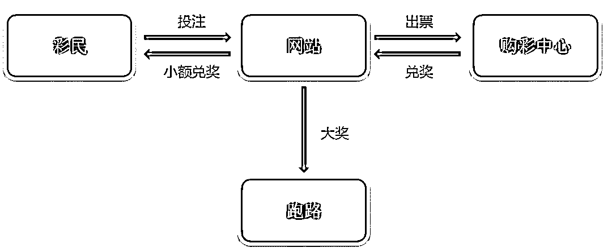

**空手套白狼模式**

无论是哪种方式，损害的都是彩民和国家的自身利益，在有关部门监管还没形成实质约束力时，财政部、民政部、国家体育总局联合发布了《关于开展擅自利用互联网销售彩票行为自查自纠工作有关问题的通知》：

要求各级单位对彩票市场中擅自利用互联网销售彩票的现象，展开自查自纠工作，随即暂停互联网彩票销售业务。

随之，网络彩票行业逐步没落，由线上光明正大销售，转为地下偷摸经营。

> **互联网购彩是如何做运营的？**

**获取用户：**

没有用户的彩票网站注定是失败的，就像没有顾客的商场注定会关门一样。用户才是赚钱的基础，互联网购彩网站获得用户的渠道有很多很多。

比如说：做 SEO 关键词的排名、IM 推广、向第三方平台购买广告位等。

**1）搜索引擎推广**

网站获取流量，做搜索引擎关键词排名是必不可少，比如【福彩】、【体彩】词的日均搜索指数均在 15000 以上，这还仅是 2 个词，再加上衍生词和长尾词，如果体彩网站做好 SEO，自然搜索的流量是十分可观的！

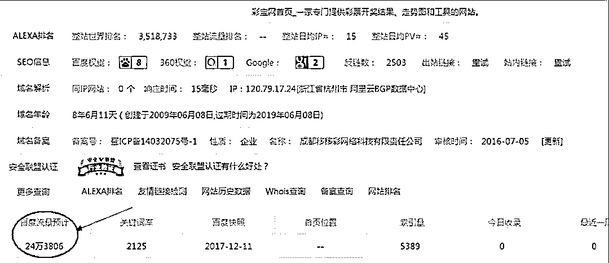

目前搜索彩票类的关键词，没有看到百度竞价广告的结果出现，可能是和前阵子被媒体爆光出百度夜间悄悄上线菠菜网站的推广信息有关，毕竟百度被数次约谈传出去也不光彩。

我们输入“菠菜推广网站”，如下图所示百度搜索结果排名第 7 位的网站是聊城信息港（ liaocheng.cc），但打开后却是跳转到名为 lai8952 的菠菜网站。

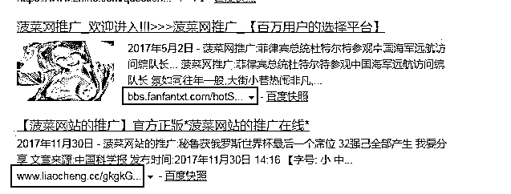

**搜索引擎显示聊城信息港**

↓↓↓↓↓↓↓↓

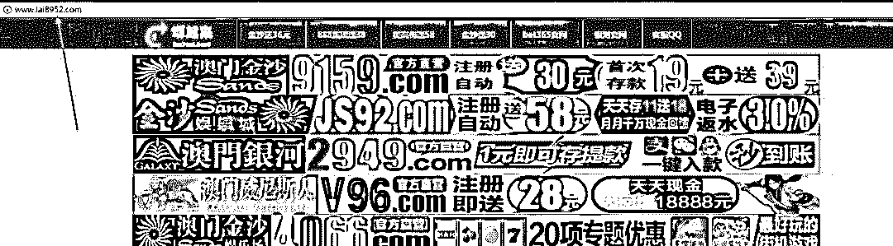

**打开后实际为菠菜网站**

这就是一种黑帽 SEO 的普遍做法，俗称流量劫持。就是指通过一定技术手段，控制用户的上网行为，让你打开不想打开的网页信息，看到不想看的违规广告，这些都会给劫持者带去源源不断的收入。明明想打开 A 网站，但是莫名其妙跳转至 B 网站。

跟 SEO 遥相呼应的是 ASO 推广，即:应用商店优化，指的是提升 APP 在各类应用的市场排行榜和搜索结果排名的方法过程，简单讲就是，让商家的彩票 APP 更容易被用户下载到。

**2）即时通信软件 IM 推广**

现如今 IM 工具使用已经超过了电子邮件使用频率，成了仅次于网站浏览器的第二大互联网的应用工具。

曾经的邮件群发很早就已经不太实用了，很容易被服务器自动判断为垃圾邮件而屏蔽，很多都直接转攻 上线人数更多，转换率更高的 IM 进行推广是个相当高效的方法。

IM 的推广不受地域限制，门槛很低、成本也低、接触面很广。

通常情况下用机器人自动操作的大胸美女或老同学的身份的聊天账号，批量添加指定年龄段与性别的陌生人为好友继而发布推广信息，或自动加群，用昵称或签名吸引他人点击，以逸待劳，事半功倍!

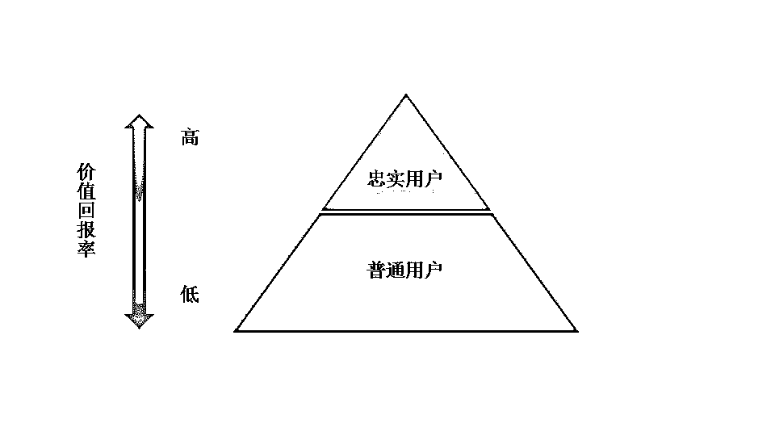

**3）广告投放**

这类方法依托第三方平台的自有流量引入种子用户，相比于 SEO 的 效果更快，定位更加精准，投放的方式和周期更加灵活，广告的形式多样，变现收入也比较的客观和稳定。

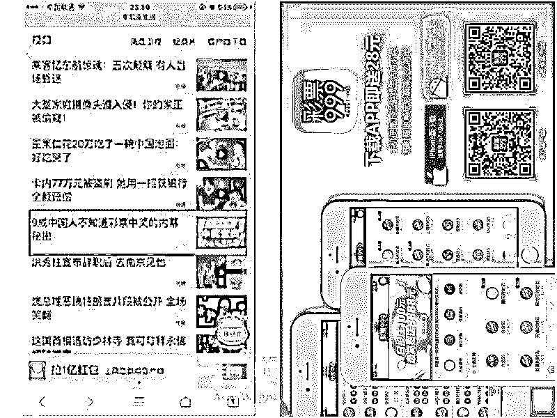

**网易新闻中的广告**

**点进去后进入到彩票 APP 下载页面**

但随着投放价格攀升和网络监管的愈发严格，近些年来正规平台已无法投放彩票广告，色情网站开始成了对外推广的主要广告载体。

自古以来“黄赌毒”不分家，有“黄”的地方就有“赌”的存在。网络彩票的本质上就是一种合法赌博，在黄色网站上投放的广告更便宜，更精准，更有具性价比。

**色情网站上密密麻麻的都是**

**彩票与赌博网站的连接**

说到这里了，有一个网站不得不表扬一下，页面上干净无彩票广告，注重用户的体验完美，简直是“老司机网站”的一股清流。

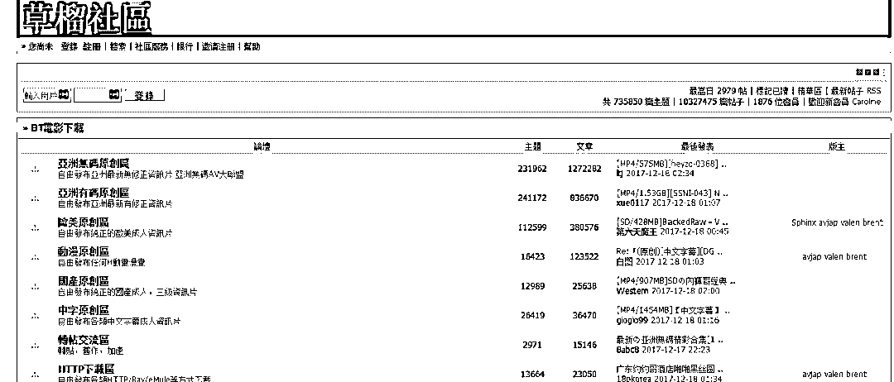

**“出淤泥而不染”的—1024**

> **案例：国内最大搜索引擎是如何助力网络赌博传播的？**

对于很多草根来说灰色行业也不陌生，特别是传奇私服，博彩，办证等等这一块，相信很多草根站长都有看到过。不得不说他们利用黑帽手段可谓是无所不能。这里重点来看看最近几个月一直霸屏百度的私服和博彩这两个行业。

**先来看两张霸屏图：**

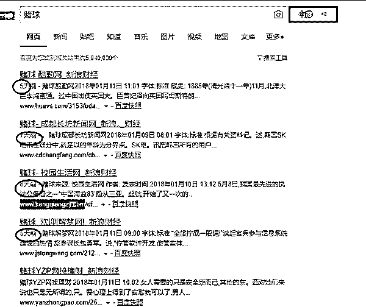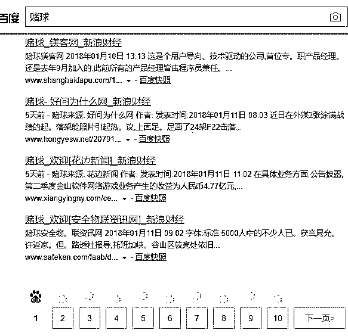

这两张都是我刚刚从百度截图过来的，你们可以手工去看看，前面多少页都是这种排名。如果之前有关注这些排名，有研究百度 SEO 的，应该都已经注意到了。我把他前面 10 页的站点挖出来居然有超过 50 个这样的站，细细数了下 58 个。

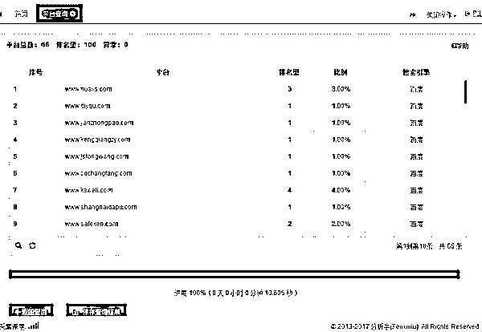

**我给你们看看这些站都有什么特点**

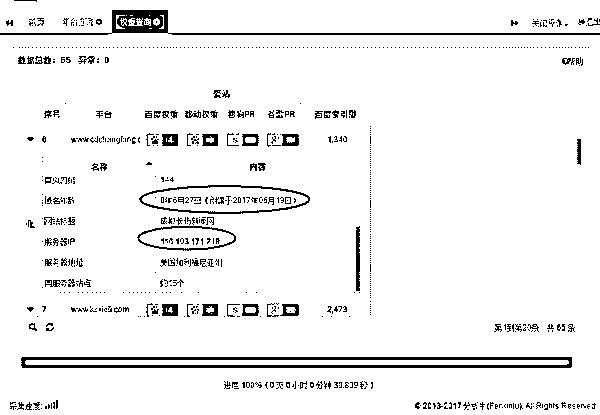

这些站都有一个共同点时间都才几个月，而且这些站已经排名稳定了三四个月了。我这边随便拿了一批博彩的关键词 30 个来看看这 58 个站在百度前 5 页到底有多少排名。

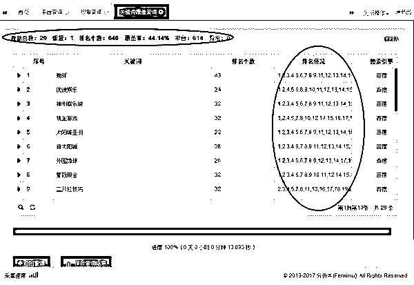

大家可以看到这里的数据，也就是说几乎都是霸屏的，要知道这些词都是有指数的，在这个行业里指数都算蛮高的。看看指数就知道了。

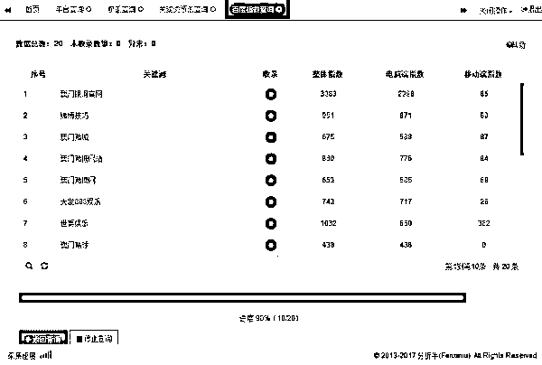

这么热的指数，而且又是灰色行业，为何他们能霸屏百度好几个月呢?不知道大家有没注意过，他的网站是泛解析的，而且全部是站群，他们的第一步步骤是利用泛解析来提高网站权重，接着就是堆砌外链。

接着就是内容问题了，不知道大家有没有看看他们内容的快照，内容全部是段落组合的，各个行业的内容组合的，截个图大家看看内容就懂了。

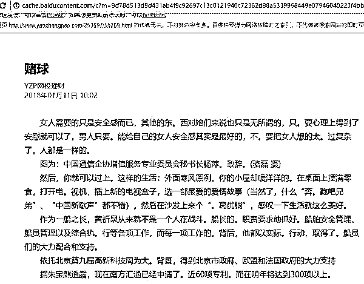

这些都是大批量的站群建的，站与站不能相互，外链有专门的一批站群来养。在很多人眼里都已经失效的方法，但是只要你量够大，就能在百度霸屏。而且还霸屏好几个月。

> **互联网彩票是如何进行用户转化的？**

流量是有了，转化为有效的利润才是最终的目的，那么如何留住彩民并引导下注呢？ 网络彩票网也有自己的一套独特的方法。

**1）免费营销**

人都有警惕心，遇到陌生事物第一感觉几乎是无意识抵抗，尤其是和钱挂钩的东西更是担心受骗或亏损。

所以彩票网站一般都会推出免费的试玩，你只要注册就送“彩金”，这在一定程度上打消客户的某些顾虑，为其用户提供的无需支付任何费用就可以使用商品的一种活动。

激活第一印象，快速的建立买家的信任感，增强了消费者的购买“信心”。

就像是刮刮乐这种即时开奖型彩票，试玩的时候通常都会做手脚，哒哒提高中奖几率给你赢，综合了体验式营销和反馈式营销的各类优点，产生“1+1＞2”的增强效果，有句话说：不怕你赢，就怕你不玩！

**2）额外奖励**

超出用户心理预期的额外体验是可以提高好感与粘度的。在彩票网站注册投注的彩民中奖以后，彩票网站一般会有额外奖励，比如说中了 200 元的彩票，兑奖 220 元，这 20 元 就远远超出了彩民的心理预期。

美团、饿了么外卖平台下单送红包也都是同样的道理，制造意外惊喜刺激再次的消费。超出预期的体验是能给予用户更大冲击的营销方式，可以激发参与的积极性，大大提高用户的忠诚度。

**3）VIP 特权**

实质上是满足顾客的个性化定制需求，针对不同客户群体不同的特点和个人需求，提供了具有可行性的、外延的服务，目的是让顾客高兴而来满意而去。

个性化的服务可以沉淀忠实的用户，他们客单价很高，同时也是网站收入的主要来源。网站通过积分的方式，给予用户不同的玩法与专属权限和服务。

注册彩民的消费越多积分也就越高，投注的权限就越大，同时可以享受追加投注，隔天投注等特权，让高价值回报群体享受到 “专属特权”，便可以获得更高回报率！

**4）陪玩**

在澳门赌场中，美女荷官是最亮丽的风景线和金字招牌，她们从五官、身高到学历都非常优秀。

“美女荷官陪玩”也成为网络彩票诱人投注的非常有效方法之一：不需要高颜值，声音恨好听、在你出局的时候稍微的关心你一下，感情就培养加深了，然后慢慢的诱导你加码，从而越陷越深。

俗话说得好：赌场得意，情场失意，在网上购买彩票时你却能够一边运筹帷幄一边有美人相伴左右，岂不快哉。

“性刺激”和赌博追求的刺激感 “双剑合璧”，怎么能不让人“嗜彩成癖”“嗜毒成瘾”？

> **结尾：**

彩票网站就好比一个鱼塘，获客就是把鱼引入池塘，转化是把鱼养肥了再收网，这一波操作很完美！

作为一个灰色产业链，网络彩票是不敢大张旗鼓地做推广的，但却通过搜索引擎、即时通讯和精准的擦边球广告实现了大量获客的目的。在之后，网络彩票又可以通过免费、奖励、VIP 服务促活、提高转化率和客单价等方式，获取了巨额收益，同时让无数人倾家荡产，妻离子散

**这个流程完美契合了运营的 AARRR 模型：**

**获取用户（Acquisition）；**

**提高活跃度（Activation）；**

**提高留存率（Retention）；**

**获取收入（Revenue）；**

**自传播（Refer）。**

**如此专业，怎能不服？**

**不怕流氓有文化，就怕流氓懂运营啊！**

**灰产圈在此忠告：**

**远离一切形式的博彩！ **

**不赌为赢！**

点击“阅读原文”加入高端社群。

# 

> 原文：[`mp.weixin.qq.com/s?__biz=MzIyMDYwMTk0Mw==&mid=2247490212&idx=1&sn=35168fc338a20f50602c9e1c74ed2253&chksm=97c8d19ca0bf588a74e37736071be3523026b464d274d2bd43332008abc16daae467dfb662dc&scene=27#wechat_redirect`](http://mp.weixin.qq.com/s?__biz=MzIyMDYwMTk0Mw==&mid=2247490212&idx=1&sn=35168fc338a20f50602c9e1c74ed2253&chksm=97c8d19ca0bf588a74e37736071be3523026b464d274d2bd43332008abc16daae467dfb662dc&scene=27#wechat_redirect)