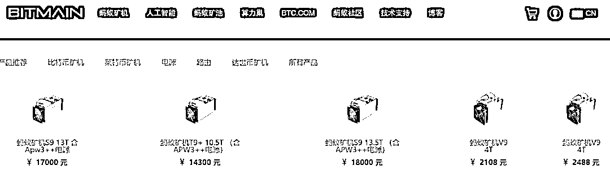
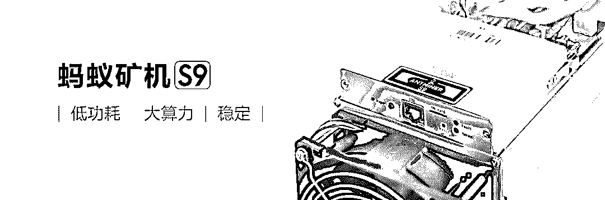
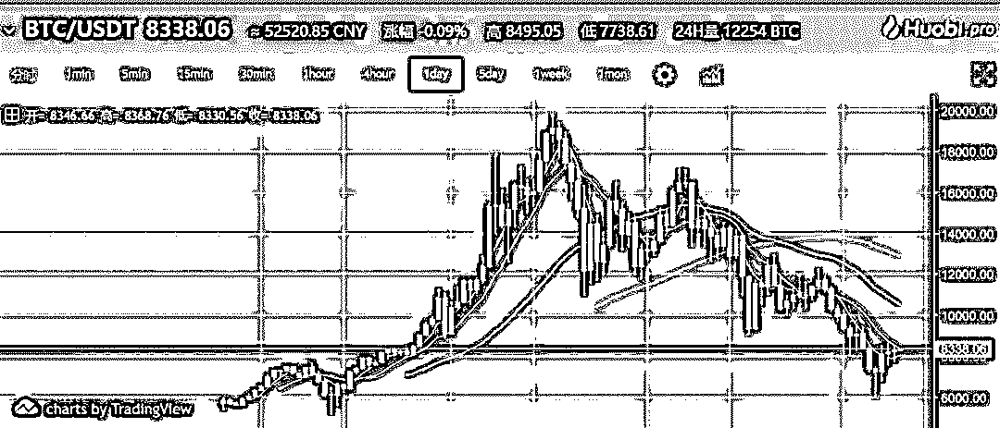
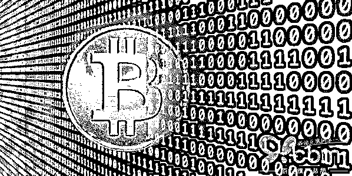

# 深度|从天堂到地狱的矿机市场：跌宕起伏 水深火热 ！

> 原文：[`mp.weixin.qq.com/s?__biz=MzIyMDYwMTk0Mw==&mid=2247490184&idx=1&sn=b0bb8a7df1d42a5f613c5c17a6e82cf4&chksm=97c8d1b0a0bf58a672a95e869965f137ba83c09daa573ce75ce09f34e1cf327ab2bbdcf8cfaa&scene=27#wechat_redirect`](http://mp.weixin.qq.com/s?__biz=MzIyMDYwMTk0Mw==&mid=2247490184&idx=1&sn=b0bb8a7df1d42a5f613c5c17a6e82cf4&chksm=97c8d1b0a0bf58a672a95e869965f137ba83c09daa573ce75ce09f34e1cf327ab2bbdcf8cfaa&scene=27#wechat_redirect)

> **导语：**

从高调的卖方市场到含泪割肉，华强北最近因为矿机又一次成为市场关注的焦点……

19 世纪加州淘金热中最赚钱的是谁？99%的淘金者都没有挖到金子，真正赚钱的是那些卖给淘金者铁锹的人。在比特币整个生态链条中，矿机商扮演的正是这样一种角色。

2017 年，比特币年涨幅高达 13 倍。这样一座“金矿”，吸引了无数“淘金者”前来挖矿。“工欲善其事，必先利其器。”为挖到“金矿”，“淘金者”把装备从普通电脑 CPU 升级成专业的矿机。深圳华强北，则是全球最大的矿机销售集散地之一。

然天有不测风云，比特币价格近期接连暴跌。这座“金矿”的成色不断往下掉，反成了吞噬财富的黑洞。为了解“淘金路上卖铁锹”的生意，，感受跌宕起伏的矿机江湖。

> **全球玩家跑华强北求购矿机**

受到市场对虚拟货币的火爆需求驱动，中国比特币矿机依托着强大的电子产品制造能力“领跑全球”，当前全球三大比特币挖矿机厂商均为中国企业。但也有分析称，由于“挖矿”行为的高能耗性，以及虚拟货币本身的投机交易色彩，监管部门势必不断加强监管，中国比特币矿机产业前景具有相当大的不确定性。

“最近几个月生意非常火爆，以蚂蚁矿机 S9(比特币挖矿机的一种——编者注)为例，官网售价是一万七(人民币)，但是炒货的可以炒到 3 万多，”cc 从去年开始在深圳华强北做比特币挖矿机生意，客户基本来自俄罗斯。

cc 所说的蚂蚁矿机 S9 由中国企业生产。从每枚不足 1 美元疯涨至 1 万美元的比特币，正受到多国投资者追捧，通过计算机“挖矿”成为一项极为有利可图的业务。

中国电脑产业发源地之一、有“中国硅谷”之称的深圳华强北，已经成为矿机生产“新的世界中心”，来自美国、日韩、俄罗斯乃至印度的玩家们云集于此，购置设备，“中国人拥有绝对的市场定价权”。

> **矿机供不应求**

1 月 24 日，早 10 点。从公交、地铁涌出的一群群朝气蓬勃的年轻人，唤醒了这条享誉全球的华强北商业街。

在赛格广场的四楼，某矿业的老板 kk 早早地来到店铺，从柜子里小心翼翼地里拿出一台台不同品牌的矿机，整齐地摆在展示架上，开始迎接新一天的生意。陈先生的店铺开张仅一个多月，但是生意却一直不错。

“现在市场上主流的品牌机我们都做，蚂蚁矿机 S9（比特币）、D3（达世币）、L3+（莱特币），以及神马矿机 M3（比特币）这些；挖比特币的话，最热销的是蚂蚁 S9。”陈先生说，“S9 今天的价格是 26500 元，带官电（官方电源），矿机的价格每天都不一样，要根据每天的币价、市场上货的多少来定”。

蚂蚁矿机 S9，是比特大陆生产的一款额定算力为 13.5TH/s（±5%）的比特币挖矿机，也是在华强北最热销的一款矿机。据比特大陆官网介绍，单台 S9 矿机搭载 189 片 BM1387 芯片，采用台积电的 16 纳米 FinFET 制程，每 T 算力墙上功耗为 100 瓦。

在官网上，2 月 2 日，一台 S9 的裸机价格为 10600 元，电源为 650 元，比特大陆还打出“无论是否发货，付款后均不能退款、退货”的“霸道”售后政策，即便如此，S9 矿机仍一举售磬。据 kk 介绍，前一天（1 月 23 日）S9 的价格是 27000 元左右，比官网价格高出一倍多。

kk 讲 ：“只有少数有实力的商家能从最上层供应商直接拿到货，跟你打个比方，假如最大的经销商从比特大陆以出厂价 10800 元拿到 10000 台机子，然后他就以 12000 元价格卖给几个第二层经销商，第二层经销商再以更高的价格卖出去，一层层下来，机子到了市场上就变成了 27000 元左右的价格。”

实际上，在华强北的矿机商基本是黄牛，通过倒买倒卖赚取差价，而黄牛也是矿机价格剧烈波动中受到影响最大的。

蚂蚁矿机 S9 价格最高峰曾达 3.3 万元左右一台，最低价格是 2.3 万元左右一台，中间相差 1 万元。“矿机价格的涨跌对黄牛影响非常大，因为他们拿货的价格已经挺高的了，如果市场价格上涨，他们就可以赚差价，如果市场价格下跌得厉害，他们就会亏本；像我们老板是从 2013 年开始卖矿机，基本是从最上层经销商拿货，价格比较低，利润也高，矿机降价对我们影响也不大。”kk 说。

“我们收二手矿机、比特币、莱特币，那就是刚收来的 10 台二手蚂蚁 S9”，阿华指着堆在角落里的几个大箱子。阿飞把二手矿机图片发到朋友圈，配文：10 台二手蚂蚁 S9，成色新，价格好，手慢无。过了一两个小时，顺丰快递小哥就上来“拉货”，这批二手矿机就这样卖出去了。阿飞把单号图片发到朋友圈，并配文：单号自取。

> **天堂与地狱的距离仅有数周**

如果说全球玩家跑华强北求购矿机让华强北的众多老板赚得盆满钵满，满以为可以过个幸福年的时候，却风云突变。

各国政府加强监管，摩根大通、花旗等英国和美国银行业者也禁止用户以信用卡购买比特币等等因素造成比特币为首的虚拟货币一路走低，比特币六日盘中暴跌百分之十六，报 8338 美元，瑞波币（Ripple）、莱特币（Litecoin）及乙太币（Ether）的跌幅也都至少有百分之十六。

**数据支持：火币网**

一月初各国政府出手打击加密货币以来，加密货币的市值蒸发逾五千亿美元。

持续的杀跌让比特币价格渐渐低于了矿工们的挖矿成本，据数位比特币大型矿场场主称，挖矿成本主要包括矿机和电费，目前大概需要 1 年才能收回成本。以比特大陆的 S9 矿机为例，1.8 万 RMB/台，每天用电大概 32.4 千瓦时，按照电费 0.6 元/千瓦时计算，核算下来挖 1 个比特币的成本约为 53415 元 RMB。

日趋严格的监管加上巨大波动都让挖矿和交易比特币成为高风险行业，作为产业链一环的矿机销售，更是备受打击。

cc 表示,现在卖矿机不赚钱,反而是亏钱,“过年了,商场 10 号开始放假,手里压货多,想把它出掉,在心里想会不会再降……我现在手里还有 40 多台 S9,但其实三四天前就卖掉了,S9 每天都跌,对方付了订金,但一直在犹豫什么时候来拿。”

在华强北有这样的例子。买家付了订金(订金比例一般在总价的 30%到 50%,更多是付全款),但拿货时发现,矿机的跌幅已经超过了毁约成本(订金),于是干脆毁约,以最新行情再次下单。

> **矿机性能详解**

在了解挖矿机的性能之前有必要了解下挖矿设备的演变。

> 早期大家用 CPU 挖矿，算力是 M 级别。
> 后来矿工改用算力更大的显卡挖矿，算力增加到百兆级别。
> 目前普遍使用的是集成电路矿机，单台矿机的算力就达到了 T 级别。
> 1T=1000G=1000000M

**所以说算力是衡量一台矿机好坏的首要因素。**

目前的主流矿机品牌中，以比特币矿机为例，蚂蚁矿机 S9 算力 14T，翼比特 E9+算力 9T，阿瓦隆 741 算力 7.3T，就单机算力来讲，蚂蚁矿机领先。

大部分人把挖矿当成一门生意，需要权衡投入和产出，所以矿机的功耗也是值得关注的。

这里引入一个数据，即每瓦算力，每瓦算力=算力/功率，**每瓦算力越高，表明该机器单位电量能创造更大的算力**。还是以主流矿机的数据做比较，蚂蚁矿机每瓦算力 10.37G/W，翼比特每瓦算力 5.39G/W，阿瓦隆 741 每瓦算力 5.27G/W，可以看出蚂蚁矿机的每瓦算力也是领先的，这就意味着它能帮助矿工更快回本，创造更多价值。

**附：知乎挖矿从业者对矿机的测评**

> **矿机买卖的众生相**

来华强北买矿机的大概分为四类人：第一类是来自电费廉价的中国周边国家，以俄罗斯为主；第二类是从事外贸生意的，帮客户买矿机；第三类是国内自己开矿场挖矿的；第四类则是一些散户，买个三五台，自己挖币。

kk 会说一口流利的俄语，每天都会有一伙俄罗斯人聚集在他的商铺，购买数量可观的矿机。随着国内对虚拟货币的监管趋严，俄罗斯以低廉的电价和宽松的政策优势，成为矿机消费最大的国家之一。

俄罗斯电力过剩,“将来俄罗斯有可能在全球的数字货币交易中占有 30%的份额。”

kk 也在华强北做 3G、4G、5G 网卡和路由器的生意。如今矿机热炒，他在做主业时还在帮国外客户找矿机，然后以更高价格转卖。

“你这有没有 X10？”有客户走到 kk 的店铺前问道。kk 并未直接回答，而是反问“你要多少台？”，在得知这位客人需要 6 台时，kk 说：“我自己没定，价格大概 5 万 6、7 左右，我帮你打电话问问有没有现货。”

在华强北，很多像 kk 这样的商户，从矿机厂家定的货一般是市场上热卖的货，对于一些需求不太大的矿机，并不会囤货；但只要有客户想要，仍可以从其他渠道找到。

而客户亦在各家矿机商铺问价，寻找最低价买入，kk 讲：“我现在要 10 台 X10，过几天还要 200 台 S9，他的 X10 卖 5 万 6、7 贵了，刚才我在前面定了 4 台 55700 元/台，你要定货的话可以一起找，资源共享，看哪里比较便宜。”

除了像 kk 这种做外贸生意，帮国外客户买矿机赚差价的；还有根本不懂比特币和矿机，只是慕名而来的后入者。

pp 是在湖南开工厂的老板，来到 kk 的店铺前，开口就要 500 台 S9；“现在这个很火嘛，想买几百台机子回去自己弄个矿场来挖币”。但 pp 显然并不太懂这一行，他问 kk：“你们这有比特币吗？拿出来看看到底长啥样？”

矿机的收益和成本，是 pp 最关注的，kk 说，“每天的挖币收益不同，我们都是按照币价计算的，折合人民币每天可以挖一百到两百块钱。”对于成本，阿华表示，除了电费和散热扇这些易损耗的零部件，基本不需要其他的成本。

除了这些，矿场的管理费用也是一笔很大的支出，“因为矿机不能断电，好不容易挖了一天，快出来那么一点点币的时候，一断电一整天就白挖了”，那位买家说。

> **“水太深，一脚一个坑”**

此前币价疯涨时，一批批淘金人涌入这个虚拟世界，很多人认为，淘金路上，卖铁锹和水的人最赚钱，矿机供应商就是淘金路上的铁锹商贩。但是，某矿业的 tt 并不这么认为，他表示，“这行水太深了。”

tt 当天拿到的一批矿机全部是翻新机，翻新的程度连卖矿机多年的他都没看出端倪。“开始真没发现，后来看箱子颜色不对，一些矿机的货码也查不到，这才发现是翻新机。”tt 说，“我查了一下，这批机子还挺新的，今年 1 月份的生产的机子，用了一个多月，他们现在翻新一下按照全新的价格卖给我，中间一台差好几千块钱呢！”

此外，tt 还透露，最近行业内比较大的两个供应商卷款跑路了。“前几天我跟上家定的一批 S9，到期没货，后来才知道上面比较大的两个供应商失联了，卷款跑路了，货款提前给了，现在也要不会来了，这行水太深了，我一脚一个坑。”

与 tt  深入交谈后得知，失联的两个人是行业内比较大的供应商，tt 并不是直接从他们手中定的矿机，而是从他们下面一层的矿机商手中预定，所以 tt 损失并不会太严重，20 台 S9 的货款损失，该矿机商需要承担一部分责任，因此中间矿机商损失最为严重，“所以，为了填这个窟窿，我的上家就弄来 2000 台翻新机卖给我们，现在我们还在处理。”

矿机的买卖，实际上只是交易双方的口头约定，并没有合同保障，而预定矿机在行业内基本上是全额付款。上面的矿机商与他的交易也只是口头约定，然后全额支付货款，如今矿机商失联跑路，就算报警也无济于事。

1 月 31 日，kk 的商铺已经贴出了放假通知，cc 也早早地收拾东西离开，他们的矿机卖得太快，多款矿机现货已售磬，例如蚂蚁 S9 也只有 2 月底的期货，售价 23000 元。

**附：知乎矿机职业卖家对矿机市场的评价**

> **暴跌下的前景隐忧**

比特币无疑是 2017 年投资界的关注焦点，也造就了一些暴富人群。

但是，从 2018 年开始，比特币价格跌势不止。

进入 2 月以后，全球范围内对虚拟货币的监管不断加强。美国开始追查比特币交易、挖矿以及支付等环节的税收问题，美国三大银行（美国银行、摩根大通和花旗银行）和英国最大抵押贷款银行劳埃德银行集团均在二月初开始禁止用户使用信用卡购买加密货币；

比特币价格接连暴跌。2 月以来，比特币接连跌破 9000、8000 和 7000 美元三道关口，其他虚拟货币也有不同程度下跌。2 月 6 日，比特币价格跌破 6000 美元大关，24 小时跌幅超 25%。

相比比特币 2017 年 12 月中旬所创 19282.73 美元的纪录高点，目前已跌去近 70%。而矿机的价格也跟每天的币价挂钩，币价断崖式下跌，矿机的价格又会是如何？

目前热销的蚂蚁 S9（13.5T）价格在 1.9 万~2 万元之间，不同商铺价格不同。而在 10 多天前（1 月 24 日），S9 的价格为 2.6 万元左右，下跌六七千元。

“币价跌这么多，S9 从前段时间的 2 万 8 跌到 2 万 7，再到现在的 2 万 1，五楼就有一个矿机商怕币价继续跌，承受不起风险，把手上的十几二十台 S9 以 1 万 7 的价格卖出去了。”cc 讲 ，“币价下跌对我们也有影响，因为现货卖完了，就收了 200 多台二手 S9，本来想每台高几百块卖出去，但是币价一跌，我们就瞬间亏了五六十万。”

五楼一家矿机商铺 S9（13.5T）的售价为 19000 元，该商铺老板讲，“S9 的拿货价格是 1 万 8，前段时间价格高的时候每台能赚几百块，现在币价跌了，一台只能赚 100 块钱，现在还没有亏本。2 月底的 S9 我们定了，23000 元/台，如果币价继续跌的话，我们就会亏本了，所以这是一场赌博。”

华强北的矿机商铺多家已经关门、商人也陆续回家过年了，但是他们的生意并没有断，每天还会通过微信发布货品；只是，最近币价的断崖式下跌，矿机商人们也忧心忡忡；他们也不知道，过完年后回来，币价会如何，矿机的江湖又会发生什么变化。

> **结尾**

币价疯涨时，一批批淘金人涌入这个虚拟世界，很多人认为，淘金路上，卖铁锹和水的人最赚钱，矿机供应商就是淘金路上的铁锹商贩。然而，当币价持续杀跌或波动巨大的时候，玩票性质的买家开始退出市场，散户追涨杀跌的心态进一步加剧了挖矿的风险，刀光剑影的江湖会让矿机走出“尸山血海”的恐怖局势吗？

* * *

**【灰产圈】高端社群 小程序 已开通，社群成员突破 1000＋，2018 年社群 重点开发区块链项目**

<mp-miniprogram class="miniprogram_element" data-miniprogram-appid="wx4f706964b979122a" data-miniprogram-path="pages/topics/topics?group_id=881854415822" data-miniprogram-nickname="知识星球" data-miniprogram-avatar="http://mmbiz.qpic.cn/mmbiz_png/kialtkOXGKS7D9hZrmO2jzDqryXXTAlhxSpnrKnHGV65KXzicibOppaPic4dCRxftvabB8Iqswo3OuQEDSxE7NicXBg/0?wx_fmt=png" data-miniprogram-title="【灰产圈】高端社群" data-miniprogram-imageurl="http://mmbiz.qpic.cn/mmbiz_jpg/WWG78hysZ0brJkWoyG2VDIacqgQjkDfp6mLiaoPBJ2SgWZHtRuTw7ia8kpoxntsn7PiaFOQO2U23FW6Iry0gS1GnA/0?wx_fmt=jpeg"></mp-miniprogram>

点击“阅读原文”加入高端社群。