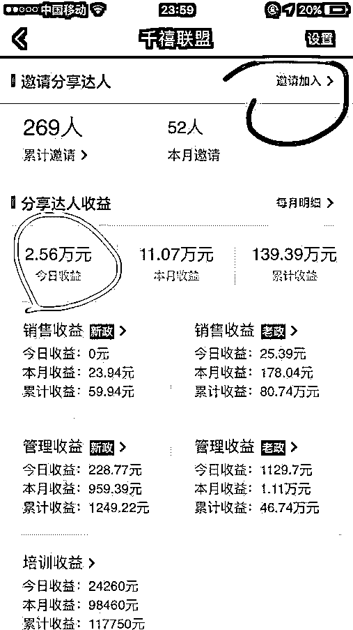

# 深度|“环球捕手”重出江湖 ！ 捕获的恐怕只是“人心”！

> 原文：[`mp.weixin.qq.com/s?__biz=MzIyMDYwMTk0Mw==&mid=2247490116&idx=1&sn=a4c3e09364324ddbb1c9a40eba9c1566&chksm=97c8d17ca0bf586aa29f0aabd868ee6e619cf5ddca86eee5bc84b825ccfa386beed321a8edca&scene=27#wechat_redirect`](http://mp.weixin.qq.com/s?__biz=MzIyMDYwMTk0Mw==&mid=2247490116&idx=1&sn=a4c3e09364324ddbb1c9a40eba9c1566&chksm=97c8d17ca0bf586aa29f0aabd868ee6e619cf5ddca86eee5bc84b825ccfa386beed321a8edca&scene=27#wechat_redirect)

**深度|“环球捕手”重出江湖 ！ 捕获的恐怕只是“人心”！****记灰产圈与环球捕手的博弈之战！**

**导语：**

> 最近朋友圈某过气三级分销美食平台 又开始了新一轮的刷屏 ，可能你听说过它：环球捕手  没错！它又回来了！

现在的传销包装的真的是高大上，还徐小平雷军合作花 3 亿打造的吃货平台！你宣传的时候怎么不说马云和马化腾合作的花了 10 万亿打造的一个平台，牛逼可以吹的更大点，这样更加吸引眼球。

说起环球捕手 ，为什么曾经一夜之间这么火爆？就像前段时间的网易公开课一样刷爆朋友圈？

**当时火爆的原因其实很简单：**

> 1 名人效应！以徐小平雷军当代言人为噱头（当然这是假的）
> 
> 2 门槛低，只要 399（最早之前是 299）
> 
> 3 当初那段时间资金盘查封、跑路的很多，突然出来个价格低人数多的，让很多人忍不住。

> **楔子：**

灰产哥无意间在浏览公众号文章的时候，发现某公众号推文《2018 年最新被动收入，环球捕手风口上的分享经济 》 如下图 ：

**某大咖公众号推文如上：**

据我所知 ：环球捕手官方公众号已经在去年八月份因为涉及三级分(chuan)销（xiao）被微信官方封号了，如下图所示：

随后 环球捕手被多家媒体报道，定性为三级分销（法律规定，三级分销为传销）

**附：当时媒体关于环球捕手报道**

[`v.qq.com/iframe/preview.html?vid=n0540lerwrc&width=500&height=375&auto=0`](https://v.qq.com/iframe/preview.html?vid=n0540lerwrc&width=500&height=375&auto=0)

经过多久媒体报道之后，环球捕手偃旗息鼓，仿佛一夜间蒸发了（之前封号的还有 小黑裙 和  云集微店 ）

没想到 近期 环球捕手 死灰复燃 朋友圈 和微信群 最近多了很多相关的推广 宣传图和软文， 难道应了一句话：不在沉默中死亡，就在沉默中爆发？（出自鲁迅《 纪念刘和珍君》） 

灰产圈团队带上老师傅开始了深度调查： 深挖环球捕手 ，裤衩都不给他剩！

> **起源：灰产圈与环球捕手的博弈之战：**

环球捕手火爆之后 被爆出 模式有问题 涉及三级分销  在其官微 未封号之前  灰产圈团队 便发布了一篇 关于 环球捕手的文章 ，老粉丝们可能还有印象《环球捕手：捕获的恐怕只是人心 ！》 ，如下图：

文章发布之后 ，一夜之间浏览量达到 4K＋ 同时多家媒体网站 转载  曝光 

第二天 文章被 投诉 下线 投诉公司正是环球捕鱼 运营公司 ：

                            **（杭州智品文化创意有限公司）**  

本想默默地写一篇文章 深挖下环球捕手 ，在粉丝量少阅读量少的情况下，竟然引来了 环球捕手的幕后操盘手  ，灰产圈团队真的是 受宠若惊 。

同样的情况前几天也发生过  ，有一篇文章 ：

【深度|"白送"路由器卖 P2P 理财？揭秘斐讯高深莫测的营销把戏：请君入瓮，诱敌深入】

****

 阅读量区区 2K＋ 却被多家媒体恶意转载  （这些媒体很多都是找此类文章发布在网站上，然后恶意敲诈 文章中写的产品所在公司，要求付费删帖的黑网站）

**附：“斐讯路由器”公关公司与灰产哥部分聊天记录**

关于斐讯路由器的公关事件本文暂且不谈 ，今天重点深挖 环球捕手的套路和黑幕，好戏开场了！

> **深挖环球捕手之初体验：**

**什么是环球捕手？**  

官方自己介绍说是一个美食平台 ，  曾经的微信认证（杭州智品文化创意有限公司）

## **百度认证：浙江格家网络技术有限公司 （实际与杭州智品为同一公司）**

## **它的模式是什么？**

## **（除了 299 元技术服务费改成 399 元其余都差不多）**

**曾经吸引人关注的是以下几点：**  

1.大咖背书;
2.宣传“躺赚”;
3.无需发货;
4.直推拉人高额返利，一条线上的人拉人也有返利。 

这种模式大同小异，和之前火爆一时的“云集微店”、“花生日记”  差不多，但是，现在在你的朋友圈，你还能看到这些的消息吗?曾经也是被霸屏的，现在去哪了呢?

突破重重迷雾，背后的真相又是什么？

## 首先我们先了解一下这个环球捕手的背景和投资关系，然后在说说其中的猫腻和拉人头的模式，所说的一切都是有证据的！环球捕手的所属浙江格家网络技术有限公司。我们看一下环球捕手的微信公众号上面的介绍！

  

**我们工商查询的投资方是这四家；龙贵实业 经纬创腾 顺盈投资 广发信德。**

**环球捕手声称是有顺为旗下顺盈操作投资。工商查询顺盈和顺为没有投资关系！**

上面介绍投资方有广发信德，顺为资本，平安创投，经纬中国，真格基金。五家投资方，这是环球捕手官方公布的投资方，那么我们再来看看工商备案查询到的结果，两个不同的平台查询结果是一致的，除了广发信德以外，其他全部没有。反而扭曲事实把顺盈投资写成顺为资本  经纬创腾写成经纬中国。这完全是扭曲事实，误导广大网友！

**这里面并没有真格基金 顺为资本 经纬中国 平安创投**

**这里面并没有真格基金 顺为资本 经纬中国 平安创投**

## 浙江家格网络技术有限公司的股权结构里面并没有官方的介绍的雷军的顺为资本 徐小平的真格基金以及平安创投和经纬中国等投资方，稍微懂点公司结构的朋友用天眼查一查就可以清清楚楚了。就不会再被骗了，之所以歪曲事实是想给自己的项目做一个大的背书好让网友相信，拉出来雷军 徐小平 刘强东等人站台！光从这些虚假的信息都能知道这个公司的目的，下面看一张他们之前的对外的宣传图。雷军 徐小平都躺枪了！

**不知道这些人如果能看到会是什么反应？**

## 还有就是在经纬创腾的投资人里面出现了一个刘强东的名字，但是只是重名重姓的人，这个刘强东并非是京东的刘强东。这就是在欲盖弥彰，利用重名的人做大文章！下面看下这个刘强东只是经纬创腾的股东，没有投过任何公司！

**一查便知，这个不是京东的刘强东。**

**没有任职过任何企业，也没有担任过法人代表。肯定不是京东的，京东的东也躺枪了。**

> **深挖环球捕手宣传的所谓分享经济赚（chuan）钱(xiao)模式      **

我们再说说是通过什么赚钱的？投资 399 元就可以成为分享达人，也就是环球捕手了。399 元送你 400 元的红包代金券，而这个 400 元代金券不可以一次性购买产品，当你看到某一种产品要购买，假如这个产品 90 元，那么你可以用 10 元的代金券，剩下的 80 元还要自己另外在付钱，400 元里面只能用 10 元，而且产品都比天猫，京东要贵。这就意味着你要在半年内在这里消费几千元才能把这 400 元的代金券用完，半年后 400 元代金券作废，也就是说你要么半年内在这个平台消费几千元，要么浪费 400 元！就这样简单。

**上图是最新的环球捕鱼政策**

那么刷爆朋友圈的收益模式是什么呢？什么是分享达人呢？就是你拉一个人进来交 399 元，你可以拿到 100 元奖励，当你直接拉到 25 人了，你就升级经理了，做了经理你直接拉人可以奖励 200 元，团队拉人你可以奖励 100 元，赚钱模式就这样简单，想赚的多，人就要拉的多。不然不可能赚钱。典型的拉人头模式！

附：环球捕手推广员与灰产哥的聊天记录

只需要投资 399 元，成为环球捕手会员，就可以日入 10 万，环球捕手类传销事件，正在朋友圈疯狂病毒式传播，微商团队队长纷纷掉坑，带领团队踏入圈套以为是新一轮洗牌的好机会，殊不知坑就是坑不要走歪门邪道，让你的团队被一时之热崩盘拖垮。

跟徐小平雷军没有任何关系，只是利用人性的贪婪，恶搞营销策略，399 只有动态没有静态，模式典型的传销模式，迟早被叫停不要盲目跟风，不要听信误导。擦亮眼睛，看清事情背后的本质！

> **环球捕手 重出江湖后如何换汤不换药？**

登录其官网显示环球捕手 主体公司为：浙江格家网络技术有限公司 （实际上和杭州智品文化有限公司为一家 ）

灰产哥从应用宝搜索：环球捕手 下载 APP 

（下载数量 99 万次，这个下载量刷了最少一半，重点看右图评价，这可不是我刷的）

 

**重点来了:**环球捕手注册登陆之后，在其 APP 中却找不到 399 元的会员购买入口，但却显示会员商品，同时也没有推广后台。

**如图一：这是会员后台，有我是店主（即推广后台） 图二：无推广后台 **

**为什么在环球捕手 APP 中没有会员购买入口和后台，却显示会员商品？**

答案：  这样设计巧妙避开了 三级分销的风险 ，因为普通用户只能正常原价购买商品 ，而 环球捕手推广员 却能正常显示 推广后台 ，如下图 ：

**那么，拥有推广权限的会员又是如何开通呢？**

答案：从另外一个 APP 购买产品开通 

APP 名称：美食买手（是不是跟环球捕手名字差不多？实际上是同一家公司的 APP：为了避开风险而设立，下载量达 10W＋）

**打开美食买手 APP，这么大一个商城仅有五六款产品，是不是觉得很奇怪？**

实际上是打着购买实物产品的幌子开通环球捕手推广员身份，在买到实物的同时，自动开通推广员身份，同时 环球捕手和美食买手的账号通用。

**上图显示美食买手购买界面和累计消费金额，诱导会员分享给好友一起购买**

**上图为美食买手 399 元的产品购买界面**

**至此，环球捕手巧妙地通过一系列规避方案 将不合法的三级分销转变为看似合法的推广行为。**

**逻辑导图：**

**美食买手→购买 399 元产品→自动成为推广员→登录环球捕手→开始你的下线**

> **为什么曾经和千禧联盟合作如今又独立运营推广？**

环球捕手于 9 月 20 日开始割裂千禧联盟。

据了解，千禧联盟发通知给各位千禧分享达人称，9 月 20 日停止在环球捕手 APP 内使用千禧联盟的相关功能，并给出访问和提现网址。

据了解，8 月份因千禧联盟在日常推广和市场补贴的过程中，引发了一系列舆论风波，致使环球捕手微信公众号的相关功能被暂停使用，导致用户无法在微信环境中正常购物。8 月 4 日，环球捕手与千禧联盟决定：立刻暂停分享达人招募和市场补贴活动，并要求千禧联盟在一个月内完成整改，以符合相关规定。

**附：之前环球捕手与千禧联盟合作的推广后台**

当灰产圈团队找到千禧联盟官网的时候，显示 安卓和苹果端显示：敬请期待

> **深度解析环球捕手“分享经济”模式**

环球捕手可以算是安全版的三级分销，为什么是安全版的三级分销，因为只要 399 元，比起动不动要几千的卡位费，算是便宜的。

三级分销则来源于线下传销的变种。

界定是不是传销：一看：分了几级，很明显环球捕手有三级：a、达人级（花 399 元购买 400 券成为会员就是达人级）；b、经理级（需要自己直接拉 20 人，你的下线再拉几十人，就能成为经理级）c、总监级（拉更多的人和下线拉更多的人）；

二看：是不是拉人头所得的收益远远高于你或者你的下线购物所得的收益高；很明显，作为达人级，每拉一个人头返 100 元，作为经理，每拉一个人头返 200 元。所以大家都会热衷于拉人头，而不是去鼓励消费或者返利。

399 元送 400 元的券，意味着券在规定的有效期内必须花完，那么需要购买好几千元的东西才行。

总之，一句话，环球捕手是一个把自己包装成会员制的高端在线购物平台，利用拉人头快速获取客户的三级分销 App 购物平台。因为平台实力就那样，随时有可能会垮掉的风险。有些高智商的有经验的人把他当作一种快速聚集自己财富的平台。那些处于金字塔底端的注定成为顶端的赚钱机器，劳苦而无所获。

前期环球捕手打着拥有优质供应链做全球吃货的高端购物平台为幌子，借**顺为资本、经纬投资、真格基金等资方和明星的背书，干着名为分享经济，声称拿 3 亿做补贴，号称会成为新的商业独角兽，拿几十亿补贴都不成问题。实则通过拉人头，然后用会员的会费来补贴上级代理。**

> **环球捕手的伎俩：**

1、**自建 App**：

自建 App，UI 和产品都很高端的样子，一直告诉你：我们是一个踏实卖货的平台，产品优质便宜；自建 App，然后营销阵地在微信朋友圈，这样规避了在终端被微信掐死的风险。

2、**以强大背书为名来发展下线**：

各类明星入驻、各种大咖资本投资。

今年一月份，粉丝高达 700 万的小黑裙被封。小黑裙资方背景除了有王家的思聪公子做背书外，还有洪泰基金、依文集团、天神娱乐集团等有实力的资方，值得注意的是小黑裙还获得过腾讯重创空间“双百计划”的战略融资。小黑裙的阿喀琉斯之踵即三级分销模式。事后，王思聪痛定思痛，表示不再碰三级分销，好好做品牌。从 2016 年下半年开始，腾讯履行微信平台的是监管的职责，亮明了对类传销的态度，掀起了一场针对类传销的“整风运动”，其中号称中国最大的微商分销商支撑的云在指尖被定性为传销，没收非法所得近四千万。**在舆论压力下这些资本迟早会与捕手切割。**

3、**货是买不动的，还是拉人头更快。**

购物平台的本质是用最优质的服务和产品以及最高效的管理效率，来获得顾客认同，从而获利。再怎么变，商业的本质不会变。比如：名创优品，他利用规模化优势组织上游供应链规模化生产产品，从而来降低采购成本；利用经销商来分摊房租和人力成本；利用高效率协作来降低管理和中间成本，这样他的价格便在终端有较好的优势。给终端消费者呈现的是质优价廉。那环球捕手呢？货是一样的货，东西真的那么吸引人吗？真那么便宜实惠吗？服务真那么好吗？

**为了快速扩张用户规模，捕手走了邪路，卖货不爽，拉人巨爽。环球捕手的会员，绝大多数来消费不是目的，利用拉人头赚钱才是目的。**这年头，货难卖，钱难挣，开个实体店吧，投了几十万，不知道怎么回事就没了，做淘宝吧，没流量啊，刷单、做直通车吧，钱也着不住啊。还是 399 元入我门来，保你荣华富贵。发展 100 人，月入 5w，发展 1000 人，月入 50w，年如百万不是梦啊。这个饼很大啊，梦想总是有的，万一实现了呢。

拉人头的所谓培训费赚 50w，卖货得的利：50 块，你说他是什么？

不加入，你就穷死。加入，你就月入 50w。

眼看着大的微商团伙一个一个的死掉，这些微商团队躺着赚钱惯了。怪就怪微商太狠，只想着压货，行坑蒙拐骗之事。导致现在代理不好招，夏天又逢销售淡季，出货难，整个行业 2000 万微商太需要一个“躺赚”解决方案了，而环球捕手就是这样一个躺赚的平台。

**4、法律擦边球打的好，巨额利润跑不了。**

什么最赚钱，最赚钱的项目都写在法律上呢。

对于我国《禁止传销条例》中非法传销的正确解读是：入门费、拉人头分层级、团队计酬。每一项都能单独成为传销的认定标准。看看环球捕手：交纳 299 元成为分享达人，取得招募资格。2、拉人头分为达人、经理、总监三个层级（包括企业本体，实际四个级别）；3、3 层返利，多层计酬。

理论上，尽管环球捕人的代理制度涵盖消费抵用与实物购买，但是设置收费门槛，分层级代理模式以及巨额返利裂变拉新手段，均有涉传之嫌。再者，各地各级有关部门对于互联网传销的认定标准各不相同，你很难将其 100%定性，但“嫌疑”确凿。无奈，法律总是后知后觉，一拨人利用法律的空隙捞偏门也是再正常不过了。

> **结尾：**

这种赚钱模式，跟过去的传销直销模式都没多大的本质区别。只有少数塔尖的人可以赚大钱，后进入的普通人想赚到钱太难了，后进入的只不过是被塔尖收割的韭菜而已。过去 20 多年的传销/直销中遍地都是难民, 就是这种模式的真实写照。

最后，再讲一个案例，今年年初的时候，网易考拉海购也是采用类似模式，疯狂拉人头，结果平台负面报道缠身终于修改了返利政策，前期疯狂拉人头的推广后续收益都付诸东流.....

**剩下的留给各位看官评论吧（欢迎在留言区评论）**

* * *

**【灰产圈】高端社群 知识星球 已开通，社群成员突破 1000＋**

<mp-miniprogram class="miniprogram_element" data-miniprogram-appid="wx4f706964b979122a" data-miniprogram-path="pages/topics/topics?group_id=881854415822" data-miniprogram-nickname="知识星球" data-miniprogram-avatar="http://mmbiz.qpic.cn/mmbiz_png/kialtkOXGKS7D9hZrmO2jzDqryXXTAlhxSpnrKnHGV65KXzicibOppaPic4dCRxftvabB8Iqswo3OuQEDSxE7NicXBg/0?wx_fmt=png" data-miniprogram-title="【灰产圈】高端社群" data-miniprogram-imageurl="http://mmbiz.qpic.cn/mmbiz_jpg/WWG78hysZ0brJkWoyG2VDIacqgQjkDfp6mLiaoPBJ2SgWZHtRuTw7ia8kpoxntsn7PiaFOQO2U23FW6Iry0gS1GnA/0?wx_fmt=jpeg"></mp-miniprogram>

点击“阅读原文”加入高端社群。