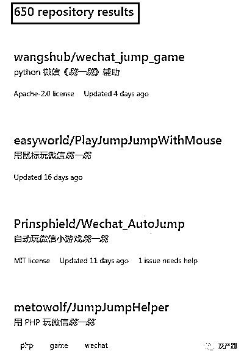
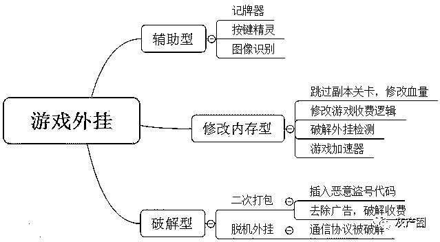
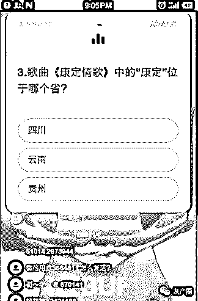
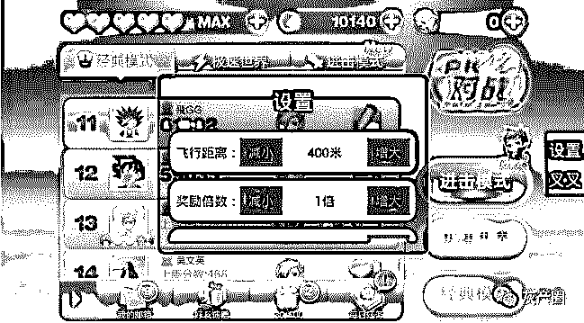
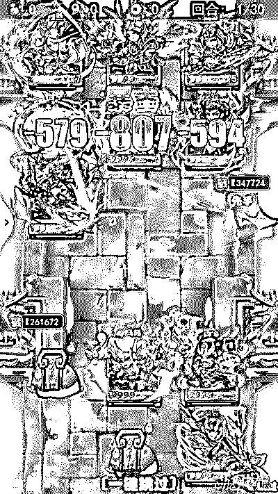
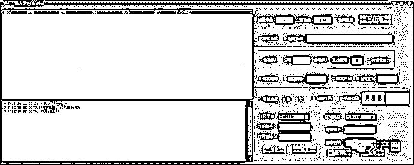

# 深度|游戏世界里的“外挂江湖”：道高一尺，魔高一丈！论黑客和白帽之间的博弈之战！

> 原文：[`mp.weixin.qq.com/s?__biz=MzIyMDYwMTk0Mw==&mid=2247490080&idx=1&sn=1b34ff33182cef572cd50758e15de1d9&chksm=97c8d118a0bf580e3cbe9061d802a3949740de23df666d4df8c3b8226f4736791ca9679f110a&scene=27#wechat_redirect`](http://mp.weixin.qq.com/s?__biz=MzIyMDYwMTk0Mw==&mid=2247490080&idx=1&sn=1b34ff33182cef572cd50758e15de1d9&chksm=97c8d118a0bf580e3cbe9061d802a3949740de23df666d4df8c3b8226f4736791ca9679f110a&scene=27#wechat_redirect)

作者：阿里聚安全

导语：

近日，某某龙在 2018 年的一次会议上发表了一个演讲，4000 多人聚集在现场玩“跳一跳”游戏。随着他们指尖的翻飞跳跃，大屏幕上的现场排名也在不断刷新……而在全场的惊叹声中，最高分出现了，967 分！而这位最高分得主，就是某某龙本人。

在随后的演讲中，某某龙也表示，这款 DAU 在一点几个亿的小游戏，网上居然出现了非常多的外挂。笔者以“跳一跳”为关键词在全球最大的同性社交平台 github 上进行搜索，居然有 650 个搜索结果。这些外挂，大多数都是以图像识别为基础的游戏辅助程序。利用这些外挂，玩家们可以很轻松的跳到几千分，甚至上万分。

阿里巴巴集团某安全部专家也对游戏从业者深恶痛绝的外挂问题进行了详细的解读，并针对反外挂提出了阿里的最新解决方案。

作为一款社交平台上的小游戏，如果外挂泛滥，一方面，看到朋友使用外挂打出了一个很高的分数，那么朋友之间的信任可能会出现问题；另一方面，外挂行为会破坏整个游戏的规则，并且让规则立即失效。基于这两方面，最终导致的就是正常玩家的流失，游戏面临衰败和死亡。

比如，一个正常玩家，在不断练习之后，每局的分数应该是会缓慢增长的，如果某个时间段突然增加了几千分甚至几万分，这本身就已经很不正常了。

> ## 外挂的种类

根据外挂的实现原理，以及对游戏正常业务造成的危害程度，我们对外挂大致可以分为如下三大类：辅助型、修改内存型、破解型。

> ### 辅助型

这类外挂对游戏和业务的影响相对比较小，本身不会修改和破解游戏的代码，主要是模拟用户点击，自动化的做一些重复性的操作。比较常见的是图像识别和按键精灵等工具。通过图像识别技术，可以判断人物当前的位置、火车票余量等；然后通过按键精灵模拟用户点击，达到人物在游戏中的走动、自动购买火车票等操作。

最火的案例莫过于现在的直播答题场景了。

外挂程序通过 OCR 识别出题目的文字，然后通过搜索引擎检索答案，最后自动化点击题目的答案，做到全自动化答题，并且准确率还很高。

> ### 修改内存型

修改内存型外挂依托于官方游戏 APP，属于动态修改游戏业务逻辑，这类外挂往往会向游戏进程中注入第三方恶意模块，然后通过修改代码的逻辑、修改内存中的数值等手段达到修改游戏地理位置、人物奔跑加速、破解收费道具、修改游戏币数量和增加血量等。此类外挂会极大的破坏游戏的平衡性。

如下是“XX 酷跑”的游戏外挂，属于典型的内存修改类外挂程序。此外挂程序会往游戏进程中注入第三方模块，然后通过修改游戏的代码逻辑和内存中的数值，可以随意改变游戏的飞行距离、奖励的倍数、奔跑的速度等参数。

> ### 破解型

破解型游戏外挂对于游戏厂商来说影响是最大的，不仅会破坏游戏的平衡性，更会加速游戏业务走向衰亡。

破解型外挂又分为两类：二次打包和脱机外挂。

APP 的二次打包是基于对官方 APP 的修改，属于静态修改代码逻辑。黑客们通过逆向分析游戏逻辑，修改游戏赖以生存的核心功能，比如去除游戏中的广告代码，破解单机游戏的收费逻辑，插入盗号代码等。

如下是《XX 那三国》游戏的二次打包版本，其中被插入了“一键跳过”副本、游戏对话速度可调至 3 倍速等外挂功能。

脱机外挂的出现对游戏厂商来说是毁灭性的打击，这意味着游戏客户端和服务器端通信的逻辑都已经被黑客逆向的非常清楚了，所有的游戏操作都可以脱离游戏客户端而通过脚本来实现。

脱机外挂的危害也显而易见的，首先，原本属于游戏客户端的广告、道具等收入没有了；其次，脚本操作比正常的客户端操作要快很多很多，极大的破坏了游戏的平衡性。当年 PC 时代最为火爆的《传奇》游戏，很大程度上也是没落于脱机外挂的出现。

如下是《狼人杀》游戏的批量注册小号工具，黑客通过逆向游戏注册逻辑和算法，编写 PC 端自动化注册工具，完全脱离游戏客户端 APP，属于典型的脱机外挂。

> ## 外挂难防

作为一名游戏行业反外挂领域多年的从业者，陵轩也在现场对外挂的存在原因，防控难度及外挂的分类等进行了详细的分析。

**阿里巴巴集团安全部专家 陵轩**

游戏外挂问题，不仅仅只在微信“跳一跳”小游戏中出现，它更是一个手游行业普世存在的、并且不能被忽视的严重问题。那么，这些外挂究竟是如何产生的呢？

首先，相较 PC 时代的 C++游戏客户端，现在的手机游戏基本上都是以脚本语言为主。由于脚本语言的特性，游戏的开发成本降低了，迭代周期缩短了，但也同样面临容易被反编译、篡改破解等问题。

第二，以往在 PC 时代被广泛使用的游戏驱动保护，到了移动时代由于手机的限制，也同样不能用了。这就导致了黑客可以有 Root、越狱等超级权限，而游戏则只有普通的用户权限，这种攻防对抗层面的权限不对等，也是移动端外挂难防的一个很重要原因。这就好比我是一个拿菜刀的屠夫面对一群拿 AK47 的恐怖分子一个道理，根本没法打。

第三，出于对手机网络的不稳定，以及流量使用等原因的考虑，很多手机游戏的计算逻辑和过程都在客户端进行，这就导致了黑客可以很容易的篡改客户端进行游戏作弊，比如，直接跳过某些游戏关卡、BOSS 一击毙命等。

第四，手游时代对外挂工作室来说，作弊成本低。一台主流 PC 机可以虚拟出几十个模拟器；作弊工具产业链成熟，包括 IP 代理商，卡商猫池、打码平台、群控软件等。

第五，游戏开发同学通常缺乏安全对抗经验，无法及时发现和阻断外挂的使用和传播。

> ## 谁在使用外挂？

随着移动互联网的兴起，同时，手游行业制作外挂的成本低，导致更多的外挂制作者从 PC 纷纷向移动端转变，这就导致了手游外挂的泛滥。那么，究竟是哪些人会使用外挂呢？

第一类：虚荣心作祟的玩家。在游戏中，玩家们可以沙场驰骋、江湖侠情，在现实中失意的人们可以再游戏中得到慰藉，使得心灵愉悦。那么，如何才能花更少的钱，得到更大的心灵慰藉呢？唯有借助外挂的力量，可以在战场上杀更多的人，比分比别人高。

第二类：打金工作室。对于打金工作室来说，游戏币的产量是直接关系到变现的。使用外挂可以自动化的执行游戏中的一些重复性劳动，比如固定的主线任务、跑商、押镖等。而且，在外挂的帮助下，可以 24 小时全程无人值守，大大提供游戏币的产出量。

第三类：竞争对手。通过对官方游戏逆向分析，竞争公司可以很容易的通过换肤等手段，制造一款玩法相近、界面类似的新游戏；另外，竞争对手还会使用外挂批量注册小号，来破坏游戏的正常运营。

> ## 通用的检测和防御机制

游戏外挂的实现方式多样，危害也都各不相同，那么游戏厂商又该如何对不同种类的外挂做针对性的防护呢？

第一步：客户端 APP 的防护。客户端在外发之后，最终到了正常玩家手里还是黑产手里，这块是不可控的，那么如何提高黑客分析客户端代码的成本，保护端上代码的安全是头等大事。我们可以对游戏脚本进行加密处理，对于解密游戏脚本的核心代码逻辑进行代码混淆、加固，反外挂从提升攻防门槛开始，一个保护机制相对完善的客户端，虽然不能杜绝外挂，但能在一定程度上将大部分跃跃欲试的黑客阻挡在外。

第二步：通信链路的防护。脱机外挂的产生，很大程度上是因为客户端 APP 和服务器端通信的签名算法、加密算法被破解了。采用常规加解密算法的变形算法，以及保护好核心秘钥至关重要，采用白盒加密不失为一种好的对策。

第三步：业务层及时防控。云端业务层通过实时的各种 IP 库、手机库的查询、人机模型算法以及离线的数据分析等。从服务器端及时发现和防控已知和未知的作弊方案，为业务及时止损。被黑客攻击并不可怕，可怕的是不知道被攻击，允许黑客一小段时间的作恶，换取绝大多数用户的安全，是业界通用的做法，快速发现问题并解决问题才是治理外挂的核心。

> ## 物美价廉的解决方案

基于前面的介绍，手机游戏外挂的制作难度和成本极低，外挂的制作者又都是专业的黑产从业人员；另一方面，对于游戏厂商来说，普通游戏开发者一般都更关注游戏功能逻辑的实现和开发，本身缺乏安全技术和游戏攻防对抗经验。因此，游戏厂商想要及时的发现并阻断外挂作恶相对来说比较困难，从投入产出比来看，成本也相对偏高。

定制的解决方案研发和维护成本过高，但通用的又担心效果不好。是不是能有一个折中的方案呢？答案是肯定的。其实，攻防对抗是一个两军对垒人和人、人和机器博弈的过程，一下子把门槛提升太多是不合时宜的，就像一下子改一个大版本着急大不一样，这个是得不偿失的。利用前面提到的分层而治，就能取得一个比较好的事半功倍的效果。

**延伸阅读：**

[深度|揭秘微信“跳一跳”外挂辅助江湖：有人上瘾了，有人赚了 10 万，江湖险恶 ， 人心叵测！（附：福利）](http://mp.weixin.qq.com/s?__biz=MzIyMDYwMTk0Mw==&mid=2247489614&idx=1&sn=4b98a5ba4d3c3a76028c3755bb129efa&chksm=97c8d376a0bf5a60705bcc95b477156fefc55be50b0e6e1dc76dfbb2c76f15f6acec196ef648&scene=21#wechat_redirect)

[深度|“绝地求生”外挂江湖：黑暗中崛起的灰色产业，年产值上亿美金！](http://mp.weixin.qq.com/s?__biz=MzIyMDYwMTk0Mw==&mid=2247489918&idx=1&sn=0a28eda8279e7c194d5e2f6bcda6556c&chksm=97c8d246a0bf5b507141f146431442410f38c62e34b5b8aa7c895d3b2bd6ced0e08ab84933ca&scene=21#wechat_redirect)

[深度|揭秘“吃鸡”外挂工作室轻松月入百万的黑幕：卧底内部，层层解密，利欲熏心，套路重重！](http://mp.weixin.qq.com/s?__biz=MzIyMDYwMTk0Mw==&mid=2247489294&idx=1&sn=d5bccb01075b0068c8c34559f6b4cb41&chksm=97c8dc36a0bf5520c3ccd99199f34cd36af0de798249cc215a031f352aa83dd2409cc880e411&scene=21#wechat_redirect)

* * *

**【灰产圈】高端社群 知识星球 已开通，社群成员突破 1000＋**

<mp-miniprogram class="miniprogram_element" data-miniprogram-appid="wx4f706964b979122a" data-miniprogram-path="pages/topics/topics?group_id=881854415822" data-miniprogram-nickname="知识星球" data-miniprogram-avatar="http://mmbiz.qpic.cn/mmbiz_png/kialtkOXGKS7D9hZrmO2jzDqryXXTAlhxSpnrKnHGV65KXzicibOppaPic4dCRxftvabB8Iqswo3OuQEDSxE7NicXBg/0?wx_fmt=png" data-miniprogram-title="【灰产圈】高端社群" data-miniprogram-imageurl="http://mmbiz.qpic.cn/mmbiz_jpg/WWG78hysZ0brJkWoyG2VDIacqgQjkDfp6mLiaoPBJ2SgWZHtRuTw7ia8kpoxntsn7PiaFOQO2U23FW6Iry0gS1GnA/0?wx_fmt=jpeg"></mp-miniprogram>

点击“阅读原文”加入高端社群。

# 

> 原文：[`mp.weixin.qq.com/s?__biz=MzIyMDYwMTk0Mw==&mid=2247490066&idx=1&sn=5bd4a74bfb44573316d744f93847267c&chksm=97c8d12aa0bf583c5d9be9a42dd2888ddb7447271363cad6fc80371325e0c500e4b7a6066298&scene=27#wechat_redirect`](http://mp.weixin.qq.com/s?__biz=MzIyMDYwMTk0Mw==&mid=2247490066&idx=1&sn=5bd4a74bfb44573316d744f93847267c&chksm=97c8d12aa0bf583c5d9be9a42dd2888ddb7447271363cad6fc80371325e0c500e4b7a6066298&scene=27#wechat_redirect)

# 

> 原文：[`mp.weixin.qq.com/s?__biz=MzIyMDYwMTk0Mw==&mid=2247490022&idx=1&sn=5a7b2f9f33bb3771dc4d0d03cbb5397a&chksm=97c8d2dea0bf5bc81ad6ec14aec4a5b6ee10685d9fee2142ac9f5e9043652e1bc57fa259b92b&scene=27#wechat_redirect`](http://mp.weixin.qq.com/s?__biz=MzIyMDYwMTk0Mw==&mid=2247490022&idx=1&sn=5a7b2f9f33bb3771dc4d0d03cbb5397a&chksm=97c8d2dea0bf5bc81ad6ec14aec4a5b6ee10685d9fee2142ac9f5e9043652e1bc57fa259b92b&scene=27#wechat_redirect)