# 深度调查| “佛系养蛙”火了 ！“佛系外挂”也火了！

> 原文：[`mp.weixin.qq.com/s?__biz=MzIyMDYwMTk0Mw==&mid=2247489992&idx=1&sn=cb944ba6f8efb2b62bc290ce6e172d5c&chksm=97c8d2f0a0bf5be6ad8a3a9f770d726c62cbb3d6abd88eed20fda712ee2d4b4f125cc31ae3ac&scene=27#wechat_redirect`](http://mp.weixin.qq.com/s?__biz=MzIyMDYwMTk0Mw==&mid=2247489992&idx=1&sn=cb944ba6f8efb2b62bc290ce6e172d5c&chksm=97c8d2f0a0bf5be6ad8a3a9f770d726c62cbb3d6abd88eed20fda712ee2d4b4f125cc31ae3ac&scene=27#wechat_redirect)

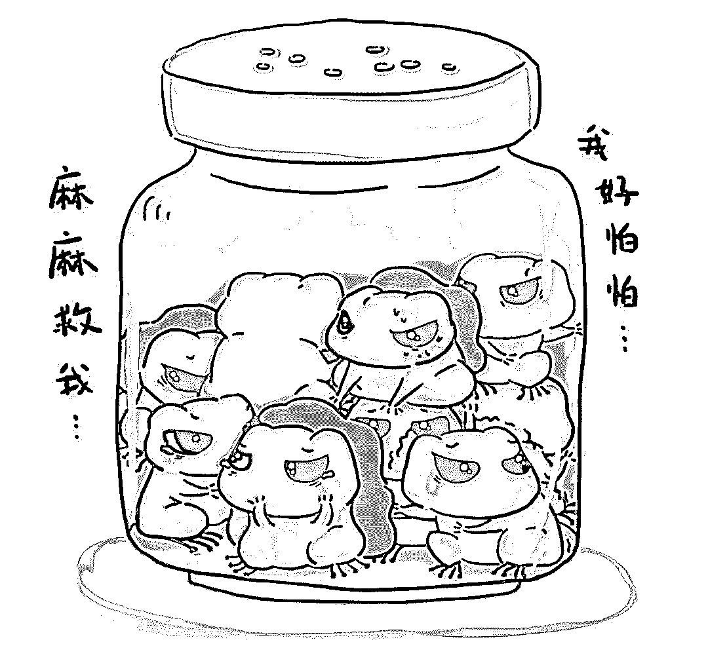

**都别等了，你们的蛙在我手里！**

**导语：**

最近，一款名为《旅行青蛙（旅かえる）》的佛系放置类手游异常火爆，受到玩家们的追捧！

“佛系”养蛙，爱上一只不回家的蛙。除了收割三叶草，给蛙准备便当，啥也不用做。与蛙的交流只有他寄回来的旅行照片，对着经常空荡荡的庭院和房间，却玩的有滋有味。

简单的养蛙游戏，就这样火了！

> **“佛系养蛙”凭什么火了？**

《旅行青蛙》是去年 12 月初上线的一款手游。仅用一个月的时间，这款日本游戏传到了国内，并迅速刷屏。

1 月 21 日，《旅行青蛙》登上了 APP Store 免费游戏榜第一名，微信指数超过 1300 万，百度指数超过了 32 万。两天后，微信指数翻了近四倍，达到了 4800 万，百度指数也翻了两倍多。

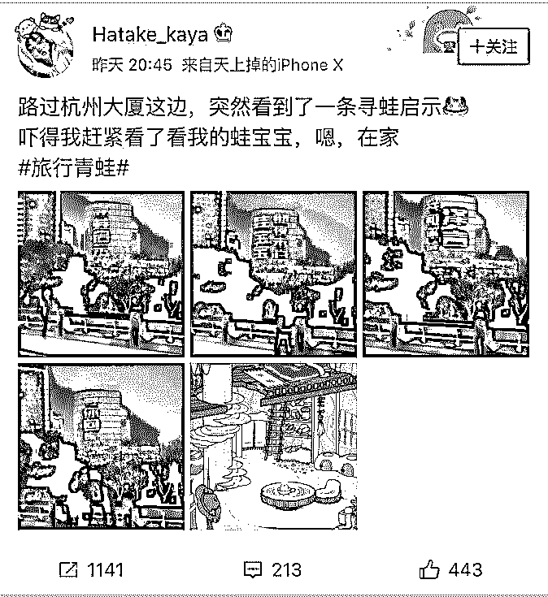

## 杭州惊现巨幅“寻蛙启示”：我和你爸泽言，等你回家

你无法直接控制蛙。你深深的爱着他，而他却说走就走，随心所欲，爱旅行，爱拍照。可能一会儿就回家，又可能好几天都杳无音信，蛙不在的日子，你只能对着池塘一遍遍收割三叶草。

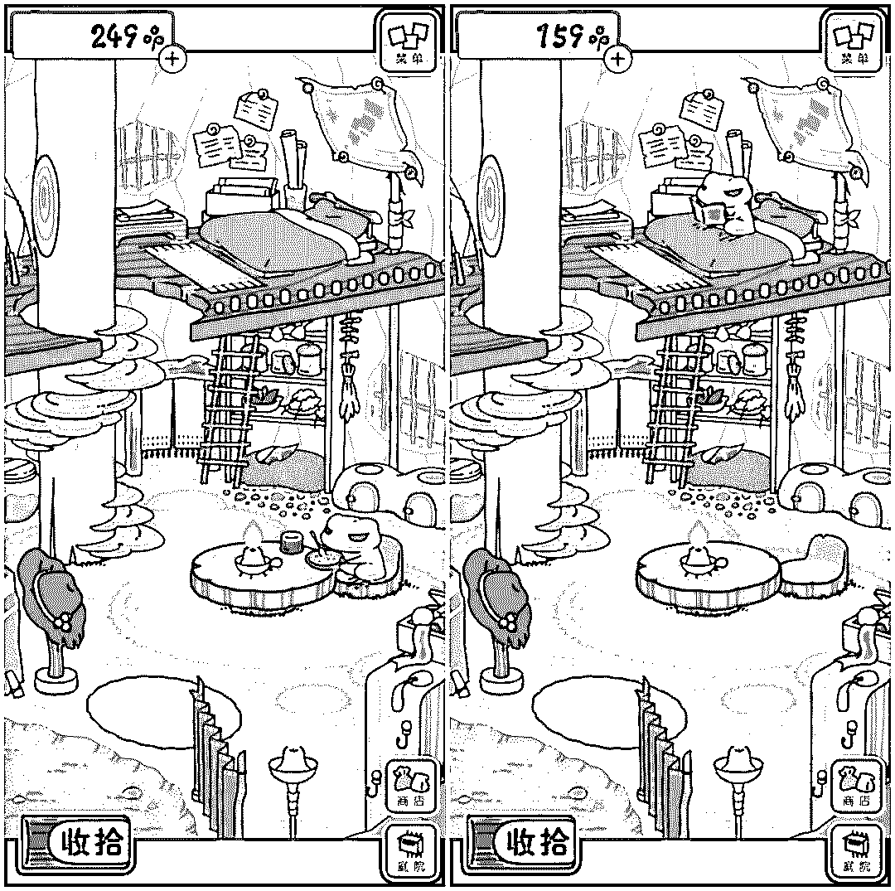

蛙吃饭 1 个小时，一个姿势看书几个小时。

蛙不出门了，你想他走，蛙去旅行，你又想他回家。

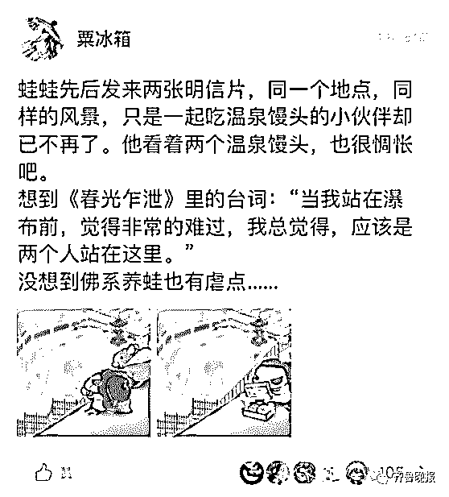

朋友圈、微博，我们身边主流的社交网络都被爱旅行的佛系青蛙占领。明明自己还是个宝宝，却开始学着大人模样：崽啊，啥时候回家啊？

中国经济近几年突然高速发展，互联网覆盖了我们的生活，大城市人口集聚，小镇的年轻人远离家乡。房价、35 岁中年人焦虑，中国经济虽然在增长，但年轻人的压力也在倍增。焦虑、迷茫、孤独，伴随着现在中国年轻人。

年底了，你是否越来越想家，回家的车票是否难买？

“治愈系”旅行蛙在这个时间火变中国朋友圈，就不难解释了。这款游戏让多少年轻人理解了父母的心思，又让多少人对着屏幕思考人生。

> ** 现象：****网红“旅行青蛙”火了“外挂”产业**

 正因为耗时长、节奏慢的特性，这款游戏一出现便备受追捧，被称为“佛系养蛙”游戏。

在一些攻略中，有玩家透露，三叶草数量越多，买到的道具越高级。在此期间，一些网售商家看到商机，趁机推出“外挂”服务，自称能让玩家获得数量丰厚的三叶草。

> **   调查：某宝网上“21 亿三叶草”售价 20 至 50 元**

  在淘宝检索“旅行青蛙”后发现，不少商家在出售“外挂”服务，售价从 20 元到 50 元不等。商家承诺，购买服务后，会提供“21 亿无限三叶草”和“990 奖券”，并且支持任何手机系统使用。而买家可以选择保留自己之前的游戏记录，也可以选择覆盖后重新开始。

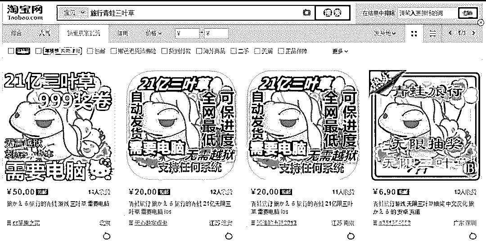

**淘宝上的旅行青蛙无限三叶草服务 **

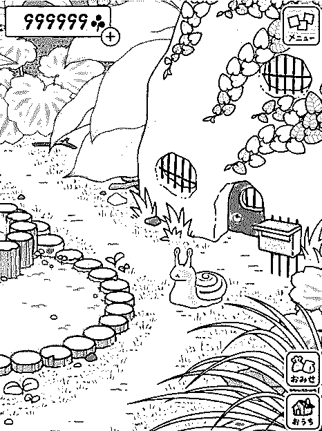

**宝贝描述页面商家提供的截图：999999 棵三叶草**

**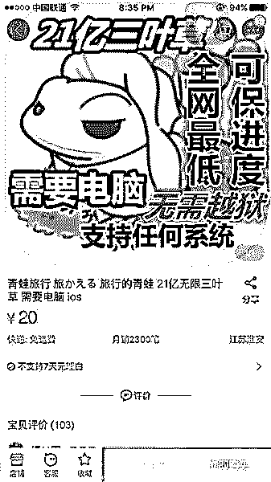**

**某淘宝卖家销量:2300 笔**

 其中一名商家推出的外挂服务，显示月销量高达 2300 笔。多名买家在评论区留言称，购买后，自己的青蛙成为“土豪”，可以随意购物了，部分买家晒出的游戏页面截图显示，他们的三叶草数量变成了“999999”枚，即游戏设置的上限。

目前，正规的充值渠道，玩家最高花费 25 元仅能够购买 2800 枚四叶草，这与“外挂”商家提供的数量差异巨大。

   灰产哥咨询了一名服务售价为 20 元的商家，他介绍，使用“外挂”前需要先备份手机中的东西。备份完成后，需要登录电脑 QQ，将游戏存档。

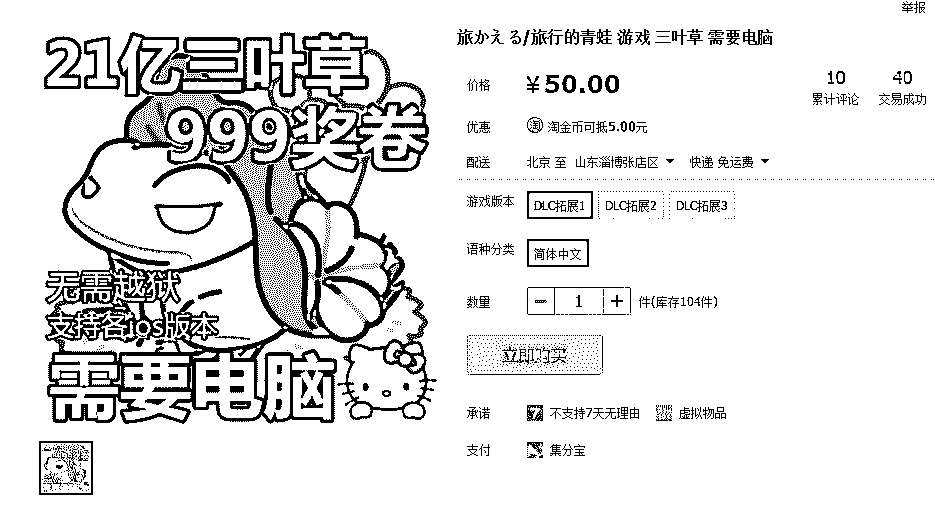

**另一位淘宝卖家的宝贝详情**

如果按他单价 50 一份的价格来算的话，已经卖了 2000 元。

然而 50 元的价格只是最低的标配价格，进入他的宝贝详情就会发现，人家还有套餐。

我们看到，50 一份的套餐其实会覆盖你的原始存档，如果想保留你的记录?对不起，再加 50。

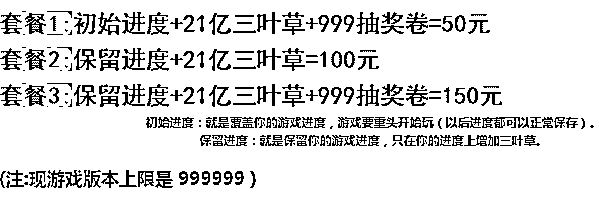

> **深度调查:三叶草**** “外挂”致手机变“板砖”？**

灰产哥尝试购买了一套“20 元买三叶草”套餐，商家发了两条链接和“旅行青蛙”在手机设备里数据文件的标识。

点击第一条链接，提示需要下载压缩文件包，解压后是“旅行青蛙”中充值满 999999 枚三叶草后显示的数据，而第二条链接，则对应着 iOS 苹果手机中的游戏修改教程。

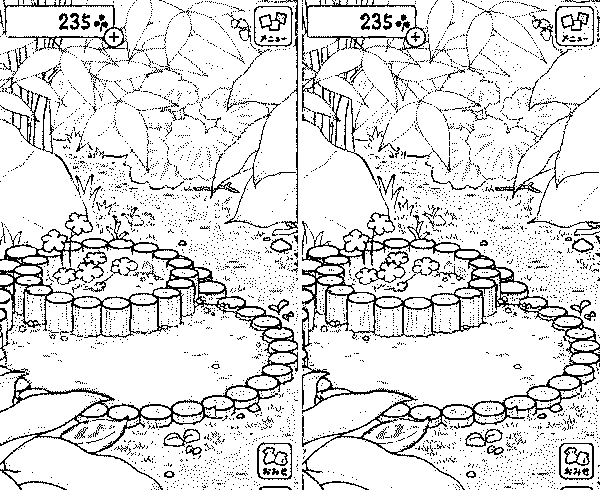

但灰产圈调查发现：操作期间存在不少隐患。很多 iOS 玩家安装后指出，自己的游戏数据和手机数据无故丢失，包括微信聊天记录、手机中的图片、视频等。有玩家称，安装后，自己的苹果手机出现漏洞，手机无法发送和接收短信，刷机后也未见好转。

 商家解释，买家在操作“外挂”程序期间，可能要承担不同手机系统数据丢失的风险。“以苹果手机用户为例，用户如果是 iOS9 以下的系统，什么都不会丢失，iOS10 的，会丢失缓存，iOS11 不光会丢失缓存，而且所有软件将会重新载入”。

很多不法分子也看中了此“商机”，为玩家提供三叶草优惠购买“外挂”。用户则需按对方要求下载文件压缩包，并修改手机程序，即可获得大量三叶草。而在用户操作过程中，不法分子便会趁机为用户手机安装木马病毒，窃取用户个人信息，甚至远程操作用户手机。

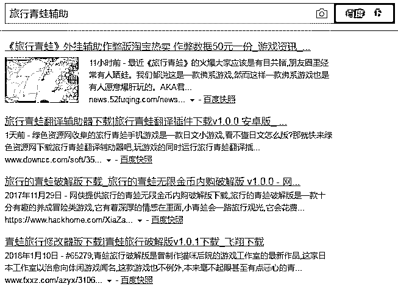

**百度搜索到的“旅行青蛙”外挂**

除了“旅行青蛙”外，犯罪分子还在“跳一跳”“吃鸡”游戏“外挂”上大做文章，在各大论坛、社交网站上散布“游戏辅助”“游戏抢号神器”等“外挂”软件，吸引用户下载。一旦下载该软件，用户的手机便会被犯罪分子植入病毒，并对用户实施锁屏勒索、恶意扣费、捆绑恶意代码等越权操作。

> **友情提示:****苹果官方称“外挂”可能会泄露个人 ID 密码**

 一名游戏开发者告诉灰产哥，“旅行青蛙”的“外 挂 ” 很简单，就是修改游戏数据。

商家只需先充值购买到游戏中的“三叶草上限”，获取相应数据，即可将相应数据通过程序复制给买家。

 通过致电苹果客服电话，客服表示：除造成手机数据、资料丢失等，这类修改游戏金币（三叶草）的操作，对用户来说存在安全风险，“可能会泄露用户的个人隐私，或是操作中，被安装木马软件，使设备在后续的使用中出现障碍”。

   客服人员举例指出，如果用户同意对方进行远程操作，可能存在被盗取苹果 ID 账号的风险，“商家很有可能借此将用户的手机锁起来，趁机勒索钱财”。他提醒称，尽量不要让不认识的人在用户的手机设备里安装或修改相应数据。

> **结尾**

其实这款游戏就是佛系的休闲游戏，是真的让人会感觉很轻松的游戏，这还去充值什么的，就真的没必要了。

**最后送大家一张耐人寻味的“佛系蛙”图**

**爱上你的蛙，忘了那个他!**

* * *

**【灰产圈】高端社群 知识星球 已开通，社群成员突破 1000＋**

<mp-miniprogram class="miniprogram_element" data-miniprogram-appid="wx4f706964b979122a" data-miniprogram-path="pages/topics/topics?group_id=881854415822" data-miniprogram-nickname="知识星球" data-miniprogram-avatar="http://mmbiz.qpic.cn/mmbiz_png/kialtkOXGKS7D9hZrmO2jzDqryXXTAlhxSpnrKnHGV65KXzicibOppaPic4dCRxftvabB8Iqswo3OuQEDSxE7NicXBg/0?wx_fmt=png" data-miniprogram-title="【灰产圈】高端社群" data-miniprogram-imageurl="http://mmbiz.qpic.cn/mmbiz_jpg/WWG78hysZ0brJkWoyG2VDIacqgQjkDfp6mLiaoPBJ2SgWZHtRuTw7ia8kpoxntsn7PiaFOQO2U23FW6Iry0gS1GnA/0?wx_fmt=jpeg"></mp-miniprogram>

点击“阅读原文”加入高端社群。

# 

> 原文：[`mp.weixin.qq.com/s?__biz=MzIyMDYwMTk0Mw==&mid=2247489975&idx=1&sn=dcbaa542b8cc00e2b9cb2d28ea0782e1&chksm=97c8d28fa0bf5b996c0a1a4e5e25a413479dd2fc185054cf63e09d8ee260a7cc9dbeebd741b1&scene=27#wechat_redirect`](http://mp.weixin.qq.com/s?__biz=MzIyMDYwMTk0Mw==&mid=2247489975&idx=1&sn=dcbaa542b8cc00e2b9cb2d28ea0782e1&chksm=97c8d28fa0bf5b996c0a1a4e5e25a413479dd2fc185054cf63e09d8ee260a7cc9dbeebd741b1&scene=27#wechat_redirect)