# 深度|“绝地求生”外挂江湖：黑暗中崛起的灰色产业，年产值上亿美金！

> 原文：[`mp.weixin.qq.com/s?__biz=MzIyMDYwMTk0Mw==&mid=2247489918&idx=1&sn=0a28eda8279e7c194d5e2f6bcda6556c&chksm=97c8d246a0bf5b507141f146431442410f38c62e34b5b8aa7c895d3b2bd6ced0e08ab84933ca&scene=27#wechat_redirect`](http://mp.weixin.qq.com/s?__biz=MzIyMDYwMTk0Mw==&mid=2247489918&idx=1&sn=0a28eda8279e7c194d5e2f6bcda6556c&chksm=97c8d246a0bf5b507141f146431442410f38c62e34b5b8aa7c895d3b2bd6ced0e08ab84933ca&scene=27#wechat_redirect)

****

**导语：**

**大家都知道现在的《绝地求生：大逃杀》已经转变成《绝地求生：诸神之战》了，尽管腾讯和蓝洞公司用尽各种手段也封了不少开挂玩家的号，但是还是不能彻底决绝外挂的出现！**

> **外挂灰色产业链全揭秘**

QQ 群作为外挂拉新最古老的工具，十多年来仍然没有被淘汰。

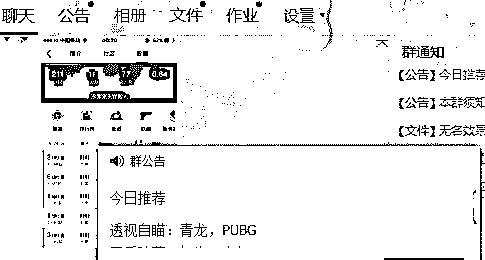

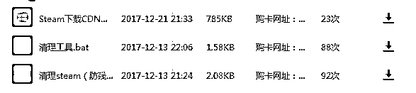

一般来说，代理商们会用自己的 QQ 群号为 ID，在游戏里通过使用外挂来宣传自己，也有通过直播平台直播“使用外挂玩游戏”来拉新的，这种方式“更具视觉冲击力！”他们每天以群公告的方式来通知不容易被封的号的外挂和购买外挂卡密的网址！而且群里面会一直更新几款防封软件！（不过一般人很少下载）

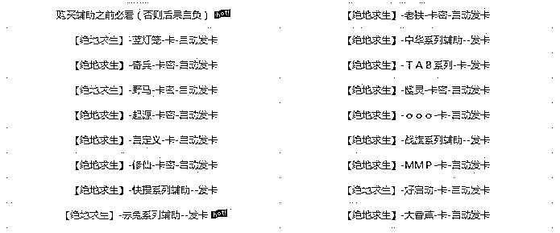

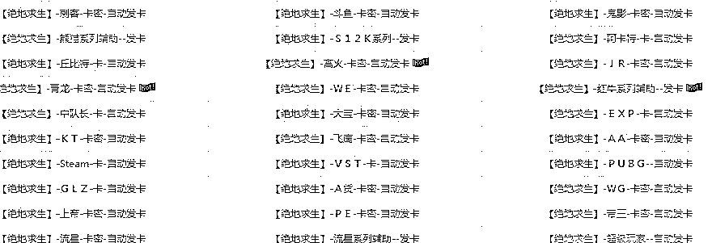

然后就是进入代理提供的网址里面找自己需要的外挂，价格都是 10 元到几百元一天不等（对你没听错就是 10 元到几百元除某些主播定制外）所以想想开现在有多少在使用外挂吧！红色字体是最近卖的最好！

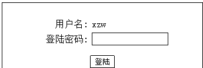

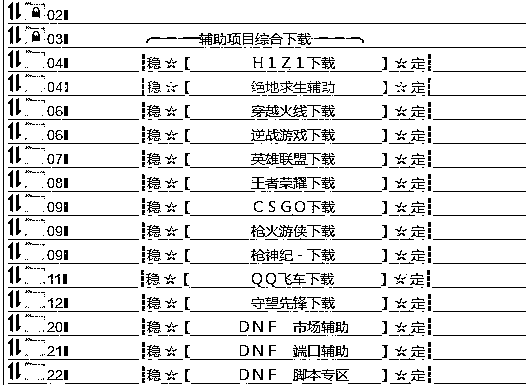

购买好都都是系统自动发给你卡密，你自需要进入他们提供的网盘下载外挂注册账号输入卡密就激活了。可以看到他们提供的外挂不止绝地求生比较热门的游戏他们都有外挂!（唉！这还怎么好好的玩游戏啊！）

盘点游戏中各大神通级外挂看看你都被那些虐过吧

无限子弹，射速飙升，千里追踪弹

相较于基础的透视自瞄挂，这类型挂更是做出了别样的升级。第一类挂尽管功能强大，但至少还是依附在游戏的基础规则之内。但对于第二类挂来讲，它已经改变了一部分的游戏规则。它不仅能够为使用者提供无限的弹药，不必更换弹夹，还提高了武器的射速，更是为射出去的子弹追加了精确制导功能。使用者只需要对着视野上的名字打上一梭子，即使远在数百米之外，子弹一样可以准确的送对手归西。

**缩地成寸，凌波微步**

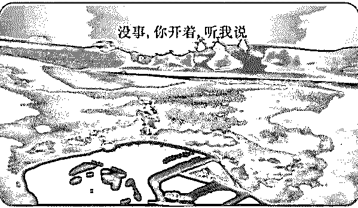

与常见的外挂不同，这类型挂并没有在常见的功能上下功夫，而是剑走偏锋。它是能够极大提高使用者的移动速度，或是赋予使用者奇妙的隐身功能。

**天崩地裂，一拳超人**

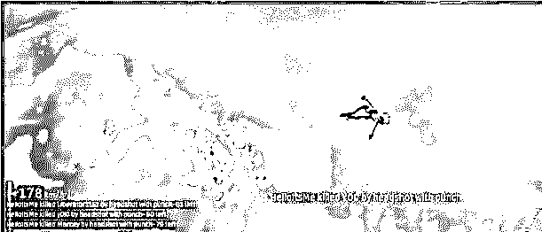

一拳干爆地球不是梦想，在飞机上还未来的及接触大地，就可以反哺地球母亲了。

**乾坤大挪移，万象天雷引**

这类型的外挂可谓是暴力挂中的暴力挂。它可以打破时空的限制，犹如万象天引一般，把四周敌人的“灵魂”吸到面前，对着面前的“灵魂”一阵扫射，远在百米外的敌人即会自动跟着死亡。

> **为什么国外游戏外挂更多？因为它们跟外挂斗争的经验太少了！**

事实是，外国人使用外挂没中国这么厉害，相应的，国外厂商的反外挂能力也不如中国厂商。”

尴尬的是，现在很多外挂玩家的 id 还是 china 什么什么的，当他们出现在亚洲服务器上横行肆虐，喷着“China No.1”时，无疑丢了很多普通中国人的脸！

外挂对于游戏厂商的损害显而易见。一方面，外挂的使用如果不被控制，会使得游戏不平衡、伤害正常玩家的游戏体验，久而久之玩家减少，也使得游戏寿命周期缩短。另一方面，正常玩家被外挂虐过之后，也可能想要使用，进而使得外挂在游戏中扩散，形成恶性循环。

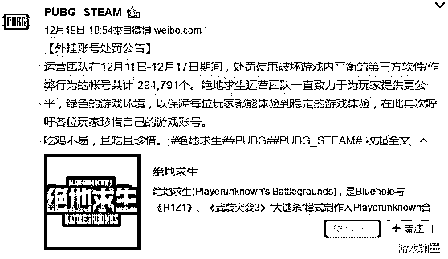

此外我还了解到，像上文提到的透视、自动瞄准等外挂功能均属于更加粗暴的外挂类型：玩家在屏幕上看到的内容被称为“显示”，是由客户端经过处理后呈现给玩家的，而实际上的逻辑运算（“服务器”）是在后端运算的，玩家看不到。“透视功能”就是外挂通过绕过客户端，直接去服务器上偷信息，而得以实现的。

“像变速齿轮这种更暴力的挂，国内只要是大厂出品几乎是不会出现的，偶尔有漏洞也是 24 小时之内就堵掉了。”他说，“因为一般外挂都是钻服务器和客户端之间的空子，国内网络游戏在客户端和服务器互相之间的校验上都是很严格的！”

“其实这个市场不好混就在于产品迭代速度实在是快。”W 说，国外高手如云，外挂比国内便宜很多甚至那些机械狗一类都是免费的，国内外挂商为了利益加密，做到挂需要用卡密解锁，“或者国内高手通过解锁开源的方法拿到挂的基础数据进行改动。”

只要是 FPS 游戏就一定有外挂的存在。“因为 fps 游戏是通过数据传输达到人物拟态等等效果的，而外挂是通过软件数据传输过程中修改达到目的的。”

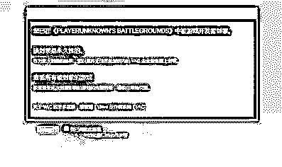

> ****外挂是如何工作的?****

每款网络游戏都由客户端和服务器组成，玩家通过客户端输入操作，服务器接收操作信号后进行运算，再将运算结果反馈回客户端，最终变为玩家眼前的游戏画面。

理想状态下，数据应该由服务器决定，客户端只负责显示结果。但是 FPS 游戏都存在延迟问题，不可能在开枪之前先通过服务器验证信息，只能把很多运算放在本地进行，这就给了外挂可乘之机，只需要绕过反外挂机制，调出本地数据，就能够实现各种外挂功能。

最简单的外挂会直接修改输入数据，我们一般称之为内存挂。内存挂简单粗暴，能够实现一些匪夷所思的功能：

改变角色坐标，就能飞天遁地

改变角色骨骼参数，可以变成路飞

改变敌人的角色坐标，使出吸星大法

这些看似很强的内存挂其实并不专业，它们会留下无法清除的异常数据，反外挂程序可以轻易追查。所以**“神仙斗法”型外挂都是一次性用品**，惨遭封号是迟早的事。除了《绝地求生》，我们很少会在其他游戏中见到这类外挂。

更主流的外挂不会修改数据，只需读取游戏内存或模拟玩家操作，就能让开挂者获得巨大的优势。这类外挂技术要复杂一点，但是对于大多数反外挂程序来说，它们无迹可寻，追查起来难度很大。

比如透视功能就是利用了读取内存的技术，将本该对玩家隐藏的坐标信息显示出来。

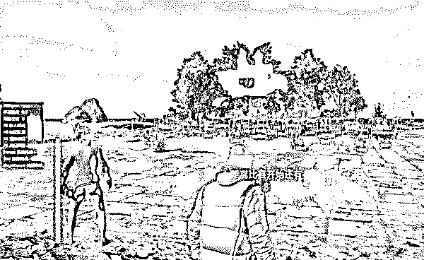

至于降低后坐力的压枪挂，是通过虚拟指令，模拟鼠标的移动轨迹，开枪之后把准星迅速定位到原来的位置。

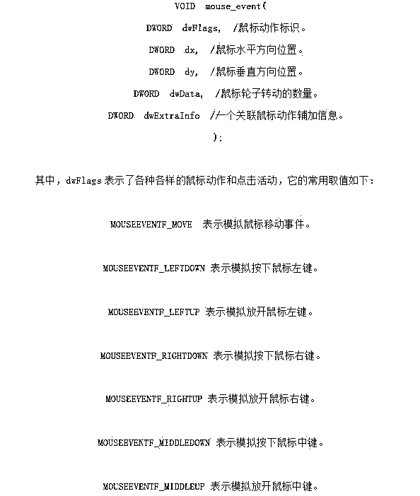

这是外挂教程中，一段模拟鼠标指令的代码

自瞄结合了以上两种功能，先读取内存，找到其他角色的骨骼位置，再模拟鼠标操作，让枪口始终跟着人物骨骼模型。自瞄可以爆头，当然也可以固定瞄准其他位置，“超级瞄准”部署之后想打哪就打哪。

黄线就是人物骨骼

开了自瞄之后我自己都控制不住自己

成功绕过内存保护后，模拟鼠标信号在程序看来就和玩家操作就没什么区别了，反作弊程序很难监控到非内存挂的存在。剩下的唯一方法和杀毒软件类似，就是在游戏启动时扫描后台程序，将外挂精确识别出来。

可是该如何识别出哪些程序是外挂，同时又不误封正常程序呢？

要想找到外挂，需要通过一个叫做**“特征码”**的东西，每种程序都拥有一段特征码，这相当于程序的指纹。只要得到外挂的特征码，游戏运行时反作弊程序就能确认玩家是否开挂。

这也意味着，**想要找到外挂，至少需要一个样本**。为了获得外挂特征码，游戏厂商和外挂贩子每天都在上演着“无间道”。**官方会用各种方法获得外挂样本，比如派出卧底购买外挂。**拿到样本后，通过技术手段分析它们的特征码，才能将同种挂全部封禁。

外挂贩子则会做出很多种功能相同而特征码不同的外挂，将客户分为几十人或上百人一个小组，哪个小组被封了，哪里就出了内鬼。之后可以通过重新分组等方法快速追查到卧底，把二五仔送进黑名单，永远不再提供服务。

在不断的斗争中，反作弊程序始终处在下风。但外挂贩子的制售成本也一直在攀升，过去一个外挂可以卖给几百上千人，现在只能卖给几十个人，所以你可能还惊讶于吃鸡外挂的价格，供需关系导致了它的高价。

进一步地，如果找不到样本，那反作弊程序就无计可施了。

要是你愿意掏更多的钱，一个人把这几十个人的钱都出了。那么恭喜你，你将拥有一款主播专用定制挂！它的特征码全球独一无二，**即使你用到吃鸡关服，官方也拿你没办法。**面对任何质疑你的人，都可以用一句话搪塞过去——“蓝洞没封我的号，所以我没开挂。”

> ****无可奈何的蓝洞****

蓝洞真的束手无策了吗？至少目前看起来是这样的。

《绝地求生》作为一个韩国小厂的作品，遏制外挂的能力明显低于业界平均水平，在外挂同样泛滥的其他 FPS 游戏中，很少会流传出来飞天遁地骨骼变形这么离谱的外挂，这说明蓝洞连最基本的代码可能都没写好。这款“虚幻 4”打造的游戏仅用了一年时间来完成开发，很难想象程序中到底存在多少漏洞。

不过在外挂的设防上，蓝洞其实也曾努力过。**《绝地求生》使用了最激进的反外挂程序 BattlEye（后文简称 BE）**。一些玩家可能都听说过 BE 曾经逼死了《方舟：生存进化》的外挂制售团队，可能也知道 BE 拯救过曾经群魔乱舞的《彩虹六号：围攻》。至少在目前来说，市面上没有比 BE 更好的**第三方**反作弊程序了。

使用 BE 反外挂的游戏

对于外挂制作者，BE 也是最令他们感到棘手的东西，破解 BE 的成本要远高于其他反挂程序。据一位网友整理，**在外网上明码标价的《绝地求生》外挂，均价在每月 150 美元左右，而一款《CS:GO》外挂有的仅需 10 美元。**

除了使用 BE 反外挂程序，在完善自身漏洞上，蓝洞也算得上不遗余力。无论是更新还是封禁都相当频繁。在新地图中加入的死亡回放功能，似乎也表明人工监管力度会越来越强。

只不过人手太少，窟窿太大。就算蓝洞更新得再快，BE 功能再强，在无数条隐秘的生产线上，外挂还是在源源不断地被生产出来。

对于一款成熟的射击游戏来说，治理外挂往往需要多管齐下。比如《CS：GO》和《彩虹六号：围攻》这两款游戏，在程序反挂的同时，也使用社区 GM 监管。

一旦有些玩家战绩过高，或遭到多次举报，就会触发监管机制。将被举报者的录像发给一些拥有监管权限的玩家，并由他们判断被举报者是否开了外挂，进一步压缩开挂者的生存空间。

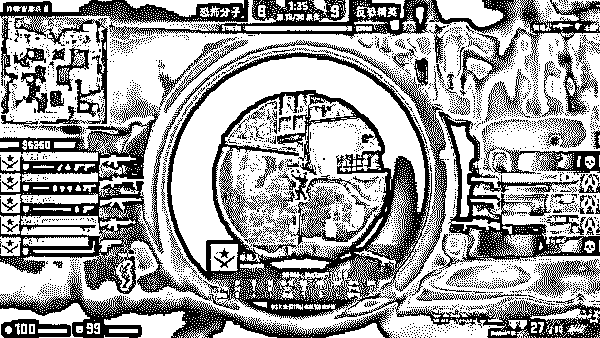

CS 的监管模式

《绝地求生》其实也尝试引入了这种机制，一局击杀超过 15 人或被多人举报，会将嫌疑账号封禁监测，PDD 就因一局 17 杀吃鸡而被封号 24 小时。

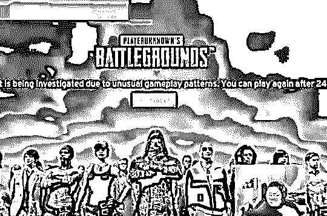

但目前来看，这种方法还没有全面实施，以《绝地求生》的玩家基数来看，推行人工监管依然需要很长的时间。讽刺的是，《绝地求生》的引以为豪的游戏设计，也给外挂留下了很大的发展空间——只需要简单的透视和压枪，就能获得巨大的收益，每局一百人只有一个胜者的游戏模式，让开挂者获胜后能获得极大的成就感。

相应的，主播开挂的动机也就更为强烈了：作为一个极其推崇个人英雄主义的游戏，能经常吃到鸡的技术型主播，可以收获大量的关注度和崇拜者，这些都与主播的收入直接挂钩。**花钱卖挂开直播，然后赚更多的钱，这就是开挂主播的盈利模式。**

> ****外挂从哪来？****

《绝地求生》获得了与其量级不相匹配的成功，接踵而来的许多问题，并不是蓝洞这家小作坊处理的了的。更别提还有一群虎视眈眈的人眼馋着这块肉。由于利益驱使，外挂贩子也迅速地团结了起来，这个团体的规模可能比整个蓝洞还要大。

国内外的一些专用论坛，就成为了外挂贩子的根据地。这里简直是外挂开发者的天堂，不仅可以公然叫卖外挂，甚至还有一股子学术氛围。这些黑客看起来都是专业的程序员，活跃度非常高。他们还会交流技术，请教问题，共享外挂源码，**你甚至可以找到教新手做外挂的教程**，气氛好得有点诡异。

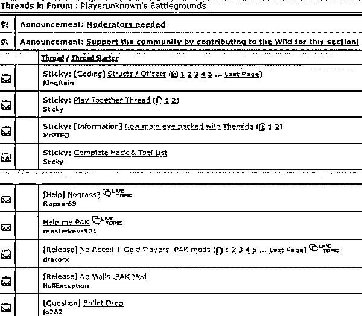

这是国外最大的外挂论坛之一，他们什么外挂都做，几乎无所不包

做外挂的也可以很八卦，他们也会讨论五五开同学：

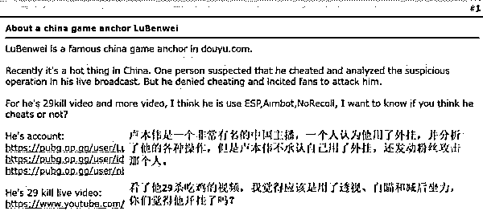

最后这些做外挂的人居然还得出一个结论，说五五开可能没开挂，只是用了鼠标宏。

比起平淡无奇的国外论坛，国内外挂论坛的画风则是一片热闹，红红火火。

这里不仅可以卖挂，还能**招聘、找项目、招投标**。单刀直入绝不墨迹，整个流程非常“效率”。

反外挂程序不断更新换代，给外挂开发带来很大的阻碍。为了集中力量突破游戏厂商封锁，他们还会共享大量的源码和成品模块。看来只有互帮互助才能实现“共同富裕”。

中国的外挂贩子在开发领域也独树一帜，他们普遍使用一种“易语言”编写外挂，据说这种语言全部使用中文，门槛非常低，开发者自称“可以在很短的时间内精通”。这款相当不入流的语言，不知从何时开始变成了外挂开发的重地。很多开发者甚至说，易语言对外挂产业在中国的发展起到了至关重要的作用。

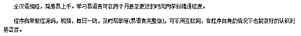

易语言的自我宣传

这样看来，开发外挂和反外挂的难度完全不对等。做出一款最基本的外挂，可能并不需要多高的开发水平，而一张外挂月卡竟能卖出几百乃至上千元，实在是暴利。怪不得吸引了这么多人源源不断投入到外挂行业中。

在中国，外挂产业已经形成了一个完整的生态，这些人对游戏市场非常敏感，**哪个游戏火了，他们会一窝蜂地扎进去，当这个游戏的玩家流失殆尽，他们便开始投身下一个项目。**当然，私人订制也是他们的业务之一，游戏主播带来的巨大流量正在悄然改变这个灰色产业的规则。

> **结尾**

为什么外挂在中国如此猖獗？这个问题的答案可能不止一个，外服游戏在中国区运营不力、国产网游“氪金”风气盛行、游戏行业监管落后等等因素都有关系，但一个无法忽视的事实是，游戏行业在中国涉及的利益太大。

有光明的地方就有黑暗，在中国游戏产业仿佛开了挂一般飞速发展的同时，黑色产业也在暗中生长。打击外挂、维护健康的行业生态，将是一场持久的战争。

**延伸阅读：**[深度|揭秘“吃鸡”外挂工作室轻松月入百万的黑幕：卧底内部，层层解密，利欲熏心，套路重重！](http://mp.weixin.qq.com/s?__biz=MzIyMDYwMTk0Mw==&mid=2247489294&idx=1&sn=d5bccb01075b0068c8c34559f6b4cb41&chksm=97c8dc36a0bf5520c3ccd99199f34cd36af0de798249cc215a031f352aa83dd2409cc880e411&scene=21#wechat_redirect)

* * *

**【灰产圈】高端社群 小程序已开通，社群成员 900＋**

<mp-miniprogram class="miniprogram_element" data-miniprogram-appid="wx4f706964b979122a" data-miniprogram-path="pages/topics/topics?group_id=881854415822" data-miniprogram-nickname="知识星球" data-miniprogram-avatar="http://mmbiz.qpic.cn/mmbiz_png/kialtkOXGKS7D9hZrmO2jzDqryXXTAlhxSpnrKnHGV65KXzicibOppaPic4dCRxftvabB8Iqswo3OuQEDSxE7NicXBg/0?wx_fmt=png" data-miniprogram-title="【灰产圈】高端社群" data-miniprogram-imageurl="http://mmbiz.qpic.cn/mmbiz_jpg/WWG78hysZ0brJkWoyG2VDIacqgQjkDfp6mLiaoPBJ2SgWZHtRuTw7ia8kpoxntsn7PiaFOQO2U23FW6Iry0gS1GnA/0?wx_fmt=jpeg"></mp-miniprogram>

点击“阅读原文”加入高端社群。