# 深度|揭秘互联网黑灰产业链之"黄牛软件"江湖：20 岁的黑客老枪与代理小江、花姐的故事

> 原文：[`mp.weixin.qq.com/s?__biz=MzIyMDYwMTk0Mw==&mid=2247489866&idx=1&sn=83d7d6a0d3e0c121fea83de1d8262b52&chksm=97c8d272a0bf5b649d0410b9b79def031896e942a88d870760c81f0a605f1b27c1990d0a4030&scene=27#wechat_redirect`](http://mp.weixin.qq.com/s?__biz=MzIyMDYwMTk0Mw==&mid=2247489866&idx=1&sn=83d7d6a0d3e0c121fea83de1d8262b52&chksm=97c8d272a0bf5b649d0410b9b79def031896e942a88d870760c81f0a605f1b27c1990d0a4030&scene=27#wechat_redirect)

标题文字

**该文由阿里巴巴安全部归零实验室投稿**

> **导语：**

            天下熙熙，皆为利来；天下攘攘，皆为利往。有人的地方就有江湖，有江湖的地方就有利益纷争，就有勾心斗角，就有尔虞我诈，这个社会从来如此。众生百态，如今这种传统在互联网圈内以一种赤裸裸的方式展现在每个人的面前，黄牛只是其中的冰山一角。但窥一斑而知全豹，黄牛软件作者、代理、用户，在这种奇妙的三角关系中，相爱相杀，而这背后映射着的是今天整个互联网黑灰产的普相。

1

> ## **20 岁的开发者：老枪**

        老枪的软件几乎圈内人手一份，这些人的大多数都是靠老枪的软件起家的。有次各大电商平台安全防护升级，圈内其他软件都崩盘了，包括老枪的软件。但老枪是圈内唯一一个在一天时间内解了这个问题的人。老枪的这一尊称并未浪得虚名。

        老枪并不老，实际看上去只有二十多。大学选的专业是机械工程，中途发现还是互联网来钱快就自学成才，毕业后进了一家小型互联网公司，做 VB 开发。

        一个月连续抢手机落空的挫败感让自尊心很强的老枪开始研究技术型抢购，心血来潮开发的第一版软件竟然顺利秒到了自己想要的手机。后来送给同事用，后来发到论坛共享着用。某天，一个叫小江的网友要合伙和他卖软件，老枪老老实实写了五六年的代码，这才意识到原来这里有这么大的市场。

       小江包办了技术外所有的东西，而剩下的技术这块全部丢给了老枪。老枪喜欢这一行，一方面是靠软件卖到的钱确实要比工资翻好几番，一方面圈子内大多数用户对自己顶礼膜拜，似乎这是一份体面的工作。

        老枪喜欢微服私访，常常潜入到用户群里。但老枪在群里从来不说话，他的好友申请有串密码，这个密码只告诉过小江。有什么技术升级与问题，都只和小江私聊，用户也找不到他。“用户太多，不知道哪些是黄牛，哪些是记者，哪些是同行。做这一行，还是被别人了解的越少越好”

       普通用户看不到老枪，**但老枪有一架长长的望远镜，可以望到每个人的电脑里。**

 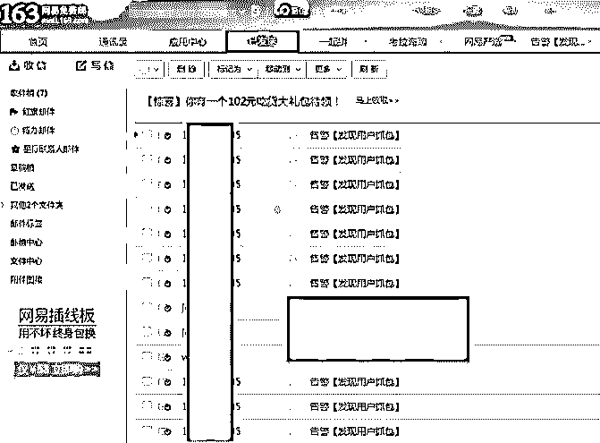

        为了防止居心叵测的用户拿来软件做破解、做抓包分析，老枪的软件都被加了一层保护壳，一般人是直接分析不了的。

       里面还都有一套对抗代码，一旦发现有人抓包、破解，软件就会将用户的账号、电脑桌面截图发送到老枪的邮箱里。

**       “这不算什么，大家都这样。我买过一个同行的软件，有次抓包被发现了，那个软件直接把我的抓包程序给卸载了，然后我的账号也被封掉了。算法是我们这些软件的核心竞争力，做这些更多的是用来防止同行研究！”**

         关于程序员编程语言鄙视链的行规，在这个圈子里就是一个笑话。

         老枪的程序是 VB 写的，但老枪对同行中大量充斥的 E 语言程序并没有嗤之以鼻。

        “这个梗都是新手玩的，不瞒你说，现在我最怕的是 E 语言。我费劲周折写出来的代码，在人家那里可能就几个模块封装好了，上手快，安全性好，一个模块不会写就去网上买，三百块钱能搞定的事情那就不叫事情！在这个圈子里，你只认技术，那你就已经输了，更何况人家技术也没差啊” 

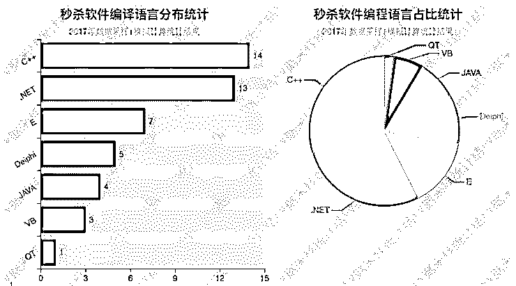

        软件生命周期都很短，一个黑灰产软件从鼎盛到没落，能撑过两年，就已经算非常厉害了。想要赚钱，必须打好时间差。

       刚开始，技术并不是核心，国内无线刚起步那会，各家 APP 为了争夺市场，代码都写的很简单，任何一个懂点逆向和程序的人，都可以搞出来一个秒杀软件，那时候拼的是速度和用户体验。用户也是明眼人，谁家的效果好、功能多、升级快，服务好，用户就往哪里跑。

         老枪倒也勤快，每次都能抢先一步，用户暴涨，单凭一个老枪已经无法估算出整个市场的规模了。

        但这种情况，各路牛鬼神蛇都看在眼里，没几个月就出来好几款软件，功能和老枪的类似。结果每天的抢购变成了软件们的军备竞赛，有几次量太大，直接把人家平台给搞垮了。电商开始应战，加强策略，防护升级，黄牛软件崩盘，无一例外。风口过去了，软件才慢慢恢复起来。

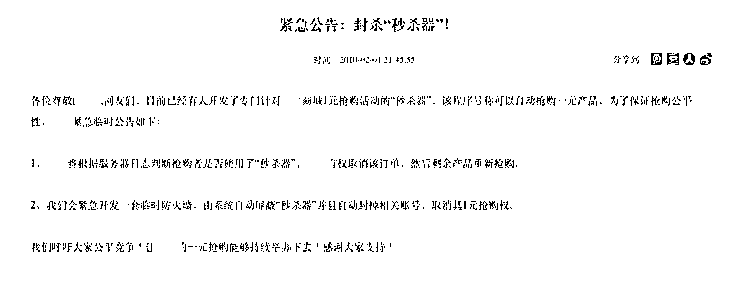

**         老枪总结到那场风波，”一只老鼠害了一锅汤“。可老枪从来没有意识到这群老鼠中，它才是其中真正的鼠王。**

         经历了那次风险之后，老枪意识到一劳永逸这种想法注定是干不过各大电商的，干不过各大电商，就意味着干不过同行，为了保留用户，必须要做好游击战的准备。

         大公司结构复杂，而稳定性压倒一切，一个防护策略往往要求很低的误报率；业务扩张快，基本上都是用同一套老版本 SDK 快速搭建框架，而老版本体系就意味着没有安全可言，新业务又为了图快，尝尝自己写协议独立发布。

         跟着电商业务走，即使今天封了这个口，那明天又会上一个新的口，应该能杀出一条血路来。

         摆在老枪面前的有两座大山，登陆和下单。

         登陆是最复杂的，刚开始老枪自己还能逆出来一些算法，但随着对抗的升级，老枪的功力已经捉襟见肘了。后来老枪干脆在黑市上买算法，每次对抗升级后的新算法大概要价 3W 左右，老枪倒也觉得公道，想想也就十几个用户的价钱。

        而老枪自己要面对的，也是最棘手的就是在下单。算法可以让别人搞定，但业务和防护必须由自己研究。电商的防护可能过几天就要升级一次，这就意味着在接下来的几天内，老枪必须搞清楚这次升级的地方在哪里。

**       起初一次防护对抗，老枪需要研究三个月，后来是一个月，后来是一周。混了那么久，老枪已经对各电商的协议、安全措施了熟于心，所谓的升级每次无非小改一下，大刀阔斧的修改从来是没遇到过的。老枪的小米加步枪打法和不断积累的经验，终于反击了一成，用户量就是最好的证明。**

        平静总是要被打破的，老枪被人蒙了黑棍。

        从上周开始，老枪的服务器已经开始不稳定了，小江反馈了好几次，说群里的人都说登陆不上去了。老枪心急火燎的登上服务器查日志，才发现日志已经被爆掉了。

        ”可能是用户太多了吧“,老枪安慰着自己，增加了两台负载之后，发现还是没有好转，老枪才意识到可能被人盯上了。日志量太大了，肉眼根本看不过来，老枪写了个脚本才发现原来是被人 CC 了，甚至有些还夹杂着 SQL 注入和扫描。让老枪直接发火的那次，用户数据库被人删了，查不到任何记录。

         从小江那里拿来之前的备份，才恢复回来，还给用户多赔了一个月的使用时长，这才算压下了这场危机。

        老枪火了，对技术人员来说，这就是砸场子，就是挑衅，就是对他技术的侮辱。可他又无可奈何，他太擅长攻了，但从未考虑过自己有天也要面临防守这个棘手的问题。但不反击就是示弱，他忍不了。万般无奈之下，老枪花了一天的时间去升级服务器，部署安全狗，更换域名。

        小江问老枪是不是得罪了哪路大神啊，老枪猜测可能的原因是因为当初他把自己的算法核心代码都放在了服务器上，软件只是一个壳子，即使软件被拿过去分析出来了源码，也无济于事。尴尬的是，老枪压根不知道搞他的是哪个，同行太多。

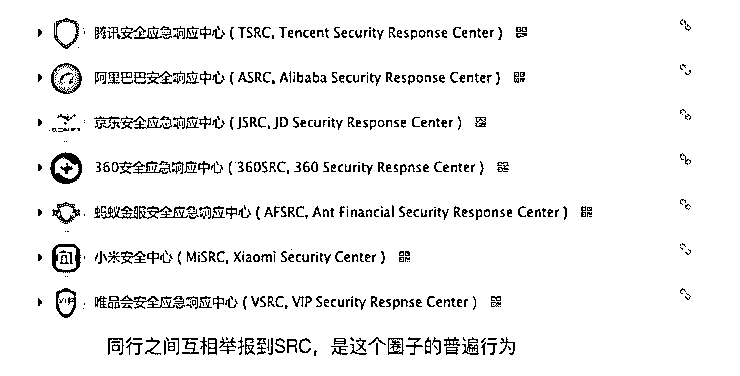

         老枪的防守果然没用。寻思来寻思去，恼羞成怒之下，某天用了小号到各大电商平台 SRC 上，把除自己之外所有同行软件都举报了个遍。 一个月之后，老枪的软件已经不再挨用户的骂了，吊车尾这个名号也被人摘了下去.

        因为市场上也没几款软件了。

        小江发来一条短信”老枪，恭喜你，上道了。”

2

> ##  **28 开分成的软件总代理：小江**

         拿老枪的话来说，是小江救活了他的软件。

         老枪和小江的分成是 28 开。这个分成刚开始老枪是不认的，觉得自己做技术应该是最有功的，一个区区小代理竟然要拿八成。

         自认为酒香不怕巷子深，只要技术做的好，客户也会越攒越多。两人初次谈判不欢而散，老枪开始自己卖软件。三个月过去了，并没有像预期中那样，用户量还是涨不上去。

          而老枪平时不但要负责软件的更新升级，还要教很多新手怎么用他的软件，宣传也提不上议程。更为愤懑的是，很多新手因为用了软件抢不到东西动不动就在群里发起投票，投票的议题是老枪算不算个骗子。

          老枪终于感到这样疲于奔命只会让自己分身乏术。某个夜里，他联系了小江“兄弟，销售这一套我还是玩不转，28 开就 28 开吧！” 小枪的头像终于亮了”想通了啊。          那从今天开始，你只负责软件的事情，其他的事情我来操刀，你不用管！“

        成为老枪的代理后，小江依赖着多年摸爬滚打学来的经验，快速成为了救火队长。他的目标很明确，就是怎么把老枪的软件打造成爆款。

         小江先瞄准了老枪卖软件最大的短板——圈子太小。

        当时几乎所有的用户都是当初众测时留下的一批用户，新用户也算是圈内传进来的。“他这么玩，格局太小。”

        于是小江先让老枪给自己搭建了一个网站，就是那种官方站点。自己要做的就是贴一段文案，再整个漂亮的界面，晒下软件的功能图，留下软件的官方 QQ 群。老枪也曾犹豫过，要不要这么高调？但看到一个月过后人数蹿涨的 QQ 群和暴涨的转化率，老枪也不去想了。 

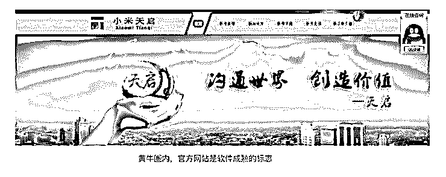

           打破了圈子的壁垒，感兴趣的用户越来越多，望着不断扩大的分群，小江终于开始了他最拿手的好戏--广告营销。小江花了一些钱，从一个朋友那里雇佣了一批所谓的键盘侠，这些人需要的就是在各个贴吧、论坛、QQ 空间、同类 QQ 群内每天狂魂乱炸关于老枪的软件怎么怎么好，其他同行的软件又是多么多么垃圾。

          效果怎么样，小江并不关心，他每天只询盘一件事情，那就是今天这些消息发了没有，只要发了，小江的效果就达到了。 

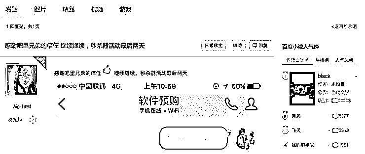

         老枪的软件并不是像外界吹的那样神乎其神，一般 100 个人用软件抢购，能有一半人抢到就算非常不错了，这一点小江是清楚的。

**一方面，小江一直在催老枪研究新技术；另一方面，小江会私下给那些抢购成功的人发信息，让把软件抢购成功的截图发到群里，然后再给这些人一些赏金。**

 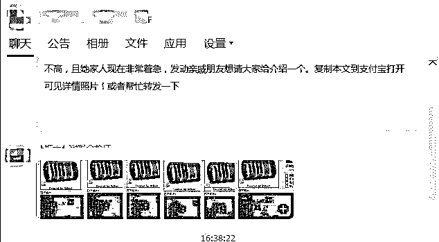

        后来老枪只研究技术去了，软件怎么卖也是让小江拍的。

**  小江的价格规则很简单，月卡、季卡、永久版，低版本的可以升级，软件永久更新，每款产品都支持售后服务。价格更暴力，就瞅着当前二档同类软件市场平均价多钱，他们就贱卖一半。**

       ”同类软件技术上都彼此彼此，但价格战上我们占绝对优势，老枪也是一个技术上勤快的人。看似拿价格自残，实际上都没我们赚的多。“

        一年过后，软件基本上不需要宣传了。小江摇身一变成了总代理，日常只需要和老枪、下线代理打打交道，基本上不再会和用户直接接触。但小江总觉得这样的春天迟早会过去，这种不安一直萦绕在心头。

      小江的第六感很准，后院先失火了。

       很多二线代理拿到卡密后，再次发展下线，并溢价贩卖，用户已经分不清楚各个代理孰真孰假，代理鱼龙混杂，有些收款后马上把用户拉黑。行规不能破，要不然这生意玩不下去了。

        小江坐不住，就让老枪火线加急在官方网站上上线代理查询功能，所有跟小江报备过的代理才会出现在站点上。凡是野代理被发现，根据卡号其上线代理也会被取消资格和封号。这场封杀持续了一个多月，情况才有好转。

         紧随而来是电商平台的动作。各大电商似乎已经注意到了他们的存在，老枪的软件每次升级更新都会在段时间内被封杀，明明测试的时候可以用，一旦发布到用户手里，效果又都打了折扣，老枪的软件独领风骚的架势已经越来越弱了。

        小江急，老枪也急。

        最要命的是一年前的高调和业界的口碑爆棚吸引了大量的用户，但同时也让更多的人注意到了黄牛软件这块大蛋糕，一夜之间市场上涌出来了好多同类软件，同样的在拼价格战。有款软件，开卡费用很低，用户直接免费使用，抢不到不收钱，抢到了按照市场黄牛差价计费，软件更新的速度和老枪不相上下。

        市场重新洗牌，小江的人生赢家道路上，再次遭遇了滑铁卢。新用户越来越少，老用户的抗议越来越多，技术升级的周期越来越长，月收入和去年相比，下降了一半。

         小江意识到今天的现状仅仅只是个开始，如果再不想想办法，迟早会吊死在老枪这颗树上。老枪懂技术，为了一个技术突破，他可以研究好几个月，即使真的软件不能用了也没关系，至少凭技术还能养活自己。但他不行，假如老枪有一天怂了不干了，他也就成了废物。

        小江背着老枪，私下里开始联系其他软件作者做代理。”这块圈子越往上走越封闭，我跟一个新软件作者套关系套了差不多有一个月，他才给了我代理资格。不过一个月之后，我才搞明白这个人根本不是作者，而是那个作者的一级代理，而作者是谁，只有鬼知道“

 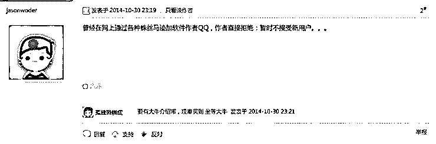

       小江毕竟是小江，终于挺过了这道危机。圈内又送了他一个绰号，江百度。市场上有哪些软件，效果怎么样，什么价位，只要你想知道，能联系到小江就行。

       小江和老枪的联系越来越少，老枪的软件好用与否似乎不再是小江关心的重点。

        接触的软件作者多了，小江也慢慢认识到天外有天，人外有人，老枪的技术只能归到二档，那些一档的软件之所以短时间内没老枪的卖的好，是犯了同样的营销毛病。而这种病，他闭眼都能治好。

         "还没有想好什么时候向老枪摊牌,虽然我俩从来都没见过面，但毕竟一起搞事也快两年了，现在甩手走人，多少有些于心不忍”

3

> ## **倒卖者客户：花姐**

          **几乎每一个软件黄牛党们，都是踩着前人踩过的坑，从在信息爆炸的洪流冲洗下的一座座孤岛上，过五关斩六将才得以进入这片丰收的新大陆。**

           在这片大陆上，每个人心中都藏着自己的秘密，而又怀惴不安地窥探着同类的一举一动，消息的流通在这里又成为了权力的游戏。他们夹杂在软件作者和普通手动档用户中间，一方面对于作者顶礼膜拜，视之为其衣食父母，一方面又对新入行的小生们嗤之以鼻，嘲笑着新人，如同嘲笑着当年的自己。

            尼采在《善恶的彼岸》中说过：**与恶龙缠斗过久,自身亦成为恶龙；凝视深渊过久,深渊将回以凝视。曾经挤破头才进来的圈子不但没有扩大，反倒因为自己的加入越缩越小。恨人有，笑人无，自古如此。屠龙的少年，盘伏在金山上，终究也成了恶龙。**

         花姐是小江印象比较深刻的一个客户。

         新出的软件，她都是第一批购买的，也经常在其他软件群里跟花姐撞个正着。花姐从来不晒单，但小江觉得花姐一定赚了不少钱，要不然有些动辄上千元的软件，花姐买起来从来都不眨眨眼。 小江并没有猜错，在没有软件之前，花姐就已经开始赚钱了。

         花姐是当初某米问世时第一批吃到螃蟹的那批人。某米的出现，为花姐打开了一道新的大门。“以前没见过世面，第一次抢到的手机是什么我忘了，那天我抢到之后直接倒手赚了三百块钱，记得特别清楚，高兴了我整整一天。”

花姐花了不少钱。

         买软件是第一笔大额的开销，但不是全部。购买软件的人多了，抢购效果就打打折扣，这时候花姐听代理说买软件还得买服务器，服务器性能网速配置越好，就比同样在家用软件的人抢成功的概率大。花姐买了台服务器试了下，发现似乎还有点效果，服务器就从此成为了标配。但服务器本身费用不低，花姐一天主要抢购的时间就那么几个点，月租不太划算。

         某天在网上看到有按小时收费的服务器租赁，租了几台试了试，没出大的毛病，花姐觉得自己好机智。但问题又来了，花姐买的服务器太多了，每天上传抢购软件到临时的服务器上纯靠人工就要花费很长的时间，太累了。

         小江推荐给花姐一个远程管理工具，批量的，一次性 50 台服务器没有问题，还自带文件上传的 FTP 功能，正好可以解这个问题。花姐从小江那里又买了这款软件，设备方面的问题大概就解决了。

         剩下要解的问题就是账号了。各大电商的账号封号特别快，很多临时申请的账号只要用过几次软件第二天就作废了。有账号不一定能抢得到，但没账号直接就没有抢购资格。

         万能的小江提供账号服务，他手里有很多小号，每天都有新的，也不知道是怎么来的，据小江说这些号都是神号，从注册到使用，基本上都已经养了有半年左右，一般电商平台都不会在短时间内封掉这些账号，很适合抢购。这是花姐日常最后需要做的采购。

         花姐的日常就是每天 9 点打开电脑登上新购买的服务器，传上去参与抢购的软件和昨天晚上新购买的账号，设置好要抢购的商品信息，填好倒计时，等待 10 点的到来。一般电商都在早上 10 点做活动，所以很多同行也都守着这个时间点。等到 10 点半左右抢购结束，这个睡眼惺忪的女人才有时间开始收拾自己那凌乱的长发。

 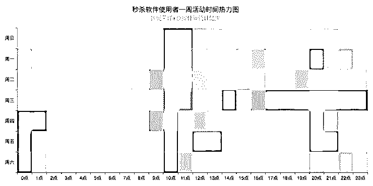

          花姐并不是只抢手机，否则软件的回报率太低。日常哪个电商平台做免单，花姐也去玩几下。最近有什么活动，哪个力度大，花姐一天大部分时间都花在了寻找猎物这件事上。

         又是万能的小江，开始在群里宣传什么“免单信息收集工具”，做的事情和花姐做的差不多，但人家是用软件，而花姐花费的是体力。花姐想想，还是买了，用的时间长了倒也省事，想来想去还是一笔划算的买卖。

         谈到一个黄牛抢购就要准备这么多软件，花这么多钱，花姐似乎并不放在心上。

**        “舍不得孩子套不住狼，有些钱还是该花的。总有人愿意买，你不买，你就输在了起跑线上。我买的最贵的一个软件差不多五千多，但三个月后还是回本了。你想想看，一台华为保时捷官方九千，能抢到的话直接转手两万。这时候你还认为不值吗？”**

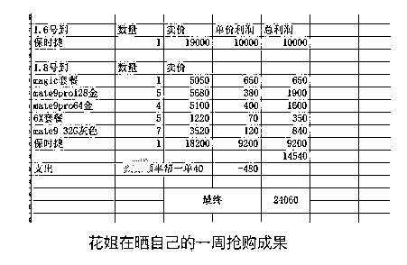

          在各大软件群里，花姐虽不至于潜水，但本身话并不多，偶尔说话也是在问最近有没有什么新软件啊之类的。

**         “以前是拼人流，拉一群人去网吧抢购，跟打架似的，谁人多谁抢到的可能就越大，但相对来说是公平的。现在不行了，软件一出来之后，又变成软件跟软件抢，别说手动用户抢不到，我们有时候一天也开不了张。军备竞赛很麻烦，意味着市场上有哪些神器你自己都得捣腾清楚了。而找到一个好软件比登天都难，谁谁谁手里有牛逼的软件，那才是猛料，但没人愿意站出来跟你说下，都喜欢闷声发大财。给你人家可能又要吃闲饭了，谁乐意呢？天天挂着群，就是想碰碰运气看下有没有新软件代理过来拉生意的”**

           在这个圈子混并没有那么容易，花姐也吃过哑巴亏。

            “有些代理很无耻，一个软件明明不能用了，还拿出来卖，把一个软件破解了也拿出来卖。平时卖软件的时候一个劲的在群里吹，等软件用不了了人一溜烟就不见了，死活联系不到。这种人脑子里只有钱，你问他要些信息他都问你交钱，说是在卖什么教程。新手至少要被坑一回。等大家都举报之后，这伙人又换一个 QQ 号，继续在那坑蒙拐骗。自己眼睛得亮。”

           花姐庆幸认识了小江这样的金牌代理，一方面小江人不错，从来没骗过他，一方面，如果没有小江作为带路人，她是根本进入不了这个圈子的。

            “第一次去找人买软件，人家说自己不卖软件。后来联系到了小江，小江才让那个人把软件卖给我了。太封闭了，你去看群的名字根本就意识不到这是个抢购软件群， 我也从来没有见过哪个代理给我们说过作者的信息，代理高兴了有时候才会晒晒和作者的私聊截图。

            估计以前都被喝过茶吧。有时候自己也觉得自己用软件是不是也有问题啊，但只见过作者被喝茶的，从来没见过用户被查水表的，也就不怕了。”

 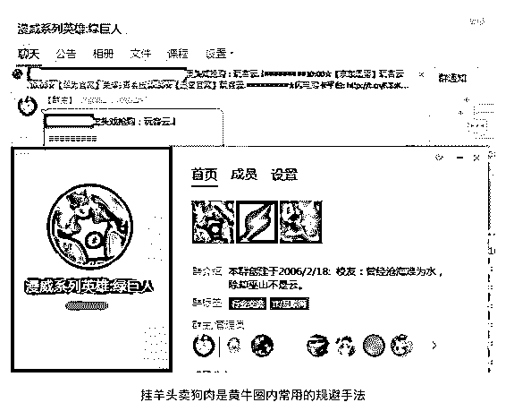

       花姐给自己定了个小目标“明年争取做个代理吧。跟小江打交道久了，慢慢发现还是赚想赚钱的人的钱才是最好赚的钱。”

4

> ## **结尾**

          市场经济下，生产者跟生产者竞争，消费者跟消费者竞争，而生产者从来不跟消费者竞争。黄牛的出现打破了这一规律，作为第一批消费级的供应商，黄牛站在消费者链路的顶层，既和生产者竞争，又跟消费者竞争。

           在需求强劲的区情况下，黄牛将供应量短期内快速垄断，重新评估商品的市场价格，最终再发售。依附在各大电商庞大的经历体上，不断滋生、繁衍、壮大。纳什的智猪博弈中决定了，假如市场经济的浪潮永远不会停歇，羊毛党们一旦遇到退潮，要做的仅仅只是等待。搭载着互联网经济的顺风车，这群羊毛大军永远都在前行。

          短期来看，什么事情都有尽头。经历了两年的盆满钵满，黄牛界的冬天再次来临。

         老枪的软件已经有好几个月没有更新了，小江的 QQ 号也从来没有亮起过。而面对整个黄牛软件圈子，其他的软件也都不再像以前那样给力，售后群内代理作者们集体销声匿迹，似乎都暗示着各大电商开始玩真的了。

         不过，在金钱的刺激下，这个社会将来还会有多少的人会重复走着小江的道路，又有多少技术青年在廉价的出租房内调试着自己的代码，像老枪一样等着电商平台犯错，只要一次犯错，他们可能又要开启一个新的王朝。

   ** 谁也不知道！**

**注： 以上文中出现的姓名均为化名！（事件真实存在）**

* * *

**【灰产圈】高端社群 小程序已开通，社群成员 900＋**

<mp-miniprogram class="miniprogram_element" data-miniprogram-appid="wx4f706964b979122a" data-miniprogram-path="pages/topics/topics?group_id=881854415822" data-miniprogram-nickname="知识星球" data-miniprogram-avatar="http://mmbiz.qpic.cn/mmbiz_png/kialtkOXGKS7D9hZrmO2jzDqryXXTAlhxSpnrKnHGV65KXzicibOppaPic4dCRxftvabB8Iqswo3OuQEDSxE7NicXBg/0?wx_fmt=png" data-miniprogram-title="【灰产圈】高端社群" data-miniprogram-imageurl="http://mmbiz.qpic.cn/mmbiz_jpg/WWG78hysZ0brJkWoyG2VDIacqgQjkDfp6mLiaoPBJ2SgWZHtRuTw7ia8kpoxntsn7PiaFOQO2U23FW6Iry0gS1GnA/0?wx_fmt=jpeg"></mp-miniprogram>

点击“阅读原文”加入高端社群。