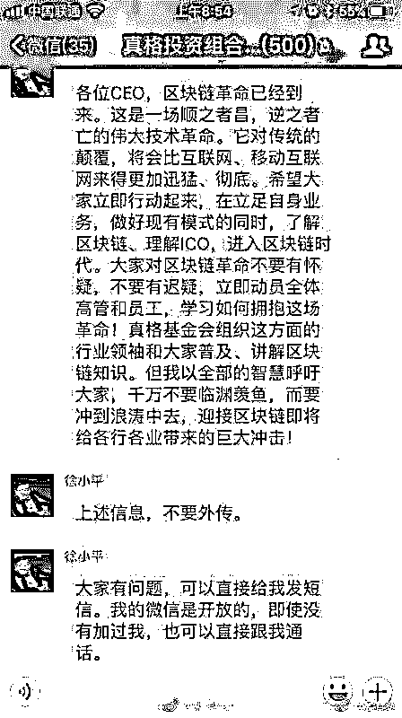
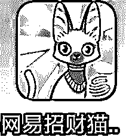
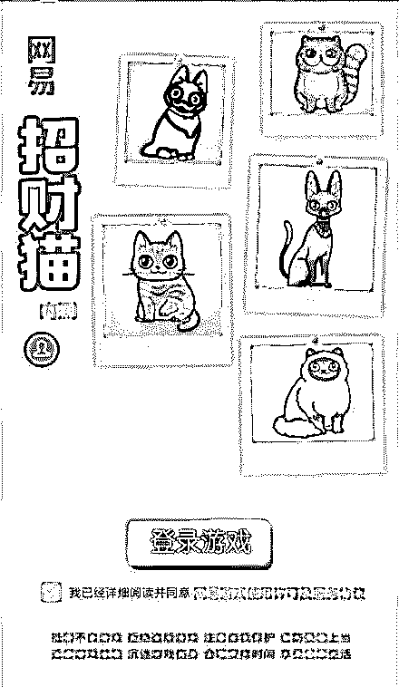
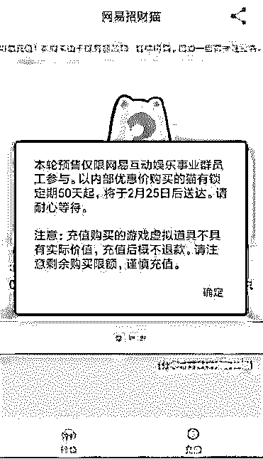
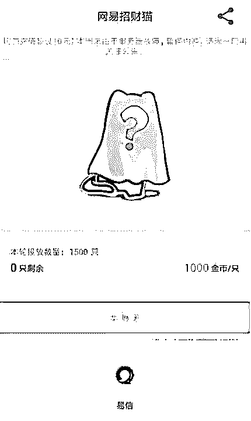
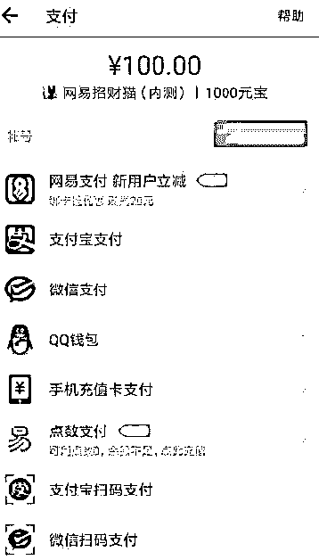
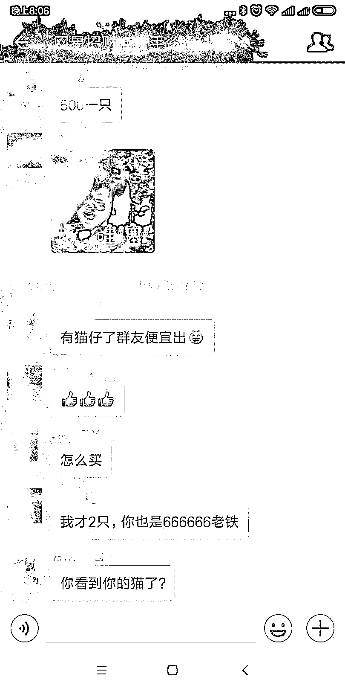
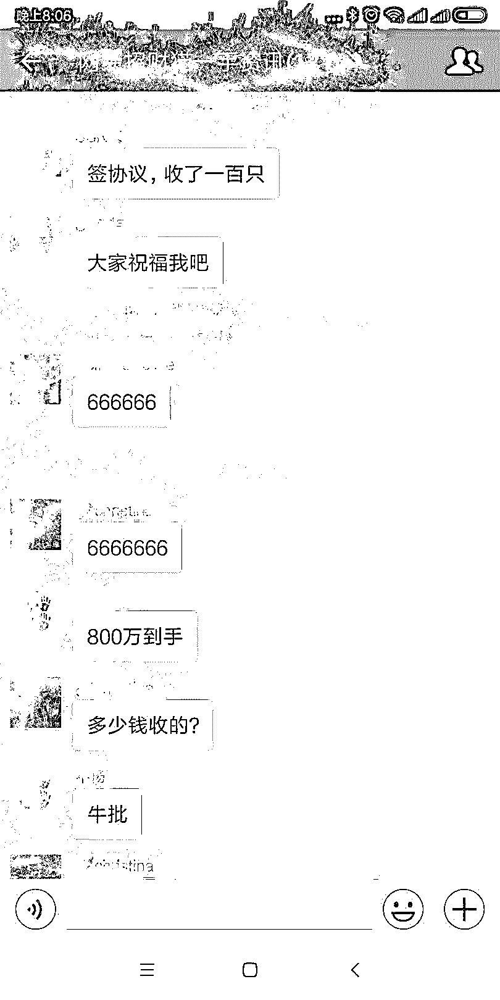
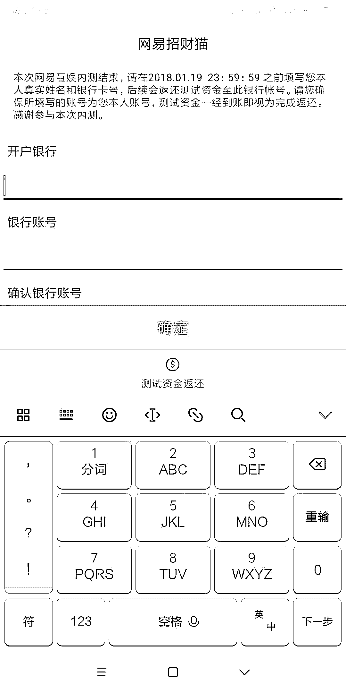
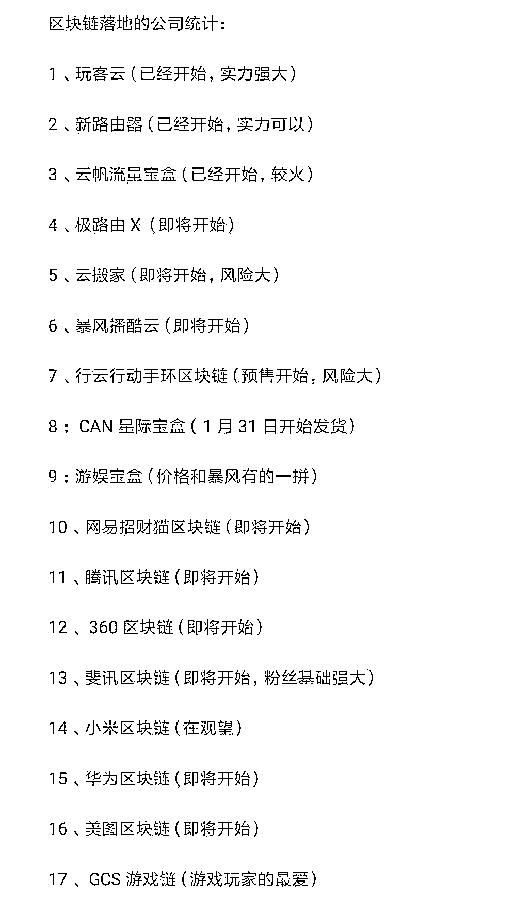

# 深度|丁磊养了七年"猪"，如今又准备养"猫"？揭秘“网易招财猫”：全新区块链宠物

> 原文：[`mp.weixin.qq.com/s?__biz=MzIyMDYwMTk0Mw==&mid=2247489806&idx=1&sn=734bb55c84d2d7802065221a063b7ff7&chksm=97c8d236a0bf5b20912630f12cf06c28aa4ee744b99e829e497f46cec3e3b63d36c823bf8fe8&scene=27#wechat_redirect`](http://mp.weixin.qq.com/s?__biz=MzIyMDYwMTk0Mw==&mid=2247489806&idx=1&sn=734bb55c84d2d7802065221a063b7ff7&chksm=97c8d236a0bf5b20912630f12cf06c28aa4ee744b99e829e497f46cec3e3b63d36c823bf8fe8&scene=27#wechat_redirect)

**导语：**

2018 年，一场始料未及而又具有颠覆性意义的技术革命，正在疯狂来袭，主角就是——区块链。

区块链技术，被认为是继蒸汽机、电力、互联网之后，下一代颠覆性的核心技术，如果说蒸汽机释放了人们的生产力，电力解决了人们基本的生活需求，互联网彻底改变了信息传递的方式，那么区块链作为构造信任的机器，将可能彻底改变整个人类社会价值传递的方式。

区块链这两天完全是“炸了”!接连的涨停潮，已然成为 2018 年度互联网和资本市场的“当红炸子鸡”。

**投资大佬徐小平更是放言：区块链革命已经到来！**

最近有爆料称，网易也开始布局区块链领域，发行数字宠物“网易招财猫”。目前官网已经上线上面仅写着“区块链宠物猫，限量收藏，即将开启！”其它再无任何信息。

> **招财猫的前世今生：**

       最近，出现了一种新奇的养猫方式：　链养猫！云养猫！云撸猫等！

一个神奇的网站前不久刚刚上线 CryptoKitties

       在这个网站上，用户可以通过以太坊区块链购买和养育自己的虚！拟！猫！咪！（这个产品也创造了以太坊创立以来的交易量记录）

**一、什么是 CryptoKitties**

       这玩意，通俗点说就是：以太坊养猫！这家伙，号称最贵萌宠，迅速席卷全球。

       要说币圈新鲜呢，还真是每天不一样。刷新你的价值观！ CryptoKitties 一推出就病毒式的快速扩散，横扫整个以太坊市场。

人们已经累计花了 100 万美金买这些虚拟的猫咪。在网站上最贵的猫咪高达 246 个以太，大约 11 万美金，最便宜的猫咪需要 0.03 个以太，大概 12 美金。

       目前在以太坊上大约 12%的交易花费在这个游戏上，是目前最流行的智能合约，知名智能合约交易所“以德”仅占了 8%的交易量。

一个游戏只用了 6 天时间就打败了所有的币种交易。你能想象吗？反正我已是目瞪口呆！

       如今，这款应用已如病毒般在以太坊社区蔓延，因为传播速度太快，以致于它对以太坊网络造成了巨大压力。

       CryptoKitties 似乎在挑逗着新用户的神经，它使得以太坊变得不再枯燥，让它变得更加有趣。很多人猜测，这才是他迅速流行的原因。

CryptoKitties 的猫咪生成、繁殖和交易功能，全部都是基于以太坊 （Ethereum），一种目前很流行的区块链 （blockchain） 平台。

        你可以简单地把以太坊理解为另一种加密数字货币，就像比特币一样。千万别被‘以太’这种字眼骗了——它只是一个高端大气上档次的名字而已。

　　每只虚拟猫，其实在以太坊区块链平台上都是一条代码。

每一条代码都是独特的，按照 CryptoKitties 的开发算法，对应成每一只猫独特的外观特征和属性。理论上，一只猫不可能和另一只猫同时具备一模一样的外观特征和相同的特性。

　　区块链是一个所谓‘去中心化’的技术平台，简单来说就是没有统一的服务器，每个人都可以在上面提交和储存信息，就像一个公共的账本一样，每个人都是参与者，也是监督者。

　　至于这些虚拟猫，可以用以太坊区块链的‘法定货币’以太币 （Ether， ETH） 来购买。购买一只猫的行为，相当于在区块链上宣示对这只猫的所有权。

        在你进行这个动作的时候，区块链对你的动作进行公开的记录，所有人都能够看到，并且自动认可‘这只猫归你所有’。理论上讲，除非你卖掉这只猫，它在被你购买之后就永远属于你了。

　　在 CryptoKitties 上生成的虚拟猫咪，毛色、斑纹、瞳孔、发型、表情、尾巴等特征都是随机的。所以理论上讲，每个人在这个网站上养的每一只猫咪都应该是独一无二的！

> **二、为何迅速席卷全球。**

任何迅速火爆起来的产品，一定少不了背后强大的推手。这款游戏也不例外。背后推手一定是蓄谋已久，而且基于以太坊智能合约的流行，迅速炒作起来，获利的到底是谁，这可能也是我们必须思考的问题了。

为什么这么好玩：

**1、随机性即时反馈**

**随机性，和赌博一样，人性无法拒绝。**

这个养猫计划，其实也是一样的，你可以利用以太坊去快乐繁衍一只猫咪，每只喵星人都拥有独特的基因，连外形都不安全相同，包括背景颜色、胡须和条纹等，甚至还有隐性基因的设计。所以这个乐趣就和抽奖一样，你很喜欢某个种类的猫，然后获得的话，快感瞬间就来了。然后可能你就随机产除了一个价值连城的猫宝宝！

**2，押宝式市场偏好。**

游戏设计很聪明，并不让哪种基因特别稀有，就像王者荣耀和英雄联盟的英雄皮肤一样，哪些基因的小猫造成溢价是由市场决定的，例如市场偏好金色背景的小猫，因此价格就比较高。玩家可为自己的小猫命名，借此宣传某些基因特性，让小猫的卖相更好。所以你整个过程都有点像是押宝，其中乐趣不言而喻

**3，参与感足。**

不再是机械的以太坊数据和智能合约，玩家可以自行繁殖新的小猫，除了炒币终于有可以愉快的玩耍了。整个过程，会让玩家参与感很足，要想把猫养大，需要喂养以太坊，这可比猫粮要贵了，不过同样收益也是巨大的，产出一些品种特别好的猫，会让你瞬间翻倍赚了。有点当初偷菜的感觉！

> **三、这玩意儿有价值吗？**

其实虚拟物品都没啥价值，比如你在《恋与制作人》里抽到一张 ssr 卡，也没啥价值啊！但如果玩家能互相卖的话，我估计还是有人愿意卖的。“独一无二”，本身就自带珍稀属性了呗。

唯一的问题在于，国内的区块链养猫，应该用哪种虚拟币来计量？如果不能变现，交易还会那样活跃吗？不过参考下迅雷玩客云，应该会有新的解决思路吧，毕竟网易旗下这么多互联网产品，用户创造的价值何愁不能兑换成其他产品的权益呢？

其实如果猫游戏本身好玩的话，我倒是不介意就在游戏里一直养下去呀。

> **回归主题，网易招财猫是啥？**

前几天，我们的网易刚刚就发布了一条大消息，要搞云养猫！！招财猫了！

目前，网易招财猫内测截图已经流出，可以看到网易招财猫目前 5000 金币/只，每个人限购 2 只。

 ** 下图是网易招财猫官方宣传图**

                                    **幸运的是 我们也拿到了内测客户端！**

**Icon 图标长这样**

**打开开到网易游戏的 LOGO，如下图所示：**

**接下来我们可以看到游戏主页面。**

**同时开启 APP 后要求注册并实名认证。**

**输入手机号及验证码即可登录：（注：非网易内网暂时无法登录)**

**再看界面，本轮投放 1500 只，1000 金币一只，要买的猫长啥样不知道，脑袋被盖住，显得有点神****秘**。

**下面还有易信按钮，内部分享用的？**

**不管了，购买试试看。。。**

**有个元宝界面，忘了截图。**

**买猫流程：充值 10 元得 100 元宝，兑换 1000 金币然后购买一只猫。**

**充值方式有网易支付、支付宝支付、微信支付、QQ 钱包、手机充值卡支付、点数支付（网易）。**

只是示范，别充多钱了

**灰产哥在某内部群里发现群里的大佬买到了网易招财猫，签协议 2 月 25 日拿货，500 一只。**

         综上，网易要出的区块链游戏网易招财猫，我猜猜猜也是类似的模式：基于区块链技术，可以使用数字货币交易宠物。不过网易毕竟是专业游戏公司，面向大众的需要网易招财猫应该是一款手游，游戏性会更强，比如更多样的猫咪形象、基因组合，更多的玩法（例如游戏道具的加入），更好的社交属性。

       不太好确定的是网易使用其他区块链公司的公有链，还是使用自己的链，支持怎么样的数字货币。如果使用第三方数字货币，比特币、以太坊这些可以排除，像迅雷的链克一类的国产币，倒是有可能。

      当然，网易推出自己的数字货币可能性更大一些，若真如此，相比游戏本身，币圈朋友可能更关心的是网易数字货币是否可以流通交易，币价几何等等了。

**前天据内部人士向灰产圈透露，网易招财猫项目组发布公告称：**本地网易互娱内测已结束，请于 2018 年 01 月 19 日 23:59:59 前填写本人的真实信息和银行卡号码，后续会将测试资金转入银行账户中，因此请务必确保所填写的帐号为本人帐号，测试资金已经到账即视为返还。

**温馨提示：充了钱不一定抢得到，另外这次只是内测，不排除删档等情况出现**

> **灰产圈所理解的区块链**

**1、区块链是庞氏骗局吗？**

**不，区块链是一种技术。技术在没有产生自我意识之前，本身是不能犯罪的。**

区块链本质是一种去中心化的记账系统。

**去中心化是什么？举个栗子：**

拐子村，翠花跟隔壁老王偷情，被李四看见了。之后，李四把这个事告诉了村里所有人。于是，翠花和老王道关于偷情这件事，路人皆知。

**在这件事的舆论风波中，李四是一个中心。所有的信息，都是通过李四往外传播的。这里就带来几个问题：**

1、李四的诚信问题。存在李四喜欢翠花，但翠花不搭理李四，然后李四恶意报复的可能。

2、传播过程中，故事被添盐加醋。李四告诉张妈的时候，是偷情。张妈告诉赵六点时候，为了精彩，变成了同居。赵六告诉隔壁村钱七时候，加了一句翠花最近肚子有点凸，回头钱七跟老婆讲到时候，翠花怀上了……最后，整个县城都流传的故事就变成了翠花和老王，已经有了一个 6 岁的儿子……

**如果这件事加入去中心化的元素是怎么样的？**

给拐子村每个人都有一个实时同步，并且自动备份的视频播放机。假设翠花跟老王偷情时，被这个播放机的终端摄像头直播了。然后村里所有人同时看到直播视频……

这还不是最绝的，更绝的是每个视频播放机都进行了自动备份，翠花想要删掉这个视频，必须说服所有人……

这个时候，没有中心化时候那个点的道德风险，也不存在信息传播中的走样。

所以，这个去中心化的记账系统，本质更高阶地解决了信用问题。

**众所周知，金融的核心是“信用”体系。**

**谁能解决信用问题，谁就占据了金融的高地。**

在传统金融领域，光在信用问题上，就产生了大量的担保、增信机构。比如银行、担保、信托、支付等。再比如，马爸爸为了大家在淘宝买东西更放心为初心开发的余额宝。

所以，区块链的最大想象力在于颠覆现有的金融体系。并且端倪明显。

**这是一场革命，灰产哥相信它大势所趋。**

**2、区块链不等于虚拟币**

目前市场几乎所有火爆的虚拟币底层技术，几乎都来自区块链。

但区块链不等于虚拟币。

这里的逻辑，好比苹果是水果，但不能说水果就是苹果。

**比特币是世界上第一个用区块链技术做的虚拟币，它的目标是要世界银行，其整体币值对标是整个世界的财富估值。**

这个世界的金融体系是不完美的，特别是纸币的滥发，而完美的情况是这个世界有一种整体保值的货币保护我们的私有财产。比特币的初心于此，人们的渴望于此，这种力量建立起来比特币的中心信仰。

而中心信仰者类似宗教般的狂热，持币不抛，再加上新鲜的投机或者信仰者大量的热钱涌入，不断推高比特币的市值和单价。让其从一文不值，涨到了近 10 万人民币一枚。

信仰是人类文明最强的洪流。可以预想，只要比特币本身的体系技术不崩溃，愿意持有和坚定其世界银行信念的人越来越多，那么最终成为类似世界货币这样角色的事物，也完全有可能。

**虚拟币大致可以分为两类：**

**一类是带有货币定位的虚拟币**。比较有代表性的就是比特币、莱特币。货币来源是用自己的电脑（或者有算力的终端）参与记账“挖”出来的。

**一类是中心化机构发行的带有“股票”性质或者“奖励”性质的“代币”。**

前者就是“臭名昭著”的 ICO。初心是一群有能力的人投入一个区块链“idea”，然后对外发行代币募集资金来推动该项目的发展。类似发股票、众筹。

但因为发行的代币可以拿到交易所爆炒，所以目前市场中已经大量出现买一个代币系统，找人写一个募资白皮书，就开始发币“炒币”。

后者比较典型就是迅雷玩客云发行的“链克”（原名玩客币）。获得方式是你去买个玩客云终端，然后参与贡献“算力”，贡献多的迅雷官方会派发链克。

**2018 年将是区块链最为火爆的一年，灰产圈也将持续关注这一领域，也祝愿大家在区块链行业赚到人生的第一桶金！**

**附： 2018 年 进军区块链的公司权威官方统计图 **

> **结尾：**

目前，所有的国内区块链宠物都是依靠以太币这一虚拟代币体系作为交易手段。虽然在国外，部分国家已经承认以太币的合法性。但在国内市场看，相关主管部门对于虚拟货币保持着警惕的态度，甚至将相关的比特币交易所强行关闭，因此“区块链宠物”游戏很容易触及法律的灰色地带。

**最后提醒各位：区块链有风险，投资需谨慎！**

* * *

**【灰产圈】高端社群 小程序已开通，欢迎点击加入**

<mp-miniprogram class="miniprogram_element" data-miniprogram-appid="wx4f706964b979122a" data-miniprogram-path="pages/topics/topics?group_id=881854415822" data-miniprogram-nickname="知识星球" data-miniprogram-avatar="http://mmbiz.qpic.cn/mmbiz_png/kialtkOXGKS7D9hZrmO2jzDqryXXTAlhxSpnrKnHGV65KXzicibOppaPic4dCRxftvabB8Iqswo3OuQEDSxE7NicXBg/0?wx_fmt=png" data-miniprogram-title="【灰产圈】高端社群" data-miniprogram-imageurl="http://mmbiz.qpic.cn/mmbiz_jpg/WWG78hysZ0brJkWoyG2VDIacqgQjkDfp6mLiaoPBJ2SgWZHtRuTw7ia8kpoxntsn7PiaFOQO2U23FW6Iry0gS1GnA/0?wx_fmt=jpeg"></mp-miniprogram>

点击“阅读原文”加入高端社群。