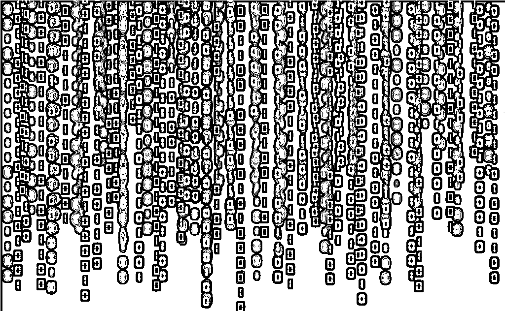
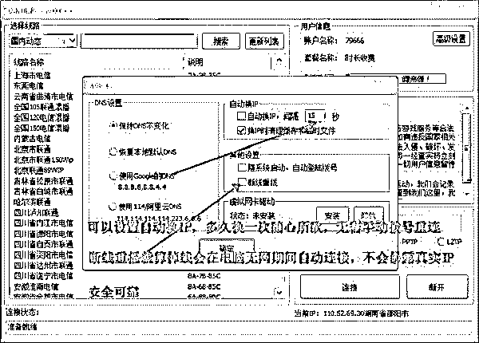

# 深度|薅羊毛黑产攻防实录：“羊毛党”与“攻城狮”之间的博弈游戏

> 原文：[`mp.weixin.qq.com/s?__biz=MzIyMDYwMTk0Mw==&mid=2247489704&idx=1&sn=fd723f4a71b42686451bce2641707a67&chksm=97c8d390a0bf5a8659576c4f7fa98f6c43942f61a32de88f9818a6f61f990325ba04964294b9&scene=27#wechat_redirect`](http://mp.weixin.qq.com/s?__biz=MzIyMDYwMTk0Mw==&mid=2247489704&idx=1&sn=fd723f4a71b42686451bce2641707a67&chksm=97c8d390a0bf5a8659576c4f7fa98f6c43942f61a32de88f9818a6f61f990325ba04964294b9&scene=27#wechat_redirect)

**导语：**

          1000 毫秒，即 1 秒，是一个消费者网购下单时能忍受的等待时间。在你耐心范围内，是场网络安全工程师和黑客之间的对决，前者须在几百毫秒内揪出并拦截来自后者大流量的攻击，以避免他们抢走平台给消费者的优惠券 ..........

        换角度看，这 1 秒也是你跟黑客之间的战争，只不过如果安全人员失手，你往往也是一败涂地。当你在想抢下一款某电商平台的大促产品时候，你不会知道，很多时候和你拼手速的并不一定是人类，可能是黑客撒出去的机器账号黑产军团。

         我们所说的黑产羊毛党，不是平常抢个几块到几十块不等红包以自娱自乐的普通人，而是大规模靠技术和人工手段，靠钻漏洞来薅羊毛获取利润的大群体。在中国，专门靠薅羊毛为生的人就有几百万，或是“全职”或是“兼职”。从搜集优惠信息、购买账号、销售工具、实施攻击到倒卖、分赃。薅羊毛已形成了分工细致的成熟灰色产业链。

       红包、优惠券、抽奖、打折、秒杀……都是他们紧紧盯住的“机会”。累积起来的“羊毛”利润非常可观，团伙作案的黑客羊毛党大军，月收入上百万者大有人在。“我们追踪黑客时，见过支付宝账户里常年躺着几百万的人。”一位阿里内部人士告诉灰产圈。

      在中国电商行业迅速崛起的 10 年，薅羊毛黑产群体也逐步庞大。美团安全部门某员工在接受灰产圈采访表示，因电商行业规模加大和移动端技术研发更新迭代迅速，今年黑产技术手段和攻击变化频率有很大的提升，防控技术壁垒要求是越来越高。

正如互联网行业的繁荣不止，安全工程师和羊毛党大军之间的攻防战也永不停息。

> **交易狂欢背后的风控战**

        回到 2017 年 11 月 11 日，这一天结束时阿里的电商成交额是 1682 亿元。消费者和商家看到的是一座座金矿，但对阿里来说，特别是安全部门和云计算等技术支撑部门，双十一期间是一年中压力最大的时候。

       电商造节，巨大流量集中在一天释放，在这 24 小时内，电商平台技术和安全防空要承受住庞大流量冲击，不少流量就来自于黑产羊毛党大军的“贡献”。

      所以阿里安全部安全工程师某负责人把“双十一”看作紧张的“大考验”。为这几百毫秒刀光剑影的“守门”，阿里安全和天猫和其他业务团队提前半年就开始准备。

       年中拿到天猫促销商户策划方案后，风控部门先弄清楚每个活动玩法，挖掘游戏流程中可能会出现的让黑产有机可乘的漏洞，根据情况或者是改变游戏、或是想尽办法降低风险。之后，要设置常规防羊毛党大军的风控流程。

       风控部门甄别黑客过程，是以微妙方式体现在消费者的购物流程中的：

对普通人来说，我们购物时屏幕上显示：登陆、操作、下单、支付……不过这些环节在风控部门的眼里，就是一道一道的门，用户每走过其中一个流程，就是过一道“安检大门”，每个安检口都埋藏着不一样的甄别黑客的方法。

        “比如你经常买买买，住址稳定，手机电脑 IP 固定，我们会把它加密存储，做成个可信任的安全环境，当你在这个环境下操作，被认为是安全的。比方说当你用别人手机登陆自己账号购物，或连接公共场所的 wifi，系统会有所警觉，多设置审查门槛，如此时支付会让你输入短信验证码，要求刷脸，弹出窗口警示风险。”阿里风控某负责人解释称。

       安全防控最高境界是让用户没有感知，尽可能减少对正常用户的干扰，避免流程和体验过于冗长和复杂，同时也要保证风控严密和甄别精准，如何取的这其中的平衡是最有技术含量的部分。

        在阿里安全部门设计中，被系统认定为优质和安全环境中的正常用户，一般只过四五道工序，保证下单顺畅，但被认为有欺诈风险的账户、商家刷量和疑似羊毛党，检验工序会上升为十几道乃至二十多道，进入更复杂风控流程。

          “做黑灰产的人或许能把某一方面伪造的很好，但不可能把所有环节都伪造。其实风控策略本质是人与人之间的博弈。” 阿里风控某负责人举例称，用同一台设备注册三个账号就会引起安全工程师的警惕，但为避免误伤，安全工程师会同时考量其他的维度，而如果黑客意识到这种风险，也会避免用同一台注册太多的账号，防止被发现后一串账号全部都报废。双方每次较量，就存在于对其中微小变量把控中。

> **羊毛大军的黑色运作链**

       羊毛党赚的是商家平台的补贴差价。传统羊毛党会以促销价大批量抢购促销品，再另找渠道卖出去，赚取其中价格差。另一类羊毛党，则跟商户串通好，赚取电商平台补贴。假下单，商户在后台收到订单后不发货，后两者再瓜分平台的补贴金额，刷了商户的量，同时也省去了羊毛党卖不出去把货砸在手里的巨大风险。

        不过运作这样一场薅羊毛活动，流程很复杂, 薅一次羊毛需要跑通 5 个环节：**评估风险并找到适合下手的活动－获取手机号－用手机号注册帐号并通过平台的认证－获取设备（手机）－购买秒杀工具－操作薅羊毛－分赃。**

         在高段位的薅羊毛里，上述链路中的每一个环节都有成规模的公司在运作。

         由于每个环节都需要付出成本，羊毛党就会谨慎选择攻击对象，衡量不同对象攻击难度和需要付出的代价和成本。据京东安全部门的观察，羊毛党发动攻击前会在各信息共享群里互通消息，呈现出从点到面的裂变传播，然后选择优惠补贴力度大线上的项目大量的集中购买。

         开始薅羊毛前提是批量掌握大量的帐号，有经验的黑客大军能同时控制上万乃至几十万个帐号。获取帐号第一步是拿到手机号，而黑产手机号提供者，多数为卡商。

       卡商是运营商合作者，主业帮运营商分销手机卡，很多卡商利用手头卡号资源做起了 to B 的手机卡运营。简单讲：羊毛党可以向卡商购买手机号或收到的短信验证消息。在这个环节的平均成本是 1 毛钱一个号。

         有了手机号之后，羊毛党还要解决平台帐号的注册，需 身份证、手机号、甚至照片这类实名认证信息。大量包含这类信息数据包，在黑市之中非法交易，这成了羊毛党的主要购买渠道，一个帐号成本在几毛钱左右。

每逢重要电商大促前夕，秒杀工具这类作弊软件的销量都会攀升。

         秒杀工具作用是让羊毛党可以批量下订单，常用的卖法是几百元包月，通过大量羊毛党混迹 QQ 群中销售，极“好用”工具可以卖到 3000 块。

         在黑产攻防战里，情报对于交战双方非常的重要。黑产会想方设法在互联网公司安插内鬼，里应外合监守自盗，同样互联网公司也会在黑产团体放入间谍，时刻上演着无间道。

         阿里风控某负责人曾由此接触过一款软件，利用安全漏洞，可以一次性下几十万笔订单，“如果当时没发现，双十一当天有很多羊毛党用，订单量可能会损失几十亿甚至上百亿。”

         如果羊毛党成功控制大量帐号，下一步是弄到设备，然后就开始薅羊毛。最传统做法是人工薅羊毛：一个几平米的小房间，靠着四面墙壁放着四个五六层的货架，每排货架上从左到右挨着摆满了一排排手机，每台手机绑定着一个账号。当促销活动时间到了，一个羊毛党任务就是站在房子中间，一台台手机的点过去。

不过对于掌握着上万个帐号的人而言，这样效率只能覆盖几千个帐号，黑产开始够买安卓模拟器，用机器集中操作。

一场大促背后，安全工程师需准备半年，而黑产也做尽各种准备以求豪赌一把，交锋无形却往往异常激烈。京东某安全工程师告诉灰产圈，一年前华为荣耀一款新品手机在京东上线，黄牛党抢购遭遇了京东拦截，随即就雇佣大量水军对京东在线客服进行恶意报复，导致正常咨询堵塞。

       “魔高一尺，道高一丈。黑客的攻击手段在不断演进，安全工程师的防范手段得以更快的速度进行迭代，才能有效防止黑客的攻击。”

> **术的较量**

  网络安全工程师的圈子里流传着一句话——你在凝视深渊，深渊也在凝视你。

         这个圈子里不乏技术高超的聪明人，从事黑产的利益诱惑巨大，有时候安全工程师、白帽子和黑客只是一念之差。他们之间的无形战争，是术与术的较量。

        在对一起黑产案件中，一位被捕的黑客印象深刻。三四十岁中年男子，其貌不扬穿着一件夹克，孩子刚上小学，一家三口住在一间 80 平的房子里。他花了三个月的时破译漏洞，半年内赚了几十万。

       “他当时很骄傲，觉得自己花了三个月什么都不干，像数学家把一道题目解出来了一样很厉害。后面我们安全能力也在不断更新，但他第二天就能跟上我们的更新节奏。我们之间的较量不像是过招，三个月的解题就像是苦行僧一样，我们也不清楚他为什么有这么大的毅力。”

         阿里风控某负责人形容，安全工程师和黑客，是一种类似于互相解题的交互过程。安全工程师日常工作，是不断反向研究黑客手法，也会突然惊奇对方怎么想到这一点的。被发现漏洞感觉，就类似于有人花了几周不同摸索你心思，找到漏洞后突然被别人拿过来一样。

         他从警方了解到，那个黑客被捕时候很平静，“估计他觉得这是早晚的事。毕竟黑客一旦要开始赚钱，就不可避免要把自己暴露出来，你要推广自己出来卖产品，这时候在网上留下的痕迹就越来越多。这跟传统意义上不为名不为利的黑客是不一样的，那种人不会留下太多东西，可能很难找到。”

或为钱，或为技术的偏执，羊毛党和安全工程师的较量还会继续，就掩藏在我们的每一次点击背后。

> 冰山下的黑色产业链

    薅羊毛性质的电商黑产不过是冰山一角，刷单、套现、彩票、黑卡、诈骗、软色情、游戏黑服等等，几乎所有互联网触及到的领域，都成了网络黑产的滋生之地。无论是从业者数量还是交易规模，都已经足够庞大。

所谓的”网络黑色产业链”，是指以互联网为载体，以盈利为目的的有组织、分工明确的团伙式犯罪行为。一般来说，上游为提供技术支持的黑客或泄露个人隐私数据的内鬼，下游则是实施黑产犯罪行为(如诈骗、洗钱、骗贷)的团伙。

仅以电商平台的漏洞为例，业已形成了一条“年产值”超百亿的产业链。可以试想这样一个场景：到了情人节的时候，正在吃土的小 A 想要送女朋友一份礼物，摸了下钱包，又看了看礼物的价格，小 A 一筹莫展。这时候好哥们小 B 指了一条明道，去某宝上买一张礼品卡或者免单券，仅需要几块钱甚至几毛钱就可以买到原价近百块的礼物。

其实小 A 已经扮演了“消费者”的角色，在这条产业链的上端还有“注册领券端”和“销赃端”。

为了“拉新”，大多数电商平台都准备了优惠券和新人礼包，平时的各个电商节点也会举行类似的促销活动。“领券端”的从业者大多拥有几千上万张手机卡，在去年年底曝出的“国内最大盗号软件”被查的案件中，这帮黑产团伙居然拥有 703 万张手机黑卡。疯狂的注册账号，批量领取优惠券，让一些风控能力稍差的电商平台避之不及。

而“销赃端”渠道要更加复杂，出现了电商网点、共享群、论坛等等，并衍生出了电商“刷单”的行为。特别是对电商平台来说，最可怕的就是黑产联合供应商刷单套利，一是法律认定上对“刷单”行为很难定性，二是供应商会主动销毁供应链，使之无法被取证。

当然，面对黑产的疯狂，各大互联网公司也拿起防御武器，几乎所有黑产存在的领域都在上演一场场猫鼠游戏。大数据、活体识别、人像比对、设备指纹、人脸识别等新技术也开始应用于“反黑产”的运动中，但从某种程度上来说，这些新技术也是一把双刃剑。

> 网络黑产的十面埋伏

很多黑产从业者基本没有太高的技术水平，且集中在整个环节的下游部分，基于网络上形形色色的数据信息来钻某些公司流程规则的漏洞。但站在“黑产”金字塔顶层的黑客们，却是十足的“技术范”。

从调研公司 Forrester 发布的报告来看，MySpace 在 2016 年中有近 4.3 亿个帐号被窃取。国内也有类似的案例，一些电商平台、邮箱服务、开发者社区等也曾遭到大规模用户信息泄露的风险。尽管很多平台都采用了验证码、IP 限制、指定区域登陆等安全策略，但黑产中也出现了“打码”、“秒拨”等黑科技。

在网络黑色产业链中，存在几十甚至上百种撞库软件，往往都集成了“打码”的功能，即通过链接到打码平台实现对验证码的识别破解。较为讽刺的是，打码平台往往采用了人工智能的深度学习技术进行机器训练，导入大量的数据，使之能够有效识别字符、图片等验证码，大幅提升验证码的破解率。

此外，对于机器难以识别的情况，还出现了基于众包的人工打码解决方案，严密程度教育网络平台的安全策略有过之而无不及。以腾讯“守护者计划”安全团队协助公安部门打掉的“快啊答题”为例，仅 2017 年一季度就破解验证码 259 亿次，累计破解验证码 1200 亿次，验证码识别率高达 83.4%。

另一个黑科技就是“秒拨”，可以调用全国甚至国外的 ADSL 宽带动态 IP 资源，只要通过简单配置，就可以实现 IP 的“自动切换”、“秒级切换”、“断线重拨”、清理 COOKIES 缓存、虚拟网卡(MAC)信息、多地域 IP 资源调换等服务，规避网站的限制策略。相比之下，一些平台引以为傲的动态 IP 防御策略似乎不堪一击。

事实上，“秒拨”服务的出现正中电商平台们的命门，电商平台放出的优惠券和优惠码，或者红包奖励，往往限制一个 IP 仅能参加一次领券活动。但黑产从业者利用“秒拨”服务突破 IP 限制而大量参与活动。

当然，围绕网络黑产的攻防战远未结束，尤其是互联网巨头们频频对网络黑产表态。马化腾在去年年底的时候积极为腾讯“守护者反电信网络诈骗联合大会”站台;阿里 CEO 张勇坦言“黑灰”产业链是所有互联网企业的敌人……但这些会是打击网络黑产的转折点吗?

> 斗法黑产：从防御到进攻

从 2005 年三大运营商治理垃圾短信开始，与网络黑产的斗法业已走过了 10 多个年头，但以往是防御性的策略，聚焦在黑产的其中一环。

以电话诈骗为例，运营商推行了实名制和诈骗电话举报，公安机关针对每起诈骗案进行专门处理，银行也加固资金安全守好最后一道防线。可由于彼此间缺乏联动，反诈骗之战并没有取得显著成效，走了不少弯路。

究其根本，反诈骗从之前的各自为战，转向一场“全民行动”。比如以腾讯公司为代表的互联网企业也积极加入反电信网络诈骗阵营之中，“守护者计划”就是反电信网络诈骗的有力行动，并有效地串联起公安、银行、运营商、互联网企业、网民，通过全行业联合、职能联动形成反诈骗闭环，利用生态力量共抗黑产，反诈骗由此进入全民行动阶段。

然而，和黑产的斗法或许还需要追本溯源，包括腾讯“守护者计划”在内，已然开始了“以攻为守”逼近黑产威胁源，典型的就是对“打码”软件、“秒拨”软件以及“暗网”交易的黑产打击。

以 DDOS 攻击为例，从链条顶端的“发单人”到接到指令并实行攻击的“实施人”，以及控制着海量计算机的“肉鸡商”，在数据和监控上占据优势的腾讯“守护者计划”安全团队曾多次协助公安部门，并针对黑产的分工和技术情况进行研究分析。此外，在打击“快啊答题“、”暗网“和多起“秒拨“平台上，腾讯“守护者计划”安全团队均扮演了重要的角色。

> **结尾**

“杀人的不是枪，而是持枪的人”，这句话用于形容网络黑产似乎并不为过。技术没有对错，人性却有善的一面，也有恶的一面，庞大到 150 万的黑产从业者何尝不是一个警醒。或许离消除网络黑产还有很长的路要走，至少我们看到了腾讯、阿里等互联网巨头的努力，也看到了事件的转机。

**延伸阅读：**

**[大揭秘：神秘的 淘宝职业“打假人”  灰色产业链， 年薅“淘宝” 上亿羊毛。](http://mp.weixin.qq.com/s?__biz=MzIyMDYwMTk0Mw==&mid=2247488824&idx=1&sn=87de122c8ffb49dcfd4df5fa1f2872ca&chksm=97c8de00a0bf57168c3c6be6b71fb98b6d0507dc809a04148143cc9044065f1b5bf5c404130c&scene=21#wechat_redirect)** 

**[揭秘薅羊毛过亿的苹果 36 技术黑产](http://mp.weixin.qq.com/s?__biz=MzIyMDYwMTk0Mw==&mid=2247486488&idx=2&sn=4a4b6210f9dbd0e2cef08f57749cd714&chksm=97c8c720a0bf4e36a186685f9bdd44197170590647e9c2d21459983ce1724bf638cd7537ab82&scene=21#wechat_redirect)** 

**[重磅|黑镜调查：深渊背后的真相之「薅羊毛产业」报告](http://mp.weixin.qq.com/s?__biz=MzIyMDYwMTk0Mw==&mid=2247489019&idx=2&sn=086ef61c6c4741692b47d63d596ef937&chksm=97c8dec3a0bf57d5d5e0190f65cc886a624b9094fa20924f20911d81d4ab2e581c184fc43b6a&scene=21#wechat_redirect)**

* * *

**【灰产圈】高端社群 小程序已开通，欢迎点击加入**

<mp-miniprogram class="miniprogram_element" data-miniprogram-appid="wx4f706964b979122a" data-miniprogram-path="pages/topics/topics?group_id=881854415822" data-miniprogram-nickname="知识星球" data-miniprogram-avatar="http://mmbiz.qpic.cn/mmbiz_png/kialtkOXGKS7D9hZrmO2jzDqryXXTAlhxSpnrKnHGV65KXzicibOppaPic4dCRxftvabB8Iqswo3OuQEDSxE7NicXBg/0?wx_fmt=png" data-miniprogram-title="【灰产圈】高端社群" data-miniprogram-imageurl="http://mmbiz.qpic.cn/mmbiz_jpg/WWG78hysZ0brJkWoyG2VDIacqgQjkDfp6mLiaoPBJ2SgWZHtRuTw7ia8kpoxntsn7PiaFOQO2U23FW6Iry0gS1GnA/0?wx_fmt=jpeg"></mp-miniprogram>

点击“阅读原文”加入高端社群。