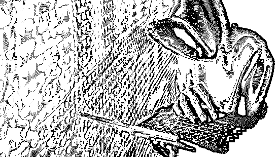
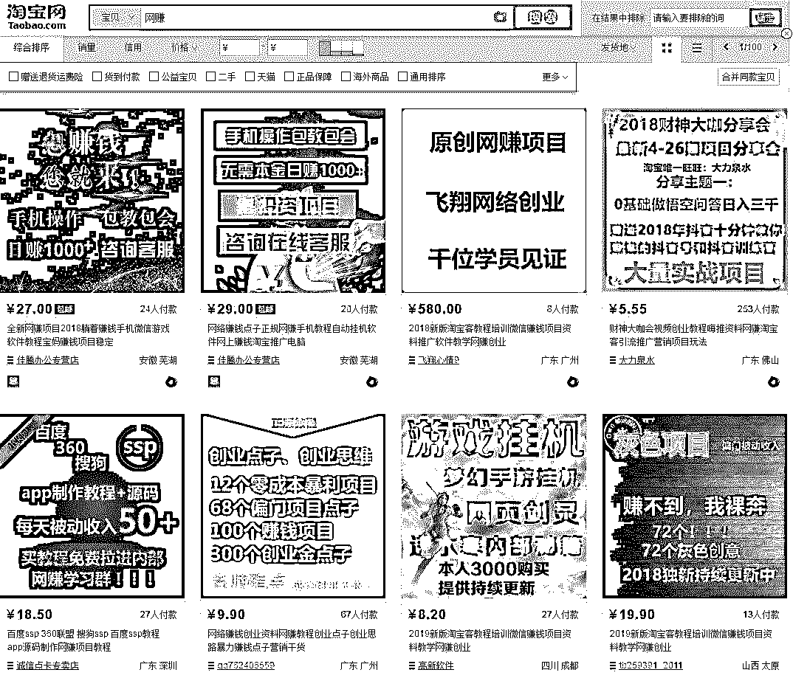
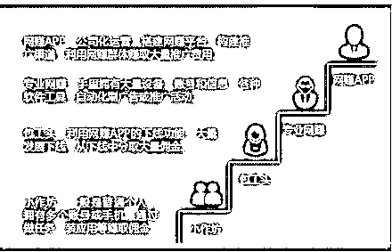
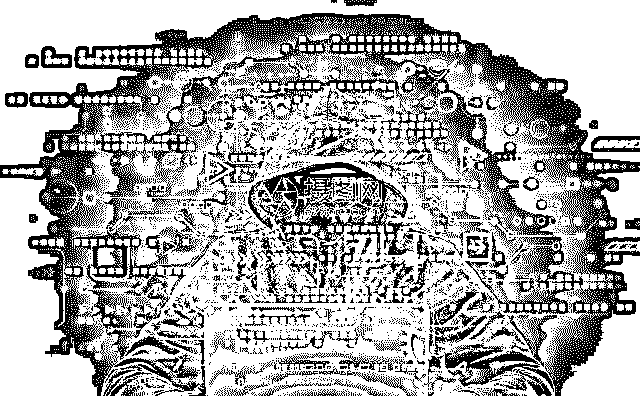
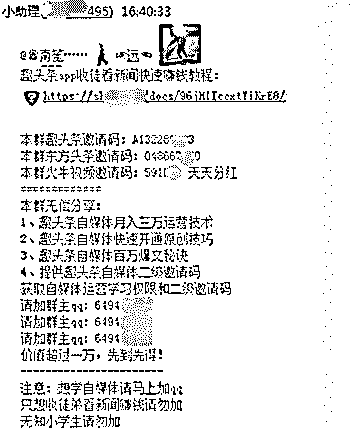

# 假数据、薅羊毛、刷单……“网赚”黑产正在掏空你的企业！

> 原文：[`mp.weixin.qq.com/s?__biz=MzIyMDYwMTk0Mw==&mid=2247494277&idx=1&sn=b9568697d908ac74017f0011cee952d2&chksm=97cb21bda0bca8ab30acb961d1e51dbf8fe2a559de14eb07da8b19298f72773e1fa8b5a98604&scene=27#wechat_redirect`](http://mp.weixin.qq.com/s?__biz=MzIyMDYwMTk0Mw==&mid=2247494277&idx=1&sn=b9568697d908ac74017f0011cee952d2&chksm=97cb21bda0bca8ab30acb961d1e51dbf8fe2a559de14eb07da8b19298f72773e1fa8b5a98604&scene=27#wechat_redirect)

**点击上方蓝色字体“灰产圈”关注并置顶本公众号**

导语

“原本可以用一个季度的推广费，才撑了不到一星期！”

广东有一家新兴互联网金融公司，为快速积累用户规模和交易量，选择了在某网赚平台投放推广活动，却遭遇了黑产的当头一棒。

这家公司相关负责人介绍，根据他们联合网赚平台制定的机制，用户只要完成下载 APP、分享链接、注册等任务，就可以获取 1 至 10 元不等的佣金奖励。

由于获客成本低，起初的营销效果还算不错，但运行一段时间后，推广费用消耗迅猛，转化表现却节节倒退。

始于网赚，毁于网赚

如今，互联网上“流量为王”，补贴、红包、抽奖等催生了一条特殊的产业链：

**网赚平台**为广告主构建推广渠道，再利用网赚群体赚取推广费用；

上百款网赚 APP 汇集百万网赚群体，通过现金红包激励用户观看、点击广告、试玩游戏、店铺刷单等行为获取相应的佣金奖励，参与者各司其职、有组织有规模地进行刷量作业，赚取高额利润。

**或许**，这家公司当时并没意识到，他们的推广费用实际已落入了黑产的口袋——正有一批流窜在网赚平台的不法分子，通过**作弊刷量**，以低廉成本获取广告主推广费用，还顺带薅了一把正规网赚企业的羊毛。

**月入过万？躺着赚钱？**一起贩卖廉价流量的“投机”生意！

“刷刷新闻，躺着赚钱”“不需成本，每天用零碎时间轻松月入过万”，网赚行业“轻松赚钱”之风在网络上悄然蔓延。不需任何门槛，仅需花费一点点时间就可以赚钱看起来极其诱人，也吸引了大批网民加入。

其实，通过每天打开 APP 完成“刷量任务”来获利，只是网赚行业的一种方式。

伴随移动互联网高速发展，移动端涌现大量网赚平台，各大网赚平台构建推广渠道，通过现金激励等手段汇集大量用户，鼓励用户观看、点击广告、试玩游戏、电商购物等，为广告主带来大量新用户，实现所谓的“三方互赢”。

从事多年移动软件开发的工程师 KK 介绍，大部分 APP 会糅合两个或更多业务在一起，以发布任务形式分发至网赚群体，网赚群体通过完成 APP 发布的各种任务赚取积分，再以积分兑换现金奖励。

我们浏览相关平台发现，通过各大电商平台发布网赚项目，夸大做网赚项目的收益比比皆是，比如，通过“日入过千”有效安全靠谱等字眼引导用户参与；

还有的通过各种交流群发布一些游戏应用试玩，引导用户安装各种网赚 APP，并定期发布网赚任务；也有一些各种 web 平台收集各类的网赚 APP，通过 web 平台为网赚 APP 提供推广渠道。

**（网赚项目广告）**

腾讯安全反诈骗实验室公布了一组监控数据：

网赚 APP/平台有且不止有 500 多个，更有相关网站从事网赚类垂直领域门户网站。

“以‘手赚网’为例，网站作为手机网赚垂直领域门户网站，主要分门别类向网赚群体推荐网赚类 APP，仅安卓平台即有 400+款，在此网站下载量累计达 40w+。”腾讯安全反诈骗实验室技术专家 CC 说。

“收徒系统”引发“流量裂变”，大批非真实设备薅羊毛

对于网赚 APP 的发展进程，KK 向我们讲述了他的切身体会：

最早出现是在 2011 年左右；

2012 年至 2016 年大量网赚 APP 出现，主要以推广 APP 以及转发分享文章为主；

2017 年开始各类网赚 APP 大量增长，并逐渐发展下线。

一家互联网安全企业近日发布的《网赚 APP 产业链调查报告》显示，2018 年网赚类 APP 数量大幅上升，影响用户高达 2.5 亿。

于此同时，一条隐匿的黑色产业链也浮出了水面。“网赚黑灰产群体针对薅网赚应用的羊毛已经形成了一套成熟的运作体系，通过开发各种自动化脚本，批量注册账号，利用群控设备等大量进行刷金币操作，然后利用网赚 APP 的收徒拉新机制进行引流，模式复制，大量刷取金币然后变现。”CC 透露。

**（网赚参与者构成）**

从目前来看，大部分的网赚 APP 会搭建一套“收徒系统”，通过用户自主发展下线的方法，形成“流量裂变”。

对其具体运作模式，CC 介绍，开通一个主账号当作师傅，用来提现；再准备一整套自动化软件，包括自动化阅读+批量注册/收徒+自动改机+ IP 切换；批量多开，比如，收几十个软件徒弟(小号)，全部使用脚本自动化阅读，再推广复制这套模式，让“徒弟”也这样做。

“这套模式是基于网赚应用的‘收徒拉新’机制和阅读收益机制上，徒弟阅读收益可以回馈到师傅身上，同时师傅‘收徒拉新’的操作本身也带有直接收益；同时，产业链中存在诸多脚本开发者，通过开发自动阅读、批量注册脚本，通过售卖或收徒(填写邀请码则可免费)进行传播，赚取利益。”CC 说。

KK 也提到，网赚 APP 刷量产业参与者主要有：项目负责人(羊头)、工具开发者、号贩子(养号)、普通参与者(普通网赚群体)。

其中，项目负责人通过建立网赚交流群，吸引大量用户加入网赚项目，还会发布其他网赚项目，共同薅羊毛；工具开发者通过建立交流群，通过交流群售卖脚步，群控工具等，通过整套工具可以自动阅读赚钱，完全不需要用户手动干预。

套路深似海，网赚黑吃黑

遇到虚假网赚 APP，网赚群体也难拿到钱

针对应用情况，腾讯安全反诈骗实验室最新监控数据显示，多数网赚群体在完成任务后，短时间内都会卸载掉推广软件。比如，当天安装后就卸载者占比 15.77%，3 天内、7 天内、15 天内、一个月内卸载分别占比 20.21%、24.38%、28.95%、40.12%。

因此，大多数网赚群体在完成任务后，短时间内都会卸载掉推广的软件；为此，网赚 APP 通过激励手段要求用户必须下载并试玩/试用，同时保持长时间的留存和持续活跃。

**（网赚交流群拉新机制）**

然而，许多参与的网赚群体反映，通过虚假网赚 APP 完成相应任务后，发出请求提取相应收益时，却往往波折重重：常见的情况比如需要开通会员才能提现，且需要支付相应费用开通会员，再次操作提现时又会出现其他要求，往往通过设置复杂条件，限制用户提现。

更糟糕的是，部分网赚群体还可能遭遇赔钱的风险。例如，某网曾打着“交押金、看广告、做任务、赚外快”的旗号，吸纳大量民间集资，最终这个披着网赚外皮的骗局雪崩，导致网赚全体高达数百亿元的本金无法赎回，这些资金最终都流入了欺诈黑产团伙的腰包。

一台日赚 8 至 12 元设备成本仅 0.4 元，推广企业沦为最大受害者

无疑，在利益的驱使下，大量黑产从业者正在纷纷入局。

CC 透露，网赚黑产实际投入成本极低，构建一台可日赚 8 至 12 元的设备，成本仅为 0.4 元甚至更少；黑产参与者分工明确，开展有组织、有规模的刷量作业。

比如，针对某头条阅读奖励收益的机制，网赚黑产通过设置自动执行任务脚本，单账号每天的收益在 15 元左右，估算每天通过刷量给某头条造成的损失将超 100 万元。

结尾

不仅是网赚群体上当受骗，对于需要针对性推广和转化的广告主而言，欺诈黑产的作弊行为也给企业推广费用造成极大浪费，大量推广费用极可能被“打水漂”。

“用户量越高，广告主投放的广告效果失真程度也可能较高。企业会因此付出了大笔金钱，却没有带来真正的客户，沦为网赚 APP 产业链上最大的受害者。”

CC 说，企业花费的推广费用不能够真实地促进销量转化和品牌提升，出色数据反而造成了“虚假繁荣”，令企业无法辨别哪些客户和数据能够产生真实有效的效果。能够很好地形容广告主所面临的困惑——“我知道有一半的费用是浪费了，但不知道是哪一半”。

为应对网赚 APP 黑产，CC 建议，网赚类 APP 自我防护很重要，比如，要加强对注册账号的风控管理；

加强业务对抗能力，识别作弊阅读行为并进行策略性对抗；加强终端信息采集对抗能力，获取真实有效设备信息，加强设备风控能力等。

●[网赚向左 | 网赌向右](http://mp.weixin.qq.com/s?__biz=MzIyMDYwMTk0Mw==&mid=2247493927&idx=1&sn=39648b3f830537c66998e8d901c121ae&chksm=97cb221fa0bcab0926b42eb2c41a79ad68e8cc2048167d3f82158340ceeae3532f48882c6bb4&scene=21#wechat_redirect)

●[网赚圈子里的空手套白狼法则，共 9 点](http://mp.weixin.qq.com/s?__biz=MzIyMDYwMTk0Mw==&mid=2247484776&idx=5&sn=22ba5b095df3f47f4a5344e8f2a3cf58&chksm=97c8ce50a0bf474668dbcaeb16c07b272c782021c9bc129e08e32f5143546c15d1c8057e8b41&scene=21#wechat_redirect)

●[揭秘网络上不为人知的灰色赚钱项目](http://mp.weixin.qq.com/s?__biz=MzIyMDYwMTk0Mw==&mid=2247484000&idx=6&sn=896f69e2ca5397d7296b2f87f9ddc2fe&chksm=97c8c958a0bf404eef2bf8069e0783b03f2af0d256ae861ffc82bd95929b690a806830bd3da2&scene=21#wechat_redirect)

●[深度 | "恶意注册账号"黑产全揭秘：刷粉，炒信，薅羊毛，卖茶，卖蜜，还荐股！](http://mp.weixin.qq.com/s?__biz=MzIyMDYwMTk0Mw==&mid=2247494095&idx=1&sn=10e63105fd74b13e3755de7f89318bf9&chksm=97cb22f7a0bcabe1ab4e56c886ff1872b24a889e75a6e5afe9ece48d6c471fe217bf4e3a2c33&scene=21#wechat_redirect)

   

**点击加入 ****灰产圈 | 高端社群**