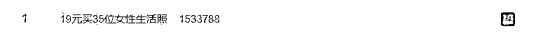
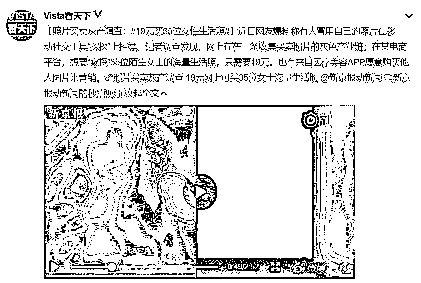
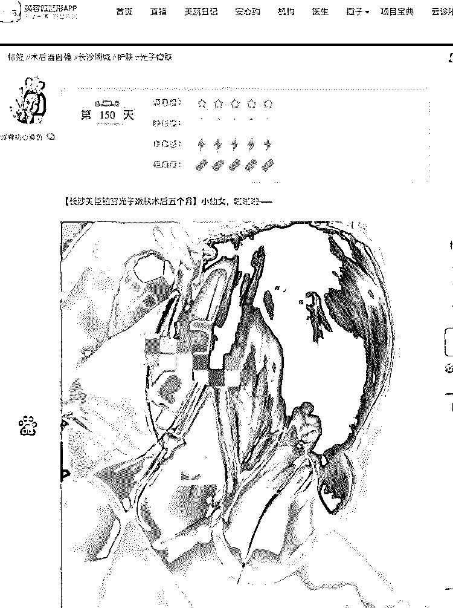
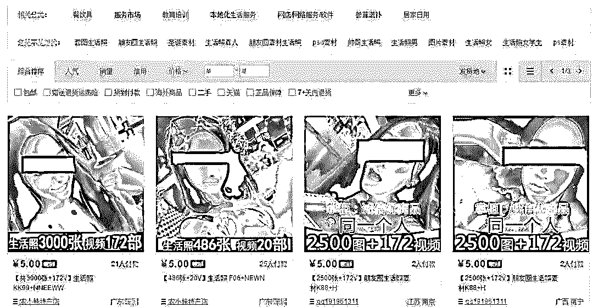
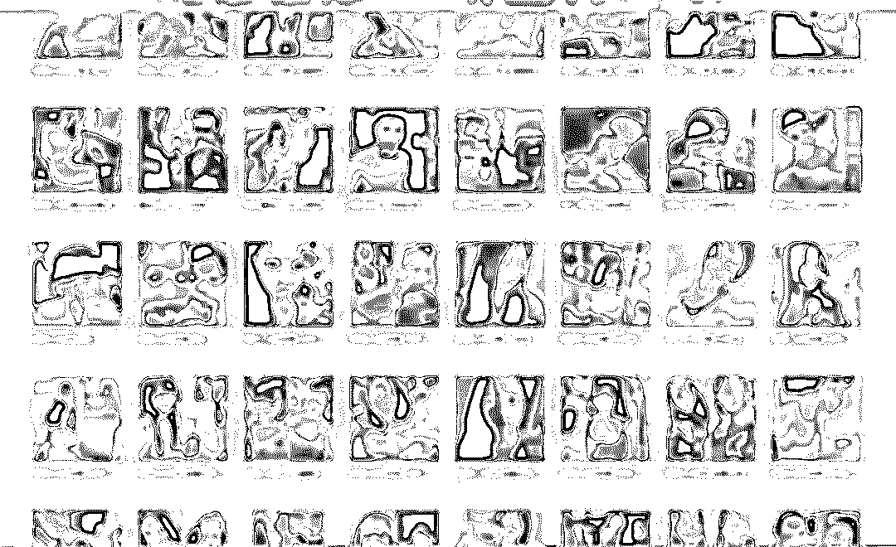
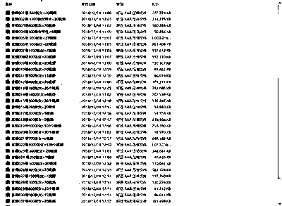
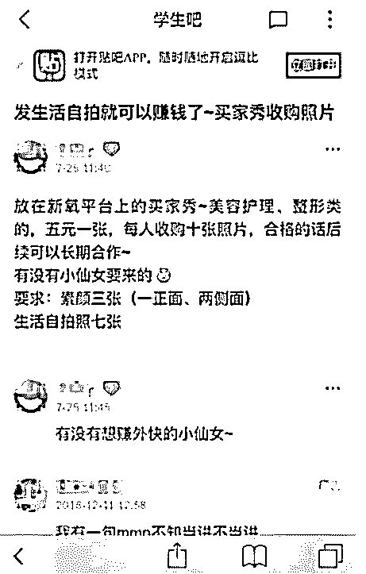
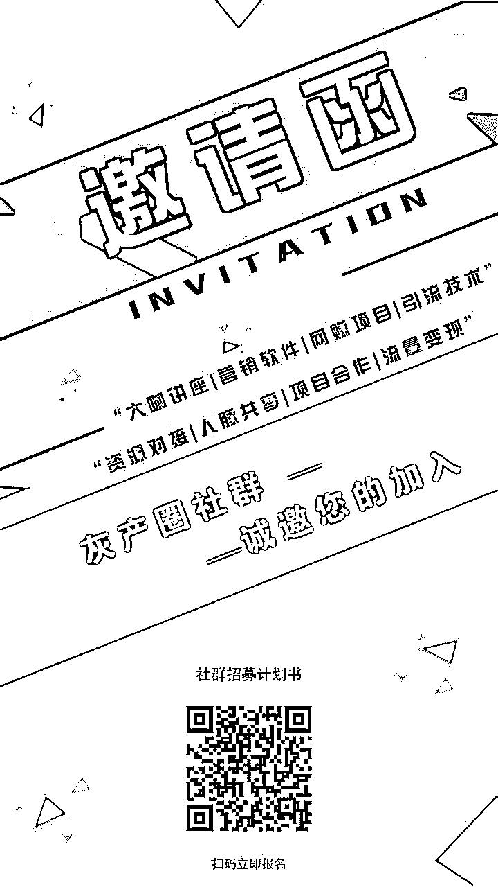

# 友情提示：你的照片连同你的生活都被人在网上卖了...

> 原文：[`mp.weixin.qq.com/s?__biz=MzIyMDYwMTk0Mw==&mid=2247494268&idx=1&sn=e2315cf30a5f4f32d23dc241aef68615&chksm=97cb2144a0bca8524993c520ada37966219981c95bb97d57ec8db25a3b6126cc7d955a75bf9a&scene=27#wechat_redirect`](http://mp.weixin.qq.com/s?__biz=MzIyMDYwMTk0Mw==&mid=2247494268&idx=1&sn=e2315cf30a5f4f32d23dc241aef68615&chksm=97cb2144a0bca8524993c520ada37966219981c95bb97d57ec8db25a3b6126cc7d955a75bf9a&scene=27#wechat_redirect)

**点击上方蓝色字体“灰产圈”关注并置顶本公众号**

导语

在互联网时代，我们都习惯于在各大网络平台上分享自己的生活，比如说在微信朋友圈晒一晒自己的自拍照，记录一下生活。

但让我们万万没想到的是，****这些照片竟然被偷偷公开售卖！****售卖者甚至还表示，****如果购买量大的话还可根据要求定制！****

一，起源

前几日，****19 元买 35 位女性生活照被用于“招嫖”****一事在网上火了，登上微博的热搜排行榜，同时照片买卖灰色产业链也随之曝光，其背后的真相细思极恐！

**事情详细展开来说是这样的：**

12 月 6 日，刘茜（化名）的朋友张伟（化名）在使用一款交友软件时滑到了刘茜的照片。

“张伟告诉我这件事儿的时候我特别吃惊，因为我压根没有使用过这款社交软件。”刘茜说。

根据张伟的手机截图，这名冒用刘茜照片的探探用户资料显示昵称为“小小”，年龄为 23。

为了弄清楚对方是谁，张伟和这位“小小”聊天。聊了没多久，“小小”便主动发送过来一个微信号，表示可以****提供有偿性服务****，价位为****“一次八百，包夜一千二”****。

**“**发现自己的照片被用于招嫖后，很气愤，但又无能为力。**”**刘茜说。

专家表示，照片买卖早已成为了一条成熟的灰色产业链，刘女士见到的只是下游。“冒用的这个人手里可能有成百上千张类似的照片，他们(灰产从业者)有一个行话叫****‘套图’****。套图价格视质量好坏不定，但往往很便宜，****几块钱就可以买到一套。****”

看到这里，宝妹已经非常震惊了，毕竟大多数人都喜欢在社交平台分享生活照片，结果小美好就这样变成了龌龊

****更重要的是，不仅是社交 App，你的生活照还可能暴露在贴吧、相亲网站、医美宣传、微商广告等各类渠道当中。****

一位小有名气的主播小安，在去年发现自己大量的生活照片被无良商家放在网上售卖，她的照片月销售量达到****783****。

照片大多来自于她发的朋友圈，****时间跨度从 2014 年到 2017 年****。在某宝卖家给的云盘里，文件夹中有****2500 张照片和 172 个视频****。其中，除了包含小安的自拍外，还有她与朋友的合照，日常拍的美食，以及她狗狗的照片等。

二，调查

****不法分子都是从哪些渠道获取真实的女性生活照呢？****

获取女性真实生活照的途径大致有两种渠道，****一种是在网上采集照片，一种是金钱诱惑。****

现在的网络十分的发达，网上有着各种社交软件，好多朋友喜欢通过平台在网上上传分享自己的生活照，对于爱美的女性来说，分享自己的靓照更是家常便饭。

平台上那么多的女性生活照，****犯罪分子只需用一个批量采集相册照片的软件，就可以获取海量的生活照照片，然后整理分类，挂在网上销售即可，可谓是几乎没有投入，就能赚钱。****

例如，在国内某电商平台，输入“生活女照 套图”“微信套图”“朋友圈生活照”类似的关键字，你就会看到以下场景，男的、女的、美的、帅的、长发短发各种职业的都有，甚至还有带娃的妈妈们。

******在宝贝详情里的照片，都是有水印的。如果你想要买到没有水印的，需要再多花钱。****各种场景酒吧、餐厅、飞机、度假……主角全是同一个美女，很多百度识图都识别不出来。**

而且，有记者卧底某国内电商平台一家店铺发现，****想要“窥探”35 位陌生女士的海量生活照和视频，只需要 19 元。****这 35 位女士分别被编号，其中一位女士的生活照多达****3000 张****。

该店主称，这桩生意是“一本万利”。“这些图片有的是买的，有的则来源于微博。**只要花 4 块钱买一个‘微博相册批量采集器’，这种照片想要多少就有多少。**”至于他的顾客买这些资料的用途，上述店主称“多是用于营销”。

前面宝妹也提到了，除了网上采集真实照之外，还有另一种，就是金钱诱惑。据相关媒体报道，在贴吧等网络平台上也存在类似生活照的求购信息。

例如，在百度贴吧上的**“学生吧”**的一个帖子中写道，**“发生活自拍就可以赚钱了，收购照片用于医美平台上的买家秀，五元一张，每人收购十张照片，合格的话后续可以长期合作”。**

这桩看起来不错的生意勾起部分同学的兴趣，有学生表示愿意尝试，“发几个自拍就能赚钱，何乐而不为呢？”

业内专家表示，**在营销中，为了营造出生意兴隆的假象来吸引客户，经常会有人去购买一些真人生活照的素材。**“购买的素材经过简单修改后便能使用，顾客看到的买家秀、对比图，其实很多都只是简单调个色、P 个图。”

有记者曾以照片出售者的身份和一名照片收购者取得联系。一位自称李莉的收购者透露，她目前任职于某入驻医美整形机构，担任主任医师，在网上收购的这些照片均会被做成“案例”放到某 APP 上。至于什么是其所谓的“案例”，李莉举了一个例子：“比如我们采购到一张未脱毛的腋下照片，那么我们的美工将会用软件为其‘人工脱毛’，然后做成前后对比图。”

对于此行为是否涉及侵权，李莉称，“你放心，我们和其他整形机构不同，购得照片的脸部都会被打上马赛克，绝对不会被认出来。**我干了近一年了，从来没出过事，绝对靠谱”**。

三，深入

根据中国消费者协会 8 月 29 日发布《APP 个人信息泄露情况调查报告》显示，个人信息泄露总体情况比较严重，受访者中遇到过个人信息泄露情况的人数占比为**85.2%**。

调查结果显示，个人信息泄露的主要途径一是经营者未经本人同意收集个人信息，约占调查总样本的**62.2%**；二是经营者或不法分子故意泄露、出售或者非法向他人提供个人信息，约占调查总样本的**60.6%**。

由此可知，**不法分子能轻而易举地获取他人的真实生活照片，从而能实施灰暗交易获取利益，****除了人们个人信息保护意识的薄弱外，说到底还是诸平台监督不到位和缺乏有效的保护个人隐私的措施而造成的。**

结尾

最后我们细想一下：

假如有一天你在网上无意间加了某一个人，或者因为你在网上留有联系方式 TA 加了你... 当你打开 ta 的朋友圈仔细浏览，从头到尾一年都是看似再也正常不过 TA 的自拍和生活琐事，这时的你就和大部分人一样，不会对这人往骗子这方面想....

但 TA 却真的有可能拿着别人照片完美伪装的骗子，你在 TA 朋友圈看到的生活只是那真实照片主人的生活....

那假如有一天你行走在街上，突然背后的陌生人拦住了你，叫着那根本不是你的名字，却感觉 TA 真的认识你一样，说着你的生活，还存有你的照片.... 而你那刻在脑海想了很久，从出生到现在你的记忆中根本不记得有过你面前的这个人...你劝说了很久，但那个拦住你的人始终不信.....

那假如有一天你在大街上碰见了那个 TA，你们在网上认识了许久许久，而你们却从未见过，但你们却在网上成为了朋友或恋人，你每天关注 ta 的朋友圈，知道 ta 生活的点点滴滴，ta 很会卖乖或者总是很呵护你，ta 找你借钱时也从未犹豫，过年过节过生发个红包更是常事.... 但现在你终于在现实见到了 ta，而 ta 好像对你非常陌生，表现的以为你就是个搭讪的那种不耐烦... 那一刻你始终想不通为什么 ta 要装做不认识你....

....

用“复制黏贴”的方式来伪造出一个虚假的你，你的照片出现在以上的的情景中，你却浑然不知。细思极恐。所以朋友圈晒照片需谨慎，特别是长的漂亮的女性网友。做微商的也需要特别注意，以为做微商的好友几乎都是不认识的，你根本就不知道是谁盗走了你的照片

●[19 元，35 位女性私照曝光：你的隐私，正在被人窥探！](http://mp.weixin.qq.com/s?__biz=MzIyMDYwMTk0Mw==&mid=2247494192&idx=1&sn=32cf1136aa68c50e55da3872d87c539f&chksm=97cb2108a0bca81e8ecbe034377b002f539db6963fb71bca0b0acff1aed6ee9332470e108806&scene=21#wechat_redirect)

●[网络黑产如何倒卖个人隐私？](http://mp.weixin.qq.com/s?__biz=MzIyMDYwMTk0Mw==&mid=2247483699&idx=3&sn=fed5285869d3525f7249841558023f49&chksm=97c8ca0ba0bf431da0edb1f00adbbb9119b4245c2387eca133c714c42339c1cc1d52705061f2&scene=21#wechat_redirect)

●[越同意，越放肆！99.9%的 App 正在窃取你的隐私！中国人隐私不值钱？](http://mp.weixin.qq.com/s?__biz=MzIyMDYwMTk0Mw==&mid=2247492844&idx=1&sn=1527f27b182845af79c5d46fc58755b9&chksm=97cb2fd4a0bca6c205dc4c8b6ce28a1570edcec0ace210cc4e542bacf55b2f27e221a97b478e&scene=21#wechat_redirect)

●[个人隐私交易黑市大起底：是谁在盗贩公民信息？](http://mp.weixin.qq.com/s?__biz=MzIyMDYwMTk0Mw==&mid=2247492647&idx=1&sn=07b195ad56c8bb4c466c1ff6f3ee64d9&chksm=97cb2f1fa0bca609fe8344d8f16ed9d7fa417bbcfc3eed420d8d8ed3261c84ca5b227a665ab4&scene=21#wechat_redirect)

   

**点击加入 ****灰产圈 | 高端社群**