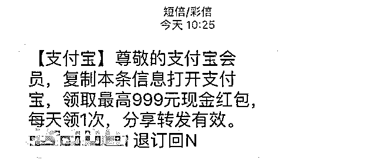
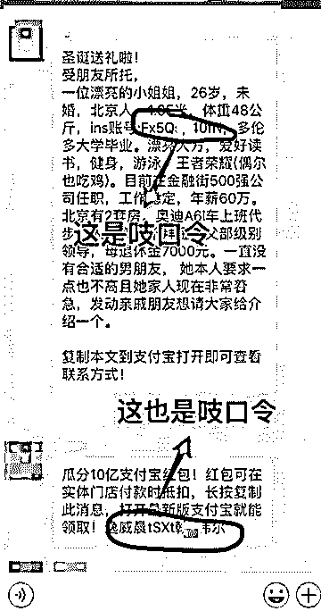
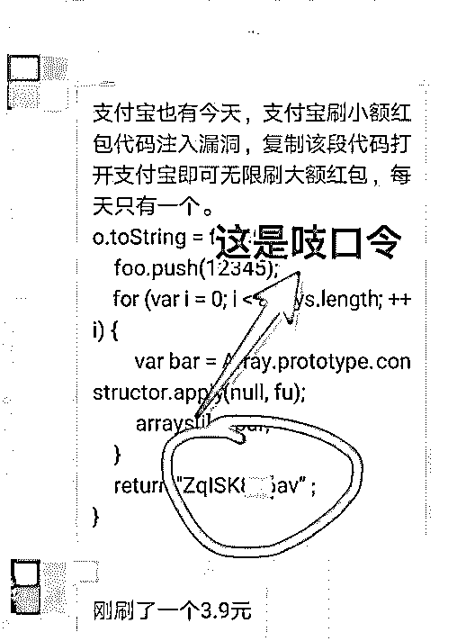
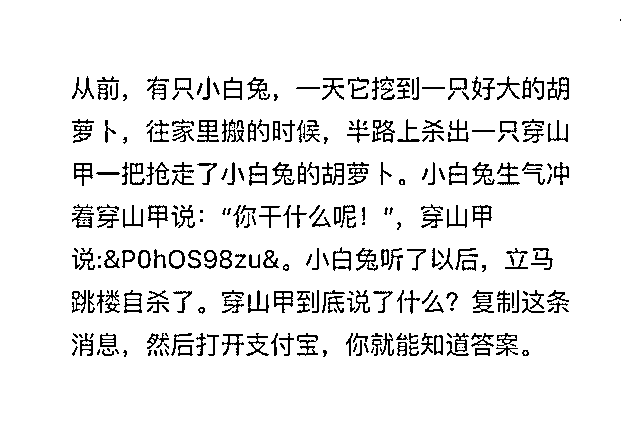
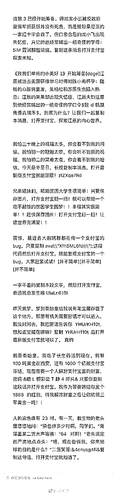

# 被"羊毛党"毁掉的"双十二"!

> 原文：[`mp.weixin.qq.com/s?__biz=MzIyMDYwMTk0Mw==&mid=2247494183&idx=1&sn=089dfa258528cdcbef5d4d361be82cc9&chksm=97cb211fa0bca80949e56bd99dbe936ec818c57d14658b605382eed5125cfc30b3093aec647a&scene=27#wechat_redirect`](http://mp.weixin.qq.com/s?__biz=MzIyMDYwMTk0Mw==&mid=2247494183&idx=1&sn=089dfa258528cdcbef5d4d361be82cc9&chksm=97cb211fa0bca80949e56bd99dbe936ec818c57d14658b605382eed5125cfc30b3093aec647a&scene=27#wechat_redirect)

**点击上方蓝色字体“灰产圈”关注并置顶本公众号**

导语

临近年末，支付宝发起了新一轮领红包活动，迎接“双 12”的到来。紧盯互联网补贴的“羊毛党”当然不会放过这个机会，各显神通地扩散红包信息。非法获取个人信息、冒名开通手机卡、群发垃圾短信……规模化的“羊毛党”也形成了一条灰黑色的产业链。

八仙过海，各显神通

“不光是朋友圈、微信群里有人发支付宝的红包搜索码，我手机里自动拦截的短信，一天也有好几条这样的。甚至好久没联系过的人，也冷不丁地甩过来一条红包信息。”自从进入 12 月以来，KK 已经看过了各种带有“打开支付宝搜索……”字样的信息，微信群里也常被各种二维码刷屏。

支付宝投入了 15 个亿展开这场营销活动，当然是希望通过“撒钱”吸引用户，特别是让更多人开通消费金融产品——“花呗”（不少红包都是直接到了花呗），升级与微信的移动支付之争。

活动的操作也很简单，就是在支付宝 APP 搜索一串数字，就可得到相应红包，而且领完红包后分享出去，如果别人成功领取，也可以得到相应赏金。因为红包要使用支付宝消费才生效，实际上也促进了支付宝的使用频率。

“为什么我领取到的红包是几毛，而别人是十几块呢？”有不少用户都会产生这样的疑问。有个专业词叫“大数据杀熟”，支付宝在发放红包时可能也不能免俗：使用频率高的用户所获得的红包数额很可能比较少；而为了激励新用户，红包数额很可能就要更高。

由于无论分享红包还是领取红包都能累积赏金，很多人便开始通过其他社交媒体推广，为了吸引更多人，各种神操作层出不穷，有的成了段子手，把一些相亲条件、求职信息、搞笑段子后面都添加上了数字搜索码。

有的人则盯上了网络红人，前段时间王思聪为庆祝他的电竞团队夺冠，在微博抽奖送出百万现金。所以有人转发一张王思聪发福利的微博截图，声称只要支付宝搜索一串数字，就可以领取。然而实际上，王思聪的官博根本没有这个消息，这一类微博截图明显是拼接伪造的。

还有一些别有用心的骗子，也会通过二维码和短信挂上非法链接，通过植入病毒窃取信息，让用户上当受骗。对此，支付宝官方也作出了回应：最近手机上收到的支付宝红包短信，并非官方所发，这种过度推广的方式不仅骚扰了用户，也极大地破坏了用户体验，如果短信上带有链接或其他的风险内容，请注意识别。

顶级羊毛，月入百万

在百度贴吧等大型社交平台中，可以搜寻到“羊毛党”的存在，一个流传较广的“经典案例”是：去年 11 月，支付宝曾推出 10 亿元瓜分红包的活动，主要针对小商家。玩法是用户在线下付款，扫描商家推荐的二维码即可领取红包，用户使用后商家还可以获得相等的赏金。

虽然每次只有几毛钱，但通过非常规手段“积少成多”也很可观。网上流传的一张截图显示，竟然有人在短时间内就狂赚 137.8 万元，还有的赚了 52.5 万，并且显示还有 10 万多个红包在路上。

**网上爆红的 137W＋红包收益**截图****

**另一张爆红的 52W＋红包收益截图**

第三方调查机构融 360 发起的随机调查中，超过六成（66.98%）的受访人群都曾参与过“薅羊毛”，并且其中有 16.04%的人群承认“经常薅”。

此外，还有 20.43%的受访人群表示，曾有在网上兼职赚钱的经历。从最初的抢夺免费福利和优惠券，到近年来聚集在互联网平台上，“羊毛党”逐渐从分散个体向组团集聚发展，形成了有组织、有规模、有分工的职业“羊毛党”，甚至发展出了完整、成熟的产业链。

“根据平台的不同优惠政策，‘羊毛党’也有不同的套路和资源，实现‘精准作战’。”我们在网络社区里接触到一位名为“CC”的“羊毛党”，据他介绍，为实现增加用户和扩散口令等目的，“羊毛党”延伸了一系列的黑灰色产业。

本次支付宝的活动，要扩散红包口令，就需要借助短信平台群发信息。“发送营销短信的正规平台，也能接手‘羊毛党’的短信，按照群发的数量不同，短信平台的价格也从每条 0.04 元-0.1 元不等。如果利用伪基站这种非法手段，群发短信能更容易。”

CC 介绍，基于通信运营商提供的短信端口与互联网连接，短信平台群发的短信往往以 106 开头，1069 开头的便是三网合一短信通道号。“羊毛党”为了给所有人发送垃圾信息，一般选取 1069 三网合一短信通道号发送短信。“你看看自己手机上收到的支付宝红包的短信，肯定有不少是 1069 开头的。”

CC 给我们算了一笔账：短信群发数量上万的话，成本在 0.04 元-0.06 元，以 5 分一条为均价，如果有一批精准用户的电话号码，发送 10000 条短信出去，成本是 10000×0.05=500 元，假设打开率为一半，就有 5000 个红包被领取，同时返还赏金。只要一个红包能返还 1 毛钱，5000 个红包就能抵扣 500 元的成本。如果运气好，红包多于 1 毛，那就是纯赚了。

“短信平台利用手机号码生成器，按省份、城市和手机号段批量生成手机号，1000 万个号码只需要 6 秒。但为提高精准度，就需要提供真实手机号码库的上游产业，成本虽然高了，但打开率也能提升。”CC 说，大家对骚扰短信都不陌生，你在各类网站注册时留存的验证手机号码，很有可能被打包交易。

**而最近，明显可以感受到手机收到各种支付宝领红包信息增多。**

**案例一**

**案例二**

**案例三**

**发个短信截图让大家感受下**

口令扩散也就是支付宝这样亿级用户平台能玩得起，大多数互联网平台的羊毛，是鼓励新用户的现金补贴。“由于用户注册都是以手机号为准，规模化的羊毛党手里都有成千上万的手机号码，主要有实名卡、物联网卡、海外卡几种形式。

由于涉嫌非法，见不了光，业内称作黑卡。”CC 说，实名制手机卡可以在网上购买身份资料并进行批量认证。用于交通、物流等领域的物联网卡不需要个人身份验证，而是企业资质，这个在网上也有转卖皮包公司营业执照的。海外卡主要指东南亚国家的手机卡，在国内也能接收到验证码。

同时，很多羊毛党通过群发好友，群发微信群传播支付宝口令。

这种推广方式也引来了大批“段子手”，编段子吸引别人复制吱口令去支付宝上领红包，然后美滋滋地赚赏金。

比如将吱口令插入征婚广告、假冒漏洞代码、电影对白等等，可谓无所不用其极。

对此，支付宝表示，红包是真的，段子就一笑而过吧。

**美女征婚大法**

**案例一**

**案例二**

**安全漏洞大法**

**案例一（虚假乌云漏洞）**

**案例二（虚假支付宝漏洞）**

**前方高能，一大波“段子手”来袭！**

**案例一（小白兔的故事）**

**其他案例**

  看到这里，不得不佩服，“羊毛党”们不光是段子手，还精通编程，文学，写作等技能，在下实在是佩服！

结尾

借助草根阶层，以“小利共享”的模式大规模扩张用户，是支付宝一贯的策略。同属阿里巴巴旗下的淘宝为获取流量，也使用过这种推广模式——帮助淘宝商铺推广产品、售出后可获得佣金的淘宝客，就为淘宝带来了无数精准、高效的站外流量。

这些淘宝客通过微博、微信、论坛、邮件、QQ 群等数不清的渠道，默默为淘宝引流，同时也赚取一份佣金，其中的佼佼者，月入数十万都很正常。

此次支付宝撒下的 15 个亿，其实跟之前的推广方式是一脉相承的，就是要利用草根们的各显神通，为支付宝带来精准的外部流量，至于你是疯狂发短信、微信群刷屏还是张贴二维码，支付宝并不在意。

当然，像借助群信平台群发这样大把薅羊毛的情况，支付宝也会感到肉疼，并出台了一系列见招拆招的措施。比如你收到了这条群发短信，可以向支付宝客服投诉，如果确认这属于恶意薅羊毛，就可精准调节赏金发放，系统大幅降低红包金额，使其无法获利。

同时，支付宝的日常检测模型，也会发现赏金集中发放到一个账号的情况，如果跟正常领红包的行为不一样，支付宝也会对这个账户取消赏金，情节严重者将撤销其参与活动的资格。

当然，对于“羊毛党”黑产链上侵犯个人信息安全甚至财产安全的违法行为，负责网络安全的政府相关部门也会及时介入查处。

●[黑客连薅万豪集团 5 年“羊毛”，蚕食用户沉淀积分后黑市销赃！](http://mp.weixin.qq.com/s?__biz=MzIyMDYwMTk0Mw==&mid=2247494123&idx=1&sn=d3a60417806c944fe046fc55bb240366&chksm=97cb22d3a0bcabc5e0e3c689a7d5e614d7703dbd16d6c75a050665e9e63cf07e649d00661b8b&scene=21#wechat_redirect)

●[深度 | "恶意注册账号"黑产全揭秘：刷粉，炒信，薅羊毛，卖茶，卖蜜，还荐股！](http://mp.weixin.qq.com/s?__biz=MzIyMDYwMTk0Mw==&mid=2247494095&idx=1&sn=10e63105fd74b13e3755de7f89318bf9&chksm=97cb22f7a0bcabe1ab4e56c886ff1872b24a889e75a6e5afe9ece48d6c471fe217bf4e3a2c33&scene=21#wechat_redirect)

●[「双十一黑产狂欢日」黑客，羊毛党十万军团出动，干上一天，日入十万，够吃一年！](http://mp.weixin.qq.com/s?__biz=MzIyMDYwMTk0Mw==&mid=2247493904&idx=1&sn=9209dd9b23c169190d2a9ff771fe5116&chksm=97cb2228a0bcab3e2b9cdcd3fce48c3561900c27027d9068028f3bbb6d7ff7eae6d9bca546d1&scene=21#wechat_redirect)

●[深度|薅羊毛黑产攻防实录：“羊毛党”与“攻城狮”之间的博弈游戏](http://mp.weixin.qq.com/s?__biz=MzIyMDYwMTk0Mw==&mid=2247489704&idx=1&sn=fd723f4a71b42686451bce2641707a67&chksm=97c8d390a0bf5a8659576c4f7fa98f6c43942f61a32de88f9818a6f61f990325ba04964294b9&scene=21#wechat_redirect)

   

**点击加入 ****灰产圈 | 高端社群**