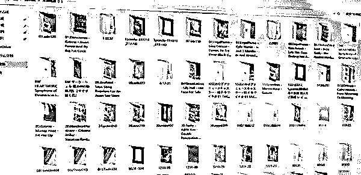
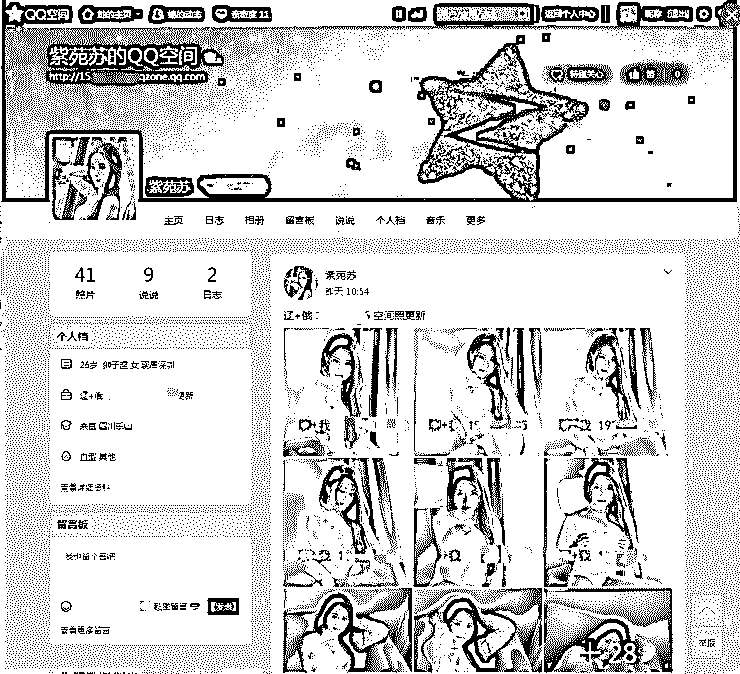
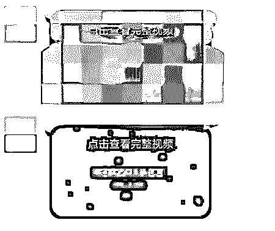
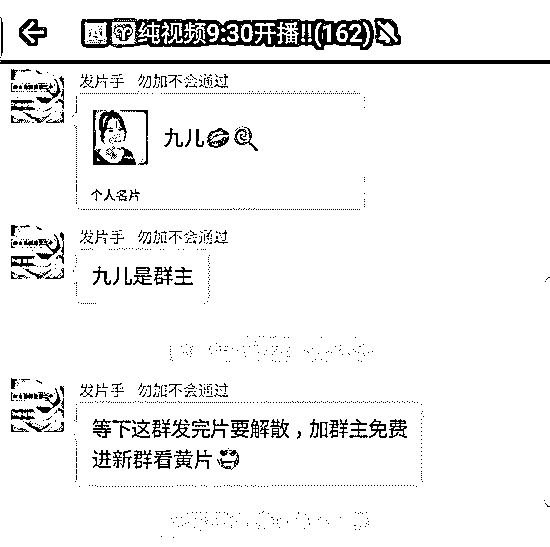
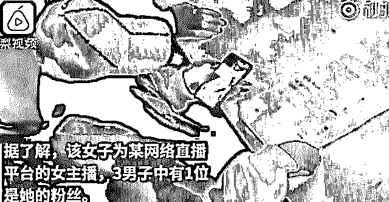

# 杀妻骗保案：网络色情产业或许是其中推手！

> 原文：[`mp.weixin.qq.com/s?__biz=MzIyMDYwMTk0Mw==&mid=2247494174&idx=1&sn=3430ae5864af565ebd664bfce9a040d3&chksm=97cb2126a0bca83091d943152fb6789d92dc8b5acbe87d64cf1011213a6dd55062966d3f7b1e&scene=27#wechat_redirect`](http://mp.weixin.qq.com/s?__biz=MzIyMDYwMTk0Mw==&mid=2247494174&idx=1&sn=3430ae5864af565ebd664bfce9a040d3&chksm=97cb2126a0bca83091d943152fb6789d92dc8b5acbe87d64cf1011213a6dd55062966d3f7b1e&scene=27#wechat_redirect)

**点击上方蓝色字体“灰产圈”关注并置顶本公众号**

* * *

昨天，一则让人毛骨悚然的新闻突然爆出。“天津男子普吉岛杀妻伪造现场，作案前给妻子买三千余万保险”。故事中“骗保”、“杀妻”等关键词十分刺眼，但是其中牵出的另一个产业或许是你暂时没有注意到的...

* * *

残忍的骗保杀妻

“丈夫在几个月之内，陆续为妻子购买了十几份保险，保险金额可达两三千万，将妻子身亡后的受益人设为自己，然后带妻子出去旅游，将其带至泰国普吉一家私密性极强的别墅酒店残忍杀害，后伪造现场向岳父母谎称妻子溺亡。”

此前，各种骗保的新闻并不少见。但是这次的“杀妻骗保”背后似乎有一丝不同。

但让人奇怪的是，张轶凡并不像是因生活所迫骗保的人。据新闻中的细节来看，案中嫌疑人张轶凡之前是大家眼中“憨厚老实的宠妻老公”，并且双方家长都在资金支持这个小家庭，结婚的时候其妻小捷的父母陪嫁了一套房子，外加 80 万元现金，后来买第二套房子时，小洁母亲又资助了 60 万元，加上张轶凡父亲给的 100 万元，房子全款也够了。

但是，骗保一般来说是因为缺钱，如果只是简单的“过不下去”也不至于下此毒手。再往后了解，才发现从今年 7 月中旬开始，张轶凡开始疯狂给主播进行大赏，金额从之前两三百元升至千元，甚至还有单次万元的打赏消费。除此之外，**他的电脑中存有 158G 的色情视频**，有过相关线上色情服务消费、相关裸聊截图，和大量的酒店和奢侈品消费。

**而他在这些色情消费中投入了大量资金，除了之前父母资助的 200 多万结婚和买房资金挥霍一空，还有 67 万的贷款和零散信用卡借款。**甚至最终为了骗取几千万的保险补偿，残忍的杀害发妻。

从这些描述中，我们无法确定其杀妻骗保的根本原因。但脑中还是浮现了一个疑问，**网络色情服务带来的债务和资金需求，是他走向极端的一个影响因素吗？**

网络色情产业

像张轶凡这样深陷网络色情的人并不在少数，而其中大部分接触到网络色情都是从“小视频”开始的。

**涉黄小视频**

**拍摄制作：**

首先，我们了解一下这些视频的制作。视频的主要来源有以下几种：

①相关从业人员拍摄（以境外为主）

②违规直播的留存视频

③各种偷拍视频

这些拍摄剪辑好的视频大部分直供涉黄网站，同时通过各种违规网站、论坛、云盘，甚至暗网等渠道被传播。

**传播售卖：**

当我们在网络上搜索“上车”、“7 了 XX“等关键词，出来了非常多相关小视频、图片，上面布满水印，“查看全部请添加 XXX/进群 XXX”。

添加好友之后，发现她们是这样的...

大多数要求交 15-199 不等的“会员入群费”，而加群之后，他们大多是这样的...管理人员直接在群内发送各种完整版本的视频，还会选择禁言以免“影响观感”...

而在传播过程中，除了真正从事相关产业的人员之外，还存在大量的“兼职人员”，他们大多是闲暇时间较多的学生、家庭主妇、在职人员等，通过各种“网赚”渠道而来，有些为了隐蔽，还会选择当天建群当天解散，无所不用其极。

初中生兼职上传 1600 多部视频

在各种社交渠道建群售卖之外，还有大量的违规网站、涉黄软件存在。曾经闻名一时的“MM 公寓”就是其中之一，当时注册会员超过百万人，最终抓获嫌疑人 2148 人，在全国属于史无前例。

从精心剪辑的“十秒小视频”到“会员费”入群之后的完整小视频，这条攀附在我们整个社交渠道上的“色流”一直在悄无声息的蔓延着。

**直播软件**

除了我们上面说的视频之外，近几年火起来的直播形式也被他们采用。

**直播平台涉黄的问题由来已久，其中存在的难点主要在于审核。**大部分 UCG 的直播内容经常是断点、非连续性的，导致在官方进行审核的过程中必定需要耗费更多的人、物、财力。有些平台一年仅审核支出就有几千万元。

当然，随着相关技术的发展和资金的支持，在大型直播平台做涉黄的行当难度不断增加。**所以，有些黑产直接开始自建各种直播平台。**其中搭建平台的费用并没有我们想象的那么高，其中主要包含三个方面：

**①软件**

**②带宽**

**③服务器**

目前市场上的直播软件代码几乎都是公开的，略懂技术的人可以直接在代码上进行自主开发。不懂的人在某宝上购买一个直播软件的源代码可能都只需要 100 元不到的成本，还有很多满足定制化需求的 APP 开发更是让直播平台搭建更加方便。

这些涉黄视频大多以高清为主，一万人的直播平台一个月需要几万元左右。平台所需要的服务器配置不会很高，4 核 8G 一台就够 3000 人同时在线，价格不超过 1000 元，并且如今的服务器租用市场也非常方便。

就是这样低门槛的搭建平台现状，相关的涉黄直播软件层出不穷。

国内最大的色情云播平台——“月光宝盒”，在今年一月被一举捣毁。**他们采用“快播+直播+传销”的模式**，加上代理分级，建立“金字塔”式的层层代理模式来发展会员，收取相关费用。**就是这样，他们在不足半年的事件内发展了 46 个高级代理，成员涉及 17 个省份，拥有的注册会员 300 多万，最终涉案金额超过 2000 万人民币。**

这些涉黄的直播软件成本并不高，但是收益却很大。其中非常重要的一点就是“打赏”。直播过程中，主播会通过色情表演及传播淫秽物品来吸引平台会员不断充值平台币，平台币可用于够买虚拟礼物打赏主播，这些虚拟礼物的价值在数元至上千元不等，平台后台每日累计主播收到的虚拟礼物总价值按规定比例兑现成现实货币，有的主播月收入最高都能达到几十万。 

目前的收入分成不同平台不一样，但是大体上都是平台抽取 35%-50%不等，交税 35%，剩下为主播收益。 

“骗保杀妻”案中的张轶凡打赏主播的费用从几百元逐渐演变到单次千元，甚至还有单次万元的情况。而这样的用户并不在少，**因为沉溺其中，加上平台方的诱导，普通用户很容易追求一时的心理满足感进行疯狂打赏。 **

在直播软件背后，不仅仅是打赏，还衍生除了很多“裸聊”等其他服务项目，更有甚者直接发展线下“相约”。 

在直播过程中，直接暗示的主播不在少数。“哥哥们，刷跑车加微信，视频 1 对 1 裸聊！”跑车刷出，观众报上微信号，主播小 Z 拿着手机添加微信。按照平台商城换算，1 个跑车需要 800 个钻石，而充值 1 元能兑换 10 个钻石。也就是说，刷出 80 元，就可以视频一对一裸聊。在张轶凡的文件夹中出现的“裸聊截图”大抵就是来源于此。

**线下直约 **

而直接线下相约的在直播行业并不少见，动辄打赏几万元的“大客户”通常都会要求见面，很多女主播为了“哄住”他们还会飞赴异地与“金主”相见直接进行卖淫嫖娼活动，一次可以赚到千元到万元不等。“因为一旦得罪他，可能就转到别的女孩那里去了。”

甚至还有一些人就是专门介绍观众和主播“会面”的。他们被称为“家族长”，这些“家族长”手上有非常多女主播、潜在女主播资源，他们推荐这些女生进入“黄播”行业、踏入与“客人”会面之路，从中薅取大量利润。

“无害”的产业？

至此，网络色情背后的猫腻我们基本上摸了一遍。而从案件中张轶凡的消费记录来看，上面的链条他或许都已经走过一遍，从无意间接触到那十秒钟的小视频开始，到付费进入相关的群组，再到接触违规的直播，或许其间对某个主播十分中意，疯狂打赏引其注意，最终，一发不可收拾。

**这其中的每一环、每一步，都还有人在不断重走、不断试探。**

**我们以前常说“人间毒瘤有三——黄、赌、毒”。**赌博让人倾家荡产、妻离子散；毒品从根本上让人产生依赖，跳入罪恶的无底洞。

而“黄”，提到涉黄我们好像并没有像另外两者那样谴责，甚至还有古人云“笑贫不笑娼”。如果此人有家庭涉黄了，的确道德有问题。如果此人单身呢？我们大多没有愤慨的指责，或多说一句“要注意别染病”。

**究其根本，我们是不是认为“黄”这件事情对于他人是“无害行为”？这仿佛和其他产业没有任何区别，自由选择，“付出努力”，给出报酬？**

**不，不该如此。**

如今的黄色产业发展多么迅速，背后的产业链中有多少无辜的少女被卷入其中，甚至发展到今天，孩子都无法幸免。巨大的市场需求，巨大的人性需求，让这个产业伴随人类一直到今天。已经不再是单纯的“自由交换”了。

**其一，在道德层面不合适。**

**其二，这带来了很多无辜伤害。**在无数的黑产平台商，无数的偷拍视频贩卖者，无数的为少女挖好陷阱的“家族长”存在的情况下，这个产业已经不再像我们想象的那么单纯了。

时至今日，在互联网的背景下，我们的欲望被无限放大，各种形式的需求开始不带遮羞布的走入市场，“你需要什么，我就给你什么”。这句话在此刻变得无比让人痛心。与此同时，我们也很难区分出这条产业链上哪些是在自由意志下选择进入的，哪些又是无辜被卷入其中的；哪些是无辜卷入之后不想离开的，哪些是进来之后想逃又跳不掉的......在这庞大的需求压迫下，这个交易市场变得越来越浑浊，掺杂了血水和泪水。

**所以不能。**

**其三，沉溺其中的所谓“用户”、“观众”，最终也很可能得不偿失。**

正如上述的张轶凡一样，误入其中，以为随时可以收手离开。但欲望这个东西是会膨胀的，当它越来越大的时候，你的自控力会没有位置留下，你的羞耻心会没有位置安放，你的爱心、你的责任心、你的同理心......全部都会被吞噬。

**最后，留下来的还是你吗？**

●[黑客、色情、黑公关——管窥中国互联网的地下世界](http://mp.weixin.qq.com/s?__biz=MzIyMDYwMTk0Mw==&mid=2247494131&idx=1&sn=18a38448d066a42e53ed8edd3ba1aed4&chksm=97cb22cba0bcabdd1d2ba053ed81f24635cca52982e53ca05bcc430052e7b3267103e8fb952c&scene=21#wechat_redirect)

●[深度 | 偷拍黑色产业链：“我的生活不是你的色情片！”](http://mp.weixin.qq.com/s?__biz=MzIyMDYwMTk0Mw==&mid=2247494117&idx=1&sn=bbc400d9baf938c07b725b0710f2e16f&chksm=97cb22dda0bcabcb1b87e2a2b5d030fc4a0d0c7fee1140ff5d8cafb39cbcf54685c62d49b0e5&scene=21#wechat_redirect)

●[从“交友和色播”乱象说起：起底当代中国情色产业链](http://mp.weixin.qq.com/s?__biz=MzIyMDYwMTk0Mw==&mid=2247491989&idx=1&sn=ff353261f545caa5a0ea14d26a0d1ea2&chksm=97cb2aada0bca3bbb489d4a2482814b808060acf4d19148304585d30609869081c370af9dfb4&scene=21#wechat_redirect)

●[深度|卧底数日！曝光“网络代聊”与色情服务行业不为人知的一面...](http://mp.weixin.qq.com/s?__biz=MzIyMDYwMTk0Mw==&mid=2247491974&idx=1&sn=ee8a8e29819e817b81bded8b277f8f27&chksm=97cb2abea0bca3a89a92cabd8305762f8dc68d2626afa4d93dbdbba3174b50eb42c336d1c37b&scene=21#wechat_redirect)

  

**点击加入 ****灰产圈 | 高端社群**