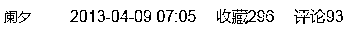
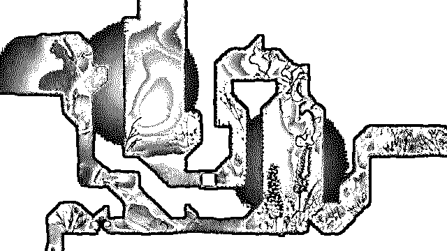
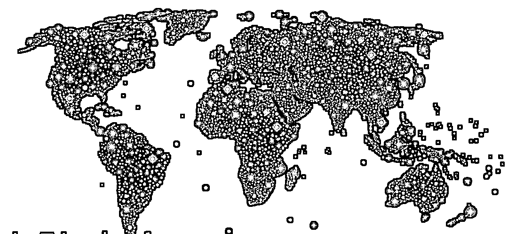
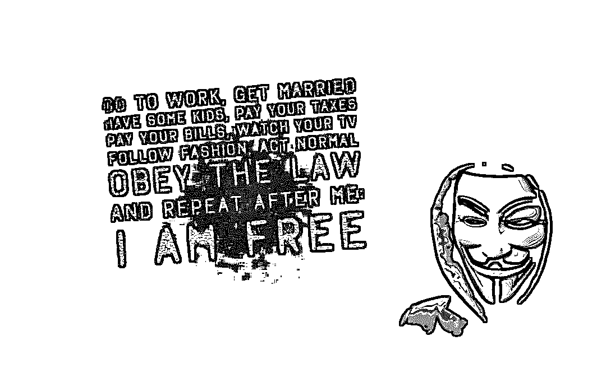
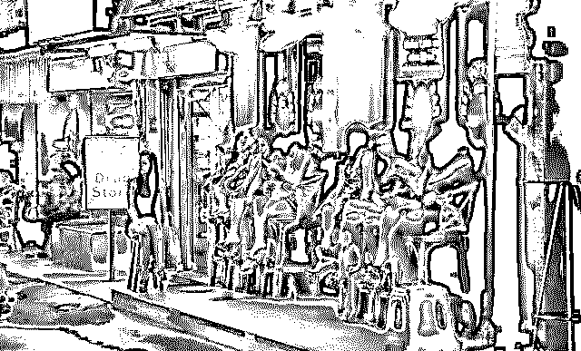
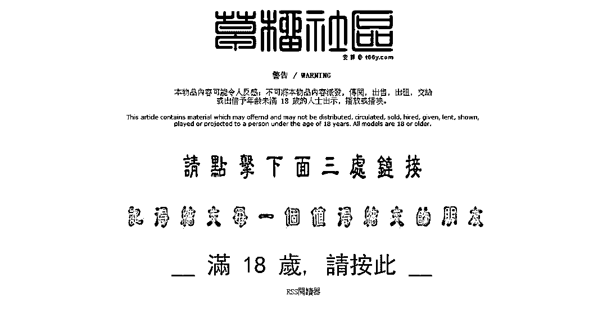
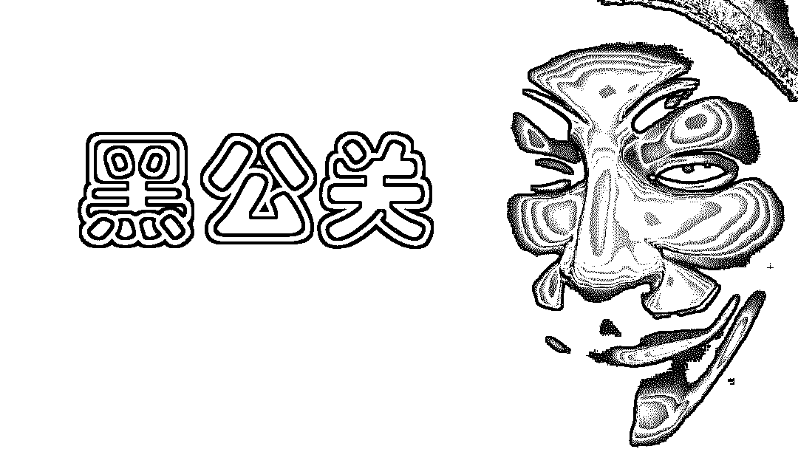
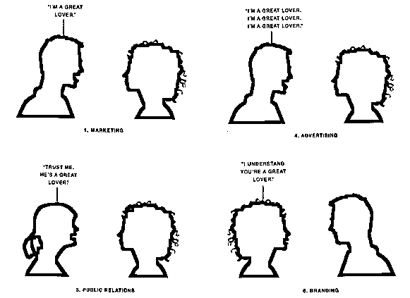
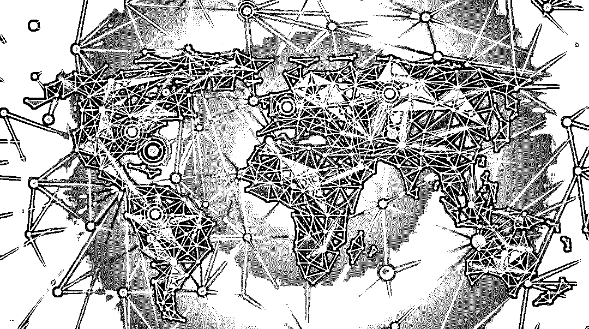

# 黑客、色情、黑公关——管窥中国互联网的地下世界

> 原文：[`mp.weixin.qq.com/s?__biz=MzIyMDYwMTk0Mw==&mid=2247494131&idx=1&sn=18a38448d066a42e53ed8edd3ba1aed4&chksm=97cb22cba0bcabdd1d2ba053ed81f24635cca52982e53ca05bcc430052e7b3267103e8fb952c&scene=27#wechat_redirect`](http://mp.weixin.qq.com/s?__biz=MzIyMDYwMTk0Mw==&mid=2247494131&idx=1&sn=18a38448d066a42e53ed8edd3ba1aed4&chksm=97cb22cba0bcabdd1d2ba053ed81f24635cca52982e53ca05bcc430052e7b3267103e8fb952c&scene=27#wechat_redirect)

**点击上方蓝色字体“灰产圈”关注并置顶本公众号**

分享一篇五年前的文章，现在看来这篇文章可以预见未来，未来已来，产业还在，只是延伸和变种，还是那句话：有人的地方就会有江湖,有江湖的地方必然有纷争

导语

前阿里巴巴集团高级安全专家 @aullik5 曾在其微信公众帐号“道哥的黑板报”上分享了一则关于“黑客”的故事，文章颇具传奇小说的风格，不少人读过之后表示“无法相信”。冯大辉@Fenng (微信号：小道消息）对此评道：“质疑的人或许并非无知，只是事情超过了他们的认知范围。中国互联网的三个世界，在地下世界发生的事情，地面上的人永远不知道是怎么回事。”

三个世界

而关于“中国互联网”的三个世界，冯大辉也早在 2012 年年初就提到过这个归类方法：“在中国，存在三个互联网形态。一种是媒体给人灌输的互联网，以海外 IPO 为目标的；一种是草根互联网，低调掘金，如迅猛龙般彪悍；一种是深藏地下的互联网。”

这个分法，大致上是合理的，如果对应其实际的案例，第一类是属于“空中互联网”，通常保持在媒体视野之内活动，有着从西方借鉴过来的成熟的商业模式，比如大家熟知的百度淘宝微博等。第二类是“地面互联网”，贴着地气生长出来的原生态产物，极具草根和市井特色，一般都在埋头挣钱，鲜有媒体关注——过多的媒体关注对它们而言也不算利好之事，代表有 9158（年营收破 10 亿的视频交友网站）、5173（中国最大的网络游戏交易平台）、雨林木风（以盗版 Windows 系统发家，现已洗白）等。

第三类的“地下互联网”，尽管涉及许多见不得光、游离在法律边缘的行当，但它也并不完全等同于一个法外之地。更多时候，无论是为了自保还是业务的安全需求，他们都不会主动的浮到地面上头让人发现。然而，在很多时候，地下互联网都无意中直接或者间接的影响着普通网络用户的生活环境，甚至参与制定过一些地上互联网世界也必须遵从的规则。

在这里，我可以讲一下我所接触或者经历过的，地下互联网庞大冰山里的三座山头，它们平时可能只是以书面上的词汇形式为人所知，然而，毫不夸张的说，它们真正意义上左右着中国互联网的某些时局。

黑客（Hacker）

在理论上，目前对于黑客的定义存在着比较重大的误读，简单来说，这个源自美国计算机业界的舶来名词本意上是用来形容对计算机技术有着深入研究、捍卫自由共享的网络精神、偶尔会利用技术优势做做恶作剧的电脑高手。

只是猛兽易伏，人心难降，在私欲的牵引下，有些具备黑客技术的人走上了恶意破解商业软件、入侵服务器系统以谋取利益的道路，这些人被称为 Cracker，而这里所讲述的山头，正是 Cracker 的领地，但是为了便于理解，暂时也将 Cracker 译为黑客，大家知道实际区别就好。

许多媒体曾经或多或少披露过的“黑客”新闻，多半也是属于这类，在媒体的笔端，这类黑客似乎都是来自鼠标和键盘的混种天才，足不出户便能闯入任意网民的电脑里，盗取各种信息资料，或是轻易入侵各大网站，还能删改网站首页留下“到此一游”的得意战绩。

这些报道，多以道听途说、或是采访已被公安抓捕的网络敲诈犯为信息来源，既有夸大之处——黑客通常必须要有“木马”等程序作为桥梁进行入侵，否则无法单凭网线就去操作任意指定用户的电脑，也不乏低估的地方——很多因为犯事而被曝光的小黑客其实属于黑客产业链的最下游，只是凭借在交易平台购买的暴力破解或攻击软件，以极小几率入侵了某些防御力量实在薄弱的网站数据库，实现了盗取帐号密码的目的。

真正入流的顶级黑客，他们其实都是一群生意人。

生意人有个特点，他们擅长玩的是交易，用一些东西换另一些东西，再用另一些东西换别的更多东西，最后获得自己想要的最大利益，而这个看似是技术密集型的行当，在他们的掌控下沦为了一个劳动密集型的行当。

2009 年 5 月 19 日，这是中国互联网历史上的一个标志性刻度。有印象的网民应该都还记得，在这一天晚上 9 点左右，全国范围内出现了大面积断网事件，超过 23 个省份陆续出现网络中断或访问受阻的现象，持续了数个小时之久。而后，电信运营商和工信部把黑锅盖到了暴风影音头上，称“由于暴风影音客户端软件存在缺陷，在暴风影音域名授权服务器工作异常的情况下，导致安装该软件的上网终端频繁发起域名解析请求，引发 DNS 拥塞，造成大量用户访问网站慢或网页打不开。”而事情背后的真相却是，暴风影音虽然也应当为此承担部分责任，但它的确也是货真价实的受害者之一。

后来有少数媒体对事件缘由作了较深的挖掘，发现是黑客在攻击 DNS 服务商的时候，致其服务器宕机，而暴风影音的域名解析正好处在这台服务器上，而拥有千万级用户规模暴风影音当时会在用户的计算机上残留一个用于监测状态和弹出广告的进程，这个进程在回传信息的时候遇到服务器堵塞，继而因为暴风影音的设定机制不断累计往回发送请求，最后直接弄瘫了中国电信的 DNS 服务器，让全国网友都断了网。

为什么黑客攻击能够引起如此震动的影响？这背后的利益关系核心，却是另一个行业：网络游戏。这里所称的网络游戏，是所谓的“私服”。中国曾经最大的网络游戏产品《传奇》在源代码发生泄漏之后，实际上就变相的成为了一个“开源”的游戏产品，任何稍具技术的用户都能自主的搭建《传奇》游戏的私人服务器，提供经过修改后的、在某些方面比官方更加“刺激”的《传奇》游戏。而基于庞大的用户付费基础，中国大地上如雨后春笋般一度出现了千万个《传奇》私服——具体数字比后来的团购网站巅峰数量更多，于是有些大的黑客就盯上了这个群体。

《传奇》私服在宣传时一般都需要搭建一个网站，用来提供游戏服务器的 IP 或登录器下载——这是用户进入其游戏的唯一入口，而黑客就瞄准了这个为私服运营者提供收入支持中不可或缺的入口，每天扫描新开的私服网站，向手底下的“操作者”发送攻击指令，后者通过常规 DDOS 或其他更高明点的手段将目标私服的网站攻击瘫痪，中断用户入口，再联系私服运营者，索要数千甚至上万元的“放弃费”。如若遭到拒绝，则进一步攻击游戏服务器，导致玩家无法正常游戏，彻底断掉私服运营者的财路。高峰时期，中国每天都有上百万台服务器受到这类黑客的操控，用于威慑和打击私服网站及服务器，而私服运营者方面因为本身就是违法生意，根本无法寻求警方协助。（这从侧面似乎也证明了私服行业的惊人暴利，在黑客、官方的双重打击下仍能前仆后继……）

而 519 断网事件，就是由一伙黑客在打某家《传奇》私服的时候，直接攻击到了后者服务器所在的 DNS 服务商身上，进而引发暴风影音的连锁反应，酿成大祸。这让工信部第一次意识到了互联网在政治之外的风险，曾有网警单位试图打入黑客关系以及病毒产销链的内部，但皆因身份伪装失败而遭泄漏，不过也起到了一定的威慑作用。2010 年 3 月，工信部低调推出了中国通信行业网络安全的首个部级指令《通信网络安全防护管理办法》，确定了电信管理机构的行政权力，还给公安部门下了任务指标，不少地区兴起“抓捕黑客”热，最终的结果可想而知：一些在网吧里自学简陋的攻击软件的青年被当作涉案重量级黑客锒铛入狱，而真正有能力的黑客则开始将研究重点由“入侵”转移到“隐匿”上，反倒间接的推动了中国加密数据网络技术的水平提升。

还有更多单打独斗的黑客从事的是“信封”交易，通过自己编写的软件将恶意代码注入某些防范不严的网站数据库，造成用户数据的外泄（或者入侵大型网站后在网页上挂木马）。2011 年年底 CSDN 遭到“拖库”攻击被黑客拉出 600 万用户的明文帐号密码，即为一例。经过这种方式拿到的帐号和密码，通常会由黑客使用另外的程序进行各种主流的软件或游戏进行交叉验证，比如，你在某论坛的帐号和密码被捕捉到之后，黑客会用此帐号和密码去撞 QQ、各大邮箱、各大网络游戏等地，如果恰好有人帐号和密码在这些地方亦保持一致的话，则被封装为信，成为一件商品。这些被称为“信封”的文件被拿到批发市场上进行交易，由购买者再去挖掘更多用途的价值——比如购买了某网游信封后，就可以去盗取该网游帐号的装备，而在购买了某 QQ 信封后，则可以操纵这些 QQ 号去找好友行骗等等。一名已经洗手不干的黑客曾透露说，中国市场上待价而沽或正在交易的“信封”超过了二十亿封，年产值在百亿人民币规模。

逐利的黑客更有着“养号”的习俗，若是将木马或者后门程序种到用户的计算机内，则会盯上一些暂时没有价值、但可能会有升值空间的资料，比如级别并不高的网游帐号，待到该帐号成长起来产生价值之后再来“收割”。这类黑客倒是对 360 等安全软件抱有某种程度上的“谢意”，因为就他们的样本来看，没有安装安全软件的用户，重装系统的频率要比装了安全软件的用户高出太多——很多用户会将重装系统当作清理电脑的一项手段，而重装系统对于 90%以上的本地木马或是后门程序都有着毁灭性的打击。

在中国，广东、福建是黑客聚集较多的地区，产业链上游的黑客，基本上都有着实业。我所知道的一名黑客，开着三家夜总会和一个茶庄，泡着古玩和书画市场，每个月抽一天的时间去他控制的工作室查账、开会，连他的老婆都不知道他的真实面貌。还有一名黑客，白天在一所专业学校里教计算机课程，曾在一个晚上打掉某著名游戏厂商的整个数据库，被该游戏厂商悬红百万人民币通缉，而他就在自己被通缉的期间，迎娶了该游戏厂商的一名女策划，后者对他愤恨说某黑客让自己公司蒙受损失并影响了自己的年终奖，他只是笑着安慰。

在黑客这个圈子，大的瞧不起小的，认为后者太过张狂，不仅扰乱市场，而且会招来不必要的政府关注。而小的都憧憬大的，并希望自己能够早日成为大的，所以常有急功近利的事情发生。一名年仅十九岁的黑客曾经黑掉了某个地区政府的官方网站，目的只是想要将成果展示给他的朋友欣赏，后来他被警察逮到，预计直到不惑之年才能再见天日。

另外，在媒体的渲染下让很多人谈“黑”色变的直接盗取网银钱财的黑客行为并不多见，因为此时，黑客的攻击对象并不是毫无议价能力的普通用户，而是国家金融机构，一旦被发现，后果不太能够承受，而且当越来越多的网银将手机验证作为交易环节之一，网银的壁垒也的确相对较高。与其冒着风险和难度来入侵银行的对外系统，一些小黑客更喜欢借助钓鱼页面的形式来诱导用户在虚假的网站上展开交易，再来借机引导被欺瞒的用户将钱打入指定账户。而大点儿的黑客，他们可以私下演示如何入侵大型商业公司甚至国家安全系统的能力，但是一般不会动里面的东西，只是不留痕迹的出入而已。

基本上，因为某些行规和自我保护的因素，中国的黑客圈子秘密很多，外流的极少，甚至有时会有意放出一些极其夸张或者与事实大相径庭的消息，干扰外界视线，达到隐蔽目的。他们大多认为黑客是一门吃青春饭的生意，希望早日当上“老板”，指挥后辈在前线冲锋陷阵，自己坐享其成，而出于职业习惯，他们也对生活中的许多事物保持相当高的敏感神经，每周注册一个新的 QQ、重要代码写在本子上不往电脑里存、笔记本电脑的摄像头永远贴着不透明的胶布等，都是常见的现象，因为过度紧张和集中注意力，神经衰弱、睡眠质量奇差、脾气不好都是黑客们的职业病。

色情

接下来要说的第二座山头，叫作“色情（Porn）”

在世界上的绝大多数国家，色情业都是合法的存在，而在中国，由于国家体制的原因，色情业仍然处于法律的敌对阵营里。但是，食色性也，作为人性的原始需求，色情网站满足了网民对于欲望的部分需求，根据 BusinessInsider 的一份报告数据显示，色情网站占全球网站整体数量的 12%，其总体流量占比可能逼近整个互联网流量的三成左右。

尽管在中国，色情行业（及网站）都是非法产物，但这也无法遏制某些城市成为举世闻名的“性都”，也造就了如草榴社区这样的色情网站集群。

草榴社区创建于 2006 年，服务器在美国的科罗拉多州，时值中国曾经最大的色情论坛情色六月天东窗事发——其服务器虽然设在美国，但是论坛的主要管理员却都是不折不扣的中国人，又因内部斗争（主要为收入的分配）而造成不和，最后被山西省公安厅将部分论坛管理者抓获在案。草榴社区充分吸收了前辈失足的经验和教训，基本上不会设置太多的论坛管理者角色，即使需要存在的某些拥有管理权限的帐号，也都是不会在社区里发言和互动的（早期有过，但是后来就隐匿掉了），这样就尽可能的避免了信息外泄或者产生纷争的风险。而草榴社区的实际控制者，都有着海外国籍，受到他国法律保护。

因为目睹太多由利益而起的纠纷最终牵连网站的案例，加上草榴的主要创始人（几名美籍华人）家境尚好本就不算缺钱，所以并没有在盈利上花太大功夫。因为草榴社区一直是免费运营的政策——除了小范围内的展示型广告、网盘链接分成之外，都没有太多商业化的机制，这使得草榴社区的“名声”一直很好，一个不弹广告窗口、也不限定用户购买 VIP 方可浏览的色情论坛，怎么可能不受欢迎呢？2011 年 6 月，草榴社区曾经尝试开放注册一天，结果一夜之内多了十三万新注册用户，管理方发现这样下去数据库会崩溃，于是就继续采用邀请注册的机制至今。

但是草榴社区并非是中国色情网站行业的翘楚，它只是色情影片进行分销的一个主要渠道，更上游的，是那些收费运营、更加隐蔽的色情网站。借助 P2P 的共享模式，下载色情影片成为了中国网民接触色情信息的主流方式，而影片并非凭空出现的，它的片源在日本、欧美等国家以商品的形式存在，那么这中间就需要当地华人掏钱去将光碟购买下来，再将其转码成为网络流行的 AVI 或 RMVB 等文件格式，制作成种子之后上传到色情网站提供 P2P 下载，这些人属于“发片员”。“发片员”少数是义务性质，大多还是会从色情网站的运营方那里拿到费用补贴，而后者则利用他们带来的影片更新内容，吸引用户下载、传播、付费。而有些用户则以这些种子作为资源，将其分享到草榴社区等网站，造就了后者的繁荣。

能力出众的“发片员”，甚至会在论坛里享有至高的特权，比如 18P2P 著名的“nike”（用户 ID），这是一名香港网友，本身从事的就是色情影片光碟租售业务（在香港合法），因其能够以每天几十 G 的网络发片规模持续了好几年而闻名于世，在网络上一度有 80%以上的日本有码片源都是出自他那里。18P2P 对此贵客也是多方担待，明文告示任何人不得打扰 nike，包括在其帖子下面回复攻击性言论、或是发送论坛短消息给他求片等，都会直接遭到封杀 ID 的处理。nike 最终因为自己要结婚以及其最爱的 AV 女优松岛枫传出退役消息，而退出江湖，真正的“深藏功与名”，只留下传说。

苍井空在中国走红，日本 AV 圈内其实是不太待见的，因为作为一个在日本完全合法的行业，色情影视业仍然是一个通过销售光碟赖以为生的产业，对从业者、发行商的回报完全由顾客购买决定。色情 AV 在中国市场几乎是一个纯 P2P 的分享模式，在一个无视版权、甚至连色情本身都不合法的国家转而借助从影片中积累的名声进行变现，无疑释放出一种“鼓励中国人继续盗版日本的色情 AV”的信号。

不过苍井空也只是个案，无论是政治还是性文化上都呈保守姿态的中国，对待色情产业并未出现与它对待其他经济产业表现出“大力招商引资”的积极态度，2CH（日本最大的综合社区）上曾有一名日本网友十分疑惑，“为什么中国可以将土壤和河流都污染到百年后仍会残留剧毒的程度，却在色情信息上试图建设一个谁都知道真相但谁都不说出真相的伊甸园呢？”除了苍井空之外，与中国走得比较近的，还有常被中国一些酒吧请来站台甚至还和某情趣用品品牌合作亲自充当模特的小泽玛莉亚、分别出演过香港电影《3D 肉蒲团》和《一路向西》的原纱央莉和希崎杰西卡、以及同样在新浪微博上拥有大批拥趸的长相酷似周杰伦的 AV 男优东尼大木等人。

在中国市场，运营得比较好的色情网站，一年收入大概可以达到千万人民币的规模，扣掉服务器及兼职人员（版主、发片员等）的成本，运营方可以入手数以百万计的净利，如果除开法律隐患，还是非常吸引人的，而且色情网站的运营方能够收获独有的荣誉感——整个社区的用户都将管理员们当做神一般进行膜拜，这种体验更是让人很为受用。去年，某色情网站的一名版主（美籍华人）回国探亲，天天都有当地网友排着队请其吃饭，其中不乏富有的私企老板，开着奔驰带他体验家乡变化，还说“虽然（自己）现在也常远赴东莞，但是发迹之前都是靠着他（指这名版主）在论坛上发的片子度日，实在感激不尽……”

除此之外，还有一些网友并不满足于对着电脑屏幕的异国女优浪费卫生纸，于是有着更多类型的网络经济，用于迎合这种寂寞和欲望交织的需求，包括真人视频、买春交流、夫妻换偶等。但由于更加踩住了法律的黄线，所以多数都只局限于小圈子范围内，除非运营方想钱想疯了，否则不会做出过多的声张。我认识一名无业的中年男性，全靠他的妻子通过在网上出售原味丝袜养活，一个月的家庭收入可以超过 30 万人民币。

黑公关

第三座山头，是“黑公关（Gangsterdom PR）”

和“骇客（Cracker）”牵连了“黑客（Hacker）”一样，“黑公关（Gangsterdom PR）”也干扰到了人们对于“公关（PR）”的定义和看法。

“公关（Public Relations，简称 PR）”是由美国传媒行业在 20 世纪初创造出来的概念，属于管理功能，意指“组织机构与公众环境之间的沟通与传播关系”，随着舆论经济的发达、Edward L.Bernays 这类学者的推动以及《公关第一，广告第二》等营销经典教材的风靡，正式成为政府和企业的一门必修课。

从事公关行业能够明显察觉，公关对于其理念的忠实程度和它所在的地缘政治的媒体自由及社会民主程度呈标准的正比趋势。也就是说，一个国家或者地区的媒体越是落后、越受限制，政治体制距离民主精神越远，那么公关在这片土壤上就越容易演变成为一个与其原生概念完全不同的产物。这个不仅是在公关行业，干过啤酒渠道拓展业务的应该也都能体会，想要在中国一个县级城市的餐馆里推广某个品牌的啤酒，与其啤酒的口味、品牌、广宣等内容都完全无关，只要搞定当地负责某个片区的地头蛇，后者自然会带着人马去帮你规定区域内的餐馆必须买进什么啤酒。

在中国互联网这个受法律和体制约束更小的世界里，有很多实际上是公关无法实现的功能需求，都是在由“黑公关”以“公关”的名义在行事。和“黑客”利用技术实现目的的方式不同，“黑公关”里的技术含量甚少，更多的是在四两拨千斤，用资源作为杠杆，对目标进行打击和讹诈。

神州租车曾计划在 2012 年启动上市，但是几乎是在消息传出的一夜之间，各大主流媒体、社交网络上都出现了关于神州租车的负面新闻，且用词相当激烈。神州租车的董事长陆正耀后来在微博上咆哮，“没完没了的水军攻击、伪装成客户向媒体爆料，居然还买广告版面发我们的负面，我怒了！”也是出于对“黑公关”的不堪招架。

2012 年 4 月，神州租车估值被一级级的调低，最后基本上缩水得看不到回报率，只得临时退出上市程序。

《深圳商报》曾经有过一篇《黑心公关“猎杀”上市公司》的简单报道，揭露了一些企业在上市前夕会被人为的盯上，瞄准企业为了顺利上市而“谨小慎微、希望顺风顺水”的心态，以胁迫的方式谋取利益，如果企业配合，“黑公关”机构就愿意顺水推舟高抬贵手，做一笔人情买卖，若是企业拒绝配合，那就会有“从中作梗”、“故意找茬”的事件频频发生，在企业上市的步履下使绊子。

“黑公关”一般掌握有多种形式的资源，平面及网络媒体、业界名流、水军都是常见资源，3.15 等特殊时期更是有着堪称“核武器”的曝光机会，用“翻手为云、覆手为雨”来形容并不过分。向筹划上市的商业公司进行“勒索”虽然单笔利润丰厚，但从频率上来讲却是可遇而不可求，更多的时候他们都会“自造”机会。

包括很多门户在内的一些网站，由于人力成本的原因，一些有着长尾价值的二级频道无法自营，便会外包给一些公司，由后者每年缴纳一定“代理费”，然后独立运作代理的频道，自负盈亏。

不少“黑公关”也盯上了这块肥肉，拿下代理之后，利用该频道因为隶属门户网站而能够被百度等搜索引擎的新闻栏目爬虫索引收录的资格，逐家的找频道主题相关的企业索要广告费用，如若遭到拒绝，就会开始不断的曝光企业负面，而中国的很多网络新闻站点又存在着“采集”这一内容组织模式——即为了填充内容更新，网站和网站之间会互相转载新闻信息，这导致企业的负面信息会在短时间内变得极其庞杂，进而影响企业的订单、投资等收益。这时，“黑公关”再会以另一家壳公司的名义，上门“点拨”企业，贩卖删帖生意。

这就是为什么我们会从很多地方看到对删帖公司“神通广大”的渲染，其实有些时候并不是他们有能力去“删”帖，而是帖子本身就出自他们，他们只是将帖子作为商品进行“下架”处理而已。

当然，也有“黑公关”出过事，当一个狠人遇到比自己更狠的人时，如果察觉不到危险，一定会吃亏。360 的周鸿祎就是这么一个更狠的人，故事其实业内都知道，周鸿祎说你把你的老大叫上一起等我，我带钱过来，然后自己没去，叫手下带了警察过去，人赃俱获的把对方给端掉了。

但更多的企业没有这个胆识，一来在中国这个环境，没有一点小辫子存在的企业实在少之又少，二来企业本身也会顾虑能否做事做得“太绝”，用钱能够解决的问题在大多数情况下其实都不算太大的问题，如果惹怒了对方，导致用钱解决不了的报复上门，那时的摊子才更加难以收拾。

至于一些杯弓蛇影的媒体，将“黑公关”描绘为日进斗金的暴利的产业，倒也没有那么夸张。有从业人士对我吐过苦，寻找要黑的目标其实也是一件十分困难的事情，小的企业，它根本不在乎，你发他成百上千篇负面，可能反倒帮它做了宣传，而大点的企业，也都开始重视对法务部门的建设和投入了，万一引火烧身，也是得不偿失。而且在中国做生意并非完全靠市场，像蒙牛这样的厂商，无论是真的出事还是被黑，它的业绩还是很好，原因很简单，它搞定了工商（政治渠道）和货架（销售渠道），给消费者提供的是一个单选局面，又怎么会真的害怕舆论口碑呢。

可以说，“黑公关”只是一种极端的、越界的灰色模式，它的内核精神——“强买强卖，否则就不客气”在地上互联网世界也有着文明形态的存在：做过网站的人都知道，哪一天百度竞价排名的销售打电话上门来了，就意味着好日子的终结，如果不成为百度的付费客户，那么很快，你的网站在百度那里的收录数量将会急剧减少，你的客户无法或者很难从百度上找到你；而当美国互联网的“门户”模式都濒临破产的时候，中国的“门户”网站仍然茁壮成长，这里面也有美国互联网难以企及的一些因素，很多广告位在卖给企业的时候，企业投放的心态都是“花钱消灾”……

结尾

“黑客”、“色情”、“黑公关”并非地下互联网世界的全部，还有一些与“炒股”、“赌博”等主题相关的产业链，也在大众视野之外很是滋润的运转着。换句话说，只要能够保证利润的灰暗地带，都会有真菌孢子的滋生。

中国媒体曾经从卡尔·马克思的《资本论》中引申出一句话，说的是“如果有 100％的利润，资本家们会挺而走险；如果有 200％的利润，资本家们会藐视法律；如果有 300％的利润，那么资本家们便会践踏世间的一切。”这句话本身逻辑存在硬伤，而且其实也不是《资本论》里的原文（而是中国当年在翻译中增加的注解），但是它所指向的现象是被广泛证明了的，环境污染、食品隐患等社会矛盾的原因皆出于此，地下互联网的存活根源也不例外。

德国哲学先贤黑格尔在《Grundlinien der Philosophie des Rechts》中提出了“存在即合理”的辩证逻辑，所谓“合理”，常被曲解为“合乎道理”，实际意指的应当是“并非偶然”。

在本文末尾，我想借用来解释地下互联网世界的存在：互联网不是一个脱离现实社会的时空，恰恰相反，它由现实社会中拔根而起，同时汲取了文明的黑白两面，无论是地上、地面还是地下，生长出来的果实都是同根同种，有一些无法公开的需求和意图，并不会凭空消失，陷到地下，自然有被满足的机会。我们没有必要上纲上线，时间的流逝、法制的完善、科技的进化、文化的变迁会来解决这些，在那之前，不妨安然旁观，“让上帝的归上帝，让凯撒的归凯撒。”

●[黑客雇佣市场｜带你走进“暗网”](http://mp.weixin.qq.com/s?__biz=MzIyMDYwMTk0Mw==&mid=2247494101&idx=1&sn=102a64dddf60d7e24490902d8255e598&chksm=97cb22eda0bcabfbcb73e54f8b9d02d9e4f04ec06038732e953a52c0ce5feebd5ab9673bfc22&scene=21#wechat_redirect)

●[从“交友和色播”乱象说起：起底当代中国情色产业链](http://mp.weixin.qq.com/s?__biz=MzIyMDYwMTk0Mw==&mid=2247491989&idx=1&sn=ff353261f545caa5a0ea14d26a0d1ea2&chksm=97cb2aada0bca3bbb489d4a2482814b808060acf4d19148304585d30609869081c370af9dfb4&scene=21#wechat_redirect)

●[“人肉流量”制造业：300 万真人堆砌起的流量迷局](http://mp.weixin.qq.com/s?__biz=MzIyMDYwMTk0Mw==&mid=2247494086&idx=2&sn=52669215b01fac0b9a86996535cbee5c&chksm=97cb22fea0bcabe882a699b97b6fc0e60a02acb10d6fb57d0f72edcb83784f2a010fe6c18d0a&scene=21#wechat_redirect)

●[深度 | "恶意注册账号"黑产全揭秘：刷粉，炒信，薅羊毛，卖茶，卖蜜，还荐股！](http://mp.weixin.qq.com/s?__biz=MzIyMDYwMTk0Mw==&mid=2247494095&idx=1&sn=10e63105fd74b13e3755de7f89318bf9&chksm=97cb22f7a0bcabe1ab4e56c886ff1872b24a889e75a6e5afe9ece48d6c471fe217bf4e3a2c33&scene=21#wechat_redirect)

   

**点击加入 ****灰产圈 | 高端社群**