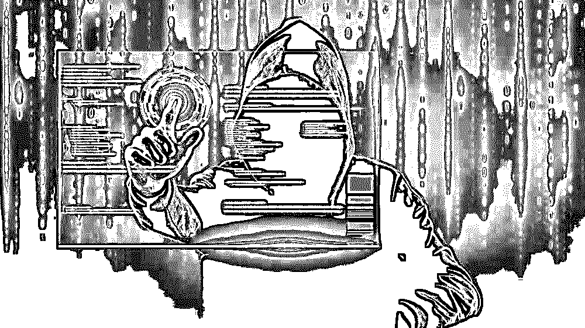
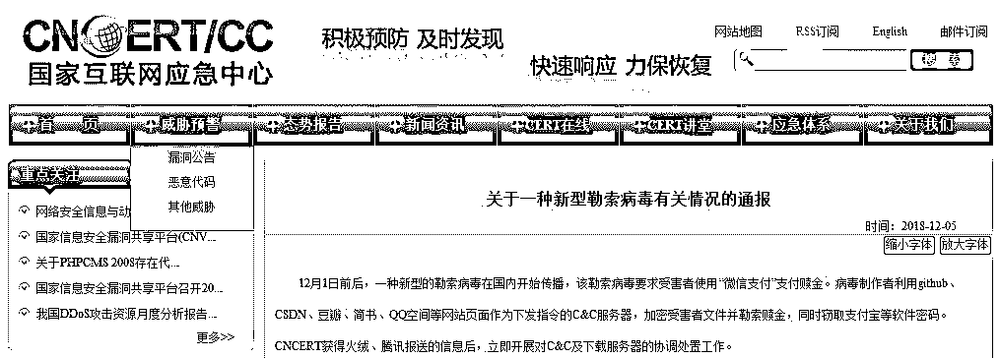
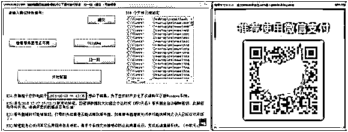
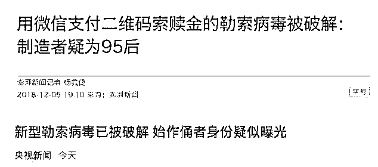
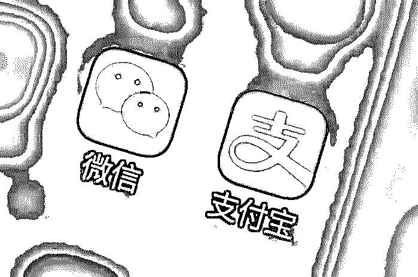
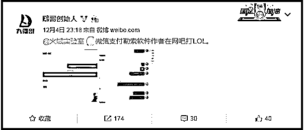
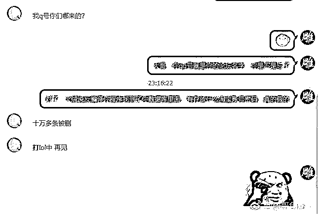
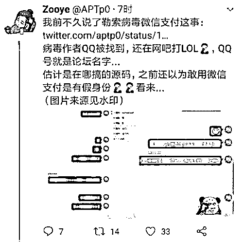
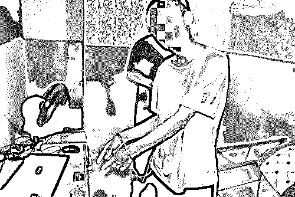
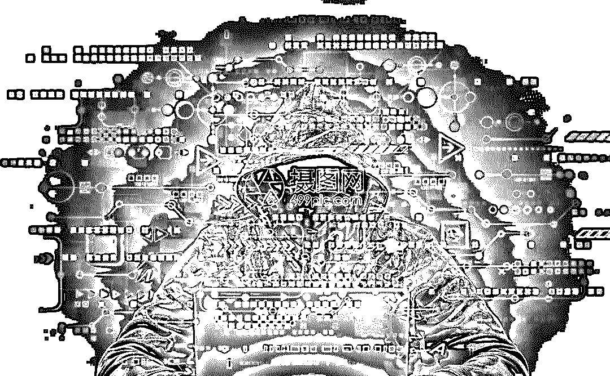

# "微信支付"勒索病毒覆灭记：感染十万主机，黑客竟是 95 后！

> 原文：[`mp.weixin.qq.com/s?__biz=MzIyMDYwMTk0Mw==&mid=2247494108&idx=1&sn=376f010bdf8b1ba33b28d8743d1e7840&chksm=97cb22e4a0bcabf2566197b30bcd01923c46365dd9f5a277e36548802c797414a578537b89b4&scene=27#wechat_redirect`](http://mp.weixin.qq.com/s?__biz=MzIyMDYwMTk0Mw==&mid=2247494108&idx=1&sn=376f010bdf8b1ba33b28d8743d1e7840&chksm=97cb22e4a0bcabf2566197b30bcd01923c46365dd9f5a277e36548802c797414a578537b89b4&scene=27#wechat_redirect)

**点击上方蓝色字体“灰产圈”关注并置顶本公众号**

导语

近日，多家网络安全机构确认，国内出现了要求微信支付赎金的勒索病毒。该病毒入侵用户电脑后会加密用户文件，要求受害者扫描弹出的微信二维码支付赎金，获得解密钥匙。

据国家互联网应急中心发布的通报，12 月 1 日前后，一种新型的勒索病毒在国内开始传播，该勒索病毒要求受害者使用“微信支付”支付赎金。

病毒制作者利用 github、CSDN、豆瓣、简书、QQ 空间等网站页面作为下发指令的 C&C 服务器，加密受害者文件并勒索赎金，同时窃取支付宝等软件密码。

解密

用户电脑被勒索病毒感染后，要求微信扫码支付赎金的界面

火绒团队通过逆向分析病毒的下发指令，成功解密出其中 2 台病毒服务器，发现大量被病毒窃取的用户个人信息。仅 1 台用于存储数据的病毒服务器，就存放了窃取来的淘宝、支付宝等账户密码两万余条。此外，该病毒还将受害电脑所有安装的软件进行统计和信息回传。

图：被盗取的登录信息数据统计信息

到了这一步，相信不少人以为，上面的微信支付二维码一定是个幌子，当自己扫码之后会被植入恶意程序.......其实不然，这是一个真实有效的二维码。

**转账金额固定**：110 元

**腾讯回应**：微信已第一时间对所涉勒索病毒作者账户进行封禁、收款二维码予以紧急冻结。微信方面也提醒到，该勒索病毒可能通过任何形式的支付方式索要转账，若遭遇勒索，不要付款，及时报警。同时，腾讯电脑管家提供解密工具和人工服务，协助用户处理相关情况。

**支付宝安全中心表示：**已第一时间跟进，目前没有一例支付宝账户受到影响。针对此类风险，支付宝风控系统早有针对性的防护，包括二次校验短信校验码、人脸识别等。即便密码泄露，也能最大程度的确保账户安全。

调查

该病毒采用“供应链感染”方式进行传播，通过论坛传播植入病毒的“易语言”编程软件，进而植入各开发者开发的软件，传播勒索病毒；同时，该病毒还窃取用户的账号密码，包括淘宝、天猫、支付宝、QQ 等。

据一些网络安全公司评估，截至 12 月 4 日晚，该病毒至少感染了 10 万台电脑，不光锁死电脑文件，还窃取了数万条淘宝、支付宝等平台的用户密码等信息。其中，淘宝、天猫、支付宝的账户密码数据最多。

**始作俑者疑似是一名 95 后**

人们很好奇，幕后的始作俑者到底是谁？

12 月 5 日，澎湃新闻从一家网络安全公司了解到：

> 经过进一步分析，发现所有相关信息都指向同一主体——姓名（罗**）、手机（1********45）、QQ（1*****86）。此人是一位 95 后黑客。当然，要确定病毒的制造者还需要警方等部门权威认定。

目前，上述个人信息和被窃取的受害用户支付宝密码等信息，都已被交给警方。

转机

事情到这里，好像已经完结，但是。

**12 月 4 日 23:18**** ，微博@雕哥创始人发了一条微博，截图里显示，已经联系上这名 95 后“黑客”，当时，这名“黑客”在玩儿 LOL，莫名被加了 QQ 之后还在问：从哪儿加的。。。。。**

估计是在哪儿搞的源码。。。。

抓捕

据广东省东莞市公安局通报，根据上级公安机关“净网安网 2018”专项行动有关部署，近日，东莞网警在省公安厅网警总队的统筹指挥，以及腾讯和 360 公司的大力协助下，24 小时内火速侦破“12.05”特大新型勒索病毒破坏计算机信息系统案，抓获病毒研发制作者１名，缴获木马程序和作案工具一批。

该犯罪嫌疑人涉嫌利用自制病毒木马入侵用户计算机，非法获取淘宝、支付宝、百度网盘、邮箱等各类用户账号、密码数据约 5 万余条，全网已有超过 10 万台计算机被感染。

**案件通报：**

12 月 4 日 18 时许，东莞网警支队接省公安厅网警总队通报称，腾讯公司举报，东莞一名男子向多个计算机信息系统传播病毒木马，锁定目标系统文件，利用微信支付勒索钱财后解锁。

获悉省厅网警总队下发线索后，东莞网警快速反应，立即启动网络安全事件应急处置预案，调集骨干警力，对涉案线索开展排查，于 12 月 4 日 22 时准确摸排出嫌疑人真实身份为罗某某（男，22 岁，广东茂名人），其主要在我市东坑镇活动。12 月 5 日凌晨，东莞网警联合东坑分局连夜展开抓捕行动，经十小时连续奋战，于 15 时将嫌疑人罗某某抓获。

经审讯，嫌疑人罗某某对其制作新型勒索病毒破坏计算机信息系统，利用微信支付勒索钱财的事实供认不讳。据其供述，2018 年 6 月，罗某某自主研发出病毒“cheat”，用于盗取他人支付宝的账号密码，进而以转账方式盗取资金。

同时制作内含“cheat”木马病毒代码的某开发软件模块，在互联网上发布，任何通过该开发软件编写的应用软件均包含木马病毒代码，代码在后台自动运行，记录用户淘宝、支付宝等账号密码，以及键盘操作，上传至服务器。此外，嫌疑人通过执行命令对感染病毒的计算机除系统文件、执行类文件以外的所有文件进行加密，随后弹出包含解密字样和预置微信收款二维码的勒索界面，解密程序标题显示“你的电脑已被加密，请执行以下操作，扫一扫二维码，你需要支付 110 进行解密”。

目前，嫌疑人罗某某已被警方依法刑事拘留，案件正在进一步审理中。

结尾

国家互联网应急中心提醒广大用户及时采取如下措施进行防范：

1、安装并及时更新杀毒软件，目前市场主流反病毒软件都已支持针对该勒索病毒的防护与查杀。

2、不要轻易打开来源不明的软件，该勒索病毒通过易语言编写的程序传播，减少使用来源不明的软件可有效预防。

3、如已经感染勒索病毒，可使用相关解密工具尝试解密。目前，许多公司已经针对该勒索病毒开发了解密工具，包括火绒 Bcrypt 专用解密工具、腾讯电脑管家“文档守护者”、360 安全卫士“360 解密大师”等。

> 附：解密工具

> https://www.huorong.cn/info/1543706624172.html（火绒 Bcrypt 专用解密工具）
> 
> https://guanjia.qq.com/news/n3/2444.html（腾讯电脑管家“文档守护者”）
> 
> http://www.360.cn/n/10496.html（360 安全卫士“360 解密大师”)

4、已感染勒索病毒的用户，在清除病毒后，尽快修改淘宝、天猫、支付宝、QQ 等敏感平台的密码。

5、定期在不同的存储介质上备份计算机中的重要文件。

*部分摘自火绒安全实验室《“微信支付”勒索病毒制造者被锁定 传播、危害和疫情终极解密》

 网址：https://www.huorong.cn/info/1543934825174.html

●[深度报告|勒索软件“假面”系列——免流软件](http://mp.weixin.qq.com/s?__biz=MzIyMDYwMTk0Mw==&mid=2247490697&idx=2&sn=6bddc140308ee734d54e6d726825302c&chksm=97c8d7b1a0bf5ea78da18dc4cb4867efe02424174d5ca59ccc78aad3f2a506a4ccde5568d2cc&scene=21#wechat_redirect)

●[深度|勒索软件黑产研究：制马人，传播者，受害者 ，环环相扣，年锁百万终端，勒索上亿元](http://mp.weixin.qq.com/s?__biz=MzIyMDYwMTk0Mw==&mid=2247489234&idx=1&sn=16e05c37a5b6548ae2fa0a91e50a6c11&chksm=97c8ddeaa0bf54fc1a4ca35155572972f38d3f2f76230e2a2a2bc98779a57a358434114aec99&scene=21#wechat_redirect)

●[知名博主卢松松被人恶意举报 QQ 勒索-解密灰色产业链](http://mp.weixin.qq.com/s?__biz=MzIyMDYwMTk0Mw==&mid=2247487802&idx=1&sn=94e9790f1ac5b817792db35ae5ebf63b&chksm=97c8da02a0bf53147e5707ecc59b0b7bda7c13daf749a97919c3e223483ac7aeef9ae70b5894&scene=21#wechat_redirect)

●[探秘银行卡盗刷黑产："伪基站"群发，“木马”拦截，黑客“洗料”，“短信嗅探”，暗黑齐天，法力无边！](http://mp.weixin.qq.com/s?__biz=MzIyMDYwMTk0Mw==&mid=2247493780&idx=1&sn=288da1b308bc55276fcb623493cab254&chksm=97cb23aca0bcaaba3196e9c88e663091e18d0c1d91e2cdc6ac48cc858b2c4e48cf9f809b09a1&scene=21#wechat_redirect)

   

**点击加入 ****灰产圈 | 高端社群**