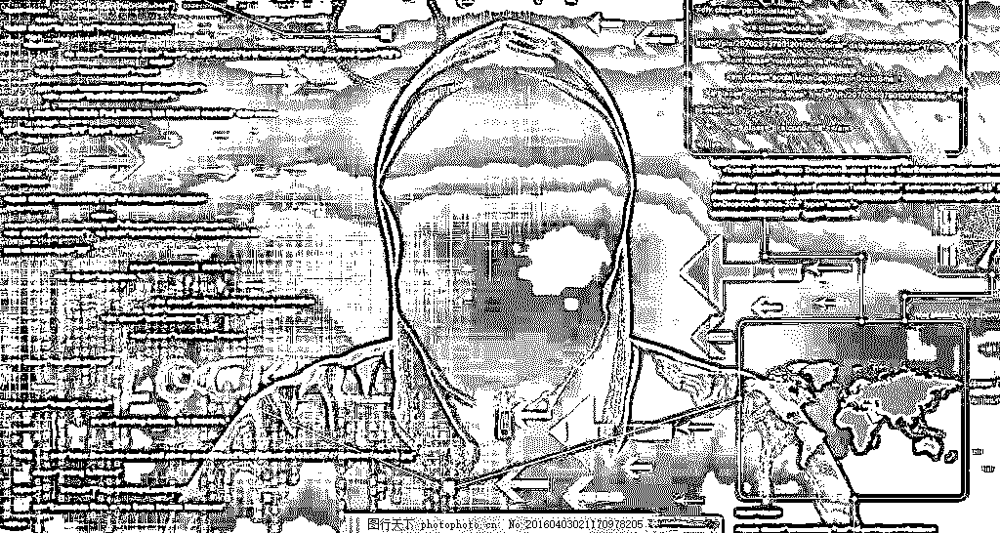
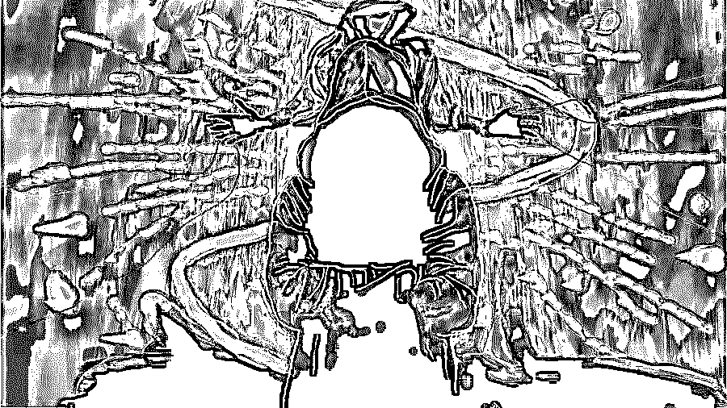

# 深度 | "恶意注册账号"黑产全揭秘：刷粉，炒信，薅羊毛，卖茶，卖蜜，还荐股！

> 原文：[`mp.weixin.qq.com/s?__biz=MzIyMDYwMTk0Mw==&mid=2247494095&idx=1&sn=10e63105fd74b13e3755de7f89318bf9&chksm=97cb22f7a0bcabe1ab4e56c886ff1872b24a889e75a6e5afe9ece48d6c471fe217bf4e3a2c33&scene=27#wechat_redirect`](http://mp.weixin.qq.com/s?__biz=MzIyMDYwMTk0Mw==&mid=2247494095&idx=1&sn=10e63105fd74b13e3755de7f89318bf9&chksm=97cb22f7a0bcabe1ab4e56c886ff1872b24a889e75a6e5afe9ece48d6c471fe217bf4e3a2c33&scene=27#wechat_redirect)

**点击上方蓝色字体“灰产圈”关注并置顶本公众号**

导语

     “美女卖茶叶”骗局、微信荐股骗局、刷单刷粉炒信、电商平台“薅羊毛”……在网络实名制管理方式下,这些在“网络黑色产业”中实施骗局和违法行为的账号却全是“假账号”“空号”,这些“恶意注册账号”已经成为互联网毒瘤。

         同时，微信的诞生给广大用户提供方便快捷的互联网体验，黑产行业，如黄赌骗、群控、薅羊毛、侵犯知识产权等违法行为和微商恶意营销、公众号刷阅读量等灰产行为也盯上了这个领域，给互联网生态安全、社会秩序和广大互联网群众的财产安全带来巨大威胁。

       12 月 1 日，由最高人民检察院公诉厅、公安部网络安全保卫局指导，中国犯罪学学会、中国人民大学刑事法律科学研究中心、腾讯公司安全管理部主办的互联网账号恶意注册黑色产业治理论坛在京举行。

论坛上，腾讯公司发布了首份定向剖析黑产源头的《互联网帐号恶意注册及养号行业报告》，并联合政府、行业等社会各界共同发起了互联网黑色产业共治倡议，号召各方积极联动，共同打击对抗黑色产业链。

　　　　互联网账号恶意注册黑色产业治理论坛

　黑产之源：“恶意注册账号”

　或许大多数人对于网络黑产还没有清晰的概念，“薅羊毛”却早已成为互联网上人尽皆知的调侃。可当“恶意注册养号工作室”动辄申请数十万个微信账号，利用群控技术、微信外挂等上游犯罪，为黄毒骗等传统犯罪向线上衍生提供作恶帐号和技术支撑时，恐怕已非“玩票”那么简单。

什么是“恶意注册账号”?它到底跟我们的生活有什么关系?

     请看视频专题讲解《三分钟看懂恶意注册黑色产业链》

[`v.qq.com/iframe/preview.html?width=500&height=375&auto=0&vid=x0807e00b59`](https://v.qq.com/iframe/preview.html?width=500&height=375&auto=0&vid=x0807e00b59)

灰产圈简述：

恶意注册是指不以正常使用为目的,违反国家规定和平台注册规则,利用多种途径取得的手机卡号等作为注册资料,使用虚假的或非法取得的身份信息,突破互联网安全防护措施,以手动方式或通过程序、工具自动进行,批量创设网络账号的行为。广义的恶意注册还包括注册之后的养号。

目前，恶意注册已经形成了上下游分工明确的完整产业链，黑产人员只需要通过卡商和接码平台即可获得手机号和验证码，而接码平台则利用猫池、群控等工具来接受来自互联网平台下发的短信或语音验证码，突破互联网平台的安全防护措施。通过改机工具伪造设备硬件信息，使用动态 IP 拨号工具等伪造网络环境，并最终利用自动化程序工具，完成整个注册流程。

　　而这些恶意注册的账号就被“网络黑产”人员拿去从事各种网络诈骗、色情诈骗、刷单刷粉炒信、电商平台“薅羊毛”等违法犯罪活动,谋取巨额不正当利益。          

      当然，面对黑产的疯狂，互联网公司也拿起防御武器，几乎所有黑产存在的领域都在上演一场场猫鼠游戏。大数据、活体识别、人像比对、设备指纹、人脸识别等新技术也开始应用于“反黑产”的运动中。

黑产分工：各司其职，有条不紊

**“恶意注册+群控+外挂”是如何运作的？**

今年 3 月,腾讯安全联合团队支持浙江、湖南警方成功打掉国内首个集微信恶意注册、群控外挂、赌博网络平台于一身的黑产团伙,一举抓获公司负责人、技术、运营者在内的 52 名犯罪嫌疑人,冻结资金 8000 多万元,实现了全链条精确打击。

警方在调查中挖掘出,这个“恶意注册+群控+外挂”黑产链条是这样运作的:

**居于这条黑灰产业链上游的,是所谓的“卡商”。**

数量众多的卡商为接码平台提供源源不断的手机卡,用以恶意注册,而卡商们的手机卡来源,有运营商内鬼,购买企业营业执照营业执照使用企业身份开卡,以及收购个人手机卡的方式。居于上游的开发者,还会批量注册恶意微信号和开发群控技术,恶意账号、养号,对外销售,还会先通过篡改微信官方客户端,增加远程调用接口,再开发独立 APK 和规则代码,实现后台服务器的远程控制。

**产业链中游**

借助上游提供的群控软件,开发出“云伯爵”、“开一局”等微信群赌博平台,并组建运营负责专业推广,不断发展下级代理和线下组织赌博人员,引导其购买恶意微信号参与赌博,从中收取平台使用费。

**而网络欺诈、色情犯罪、网络攻击,则是下游犯罪分子的主要“变现”方式。**

像色情变现,最直接的方式就是伪装成美女,利用微信群控的批量加好友功能不断地添加好友,并且用各种借口和你讨要红包。

比如说会给你提供色情上门服务,之后再骗你先交保证金、打车费等费用,最后当然是连人影你都没见到。其他常见的还有朋友圈频刷广告,即为了增加自己产品的曝光度,他们利用微信群控里面的批量发布朋友圈功能,不停地刷屏发广告,甚至还有一些发送假红包链接诱骗点击,除了欺诈骗钱还存在盗取账号的风险。

另外一种近年新兴的网络欺诈行为就是刷数据量了。之前网上曝光的一些自媒体公众号刷阅读量的新闻,就是通过微信群控非法操作。连点赞也是虚假的数据。据调查,网上最便宜的阅读量刷单价格是 12 元 1000 个,也就是说,要刷出“10 万+”仅需要 1200 元,可见这个产业链的黑暗和虚假。

互联网违法犯罪的主要源头,是使用虚假个人信息恶意注册的账号。但就虚假账号恶意注册作为黑灰产链上游环节,给信息安全、网络安全造成严重威胁,如何定罪处刑、适用证据等,正成为当前刑事规制的重点及难点。 

“死水行动”：清剿恶意账号

　　在“互联网账号恶意注册黑色产业治理论坛”上,腾讯公司现场发布《互联网账号恶意注册黑色产业治理报告》

　　报告指出,恶意注册互联网账号和养号是网络黑灰产的源头之恶,目前已经形成了上下游分工明确的完整产业链,而这一行为危害电商、互联网金融、生活服务、内容平台、社交等多个场景,成为整个互联网行业共同的毒瘤。

　　对于“恶意注册”这种行为,除了技术对抗打击,法律应用和刑事打击也能起到震慑作用。但是报告同时指出,现行法律还没有针对恶意注册行为给予直接规定,一些黑产人员也因此规避了相应的刑事责任。

       为维护互联网生态安全，重点打击恶意注册和群控等上游犯罪，实现源头治理，来自微信、京东、滴滴出行的安全团队分别在会上分享与黑产对抗的思路与经验。

         其中，微信安全中心发起的“死水行动”微信恶意号清剿项目成绩显著。

2018 年初，微信上线了注册辅助验证策略。

当检测到用户在进行异常注册时，例如批量注册、外挂注册时，会要求用户通过好友辅助来完成此次注册。

此举通过消耗黑灰产团伙的注册手机卡等资源，有效增加了恶意注册及养号成本。在持续高压打击下，微信帐号注册量从 2017 年尾开始明显下降;另外，微信中的存量恶意号总量也有明显下降。

除了技术对抗，微信安全团队也借助司法的力量，共同遏制平台上的黑产行为。

近期，微信安全联合团队协助警方成功催毁“XXTouch”恶意注册工具团伙。最终完成此案对下游微信恶意注册养号人员——中游脚本开发人员——上游软件开发人员的全链条打击，同时也是国内首次对微信恶意注册黑产领域的源头治理。

擒贼擒王：打击大号商

  微信安全中心的帐号安全专家发现，随着互联网公司打击恶意注册的技术和策略逐渐完善，帐号的注册门槛提高，批量注册开始向大号商集中。对源头大号商的打击和治理，将对下游犯罪产生直接的影响。

       黑产人员帐号在大量消耗，目前一些黑产团伙研发出所谓任务平台，将其包装为兼职、任务分派等多种有偿形式，利诱普通用户参与，并衍生出辅助注册、辅助解封、出租、购买正常用户微信号的产业链。这些微信帐号再投入到下游黑产链条中，实施色情诈骗、刷量、薅羊毛，等违法行为，谋取巨额不正当利益。这种行为的社会危害性必须引起各方的足够关注。

         微信的恶意注册和其他互联网产品平台面临同样的形势，除了平台自我治理外，也需要各界共同关注、联合治理。我们在此呼吁：希望从用户、立法等层面形成明确机制，更加有力针对打击恶意注册这种违法行为，有效遏制围绕恶意注册的黑灰产发展势头，并最终彻底地解决这个互联网顽疾及诸多恶意产生源头。

**对于使用微信的普通用户：**

1)不要从事批量恶意注册微信帐号相关行业，否则将有可能面临法律制裁的风险

2)不要购买、使用批量注册的微信帐号，微信安全团队将持续打击此类帐号

3)注意自身信息的保护，避免被恶意注册团伙所利用，不要使用非官方的客户端程序，避免被木马病毒等窃取信息

结尾

一名曾参与“社工网站”也就是专门从事各类账号注册买卖的网站工作人员 KK(化名)对灰产圈说:“我们购买了大量手机黑卡、身份信息,然后用软件批量注册,速度很快。买这些垃圾账号的人,有的用于刷粉、刷榜、刷单,甚至是刷佣金,也有人拿去诈骗。干我们这一行的,没几个人认为自己是违法的。” 

　　无论是用机器注册大量买家账号,还是骗取卖家资格认证,抑或虚假交易,其共同特点都不是以真实交易为目的。而网络虚假交易在法律上没有明确界定为违法,因而吸引了庞大的参与人群。业内人士估计,其从业人员达上百万。

   　灰产圈发现,淘宝、京东等电商平台还是腾讯、新浪、网易等社交、游戏平台,相关垃圾账号都有人在网上专门注册并倒卖。一个垃圾账号从几毛钱到几元钱不等,批量起售,数量惊人。

　　暴利驱动下,灰色产业链异常繁荣,成为全球共性问题。

      据国外媒体报道,Twitter 的发展带动了“僵尸粉”地下产业链的蓬勃发展。安全公司的研究报告显示,该产业链规模已经达到 4000 万美元至 3.6 亿美元。

　　这些灰色产业与黑色产业相互依附、交织,已发展为跨平台、跨行业的集团犯罪链条。

     手机黑卡、银行卡、身份信息非法买卖,看似灰色产业,如影随形的却是网络诈骗、盗窃、攻击等各类黑色产业。

    打击恶意注册产业链将会是一场持久战，相信最终正义终将战胜邪恶！

●[是谁捅了“马蜂窝”？2100 万"真实点评" ， 1800 万条抄袭，7000 个机器人刷量！](http://mp.weixin.qq.com/s?__biz=MzIyMDYwMTk0Mw==&mid=2247493625&idx=1&sn=e1a90c75f28f0a2d0d5227c381baf6a4&chksm=97cb2cc1a0bca5d7a0ac4e9c36c8378e0c759d4751e8b990503fc7e89936c885ebec6a943615&scene=21#wechat_redirect)

●[iPhone 用户账号集体沦陷：700 多人被盗刷 ，苹果公司 : 无法退款！](http://mp.weixin.qq.com/s?__biz=MzIyMDYwMTk0Mw==&mid=2247493554&idx=1&sn=c42e8e0d41303f4bbebcbd6f178500bc&chksm=97cb2c8aa0bca59c0175213906e817f7d97e0eb3232cad333422ea9dbf9683d82ee0c910e362&scene=21#wechat_redirect)

●[「双十一黑产狂欢日」黑客，羊毛党十万军团出动，干上一天，日入十万，够吃一年！](http://mp.weixin.qq.com/s?__biz=MzIyMDYwMTk0Mw==&mid=2247493904&idx=1&sn=9209dd9b23c169190d2a9ff771fe5116&chksm=97cb2228a0bcab3e2b9cdcd3fce48c3561900c27027d9068028f3bbb6d7ff7eae6d9bca546d1&scene=21#wechat_redirect)

●[女神也躲不开骗子，沈梦辰闲鱼被骗 3000 元，背后真相究竟是什么？](http://mp.weixin.qq.com/s?__biz=MzIyMDYwMTk0Mw==&mid=2247493965&idx=1&sn=b5ab7a719d3ec68adc6bb3b8d80b68b8&chksm=97cb2275a0bcab631ba7b88d45e3b3f93b31fd865ef35dca84ad23fba3035f720ce8047a116d&scene=21#wechat_redirect)

   

**点击加入 ****灰产圈 | 高端社群**