# DG 撤回道歉宣布与中国决裂：感谢这些中国人，给了我们继续辱华的勇气！

> 原文：[`mp.weixin.qq.com/s?__biz=MzIyMDYwMTk0Mw==&mid=2247494086&idx=1&sn=1787c5444dae5fb8c25d20dfef70129e&chksm=97cb22fea0bcabe810c919cde6339d8ac9b8598177e76bac5836c53f3adfa4bcfae88e69633a&scene=27#wechat_redirect`](http://mp.weixin.qq.com/s?__biz=MzIyMDYwMTk0Mw==&mid=2247494086&idx=1&sn=1787c5444dae5fb8c25d20dfef70129e&chksm=97cb22fea0bcabe810c919cde6339d8ac9b8598177e76bac5836c53f3adfa4bcfae88e69633a&scene=27#wechat_redirect)

**点击上方蓝色字体“灰产圈”关注并置顶本公众号**

**来源：笔稿**

文：笔稿君

引发全民抵制的 DG 辱华事件在 DG 官方一段道歉视频中本已暂告段落。

DG 品牌也算就此凉透，在一片骂声中一夜坍塌。

但谁成想，在这一片狼藉中，狗急跳墙后的叫嚣之声，再次传来......

****01****

**先是 DG 的创始人被爆出扬言要与中国彻底决裂；**

**而后，DG 在 Ins 上撤回并删除了所发布的道歉视频！**

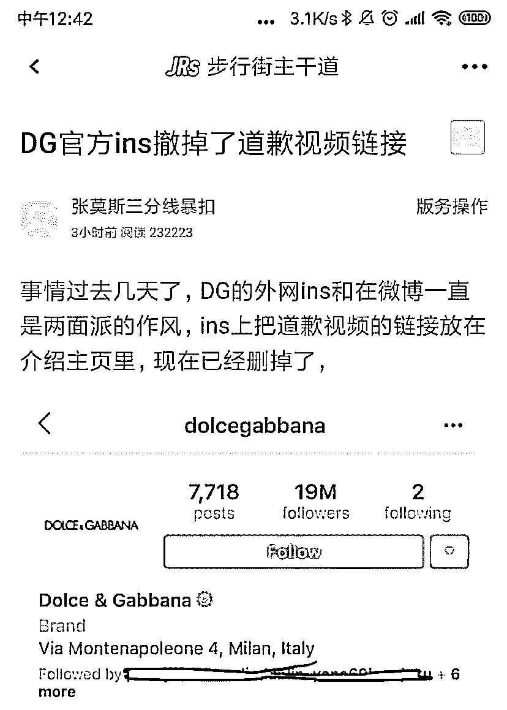

## **何来勇气？**

## 也许意大利第二大报在相关报道中对中国人的公然嘲讽可以给我们答案：**“放心，他们抵制不了多久的。”**

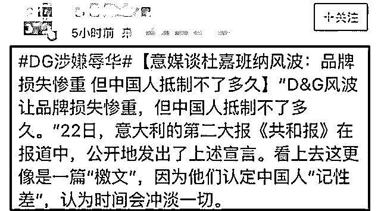

中国人，真的记性差吗？

我想反驳，我想怒斥，但看了下面的报道，我竟，无言以对......

据钱江晚报报道：

在辱华风波后，杭州大厦的 DG 品牌店有一顾客向导购要求，希望能退回预存款。

谁知该店的中国店员却回应：**“放心啦，这两天生意还好，抵制只是暂时的，这只是临时的风波而已，过两天就好了。”**

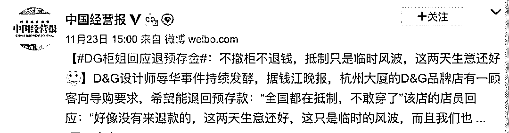

**“感谢你们，就是你们中国人，给了我们辱华的勇气。”**

****02****

**你还记得萨德事件吗？**

2017 年，韩国商业巨头乐天同意就针对中国的“萨德”反导系统部署用地与韩国军方签署协议。

此举引发了中国人的强烈不满，因而自发了抵制乐天，抵制韩货的行为。

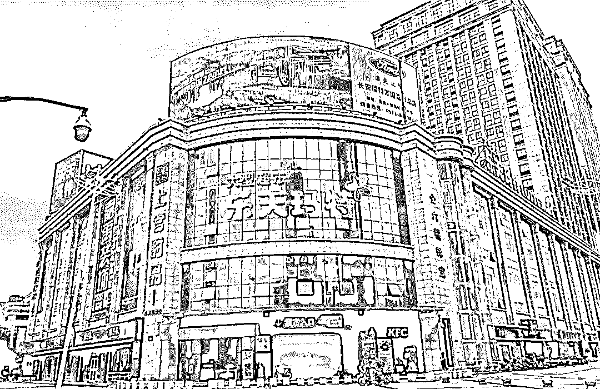

在那段时间里，人们纷纷响应号召，拒绝去乐天超市购物、拒绝购买乐天集团的产品、抵制韩国产品、拒绝赴韩旅游。

对此，乐天集团会长说：**“不用担心，他们非常市侩，无骨气无血性，我们降价他们就买。根据以往的经验，他们最多抵制一段时间，像刮阵风。”**

如今，一语中的，当初觉得这话在讽刺我们，现在看来，更加讽刺。

正如韩国人所愿，在金钱利益的驱使下，韩国又像一个香饽饽那样在国人心里变得好看起来，大批中国游客和代购再次将韩国围得水泄不通。

单今年 7 月一个月，赴韩旅游的中国人就已经达到了 410337 人，比去年增加了 50%。

每天凌晨，天还没亮的时候，就有大约 1700 名左右的中国人在乐天免税店前排起了长龙，将附近街区围得水泄不通，“盛世韩国”的画面自萨德风波后很快便又重现历史舞台。

韩媒对此在报道中表示：**中国人已忘记萨德。**

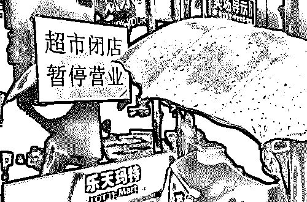

**你还记得日本 APA 吗？**

之前，一个美国女孩发现，在她居住的东京 APA 酒店客房中，放置了大量由该酒店集团 CEO 元谷外志雄所写的右翼书籍。

书里全盘否认南京大屠杀和韩国慰安妇的存在，并称“所谓日本犯下的罪行，是美国为投下原子弹而编造的谎言”，消息传回国内，立刻引发全民声讨和抵制。

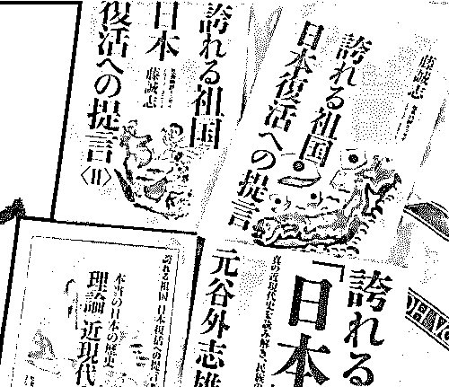

对此，日本 APA 酒店董事长不但拒绝撤掉相关书籍，并轻蔑地叫嚣道：**" 几个月后，中国人就会忘记发生了什么，只会记得名字。因此，说不定可以靠这个知名度，来弥补因这个事件造成的亏损。"**

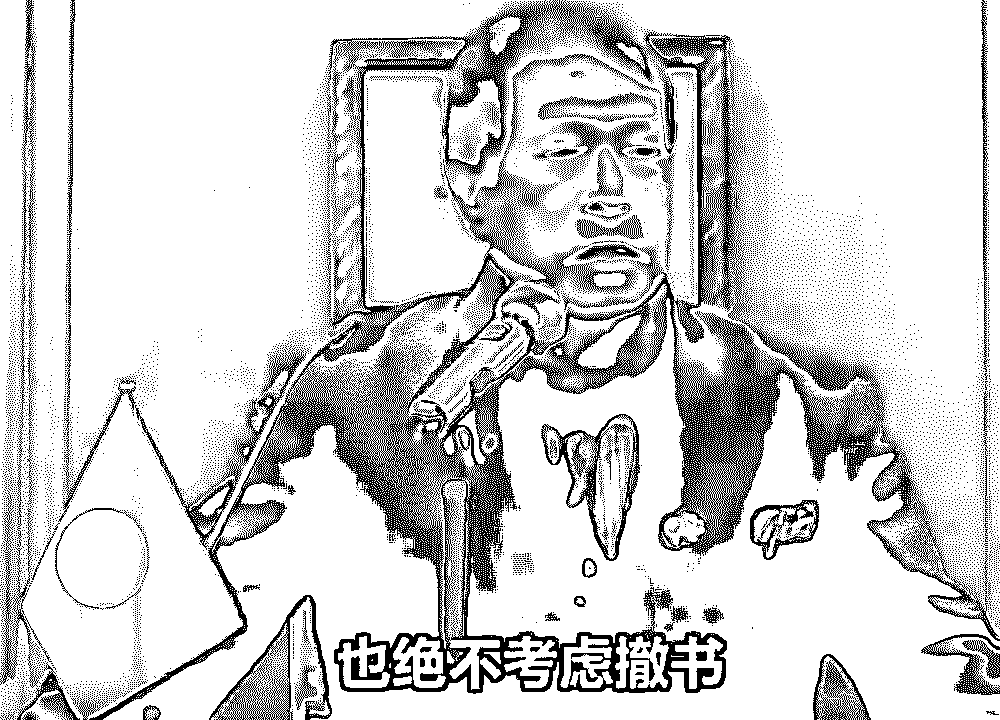

△ 日本 APA 酒店董事长

真的！几个月就忘了！ 

事件被爆出几个月后，原先号称要永久抵制并全部下架的订票网站就开始默默地加回来 APA 酒店的页面！各种预定也都回归正常......

有爱国人士不无失落地留言道：**“是的，中国人真的很快就忘记了。”**

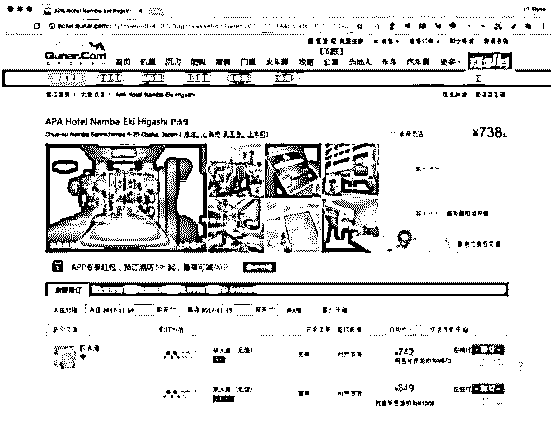

**你又是否还记得巴黎世家？**

之前，在法国巴黎春天的 Balenciaga 门店，发生了这样一件令人愤怒的针对中国人的事件： 

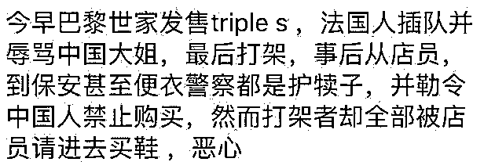

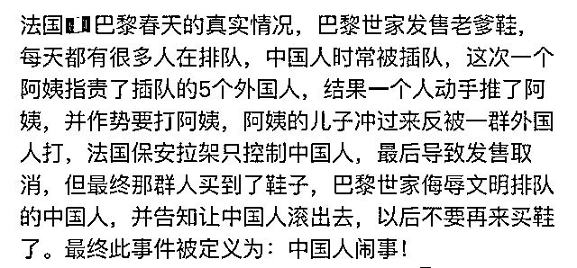

整个过程中，从巴黎世家的店员到巴黎春天的工作人员，无一例外都把矛头指向了中国人！

但是，插队的不是我们，先动手挑衅的也不是我们，但为什么最后被赶出门店，被禁止购买的反而是被殴打和辱骂的中国人？！

事情曝光后，依然是群情激昂，依然是全民抵制。

**但到如今，巴黎世家的鞋在国内依然被炒上了天价，而这家涉嫌辱华的门店门口，中国人依然排着长队......**

****03****

现在回想起来，有哪一次全民抵制到最后不是说说而已？

我们扪心自问，风波过后，谁又还会去关心这些呢？

诚然，国外品牌辱华事件层出不穷，一方面是我们的祖国取得了如此快速发展，洋鬼子对我们的印象却还在舞龙舞狮红灯笼鸦片馆的阶段，他们还活在亡了 100 多年的大清朝里——现在，一个卖衣服的都能这么想。

但另一方面，我们也要看到，正是我们当中极大一部分人的崇洋媚外，一味迷信国外品牌，认为自己国家的品牌就是廉价的，前脚谈爱国，后脚继续买，利用外国商品来提高自己的身份阶层，营造自己是贵族的幻像，才给了这些外国品牌辱华的勇气。

很多中国人，实在太过市侩和崇洋，无骨气无血性，国外品牌一降价他们就买。他们最多抵制一段时间，像刮阵风，所有人都逃不过真香定律。

对于他们，我想说：

**中国人，我辈当自强，请修理好自己的记性，挺直你的腰杆。**

**等哪一天，谁再穿这个 DG 品牌会被大众认为是"自愿当屎的中国人"，这才是真正的抵制。**

**等哪一天，中国人不再陷入自我否定的怪圈了，不再看不起国产品牌，那才是真正自强。**

●[能原谅吗？D&G 创始人道歉了！特意用中文说“对不起 ”](http://mp.weixin.qq.com/s?__biz=MzIyMDYwMTk0Mw==&mid=2247493987&idx=3&sn=9215de8162bc3b3ff5498f52ee344bf3&chksm=97cb225ba0bcab4df0635ca5b085429b0e8b806fbce05cf7ed3a606287b737d10d1c40c2d92b&scene=21#wechat_redirect)

●[DG 杜嘉班纳设计师讲话涉嫌辱华，之后澄清“我的 Ins 账号被盗了”？](http://mp.weixin.qq.com/s?__biz=MzIyMDYwMTk0Mw==&mid=2247493973&idx=1&sn=d9f0b56bd38821f358de2d4053bf1d0b&chksm=97cb226da0bcab7bf71fe1c187b479e18da7ffaf9673972598aeb6d36a1a3ef48cfbaa6447c4&scene=21#wechat_redirect)

●[彪悍的中国大妈写进了《华尔街日报》，但是这次她们可能要折戟区块链......](http://mp.weixin.qq.com/s?__biz=MzIyMDYwMTk0Mw==&mid=2247493563&idx=2&sn=8ab9b8301792731da31b7afc76767097&chksm=97cb2c83a0bca59571510f1aeee2d93b413dd361c693be4ec5a79020c7cc5e2070458c683127&scene=21#wechat_redirect)

●[全中国最堕落的地方，这里聚集了一群「三和大神」：日结一天的工资，阔以玩三天 ！](http://mp.weixin.qq.com/s?__biz=MzIyMDYwMTk0Mw==&mid=2247493563&idx=1&sn=64a31f6c1e65df54ccfdd5faf83c77ec&chksm=97cb2c83a0bca595407f4d449d28064c1453ba9b6e0da5b94d0ace6481c2f992202eb5d461c8&scene=21#wechat_redirect)

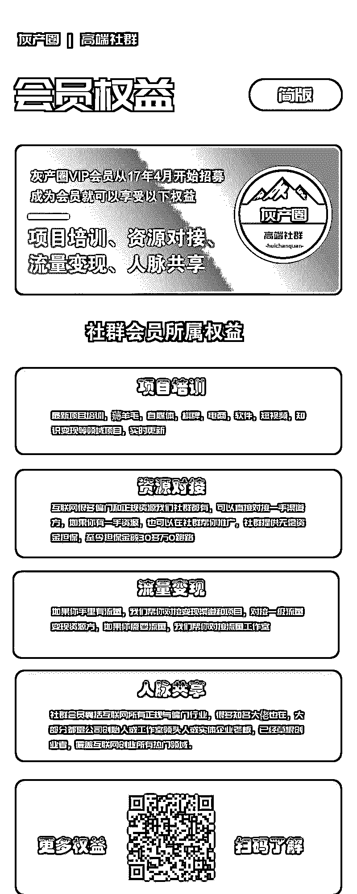   

**点击加入 ****灰产圈 | 高端社群**