# 深度 | 继“卖茶女”后最火女团“蜂蜜霞”：那个叫杨霞的女人，你在全国火了 !

> 原文：[`mp.weixin.qq.com/s?__biz=MzIyMDYwMTk0Mw==&mid=2247494073&idx=1&sn=ce739ce52401637f97303fc931420fe9&chksm=97cb2281a0bcab9704b0427156dc6a46808e6c5c354fcd2eea2a3c42f7a0643e63f1702f6437&scene=27#wechat_redirect`](http://mp.weixin.qq.com/s?__biz=MzIyMDYwMTk0Mw==&mid=2247494073&idx=1&sn=ce739ce52401637f97303fc931420fe9&chksm=97cb2281a0bcab9704b0427156dc6a46808e6c5c354fcd2eea2a3c42f7a0643e63f1702f6437&scene=27#wechat_redirect)

**点击上方蓝色字体“灰产圈”关注并置顶本公众号**

导语

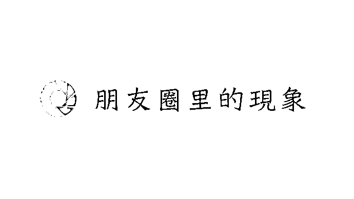

最近几个月，一个名叫“杨霞”的女人火遍朋友圈。

不少地方资讯类自媒体都转发了一篇介绍她的文章——《那个叫“杨霞”的女人，你在某某地方火了!》。

文中称，杨霞从小生活在大山里，后带着女儿在大城市打拼，有了一番事业后，有感于市场上所售蜂蜜质量不佳，决定回乡卖土蜂蜜，“找回儿时纯真的味道。”

不久，很多网友说从“杨霞”那里买的蜂蜜质量不行，“杨霞”其人的真实身份也被打上了一个大大的问号。

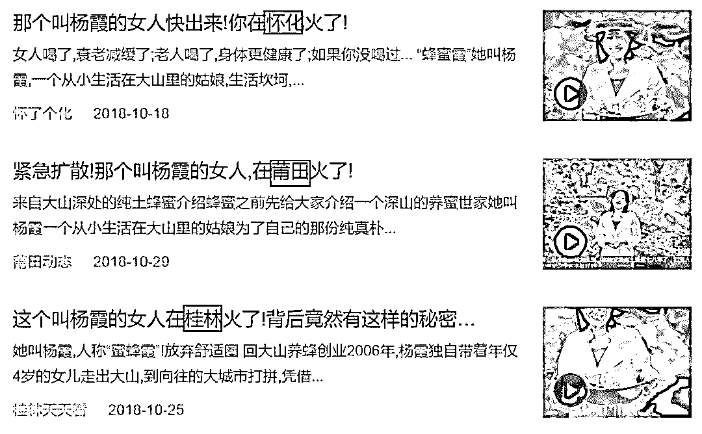

**部分公众号文章截图**

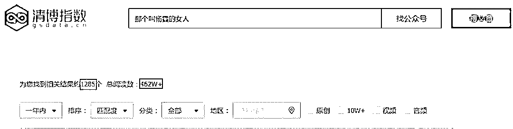

**根据清博指数显示，以“那个叫杨霞的女人”为标题的文章一年累计 1285 篇，总阅读量：462W＋**

神秘女团“杨霞”火遍全国

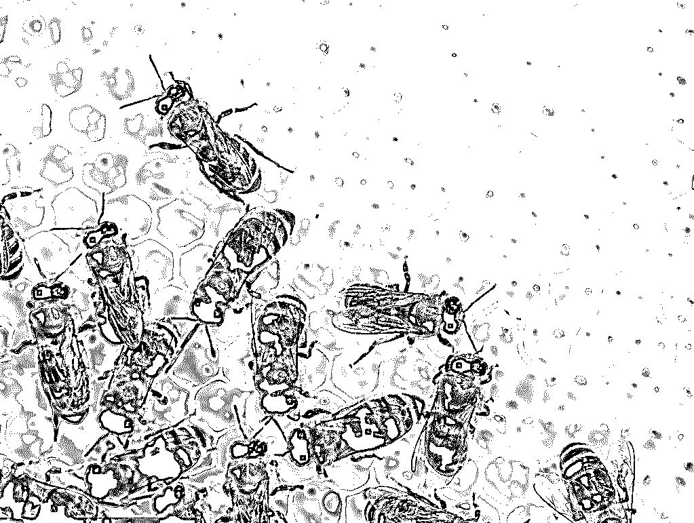

今年上半年开始，“杨霞”刷屏朋友圈。连云港、东莞、马鞍山、湘潭、哈尔滨……这个女人先后“走红”全国大部分城市！

为“杨霞”发声的，除了地方资讯自媒体账号，还有不少垂直细分领域的营销号，甚至还有一些地方媒体的微信公众号也在为她背书。

**“杨霞”的神秘背景：**

“杨霞”自幼生长在大山里，2006 年因婚姻变故携年仅 4 岁的女儿外出打工，不久凭借自己不服输的拼劲儿在大城市收获了自己的事业。

但在功成名就的同时，“杨霞”发现，身边人购买的蜂蜜大多是白糖蜜或者是熬制过的蜂蜜，其中的蜂蜜成分少得可怜。

“杨霞”为此感到十分寒心，并因此决定回到位于陕西宝鸡的深山养蜂，“让更多人吃到真的土蜂蜜。”

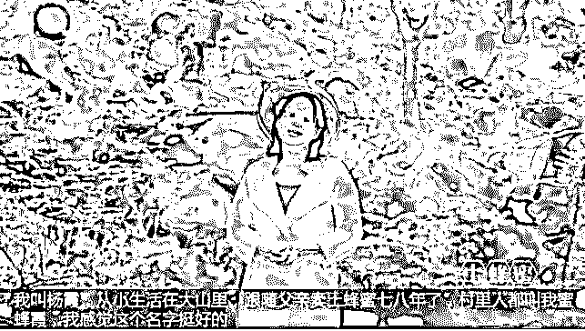

“杨霞”还专门拍摄了一段视频，讲述自己养蜂的过程。

下面就是所有文章都标配的关于“杨霞”的视频，大家可以播放感受下: 

[`v.qq.com/iframe/preview.html?width=500&height=375&auto=0&vid=m0668cj0ilg`](https://v.qq.com/iframe/preview.html?width=500&height=375&auto=0&vid=m0668cj0ilg)

她说自己卖蜂蜜已经 9 年，村里人都叫自己“蜜蜂霞”，生产的蜂蜜完全按照祖辈方法生产，营养价值会比普通蜂蜜高十几倍。

在这些文案结尾，无一例外会展现一个二维码，引导用户添加“蜜蜂霞”——杨霞的个人微信号进行咨询。与普通二维码不同，这些文章中提供的二维码均为动态二维码，不同二维码所对应用户名称不同，头像均为视频中“杨霞”的照片。

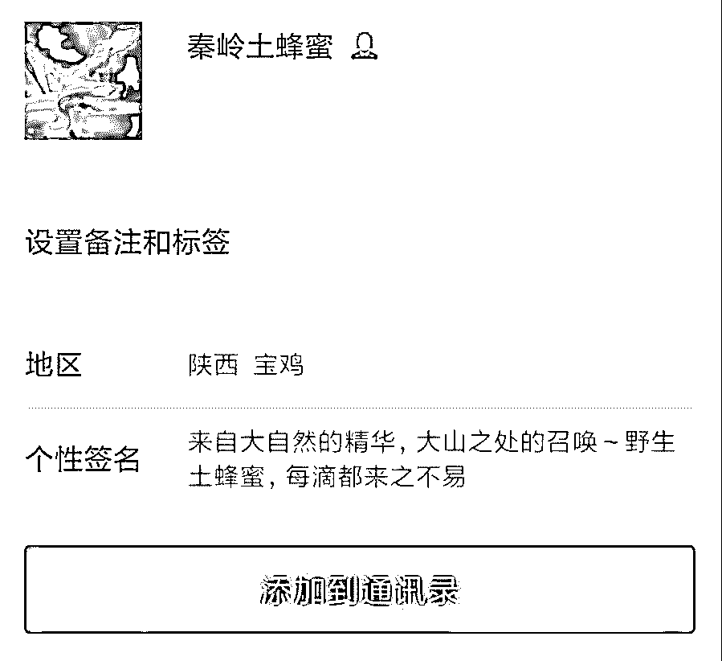

**如上图所示“杨霞”基本一样的昵称和签名**

“蜂蜜霞”的假货生意

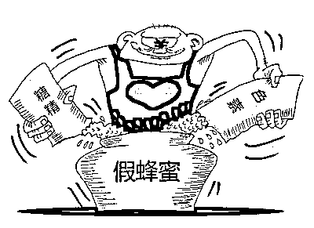

为了刨根问底，我们随便添加了一位“蜜蜂霞”的微信，单刀直入，咨询了一个极其简单的问题：

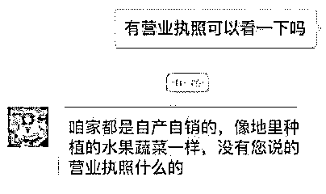

“杨霞”回复：无营业执照。也就是说，“蜜蜂霞”所兜售的蜂蜜，其实是正儿八经的“三无产品”。

当我进一步索要检测报告时，对方似是早有准备，很爽快就发来几页：

在检测报告第三页中，结果只有“增稠剂”一项，而“果糖、葡萄糖、蔗糖、锌”这种蜂蜜最基本的检测项，则完全没有展示。遭到我进一步追问时，对方只回答“可以放心食用”。

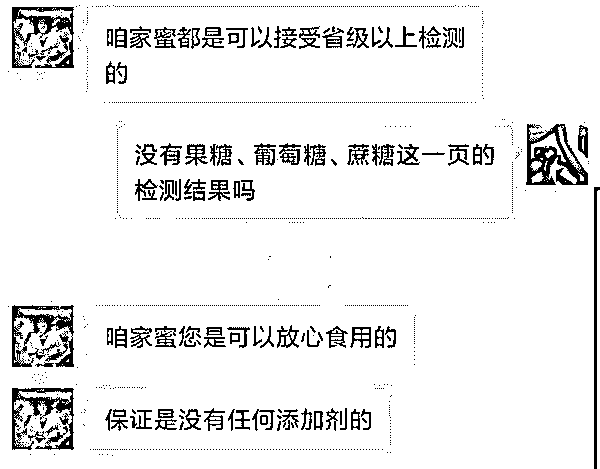

正常蜂蜜中，果糖含量至少应超过 60%，蔗糖含量不得超过 5%，否则基本可以确定是勾兑的假蜂蜜。老铁，你简简单单一句可以放心食用，让我很慌啊

再来对比一下正常蜂蜜的检测报告，心中基本就有数了：

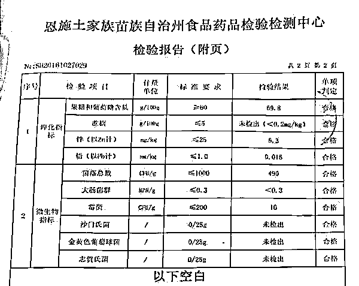

而后更让我大跌眼镜的，是检测报告里显示的委托单位——“蜜蜂霞”。

根据“蜜蜂霞”这条线索，我追踪到一家名为“郑州世外蜜源电子商务有限公司”的企业注册过“蜜蜂霞”这个商标。不仅如此，这家公司还注册了另一个商标“蜂蜜霞”，是不是有点绕嘴？emmmm，可能是要垄断杨霞的节奏吧……

这表明，消费者通过“杨霞”微信购买到的土蜜蜂产品，很可能就是由这家公司销售的。

而据网上一些“杨霞土蜂蜜”购买者反映，他们收到的产品包裹，并不是由陕西宝鸡发货，而是从河南郑州寄过来的。

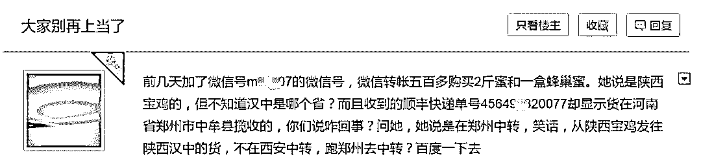

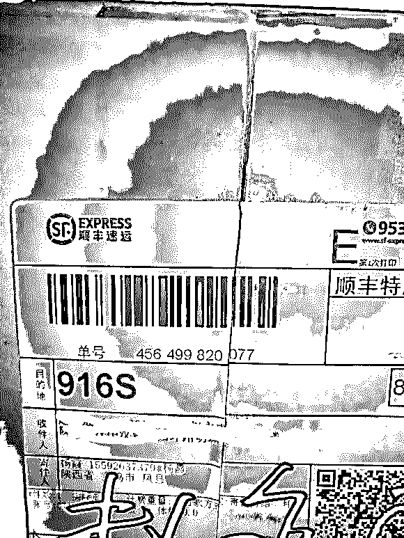

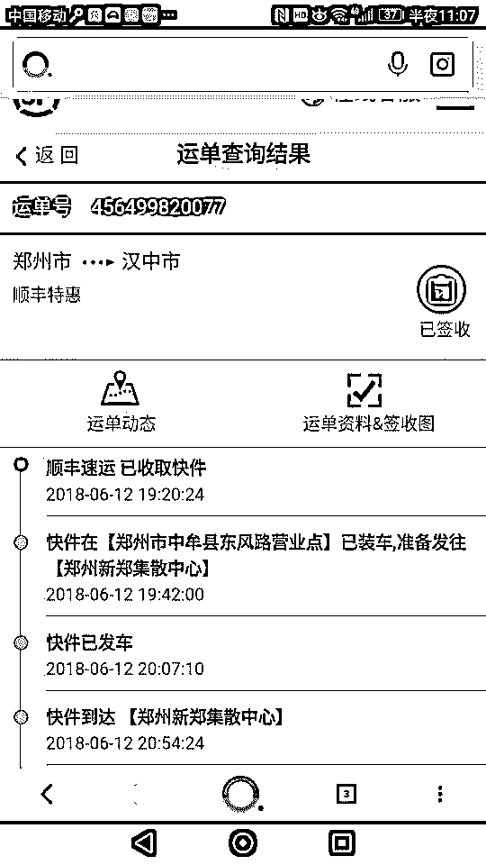

陕西宝鸡的土蜂蜜，为何会在郑州发出？

而快递面单上写的“陕西宝鸡”就更有种此地无银三百两的意味。

看来，这家郑州的公司，就是这波“蜜蜂霞”骗局的始作俑者。

如果出现问题，要追究责任怎么办？不好意思，这家公司已于 2018 年 8 月 31 日正式注销了。根据《公司法》的规定，公司一旦注销登记，公司就不复存在了，任何人也都不可能向其主张权利了。

很多网友在百度贴吧：蜂蜜霞吧 发帖表示上当受骗！

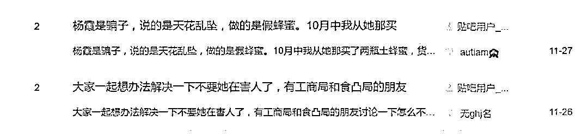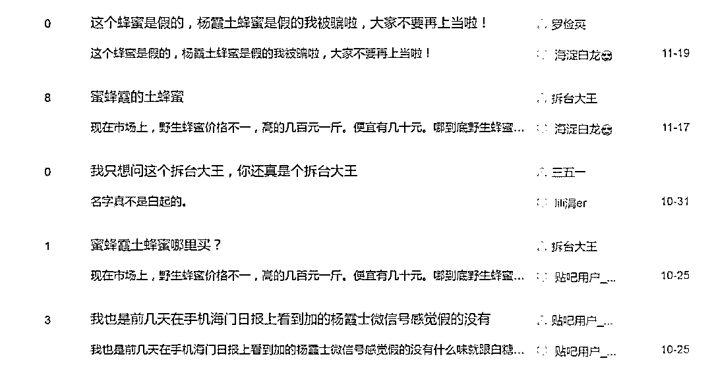

**上图为贴吧发帖截图**

好深的套路……

我不死心，又咨询了一下价格：

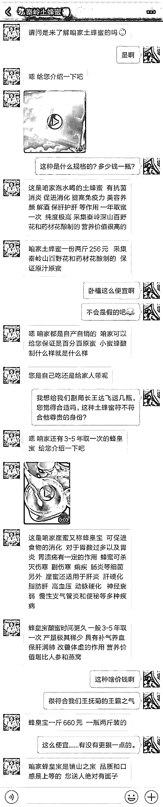

对方的报价是土蜂蜜每斤 128 元……蜂皇宝一斤 660 元……

得知了这个价格和这种铺天盖地的宣传力度后，一位从事蜂蜜销售的人员给了我一个确切的答案：

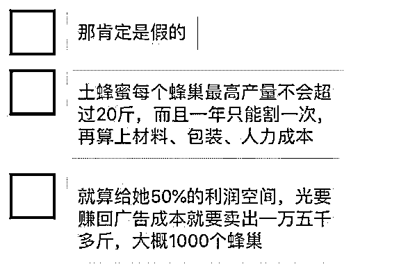

那么，这种所谓的土蜂蜜究竟是什么货色呢？

我在网络上找到了部分“蜂蜜霞”的晒单：

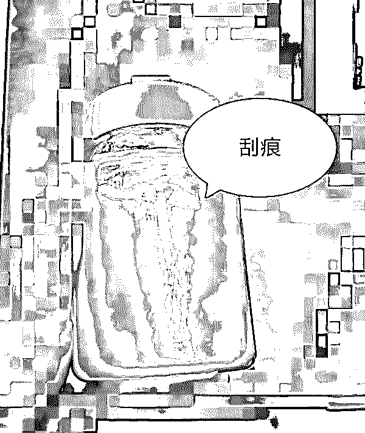

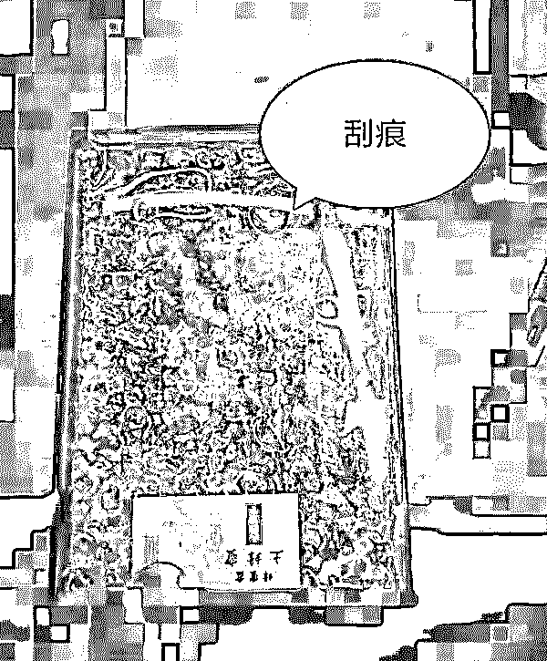

包装上的刮痕意味着两种可能：

一，包装是回收的；

二，“蜜蜂霞”就是一个彻头彻尾的二道贩子，收购一些来历不明的蜂蜜然后刮掉原来的标签贴上自己的。

这种包装极其简陋、没有任何标识的三无蜂蜜，无论如何都不会是真正的土蜂蜜，或许连 20 块钱一斤的普通蜂蜜都比不上，甚至可能是勾兑出来的“厕所土蜂蜜”。

如果长期饮用勾兑的假蜂蜜，不仅毫无营养，还有可能导致智力衰退、老年痴呆。

哪怕收到的是假蜂蜜、喝成智障痴呆我也忍了，还有些付了钱的朋友表示，竟然连假货都不给我发，是不是太过分了？

加上之前种种可疑迹象，“蜜蜂霞”必定是一个制假售假一条龙的诈骗团伙无疑。

他们花高额广告费利用全国各地的无知自媒体进行宣传（其中不乏官方自媒体）、加上无良公众号运营者的推波助澜，利用消费者的善良和同情心贩卖三无商品从而获取暴利，其心可诛！

“真相”浮出水面

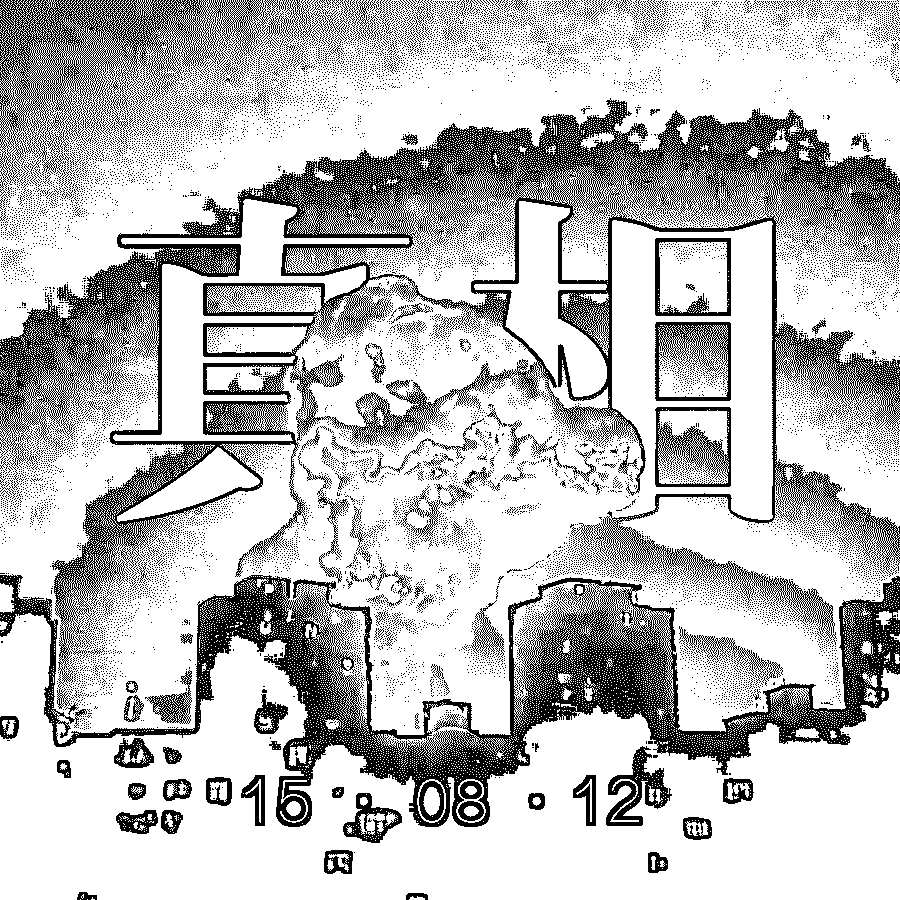

调查发现，目前各个“杨霞”中，能够为自家产品拿出分析检测报告的，其所展示报告均为由青岛华科检测分析中心出具的“20170422010a”号《分析检测报告》。

顺着该报告中提及的委托单位“蜜蜂霞”，我们找到了一家名为“郑州世外蜜源”的电子商务有限公司。

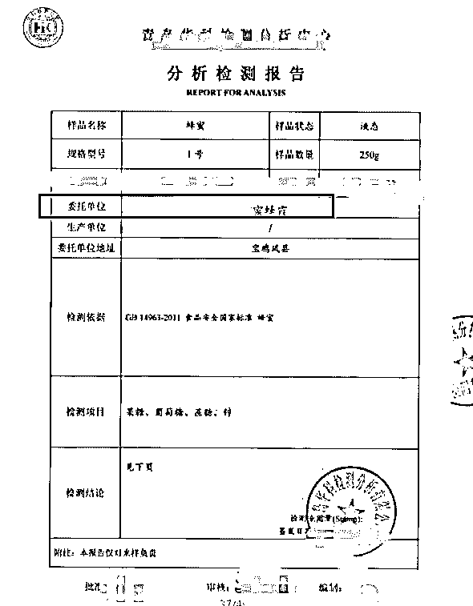

在“杨霞”最早的宣传链接中，曾提到“蜜蜂霞”是乡亲们对自己的昵称，也是自己目前的品牌，而这也正是郑州世外蜜源电子商务有限公司名下的注册商标。根据工商注册信息，该公司已于今年 8 月底注销。

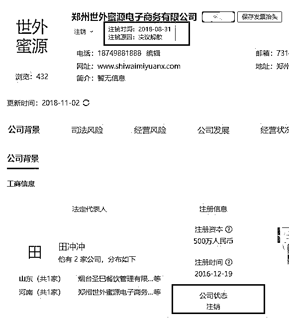

但“杨霞”的故事却并没有因为这家公司的注销而结束。

我们注意到，今年 9 月底西安成立了一家同名农业合作社。这家全称为“西安世外蜜源养蜂农民专业合作社”的公司，成立于 2018 年 9 月 30 日，法定代表人为杨金霞，经营范围中包括蜂蜜初加工及销售。目前，公司已经申请注册了“杨霞蜜语”这一商标，并进行销售。

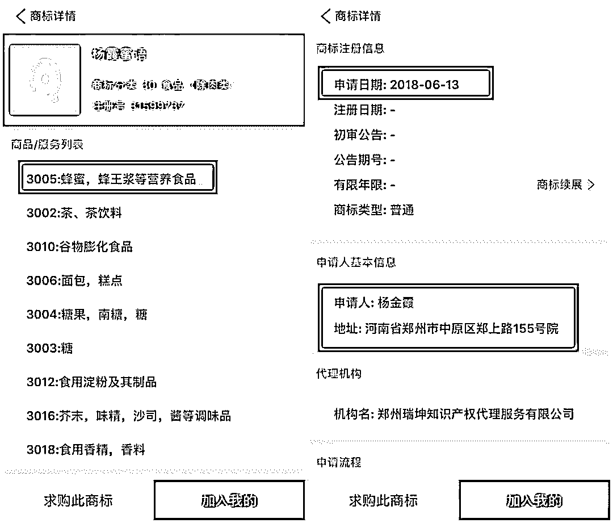

**▲中国商标网“杨霞蜜语”信息。**

在 10 月份出现的“杨霞”推广链接中，可以扫码识别出该公司所属“杨霞”。但该“杨霞”是不是就是最早视频中的“杨霞”，对方却并没有回应，并在我们表明身份后不久，注销了自己的手机号。

究竟有没有最开始视频中出镜的那个回乡卖蜂蜜的“杨霞”？对此，业内人士 KK 介绍，自己曾与推广过“杨霞”土蜂蜜的公司有过联系，根据对方介绍：

他们所采用的套路就是选一个形象亲切的代言人，找一些价格便宜的货源提供者，再由电商团队发布广告，最后由客服伪装“杨霞”与消费者进行沟通，成交后各环节再分红。

至于有没有“杨霞”这个人、故事是不是真实的，是其中最不重要的一环。

类似的操作手法很常见，而且也不局限于卖蜂蜜，卖酒、卖海参……都是一样的”。

至于为什么土蜂蜜市场会出现这么多的“杨霞”，KK 解释，由于土蜂蜜产量低，所以在市场上相对少见，很多人就是利用这一特点，鼓吹土蜂蜜的营养价值，高价出售，“但其实蜂蜜质量好不好，主要还是看蜜源”。

查清了！火遍全国的“蜜蜂霞”，“为父”代言卖酒的女儿，她们都是...不少车主都被坑了，保险公司竟扣这笔钱！多地已出现！1 秒让你倾家荡产！

至于有没有“杨霞”这个人、故事是不是真实的，是其中最不重要的一环。KK 说：“类似的操作手法很常见，而且也不局限于卖蜂蜜，卖酒、卖海参……都是一样的”。

结尾

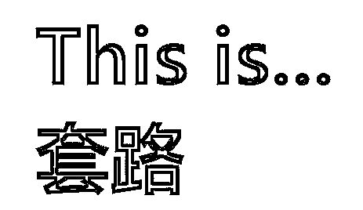

桌子上放着“卖茶小妹”的茶

柜子里存着“茅台镇小妹”的酒

家里冰箱放着“海参妹”的参

电脑闪烁着“荐股妹”的股票

手机上安装着“原油妹”的软件

唯一还缺的就是“蜂蜜霞”的蜜

此刻唯一感慨：

城市套路深 我想回农村 

# 农村路也滑 人心更复杂

国外已整改 套路深似海

不如飞上天太阳肩并肩

●[色即是空：大型情景剧《武夷山小妹卖茶记》](http://mp.weixin.qq.com/s?__biz=MzIyMDYwMTk0Mw==&mid=2247491301&idx=1&sn=7a1ec924a57e5f703311e7281fef2a67&chksm=97c8d5dda0bf5ccba06528a5d584b07237c5338c7f8de9838302c4fefae18f66afd253c477b8&scene=21#wechat_redirect)

●[灰产哥与卖茶小妹“王小芬” 的故事-解密年流水一个亿的茶叶产业链](http://mp.weixin.qq.com/s?__biz=MzIyMDYwMTk0Mw==&mid=2247487095&idx=1&sn=08e5b4d96a3f6bacaa918dd524afb5cb&chksm=97c8c54fa0bf4c593c668f782978a98f51513367a567625b1877f9e00b425c9ef9e0e67bf642&scene=21#wechat_redirect)

●[造假！抄袭！“杀熟”！电商平台灰色产业大起底！](http://mp.weixin.qq.com/s?__biz=MzIyMDYwMTk0Mw==&mid=2247493721&idx=1&sn=81ebd3d864be92905518837229950f9f&chksm=97cb2361a0bcaa776f33f6809a2d0b3fe7c76f1f6fc2c986d729e111ab0c5e4a3984c484c2b2&scene=21#wechat_redirect)

●[南抖音，北快手，假货界的两泰斗？](http://mp.weixin.qq.com/s?__biz=MzIyMDYwMTk0Mw==&mid=2247490873&idx=1&sn=080d62a50b7f6e51fb21d3157d05db16&chksm=97c8d601a0bf5f170b5341a5e94728fcdc76e5d870214a961a12fd9a2e9b6f507eb5f22fa005&scene=21#wechat_redirect)

   

**点击加入 ****灰产圈 | 高端社群**