# “人脸识别”未到，黑色产业先行！

> 原文：[`mp.weixin.qq.com/s?__biz=MzIyMDYwMTk0Mw==&mid=2247493897&idx=1&sn=790965b2e924eb84c8ec79fee3d62bd0&chksm=97cb2231a0bcab27cedcf66e329dac12476a4066f5221639303a036b130315de604970b590de&scene=27#wechat_redirect`](http://mp.weixin.qq.com/s?__biz=MzIyMDYwMTk0Mw==&mid=2247493897&idx=1&sn=790965b2e924eb84c8ec79fee3d62bd0&chksm=97cb2231a0bcab27cedcf66e329dac12476a4066f5221639303a036b130315de604970b590de&scene=27#wechat_redirect)

**点击上方蓝色字体“灰产圈”关注并置顶本公众号**

**导语**

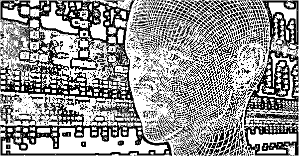

人脸识别技术还未成熟，黑产却已成型

人脸识别实名认证，大家都知道。

但是，反人脸识别实名认证，您知道吗？

现在，利用这个技术已经成为了一个黑产，叫“反人脸认证”产业。

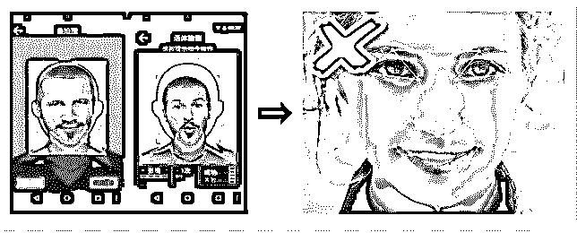

什么叫“反人脸认证”产业？

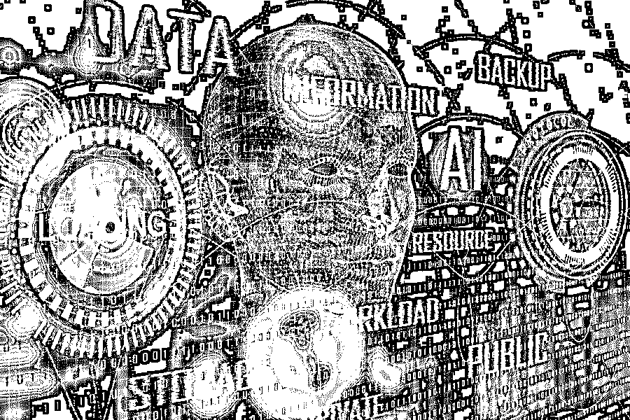

简单讲，就是帮无法或不想用自己信息完成人脸识别认证的人，通过人脸识别实名认证，从中牟取暴利的黑色产业。

有人的地方就有江湖，有需求的地方就有产业

不管是合法还是违法

接下来，让我们带大家看看这个“黑色产业链”是如何运作并存在的？

**“反人脸识别认证”产业链生态圈**

他们三个构成这个灰色产业的生态圈：

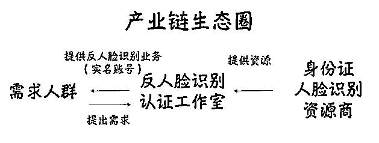

**“反人脸识别认证”的运作体系**

有需求的人群向工作室提出需求，接下来资源商会给工作室提供资源。

那么。有需求人群拿到实名账号去干嘛？废话，当然是去变现！赚钱！

他们大部分通过薅羊毛、倒卖账号、或其他灰/黑业务中获取暴利。

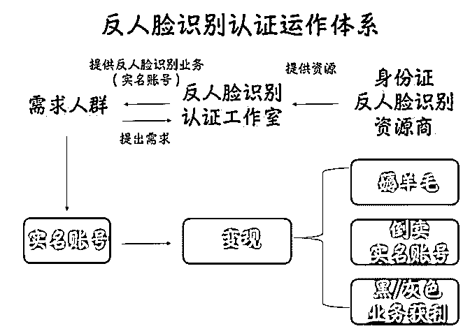

那么问题来了，资源商这些真实的身份信息从哪里来的？

**资源商信息来源**

有三个渠道：

一黑客窃取

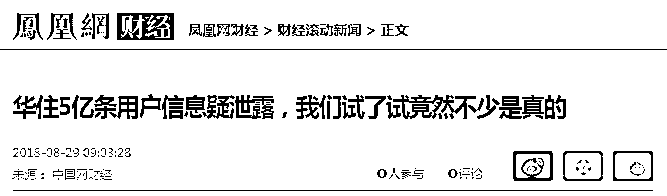

**上图为凤凰网报道**

二网络公然贩卖，价格不等

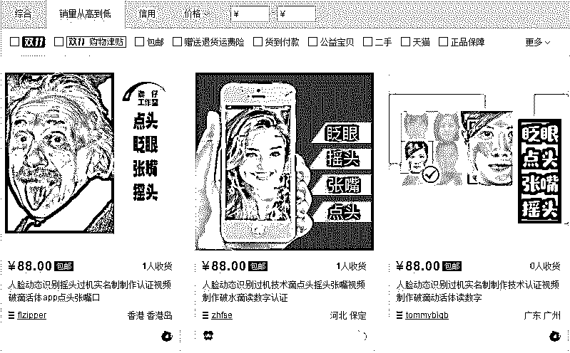

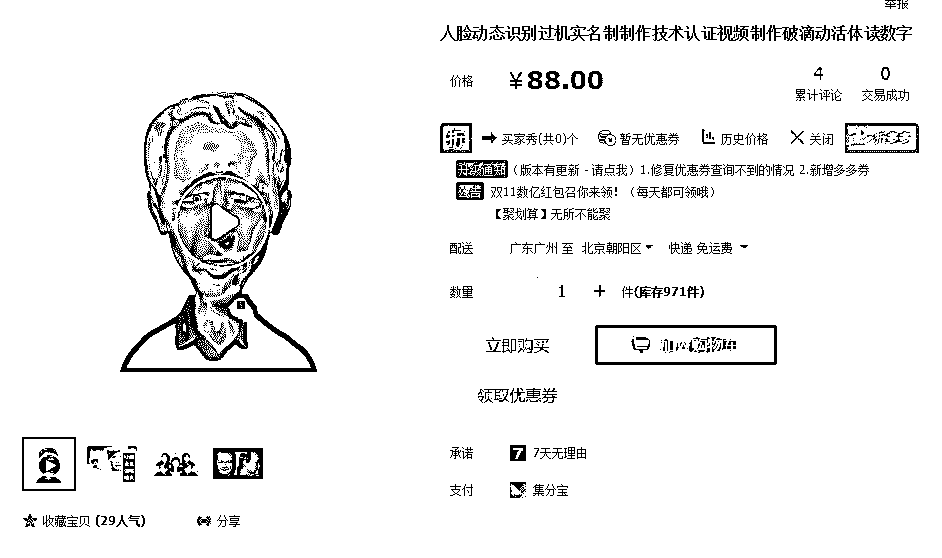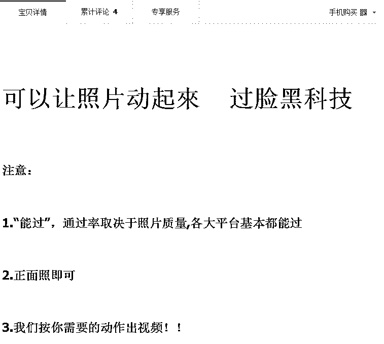

**上图为某宝产品描述**

一企业员工私下贩卖

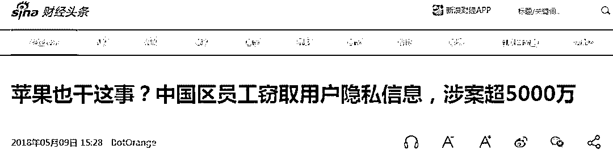

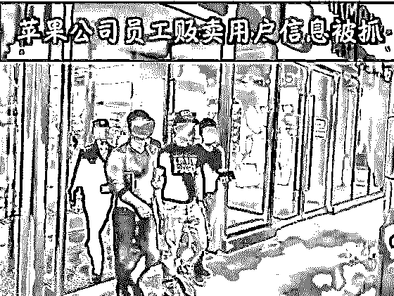

**上图为新浪财经新闻报道**

**人脸识别技术**

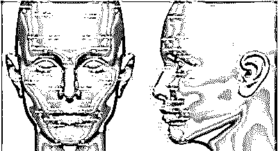

人脸识别作为模式识别的重要分支，大体可以分为三个组成部分：

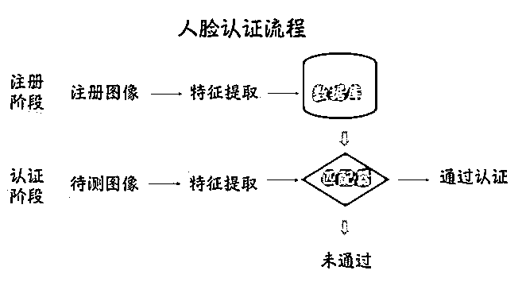

大部分的脸识别实名认证都需进行活体检测，防止用图片蒙混过关。

网络上商家承诺的“包过”，是如何实现的呢？

**你有政策，我有对策**

为了帮助无法完成人脸识别认证的人，通过 APP 人脸识别的认证，商家通过制作动图方式通过验证。

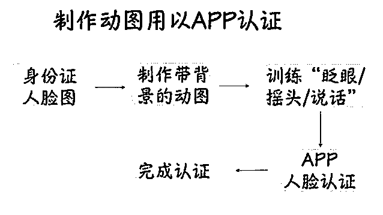

以下是某宝的商家提供的身份认证活体检测的效果图。

据商家说能做到点头、眨呀、张嘴、摇头等动图效果

并称保证万无一失通过人脸识别活体检测

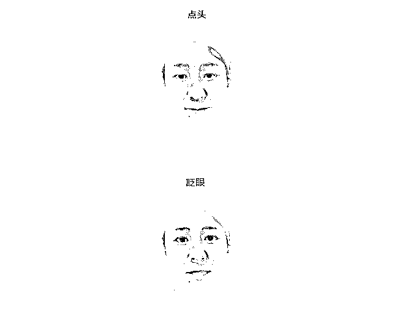

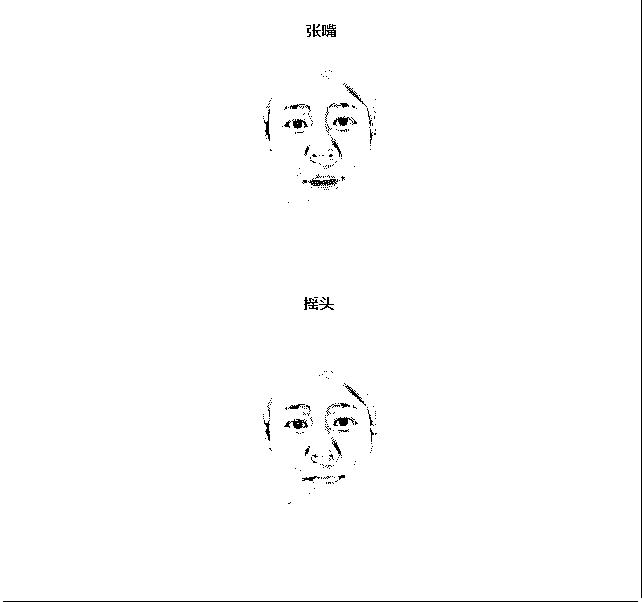

问题来了，如果你个人身份信息泄露了，它能用来干什么呢？

**黑色产业在行动**

2016 年 5 份，工信部发布手机实名制规定。

潜逃的嫌疑犯或其他黑产从业者，如果想购买电话卡，就可以通过以上方式实现。（当然也可以从卡商手里购买）

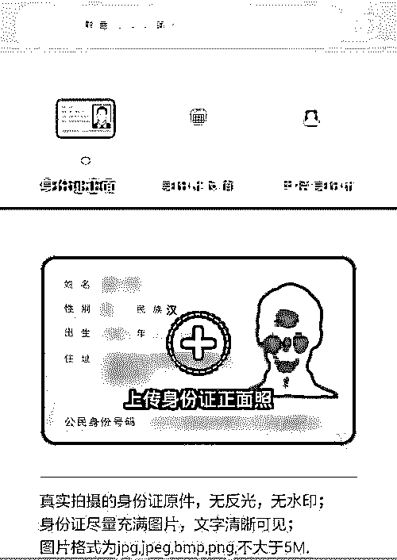

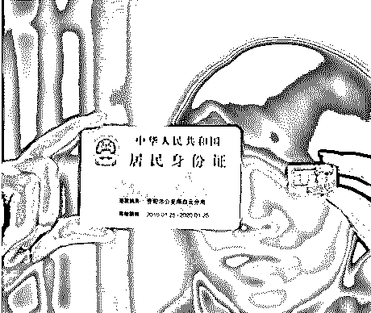

跨境电子商务的年度个人额度，上限是 2 万元/年。

有很多人海淘购物，为避税进货，会冒用他人的身份信息。

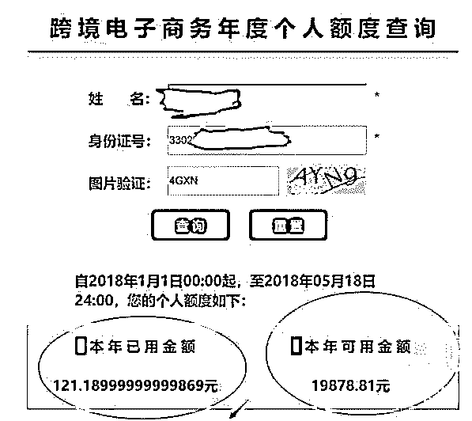

从 2016 年 4 月 8 号起，我国实施跨境电子商务零售进口税收政策，根据相关的政策规定；

跨境电子商务零售进口商品单次交易限值人民币 2000 元，个人年度交易限值人民币 2 万元。

额度内交易，关税为零，超过单次限值、累加后超个人年度限值单次交易，全额征税。

曾经某贷宝移动 APP 产品推广期，新用户注册，同时人脸识别实名认证成功，就可以获得 20 元人民币的推荐奖励金

不法分子将反人脸识别技术应用在薅羊毛上，只为获取不义之财。

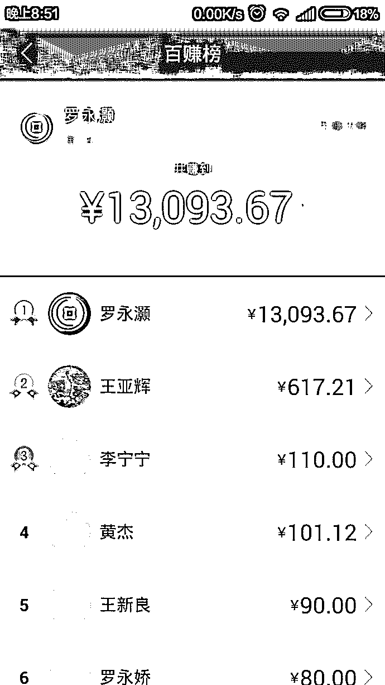

现在，人脸识别技术在我国应用越来越丰富。

但被不法分子钻了空子

给社会和人们都带来不可估量的危害

希望法律和社会正义之光

能照进黑产地带，只为技术正名

**结尾**

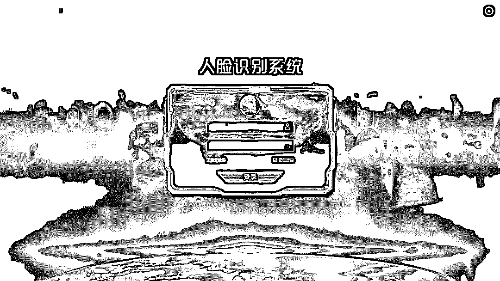

目前市场，人脸识别技术在我国应用越来越丰富，但面临着风险，在掌控人脸识别技术同时，要抵制风险，免的被不法分子钻漏洞，给社会带来危害。

最后的最后，我们想说：在互联网大数据面前，我们要保护好自己的个人隐私。

但是数据泄露事件层出不穷，

我们的隐私安全路在何方？

●[网络黑产如何倒卖个人隐私？](http://mp.weixin.qq.com/s?__biz=MzIyMDYwMTk0Mw==&mid=2247483699&idx=3&sn=fed5285869d3525f7249841558023f49&chksm=97c8ca0ba0bf431da0edb1f00adbbb9119b4245c2387eca133c714c42339c1cc1d52705061f2&scene=21#wechat_redirect)

●[个人隐私交易黑市大起底：是谁在盗贩公民信息？](http://mp.weixin.qq.com/s?__biz=MzIyMDYwMTk0Mw==&mid=2247492647&idx=1&sn=07b195ad56c8bb4c466c1ff6f3ee64d9&chksm=97cb2f1fa0bca609fe8344d8f16ed9d7fa417bbcfc3eed420d8d8ed3261c84ca5b227a665ab4&scene=21#wechat_redirect)

●[起底大数据黑产：华住被“脱裤”，1.3 亿人的开房记录在“裸奔”！](http://mp.weixin.qq.com/s?__biz=MzIyMDYwMTk0Mw==&mid=2247493195&idx=1&sn=d5351fa08473d22e7806f00b67d69018&chksm=97cb2d73a0bca46563076a8619815897601954079ae416c191ae0eba1dfe6b8235825349f78b&scene=21#wechat_redirect)

●[与黑产作战 | 起底大数据黑产](http://mp.weixin.qq.com/s?__biz=MzIyMDYwMTk0Mw==&mid=2247492962&idx=1&sn=7a21e79f66db38b17f31bca2bb626723&chksm=97cb2e5aa0bca74cd415375606c65edd2bed31a07ea478d583a179e105c65720360fdd2ff24d&scene=21#wechat_redirect)

   

**点击加入 ****生财有道 | 商学院**

# 

> 原文：[`mp.weixin.qq.com/s?__biz=MzIyMDYwMTk0Mw==&mid=2247493887&idx=1&sn=5c121f4b7d17c7ff2ffc185529f8cd53&chksm=97cb23c7a0bcaad11391e6816b7868911605bc50c4d53027bf60d2d53cd186547e6591440485&scene=27#wechat_redirect`](http://mp.weixin.qq.com/s?__biz=MzIyMDYwMTk0Mw==&mid=2247493887&idx=1&sn=5c121f4b7d17c7ff2ffc185529f8cd53&chksm=97cb23c7a0bcaad11391e6816b7868911605bc50c4d53027bf60d2d53cd186547e6591440485&scene=27#wechat_redirect)