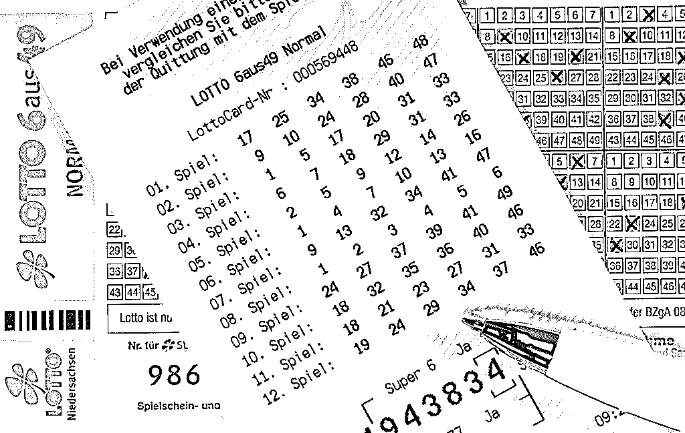
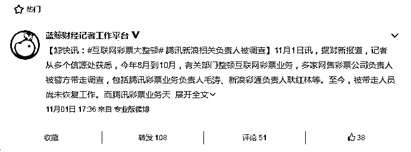
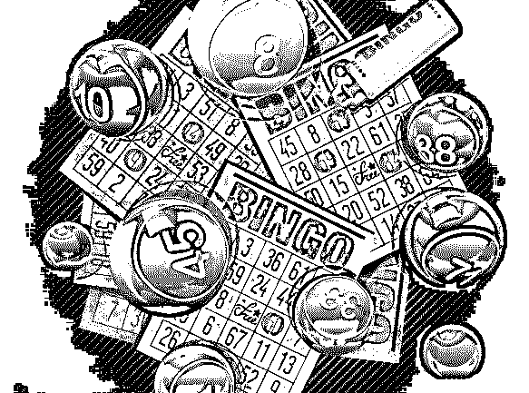
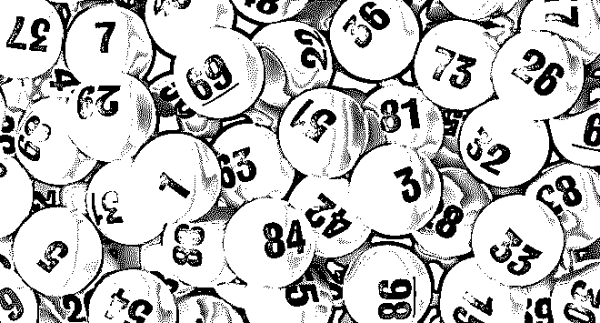
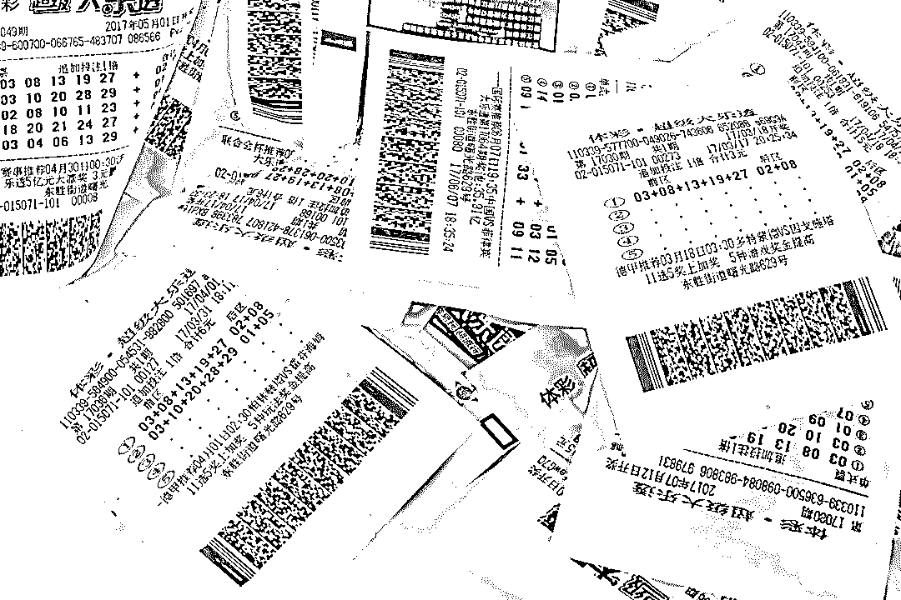
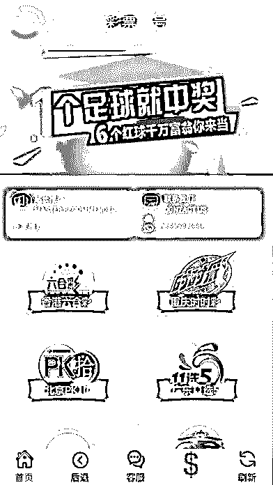
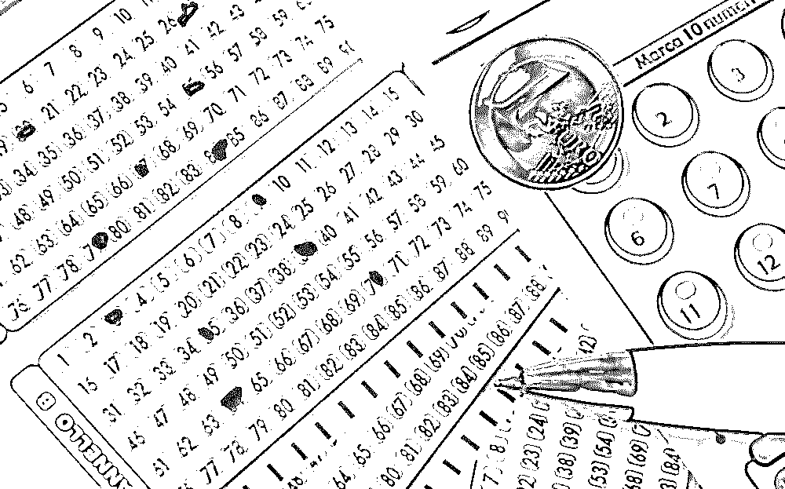
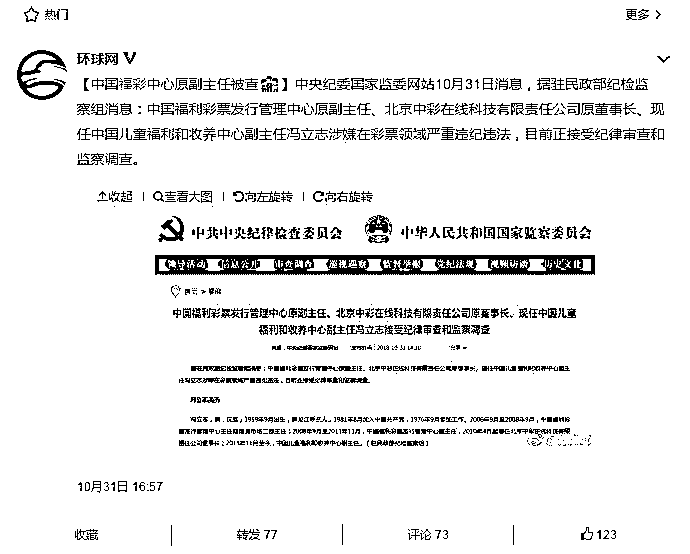
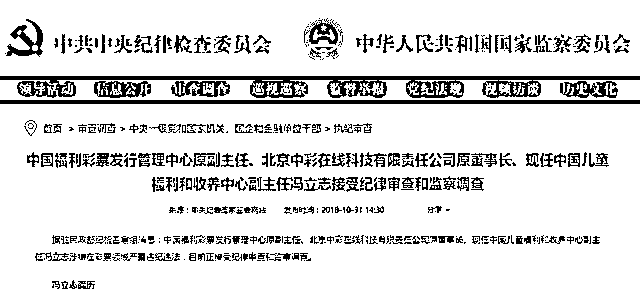

# 互联网彩票大起底：“黑彩”“吃票”“倍投”，三个黑幕让你倾家荡产！

> 原文：[`mp.weixin.qq.com/s?__biz=MzIyMDYwMTk0Mw==&mid=2247493827&idx=1&sn=23fae9085bc42fd0307f675d8dbea890&chksm=97cb23fba0bcaaed2f6c78c469574b572a01d0badf5ef6874632c84cbc99427e87e3904eff92&scene=27#wechat_redirect`](http://mp.weixin.qq.com/s?__biz=MzIyMDYwMTk0Mw==&mid=2247493827&idx=1&sn=23fae9085bc42fd0307f675d8dbea890&chksm=97cb23fba0bcaaed2f6c78c469574b572a01d0badf5ef6874632c84cbc99427e87e3904eff92&scene=27#wechat_redirect)

**点击上方蓝色字体“灰产圈”关注并置顶本公众号**

**导语**

## 国家开始对互联网彩票业务下重锤了！ 

据财新最新报道，今年 8 月到 10 月，有关部门整顿互联网彩票业务，多家网售彩票公司负责人被警方带走调查，其中包括腾讯彩票业务负责人毛涛、新浪彩通负责人耿红林等。至今，被带走人员尚未恢复工作。

而腾讯彩票业务天天中彩票、新浪等公司均已在此前的互联网彩票整顿中停止了网售彩票业务。

**微博热门：蓝鲸财经记者报道**

这是今年 10 月迎来严厉监管政策以来，互联网彩票平台违规行为被严肃处理的最新例证。

9 月 3 日，财政部、民政部、国家体育总局发布关于修改《彩票管理条例实施细则》（以下简称《实施细则》）的决定，自 2018 年 10 月 1 日起，《实施细则》将正式实行。进行了修订

此次修订最值得关注的是，第七条关于非法彩票的规定中增加了一项：将擅自利用互联网销售的福利彩票、体育彩票列为非法彩票之一。这是我国彩票法规中首次将违规互联网售彩明确为非法彩票。

**为什么国家会对互联网彩票屡屡禁令？**

要知道，互联网彩票每年贡献的盈利数目惊人。

按照英国 GBGC 公布的全球互联网彩票平均渗透率 28.40%来进行估算，我国目前互联网彩票市场空间在 2000 亿元以上。

换句话说，停售互联网彩票，给中国带来的彩票收入损失以及流入国外非法平台的资金损失，每年约合 2000 亿左右。

纵然如此，官方取缔互联网彩票也势在必行。

目前互联网售彩的形式主要是通过 APP 或者网站售彩，颇具争议的变相互联网售彩，也就是以平台为中介，为线下彩票店接单，但平台本身不参与售彩的彩票 O2O，也属于互联网售彩的范畴，是被禁止的。

实际上，随着互联网技术的发展之快，互联网彩票的玩法往往花样繁多而且变身迅速，例如：线上线下模式，线上接单，彩票销售网点出票；站主设立微信群、QQ 群接单后出票，或者通过手机客户端销售彩票、网络直播销售彩票等。这些都是未经审批的任何形式利用互联网销售彩票的违法行为。

尽管如此，在监管手段跟不上技术发展以及巨大利益驱使下，监管部门对互联网彩票叫停后的一段时间内能清理大部分互联网代购。但过不了多久，各大售彩平台就卷土重来，有的只不过换个名字而已，还有更隐蔽一些的网站需要绕过层层“障碍”注册并购买彩票。

今年俄罗斯世界杯期间，网络竞彩进入销售高峰，多个彩票 APP 进入苹果、安卓手机的下载排行榜。据媒体公开报道，6 月 20 日，体彩中心封了约 1 万台机器，很多世界杯前期卖得很火的网站，都没办法出票了。

但所谓“上有政策，下有对策”，面对监管打击，互联网彩票公司有的是办法，比如有的公司只是提高了投注门槛，对一些老客户、VIP 客户依然可以购买彩票。

今年 4 月央视曾报道，目前有超过 300 多家彩票网站仍在暗中运行，每年售彩金额不低于 1000 亿元。

正是互联网的虚拟性、远程性等一系列特性，使得互联网销售彩票的监管难度极大。这是业界公认的现象，也是各大互联网彩票平台在每次监管之后能够“死灰复燃”的主要原因。

此次腾讯、新浪这两大门户网站的互联网彩票业务被叫停，相关负责人被警方带走，这实际上是监管部门向业界发出的严厉整顿信号，表明今后的互联网彩票监管会动真格，没有最严只有更严。

**为什么官方态度如此坚决？**

一互联网彩票这些年的黑幕

彩票刚流行那会，彩民都是在实体店买，比如彩票站、邮政报刊亭。

互联网兴起后，通过电脑、手机等网络终端销售彩票，销售金额突飞猛进：2014 年，互联网销售彩票金额就高达 850 亿元，占彩票销售总额的 1/4。

有彩民说，彩票有一定的成瘾性，以前在实体店可能不会特意跑过去买。但手机太方便了，而且买起来很快，几乎没有什么限制，就一天到晚买。

上网搜索“彩票”二字，出来的彩票网站就有一大堆。网站看上去都很诱惑人：收益高、概率大，分分钟变成大富豪！

但背后却黑幕重重，凶险环生——绝大部分是“黑彩”团伙。三个套路就能让你倾家荡产。

第一个套路：我们是正规的

“黑彩”网站会伪造销售一些正规彩种，比如“时时彩”、“时时乐”等，彩民在正规的彩票销售点可以购买到。

然后有“美女”营销员，一般都宣称自己是国家正规彩票的代理，玩法和中奖规则完全依据正规彩票。还有专业的彩票分析师，预测得奖号码非常准确。

“黑彩”网站就连开奖时间、中奖结果也做得跟正规彩票一模一样。

但，这只是第一个套路。

第二个套路：“吃票”

举个例子，一个小网站彩票年销量达 2000 万，但扣除牌照和成本支出，净利润不到 50 万。但是，他们发现要发出的奖金总额仅为百万级别。然后，神奇的事情发生了。

这个网站开始决定吃掉这些彩票，即不去实际出票。对于中奖的号码，他们还会照常返奖。这就是“吃票”，在开吃的同时，他们也坐上了“私庄”。

据业内人士透露，“吃票”的问题在业内相当普遍。因为中奖概率就摆在那里，自己截留这些资金的诱惑实在太大。

所以，那些奖金规模不大，开奖频度高的彩种就成了“吃票”的高发地带。

不难想象，所谓成倍增长的利润，有很多其实都是通过“吃票”窃取而来。面对这样的失控局面，我们也不难明白为什么这次停售整顿的力度会如此之大。

而在网站上投注的人以为自己买的是国家正规的彩票，由于网站反馈的并不是真实的出票凭据，彩民的钱其实全部落入了“黑彩”网站的腰包。

“黑彩”网站不需要向国家缴纳任何费用，光几十万注册会员每天投注的钱，就是一笔稳赚不赔的黑色收入了。这些会员像印钞机一样，每天源源不断地把钱送到“黑彩”网站。

第三个套路：倍投计划

利用高返奖的诱惑，网站能吸引大批彩民投注，参照正规彩种的开奖结果，一开始会让彩民中几次奖，诱惑人继续投注。

先带你赢一点，尝到甜头之后人自然会继续往里面砸钱。

可彩民接下来往往会一输再输。如果有彩民输急了眼要收手，营销人员就会劝你“倍投”。2 倍不行，就买 5 倍、10 倍，中上一次，所有的亏损就回来了。

“能够把本钱拿回来我就收手。拿回来就收手，一直是这么跟自己讲的。”

网站利用人性补偿的心理，诱惑客户成倍加大投入，挣大钱来补亏空，最后锁定你的所有资金，让人倾家荡产。

当买彩票变成了赌博，也就中了“黑彩”网站的最终圈套。

这还不算完，假使真的有人非常幸运中了大奖，或者有大额的余额想要提现，等着他的是终极套路——崩盘，再也联系不上。三个字：跑路了！

而这些网站的服务器大多架设在香港或台湾，犯罪团伙可以自己完成，难以监管。

二 “一夜暴富”？

**环球网：中国福彩中心原副主任被查**

**纪检委通告截图**

有没有机会与百万、千万结缘？正是这些好奇与急功近利的心里，让一些人涉足“黑彩”。

当彩票让人产生赌博心理，让人上瘾的时候，危险就来了。

特别对于一些生活没有起色甚至绝望的人，就像一个救命稻草：说不定运气好就翻身了。

从最开始玩一票试试，到最后失去理智不能自拔，陷入赌徒的心里怪圈，他们渴望天上能够掉个大馅饼，一夜暴富。

正是这种投机心理，让黑手有机会可循。

甚至有人因为买黑彩票欠下高利贷无法偿还，最终自杀。

死者真的已经上瘾了，他想花更多的钱去把输掉的钱赚回来，去填自己从公司里面拿出来的资金窟窿，最后一直滚到了 2400 多万，翻不了本只好自杀 。

可见，黑彩通过暗箱操作和“逃庄”凭空获取了大量的不义之财。今年浙江警方抓获的“黑彩”团伙，涉及金额就高达 80 亿。

所以彩票的合法运营权，国家必须要收回来。防止彩民放任好赌的心理痴迷买彩票。

至于如何让彩票更有说服力，让人彻底相信它的公正，这个就需要一些技术手段来实现，并且以国家信任作为背书。

**结尾**

对中国人来说，能不赌，就是好事儿。

哪有什么小赌怡情，都是贪欲遮住了眼睛，赌海无涯，上岸的人回头再看，停手就是赢。

●[成为博彩网站“代理”后，我把好兄弟坑到跑路！](http://mp.weixin.qq.com/s?__biz=MzIyMDYwMTk0Mw==&mid=2247493820&idx=1&sn=9aef3747b448b984ad4006406a8c29e2&chksm=97cb2384a0bcaa926e10ca9490f195212bc0849f3e723c9a04b7c0c8f818ed7187dc8980ed2f&scene=21#wechat_redirect)

●[第三方支付已彻底沦为涉黄，赌博，诈骗的帮凶！支付宝首当其冲！](http://mp.weixin.qq.com/s?__biz=MzIyMDYwMTk0Mw==&mid=2247493709&idx=1&sn=70e7793df7a17e82d8ebc357c3848405&chksm=97cb2375a0bcaa6312960e24e9b472158eccd9e462edec5498530dd29322d94ccc93992e6f47&scene=21#wechat_redirect)

●[深度| 1 万亿！4 年前的世界杯，非法赌球网站从中国大陆抽走这么多！](http://mp.weixin.qq.com/s?__biz=MzIyMDYwMTk0Mw==&mid=2247492262&idx=1&sn=20cacd8763907a85cdd11ec07a2ccbec&chksm=97cb299ea0bca0883b777b15e192ad74279d2fbbc42bca991cef9012af67db53b21232390deb&scene=21#wechat_redirect)

●[揭秘大数据下，久赌必输的秘密：不赌才是赢！](http://mp.weixin.qq.com/s?__biz=MzIyMDYwMTk0Mw==&mid=2247491646&idx=2&sn=fa5c16f70d37d48356979287ce3f0f42&chksm=97cb2b06a0bca210aa446d58aa30ad64112ca575aafc43544e0d95f802e77f29f3266f79874c&scene=21#wechat_redirect)

    灰产圈官方直播间      灰产圈旗下生财有道|商学院 官方直播间立即关注   

**点击加入 ****生财有道 | 商学院**