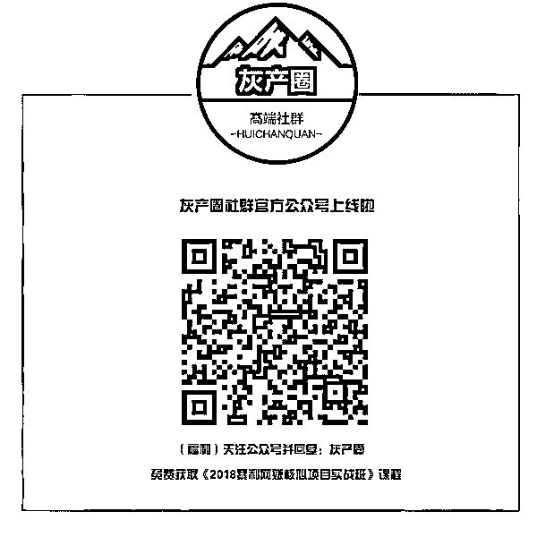

# 这段花 7000 元买来的采访震惊世人，揭秘校园黑手连环下套黑幕！

> 原文：[`mp.weixin.qq.com/s?__biz=MzIyMDYwMTk0Mw==&mid=2247493794&idx=1&sn=c8830788ffac418d7ce80c727db137ab&chksm=97cb239aa0bcaa8c00aa5b66130a0cc9cf044cfddbeb71779b2c4704ff1f02c371a5f790ff3d&scene=27#wechat_redirect`](http://mp.weixin.qq.com/s?__biz=MzIyMDYwMTk0Mw==&mid=2247493794&idx=1&sn=c8830788ffac418d7ce80c727db137ab&chksm=97cb239aa0bcaa8c00aa5b66130a0cc9cf044cfddbeb71779b2c4704ff1f02c371a5f790ff3d&scene=27#wechat_redirect)

**点击上方蓝色字体“灰产圈”关注并置顶本公众号**

 今天文章主要围绕一段视频展开：

首先介绍一下视频背景：

这是一位有良知的女编辑花了 7000 元，买来了这段 8 分钟的视频采访，采访对象是一位某大学的学生会副主席，她在校园内从事美容中介的行业，利用职务之便和欺骗手段，一步步将校园内某些大学生从单纯地学生，沦为 KTV 陪酒小姐，裸贷受害者，以及网贷受害者

这其中披露的种种连环下套黑幕，必将震惊每一个中国人......（请先花八分钟看完整个视频） 

[`v.qq.com/iframe/preview.html?width=500&height=375&auto=0&vid=j1351bhls5x`](https://v.qq.com/iframe/preview.html?width=500&height=375&auto=0&vid=j1351bhls5x)

 灰产圈经过梳理，我们获取到了这个完整的产业链：

整形需求者（学生）——整形中介（受访者）——贷款机构（裸贷）——整形医院（非正规整形机构）

假如 整形需求者（学生）未按照或没有能力按照约定还款，那就进入到另外一条灰色产业链

商务模特（出台小姐）
        |
整形需求者（学生）——娱乐会所（坐台小姐）
        |

捐卵（黑心医疗机构） 

看到这里，相信大家对这条灰色产业链应该很清楚了，校园贷（裸贷）存在了很多年，但是经过整治，现在依旧存在校园的各个角落，甚至是你当地的大学或者朋友正在经历这些，希望大家把这个用 7000 块钱买来的采访转发出去！

最后，诸位，你对这件伤天害理之事有何看法？请在留言区评论。 

   

**点击加入 ****生财有道 | 商学院**