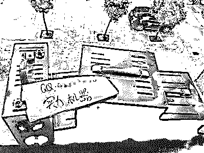
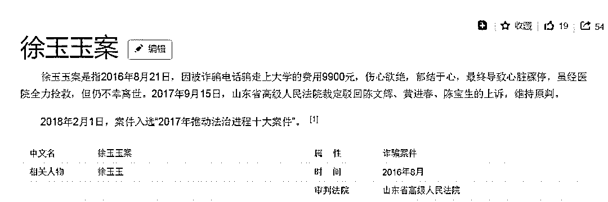
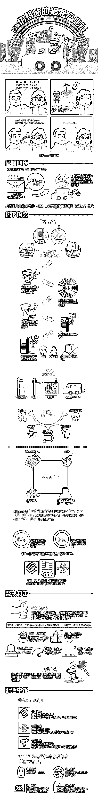
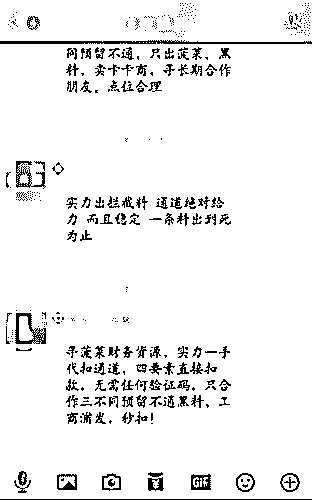
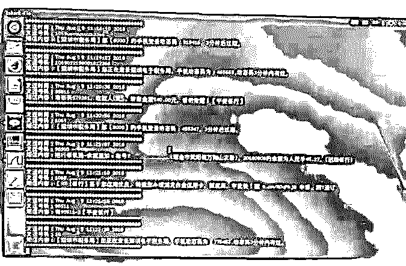
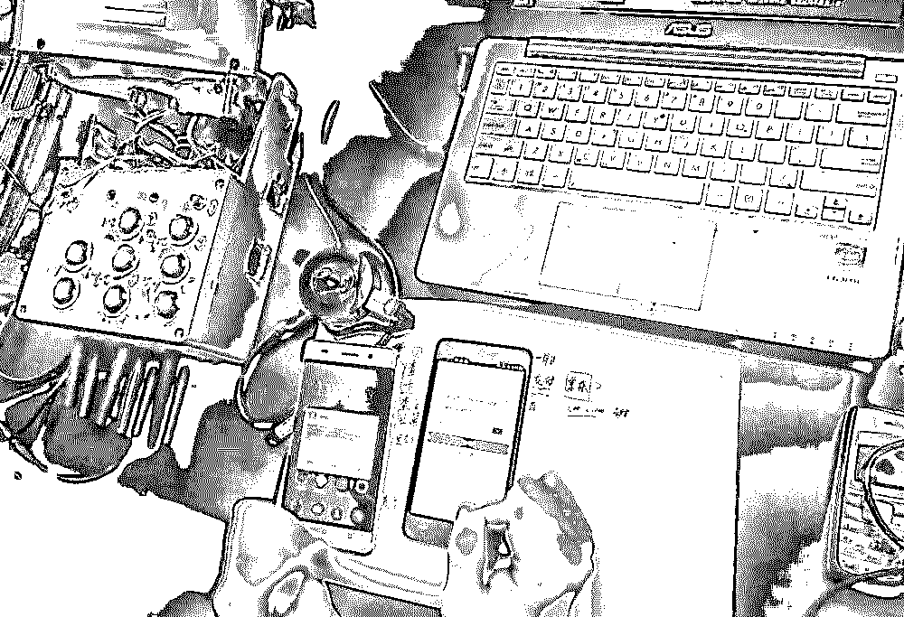
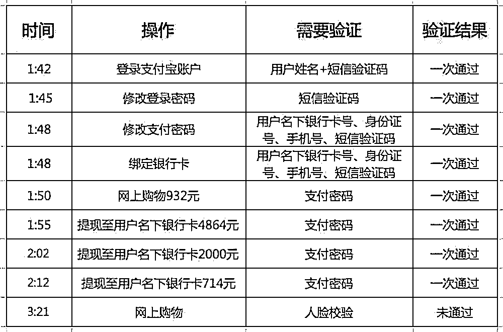
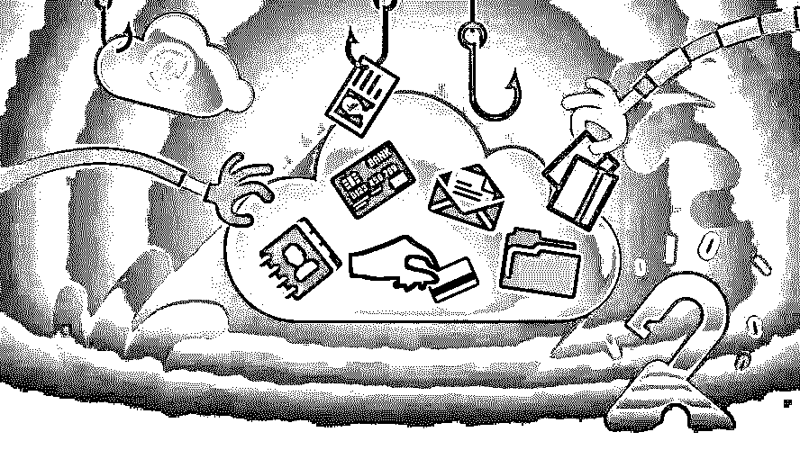
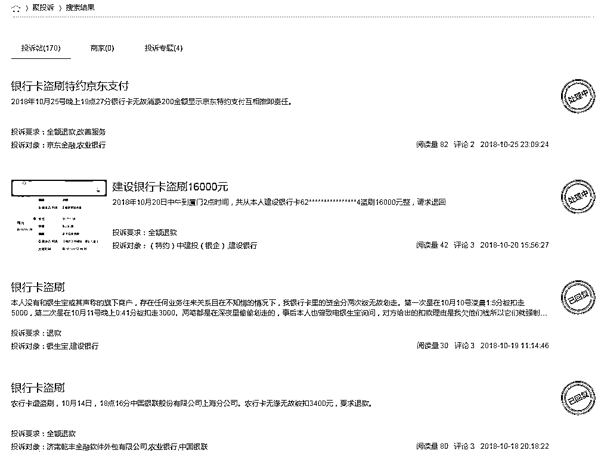
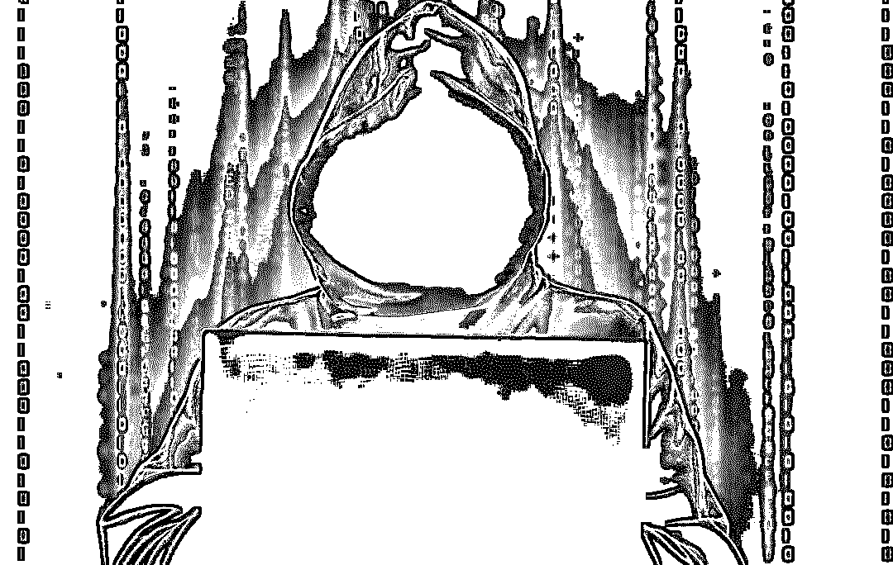

# 探秘银行卡盗刷黑产："伪基站"群发，“木马”拦截，黑客“洗料”，“短信嗅探”，暗黑齐天，法力无边！

> 原文：[`mp.weixin.qq.com/s?__biz=MzIyMDYwMTk0Mw==&mid=2247493780&idx=1&sn=288da1b308bc55276fcb623493cab254&chksm=97cb23aca0bcaaba3196e9c88e663091e18d0c1d91e2cdc6ac48cc858b2c4e48cf9f809b09a1&scene=27#wechat_redirect`](http://mp.weixin.qq.com/s?__biz=MzIyMDYwMTk0Mw==&mid=2247493780&idx=1&sn=288da1b308bc55276fcb623493cab254&chksm=97cb23aca0bcaaba3196e9c88e663091e18d0c1d91e2cdc6ac48cc858b2c4e48cf9f809b09a1&scene=27#wechat_redirect)

**点击上方蓝色字体“灰产圈”关注并置顶本公众号**

探秘银行卡盗刷黑产

**一天发 3 万木马短信月入可达十几万**

伪基站发木马短信“设局”，钓鱼网站诱导用户填写银行密码，“洗料人”通过多个渠道盗刷“洗白”

**某伪基站卖家所展示的伪基站产品。**

去年 5 月 9 日，最高人民法院通报了《最高人民法院、最高人民检察院关于办理侵犯公民个人信息刑事案件适用法律若干问题的解释》。

这是两高首次就打击侵犯公民个人信息犯罪出台司法解释。根据此次司法解释，非法获取、出售公民个人信息，情节严重者可获刑。

近年来，侵犯公民个人信息犯罪仍处于高发态势，而且与电信网络诈骗、敲诈勒索、绑架等犯罪呈合流态势，社会危害更加严重。

我们几乎每个人，都曾被推销电话、诈骗短信骚扰过。2016 年 8 月发生的“徐玉玉案”，即是个人信息遭侵犯导致的“恶果”。

**百度百科徐玉玉案的解释**

灰产圈推出关于“个人信息泄露”的系列调查报道。

我们将通过对航空、征信、银行卡等领域的调查，以期找到个人信息泄露的源头。

直到 5 月 23 日收到电子账单，刘晓静(化名)才发现自己的信用卡被盗刷了。“我在今年 2 月底申请的卡，5 月初激活的，但 5 月 4 日就在不知情的情况下被刷走了一笔 1990 元的账单，此后又有好几笔被转走。”她告诉我们。

刘晓静不知道的是，她的信用卡信息已经泄露了，泄露渠道极有可能是在登录银行网站填写信息时，遭到了虚假网站“钓鱼”。

调查了解到，在银行卡盗刷的黑色产业链中，1990 元只能算一笔“小买卖”：从伪基站群发木马短信诱导用户点击链接，到钓鱼网站和拦截码“钓出”用户信息，再到“洗料人”通过多种通道将钱“洗白”分赃，银行卡盗刷产业链已经分出了泾渭分明的三块“业务”，每个业务上的黑产从业者各司其职，在几乎为零的成本背后，是“月入十几万”的利润诱惑。

伪基站发诈骗短信

**上图来源：新华网**  

**一小时收费 500 元，包天 4500**

打开手提电脑，看着屏幕里的数字在 3 秒内从 0 跳到 34，旁边的一部安卓手机发出了“滴滴”的短信提示音，KK 知道，伪基站已经开始正常运作了。

屏幕上的数字显示的是他手中设备向外发送出的短信数量，每一个数字的跳动都意味着附近有人接收到了他发出的信息。

“并不是每个人都会看这条短信，”KK 说，“但总有人会看，也有人会点击里面的链接。”

当天，KK 发出的信息是“工商银行积分兑换活动开始，尊敬的用户，您可用积分 4678 分，兑换 467.8 元，点击官网链接兑换，”短信中还附有一个开头为 95588 的网站链接。

与正常的银行提示不同的是，里面的链接指向的并非工行官网，而是一个钓鱼网站，只要进入这个网站并下载所谓的安全控件，点击人的银行卡信息就会泄露出去。

也许，1000 个人中只有 100 个人会去看这条信息，100 个人里只有 10 个人会点击链接，但对 KK 来说，只要有 10 个人点击，就够了。

因为 KK 一天平均可以发出的信息数量，是三万条。

一位互联网黑产从业者表示，伪基站是银行卡盗刷产业链的上游，“伪基站，顾名思义，是可以伪装成运营商基站的设备。

它一般由主机和笔记本电脑、短信群发器、短信发信机等相关设备组成，可以搜取以其为中心、一定半径范围内的手机卡信息，并任意冒用他人手机号码强行向用户手机发送编辑好的信息，伪装成 10086、四大行客服都可以。”

KK 在接到发“黑料”的业务时都显得很谨慎。

“你要发的内容是黑的还是白的？黑的要多收费。”KK 这样询问前来咨询“业务”的我们。

上述互联网黑产从业者透露，所谓“黑”就是发送含有诈骗内容的短信，而“白”则是商户促销等信息。

在收到“发送黑料”的回复后，KK 表示，一小时收费 500 元。“一般的老板都包天，从上午九点半发到晚上八点半，一天收费 4500。”若按此计算，KK 一个月可以获得十三万多的收入。

我们曾联系到几家卖伪基站的“科技公司”，公司老板称，基站有车载式，也有背包式，一台基站视功率、大小不同价格也不同，在 6000 元至 1 万元间浮动，“价格不算贵，而且只要你找到了好老板，一天就可以回本。”

KK 的设备属于“车载式”，他说，只要把设备放在车里，然后去人流密集的地方把设备打开兜圈子就行。“有时会遇到警车，只要机灵点，及时把设备关掉就可以了。”

但现在伪基站越来越容易被检测出来。360 公司在首都网络安全日展会上曾展示了伪基站追踪系统，北京地图上显示出了许多黄点和红点，从图中可以看到东城区和朝阳区的“点”最多，据介绍，这些都是伪基站活动的痕迹。

一家贩卖伪基站设备的“科技公司”在广告上赫然显示，目前已经推出了可以过杀毒软件、智能手机甚至包含“安全自毁系统”的新型伪基站。

“我们针对伪基站其实一直在升级防范类的软件，但是有时我们研制了一款软件出来，就发现伪基站已经更新了好几代了。”一家安全防护科技公司的研究人员说。

某黑产群“洗料人”在招揽生意。

**木马拦截用户短信**

钓鱼网站 1000 元“租”一个月

当 KK 通过伪基站将短信轰炸式发送到手机用户手中时，不知情点击短信链接的用户就会掉入 KK 的“雇主”们精心设计的骗局中。

资深黑客“CC”(化名)就是 KK 的雇主之一。我们联系到了“CC”。在黑客圈混了四五年，“CC”精通源代码编写和网站搭建，但他最主要的业务却是开发钓鱼网站。

在“CC”演示的一款“工商银行钓鱼搭配拦截码演示”视频中，他制作了一个域名为“95588”的网站，网站界面几乎和工商银行官网一模一样。

谈到做网站的价码，“CC”说：“搭建钓鱼网站 1000 元一个月，手机短信拦截码 500 一个月，手机感染软件周租带链接整套 1200 一周。”

“域名是可以自己编写的，把 95588、95555 这种银行客服电话写进去是很容易的，只不过后缀不能是.com，只能用别的。”他说，“我们只要在这个网站里加上‘积分兑换’之类的内容，诱导‘鱼’来填写账户密码就好了。”

“CC”所说的“鱼”，指的就是受骗填写自己银行卡信息的手机用户。

在“CC”的演示中，当他在钓鱼网站点击“积分兑换”选项时，会出现要求填写用户身份证、手机号、银行卡账户和密码的选项，填写完后，这些信息都会发到“CC”的另一个软件后台。“这样，‘鱼’就上钩了。”

用户填写完这些信息后，钓鱼网站还会以“需要安装安全控件”为名诱导用户安装手机木马。“不管‘鱼’填写安装还是不安装，手机木马都会自动开始安装，这样我们就可以把短信拦截木马植入到用户手机中。”“CC”说。

在银行卡盗刷黑市里，用户的身份证、手机号、银行卡账户和密码被称为“四大件”，被植入了手机短信拦截木马的用户，黑客可以轻易拦截用户的手机信息，接收手机验证码，被称为“拦截料”。在不少从事地下交易的 QQ 群里，“拦截料”往往被明码标价出售。

“CC”本身既向人出售钓鱼网站，自己也通过钓鱼网站获取他人的银行卡信息，并转手出售“拦截料”赚钱。

乌云网（现已关闭）的白帽子黑客曾经就钓鱼网站发布报告，称钓鱼网站程序其实都很简单，重点是在界面的装修上，比如做成银行或运营商的样子。

“这个链条中有专门的售卖团队，一套程序价格是几百块左右。提供程序的技术团队会给洗钱师保证一系列的技术服务，包括 VPS 服务器设置，网站建设甚至简单的系统安全防护”。

为骗人而生的钓鱼网站本身也需要“系统安全防护”的原因是因为，钓鱼网站程序几乎全部存在“后门”，而如果有其他黑客通过这个“后门”同样获取了“鱼”的银行卡信息，就有可能把“拦截料”取走。

很多钓鱼网站主人一天给伪基站“信使”发一万左右的工资，但取回来的“鱼”被别人盗走提前“洗”了，导致收益入不敷出。现在不少黑产从业者也在努力学习 ASP 程序的“后门”清理技术。

中国银行业协会银行卡专业委员会发布了《中国银行卡产业发展蓝皮书(2018)》。2017 年银行卡欺诈率为 1.36 个 BP（1 个 BP 是万分之一），较上年下降 0.99 个 BP。在互联网、电子商务和移动支付的社会背景下，伪卡盗刷、非法套现、电信诈骗等支付领域犯罪，智能化、网络化、全球化趋势愈发明显。

多种通道“洗料”

**“洗料人”与“料主”六四分成**

在黑市中，银行卡信息被统称为“料”。其中，有验证码的“料”被称为“拦截料”，从博彩网站以黑客技术“拖库”出来的“料”叫做“菠菜料”，而通过 POS 机或者直接在 ATM 机上安装盗窃软件取得的料叫做“轨道料”。

不管从哪种途径“出料”，最后都需要借助一些“通道”把银行卡中的钱盗刷出来，这被称作“洗料”。

不管是伪基站也好，钓鱼网站也好，都是窃取用户银行卡信息的手段，但把银行卡中的钱“安全”提取出来，往往需要借助专业“洗料人”所掌握的“通道”。

“CC”直言，最为“传统”的洗料通道是直接取现，这类“洗料人”被称为“取手团队”，具体手法是通过技术直接复制一张与银行卡原持有人一模一样的银行卡出来，然后找人直接去 ATM 机取款。

“这些人总是最先被抓的，我曾经跟一个取手团队合作过，后来觉得太危险了就叫他们删除了我的联系方式。”

“现在，做通道的人都是金融行业从业者比较多，或者是熟悉金融行业的人士。因为从金融系统或者第三方支付平台上将钱‘划走’比较安全，风险也比较小。”“CC”说。

我们以出料为名联系到一 QQ 名为“诚信为本”的专业“洗料人”。据他介绍，这一行的“行规”基本是开钓鱼网站的“料主”把出的“料”先提供给洗料人，洗料人通过自己的通道将银行卡里的钱提取出来，所获款项再与“料主”按一定比例分成，一般是隔天回款。

“诚信为本”表示他走的是“银行通道”，和“料主”按 6：4 分成。“我 6 你 4，如果做得久了，老客户我们可以按照 5：5 分成。”他向我们出示了一个显示时间为 6 月 7 日的招商银行的电子回单，“我们可以出四大行以及招行、浦发的储蓄卡，宗旨是一条料出到底，绝不跑单。”

但实际上，“料主”与“洗料人”之间常常发生“黑吃黑”，“料主”给了“洗料人”钱之后，“洗料人”独吞利润的案例也不鲜见。

6 月 8 日，在一个从事黑料交易的 QQ 群中，一位“料主”与“洗料人”就发生了争执。“料主”称已把“料”发给了洗料人，但“洗料人”隔了三天都没回款。“洗料人”则喊冤称“钱还在，我根本没有洗这个料”。

“实际上，任何拥有手机短信权限，能通过银行卡卡号和密码进行转账操作的平台，都可以作为‘洗料’的通道，不同的是安全与否。”一位了解互联网黑产的人士告诉我们。

该人士介绍，目前流行的“通道”包括开通快捷支付的各类网上银行系统，以及游戏币、卡盟话费或者其他第三方平台。

我们查阅多份“信用卡诈骗”相关判决书后发现，在获得“料主”提供的银行卡信息后，“洗料人”可以利用上述信息骗取银行客服的信任，修改或增加被害人信用卡所绑定的手机号码，或者直接拦截被害人的手机短信。

而“洗料人”在法院当庭供述的洗料“通道”包括支付宝、微信、易付宝、“去哪儿网”账户、“携程网”账户、电子加油卡账户等第三方支付平台。

利用“短信嗅探”新型盗刷频发

**本段文章节选自灰产圈的好伙伴“终结诈骗”**

前几个月，豆瓣网友“独钓寒江雪”的文章《这下一无所有了》刷爆整个网络，她以切身经历讲述了自己在毫不知情的情况下，支付宝、京东及关联银行卡被盗刷的全过程，诸多媒体也对这种“短信嗅探+中间人攻击”的手法进行了解读。“终结诈骗”到深圳市公安局龙岗分局龙新派出所，让犯罪嫌疑人对犯罪手法进行了全程还原。

由于现在很多网站采取“手机号+验证码”的认证方式，在支付场景下，最多也就会认证姓名、身份证号、银行卡号。因此，要想实现盗刷，只需知道一个人的手机号、姓名、身份证号、银行卡号、验证码就足够了。小 A 是怎么做的呢？

第一步：用伪基站捕获手机号

之前有媒体报道过，要想捕获受害人手机号，只需要在一台伪基站状态下，进行中间人攻击即可。当然，前提是受害者的手机必须处于 2G 状态下（这句话是重点，请先牢记）。

小 A 拿出了那个美团外卖的箱子，原来这就是他购置的中间人攻击设备，为了能够放到车里，他精心做了改装。这个设备有一个伪基站、三个运营商拨号设备以及一个手机组成。

为了演示整个过程，小 A 让一个民警把手机从 4G 切换到 2G，充当受害者手机。他启动了这套设备后，不到 30 秒，小 A 手中的手机就接到了一个电话，大家一看，这个电话号码就是民警的手机号码。但神奇的是，民警的电话表面看并没有任何操作。

怎么回事呢？原来这台设备启动后，附近 2G 网络下的手机就会被轮流“吸附”到这台设备上。此时，与设备相连的那台手机（中间人手机）就可以临时顶替被“吸附”的手机。也就是说，在运营商基站看来，此时攻击手机就是受害者的手机。

根据事先的设定，中间人手机就可以自动向小 A 控制的另一部手机拨打电话，这样小 A 就知道受害者的电话号码了。

第二步：短信嗅探

光知道手机号码其实没太大用，因为很多网站至少需要知道验证码才可以登录。这个时候，短信嗅探设备就要发挥很大作用了。一部电脑+一部最老款的诺基亚手机+一台嗅探信道机就可以组装好了。

从上到下依次是变压器、嗅探信道机、电脑、车载电源

小 A 启动电脑及相关软件后，先用手中的那台老款诺基亚手机寻找频点，小 A 告诉我们，寻找频点最关键的一点是对方的手机不能移动（这个也是重点，请也先牢记）。

前期准备工作做完后，神奇的一幕发生了，小 A 的电脑上很快就出现了几十条短信并且在不断增加，而且都是实时的。也就是说，这台短信嗅探设备启动后，能嗅探到附近（大约一个基站范围内）所有 2G 信号下手机收到的短信。

从短信中可以看出，有办理税务业务时收到的二维码，有银行发来的余额变动通知，有的短信内容中还完整展示了银行卡的账号。当然，我们对这些信息都做了处理，不会造成任何风险。

也就是说，通过这台短信嗅探设备，小 A 们是可以实时掌握我们手机接受到的短信内容的，当然，有个很重要的前提是，这台手机必须开机能正常接收到短信，而且必须要在 2G 信号下，而且要保持静止状态。

第三步：社工其他信息

所谓社工，是黑客界常用的叫法，就是通过社会工程学的手段，利用撞库或者某些漏洞来确定一个人信息的方法。

其实通过前两步，小 A 登录一些防范能力较低的网站（一般只需要手机号+验证码）绰绰有余。但是他们的目的并不仅限于成功登陆，而是要盗刷你名下的钱。所以还需要通过其他手段获取姓名、身份证号、银行卡号等信息，他需要社工手段来确定这些信息。

**小 A 在现场演示社工手段 **

小 A 现场演示了他掌握的一些社工手段，让所有在场的民警、安全专家目瞪口呆。因为他所利用的都是一些著名公司企业的常用网站、工具，但是这些网站、工具在设计过程中都存在一些能被利用的漏洞。

具体的办法二弟肯定不会在这里写的。但是，要提醒以下单位负责安全管理的人要迅速与终结诈骗团队取得联系，我们验证完身份后，会告诉你漏洞在哪里。

目前仅小 A 掌握到的办法就涉及到以下公司，他们是：支付宝、京东、苏宁、中国移动、招商银行、工商银行。而据小 A 交待，他们这个圈内每个人都掌握一些办法，有漏洞的肯定不止这么多。

第四步：实现盗刷

小 A 经过前面几步的工作，已经掌握了一个人的姓名、身份证号、银行卡号、手机号，并能实时监测到验证码。这个时候，他就可以去盗刷了。因为很多网站在设计的时候，只需要输入这些就可以完成支付。甚至可以通过这些内容来更改登录、支付密码。

但还是请大家不要恐慌，很多知名网站、APP 的风控做得还是比较好的，一般在识别异常后可以及时发现并拦截，为用户减少损失。我们可以从网友“独钓寒江雪”的支付宝操作过程，来清晰看到嫌疑人的动作和风控措施的启动情况。

**本图来源：深圳市反电信网络诈骗中心公众号**

> 1\. 嫌疑人 1 时 42 分通过“姓名+短信验证码”的方式就登录了支付宝账号。这个过程只需要用伪基站和嗅探设备就可以实现。
> 
> 2\. 嫌疑人 1 时 45 分和 1 时 48 分通过社工到的信息对登录密码和支付密码进行了修改，并且绑定了银行卡（是的，哪怕你以前没有绑定该银行卡，他们也是可以给你绑定上的）
> 
> 3\. 1 时 50 分~2 时 12 分别通过输入支付密码的方式进行网上购物 932 元，并提现 7578 元。
> 
> 4\. 3 时 21 分，嫌疑人想通过提现到银行卡上的钱进行购物，支付宝风控措施启动，要求人脸校验，没有通过后校验嫌疑人便放弃。此时，在支付宝上的消费也就是 932 元。

当然，支付宝的安全等级算是高的，从小 A 的交待中，我们还发现了许多网站的风控措施不严格，很容易被利用，比如每天最高限额定得过高（某知名银行每天限额达到 5000 元），比如更换设备登录、频繁登录没有人脸或密码校验等手段，再比如可以在网站上进行小额贷款等操作。

从上面的介绍可以看出，嫌疑人要实现盗刷需要很多条件：

第一，受害者手机要开机并且处于 2G 制式下；

第二，手机号必须是中国移动和中国联通，因为者两家的 2G 是 GSM 制式，传送短信是明文方式，可以被嗅探；

第三，手机要保持静止状态，这也是嫌疑人选择后半夜作案的原因。

第四，受害者的各类信息刚好能被社工手段确定；

第五，各大网站、APP 的漏洞依然存在。

要满足以上所有条件，需要极大的运气。据小 A 讲，他一个晚上虽然能嗅探到很多短信、捕获到很多号码，但最后能盗刷成功的少之又少，而且因为很多公司的风控很严，盗刷的金额也都比较小。

要满足以上所有条件，需要极大的运气。据小 A 讲，他一个晚上虽然能嗅探到很多短信、捕获到很多号码，但最后能盗刷成功的少之又少，而且因为很多公司的风控很严，盗刷的金额也都比较小。因此，我们要辩证、完整地看待这类犯罪，即要了解原理，也不要过于恐慌，二弟提供给大家几项最实用的办法：

*   中国移动和中国联通的手机是高风险用户，如无必要，睡觉前直接关机或者开启飞行模式。你无法接收到短信，嗅探设备也无法接收到。

*   如果发现手机收到来历不明的验证码，表明此刻嫌疑人可能正在社工你的信息，可以立即关机或者启动飞行模式，并移动位置（大城市可能几百米左右即可），逃出设备覆盖的范围。

*   关闭一些网站、APP 的免密支付功能，主动降低每日最高消费额度；如果看到有银行或者其他金融机构发来的验证码，除了立即关机或启动飞行模式外，还要迅速采取输错密码、挂失的手段冻结银行卡或支付账号，避免损失扩大。

同时，我们也敬告广大企事业单位，对于自己单位网站、APP 上的一些漏洞，要及时进行处理，避免被更多黑产人士利用，要注意在安全与便利之间找到平衡点。也再次提醒支付宝、京东、苏宁、中国移动、招商银行、工商银行安全管理团队与我们取得联系，及时封堵此次小 A 发现的漏洞。当然，需要说明的是，这些漏洞并非是十分危险的技术漏洞，而是存在被黑产利用的风险。

难题：“盗刷很难判断泄露环节在哪里”

最高人民法院与最高人民检察院联合发布《关于办理侵犯公民个人信息刑事案件适用法律若干问题的解释》

《解释》明确，非法获取、出售或者提供公民个人信息违法所得五千元以上，即应当认定为刑法第二百五十三条之一规定的“情节严重”，可处三年以下有期徒刑或者拘役，并处或者单处罚金。

21CN 聚投诉在发布的银行卡盗刷大数据显示，2017 年度，银行卡盗刷全网公开的投诉量共 7095 次，累计造成客户经济损失 1.83 亿元。2017 年工商银行全年盗刷投诉量 1923 次，成为盗刷投诉第一大户，占总投诉量的 25.6%，涉案金额 3874.8 万元。

**聚投诉关于银行卡盗刷的投诉截图**

律师表示，一般用户银行卡信息泄露后遭到盗刷，很难判断泄露环节在哪里。但银行卡在盗刷时总会有 IP 地址显示，银行卡持有人只要证明银行卡被盗刷时的 IP 地址和本人当时所在地址不一致，就可以证明这单交易非本人操作，从而获得银行理赔。

“在实际维权过程中，如果银行卡持有人举证证明银行卡确实遭到盗刷，且过错是银行方面的漏洞，是可以获得银行赔偿的。不过在钓鱼网站泄露信息被盗刷的情况并不属于银行本身存在漏洞，只能说骗术过于高明，在这样的情况下，银行不需承担责任。”律师表示。

我们拨打工商银行及招商银行客服咨询银行卡被盗刷之后可如何处理，工行客服回复称，如果用户账户遭到盗刷，可以立即申请拒付以避免更大损失；

如果上了账户安全险，遭到盗刷后可以获取一定数额的赔偿，但并不能保证被盗刷走的钱一定能被追回来。招行则回复称具体处理情况需要根据盗刷者是境内境外盗刷以及线上还是线下盗刷来具体分析。

2017 年，曾经报道，受害者许先生在回复一条短信后，银行卡、支付宝、百度钱包内资金被盗走的情况。网络安全专家当时分析，这是一则利用“个人信息＋USIM 卡＋改号软件发送诈骗短信”盗取资金的案件，在实施诈骗之前，骗子掌握了大量受害者的个人信息，包括姓名、手机号、身份证号、网银账户和密码，银行预留的验证手机号。

不法分子获取个人信息主要的途径包括无良商家盗卖、网站数据窃取、木马病毒攻击、钓鱼网站诈骗、二手手机泄密和新型黑客技术窃取等。

结尾

结合前段时间发生的额苹果 ID 用户被集体盗刷的事件，我们可以得出结论： 

互联网上没有绝对的安全，也没有绝对的风险。

我们一定要保护好自己的财产，以及提高风险意识

关注我们灰产圈，通过我们解析的每一条灰色产业链，最真实最直接的让你读懂灰色产业，从而避免上当受骗以及财产损失。

灰产圈致力于深挖互联网黑灰产业链，我们的目的很简单：让大家知道真相，从而传播给身边的人，我们一起来传播正能量，传递防骗知识！

●[iPhone 用户账号集体沦陷：700 多人被盗刷 ，苹果公司 : 无法退款！](http://mp.weixin.qq.com/s?__biz=MzIyMDYwMTk0Mw==&mid=2247493554&idx=1&sn=c42e8e0d41303f4bbebcbd6f178500bc&chksm=97cb2c8aa0bca59c0175213906e817f7d97e0eb3232cad333422ea9dbf9683d82ee0c910e362&scene=21#wechat_redirect)

●[吓 skr 人：一夜清零，一无所有！GSM 劫持？短信嗅探？揭秘银行卡盗刷灰色产业链！](http://mp.weixin.qq.com/s?__biz=MzIyMDYwMTk0Mw==&mid=2247492798&idx=1&sn=3de4adf3e559bde60f7b2b8d614a94ed&chksm=97cb2f86a0bca69049d22e974965dbbc09d9850f3abca5fc2aaf51feff4f9a1d173b6c0fd6de&scene=21#wechat_redirect)

●[揭秘短信轰炸机背后的真相，盗刷者一夜赚十万](http://mp.weixin.qq.com/s?__biz=MzIyMDYwMTk0Mw==&mid=2247487857&idx=1&sn=dc4d404d1b1a150dd6fe99e93c2ea3e6&chksm=97c8da49a0bf535f9f1ed0f12e2043ee532d4686f253250bd7763b446de09c847e28dd5825f6&scene=21#wechat_redirect)

●[个人隐私交易黑市大起底：是谁在盗贩公民信息？](http://mp.weixin.qq.com/s?__biz=MzIyMDYwMTk0Mw==&mid=2247492647&idx=1&sn=07b195ad56c8bb4c466c1ff6f3ee64d9&chksm=97cb2f1fa0bca609fe8344d8f16ed9d7fa417bbcfc3eed420d8d8ed3261c84ca5b227a665ab4&scene=21#wechat_redirect)

   

**点击加入 ****灰产圈 | 高端社群**