# 造假！抄袭！“杀熟”！电商平台灰色产业大起底！

> 原文：[`mp.weixin.qq.com/s?__biz=MzIyMDYwMTk0Mw==&mid=2247493721&idx=1&sn=81ebd3d864be92905518837229950f9f&chksm=97cb2361a0bcaa776f33f6809a2d0b3fe7c76f1f6fc2c986d729e111ab0c5e4a3984c484c2b2&scene=27#wechat_redirect`](http://mp.weixin.qq.com/s?__biz=MzIyMDYwMTk0Mw==&mid=2247493721&idx=1&sn=81ebd3d864be92905518837229950f9f&chksm=97cb2361a0bcaa776f33f6809a2d0b3fe7c76f1f6fc2c986d729e111ab0c5e4a3984c484c2b2&scene=27#wechat_redirect)

**点击上方蓝色字体“灰产圈”关注并置顶本公众号**

、

**导语**

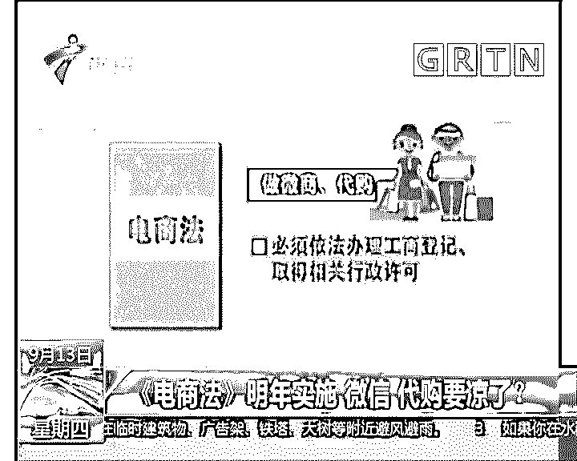

距离新《电商法》正式实施，只有 2 个月时间。

# 灰产圈整理《电商法》主要内容如下：

微商、直播销售等列入电商范畴

淘宝个体等需进行市场主体登记

 “刷好评”行为将被禁止

网络搭售商品不得设置为默认

“双十一”快递无限延期？不行！

“京东自营”“天猫自营”等应标明

擅自删差评，最高将处以 50 万罚款

电子支付出现问题造成用户损失的，应当承担赔偿责任。

下文将根据《电商法》围绕电商平台为大家讲述其中的灰色产业链！

# **电商公司“灰产”大起底**

   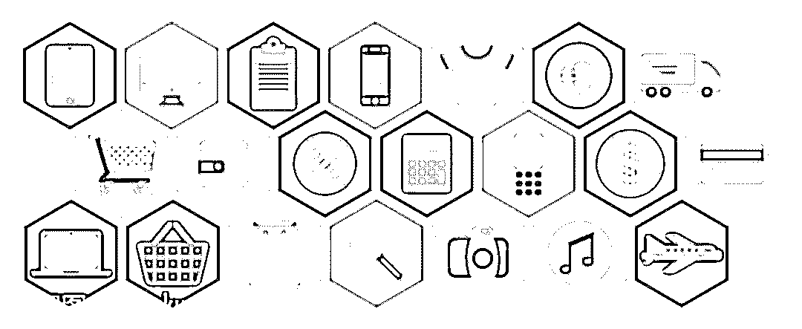

马云说过，在数据时代，完全可以搞计划经济了。 

当然，这个计划经济和传统的不是一回事儿。他想表达的是借助大数据这个工具，我们对这个世界的认识会提升到一个新高度，让计划和预判成为可能。

所以，阿里方面一直非常重视数据，马云口中，“大数据”“DT 时代”等概念经常出现。大量的用户交易数据，也是阿里对比其他互联网巨头的优势所在。

这本来是一件挺正能量的事，但接下来网友曝光的事件，对大数据来说多少有些讽刺。

键入“大数据”“杀熟”这些关键词，网上哀鸿遍野。

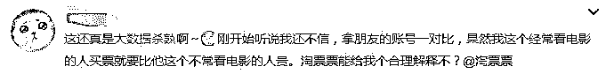

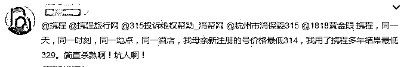

前段时间 飞猪大数据杀熟 事件引起媒体关注：

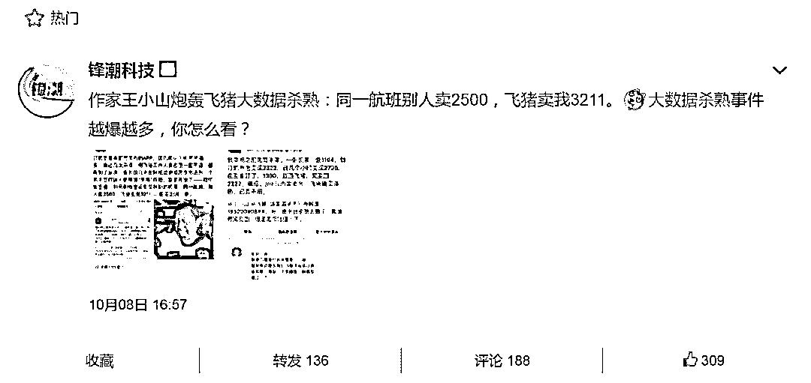

附：王小山微博截图

| 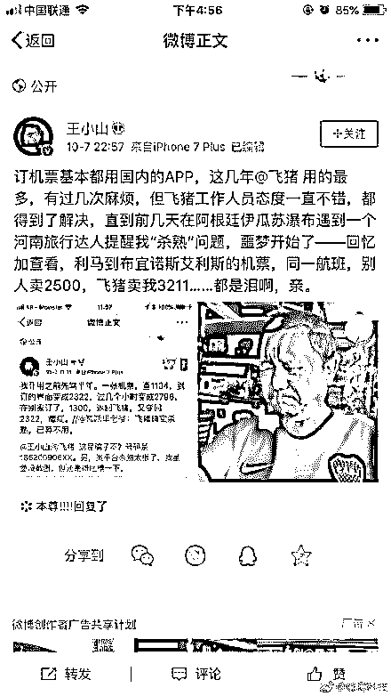 | 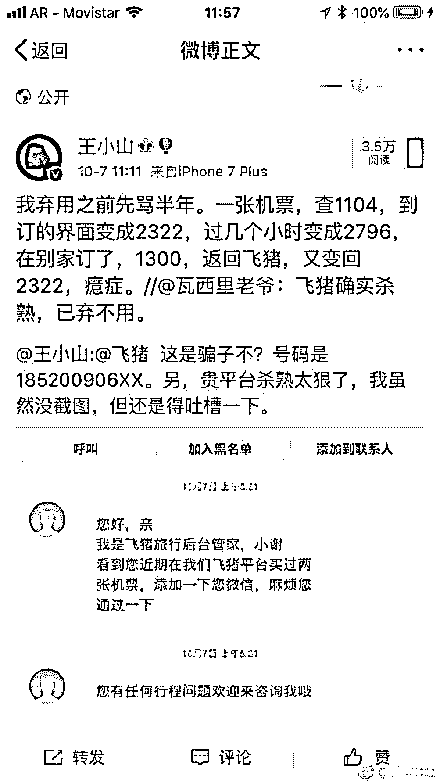 |

此外， 还有诡异的会员特权。 

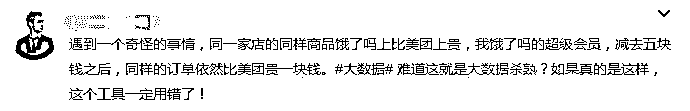

传统商业的时候大家的坑是一样深的，而在大数据时代，部分互联网平台倒掌握了“量人裁坑”的本事；除此之外，数据造假也成为了互联网的“特色”之一。

前几天，一篇标题为《估值 175 亿的旅游独角兽，竟是一座僵尸和水军构成的鬼城？》的文章刷遍了朋友圈和微博。

灰产圈就此事件也做出评论：

[**是谁捅了“马蜂窝”？2100 万"真实点评" ， 1800 万条抄袭，7000 个机器人刷量！**](http://mp.weixin.qq.com/s?__biz=MzIyMDYwMTk0Mw==&mid=2247493625&idx=1&sn=e1a90c75f28f0a2d0d5227c381baf6a4&chksm=97cb2cc1a0bca5d7a0ac4e9c36c8378e0c759d4751e8b990503fc7e89936c885ebec6a943615&scene=21#wechat_redirect)

爆料文章将“一字不差”作为抄袭的标准，发现了马蜂窝用户的 7454 个抄袭账号平均从携程、艺龙、美团、Agoda、Yelp 上抄袭搬运了数千条点评，合计抄袭 572 万条餐饮点评、1221 万条酒店点评，占到马蜂窝官网声称总点评数的 85%。

比如下面这张截图，账户 ID 为“问答小班长二号”在同一天发布了三条酒店点评，按评论内容，“小班长二号”不仅同时出现在了桐乡和南京，并且同时拥有老公和女友。

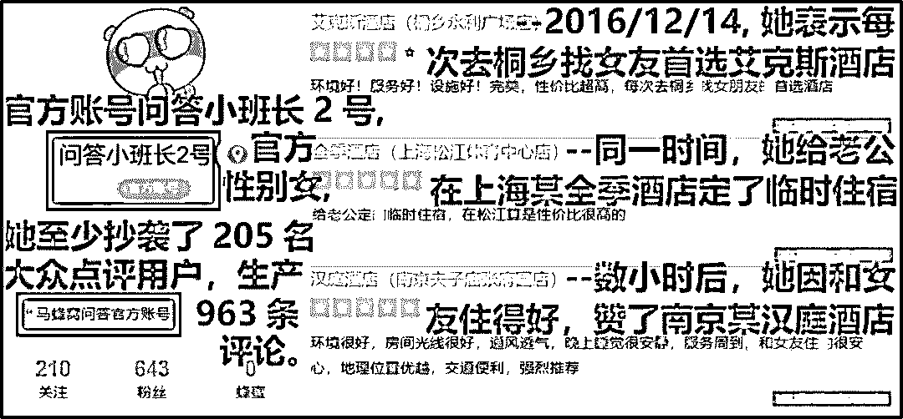

更尴尬的是，在抄袭 Yelp 时，马蜂窝直接调用了 Google 翻译接口，把翻译错误的地方通通抄了下来，整得文章到处都是病句，让人看着直犯尴尬癌。

而这样的例子并不少见。流量为王的互联网时代，造假、夸大，已经成为中国互联网的常态。

**电商行业“潜规则”**

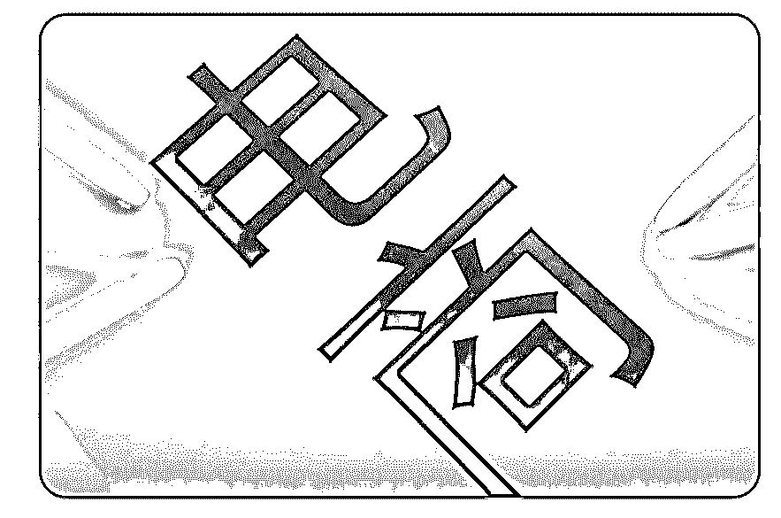

互联网成就了所谓的“大数据”，但实际上这些数据不乏人工改造后的垃圾数据。

近年来，电商行业的玩法越来越多，闪购、拼团、砍价等等，通过一个时间段内的营销活动，营造一种紧张、抢货的既视感，给平台带来销量。

与此同时，这也给了一些不良产业链带来可乘之机。

刷单、刷榜、刷钻、刷流量……可以是商家、平台自己做，也可以是第三方实施。需要与被需要之间，刷单公司、水军公司等等，一条灰色产业链就形成了。

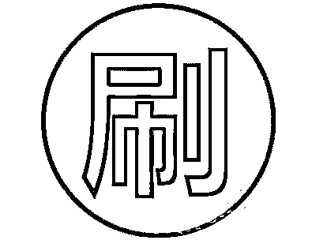

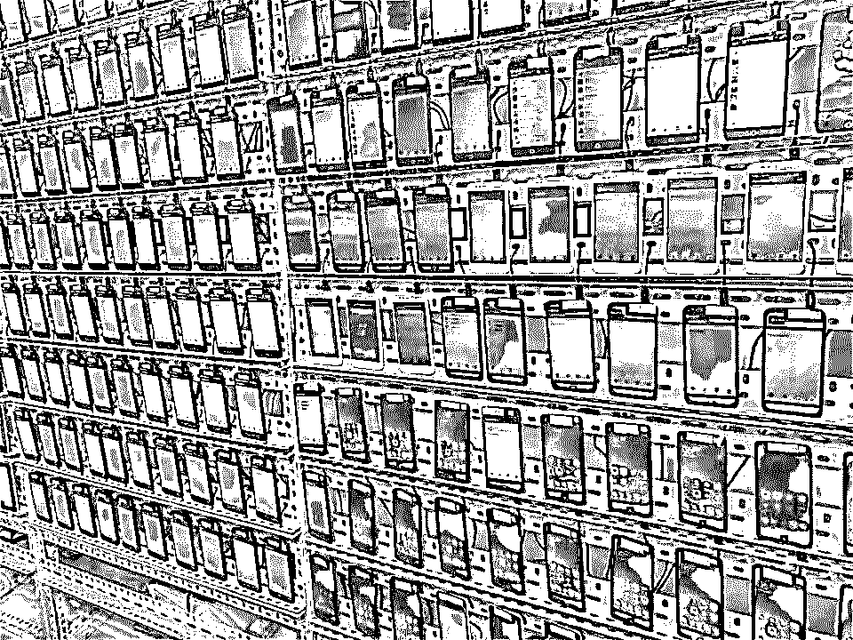

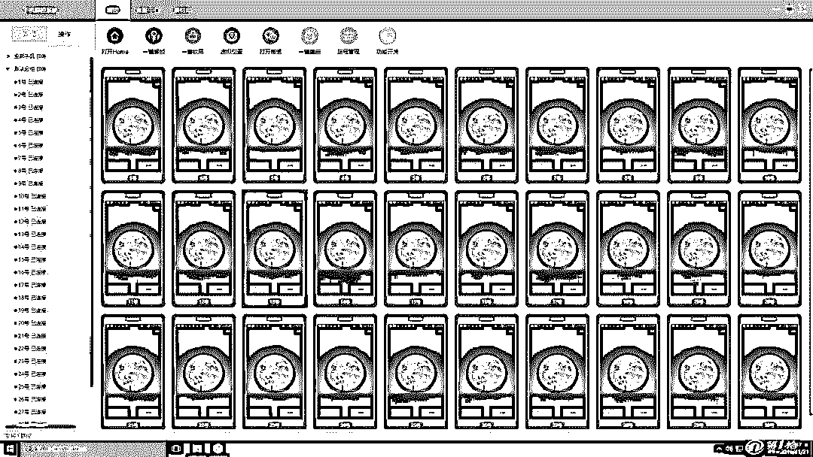

关于刷量，业内有个俗称——群控刷量。对于这个词，灰产圈有篇文章就非常形象地描绘了数据造假现场：

“嗡嗡嗡...”插座通电后，在一间间厂房和办公室内，几万台手机同时启动。 随着这几万乃至几十万几百万台自动控制的手机运行，在北京、在上海、在深圳、在中国各地诞生了一个个注册用户破百万的 APP、孵化出了一家家交易单动辄过万好评动辄 99%的电商公司....

灰产圈通过内部关系找到一家刷量公司，根据刷量公司的后台，我们发现，他们公司主营业务有：

零刷量后台：

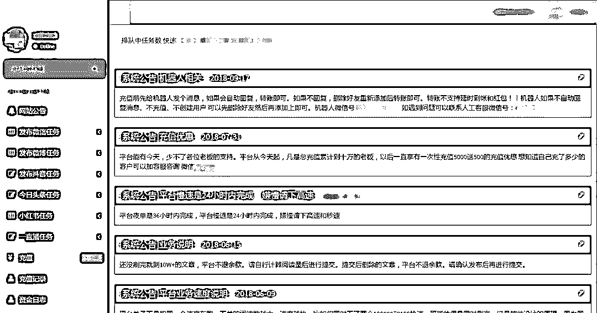

一微信

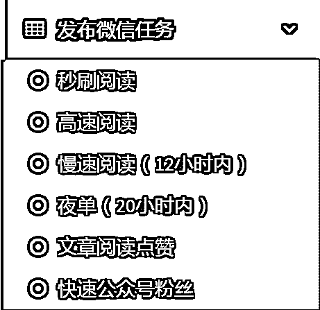

二微博

 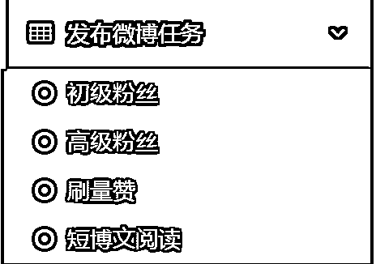

三抖音

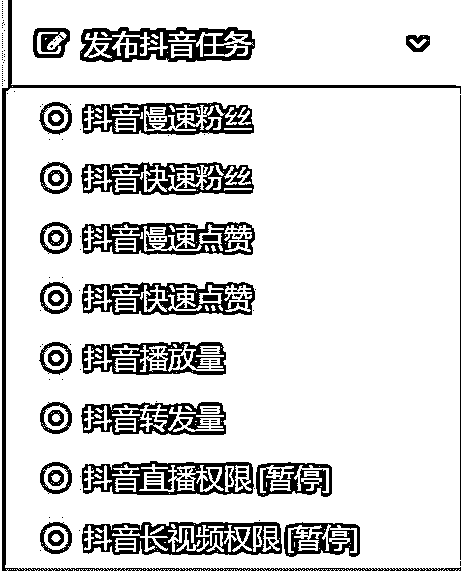

四今日头条

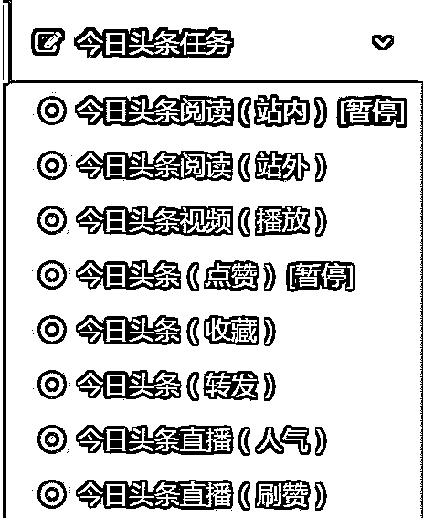

五小红书

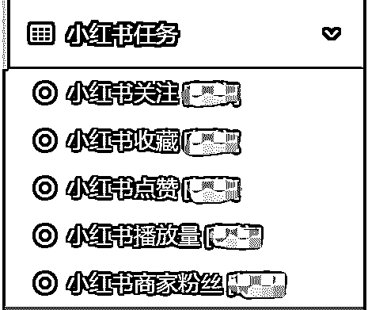

六一直播

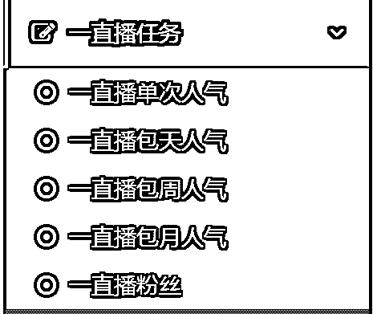

回到大数据“杀熟”这个话题

不同的用户对不同的产品价格有不同的敏感度，在平台大数据没有充分收集他的上网行为、购物模式等等各种数据之前，大数据也是无从下手。

而一旦吃准了该用户对某个价位的接受程度，“杀熟”就如手起刀落，快、准、狠。

譬如通过大数据，可以发现某些人会固定在某个平台购买某种服务，所谓这个电商平台的高粘度用户。

按照一般的逻辑，平台应该给诸如一些优惠券来回馈老用户，毕竟千金难买回头客。

但大数据已经证实了，这个用户的消费频次雷打不动，也不怕他货比三家，给了优惠券平台反倒少了些利润，既然这样，不如就趁机加点价吧。

平心而论，谁吃了哑巴亏心里不会堵得慌，想找个地方发泄一下，偏偏现在社交媒体这么发达，一人吐槽，能引发众人开怼，中国网友的强力吐槽可想而知，每人一口唾沫都能淹死你。

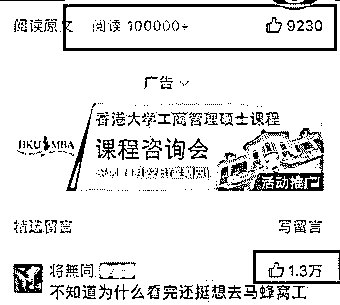

正如上回京东毫无征兆地上调小额订单运费，不满 49 元的订单收费 15 元，涨幅将近 3 倍，这种做法伤害的，却是 Plus 会员这帮京东最忠实的用户。

结果可想而知，得知消息后的用户反应激烈，京东也收到了大量投诉。

所幸京东懂得悬崖勒马，道歉加补偿及时遏制了会员流失。

可以发现，折腾了一圈，京东啥好处也没捞着，却落了个“店大欺客”的骂名，给了自己一记响亮的耳光。

# 除了淘宝、拼多多，这些公司也将受电商法制约

时隔不到一年，大数据“杀熟”已被列入违法行为之列。 

在新《电商法》暂未明确之前，派代报道了不少刷单违法等数据造假的案例，而在 9 月 1 号正式颁布之后，我们又提到了“电商要纳税”“刷单要纳税”“平台不得‘二选一’”“代购要凉凉”等。

这里，灰产圈还要划几个重点：

**第一**，大数据“杀熟”属于违法行为，除了个性化定价，消费者有权了解不针对个人的公共选项是什么。

新《电商法》第十八条规定：

电子商务经营者根据消费者的兴趣爱好、消费习惯等特征向其提供商品或者服务的搜索结果的，应当同时向该消费者提供不针对其个人特征的选项，尊重和平等保护消费者合法权益。

商家利用差别化定价来获取更高利润是合理的，但前提是不能剥夺消费者的选择权。要做到双赢，商家和平台就要为消费者提供更符合他们喜好的产品。

**第二**，滴滴、美团、携程、ofo 等平台，属于电商平台的经营者，受电商法制约。

作为被爆出大数据“杀熟”的集中地，像滴滴、美团、携程、ofo 等 O2O、OTA 平台，都属于电商平台的经营者，只不过淘宝、拼多多销售的是实物商品，而它们卖的是乘车、外卖或者酒旅服务。

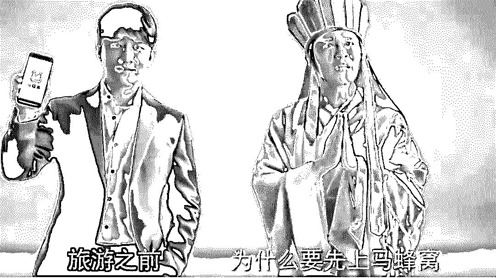

**第三**，商家售假，由向商家收取佣金或广告费的平台担责。

以社交电商为例，如果消费者在某电商 APP 上买到假货，那么该电商平台自然要承担责任；

但如果消费者是在这个电商平台的微信小程序上购买到假货， 这个电商平台照样要担责，但微信则不需要承担责任。

虽然微信这样的社交平台对社交电商的裂变增长功不可没，但也只是被立法者视为“其他网络服务”，不必为社交电商的假货问题负责。

**结 语**

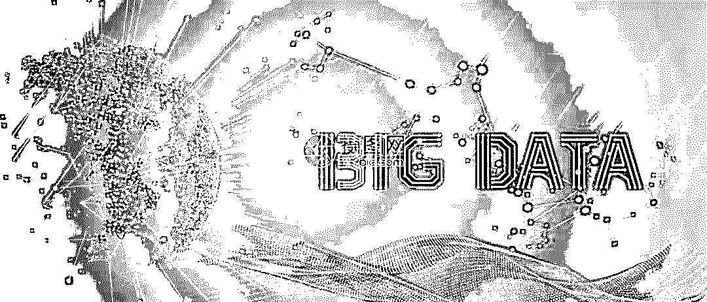

靠抓取数据，马蜂窝差点就熬成估值 175 亿的旅游独角兽。

但一山还比一山高，另一家公司通过数据抓取和分析，发现马蜂窝涉嫌抄袭大众点评、携程等网站的用户点评信息。

那些靠伪造数据骗得融资、骗得消费者的事迹，迟早纸包不住火。

业内人士透露，由于抄袭行为没有任何技术难度，甚至不涉及到数据库层面，就可以自动批量爬取页面，抄袭几乎就是行业的“明规则”。

2008 年，携程对去哪儿网站转载数万个页面携程信息提起诉讼。今年 7 月 28 日，小红书在其官微上声讨了大众点评抄袭其百万条笔记的行为。

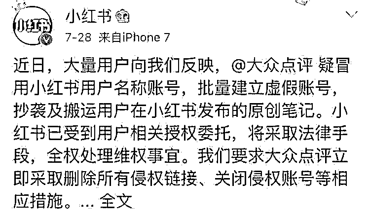

事实上，水军、爬虫、数据造假行为在整个内容生产领域都很常见。 

今年 7 月，公号“慢速公路”的写手橘子曾在微博上对蓝色光标进行公开质疑，认为他们为了挣客户的钱，利用假网红刷数据。

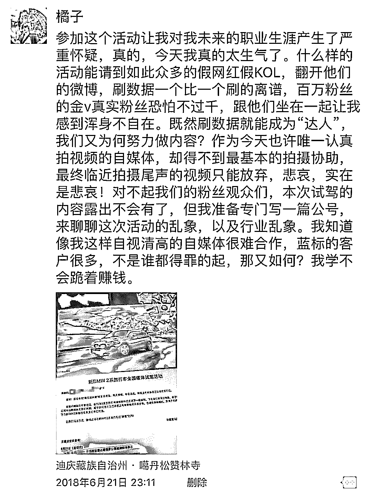

数据造假早已是微博、微信公开的秘密，这也就是腾讯整顿一次，大批微信阅读量暴跌一次的原因。

在这个人人高歌“流量变现”的年代，资本认流量，于是平台和自媒体都在疯狂买流量。在这场金钱博弈中，“粉丝”只是他们斗法的武器、装点门面的行头。毕竟坐拥一众僵尸粉、假内容，就能和资本玩得你侬我侬了。

而作为真正流量的我们——粉丝、消费者一脸无辜：我们原本仅是想看一篇好游记啊

●[互联网灰产攻击剖析：电商业小号战争](http://mp.weixin.qq.com/s?__biz=MzIyMDYwMTk0Mw==&mid=2247487953&idx=3&sn=c7ddd205d42f3113d1234fd1a5c0cb93&chksm=97c8dae9a0bf53ff2e8d9d2f93a20ef0aa36683467d7f7b23454b98b5a3ae1e4c8259530c0f3&scene=21#wechat_redirect)

●[淘宝开了一家大型网上“赌场”，无数人深陷其中家破人亡，但却合法！](http://mp.weixin.qq.com/s?__biz=MzIyMDYwMTk0Mw==&mid=2247489631&idx=1&sn=90408e3c8eb9c314cc991a22fdb181ce&chksm=97c8d367a0bf5a71575aa731aa1907377f64f1427091d63805cff964e020e5f4af4c0f67bea5&scene=21#wechat_redirect)

●[深度|2017 天猫双十一成交 1682 亿，刷单 800 亿？ 揭秘真实的刷单世界：有人赚了一辆法拉利！](http://mp.weixin.qq.com/s?__biz=MzIyMDYwMTk0Mw==&mid=2247489054&idx=1&sn=4144474a2229b0fa9c796df43dc45058&chksm=97c8dd26a0bf5430170ebdd82bef40c0ab0165d190daec669f416a6e2eacb13a0d474da267e2&scene=21#wechat_redirect)

●[流量之乱：谁在为互联网“顶级流量”买单？](http://mp.weixin.qq.com/s?__biz=MzIyMDYwMTk0Mw==&mid=2247492910&idx=2&sn=42482f4747dc2f4c036a7842a806ce49&chksm=97cb2e16a0bca7001a786f81fb911b47c3af10545fc301d900f98fff0a493d54af1fbdf0c74e&scene=21#wechat_redirect)

   

**点击加入** **灰产圈 | 高端社群**