# 是谁捅了“马蜂窝”？2100 万"真实点评" ， 1800 万条抄袭，7000 个机器人刷量！

> 原文：[`mp.weixin.qq.com/s?__biz=MzIyMDYwMTk0Mw==&mid=2247493625&idx=1&sn=e1a90c75f28f0a2d0d5227c381baf6a4&chksm=97cb2cc1a0bca5d7a0ac4e9c36c8378e0c759d4751e8b990503fc7e89936c885ebec6a943615&scene=27#wechat_redirect`](http://mp.weixin.qq.com/s?__biz=MzIyMDYwMTk0Mw==&mid=2247493625&idx=1&sn=e1a90c75f28f0a2d0d5227c381baf6a4&chksm=97cb2cc1a0bca5d7a0ac4e9c36c8378e0c759d4751e8b990503fc7e89936c885ebec6a943615&scene=27#wechat_redirect)

**点击上方蓝色字体“灰产圈”关注并置顶本公众号**

●导语●

今年世界杯期间，马蜂窝旅游网在广告上砸了 2 个亿，凭良心说，这则“为什么要上马蜂窝”的广告洗脑程度丝毫不亚于“拼多多”。8 月份，马蜂窝传出即将开启新一轮 3 亿美元的融资，完成后公司估值将达到 20 至 25 亿美元。凭良心说，这 2 亿花得真值。

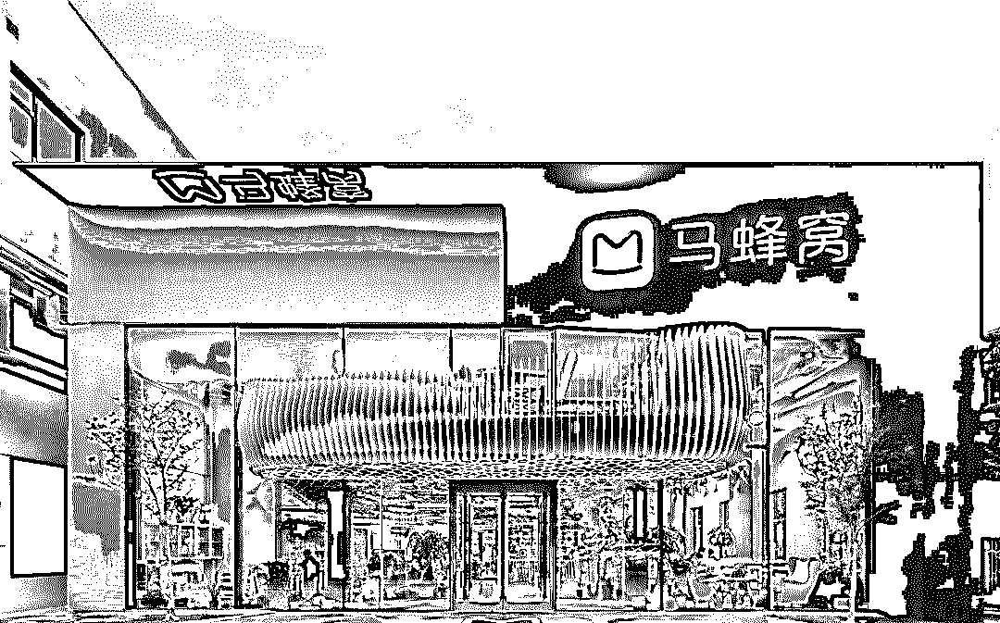

# **以用户内容起家、国内最大的自由行交易平台马蜂窝，这次被“捅”了。**

●马蜂窝用户评论被指超八成造假 ●

 

10 月 21 日，一篇名为《估值 175 亿的旅游独角兽，是一座僵尸和水军构成的鬼城？》的自媒体文章引发热议。

该文称，一家名为“乎睿数据”的团队，通过数据抓取和分析，发现马蜂窝上有七千多个抄袭账号，平均每个人从携程、艺龙、美团、Agoda、Yelp 上抄袭搬运了数千条点评。

合计抄袭 572 万条餐饮点评、1221 万条酒店点评，占到其官网声称总点评数的 85%。

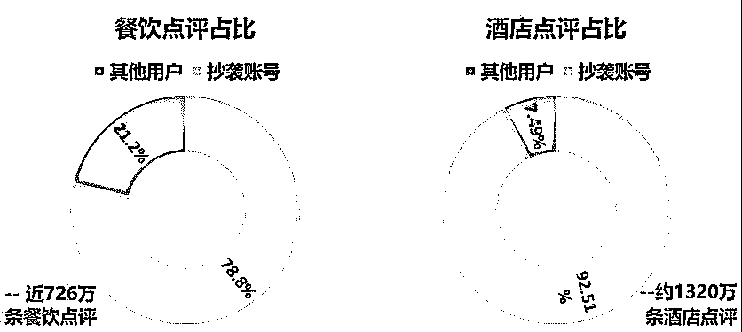

**图片来自“小声比比”**

该文称，抄袭账号出现了诸多自相矛盾的现象。如某账号点评内容显示该用户一天内同时出现在三地酒店，住宿对象也在男女之间切换。部分点评中出现捉奸、纪检处理结果等内容，被指不慎抓了不该抓取的东西。

该文称，这些抄袭账号除了贡献内容和活跃度之外，也活跃在各种官方抽奖之中，并屡次成为“幸运得主”。如一个节选式抄袭账号，连续中奖 12 次；一位发帖称抢到 2 次福利性质抢购的用户，被发现其 ID 为马蜂窝内部员工。

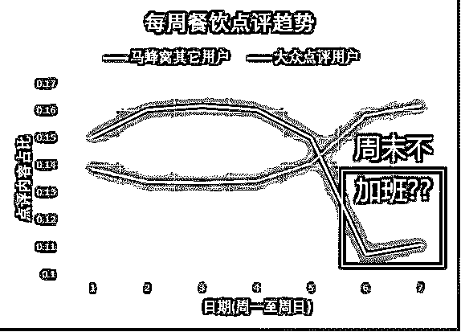

**乎睿数据公司发布的分析图**

在刨除了七千多个作弊账号后，该团队在所有账号中选择了 15000 个最活跃账号。发现这些账户在 2015 年中旬突然同时活跃，到 2016 年初又同时沉寂，出奇一致。

此外，该团队马蜂窝大部分用户集中在周内写餐饮和酒店点评，周末活跃度则断崖式下降。

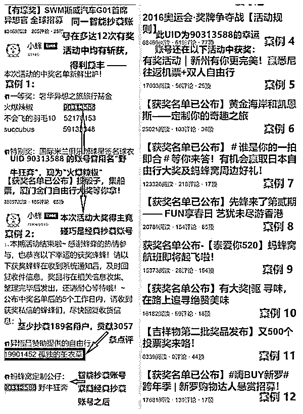

乎睿数据公司发布的案例图

该文调侃，马蜂窝的主流用户“是一群每天朝九晚五吃喝玩乐、在午晚饭以及周末干正事、能够同时出现在地球不同地方且反复切换性取向的人。”暗指马蜂窝账号造假。

马蜂窝官网称其目前有 2100 万条“真实点评”。

[`v.qq.com/iframe/preview.html?width=500&height=375&auto=0&vid=z07588vih9x`](https://v.qq.com/iframe/preview.html?width=500&height=375&auto=0&vid=z07588vih9x)

**马蜂窝用户评论被指超八成造假 爆料人：本意想用马蜂窝训练模型**

文章作者梓泉称，乎睿数据团队花了 4 个月时间做了马蜂窝的调查。文中得出马蜂窝“抄袭点评数量占 85%”的统计结论，先通过比对点评内容来找到抄袭账号，抄袭不同大众点评账号 150 条以上的账号算作一个抄袭账号，然后计算抄袭账号所发布的全部点评，占马蜂窝总体点评数量的占比。

梓泉解释其团队判定抄袭内容的标准：“第一是马蜂窝的内容，同时和多个来源重叠，总不可能这么多家抄一个人嘛，这个概率太小了。第二是存在大量外语翻译的内容。第三是人称指代前后冲突。四是点评的时间戳有人为修改痕迹。”

不过对于这份统计结果，有从事零售电商行业的网友认为其中存在破绽，“马蜂窝把内容当作社区运转的核心，积累了 8 年，却被先入为主地说成马蜂窝抄袭爬取对方数据，而大众点评此前被曝光爬取他人数据不止一回了。”

 马蜂窝回应：涉嫌假评的账号占比极少 

22 日上午，马蜂窝发布声明称，点评内容在马蜂窝整体数据量中仅占比 2.91%，涉嫌虚假点评的账号数量在整体用户中的占比微乎其微，马蜂窝已对这部分账号进行清理。

自媒体文章将不法商家的违规行为归结于马蜂窝，所述的马蜂窝用户数量，与事实和第三方机构数据严重不符。

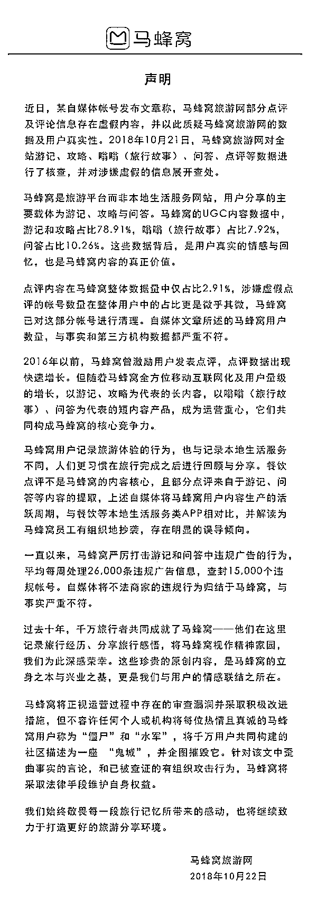

**马蜂窝公司的声明全文**

声明称，上述自媒体还将马蜂窝用户内容生产的活跃周期，与餐饮等本地生活服务类 APP 相对比，并解读为马蜂窝员工有组织的抄袭，存在明显误导倾向。

声明还称，针对文中歪曲事实的言论，和已被查证的有组织攻击行为，将采取法律手段维护自身权益。

此事被各大媒体转载后，也引来了网友的热议。有的表示对于这种事情见怪不怪。

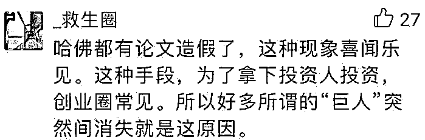

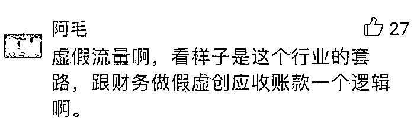

也有网友表示曾经受到马蜂窝的邀请，进行精华帖和翻译 Yelp 英文评论。 

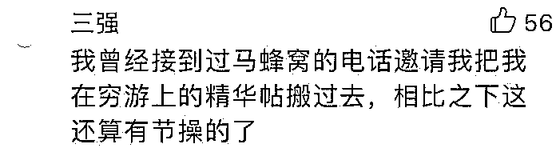

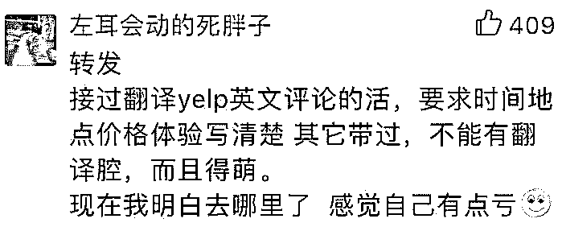

●数据造假已成圈内潜规则●

该消息对于靠用户游记起家，在官网上将 2100 万条“真实评论”作为自身“卖点”之一的马蜂窝而言无疑是“灾难性”地。虽然马蜂窝在沉寂“许久”后回应称：承认部分点评造假，已对涉嫌虚假点评的帐号进行清理，但文章内容片面，存在明显误导倾向。但实在算不上一份坦荡真诚的“合格声明”。

在携程系、美团、飞猪等统治在线旅游市场的现今，差异化竞争是以马蜂窝为代表的其他平台的唯一选择，而马蜂窝主打“真实”的旅游攻略分享定位在这次事件中，则堪称是被“精准打击”。平台数据在版权确权和维权的过程中有着天然优势，从这一点来看，马蜂窝在事件发酵后的一系列举动实在算不上“明智”，即便对于不提版权方面的问题，马蜂窝涉嫌抓取数据平台的举动也已经构成不正当竞争，后续恐怕将处于被动局面。

事实上，这些年在核心数据上“王婆卖瓜”的恶例并不在少数，且不说轰动业界的“艾瑞咨询高管失联事件”所牵出的数据注水、数据造假等问题，单单一个小红书上就曾经发生过类似的原创内容抄袭、盗取事件。

**图片来自网络，如有侵权请联系删除**

2018 年 7 月，有人反映自己在社区电商平台小红书上发布的原创内容被某点评盗取，该事件引起众多网友的不满。为此，某点评立刻回应称：，该盗取事件的发生是因为新上线试运营的推荐栏目在未经授权的情况下对相关内容进行了违规转载，另外，针对管理疏漏给小红书及相关内容作者带来的伤害深表歉意。并于第一时间删除了所有侵权的链接，关闭了处理了相关侵权账号。

但是随后小红书上的不少“大 V”又表示，在该点评 App 上看到了跟自己的小红书账号名称、头像、笔记内容一模一样的所谓"达人"账号，很多图片还被强制加上了水印。

此前的事件还有百度抓取大众点评用户评论，因不正当竞争被法院判处 323 万元赔款，之后又被马蜂窝用户投诉抄袭了自己的马蜂窝游记，最后的处理结果是将投诉涉及的 4 篇游记删除并封号。更早时候，豆瓣“足迹”团队抓取穷游的地理数据，最后 CEO 杨勃公开致歉并关停了“足迹”。

显然，在这场被誉为“互联网下半场”的战斗中，数据和流量已经成为各家争夺的主战场，单一客户的获取成本变得越来越高，而包括信息、行为、偏好、交际等用户数据则是大数据时代乃至物联网时代至关重要的“基础”。

马蜂窝不是第一个被质疑数据真实性的平台，也不是最后一个。旅游业也不是唯一一个被质疑的数据真实性的行业。

流量的红利期慢慢的过去，与之矛盾的是大数据时代的到来，让整个互联网行业对于数据的以来日渐沉重，无法回头。

而在视频行业里数据造假的情况同样存在，播放量就是网络视频的“收视率”。某种程度上来说，电影、电视剧、综艺等一些的视频的质量，在播放量没有造假之前，是与“播放量”呈正比的。我们现在看到的很多电影，质量平平但是播放量却是高的惊人，反而是那些高品质的作品，在这些虚假数据的强攻下黯然离场。

●结尾●

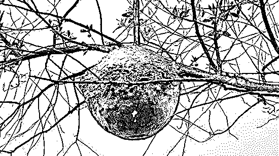

假作真时真亦假 无为有处有还无。

刷量，造假，水军，羊毛。

灰产圈报道过很多这类灰色产业链，有需求就有市场，有利益就有暗箱。

互联网上从不缺乏假大空，很多互联网数据的造假也是为了更好的上市，漂亮的数据是那个投资人都不能拒绝的。

那么互联网上从创造产品到刷量造假到融资以及再融资。

然后再创造新的产品线再往复循环，很多产品就是陷入了这个怪圈。

有媒体报道出来，那么水军公关大军就冲锋陷阵，热度过了之后，再做回真实地自己。

孰是孰非？那知那过？

在这个成王败寇的互联网时代，想赢？往往不择手段！

结束！

●[深度调查 | 微博明星高仿号背后的灰产江湖：数据造假，诱导诈骗，套路重重，暗黑无边！](http://mp.weixin.qq.com/s?__biz=MzIyMDYwMTk0Mw==&mid=2247489407&idx=1&sn=a0d172b4cffbdb11b1b19c8945f91d8e&chksm=97c8dc47a0bf55517054432bfd2bd994f24f780cadf074b8e00e96390403cc638bd4c0704c2f&scene=21#wechat_redirect)

●[大揭秘：神秘的 淘宝职业“打假人”  灰色产业链， 年薅“淘宝” 上亿羊毛。](http://mp.weixin.qq.com/s?__biz=MzIyMDYwMTk0Mw==&mid=2247488824&idx=1&sn=87de122c8ffb49dcfd4df5fa1f2872ca&chksm=97c8de00a0bf57168c3c6be6b71fb98b6d0507dc809a04148143cc9044065f1b5bf5c404130c&scene=21#wechat_redirect)

●[刷流量买热搜，揭秘演艺圈“流量担当”天价片酬背后的灰色流量产业链（深度长文）](http://mp.weixin.qq.com/s?__biz=MzIyMDYwMTk0Mw==&mid=2247490371&idx=1&sn=5cbba76c2759433f725610506551feec&chksm=97c8d07ba0bf596d4e944906a7ba1134d1d75a2cf5e5c2c01c7bdf717b2bddb900d4086aaeaa&scene=21#wechat_redirect)

●[深度|2017 天猫双十一成交 1682 亿，刷单 800 亿？ 揭秘真实的刷单世界：有人赚了一辆法拉利！](http://mp.weixin.qq.com/s?__biz=MzIyMDYwMTk0Mw==&mid=2247489054&idx=1&sn=4144474a2229b0fa9c796df43dc45058&chksm=97c8dd26a0bf5430170ebdd82bef40c0ab0165d190daec669f416a6e2eacb13a0d474da267e2&scene=21#wechat_redirect)

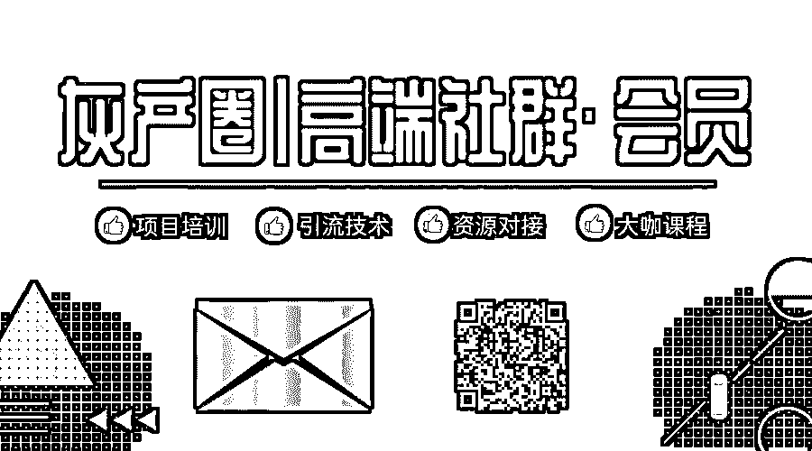   

**点击加入 ****灰产圈 | 高端社群**

# 

> 原文：[`mp.weixin.qq.com/s?__biz=MzIyMDYwMTk0Mw==&mid=2247493606&idx=1&sn=cd194c401a88d2bfba6417941eeb6c0a&chksm=97cb2cdea0bca5c8104f4f61e875d844bb3014c73117d73b073beec3b31447b401727b65d2f3&scene=27#wechat_redirect`](http://mp.weixin.qq.com/s?__biz=MzIyMDYwMTk0Mw==&mid=2247493606&idx=1&sn=cd194c401a88d2bfba6417941eeb6c0a&chksm=97cb2cdea0bca5c8104f4f61e875d844bb3014c73117d73b073beec3b31447b401727b65d2f3&scene=27#wechat_redirect)