# 黑产之源：从“实名漏洞”到“电信诈骗”，讲述“手机黑卡”的前世今生！

> 原文：[`mp.weixin.qq.com/s?__biz=MzIyMDYwMTk0Mw==&mid=2247493575&idx=1&sn=0d759a0e54cf87e93f0eb4473c1c37c4&chksm=97cb2cffa0bca5e911c38bb7c3b729cddb90d92c65c9953c699c43368cdfdf812e8305e7c6a1&scene=27#wechat_redirect`](http://mp.weixin.qq.com/s?__biz=MzIyMDYwMTk0Mw==&mid=2247493575&idx=1&sn=0d759a0e54cf87e93f0eb4473c1c37c4&chksm=97cb2cffa0bca5e911c38bb7c3b729cddb90d92c65c9953c699c43368cdfdf812e8305e7c6a1&scene=27#wechat_redirect)

**点击上方蓝色字体“灰产圈”关注并置顶本公众号**

●**导语**●

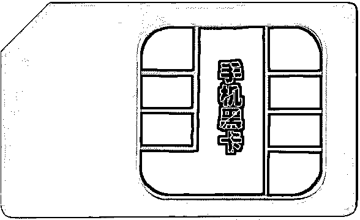

今年，广东潮州市警方抓获一个“黑卡卡商”违法犯罪团伙，现场缴获各类手机黑卡 60 余万张，联网设备等涉案物品一批。

据介绍，该团伙通过这一途径，注册各类网络账号 507 万个，涵盖微信、支付宝、京东等市面上主流网络平台，半年内非法牟利 800 万元。

而这只是黑卡产业链的冰山一角，在这背后，是一条每年在网络平台上套利超千亿元的非实名手机卡违法犯罪产业链。

以下是视频报道《广东警方缴获近 300 万张“黑卡”！铲除背后黑灰产团伙》

[`v.qq.com/iframe/preview.html?width=500&height=375&auto=0&vid=y1428i41lzw`](https://v.qq.com/iframe/preview.html?width=500&height=375&auto=0&vid=y1428i41lzw)

●**什么是手机黑卡**●

我们都知道，如今使用的手机卡都必须通过实名认证才能使用。

然而我们从某些渠道中还是可以买到一些非实名认证的卡，这种卡被大家称为“黑卡”。

为了利益最大化，手机黑卡往往被一种叫“猫池”的设备批量养着使用，通过这种设备手机黑卡即可连上通信网络，收发短信，且全程自动化，在秒杀活动中，速度远快于正常用户。

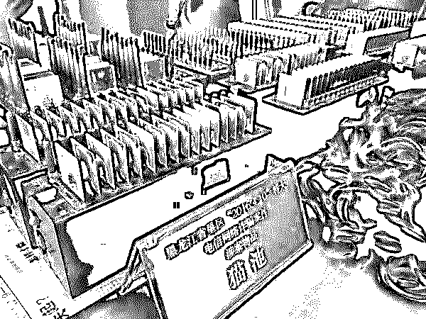

** 猫池**

●**手机黑卡从哪里来**●

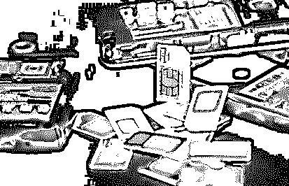

其实这些黑卡 80%都是物联网卡，物联网卡主要是用在工业、物流、医疗等各种领域的卡号，企业只要提供营业执照就可以办理，不需要进行实名认证，而且对于办理卡的数量也是没有多大限制，所以企业可以大批量办理这种卡。

一些黑卡灰色产业从事者就是利用这种方式，成立空壳公司去大量办卡。

●**大批量的开卡，如何解决实名问题呢？**●

黑市上有一种工具叫“虚拟二代身份证阅读器”，这种工具模拟真实的身份证阅读器，可将预定的身份证信息提交到运营商的实名系统，实现批量实名注册。

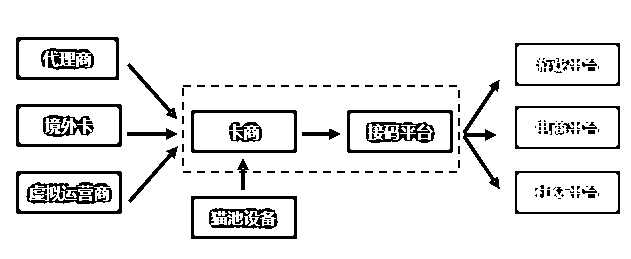

另外，黑卡还来自于一些实名卡以及海外卡。

实名卡主要就是来源于一些虚拟运营商，运营商可以为黑卡商贩提供大量的未实名认证的卡号，然后商贩再通过在网上购买身份信息进行批量实名认证，这样这类实名认证过的黑卡就制作完成了。

而海外卡刚更方便，由于海外卡也支持 GSM 网络，而且流入国内后可以直接使用，几乎 0 月租，免费收信息，利用这样的特点来做黑卡对于商贩来说是超高性价比的，这类卡一般来自东南亚的国家。

●**黑卡干了什么坏事**●

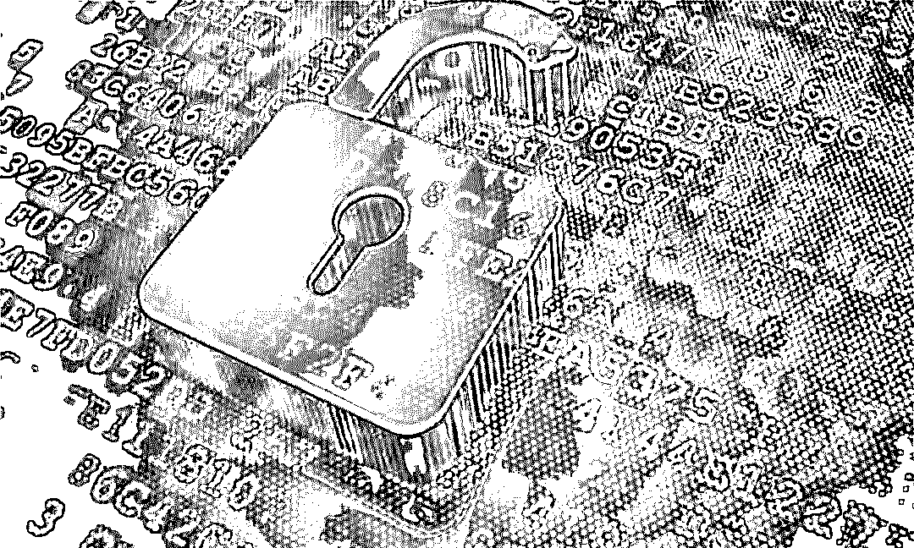

随着网络安全法的实施，监管对网络服务商提出了更高的实名要求，各类网络服务提供商对用户的验证，都基于短信验证码方案来实现。黑产要突破这一防线，需要大量的手机卡来接收验证码，有需求就有市场，黑市上也就出现前面说的接码平台。

有了接码平台，黑产人员就不需要自己去养手机卡了，通过接码平台的获取手机号 API 接口，就可以拿到别人猫池中养的手机号，黑产人员将手机号提交给各类网络服务商，再调用接码平台的 API 接口，获取验证码内容即可完成。

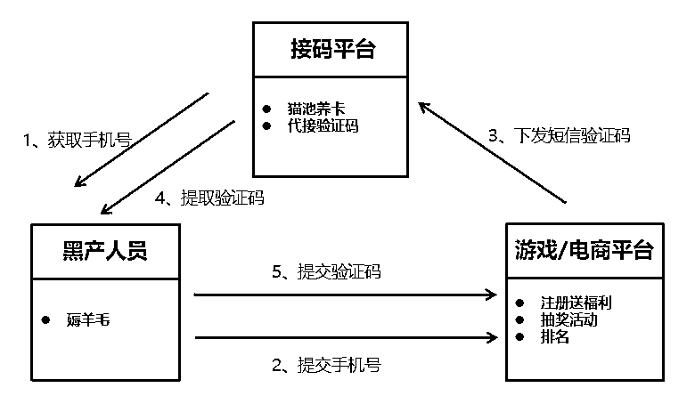

腾讯目前已经监控了多个主流的接码平台，通过对接码平台的数据分析发现，接码平台的手机黑卡，被黑产应用最多的场景依次是游戏、电商、虚拟币、邮箱等场景。

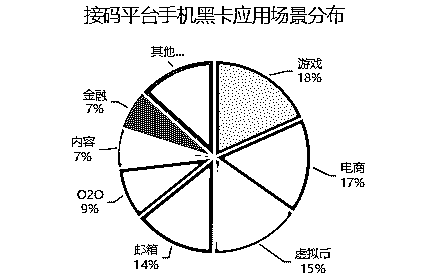

游戏和电商是互联网离钱最近的两个场景，自然也是黑产关注最多的两个场景。在游戏场景下，除了游戏帐号，还有游戏中的装备、游戏货币，比如 JJ 游戏的金币等都可以用来交易；而在电商场景下，各类薅羊毛活动更是数不胜数。

而与前几年的情况不同的是，最近越来越多的黑产人员利用接码平台的手机黑卡来炒虚拟币，比特币的造富故事吸引了国内很多创业团队开始了「造币」运动，各类虚拟币应接不暇。这些虚拟币的交易平台为了吸引用户，大都发起了各式各样的拉新活动，比如邀请注册成功后送币，黑产人员当然不会放过这「潜在暴富」的机会，利用接码平台注册帐号，用来屯币，一旦虚拟币涨价后就可以套现了。

**具体案例一：A 棋牌类游戏**

A 棋牌游戏（下称 A 游戏）设置了很多比赛，吸引了大量的用户参与，但参与比赛往往有金豆要求，在比赛过程中也会消耗大量的金豆，购买游戏帐号或者金豆成为部分 A 游戏用户的强需求。为了满足这些用户的需求，黑产人员通过接码平台注册大量的帐号，并且通过淘宝等渠道进行销售。

根据我们的监控发现，在过去一个月，仅某个接码平台，就有 20 万+的手机黑卡被用于接收 A 游戏的验证码，而且其他大部分都是被一个福建的团伙所使用。

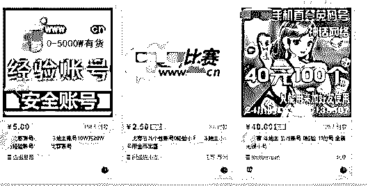

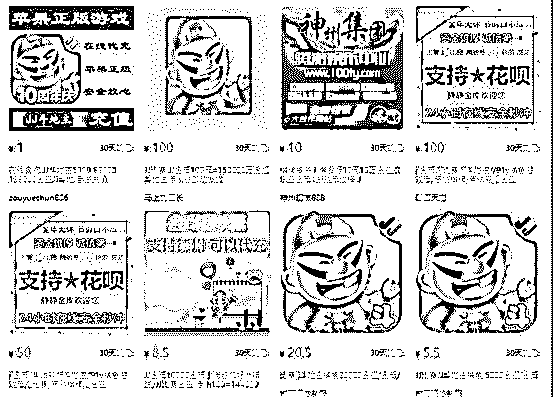

**具体案例二：B 虚拟币注册送币活动**

B 虚拟币交易平台，为了吸引用户，最近一直在做邀请好友注册送币的活动，据我们的监测，在某个接码平台，一个月有超过 15 万的手机号被用于该平台的新用户注册，以每条 0.2 元的成本计，黑产在这个接码平台上一个月就投入了 3 万。

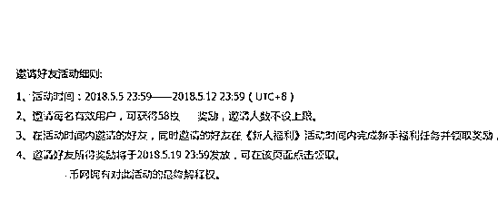

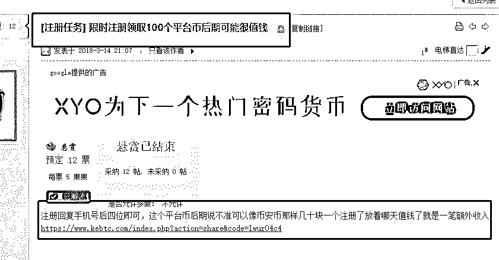

**总结：**

灰产圈调查发现，目前黑卡“闷声发大财”的途径主要有二：

**一是注册“僵尸账号”套利。**

灰产圈调查发现，某品牌在网上开展“新注册用户送 10 至 15 元抵用券”活动。犯罪团伙利用黑卡，以 0.2 元的单价批量注册 1 万个新用户，拿到厂商优惠后，再低价转卖，一次就能获利数万元。

灰产圈在某知名电商平台上搜索发现，各类“优惠券”相关页面有 100 多页，京东、美团、滴滴等悉数在列，卖家均宣称“下单付款后优惠券即刻到账”。

京东金融研究院、中国人民大学金融科技与互联网安全研究中心、中国刑事警察学院共同发布的《2018 数字金融反欺诈白皮书》显示，市面上 70%多的促销优惠最终流入黑卡产业链，规模不低于 1000 亿元。

这些资金最终流向产业链上下游的黑卡“卡商”、批量注册账号的系统服务商和实施网络套利的不法分子的口袋。

**二是卖微信号。**

白号、老号、站街号、解封号……在互联网上，兜售微信号的平台比比皆是，这些“圈内行话”代表着微信号不同的“等级”。

“时间越久、功能越全的微信号越值钱。”某微信号专卖从业者透露，其价格从 30 到 180 元不等，“如要绑定银行卡，那价钱能到 300 多元。”

●**黑卡是如何流入市场的呢？**●

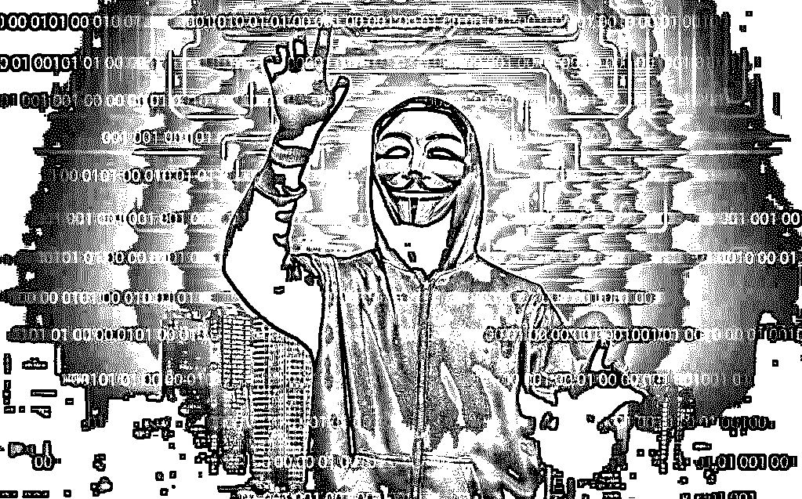

灰产圈以买卡为由，联系上一位自称是虚拟运营商一级代理商的卖家，在他的微信朋友圈里可以看到，最近半年来他几乎每天都更新着各类非实名卡的信息。

“十张起售，百张以上就是批发。”在了解灰产圈需求后，该代理商向灰产圈推荐了中麦通信的一款能接收短信的手机卡，称“不需要实名，买来就能直接用，公司提供售后服务。”

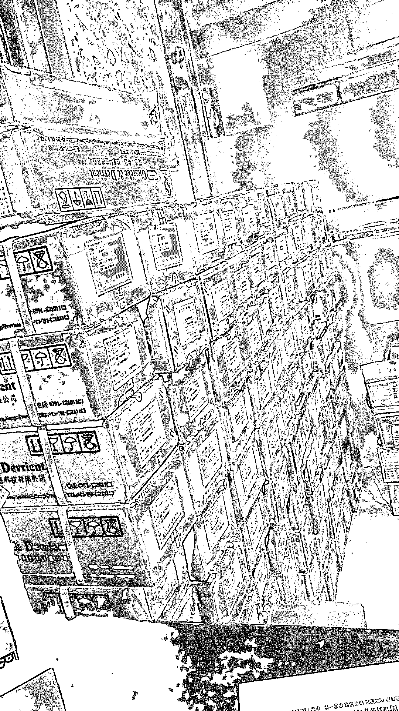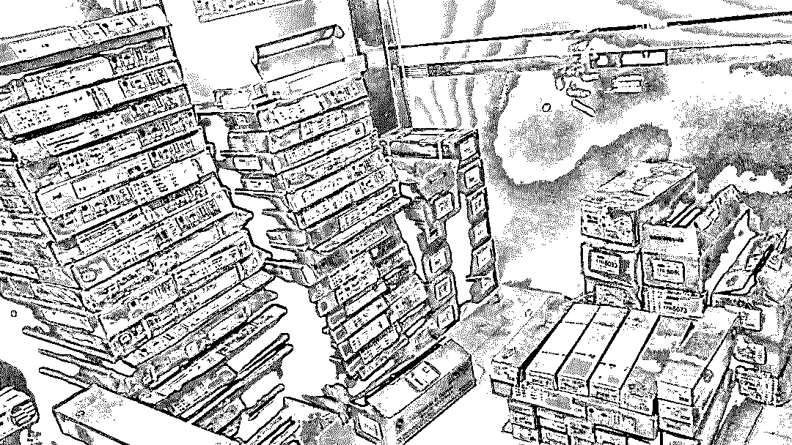

**代理商向我们展示的“黑卡”库存**

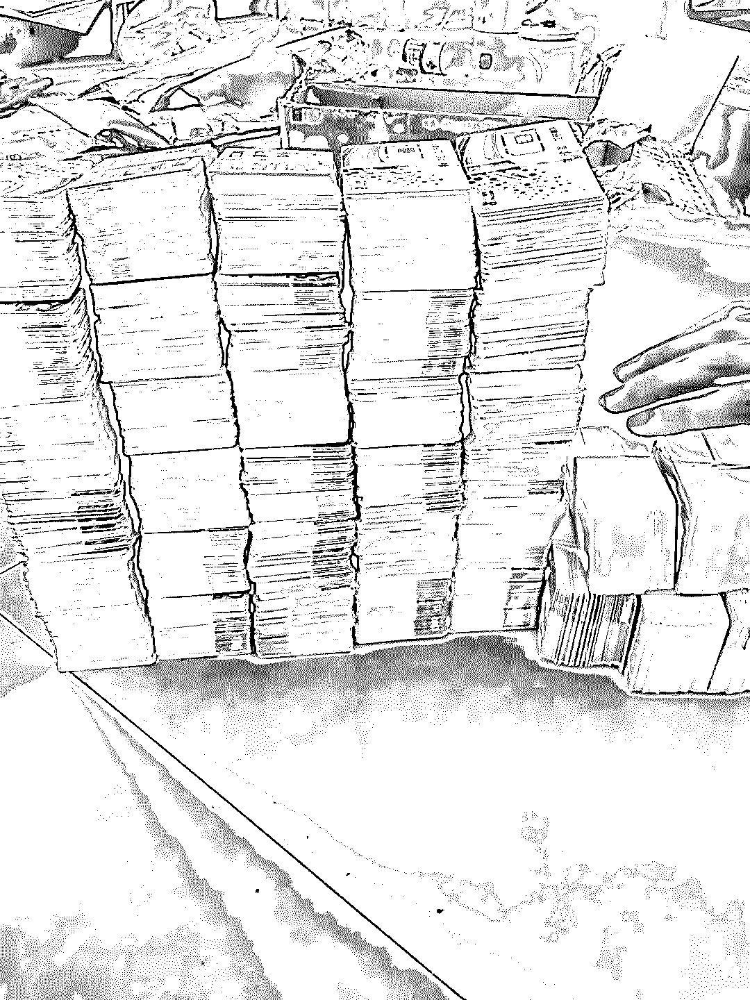

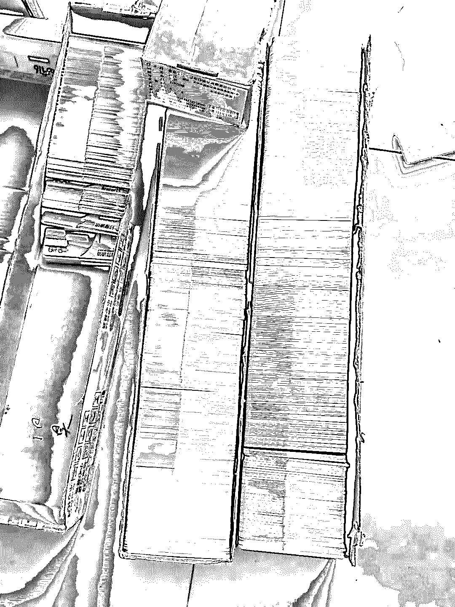

**代理商向我们展示的“黑卡”**

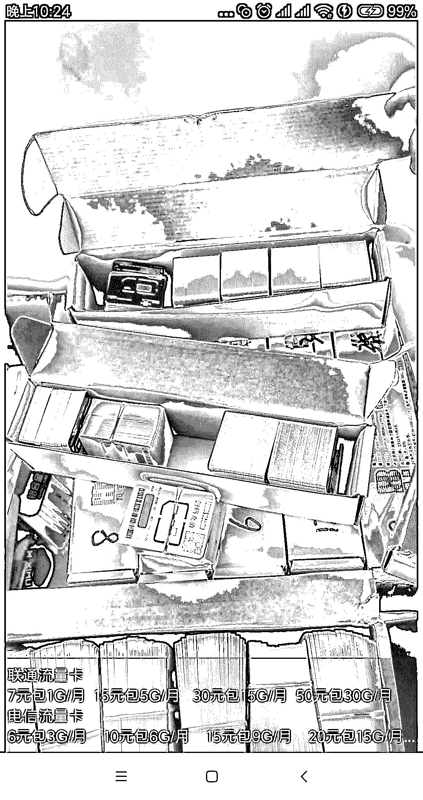

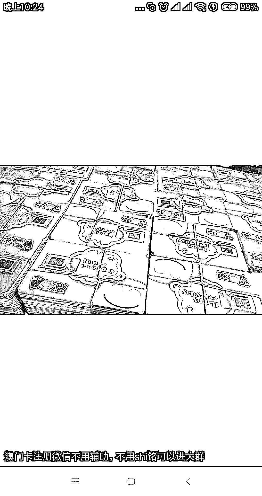

**代理商朋友圈截图**

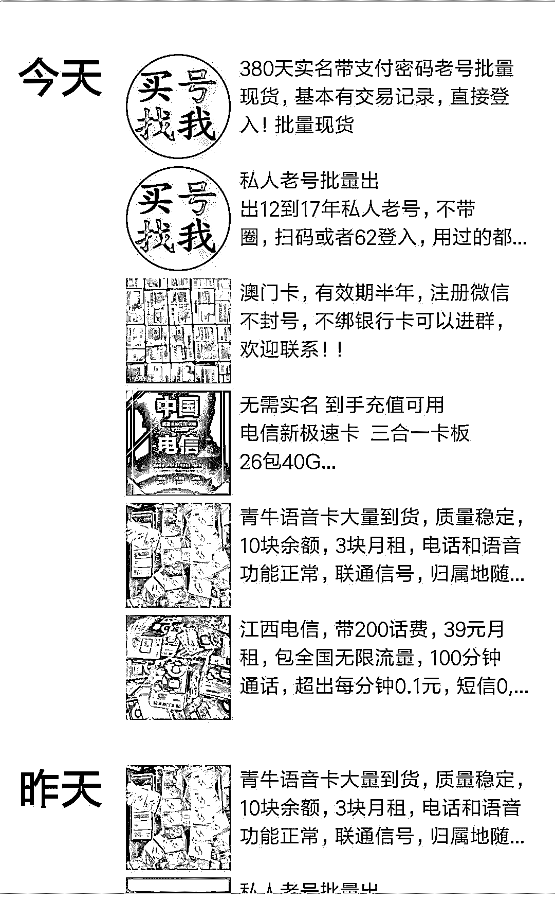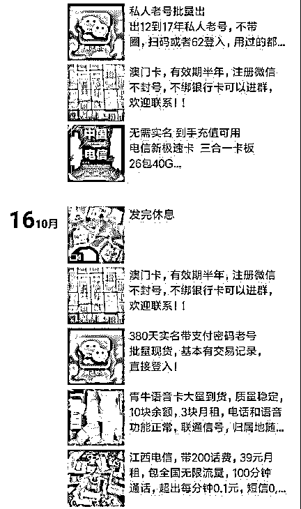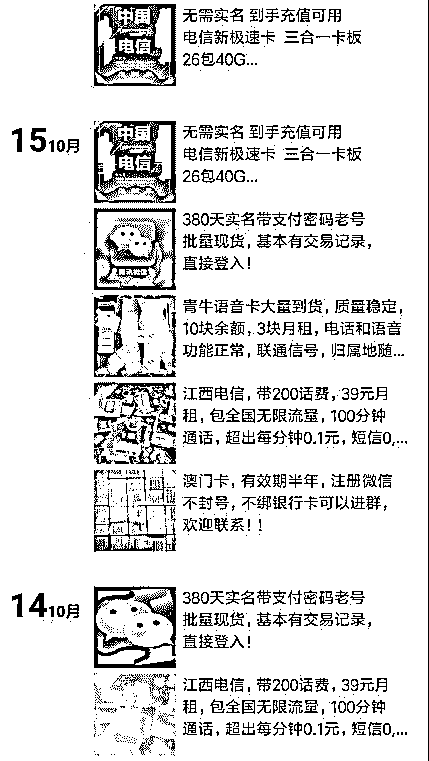

**代理商朋友圈，据他所说，他是一级代理，专做批发**

在交流中，该代理商坦言最近风声比较紧，但这种只能接收短信的卡问题不大。据他透露，他都是从虚拟运营商的销售经理处拿卡，“这些人挂着公司的名，主要靠卖卡提成牟利。”

中麦通信在官网中明确标明，在购卡及办理移动电话入网时，需要用户本人手持身份证件拍照登记。然而，灰产圈在没提供身份信息的情况下，便从代理商那里拿到了 5 张中麦通信的手机卡。

这些卡看上去与一般手机卡没有任何区别，能正常接收短信。灰产圈用其中一张卡成功注册某知名外卖平台，随即收到一张价值 15 元人民币的新用户优惠券。

2013 年底至今，先后有 42 家企业获得移动转售临时牌照，成为电信虚拟运营商。电信分析师付亮介绍说，长期以来，由于实名制监管环节存在薄弱点，虚拟运营商的一些号段甚至成为公众眼里的“诈骗专号”。

●**黑卡的负面影响**●

1

**黑卡大量存在于社会给增加违法犯罪事件，特别是电信欺骗类犯罪。**

因为这些黑卡大部分都是未经实名认证，规避了国家的监管，这样一些人就会利用黑卡大量散布垃圾、诈骗信息，不仅影响了人们的生活，而且还会威胁到人们的财产安全。同时，也导致个人身份信息泄漏的现状进一步严重，严重影响着个人的信息的安全。因此，黑卡的存在事实上造成了很多的安全隐患。

2

**黑卡的存在造成了企业的经济损失。**

大量“薅羊毛”一族通过黑卡从各个举行优惠活动的公司获取利益，使企业的活动发挥不出真实的效果，从而导致经济的损失，对于一些公司的发展来说是十分不利的，大量这样的情况存在，则会影响整个社会的经济发展。

3

**影响着社会诚信体系的建设和秩序。**

利用黑卡进行的刷单、刷粉、刷评论等各种非诚信行为则助长了社会的坏风气，使人们在进行各种活动行为时都会想到利用虚假的操作来达到相关目的，而非努力实干，长此下去，则会磨灭掉人与人之间的诚信，整个社会的诚信体系则会崩解，最终就会在恶性循环下，影响到社会的各个方面。

●**结尾**●

黑卡流入导致的下游违法犯罪之所以屡打不绝，很大原因就在于“上游的非法获取源头难挖、中游的非法买卖环节难打”。

如果不堵住源头，这些黑卡会为各类网 络违法犯罪活动提供源源不断的‘子弹’。

筑牢手机实名制的基础，关键还在电信运营商。

“手机黑卡”的存在为诈骗电话，短信以及羊毛党和微信产业链制造了温床，让这些产业得以发展壮大。

“手机实名制”下是否真“实名”？

这条路任重道远！

**参考资料：**

新华网《用手机“黑卡”注册账号 上千亿元流入非法产业链》

公众号“腾讯防水墙”《手机黑卡，这个仇我是记下了》

●[手机黑卡，这个仇我是记下了！](http://mp.weixin.qq.com/s?__biz=MzIyMDYwMTk0Mw==&mid=2247492373&idx=2&sn=5c7b3f848cfa8936882c4fcc244d04f6&chksm=97cb282da0bca13b06ddd90ac408a800fef7c9e9834a888b9e1455b361b898df094b2c1149fe&scene=21#wechat_redirect)

●[任意修改号码？你接的“官方来电”可能都是黑产诈骗......](http://mp.weixin.qq.com/s?__biz=MzIyMDYwMTk0Mw==&mid=2247493302&idx=1&sn=80bad76e732bf1a19f6f75459f9bb658&chksm=97cb2d8ea0bca498d244bbe3bf984659f8b401ece280b4ae1fff466166e6d664a413be9db418&scene=21#wechat_redirect)

●[起底 Steam 背后黑色产业链 : 黑市、洗钱和诈骗，年产值十亿美金！](http://mp.weixin.qq.com/s?__biz=MzIyMDYwMTk0Mw==&mid=2247492432&idx=1&sn=8287cae2c3fe28530c4f274bff47523d&chksm=97cb2868a0bca17e129b1a7a177dab6e697b4530cffc47928ce2fdd00d6b8b6c5ec743112b44&scene=21#wechat_redirect)

●[深度|薅羊毛黑产攻防实录：“羊毛党”与“攻城狮”之间的博弈游戏](http://mp.weixin.qq.com/s?__biz=MzIyMDYwMTk0Mw==&mid=2247489704&idx=1&sn=fd723f4a71b42686451bce2641707a67&chksm=97c8d390a0bf5a8659576c4f7fa98f6c43942f61a32de88f9818a6f61f990325ba04964294b9&scene=21#wechat_redirect)

   

**点击加入 ****灰产圈 | 高端社群**