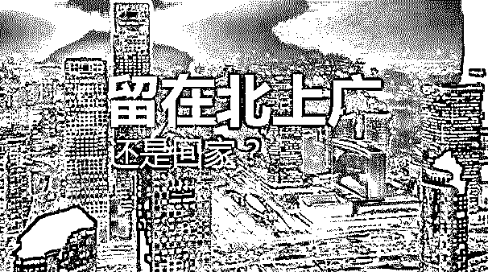
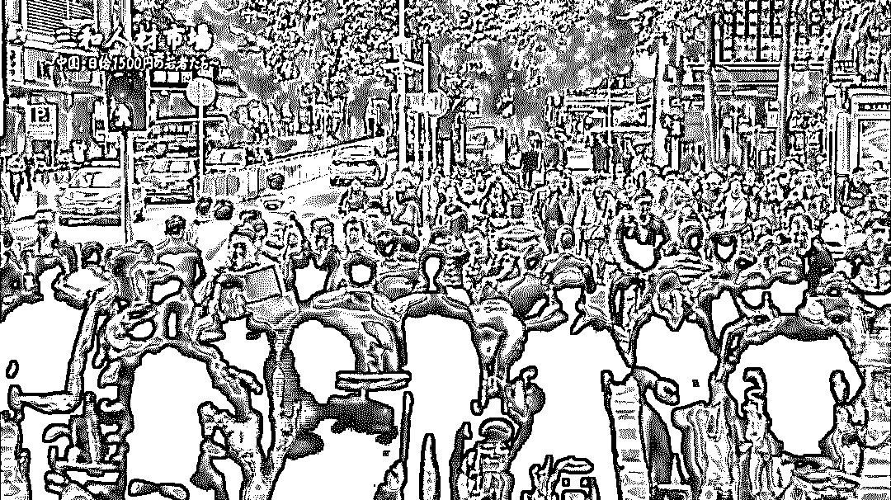
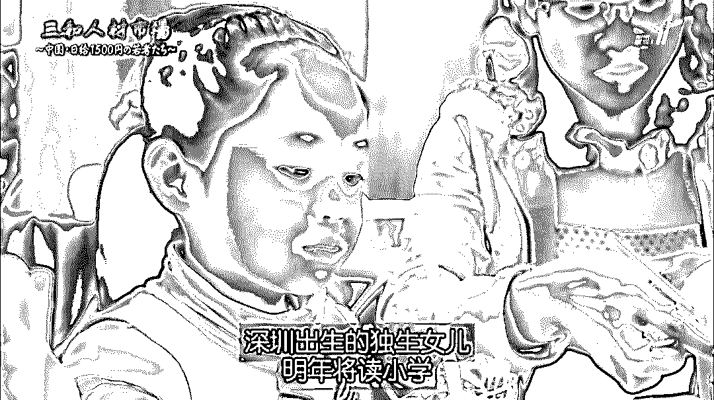

# 全中国最堕落的地方，这里聚集了一群「三和大神」：日结一天的工资，阔以玩三天 ！

> 原文：[`mp.weixin.qq.com/s?__biz=MzIyMDYwMTk0Mw==&mid=2247493563&idx=1&sn=64a31f6c1e65df54ccfdd5faf83c77ec&chksm=97cb2c83a0bca595407f4d449d28064c1453ba9b6e0da5b94d0ace6481c2f992202eb5d461c8&scene=27#wechat_redirect`](http://mp.weixin.qq.com/s?__biz=MzIyMDYwMTk0Mw==&mid=2247493563&idx=1&sn=64a31f6c1e65df54ccfdd5faf83c77ec&chksm=97cb2c83a0bca595407f4d449d28064c1453ba9b6e0da5b94d0ace6481c2f992202eb5d461c8&scene=27#wechat_redirect)

**点击上方蓝色字体“灰产圈”关注并置顶本公众号**

导语

北上广深这样的一线大城市，生活节奏快，生存压力也越来越大。

有的人选择在此扎根，为了明天而打拼；

也有人选择逃离，回到老家过上了安逸日子。

就在大家纠结留下还是逃走的时候，深圳还有这么一群年轻人。

他们没有工作压力，开心就去上班，不开心就炒老板的鱿鱼。

不必考虑生活成本，也不对未来感到迷茫忧愁，更不为车房孩子的问题而烦恼。

他们是“人生苦短，及时行乐”的积极实践者，每天过着“逍遥快活”的日子。

你以为他们是家缠万贯的“富二代”、“拆二代”？

不，这个群体有一个更为响亮的名号，叫做“三和大神”。

三和大神，指的是聚集于深圳市的三和人才市场旁边打日结零工的“游民无产者”，由于他们往往年龄较小，熟悉互联网文化，所以通过网络创造出了属于自己的一整套亚文化符号系统。

 中国日结 1500 日元的年轻人们

就在前不久，日本 NHK 电视台就扛着摄影机来到深圳，记录了这群大神们的真实生活——

《三和人才市场 中国日结 1500 日元的年轻人们》

三和，是坐落在深圳龙华区的一家人才市场。

作为中国的“硅谷”，深圳吸引着全国各地的青年来此寻求机会。

三和人才市场，也成为了年轻人们找工作必经的中转站。

但是在这里，偏偏有那么一群“大神”，对生活没有目标没有动力，甚至不想改变自己的生活。

他们厌弃长期工作，只做日结的零工；

而且钱少的不干，太累的不干。

今朝有酒今朝醉，明日愁来明日愁。

日结一天的工资，阔以玩三天。

这是三和人的精神信条，谁做了长期工作，那就是对“三和精神”的背叛。

在外人眼中，他们是一群游手好闲、不愿通过努力来改变生活现状的懒惰之人，不值得同情。

但事实是这样吗？未必。

每一个打工者最初来到三和的时候，或多或少都还有着改变生活现状的斗志和决心。

成百上千的外来务工者汇集在这里寻找营生，招聘方提供的大都是无需太高学历的底层工作。

　　

工作当场敲定之后，一大波被录用的人拿着行李就坐上大巴去往工厂。

　　

　　包吃包住，一个月 2000 多块钱的基本工资，这样的待遇轻易地就吸引了众多打工者。

　　不过还有很大一部分人，就算没钱也不愿意干这种活。

　　他们只想做日结的临时工，大体有三个求职标准。

　　

　　1\. 轻松不累，无需卖力

　　2\. 工资高，开张吃几天

　　3\. 来钱快，可以随时撂挑子走人

　　没错，看上去非常不靠谱，但这就是这些人对待工作的态度。

　　丧失斗志，得过且过，四处为家的他们，就叫做“三和大神”。

　　

为什么称之为大神，是因为他们仿佛已经看破红尘，宗旨就是：“混过今天，不想明天。”

　　干一天，玩三天，这是他们的生活常态。

　　因为三和这边生活成本低，日结百元足够支撑他们吃喝玩乐住的开销。

　　吃的是几块钱的挂逼面。

　　

　　喝的是 2 块钱 2 升的清蓝矿泉水，俗称大水。

　　住的是旅馆里 15 块钱的床位，被褥脏乱，厕所恶臭。

　　

　　更省钱的办法就是干脆睡在路边或者公园长椅，与蚊虫鼠蚁为伴。

　　不想半夜被警察吵醒抓进局子里，只要找准一个隐蔽的位置就好。

　　玩的是网吧里的网游，或是上黄网*河蟹*，1 块钱 1 小时，10 块钱即可通宵。

　　

　　现实中糟糕透顶的时候，大神们还能在虚拟的游戏世界里谈恋爱结婚。

　　你会发现，哪怕他们穷得几天没饭吃，甚至把身份证都便宜卖了，身上也带着台智能手机。

　　

　　破烂的旅馆哪怕没有 24 小时的热水，也一定有 24 小时的 wifi。

　　看着他们聊着微信，打着王者荣耀，有些时候和普通的年轻人也没什么区别。

　　

　　然而，原地踏步停滞不前的大神们，早已与快节奏的社会和时代脱节。

　　他们从外省农村来到这座梦之城，难道只为在异乡流浪？

　　当然不是。

　　大家之所以能大包小裹的奔赴深圳，就算没有出人头地的大梦想，也会有赚钱养家小目标。

　　

　　每个大神在最开始的时候都有过在大工厂上班的经历。

　　进厂就必然意味着加班加点，27 岁的宋春江对此深有体会。

　　他去富士康当过流水线工人，上头讲究速度，追求效率，他一天要给差不多 3000 台苹果手机打螺丝。

　　

　　一天之中，私人时间只有 7 个小时，吃饭睡觉冼衣冼澡全算在这里面。

　　沉重的压力，非人性化的制度，让工人们苦不堪言。长时间下来，工资没挣多少，身心却垮了，自杀也就不足为奇。

　　可是对于大企业来说，一个人跳楼的闷响，还不如一颗螺丝落地的声音大。

　　反正总有人会顶上来，领导才不顾他们的死活。

　　再看宋春江的朋友赵伟，打工好不容易攒下了小十万块钱，网络赌博却让他输得倾家荡产。

　　

　　承受几年的打击与煎熬，他们自愿放弃了曾经的理想。

　　因为这里没有留给他们的希望，现在没有，未来也没有。

　　房价飙升，贫富差距扩大，富人越来越富，穷人越来越穷。

　　马云按秒赚钱，他们按天赚钱。

　　

　　

　　开着宝马车去吃早餐的老板可以一张嘴就把整个店包下来，只为开除一个态度不好的服务员。

　　见到此情此景，有人不禁感叹：和有钱人一比，自己活得像个奴隶。

　　即便拼死拼活，也就解决得了温饱，改变命运提升阶级什么的简直难于上青天。

　　就拿一代劳动者老陈举例，他早年在牛仔裤工厂因机械事故失去了右臂。

　　

　　事已至此，怨天尤人是没有用的。

　　意志坚强的老陈用区区几万块赔偿款开起了早餐店，和爱人结婚有了女儿。

　　虽然日子过得红火起来，但老陈清楚，自己永远是这个城市的过客。

　　大人没有本地户口不要紧，但小女儿享受不到社会保障，还面临着没书可读的问题。

　　

　　当地的学位有限，竞争激烈，入学的名额都是按顺序排下来的，而老陈一家是深圳的第六类人，可以说机会十分渺茫。

　　距女儿上小学的时间还有一年，老陈也只能听天由命，不知如何是好。

　　

　　这正应了大神宋春江提起的那段属于打工者的顺口溜。

> 远看广州像天堂，近看广州像银行；到了广州像牢房，不如回家放牛羊。
> 
> 　　个个都说广州好，个个都往广州跑；广州挣钱广州花，哪有钞票寄回家。

　　每个光鲜的城市背后，都有这样的辛酸总结。

　　没了人生动力的三和大神，如同行尸走肉一样在世间游走，在这条不归路上渐行渐远。

　　片尾，觉醒了的男孩东东坐上火车，去找姐姐从事美发行业。

　　

　　挣扎中的大专辍学者陈勇在一蹶不振和珍惜时光之间徘徊。

　　

　　宋春江等人仍选择做个大神，在浑浑噩噩中度日。

　　摄制人员问他：“有没有想过老了怎么办？”

　　“老了……死了就死了呗。”他无奈又笑着回答。

　　

　　其实他们自己也为浪费生命，无法回报亲人的做法而羞愧。

　　可惜，死了心的他们再找不回奋进的那股劲。

　　蹉跎岁月成了仅剩的出路，那是他们用最后一点资本对残酷现实的消极抵抗。

这部片子，很容易让每个中国观众都产生共鸣。

因为它太真实了。

虽然拍得是城市中最底层的打工者，映射的却是存在于整个社会的阶级固化。

我们口中的“佛系”、“丧文化”，本质上和三和大神们并无区别；

它们都是人们看清事实真相后，因无力改变而产生的奇特文化现象。

每个三和大神在成为大神之前，都曾经努力过；

每个佛系的青年在脱发之前，也都曾经意气风发过。

嘲笑他们，不如赞美那些依然努力生活的人们。

看清生活本质，却依然热爱它，这才是真正的强者。

## 

充斥黑厂和黑中介的世界还会好吗？

　　**下文内容为一位匿名去三和暗访的记者的所见所闻**

我们询问了几位大神，为什么不愿意进入工厂拿稳定的工资，过一般打工青年的日子?

　　据一位大神说：“中介黑厂多。”辗转打工期间，他们遇到过各种各样的不人道待遇。

　　有导致工人不孕不育的“毒车间”：“我当时听说了，就没去，不知道的人也就这样进去了。”

　　有变相禁止请假的工厂，病假需要层层手续，通常处理结果就是“工头给你扔一包退烧药，让你继续干活”。

　　管理层用各种理由克扣工资，“一封警告信 200 块”，并以工资为要挟限制工人行动，“一不小心一个月的工资就没了。”

　　有的厂宿舍条件极差，盗窃频发，也听说过强奸案，甚至有好几起“女的就在宿舍就生了”的事件。

　　扣押身份证等变相监禁行为也遇到过，他们也只能：“没办法，认了，只能干完赶紧走，最多下次不去了。”

　　更别提一些工厂最常见的问题：伙食差，“吃猪食”;工资低;工作环境充满噪音、热浪;还有日复一日的流水线生活中的无力感。

##### 

**一位大神总结的黑厂排行榜，图为部分，来自“三和大神”微信群**

　　比起在黑厂忍受非人待遇，“做一天可以玩三天”的日结人生更加自由。

　　日结工资在 200 左右，通常是一些苦力工作，大神们拿了一天的工资，可以在网吧或者旅馆过三天什么都不用做的日子。

　　“做长期工的话受约束，上班有压力一样，日结就不一样了。”

　　虽然他们出身底层，但并不能以此默认他们就应该忍受普遍的不人道待遇和对人身尊严和权利的随意侵害。从根本上说，他们过上大神的生活，正是因为不愿意完成主流社会对体力劳动者的规划和期望，不愿被奴役。

##### 

**海新信的招工广告，工友说黑中介套路多，绝不可能让你拿到这个工价。**

## 

一位老哥的真实经历

　　在三和，我有幸请到两位老哥吃饭。 一位老哥告诉我，16 岁的他不懂事，刚出来被黑中介骗去干活，一个月只有 1000 块钱工资，每天工作 12 小时。流水线工人、木工、地铁工人和环卫清洁工他都做过。每个月寄钱回家，用于还债和弟弟妹妹的学费，就没有留给自己的钱了，还好工厂包吃包住。 这样的日子，他过了两年。

##### 

                           两位大神，图片由作者提供

　　18 岁他进了大厂，一个月工资 3500。自己生活费涨到了 500，其他都贡献给父母、弟弟妹妹的生活费和回家的车票。 直到 20 岁，弟弟妹妹都有了不错的工作，但他的工资仍然是 3500。父母开始嫌弃他了，他们说他没有用，赚不到钱，没有女朋友没有车。“打骂是常有的事。” 2016 年，他的食品批发生意亏本，向弟弟妹妹求助 8000 元，却遭到了拒绝。他说，他们现在都有了工作和家庭，嫌弃自己赚不了钱，却忘记了哥哥曾把青春奉献给了他们。 他心凉了，一气之下来到了三和，干日结，打游戏，睡挂逼床，日复一日，一转眼已经两年了。

## 

三和日结零工的性与爱

　　在三和，老哥们谈论最多的话题就是“修车”(性交易)和赌博。

　　作为一名女性，其实我很难融入他们关于性的谈话，在长达一个月的微信群聊中，我才得以了解到三和独特的性“文化”。

　　谈论龙华附近的性工作者，比如以价格低廉口碑好闻名的“红姐”和白富美的“高傲妹”;偷拍路过三和的女性和中介女性(如“黑妹”)，并加以调侃;在群内传阅黄色图片和视频……这些都是老哥们喜欢的发泄方式。

　　但是他们大多没有那么多钱，“在三和，百分之七十的大神几个月都没有性生活的，可能百分之八十。”老哥们表示：“修一次可以挂好几个月，还是撸好。”性工作者服务一次的价格是 300 元左右，日结工作很难存下钱，所以他们也只限于口头调侃。

　　三和不是没有女大神，流离失所的年轻女性来到三和后，更愿意兼职性服务业，因为比起黑厂和缺乏保障的日结人生，出卖身体是一种成本低廉、代价不高、容易坚持的工作。

　　据老哥们说，天黑以后，在三和旁边的龙华公园的隐蔽处，曾有 30~50 元一次的“快炮”服务：也就是女方只“脱一截裤子”，不脱上衣的速战速决交易。

　　由于安全措施的缺乏，这些女性很容易沾染疾病，“只有到最后都破罐破摔的，才愿意干快炮，一般女的不干的。”这些女性为了几包烟或者一个月的话费，就要承担起染上各种棘手性病的风险。如果不是彻底走投无路，很难想象任何人会愿意这样生活。

##### 

**深圳龙华公园，本图来自网络**

　　30 元，在龙华公园的黑夜里，从一个走投无路的人那里，交到另一个走投无路的人手中。

　　其实，三和附近的性工作者一般都不是专职者，性服务对她们来说是一个暂时提升生活条件的“外快”。很多时候，她们还是深圳最普通的工厂女工。

　　在更深入了解几位大神后，我发现了一些意料之外的事：在本该性欲充沛的年龄，更多的人却对性持一种消极，甚至是回避的态度。他们告诉我，其实自己并没有那么大的性欲，“在那地方待久了都没性欲”，睡不好，吃不饱，缺乏隐私，工作疲劳都是原因。

　　不管是对于“红姐”还是其他三和女神，在私底下，大神们保持一种淡漠的姿态，他们说：“其实没那么大兴趣了，也就那回事儿。”问到心仪的厂妹“小潘”，老哥说：“不太可能了，没想那么远。”问是否向往婚姻家庭，他们总是回答“没想过”，老哥们认为，其实在三和也挺好的，如果住宿条件再好一点，肯定会有更多人来当大神。

　　三和像一个空气不清新的避难所，拥挤的视线，恶劣的环境，在这里，连动手解决的念头也一天天减少。

　　围在一起开黄腔，可以说一部分是出于一种文化惯性。

　　这是一个在性这一层面上充满矛盾的群体，一方面他们和大部分底层男性一样“饥渴”，不受主流性道德的束缚;一方面他们好像又是禁欲主义的拥趸，从他们身上感受不到年轻人的迫切的幻想和真诚的渴望，仿佛一个被暴晒干瘪的陈年丝瓜。长期的压抑使他们的性欲支离破碎，一方面无限膨胀而得不到满足，一方面这一原始的、本能的冲动竟然在渐渐消失。

　　性的压抑和扭曲的禁欲感，像三和空气中的复杂臭味一般无时无刻不笼罩着他们。

## 

徘徊、张望和流离失所的三和年轻人

　　三和大神们所受的教育决定了他们注定只能成为最底层的体力劳动者，而他们的阶级地位决定了他们在婚姻市场几乎不可能找到交易对象。

　　主流社会期望他们像自己的父辈一样，年复一年，任劳任怨地装手机、拧螺丝，在丧失压榨价值之后回到农村、养猪、盖房子、生孩子、老去，就此消失于主流视野之外。

##### 

**大神常驻地，图片由作者提供**

　　可是在深圳——这个资本主义极度发达的超级城市，年轻一代工人可以比父辈获取到更多的信息，这条道路由此丧失了吸引力，并展现出它的原貌：贫困、阴暗又污浊的底层人生。

　　他们也许隐隐发现了：在医疗、教育、住房和司法上，在人生的方方面面，他们的父亲并非是城邦的自由民。

　　为了逃离巨大齿轮的暴力碾压，年轻人们终日聚集在三和，徘徊，张望，流离失所。

结尾

 一群无家的人，成了三和大神，他们不离开，是这里有他们的同类，

不管他们如何互相取笑、欺骗、攻击，他们都有一种无形的连接和认同。

是无根、无爱、无意义。

他们说厌倦了工厂，哪里没有自由，活的难受。

他们想轻松，看不上太累的苦力活。

他们想挣大钱，吹水吹牛，钻营偏门。

他们情商高，知人察面，手伸四方，耳听八方。

他们也有梦想，梦想数钱？

他们正当二三十！

他们年轻，

他们自陷于此，互相伤害，

他们身强力健，放弃自我，

他们如乞丐丧尸，

吃着今天，不想明天，

他们是一群活死人。

他们是一个个好娃娃，

社会的门路很多，

他们却走到社会的边缘。

谁又能拉他们一把呢？

成人的社会，除了自救，还有什么呢？

哪个年轻没有梦？

可现在那个梦是日结。

**最后，希望三和大神们能够早日找寻到人生真正应该去做去拥有的东西！**

●[“三和大神”：打工是不可能打工的，这辈子不可能打工的！——窃格瓦拉](http://mp.weixin.qq.com/s?__biz=MzIyMDYwMTk0Mw==&mid=2247491008&idx=1&sn=f9e858b7c3e162b0aae484b7ec6efc71&chksm=97c8d6f8a0bf5fee3061f91cd13ada01d83e0984d273fb803e3e3318342c415fba1876d15831&scene=21#wechat_redirect)

●[“戒赌吧”风云：让戒赌的重新赌起来](http://mp.weixin.qq.com/s?__biz=MzIyMDYwMTk0Mw==&mid=2247493187&idx=1&sn=c6768fcbf10171ec52f0809aa2d76efc&chksm=97cb2d7ba0bca46dc32028f854afa4c8bb90119c488e1454cac176a072d01122426b7a112ef6&scene=21#wechat_redirect)

●[开扒百度贴吧“戒赌吧”，看完刷新你的三观——触目惊心的赌徒日常](http://mp.weixin.qq.com/s?__biz=MzIyMDYwMTk0Mw==&mid=2247491415&idx=1&sn=b058a341a7218857c40a305ca2be3425&chksm=97c8d46fa0bf5d79f722f9fc56d9f8db634b689fc21f9f0b285c14f21d79b855ae28010d90e1&scene=21#wechat_redirect)

●[啥也不干，月入百万？](http://mp.weixin.qq.com/s?__biz=MzIyMDYwMTk0Mw==&mid=2247493455&idx=1&sn=953d2798d7f294f26ad83a2cd4e42d83&chksm=97cb2c77a0bca5611562c8b09190f1a0df9871ce7874984325cf80ace4cde91958cace4083d5&scene=21#wechat_redirect)

   

**点击加入 ****灰产圈 | 高端社群**