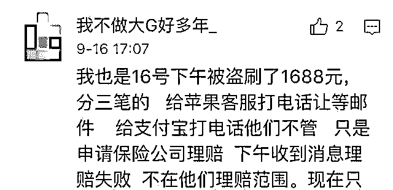

# iPhone 用户账号集体沦陷：700 多人被盗刷 ，苹果公司 : 无法退款！

> 原文：[`mp.weixin.qq.com/s?__biz=MzIyMDYwMTk0Mw==&mid=2247493554&idx=1&sn=c42e8e0d41303f4bbebcbd6f178500bc&chksm=97cb2c8aa0bca59c0175213906e817f7d97e0eb3232cad333422ea9dbf9683d82ee0c910e362&scene=27#wechat_redirect`](http://mp.weixin.qq.com/s?__biz=MzIyMDYwMTk0Mw==&mid=2247493554&idx=1&sn=c42e8e0d41303f4bbebcbd6f178500bc&chksm=97cb2c8aa0bca59c0175213906e817f7d97e0eb3232cad333422ea9dbf9683d82ee0c910e362&scene=27#wechat_redirect)

导语

苹果产品，曾被不少人认为是“最安全”的电子产品，但大量的盗刷事件开始让“神话”蒙灰，涉及金额从几百到上万不等，多数投诉无法得到解决。

如果你发现最近支付宝账单里出现 App Store&Apple Music 的大额消费，请小心被坏人盗刷。近日，全国多地数百名苹果手机用户投诉自己的苹果 ID 绑定的支付渠道发生莫名其妙的扣款，最高损失已达上万元，而苹果中国公司目前表示无法对这些用户退款。

据不完全统计，苹果 ID 被盗维权 QQ 群不低于 20 个，满 500 人群不低于 3 个；微博上“超 700 人苹果 ID 被盗刷”话题阅读量超 3061 万，超过 3609 条帖子讨论，单条热门微博下留言超 2610 条。

支付宝官方微博也发布了关于苹果手机的安全提示。支付宝称检测到部分苹果用户 ID 被盗遭到资金损失。支付宝已联系苹果公司，希望其尽快定位被盗原因。目前苹果公司已回复正在积极解决，支付宝建议苹果用户调低免密支付额度以最大限度保护资产安全。

事件盘点

 新京报就此事件进行了报道：

《多地出现苹果 ID 盗刷？支付宝：已联系苹果，建议调低免密支付》

[`v.qq.com/iframe/preview.html?width=500&height=375&auto=0&vid=x07416jrfhp`](https://v.qq.com/iframe/preview.html?width=500&height=375&auto=0&vid=x07416jrfhp)

事件一：

9 月 24 日晚上，湖北武汉的刘女士 1 分钟内收到两条支付宝通知，分别显示在 App Store&Apple Music 成功付款 1000 元。

随后，她查看了自己的 Apple ID 近 90 天内的购买记录，记录显示，她当天为 Apple ID“充值”了三笔费用，分别是 1000 元、1000 元和 100 元。她还为一款名叫“魔域口袋版”的游戏“购买”了 3 笔价值 648 元的“魔石”，另购买了一款名为“传奇世界”游戏价值 45 元和 98 元的“元宝”。状态都是“待付款”，几分钟后都变成了“已完成”。

这些游戏她从来没听过，更别提下载了。刘女士查询到苹果公司当晚一份“操作提醒”邮件，显示她的苹果 ID 在 iPhone6 上登录了 iCloud。

但刘女士仅有 iPhone6Plus 一台苹果设备。刘女士断定自己是“被盗号了。” 她前前后后联系苹果客服“4006668800”8 次，但对方除了表示“同情”，就是在提交系统审核后告知其无法退款，没有理由。

即使刘女士向上海消费者保护委员会请求协助申诉之后，苹果方面的回复结果依然是无法退款。

## 事件二：

10 月 9 日, 袁先生陆续收到几封苹果发来的邮件和微信支付信息：

20：58，收到“您的 Apple ID 被用于在 iPad 上登录 iCloud”的邮件；

21：26，收到“您已为 Apple ID 启用双重认证”的邮件；

21：33 开始被对方连续盗刷 5 笔，合计 4310 元，全部充值到了一个名为“远征手游-无兄弟，不远征”的游戏平台中。

“有收到邮件提醒，但根本没时间改密码，马上就被刷走了，而且变更邮件和微信支付提醒几乎是同时收到，还有什么用？”袁先生讲，“21 点 57 分我就取消了对方设置的双重验证，还看到了‘他’的号码，黑龙江的，打过去通了没人接。”

大多数消费者被盗刷的经过与袁先生相似，不少人绑定的是网易邮箱、QQ 邮箱，且未给邮箱设置来信提醒，也没有看邮箱的习惯，收到支付信息才意识到被盗刷充值了游戏点券、元宝、钻石、魔石等。

以下为其他盗刷用户案例：

维权进展：大多数不成功，少数退全额

**本次事件维权群截图**

**群内受害者盗刷记录（昵称）**

500 人维权 QQ 群里，不断有人发来收到苹果工程部的回复以及申请退款审核通过的消息，有些用户退了全款，也有人只退了一部分，他们分享成功经验，"找苹果高级客服，一个不行多换几个"。

但绝大数人一分钱都没退，"客服说没有办法，系统退不了。"同样是被盗刷，为何有的人没退呢？不少消费者尝试联系消协，工商，甚至报警，希望得到一个公平的解决，"再也不用苹果了"不止一个人在群里吐槽到。

盗刷“洗钱”？

维权群的群主告诉我们，自 9 月 5 日建群，群友反映被盗刷的钱多数被充值到各类游戏平台。

|  |  |
|  |  |

**被盗刷的受害者提供给我们的交易截图**

拒不完全统计，被盗刷充值的游戏有腾讯的王者荣耀、奇迹：觉醒、斗破苍穹：斗帝之路，37 游戏的大天使之剑 H5-奇迹 MU 正版授权，游族的少年三国志-全新武将登场、西游女儿国-修仙角色扮演仙侠手游、天使纪元，网易的狼人杀，天晴数码的魔域口袋版，北京易通幻龙的魔力宝贝，冰川的远征手游，捕鱼欢乐颂，NBA 篮球大师，刀剑斗神传等等。

以王者荣耀为例，黑客使用消费者的 Apple ID 在游戏内购买大量点券（人民币 1 块钱购 10 点券），则可用点券在游戏内兑换皮肤、积分等虚拟物品。

一位资深游戏玩家告诉我们，如果想要便宜购买游戏装备，不少人会通过淘宝、天猫和交易猫等平台，以及私下互加好友通过微信、支付宝进行交易。

比如 1688 点券的王者荣耀皮肤，淘宝上 65 折，110 元左右能买到，私底交易则是自行谈价。

“便宜但风险大，私下交易并不安全。卖家都会说自己来自正规渠道，可谁知道呢？”

黑客是否会利用游戏中的装备来“销赃”，一位游戏圈内人表示，不排除个人或团伙作案。

越热门的游戏越好赚，想要把游戏中的虚拟金币转出去有几种方式，一种是通过币商将游戏币批量倒手换成人民币，另一种是卖给个人用户。

一线游戏厂商不太可能会通过盗刷的方式来刷流水，厂商常通过与游戏渠道和公会合作返现，或促销礼包等方式促使玩家充钱。一般来说，厂商是会重点打击盗刷以及币商行为。

**闲鱼二手平台招点券代理的信息**

综合以上描述，我们得出被盗刷的原因：

第一，苹果 ID 没有开通双重验证，致使账号被盗；

第二，受害用户签约过免密自动扣款协议，不管签约的是支付宝、还是银行卡、还是微信支付。

责任在谁？

苹果大批量账号密码被盗，不免让人联想到诸如 CSDN、网易邮箱、B 站、携程、汉庭等大量平台曾被曝光疑似脱库。

当用户资料被泄露，黑客则可能对 Apple ID 进行撞库，若之前同样的账号登录过被脱库的网站，而刚好用户的 Apple ID 也是用该邮箱注册的密码一样，且未开通苹果的双重验证，黑客则能轻易登录消费了。

中国人对账号密码的保护不够敏感，是一夜之间进入互联网时代，又是一夜之间进入移动互联网时代，大多数中国用户都没有自己的邮箱，且没有广泛使用邮箱的习惯。像中国用户常用的微信、QQ，被异地登录时会有信息及时弹出，而苹果账号被盗后，大量消费者反映“注册苹果 ID 的邮箱难得上一次，看到支付信息提醒才发现自己被盗刷了。”

用户信息泄露源头，黑客盗窃、免密支付漏洞……苹果 ID 被盗刷的责任链条很长。但用户是无辜的，没有主动设置“双重验证”亦是企业未积极提示的后果。我们认为，商业公司不能把所有的问题甩给用户，无论是苹果、支付宝、微信等商业公司都应该承担起相关责任。

当大量用户反映被盗刷，苹果公司作为一个世界最具价值品牌之一的商业巨头却迟迟没有行动，是一种极度不负责任的行为。苹果公司完全可以优先对异地 IP 登录、用户历史行为甄别加一层检验，缓冲保护未开启双重验证的消费者，增加盗刷的难度。

**被盗刷后向苹果申请撤销交易失败（消费者供图）**

如何防范？

昨日（10 月 10 日）支付宝官方发博，给出建议：

**完整版**

其实，目前诸多消费 APP 都带有“免密支付”功能，用户付款时无需密码，几秒钟便可完成交易，带来了极大的便利。但是在支付页面，免密支付授权选项设置并不明显，而且平台已经默认勾选“授权”，多数用户注意不到该选项，就会出现莫名其妙开通“免密支付”的情况。

在支付商品款项时，应该仔细浏览付款页面，如果有“我同意”“授权”等字样的条款选项，要仔细浏览，不要轻易授权“免密支付”等功能。用户设置了免密支付后，支付过程不再需要任何密码或凭证，如果手机丢失，陌生人便可以拿着手机随意消费，为用户带来无穷隐患。

结尾

**最后，灰产圈提醒：** 

**不要开启免密支付**

**能解绑的就解绑**

**一定要开启双重认证**

**隔三岔五记得换一下密码**

**毕竟，**

**你卡里的钱不多，**

**好好的保护他们！**

●[苹果漏洞：5000 就能买 iPhoneX！](http://mp.weixin.qq.com/s?__biz=MzIyMDYwMTk0Mw==&mid=2247492591&idx=1&sn=e483bf1cb11a3acabfd3823dba56404c&chksm=97cb28d7a0bca1c137f8a4e3dcc40a9db3b86a1d6f933b06f816059da6deed8a0ad36fcaf168&scene=21#wechat_redirect)

●[这条灰色产业链曾让苹果公司损失 10 亿美元！](http://mp.weixin.qq.com/s?__biz=MzIyMDYwMTk0Mw==&mid=2247491953&idx=1&sn=f94b7f91f5515a9af3d69826dc1af6a9&chksm=97cb2a49a0bca35f5848133d5018e514054aa9f4b7e05f4fa82e84fb6fb59022cfe91fbe90e1&scene=21#wechat_redirect)

●[深度|揭秘苹果手游代充灰色产业链：起源于库存系统漏洞！](http://mp.weixin.qq.com/s?__biz=MzIyMDYwMTk0Mw==&mid=2247490278&idx=2&sn=372160fc772fe566b47231382a493ed1&chksm=97c8d1dea0bf58c8a832a20add3951c5fb93f0eed4aef424fe005990f04c446dd0f0ef73fa24&scene=21#wechat_redirect)

●[深度|在黑市里，苹果 iPhone 是这样被解锁的：解密苹果“被盗洗白”的地下产业链，暗无天日，深不见底！](http://mp.weixin.qq.com/s?__biz=MzIyMDYwMTk0Mw==&mid=2247488772&idx=1&sn=887a6b98e233cb6d5e54677547261f91&chksm=97c8de3ca0bf572a04809ce9511c4993cfabcf768afb8d4889622ead568ebc951055bd49cd00&scene=21#wechat_redirect)

   

**点击加入 ****灰产圈 | 高端社群**