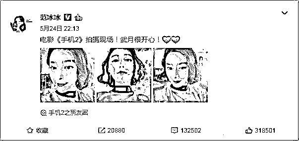

# 冰冰，凉凉？

> 原文：[`mp.weixin.qq.com/s?__biz=MzIyMDYwMTk0Mw==&mid=2247493450&idx=1&sn=930b7c211f1bb33a4b963a58d3098e99&chksm=97cb2c72a0bca564fd2f65c504cb97746a9083ee37d40c3db5d17aea8482e59ab135e5bdf663&scene=27#wechat_redirect`](http://mp.weixin.qq.com/s?__biz=MzIyMDYwMTk0Mw==&mid=2247493450&idx=1&sn=930b7c211f1bb33a4b963a58d3098e99&chksm=97cb2c72a0bca564fd2f65c504cb97746a9083ee37d40c3db5d17aea8482e59ab135e5bdf663&scene=27#wechat_redirect)

**点击上方蓝色字体“灰产圈”关注并置顶本公众号**

导语

昨天（10-3）中午，范冰冰“阴阳合同”事件，终于查清了！

新华社等官方媒体昨天（10 月 3 日）公布了冰冰所需补缴的税款、滞纳金以及罚款高达**8.84 亿**人民币！

由于属于首犯，在规定期限前缴纳罚款，就可以免除牢狱之灾。

同时冰冰在微博中发布致歉信(如下图)

致歉信内容如下：

冰冰消失的 120 多天

还记得 4 个多月前，范冰冰在自己的微博上发了一条状态，成为了后续事件的导火索。直到昨日，范冰冰已消失 120 多天。 

简单讲几个关键词：手机 1-手机 2-崔永元-阴阳合同-范冰冰 

（五个关键词概括整个事件的发展历程）

时至昨日，事情迎来了结果。

今天，一出大戏终于迎来了结局

大陆女星范冰冰逃漏税金额累计 2.55 亿元（人民币，下同），罚金 5.96 亿，滞纳金 0.33 亿，共计需补缴 8.84 亿元（新台币 39.2 亿），

各官媒都纷纷发表评论：

央视网指出，某些明星靠「刷脸」混成特殊人物，试图以脸蛋、以知名度解决一切的时代已经一去不复返。

《央视新闻》3 日下午 4 时以「不要以为脸蛋可以解决一切」为题发文指出，影视明星本是公众人物，一言一行的示范效应极大，但很遗憾的是，有些人不仅没有做到为人师表，甚至铤而走险，视公序良俗为无物，将法律法规当儿戏，把自己当做了法外人物，在全面依法治国的今天，范冰冰的这个案例希望能足以警醒那些梦中人了。

《人民日报》也对此评论，范冰冰偷逃税款案水落石出，8 亿多的追缴及「罚单」震动舆论。天价片酬、阴阳合同等久为诟病，涉税大案揭开了盖子，整饬影视业偷逃税问题迫在眉睫，这是一场全民法治课，法律面前没有特殊公民，越是公众人物，越需要洁身自好，依法纳税是义务，「如果仍有人哀之而不鉴之，结果也是凉冰冰。」

崔永元评论如下：

吃瓜群控也纷纷评论：

好了，敲黑板！打住！

灰产圈在这里给大家总结一下：

> 一、范冰冰及其担任法定代表人的企业少缴税款 2.48 亿元，其中偷逃税款 1.34 亿元。
> 
> 二、范冰冰所需补缴的税款、滞纳金以及罚款加在一起，超过 8 亿。
> 
> 三、范冰冰所受到的是税务机关的行政处罚，并没有构成犯罪。
> 
> 四、范冰冰的经纪人销毁会计凭证、会计账簿，涉嫌犯罪被公安机关采取刑事强制措施。
> 
> 五、国家税务总局已经开始问责程序，追究税务机关相关人员未依法履职的责任。
> 
> 六、税务部门已部署开展影视行业自查自纠，年底前主动补缴税款的免于行政处罚，拒不纠正的将依法严肃处理。

**评**：贫穷限制我的想像，几辈人的奋斗也没有 1 亿！感谢小崔，让我看了这么一场大戏！范冰冰！和谐社会救了你！让你免受牢狱之灾！

冰冰损失了什么？

我们（灰产圈）摘选了微博网友：@辣笔小球 的评论：

冰冰，凉凉，观后感

|  |  |  |

**（上图是《手机 2》冰冰的三连拍）**

一个娱乐圈的明星，拥有如此规模庞大的财富，令人咋舌！

一个演员，最重要的还是自我修养，否则拿的钱多，但是道德低下，就会导致德不配钱，必有殃灾。

发现没有？演过武则天的演员，很多都出事了，前有刘晓庆，后有范冰冰，难道是武则天此人过于霸气，普通人身弱，无法胜任，演了她，反而会带来祸端。

武则天，千古一女皇，太霸气了，普通人哪里能胜任？即使是所谓知名女演员，也还是躲远点为妙。

演了武则天，并没有得到武则天雄霸天下的结局，反而结局和杨贵妃一样，无比凄惨，这是宿命。

这真的是人生如戏，戏如人生，如果入戏太深，分不清是戏还是现实，走不出来，那么悲剧也就不远。

范冰冰宣称自己就是豪门，把自己当成现实中的武则天，那么必然傲慢，会让自己置于险境。

这出悲剧告诉我们，千万不要将自己的快乐建立在别人的痛苦上，更不要发微博嘚瑟自己很快乐。

结果一条嘚瑟快乐的微博，引发了这场风波，这可能是历史上最贵的一条微博，或者说代价最大的一条微博，8.8 亿没了。

历史告诉我们，千万不要公开秀恩爱，秀得越多，幸福消失得越快，这个宇宙，不但能量守恒，幸福和爱情也守恒，得要藏好，而不是公开炫耀。

范冰冰一出事，李晨就远走高飞，大难临头各自飞，很显然，后面的结局大家肯定也能猜到了。

范冰冰的这场风暴，对于娱乐圈来说，无异于一场地震，但这是好事，否则这些人拿着天价的片酬，剧组哪里还有钱去拍戏，中国电影和电视剧的质量可想而知。

娱乐圈的人士，该补缴税款的赶紧补缴，不要到头来不但钱没了，人还进去了，现在已经给了时间窗口，已经打开了一扇门。

法律面前人人平等，不管你演过武则天，还是演过杨贵妃，不管你台前风光无限，还是籍籍无名，该交的税还是要交。

结尾

|  |  |  |

冰冰事件再一次告诉我们： 

公道自在人心，多行不义必自毙，

人在做天在看，不是不报时候未到！

依法纳税，合理避税，做个遵纪守法的好公民！ 

毕竟，你我等普通人偷得起！但罚不起！

* * *

**点击进入**** 生财有道|商学院直播间**

# 

> 原文：[`mp.weixin.qq.com/s?__biz=MzIyMDYwMTk0Mw==&mid=2247493424&idx=1&sn=00ae5e3924382b7582b56f339b6f8e12&chksm=97cb2c08a0bca51ed3304d01a554a713505e17369195da200afb8bebd7db2b20f093ec5f788d&scene=27#wechat_redirect`](http://mp.weixin.qq.com/s?__biz=MzIyMDYwMTk0Mw==&mid=2247493424&idx=1&sn=00ae5e3924382b7582b56f339b6f8e12&chksm=97cb2c08a0bca51ed3304d01a554a713505e17369195da200afb8bebd7db2b20f093ec5f788d&scene=27#wechat_redirect)